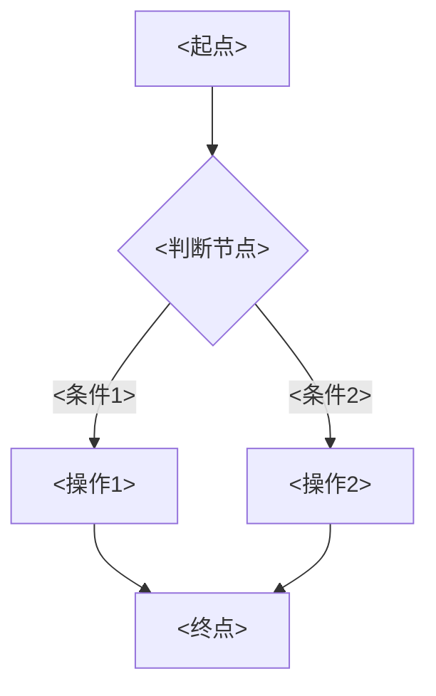
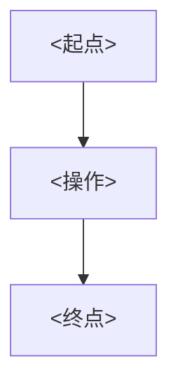

# <功能编号><功能名称>_ Analyst - Spec

> **需求编号**：<功能编号，如 BLGL-13-BASY-001>
> **父需求**：<模块编号，如 BLGL-13-BASY>
> **关联PM Spec**：<功能编号>_<功能名称>_PM-spec.md
> **Spec版本**：V1.0
> **编写时间**：<YYYY-MM-DD>
> **编写人**：需求分析师

---

## 一、功能编号体系

> 使用带父子层级的 `<功能编号>-ID` 编号，便于追溯和讨论。

### 1.1 功能层级结构

```
<功能编号>-001: <子功能点1名称>
  ├─ <功能编号>-001-01: <子项1>
  ├─ <功能编号>-001-02: <子项2>
  └─ <功能编号>-001-03: <子项3>

<功能编号>-002: <子功能点2名称>
```

> 📌 拆分依据：功能清单 md 中已列出的子功能点。不新增功能清单中不存在的子功能点。

### 1.2 功能编号表

| REQ-ID | 功能名称 | 类型 | 优先级 | 说明 |
|--------|---------|------|--------|------|
| <功能编号>-001 | <子功能点名称> | 功能 | P0 | <一句话说明> |
| <功能编号>-001-01 | <子项名称> | 功能 | P0 | <一句话说明> |

> 📌 类型：功能 / 子功能。优先级与 PM-Spec 一致。功能编号来自 Phase 1 功能点Spec 第5章，子编号从功能清单展开。

---

## 二、核心业务流程

> 每个主流程一个 Mermaid flowchart。**流程步骤必须能在需求原文中找到对应描述，不推测中间步骤。**

### 2.1 <流程名称1>



### 2.2 <流程名称2>



> 📌 至少 2 个 Mermaid 流程图。每个流程对应一个核心业务场景。

---

## 三、功能规格说明

> 每个 REQ-ID 展开详细描述，包含功能概述、用户角色、业务流程、验收标准。

---

### <功能编号>-001-01: <子功能点名称>

#### 3.x.1 功能概述

<一段话描述该子功能点的能力范围——来自功能清单的功能描述。>

#### 3.x.2 用户角色

| 角色 | 使用场景 | 权限要求 | 操作频率 |
|------|---------|---------|---------|
| <角色1> | <场景描述> | <权限要求> | <高频/中频/低频> |
| <角色2> | <场景描述> | <权限要求> | <频率> |

> 📌 角色必须在需求原文中出现过。操作频率从需求分析中归纳。

#### 3.x.3 业务流程（Given/When/Then）

##### 主流程（至少 1 个）

**Scenario 1: <主流程场景名称>**

```gherkin
Given:
  - <前置条件1>
  - <前置条件2>
  - <数据状态/系统配置>

When:
  - <用户操作1>
  - <用户操作2>
  - <系统响应>

Then:
  - <预期结果1>
  - <预期结果2>
  - <数据变化/界面表现>
```

##### 异常流程（至少 3 个）

**Scenario 2: <异常场景名称1（业务异常）>**

```gherkin
Given:
  - <前置条件>
  - <触发异常的条件>

When:
  - <触发异常的操作>

Then:
  - <系统错误处理行为>
  - <用户提示信息>
  - <状态保持不变/回滚>
```

**Scenario 3: <异常场景名称2（数据异常）>**

```gherkin
Given:
  - <前置条件>
  - <数据异常状态>

When:
  - <操作>

Then:
  - <错误处理>
  - <日志记录>
```

**Scenario 4: <异常场景名称3（系统异常）>**

```gherkin
Given:
  - <前置条件>
  - <系统异常状态>

When:
  - <操作>

Then:
  - <降级处理>
  - <用户提示>
```

##### 边界流程（至少 2 个）

**Scenario 5: <边界场景名称1（多值/空值）>**

```gherkin
Given:
  - <边界条件>

When:
  - <操作>

Then:
  - <边界处理结果>
```

**Scenario 6: <边界场景名称2（未配置/极端值）>**

```gherkin
Given:
  - <边界条件>

When:
  - <操作>

Then:
  - <边界处理结果>
```

> 📌 **每个 Given/When/Then 的内容必须在需求分析原文中有对应依据**。场景内容具体，不写"系统正常响应"等模糊表述。若资料区场景不足，写出已有内容，不足场景标记 `⏳ 待确认：[具体缺失场景描述]`。

#### 3.x.5 验收标准

| AC编号 | 验收标准 | 对应REQ-ID | 验证方法 | 验证场景 |
|--------|---------|-----------|---------|---------|
| AC-001 | <可验证标准> | <功能编号>-001-01 | <功能测试/性能测试/集成测试> | Scenario 1 |
| AC-002 | <可验证标准> | <功能编号>-001-01 | <验证方法> | Scenario 2 |

> 📌 AC 编号与 PM-Spec 保持一致。每个 AC 注明对应的 REQ-ID 和验证场景。

---

### <功能编号>-002: <下一个子功能点名称>

> 📌 重复 3.x.1 ~ 3.x.5 的结构。每个父级子功能点一个 `###` 章节。

---

## 四、排除范围

本需求不包含以下功能项：

1. **<排除项1>** - <说明归属>
2. **<排除项2>** - <说明归属>

> 📌 与 PM-Spec 第四章保持一致。对照 Phase 1 功能点Spec 第6章（基线能力），确保不越界。

---

## 五、业务规则清单

| 规则ID | 规则名称 | 规则描述 | 来源 | 优先级 |
|--------|---------|---------|------|--------|
| BR-001 | <规则名> | <规则描述> | 需求<编号> | P0 |
| BR-002 | <规则名> | <规则描述> | 需求<编号> | P1 |

> 📌 **每条 BR 注明来源需求编号**。规则描述必须能从需求原文中逐字对应，不得概括后失去原意。优先级与 PM-Spec 保持一致。

---

## 六、关联文档

| 文档类型 | 文档路径 | 说明 |
|---------|---------|------|
| 功能点Spec | <模块ID> <模块名称>功能点Spec.md（V1.0，上级目录） | Phase 1 功能点索引 |
| PM spec | 本目录 <功能编号>_<功能名称>_PM-spec.md（V0.1） | PM 产出的 Spec 文档 |
| -Spec | 本目录 <功能编号>_<功能名称>-Spec.md（V1.0） | Spec（研发视角） |
| data-model.md | 待产出 | 架构师产出的数据建模文档 |
| design.md | 待产出 | 架构师产出的技术方案文档 |
| api-contract.md | 待产出 | 开发经理产出的 API 契约文档 |

> 📌 第1行必须引用 Phase 1 功能点Spec。

---

## 七、待确认问题清单

| 编号 | 问题描述 | 缺失信息 | 影响范围 | 建议补充方 |
|------|---------|---------|---------|-----------|
| Q-001 | <具体描述> | <缺失什么信息> | <影响哪个章节> | <产品经理/需求分析师/模块负责人> |
| Q-002 | <具体描述> | <缺失什么信息> | <影响哪个章节> | <补充方> |

> 📌 逐条列出全文所有 `⏳ 待确认` 项。没有任何待确认项时写"本次需求资料区信息完整，无待确认问题"。

---

## 填写检查清单

| 序号 | 检查项 | 是否完成 |
|:----:|--------|:--------:|
| 1 | 功能编号带父子层级 | ⬜ |
| 2 | 每个 REQ-ID 有功能概述和用户角色 | ⬜ |
| 3 | 主流程至少 1 个 Given/When/Then 场景 | ⬜ |
| 4 | 异常流程至少 3 个 Given/When/Then 场景 | ⬜ |
| 5 | 边界流程至少 2 个 Given/When/Then 场景 | ⬜ |
| 6 | 每个 Given/When/Then 内容具体，不模糊 | ⬜ |
| 7 | 验收标准 AC 编号独立，可验证 | ⬜ |
| 8 | 验收标准 AC 编号独立，可验证 | ⬜ |
| 9 | 验收标准无"功能正常"等模糊表述 | ⬜ |
| 10 | 排除范围明确列出 | ⬜ |
| 11 | 业务规则清单列出所有规则，每条标注来源 | ⬜ |
| 12 | 流程图使用 Mermaid 格式（≥2 个） | ⬜ |
| 13 | 关联文档索引包含 Phase 1 功能点Spec | ⬜ |
| 14 | 待确认问题清单汇总了全文所有 ⏳ 项 | ⬜ |
| 15 | 全文无占位符 `< >` 残留 | ⬜ |
| 16 | 全文陈述可溯源至资料区（S1~S10 溯源核查） | ⬜ |
| 17 | 人工审核确认完成 | ⏳ 待确认 |

---

**文档状态**：⬜ 待审核
**维护责任**：需求分析师规范组
**下次更新**：根据评审反馈优化

---

## 版本历史

| 版本 | 日期 | 变更说明 | 编写人 |
|------|------|---------|--------|
| V1.0 | <YYYY-MM-DD> | 初始版本 | 需求分析师 |
