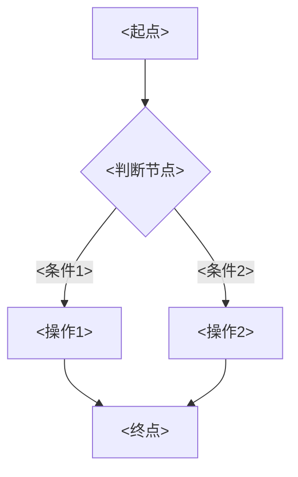

# <功能编号> <功能名称>- Spec

> **功能编号**：<功能编号，如 BLGL-13-BASY-001>
> **文档类型**：Spec（研发视角）
> **文档版本**：V1.0
> **编写时间**：<YYYY-MM-DD>
> **编写人**：RACC

---

## 文档索引

本节提供本文档的章节结构索引与关联文档索引，便于读者快速定位与检索。

#### 章节索引

**PM-Spec（业务视角）**

| 章节号 | 章节名称 | 内容说明 |
|--------|---------|---------|
| 一 | 目标 | <一句话描述PM-Spec的目标> |
| 二 | 约束 | 业务约束、技术约束、非功能性约束 |
| 三 | 验收标准 | 验收标准与验证方法 |
| 四 | 排除范围 | 本次不做、明确边界 |
| 五 | 关键决策记录 | 方案决策、其他决议 |
| 六 | 优先级 | 需求优先级说明 |
| 附录 | 填写检查清单 | 检查项与完成状态 |

**Analyst-Spec（产品视角）**

| 章节号 | 章节名称 | 内容说明 |
|--------|---------|---------|
| 一 | 功能编号体系 | 带父子层级的编号树 |
| 二 | 核心业务流程 | Mermaid 流程图 |
| 三 | 功能规格说明 | 各子功能点的概述、用户角色、业务流程、验收标准 |
| 四 | 排除范围 | 本需求不包含的功能项 |
| 五 | 业务规则清单 | 规则ID、规则名称、规则描述、优先级 |
| 六 | 关联文档 | 文档类型、文档路径、说明 |
| 七 | 待确认问题清单 | 所有 ⏳ 待确认项的汇总 |
| - | 填写检查清单 | 检查项与完成状态 |

**Spec（研发视角）**

| 章节号 | 章节名称 | 内容说明 |
|--------|---------|---------|
| 第1章 | 文档概述 | 文档目的、文档范围、术语定义、阅读指南、参考文档 |
| 第2章 | 功能背景与定位 | 功能背景、功能定位、目标用户、核心价值 |
| 第3章 | 业务流程设计 | 主流程/异常流程/边界流程（Given/When/Then） |
| 第4章 | 数据模型设计 | 核心数据结构、状态定义、系统参数定义 |
| 第5章 | 接口契约设计 | API列表、接口详细设计、错误码定义 |
| 第6章 | 技术方案设计 | 页面路径、技术栈、关键技术点、部署方案 |
| 第7章 | 测试用例预设计 | 功能/边界/异常/性能测试用例 |
| 第8章 | 非功能性要求 | 性能、安全、可用性、兼容性 |
| 第9章 | 依赖与风险 | 外部依赖、风险项 |
| 第10章 | 附录 | 流程图、时序图、参考文档 |

#### 版本历史

| 版本 | 日期 | 变更说明 | 编写人 |
|------|------|---------|--------|
| V1.0 | <YYYY-MM-DD> | 初始版本 | RACC |

#### 关联文档索引

| 序号 | 文档名称 | 文档类型 | 版本 | 位置 |
|------|---------|---------|------|------|
| 1 | <功能编号>_<功能名称>-Spec.md | Spec（研发视角）（本文档） | V1.0 | 本目录 |
| 2 | <功能编号>_<功能名称>_PM-spec.md | PM-Spec（业务视角） | V0.1 | 本目录 |
| 3 | <功能编号>_<功能名称>_Analyst-spec.md | Analyst-Spec（产品视角） | V1.0 | 本目录 |
| 4 | <模块ID> <模块名称>功能点Spec.md | 功能点Spec（模块级） | V1.0 | 上级目录 |

> 📌 第4项为 Phase 1 输出，必须引用。版本号与 Phase 1 功能点Spec 实际版本一致。

---

## 1、文档概述

### 1.1、文档目的

本文档旨在明确"<功能名称>"功能（<功能编号>）的业务背景与设计方案，为需求分析、研发实现、测试验收及评审提供统一的业务上下文、设计口径与决策依据。

**具体目的包括**：

1. 梳理<功能名称>功能的业务由来与历史需求演进脉络，说明"为什么要做"；
2. 明确功能的定位边界、目标用户与核心价值，回答"做成什么"；
3. 描述功能的业务流程、数据模型、接口契约与技术方案，回答"怎么做"；
4. 预设计测试用例并明确非功能性要求、依赖与风险，为研发与验收提供依据；
5. 作为 SPEC（功能编号体系、功能详情、业务规则、验收标准等章节）的业务前提与设计输入，保证各层文档业务口径一致。

> 📌 第1~2点对应业务层，第3~5点对应设计层。资料区的需求分析原文作为业务层素材，历史需求中的设计描述作为设计层素材。

### 1.2、文档范围

#### 1.2.1 纳入范围

本文档覆盖<功能名称>的完整业务背景与设计，包括：

- <纳入范围条目1>
- <纳入范围条目2>
- ...

> 📌 从 Phase 1 功能点Spec 第5章功能描述和资料区归纳，列出本功能点覆盖的核心能力域。

#### 1.2.2 排除范围

本文档不涉及以下内容（详见其他功能点或模块）：

- <排除项1：说明归属哪个功能编号或模块>
- <排除项2>
- ...

> 📌 对照 Phase 1 功能点Spec 第6章（基线能力）和第5章（其他功能点），明确划界。不可省略。

### 1.3、术语定义

| 术语 | 定义 |
|------|------|
| <术语1> | <定义——取自资料区原文或法规原文> |
| <术语2> | <定义> |

> 📌 仅列出本功能点特有的核心术语（通常5~10个）。每个术语有资料区直接或间接来源。无来源的术语标记 `⏳ 待确认：术语定义待来自XX文档`。

### 1.4、阅读指南

- **章节关系**：第1~2章为阅读铺垫与业务全貌（背景、定位、用户、价值）；第3~10章为设计实现层（流程、数据、接口、技术、测试、非功能、依赖风险、附录），可直接用于研发与测试。与 Analyst-Spec（产品视角）、PM-Spec（业务视角）的详细规则/验收口径互相引用，保持一致。
- **读者对象**：
  - 产品经理/需求分析师：阅读第1~2章了解业务全貌，据此维护 PM-Spec 与功能清单；
  - 研发：阅读第3~6章用于开发实现，第9~10章用于依赖评估与联调；
  - 测试：阅读第3章、第7~8章用于用例设计与验收；
  - 评审人员：以本文档为业务口径与设计基准，核对各层文档一致性。

### 1.5、参考文档

| 序号 | 文档名称 | 版本/日期 |
|------|---------|----------|
| 1 | 【历史需求】<需求xlsx文件名> | - |
| 2 | <功能编号>_<功能名称>_PM-spec.md | V0.1 |
| 3 | <功能编号>_<功能名称>_Analyst-spec.md | V1.0 |
| 4 | <模块ID> <模块名称>功能点Spec.md | <版本号> |
| 5 | <功能清单md文件名> | <日期> |

---

## 2、功能背景与定位

### 2.1 功能背景

<功能名称>是<模块定位中的角色>，需满足：

- **法规/规范依据**：<引用资料区中提到的法规或规范名称，如无则省略本行>
- **管理要求**：<从需求分析中归纳的管理层面的背景>
- **现状痛点**：<从需求分析中归纳的问题描述>
- **历史需求演进**：<梳理需求演进脉络——如何从早期版本逐步演进到当前状态>

> 📌 每个背景维度必须标注素材来源（法规名称/需求编号）。按"法规规范 → 管理要求 → 现状痛点 → 历史需求演进"组织。只写资料区有依据的内容。**无对应信息时省略该行，不编造。**

### 2.2 功能定位

"<功能名称>"是<产品线>-<模块名称>的<定位类型>，定位为：

- **<定位1>**：<一句话定位描述>
- **<定位2>**：<一句话定位描述>
- **<定位3>**：<一句话定位描述>

> 📌 3~5 个定位点，从功能清单和需求分析中归纳。每个定位点一句话说清。

### 2.3 目标用户

| 用户角色 | 主要使用场景 |
|---------|-------------|
| <角色1> | <场景描述> |
| <角色2> | <场景描述> |

> 📌 角色必须在需求原文或功能清单中出现过。不细化、不推测新角色。

### 2.4 核心价值

| 价值维度 | 价值描述 |
|---------|---------|
| <维度1（如合规性/效率提升/一致性等）> | <价值描述——从需求分析中归纳> |
| <维度2> | <价值描述> |

> 📌 与 Phase 1 功能点Spec 口径一致。价值维度不宜超过 7 个。每个价值描述有资料区依据。

---

## 3、业务流程设计（Given/When/Then）

> 📌 以下场景从资料区中的需求分析原文提取。每个场景的 Given/When/Then 内容必须有需求原文对应依据。若资料区场景不足，写出已有内容，不足场景标记 `⏳ 待确认：[具体缺失场景描述]`。

### 3.1 主流程

**Scenario 1: <主流程场景名称>**

```gherkin
Given:
  - <前置条件1>
  - <前置条件2>
  - <数据状态/系统配置/参数值>

When:
  - <用户操作1>
  - <用户操作2>
  - <系统自动处理行为>

Then:
  - <预期结果1>
  - <预期结果2>
  - <数据变化/界面表现/日志记录>
```

> 📌 主流程至少 1 个。内容具体，不写"系统正常响应"等模糊表述。

### 3.2 异常流程

**Scenario 2: <异常场景名称1（业务异常）>**

```gherkin
Given:
  - <前置条件>
  - <触发异常的条件（如配置不满足、数据不合法）>

When:
  - <触发异常的操作>

Then:
  - <系统错误处理行为>
  - <用户提示信息>
  - <状态保持不变/回滚>
```

**Scenario 3: <异常场景名称2（数据异常）>**

```gherkin
Given:
  - <前置条件>
  - <数据异常状态（如接口返回异常值、映射失败）>

When:
  - <操作>

Then:
  - <错误处理>
  - <日志记录>
  - <降级行为>
```

**Scenario 4: <异常场景名称3（系统异常）>**

```gherkin
Given:
  - <前置条件>
  - <系统异常状态（如接口超时、服务不可用）>

When:
  - <操作>

Then:
  - <降级处理（如留空、提示重试）>
  - <用户提示>
  - <日志记录>
```

> 📌 异常流程至少 3 个，覆盖业务异常 / 数据异常 / 系统异常各至少 1 个。

### 3.3 边界流程

**Scenario 5: <边界场景名称1（多值/空值）>**

```gherkin
Given:
  - <边界条件>

When:
  - <操作>

Then:
  - <边界处理结果>
```

**Scenario 6: <边界场景名称2（未配置/极端值）>**

```gherkin
Given:
  - <边界条件>

When:
  - <操作>

Then:
  - <边界处理结果>
```

> 📌 边界流程至少 2 个。

---

## 4、数据模型设计

> 📌 以下数据模型信息必须来自资料区（功能清单的数据表清单、历史需求中的表名/字段名/概念ID）。资料区无信息的章节标记 `⏳ 待确认`，**不编造表名/字段/概念ID**。

### 4.1 核心数据结构

#### 4.1.1 核心保存请求

| 字段名 | 类型 | 必填 | 备注 |
|--------|------|------|------|
| <字段名> | <类型> | <是/否> | <说明> |

> 📌 字段必须来自资料区。如果资料区中有明确的请求结构描述就填这里，没有则写 `⏳ 待确认`。

#### 4.1.2 核心表/实体

| 表/实体 | 关键字段 | 说明 |
|---------|---------|------|
| <表名> | <关键字段列表> | <存储内容和说明> |

> 📌 表名和字段必须来自功能清单的数据表清单或历史需求原文。无资料区来源时写 `⏳ 待确认`。

### 4.2 状态定义

| 状态码 | 状态名称 | 说明 |
|--------|---------|------|
| <状态码> | <状态名称> | <说明> |

> 📌 状态码和名称必须来自资料区。无状态定义时写"⏳ 待确认：状态定义未在资料区中找到"。

### 4.3 系统参数定义

| 参数编码 | 参数名称 | 说明 |
|---------|---------|------|
| <参数编码> | <参数路径+参数名> | <默认值和说明> |

> 📌 参数必须来自功能清单的参数配置说明表或历史需求原文。无参数时写"⏳ 待确认"。

---

## 5、接口契约设计

> 📌 接口列表和详细设计必须来自资料区（历史需求xlsx中的接口描述、功能清单中的数据流向说明）。资料区无接口信息的，标记 `⏳ 待确认` 并从资料区已提及的外部系统反推接口类型。

### 5.1 API列表

| 序号 | API名称（代码函数） | 路径 | 方法 | 说明 |
|:----:|---------|------|:----:|------|
| 1 | <API名称> | <路径> | <方法> | <说明> |

> 📌 无具体接口信息时，可列出资料区中提及的系统交互关系（如"调用XX系统获取XX数据"），不编造路径和函数名。

### 5.2 接口详细设计

#### 5.2.1 <接口名称>

**请求参数**:
```json
{
  "<字段名>": "<示例值>",
  "<字段名2>": "<示例值2>"
}
```

**返回值（成功）**:
```json
{
  "success": true,
  "data": {
    "<字段名>": "<示例值>"
  }
}
```

**返回值（失败）**:
```json
{
  "success": false,
  "message": "<错误信息>",
  "data": null
}
```

> 📌 **接口字段名、请求/返回结构必须来自资料区中的接口描述或API文档**。无资料区来源时写 `⏳ 待确认：接口契约待来自API文档或设计评审`。

### 5.3 错误码定义

| 错误码 | 错误信息 | 处理方式 |
|--------|---------|---------|
| <错误码> | <错误信息> | <处理方式> |

> 📌 错误码来自资料区中提及的异常处理描述。无资料时写 `⏳ 待确认`。

---

## 6、技术方案设计

> 📌 技术方案信息来自资料区中的代码架构描述或用户提供的代码仓库信息。资料区无信息的章节标记 `⏳ 待确认`。

### 6.1 页面路径

- **页面路径**: <前端页面或组件路径，来自代码架构信息>
- **路由**: <路由配置说明>
- **核心逻辑模块**: <涉及的Service/Controller/Listener>

> 📌 无代码信息时写 `⏳ 待确认：代码架构信息未在资料区中找到`。

### 6.2 技术栈

| 类别 | 技术 | 版本 |
|------|------|------|
| 前端框架 | <前端框架> | <版本> |
| 后端框架 | <后端框架> | <版本> |

> 📌 无信息时写 `⏳ 待确认`。

### 6.3 关键技术点

<从资料区中的开发者设计或需求分析中提取的关键技术实现要点。无信息时写 `⏳ 待确认`。>

### 6.4 部署方案

<部署方案描述，来自资料区或用户提供的信息。无信息时写 `⏳ 待确认`。>

---

## 7、测试用例预设计

> 📌 测试用例从第3章业务流程和资料区需求分析的场景归纳。Given/When/Then 与第3章保持一致。

### 7.1 功能测试

| 用例编号 | 测试场景 | Given | When | Then |
|---------|---------|-------|------|------|
| <TC-001> | <场景名> | <前置条件> | <操作> | <预期结果> |

### 7.2 边界测试

| 用例编号 | 测试场景 | Given | When | Then |
|---------|---------|-------|------|------|
| <TC-00X> | <边界场景> | <前置条件> | <操作> | <预期结果> |

### 7.3 异常测试

| 用例编号 | 测试场景 | Given | When | Then |
|---------|---------|-------|------|------|
| <TC-00X> | <异常场景> | <前置条件> | <操作> | <预期结果> |

### 7.4 性能测试

| 用例编号 | 测试场景 | 指标 |
|---------|---------|------|
| <TC-00X> | <场景> | <指标描述> |

---

## 8、非功能性要求

> 📌 **指标数值必须来自资料区**。资料区无指标的写 `⏳ 待确认`，**不填默认值或行业通用值**。

### 8.1 性能要求

| 指标 | 要求 |
|------|------|
| <指标名> | ⏳ 待确认 |

### 8.2 安全要求

| 要求 | 说明 |
|------|------|
| <安全要求> | <说明> |

**医疗行业特殊要求**

| 要求 | 说明 |
|------|------|
| <行业要求> | <说明> |

> 📌 L1 核心功能必须标注医疗行业特殊要求（如审计、隐私、患者安全）。

### 8.3 可用性要求

| 指标 | 要求值 |
|------|--------|
| <指标名> | ⏳ 待确认 |

### 8.4 兼容性要求

| 类型 | 要求 |
|------|------|
| <兼容项> | <说明> |

> 📌 资料区中有兼容性描述的填上，没有的写 `⏳ 待确认`。

---

## 9、依赖与风险

### 9.1 外部依赖

| 依赖项 | 说明 |
|--------|------|
| <系统/服务> | <依赖原因——来自功能清单的数据流向说明或历史需求的接口描述> |

> 📌 依赖项从资料区的数据流向说明和需求分析中提取。无信息时写 `⏳ 待确认`。

### 9.2 风险项

| 风险项 | 等级 | 说明 | 应对方案 |
|--------|------|------|---------|
| <风险描述> | <高/中/低> | <原因> | <应对措施> |

> 📌 风险从需求分析中的问题描述和开发者设计中的注意事项归纳。无信息时写"⏳ 待确认"。

---

## 10、附录

### 10.1 流程图



> 📌 至少 1 个流程图，覆盖核心业务场景。**流程步骤必须能在需求原文中找到对应描述。**

### 10.2 时序图

```mermaid
sequenceDiagram
    participant <角色/前端>
    participant <后端服务>
    participant <外部系统>
    <角色/前端>->><后端服务>: <请求>
    <后端服务>->><外部系统>: <调用>
    <外部系统>-->><后端服务>: <返回>
    <后端服务>-->><角色/前端>: <响应>
```

> 📌 至少 1 个时序图，展示本功能与外部系统的交互时序。**交互节点必须能在需求原文或数据流向说明中找到依据。**

### 10.3 参考文档

- <功能清单md文件名>（<关键章节>）
- 【历史需求】<需求xlsx文件名>（<涉及本功能的关键需求编号列表>）
- <模块ID> <模块名称>功能点Spec.md（<版本号>）
- 关联Spec: <同级其他功能点的 -Spec 文件名>（<关联说明>）

> 📌 记录本文档引用到的全部资料区文档和关联Spec。

---

## 填写检查清单

| 序号 | 检查项 | 是否完成 |
|:----:|--------|:--------:|
| 1 | 章节索引与正文章节一致 | ⬜ |
| 2 | 版本历史记录完整 | ⬜ |
| 3 | 关联文档索引已登记全部Spec | ⬜ |
| 4 | 文档目的明确回答"为什么做/做成什么/怎么做" | ⬜ |
| 5 | 纳入范围/排除范围清晰 | ⬜ |
| 6 | 术语定义覆盖关键概念，从资料区可溯源 | ⬜ |
| 7 | 参考文档已登记 | ⬜ |
| 8 | 功能背景基于法规/规范/需求来源组织 | ⬜ |
| 9 | 功能定位体现业务价值（3~5个定位点） | ⬜ |
| 10 | 目标用户角色覆盖完整，在需求原文中有出处 | ⬜ |
| 11 | 核心价值可陈述，与 Phase 1 口径一致 | ⬜ |
| 12 | 业务流程：主流程≥1、异常≥3、边界≥2，Given/When/Then 具体 | ⬜ |
| 13 | 数据模型：字段/表/状态/参数可溯源（概念ID/表名/参数编码） | ⬜ |
| 14 | 接口契约：API列表+详细设计+错误码齐全（资料区有信息时）或标记待确认 | ⬜ |
| 15 | 技术方案：页面路径/技术栈/关键点/部署方案（资料区有信息时）或标记待确认 | ⬜ |
| 16 | 测试用例：功能/边界/异常/性能覆盖，与第3章场景对应 | ⬜ |
| 17 | 非功能性要求：性能/安全/可用性/兼容性指标可量化或标记待确认 | ⬜ |
| 18 | 依赖与风险：外部依赖登记完整，风险有具体应对方案或标记待确认 | ⬜ |
| 19 | 附录：流程图/时序图与正文流程一致 | ⬜ |
| 20 | 全文无占位符 `< >` 残留 | ⬜ |
| 21 | 全文陈述可溯源至资料区，无来源的已标记 ⏳ | ⬜ |
| 22 | 人工审核确认完成 | ⏳ 待确认 |

---

**文档状态**：⬜ 待审核
**维护责任**：RACC
**下次更新**：根据评审反馈优化
