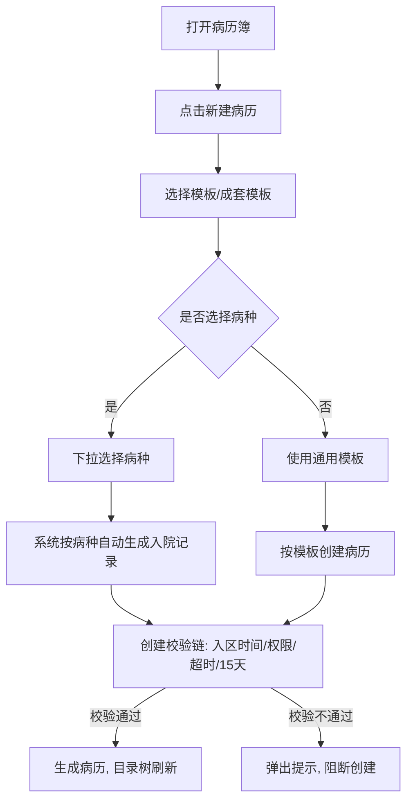
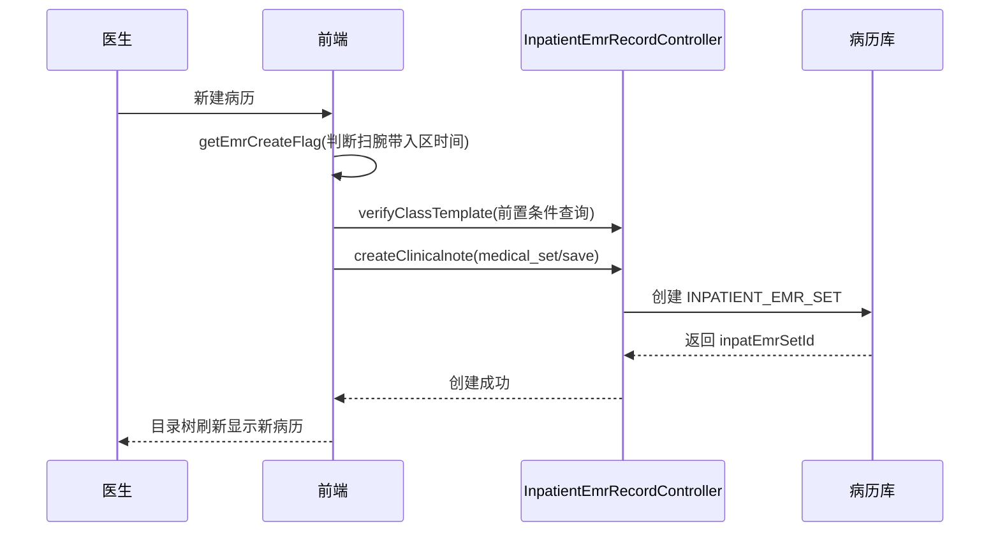

# BLGL-01-BLSX-001 病历创建与模板管理 - Spec

> **功能编号**：BLGL-01-BLSX-001
> **文档类型**：功能Spec（业务背景与设计）
> **文档版本**：V1.0
> **编写时间**：2026-08-15
> **编写人**：RACC

---

## 文档索引

#### 章节索引

**Spec（研发视角）**

| 章节号 | 章节名称 | 内容说明 |
|--------|---------|---------|
| 1、 | 文档概述 | 文档目的、文档范围、术语定义、阅读指南、参考文档 |
| 2、 | 功能背景与定位 | 功能背景、功能定位、目标用户、核心价值 |
| 3、 | 业务流程设计 | 主流程/异常流程/边界流程（Given/When/Then） |
| 4、 | 数据模型设计 | 核心数据结构、状态定义、系统参数定义 |
| 5、 | 接口契约设计 | API列表、接口详细设计、错误码定义 |
| 6、 | 技术方案设计 | 页面路径、技术栈、关键技术点、部署方案 |
| 7、 | 测试用例预设计 | 功能/边界/异常/性能测试用例 |
| 8、 | 非功能性要求 | 性能、安全、可用性、兼容性 |
| 9、 | 依赖与风险 | 外部依赖、风险项 |
| 10、 | 附录 | 流程图、时序图、参考文档 |

**PM-Spec（业务视角）**

| 章节号 | 章节名称 | 内容说明 |
|--------|---------|---------|
| 一 | 目标 | 功能定位与核心价值 |
| 二 | 约束 | 业务/技术/非功能性约束 |
| 三 | 验收标准 | 验收条件与验证方法 |
| 四 | 排除范围 | 本次不做项与明确边界 |
| 五 | 关键决策记录 | 方案决策与选型理由 |
| 六 | 优先级 | 优先级定义 |
| 七 | 关联文档 | 关联文档索引 |
| 附录 | 填写检查清单 | 质量检查 |

**Analyst-Spec（产品视角）**

| 章节号 | 章节名称 | 内容说明 |
|--------|---------|---------|
| 一 | 功能编号体系 | 功能编号与层级结构 |
| 二 | 核心业务流程 | 核心业务流程与时序 |
| 三 | 功能规格说明 | 详细功能规格与验收标准 |
| 四 | 排除范围 | 排除范围 |
| 五 | 业务规则清单 | 业务规则清单 |
| 六 | 关联文档 | 关联文档索引 |
| 七 | 待确认问题清单 | 待确认问题汇总 |
| - | 填写检查清单 | 质量检查 |

#### 版本历史

| 版本 | 日期 | 变更说明 | 编写人 |
|------|------|---------|--------|
| V1.0 | 2026-08-15 | 初始版本 | RACC |

#### 关联文档索引

| 序号 | 文档名称 | 文档类型 | 版本 | 位置 |
|------|---------|---------|------|------|
| 1 | BLGL-01-BLSX-001_病历创建与模板管理_PM-spec.md | PM-Spec（业务视角） | V0.1 | 本目录 |
| 2 | BLGL-01-BLSX-001_病历创建与模板管理_Analyst-spec.md | Analyst-Spec（产品视角） | V1.0 | 本目录 |
| 3 | BLGL-01-BLSX-001_病历创建与模板管理-Spec.md | Spec（研发视角）（本文档） | V1.0 | 本目录 |
| 4 | BLGL-01-BLSX 01病历书写功能点Spec.md | 功能点Spec（模块级） | V1.0 | 上级目录 |

---

## 1、文档概述

### 1.1、文档目的

本文档旨在明确"病历创建与模板管理"功能（BLGL-01-BLSX-001）的业务背景与设计方案，为需求分析、研发实现、测试验收及评审提供统一的业务上下文、设计口径与决策依据。

**具体目的包括**：

1. 梳理病历创建与模板管理功能的业务由来与历史需求演进脉络，说明"为什么要做"；
2. 明确功能的定位边界、目标用户与核心价值，回答"做成什么"；
3. 描述功能的业务流程、数据模型、接口契约与技术方案，回答"怎么做"；
4. 预设计测试用例并明确非功能性要求、依赖与风险，为研发与验收提供依据；
5. 作为 SPEC（功能编号体系、功能详情、业务规则、验收标准等章节）的业务前提与设计输入，保证各层文档业务口径一致。

### 1.2、文档范围

#### 1.2.1 纳入范围

本文档覆盖病历创建与模板管理的完整业务背景与设计，包括：

- 病历创建：住院医生根据患者就诊情况选择模板/成套模板创建病历，支持单个创建、批量创建、一键创建、病历替换
- 病种模板自动生成：根据患者门诊诊断/主诊断自动判断病种并生成病种入院记录文书
- 创建校验：创建前规则校验（如 15 天再入院提醒、超时限制、出区限制、首程校验）、病历簿创建
- 模板选择与标题：模板选择弹框（模板预览模式）、新建时修改模板名称、模板标题默认医生、成套模板配置

#### 1.2.2 排除范围

本文档不涉及以下内容（详见其他功能点或模块）：

- 病历编辑与保存（模板内容编辑/缺省值/快捷键）—— BLGL-01-BLSX-002
- 病历签署—— BLGL-01-BLSX-003
- 病历提交与撤销提交 —— BLGL-01-BLSX-004
- 病历审签阅改 —— BLGL-01-BLSX-005
- 手术记录 —— BLGL-01-BLSX-006
- 病历克隆/复制 —— BLGL-01-BLSX-012（克隆复制属病历复制语义，创建属新建语义）
- 模板定义态维护（模板目录/模板制作）—— 属 BLGL-12-MBGL 模板管理

### 1.3、术语定义

| 术语 | 定义 |
|------|------|
| 病历 | 住院电子病历文书（EMR SET），按监控类型（模板）创建，对应表 INPATIENT_EMR_SET |
| 监控类型（模板） | 病历监控类型（MRT Monitor），决定病历的分类与模板，如入院记录、首次病程记录 |
| 成套模板 | 按业务场景一次性创建一组病历的模板集合 |
| 病种模板 | 根据病种自动生成的入院记录模板，减少病种模板制作工作量 |
| 病历簿 | 患者本次住院的病历集合载体（RHB Record），承载全部文书 |

### 1.4、阅读指南

- **章节关系**：第1~2章为业务全貌，第3~10章为设计实现层。与 Analyst-Spec、PM-Spec 互相引用保持一致。
- **读者对象**：产品经理/需求分析师读第1~2章；研发读第3~6、9~10章；测试读第3、7~8章；评审人员核对各层一致性。

### 1.5、参考文档

| 序号 | 文档名称 | 版本/日期 |
|------|---------|----------|
| 1 | 【历史需求】住院病历的历史需求.xlsx | - |
| 2 | BLGL-01-BLSX-001_病历创建与模板管理_PM-spec.md | V0.1 |
| 3 | BLGL-01-BLSX-001_病历创建与模板管理_Analyst-spec.md | V1.0 |
| 4 | BLGL-01-BLSX 01病历书写功能点Spec.md | V1.0 |
| 5 | 病历书写_功能清单_20260327_151500.md | 2026-03-27 |

---

## 2、功能背景与定位

### 2.1 功能背景

病历创建与模板管理是病历书写模块的起点功能，需满足：

- **现状痛点**：医生书写病历需跨系统查阅检验结果并手动转抄，效率低；病种模板制作工作量大
- **管理要求**：医生只能编辑所属诊疗组负责的患者的病历，诊疗组模式需控制新增病历权限
- **历史需求演进**：从新建病历 → 病种模板自动生成 → 成套模板 → 模板预览模式/模板名称修改 → 创建校验（15天再入院提醒、超时控制）→ 病历替换 → 历史病历整体复制

### 2.2 功能定位

"病历创建与模板管理"是 WiNEX 病历管理-病历书写的起点功能点，定位为：

- **病历入口**：病历簿内所有文书创建的入口，支持单建/批量/成套/一键创建
- **病种智能生成**：根据门诊诊断自动创建病种入院记录文书
- **创建前置校验**：权限/时限/出区/15天再入院等校验，保障病历创建合规

### 2.3 目标用户

| 用户角色 | 主要使用场景 |
|---------|-------------|
| 住院医师 | 病历簿新建病历、选择模板/成套模板、病种模板选择 |
| 护士 | 创建特定病历（入院评估单、血栓风险评估单），后续医生站查看并签名 |
| 规培生/实习生 | 创建病历（受规培生权限控制） |

### 2.4 核心价值

| 价值维度 | 价值描述 |
|---------|---------|
| 效率提升 | 病种模板自动生成减少模板制作工作量；成套模板一键创建一组病历 |
| 合规保障 | 创建前校验（诊疗组权限/超时/出区/15天再入院）保障病历创建合规 |
| 数据准确性 | 病历替换时原内容同步到新病历相同概念ID元素 |

---

## 3、业务流程设计（Given/When/Then）

### 3.1 主流程

**Scenario 1: 住院医生创建入院记录（含病种模板自动生成）**

```gherkin
Given:
  - 住院医生已打开病历簿（住院病历书写界面）
  - 患者存在门诊诊断主诊断
  - 参数"是否启用'该患者15天内再次入院'提醒"为否（默认）

When:
  - 医生点击"新建病历"（或"+"/右键新增/待书写-去书写）
  - 系统弹窗选择模板，模板选择框下拉选择病种（根据门诊主诊断判断病种）
  - 医生选择病种/模板并点击确定

Then:
  - 系统根据病种自动创建病种入院记录文书
  - 病历簿目录树刷新，显示新建病历
```

（通过待书写新建的入院记录根据门诊诊断主诊断自动创建病种入院记录；病历簿新建时弹框下拉选择病种）

**Scenario 2: 成套模板批量创建病历**

```gherkin
Given:
  - 参数"个人成套模板维护是否开启适用范围选择"为是
  - 医生已维护个人成套模板

When:
  - 医生在新建病历弹窗切换到"成套模板"
  - 勾选成套模板并确认创建

Then:
  - 系统按成套模板一次性创建一组病历
  - 批量创建时展示 loading 效果（创建过多场景）
```

（住院医生站-日常管理-模板管理-个人成套模板管理；成套模板创建时可能存在创建过多的情况，需要展示loading效果）

### 3.2 异常流程

**Scenario 3: 业务异常——病历超时限制拦截创建**

```gherkin
Given:
  - 参数"支持修改病历时间的病历分类"已配置超时限制的病历分类
  - 患者当前病历已超时

When:
  - 医生点击"待书写-去书写"或新增病历

Then:
  - 系统判断病历限制，不允许直接创建
  - 弹出提示（同点击新增时的提示），超时病历需在"待书写"上方进行书写
```

（修改病历创建接口，判断病历限制时，不允许直接创建；点击【去书写】时弹出提示）

**Scenario 4: 数据异常——病种模板已停用/删除**

```gherkin
Given:
  - 参数"历史病历整体复制是否使用最新模板"为是
  - 历史病历对应的病历模板已停用或删除

When:
  - 医生发起历史病历整体复制

Then:
  - 系统提示"当前历史病历对应的病历模板已经停止使用，无法使用整体复制功能"
  - 不执行整体复制
```

（当历史病历的病历模板已经停用或者删除了需提示）

**Scenario 5: 系统异常——模板树查询接口异常**

```gherkin
Given:
  - 模板选择弹框依赖的模板树接口（queryClinicalnoteTemplateTree）异常

When:
  - 医生点击"新建病历"打开模板选择弹框

Then:
  - 模板树不展示，提示加载失败
  - 医生可重试
```

（接口异常降级处理，类似接口异常场景）

### 3.3 边界流程

**Scenario 6: 边界——患者无主诊断**

```gherkin
Given:
  - 患者不存在主诊断

When:
  - 医生在病历簿新建入院记录

Then:
  - 医生可自主选择病种或不选择病种
  - 不选择病种时，使用通用入院记录模板
```

（患者不存在主诊断的情况下，医生可自主选择病种或者不选择病种，不选择病种的情况下，选择的入院记录模板是通过的入院记录模板）

**Scenario 7: 边界——15天内再入院提醒（参数开启）**

```gherkin
Given:
  - 参数"是否启用'该患者15天内再次入院'提醒"为是
  - 本次入区日期-上次出区日期 ≤ 15 天

When:
  - 医生第一次新增病历（点击新增/+/右键新增/待书写-去书写）

Then:
  - 弹出橙色轻提醒"该患者15天内再次入院"
  - 仅提醒，不阻断新增病历流程
```

（弹出橙色轻提醒，只是提醒，不阻断新增病历流程）

---

## 4、数据模型设计

### 4.1 核心数据结构

#### 4.1.1 核心保存请求（创建病历入参）

| 字段名 | 类型 | 必填 | 备注 |
|--------|------|------|------|
| inpEmrClassId | Long | 是 | 病历分类（病历目录） |
| inpMrtMonitorId | Long | 是 | 监控类型/模板（决定病历模板） |
| inpEmrSetTitle | String | 否 | 病历标题 |
| encounterId | Long | 是 | 就诊标识 |
| cloneEmrSetId | Long | 否 | 克隆源病历 ID（整体复制场景） |
| channelSourceCode | String | 否 | 渠道来源编码（克隆场景） |

#### 4.1.2 核心表/实体

| 表/实体 | 关键字段 | 说明 |
|---------|---------|------|
| INPATIENT_EMR_SET（InpatientEmrSetPO） | INP_EMR_SET_ID、INP_EMR_CLASS_ID（病历分类）、INP_MRT_MONITOR_ID（监控类型）、INP_EMR_SET_TITLE（标题）、INP_EMR_STATUS（状态）、INP_EMR_SET_CREATED_AT（创建时间） | 病历主表，每条病历一条记录 |
| INPATIENT_RHB_RECORD（InpatientRhbRecordPO） | INP_RHB_RECORD_ID、ADMISSION_NUMBER（住院号）、PATIENT_ID、PATIENT_NAME、BED_NO、ENCOUNTER_ID、WARD_DISCHARGED_AT/DISCHARGED_AT | 病历簿，承载患者全部文书 |
| INPATIENT_EMR_RECORD（InpatientEmrRecordPO） | INP_EMR_RECORD_ID、INP_EMR_SET_ID、INP_EMR_STATUS、CREATED_BY/CREATED_AT | 病历记录表，记录创建人/状态 |

### 4.2 状态定义

| 状态码 | 状态名称 | 说明 |
|--------|---------|------|
| 960074 | 新建 | 病历刚创建未书写 |
| 390030405 | 草稿 | 已暂存/编辑中的病历 |
| 390030406 | 已签署 | 已签名病历 |

### 4.3 系统参数定义

| 参数编码 | 参数名称 | 说明 |
|---------|---------|------|
| 待确认 | 是否启用"该患者15天内再次入院"提醒 | 本次入区日期距上次出区≤15天时首次新增病历时提醒，{是，否}，默认否 |
| 待确认 | 是否允许更改病历起草者 | 开启后病历起草者变更的权限控制 |
| 待确认 | 病历记录时间往前/后推移天数（COMMON005/006） | 病历记录时间允许修改的范围（功能清单公共参数） |
| 待确认 | 支持修改病历时间的病历分类（COMMON007） | 允许修改记录时间的病历分类 |
| 待确认 | 手术信息从医嘱系统或手麻系统获取 | 默认医嘱系统 |
| 待确认 | 个人成套模板维护是否开启适用范围选择 | {是，否}，默认否 |
| 待确认 | 支持调用特殊病种信息的监控类型 | 配置支持调用特殊病种信息的监控类型 |
| 待确认 | 启用自动同步数据的监控类型 | 病历文书创建时自动同步住院/门诊相同模板病历数据 |

---

## 5、接口契约设计

### 5.1 API列表

| 序号 | API名称（代码函数） | 路径 | 方法 | 说明 |
|:----:|---------|------|:----:|------|
| 1 | createClinicalnote（addInpatientEmrSetById） | /api/v1/app_record_inpatient/emr/medical_set/save | POST | 创建病历 |
| 2 | batchSaveClinicalnote（batchAddInpatientEmrSetV2） | /api/v2/app_record_inpatient/emr/medical_set/batch_save | POST | 批量创建病历 |
| 3 | queryClinicalnoteTemplateTree | /api/v1/app_record_inpatient/emr_template/emr_template_class_tree/query | POST | 查询病历文书模板树 |
| 4 | queryClinicalnoteTemplateInfoByName | /api/v1/app_record_inpatient/emr_inpatient/emr_template/query | POST | 根据名称查询模板信息 |
| 5 | verifyClassTemplate | /api/v1/app_record_inpatient/emr_inpatient/verify_class_template/query/by_example | POST | 病历新建前置条件查询 |
| 6 | queryPastEmr | /api/v1/app_record_inpatient/emr/pat/his_set/query | POST | 查询既往病历（创建时参考/整体复制） |
| 7 | queryCollectClinicalnoteTemplateTree | /api/v1/app_record_inpatient/emr_inpatient/emr_personal_template_collection/query/by_example | POST | 查询收藏的病历文书模板 |
| 8 | getEmrCreateFlag | /api/v1/app_record_inpatient/inpatient_emr/get_create_flag/by_encounterId | POST | 病历创建时判断是否有扫腕带的入区时间，没有不允许创建病历 |
| 9 | touch_action/check/with_verify_rule | /api/v1/app_record_inpatient/emr_inpatient/touch_action/check/with_verify_rule | POST | 创建/操作前规则校验（15天再入院/出区等） |

### 5.2 接口详细设计

#### 5.2.1 创建病历（createClinicalnote）

**请求参数**:
```json
{
  "inpEmrClassId": "病历分类ID",
  "inpMrtMonitorId": "监控类型ID",
  "inpEmrSetTitle": "病历标题（可选）",
  "encounterId": "就诊标识",
  "cloneEmrSetId": "克隆源病历ID（可选）",
  "channelSourceCode": "渠道来源编码（可选）"
}
```

**返回值（成功）**:
```json
{
  "success": true,
  "data": {
    "inpatEmrSetId": "新建病历ID",
    "inpMrtMonitorId": "监控类型ID"
  }
}
```

**返回值（失败）**:
```json
{
  "success": false,
  "message": "<错误信息，如：当前历史病历对应的病历模板已经停止使用>",
  "data": null
}
```

> 请求/返回字段结构以 API 契约文档为准。

### 5.3 错误码定义

| 错误码 | 错误信息 | 处理方式 |
|--------|---------|---------|
| 待确认 | 当前历史病历对应的病历模板已经停止使用 | 阻断整体复制 |
| 待确认 | 患者未出区时不能提交｛监控类型｝ | 阻断提交流程（提交场景共用校验） |
| 待确认 | 当前历史病历对应的病历模板已删除 | 阻断整体复制 |

---

## 6、技术方案设计

### 6.1 页面路径

- **页面路径**: 住院医生站→住院病历书写界面→病历簿目录树→新建病历（EmrCreatorAndWrite）
- **组件**：EmrCreatorAndWrite/index.vue（新建病历弹框：模板选择/成套模板）、EmrMenuActions（右键新增病历）、UnfinishedClinicalnote.vue（待书写-去书写创建）
- **核心逻辑模块**: InpatientEmrRecordController（addInpatientEmrSetById/batchAddInpatientEmrSetV2）、emrCreateApi（前端）

### 6.2 技术栈

| 类别 | 技术 | 版本 |
|------|------|------|
| 前端框架 | Vue | 2.6.14 |
| 前端UI | element-ui | 2.13.0 |
| 后端框架 | Spring Boot（Java） | 17 |

### 6.3 关键技术点

- 病历创建走 emrCreateApi.createClinicalnote/batchSaveClinicalnote
- 病种模板自动生成：模板选择框下拉选择病种，诊断和病种对应关系由医学部提供
- 创建校验链：扫腕带入区时间校验（getEmrCreateFlag）→ 规则校验（touch_action/check/with_verify_rule）→ 超时控制
- 病历替换：创建时已存在相同类型病历提示替换，替换后原内容同步到新病历相同概念ID元素

### 6.4 部署方案

⏳ 待确认：部署方案未在资料区中找到。

---

## 7、测试用例预设计

### 7.1 功能测试

| 用例编号 | 测试场景 | Given | When | Then |
|---------|---------|-------|------|------|
| TC-001 | 创建入院记录（病种模板） | 患者有门诊主诊断 | 新建病历→下拉选择病种→确定 | 生成病种入院记录文书，目录树刷新 |
| TC-002 | 成套模板创建 | 医生已维护成套模板 | 新建→成套模板→确认 | 一次性创建一组病历 |
| TC-003 | 病历替换 | 病历类型设置只能创建一次 | 重复创建同类型病历 | 提示替换，替换后内容同步到新病历 |

### 7.2 边界测试

| 用例编号 | 测试场景 | Given | When | Then |
|---------|---------|-------|------|------|
| TC-004 | 无主诊断创建 | 患者无主诊断 | 新建入院记录 | 可自主选择病种或不选择，不选择用通用模板 |
| TC-005 | 15天再入院提醒 | 参数开启且入区-出区≤15天 | 第一次新增病历 | 橙色轻提醒，不阻断流程 |

### 7.3 异常测试

| 用例编号 | 测试场景 | Given | When | Then |
|---------|---------|-------|------|------|
| TC-006 | 超时限制拦截 | 病历已超时 | 点击去书写 | 提示不允许直接创建 |
| TC-007 | 模板已停用 | 历史病历模板已停用 | 发起整体复制 | 提示模板已停止使用，阻断复制 |
| TC-008 | 模板树接口异常 | 模板树接口异常 | 打开新建弹框 | 模板树不展示，提示加载失败可重试 |

### 7.4 性能测试

| 用例编号 | 测试场景 | 指标 |
|---------|---------|------|
| TC-009 | 病历创建响应 | ⏳ 待确认：性能指标未在资料区中找到 |
| TC-010 | 成套模板批量创建 | ⏳ 待确认：性能指标未在资料区中找到 |

---

## 8、非功能性要求

### 8.1 性能要求

| 指标 | 要求 |
|------|------|
| 病历创建响应时间 | ⏳ 待确认 |

### 8.2 安全要求

| 要求 | 说明 |
|------|------|
| 创建权限控制 | 诊疗组模式：患者维护诊疗组后，仅诊疗组内医生有新增/编辑/暂存/删除/提交病历权限；患者未维护诊疗组，所有医生可编辑 |
| 规培生权限控制 | 教学组模式下规培生可编辑病历的患者范围可配置 |

**医疗行业特殊要求**

| 要求 | 说明 |
|------|------|
| 病历创建合规 | 扫腕带入区时间校验，无入区时间不允许创建病历 |
| 病种模板准确性 | 病种入院记录根据门诊主诊断自动创建，诊断与病种对应关系由医学部提供 |

### 8.3 可用性要求

| 指标 | 要求值 |
|------|--------|
| 可用性 | ⏳ 待确认 |

### 8.4 兼容性要求

| 类型 | 要求 |
|------|------|
| 模板预览模式 | 个人设置→模板选择新增参数"模板预览"，{开启，关闭}，默认开启 |

---

## 9、依赖与风险

### 9.1 外部依赖

| 依赖项 | 说明 |
|--------|------|
| 医学部 | 诊断与病种的对应关系数据维护方 |
| 主数据 | 员工/职称/签名图片（规培生权限） |

### 9.2 风险项

| 风险项 | 等级 | 说明 | 应对方案 |
|--------|------|------|---------|
| 病种模板数据维护方未定 | 中 | 诊断和病种对应关系由医学部提供，数据维护方待确定 | 与医学部对齐数据维护方 |
| 病历替换数据同步遗漏 | 中 | 替换后需将原病历内容同步到新病历相同概念ID元素 | 完善概念ID映射校验 |
| 成套模板创建性能 | 低 | 成套模板创建过多时需 loading 展示 | 批量创建接口 + 前端 loading |

---

## 10、附录

### 10.1 流程图



### 10.2 时序图



### 10.3 参考文档

- 病历书写_功能清单_20260327_151500.md（病历文书操作-暂存病历等）
- 【历史需求】住院病历的历史需求.xlsx
- BLGL-01-BLSX 01病历书写功能点Spec.md（V1.0，第5章 BLGL-01-BLSX-001 行）
- 关联Spec：BLGL-01-BLSX-001_病历创建与模板管理_PM-spec.md、BLGL-01-BLSX-001_病历创建与模板管理_Analyst-spec.md

---

## 填写检查清单

| 序号 | 检查项 | 是否完成 |
|:----:|--------|:--------:|
| 1 | 章节索引与正文章节一致 | ✅ |
| 2 | 版本历史记录完整 | ✅ |
| 3 | 关联文档索引已登记全部Spec | ✅ |
| 4 | 文档目的明确回答"为什么做/做成什么/怎么做" | ✅ |
| 5 | 纳入范围/排除范围清晰 | ✅ |
| 6 | 术语定义覆盖关键概念，从资料区可溯源 | ✅ |
| 7 | 参考文档已登记 | ✅ |
| 8 | 功能背景基于法规/规范/需求来源组织 | ✅ |
| 9 | 功能定位体现业务价值（3~5个定位点） | ✅ |
| 10 | 目标用户角色覆盖完整，在需求原文中有出处 | ✅ |
| 11 | 核心价值可陈述，与 Phase 1 口径一致 | ✅ |
| 12 | 业务流程：主流程≥1、异常≥3、边界≥2，Given/When/Then 具体 | ✅ |
| 13 | 数据模型：字段/表/状态/参数可溯源 | ✅ |
| 14 | 接口契约：API列表+详细设计+错误码齐全或标记待确认 | ✅ |
| 15 | 技术方案：页面路径/技术栈/关键点/部署方案或标记待确认 | ✅ |
| 16 | 测试用例：功能/边界/异常/性能覆盖 | ✅ |
| 17 | 非功能性要求：性能/安全/可用性/兼容性指标可量化或标记待确认 | ✅ |
| 18 | 依赖与风险：外部依赖登记完整 | ✅ |
| 19 | 附录：流程图/时序图与正文流程一致 | ✅ |
| 20 | 全文无占位符 `< >` 残留 | ✅ |
| 21 | 全文陈述可溯源至资料区 | ✅ |
| 22 | 人工审核确认完成 | ⏳ 待确认 |

---

**文档状态**：⬜ 待审核
**维护责任**：RACC
**下次更新**：根据评审反馈优化