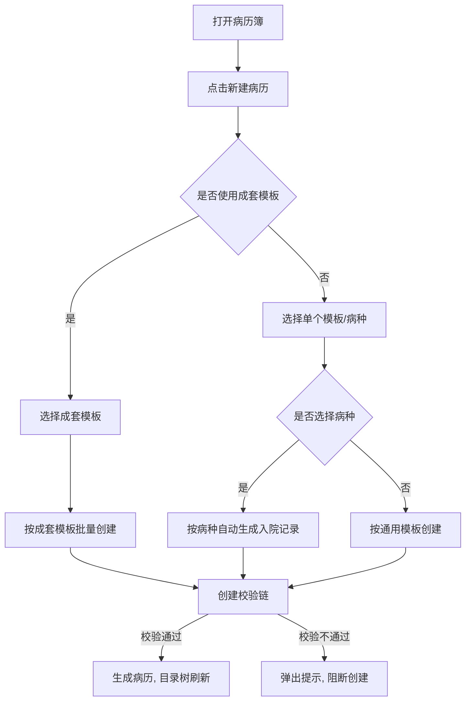
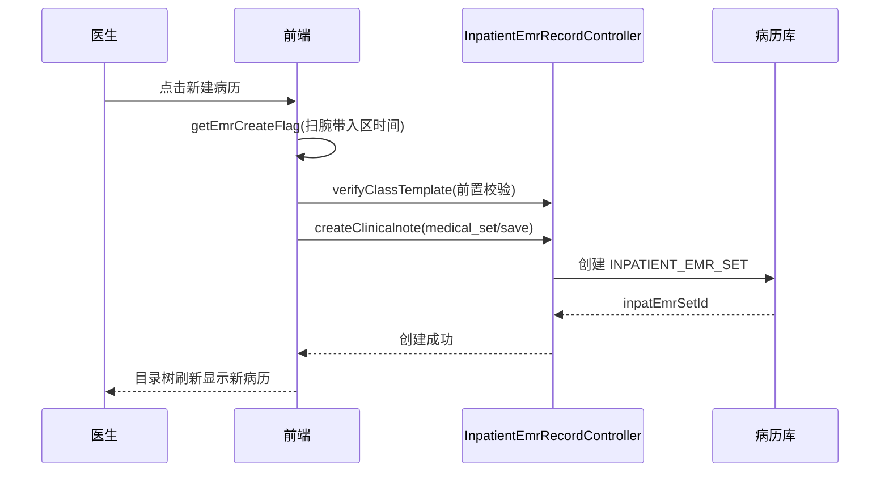

# BLGL-01-BLSX-001_病历创建与模板管理_Analyst-Spec

> **需求编号**：BLGL-01-BLSX-001
> **父需求**：BLGL-01-BLSX
> **关联PM Spec**：BLGL-01-BLSX-001_病历创建与模板管理_PM-spec.md
> **Spec版本**：V1.0
> **编写时间**：2026-08-15
> **编写人**：需求分析师

---

## 一、功能编号体系

### 1.1 功能层级结构

```
BLGL-01-BLSX-001-001: 病历创建（单建/批量/成套/一键）
  ├─ BLGL-01-BLSX-001-001-01: 单个创建（模板选择）
  ├─ BLGL-01-BLSX-001-001-02: 成套模板创建
  └─ BLGL-01-BLSX-001-001-03: 批量创建

BLGL-01-BLSX-001-002: 病种模板自动生成
  ├─ BLGL-01-BLSX-001-002-01: 病种判断与选择
  └─ BLGL-01-BLSX-001-002-02: 病种入院记录自动生成

BLGL-01-BLSX-001-003: 创建前置校验
  ├─ BLGL-01-BLSX-001-003-01: 扫腕带入区时间校验
  ├─ BLGL-01-BLSX-001-003-02: 诊疗组/规培生权限校验
  ├─ BLGL-01-BLSX-001-003-03: 病历超时控制
  ├─ BLGL-01-BLSX-001-003-04: 15天再入院提醒
  └─ BLGL-01-BLSX-001-003-05: 病历替换

BLGL-01-BLSX-001-004: 模板选择与标题管理
  ├─ BLGL-01-BLSX-001-004-01: 模板预览模式
  └─ BLGL-01-BLSX-001-004-02: 新建时修改模板名称
```

### 1.2 功能编号表

| REQ-ID | 功能名称 | 类型 | 优先级 | 说明 |
|--------|---------|------|--------|------|
| BLGL-01-BLSX-001-001 | 病历创建 | 功能 | P0 | 住院医生根据患者就诊情况选择模板/成套模板创建病历，支持单建/批量/成套/一键创建 |
| BLGL-01-BLSX-001-001-01 | 单个创建 | 子功能 | P0 | 模板选择弹框→选择模板→创建单个病历 |
| BLGL-01-BLSX-001-001-02 | 成套模板创建 | 子功能 | P0 | 按成套模板一次性创建一组病历 |
| BLGL-01-BLSX-001-001-03 | 批量创建 | 子功能 | P0 | 批量创建病历（batchSaveClinicalnote） |
| BLGL-01-BLSX-001-002 | 病种模板自动生成 | 功能 | P0 | 根据门诊诊断/主诊断自动生成病种入院记录文书 |
| BLGL-01-BLSX-001-002-01 | 病种判断与选择 | 子功能 | P0 | 门诊诊断判断病种，弹框下拉选择病种，支持模糊检索 |
| BLGL-01-BLSX-001-002-02 | 病种入院记录自动生成 | 子功能 | P0 | 根据病种自动生成病种入院记录文书 |
| BLGL-01-BLSX-001-003 | 创建前置校验 | 功能 | P0 | 创建前扫腕带/权限/超时/15天/替换校验 |
| BLGL-01-BLSX-001-003-01 | 扫腕带入区时间校验 | 子功能 | P0 | 无入区时间不允许创建病历 |
| BLGL-01-BLSX-001-003-02 | 诊疗组/规培生权限校验 | 子功能 | P0 | 诊疗组/教学组模式下创建权限控制 |
| BLGL-01-BLSX-001-003-03 | 病历超时控制 | 子功能 | P0 | 超时限病历不允许直接创建 |
| BLGL-01-BLSX-001-003-04 | 15天再入院提醒 | 子功能 | P1 | 入区-出区≤15天首次新增病历橙色轻提醒 |
| BLGL-01-BLSX-001-003-05 | 病历替换 | 子功能 | P1 | 重复创建同类型病历提示替换，内容同步 |
| BLGL-01-BLSX-001-004 | 模板选择与标题管理 | 功能 | P1 | 模板预览模式、新建时修改模板名称 |
| BLGL-01-BLSX-001-004-01 | 模板预览模式 | 子功能 | P1 | 个人设置"模板预览"开关控制弹窗样式 |
| BLGL-01-BLSX-001-004-02 | 新建时修改模板名称 | 子功能 | P1 | 新建病历支持修改模板名称 |

---

## 二、核心业务流程

### 2.1 病历创建主流程



### 2.2 病历创建时序



---

## 三、功能规格说明


### BLGL-01-BLSX-001-001: 病历创建

#### 3.1.1 功能概述

住院医生根据患者就诊情况选择模板/成套模板创建病历，支持单建/批量/成套/一键创建。

#### 3.1.2 用户角色

| 角色 | 使用场景 | 权限要求 | 操作频率 |
|------|---------|---------|---------|
| 住院医师 | 病历簿新建病历 | 诊疗组/科室病历创建权限 | 高频 |
| 护士 | 创建特定病历（入院评估单等） | 特定监控类型权限 | 中频 |
| 规培生 | 创建病历 | 规培生权限控制 | 中频 |

#### 3.1.3 业务流程（Given/When/Then）

##### 主流程

**Scenario 1: 单个创建病历**

```gherkin
Given:
- 住院医生已打开病历簿
- 患者存在本次入院信息（有入区时间）

When:
- 点击"新建病历"（或右键新增/待书写-去书写）
- 弹窗选择模板，点击确定

Then:
- 系统创建病历（INPATIENT_EMR_SET）
- 目录树刷新，显示新建病历
```

##### 异常流程

**Scenario 2: 业务异常——超时控制拦截创建**

```gherkin
Given:
- 病历超时限需要控制
- 参数"支持修改病历时间的病历分类"已配置

When:
- 医生点击"待书写-去书写"或新增

Then:
- 系统不允许直接创建
- 弹出提示，超时病历在"待书写"上方进行书写
```

**Scenario 3: 数据异常——无入区时间**

```gherkin
Given:
- 患者无扫腕带的入区时间

When:
- 医生点击新建病历

Then:
- 系统提示无入区时间不允许创建病历
```

（前端 getEmrCreateFlag：病历创建时判断是否有扫腕带的入区时间，没有不允许创建病历）

**Scenario 4: 系统异常——创建接口异常**

```gherkin
Given:
- medical_set/save 接口异常

When:
- 医生确认创建

Then:
- 系统提示创建失败
- 已创建的病历无残留，可重试
```

##### 边界流程

**Scenario 5: 边界——无主诊断**

```gherkin
Given:
- 患者不存在主诊断

When:
- 医生新建入院记录

Then:
- 可自主选择病种或不选择病种
- 不选择病种使用通用入院记录模板
```

**Scenario 6: 边界——15天再入院**

```gherkin
Given:
- 参数开启
- 本次入区-上次出区 ≤ 15 天

When:
- 第一次新增病历

Then:
- 弹出橙色轻提醒，不阻断流程
```

#### 3.1.5 验收标准

| AC编号 | 验收标准 | 对应REQ-ID | 验证方法 | 验证场景 |
|--------|---------|-----------|---------|---------|
| AC-001 | 患者有入区时间时可正常创建病历，目录树刷新 | BLGL-01-BLSX-001-001 | 功能测试 | Scenario 1 |
| AC-002 | 无入区时间时提示不允许创建病历 | BLGL-01-BLSX-001-001 | 功能测试 | Scenario 3 |


### BLGL-01-BLSX-001-002: 病种模板自动生成

#### 3.2.1 功能概述

根据患者门诊诊断主诊断自动判断病种，弹框下拉选择病种后按病种自动生成病种入院记录文书。

#### 3.2.2 用户角色

| 角色 | 使用场景 | 权限要求 | 操作频率 |
|------|---------|---------|---------|
| 住院医师 | 新建入院记录选择病种 | 病历创建权限 | 高频 |

#### 3.2.3 业务流程（Given/When/Then）

##### 主流程

**Scenario 1: 按病种生成入院记录**

```gherkin
Given:
- 患者存在门诊诊断主诊断

When:
- 医生新建入院记录
- 模板弹框下拉选择病种

Then:
- 系统根据病种自动生成病种入院记录文书
```

##### 异常流程

**Scenario 2: 业务异常——病种模板停用**

```gherkin
Given:
- 历史病历模板已停用或删除

When:
- 医生发起历史病历整体复制

Then:
- 提示"当前历史病历对应的病历模板已经停止使用，无法使用整体复制功能"
```

**Scenario 3: 数据异常——诊断无对应病种**

```gherkin
Given:
- 患者门诊诊断无对应病种数据

When:
- 医生选择病种

Then:
- 病种下拉框无匹配项，医生可手动选择或不选
```

（患者不存在主诊断的情况下可自主选择病种或不选择）

**Scenario 4: 系统异常——病种接口异常**

```gherkin
Given:
- 病种数据接口异常

When:
- 医生打开新建弹框

Then:
- 病种下拉框不展示，不影响按通用模板创建
```

##### 边界流程

**Scenario 5: 边界——无主诊断**

```gherkin
Given:
- 患者无主诊断

When:
- 医生新建入院记录

Then:
- 可自主选择病种或不选择，不选择用通用模板
```

**Scenario 6: 边界——病种模糊检索**

```gherkin
Given:
- 病种下拉框支持模糊检索

When:
- 医生输入病种关键词

Then:
- 病种下拉框过滤展示匹配项
```

（在模板选择的查询条件后增加选择病种下拉框，支持模糊检索）

#### 3.2.5 验收标准

| AC编号 | 验收标准 | 对应REQ-ID | 验证方法 | 验证场景 |
|--------|---------|-----------|---------|---------|
| AC-001 | 患者有门诊主诊断时，新建入院记录可下拉选择病种并自动生成病种入院记录 | BLGL-01-BLSX-001-002 | 功能测试 | Scenario 1 |
| AC-002 | 无主诊断时可不选择病种，用通用模板 | BLGL-01-BLSX-001-002 | 功能测试 | Scenario 5 |


### BLGL-01-BLSX-001-003: 创建前置校验

#### 3.3.1 功能概述

病历创建前的校验链：扫腕带入区时间、诊疗组/规培生权限、超时控制、15天再入院提醒、病历替换。

#### 3.3.2 用户角色

| 角色 | 使用场景 | 权限要求 | 操作频率 |
|------|---------|---------|---------|
| 住院医师 | 创建病历前校验 | 病历创建权限 | 高频 |

#### 3.3.3 业务流程（Given/When/Then）

##### 主流程

**Scenario 1: 创建前校验通过**

```gherkin
Given:
- 患者有入区时间
- 医生有创建权限
- 病历未超时

When:
- 医生新建病历

Then:
- 校验全部通过，正常创建病历
```

##### 异常流程

**Scenario 2: 业务异常——诊疗组权限不足**

```gherkin
Given:
- 患者已维护诊疗组
- 当前医生不在诊疗组内

When:
- 医生尝试新增病历

Then:
- 系统拒绝创建
```

（患者维护的诊疗组内的医生才对这个患者有新增病历权限）

**Scenario 3: 数据异常——超时控制**

```gherkin
Given:
- 病历已超时限

When:
- 医生点击待书写-去书写

Then:
- 弹出提示，不允许直接创建
```

**Scenario 4: 系统异常——校验接口异常**

```gherkin
Given:
- verify_class_template 或 touch_action 校验接口异常

When:
- 医生创建病历

Then:
- 系统阻断创建并提示校验失败，可重试
```

##### 边界流程

**Scenario 5: 边界——15天再入院（参数关闭）**

```gherkin
Given:
- 参数"是否启用15天再入院提醒"为否（默认）

When:
- 入区-出区≤15天的患者首次新增病历

Then:
- 不弹提醒，正常创建
```

（值{是，否}，默认否）

**Scenario 6: 边界——病历替换**

```gherkin
Given:
- 某类型病历设置只能创建一次

When:
- 医生重复创建同类型病历

Then:
- 系统提示已存在相同类型病历是否替换
- 确认替换后原病历删除，新病历创建，原内容同步到新病历相同概念ID元素
```

#### 3.3.5 验收标准

| AC编号 | 验收标准 | 对应REQ-ID | 验证方法 | 验证场景 |
|--------|---------|-----------|---------|---------|
| AC-001 | 诊疗组模式下仅诊疗组内医生可新增病历 | BLGL-01-BLSX-001-003 | 功能测试 | Scenario 2 |
| AC-002 | 超时限病历不允许直接创建 | BLGL-01-BLSX-001-003 | 功能测试 | Scenario 3 |
| AC-003 | 病历替换后原内容同步到新病历相同概念ID元素 | BLGL-01-BLSX-001-003 | 功能测试 | Scenario 6 |


### BLGL-01-BLSX-001-004: 模板选择与标题管理

#### 3.4.1 功能概述

模板选择弹框支持模板预览模式开关，新建病历支持修改模板名称。

#### 3.4.2 用户角色

| 角色 | 使用场景 | 权限要求 | 操作频率 |
|------|---------|---------|---------|
| 住院医师 | 选择模板创建病历 | 病历创建权限 | 高频 |

#### 3.4.3 业务流程（Given/When/Then）

##### 主流程

**Scenario 1: 模板预览模式开启**

```gherkin
Given:
- 个人设置→模板选择参数"模板预览"为开启（默认）

When:
- 医生点击病历目录右侧"+"号

Then:
- 弹出新增模板弹窗（原窗口样式）
```

（预览模式为开启时，新增模板的弹窗还是原窗口不变）

##### 异常流程

**Scenario 2: 业务异常——模板预览模式关闭**

```gherkin
Given:
- 参数"模板预览"为关闭

When:
- 医生点击病历目录右侧"+"号

Then:
- 弹出新窗口样式（图1），成套模板样式（图2）
```

（预览模式为关闭时，点击病历目录右侧的"＋"号弹出来的窗口模式如下图1，成套模板的样式如下图2）

**Scenario 3: 数据异常——模板检索无结果**

```gherkin
Given:
- 医生输入模板检索关键词

When:
- 检索无匹配模板

Then:
- 模板列表空展示，可清除关键词重新检索
```

（模板弹框检索）

**Scenario 4: 系统异常——模板树接口异常**

```gherkin
Given:
- 模板树接口异常

When:
- 医生打开新建弹框

Then:
- 模板树不展示，提示加载失败
```

##### 边界流程

**Scenario 5: 边界——新建修改模板名称**

```gherkin
Given:
- 病历模板支持修改名称

When:
- 医生新建病历

Then:
- 可在新建时修改模板名称
```

（住院病历-新建病历时，支持修改模板名称的功能）

**Scenario 6: 边界——成套模板范围选择**

```gherkin
Given:
- 参数"个人成套模板维护是否开启适用范围选择"为是

When:
- 医生维护个人成套模板

Then:
- 界面新增"成套模板适用范围"单选，默认选住院
- 选择日间手术病历隐藏"个人"选项
```

#### 3.4.5 验收标准

| AC编号 | 验收标准 | 对应REQ-ID | 验证方法 | 验证场景 |
|--------|---------|-----------|---------|---------|
| AC-001 | 模板预览开启时新增弹窗为原窗口，关闭时为新窗口 | BLGL-01-BLSX-001-004 | 功能测试 | Scenario 1/2 |
| AC-002 | 新建病历支持修改模板名称 | BLGL-01-BLSX-001-004 | 功能测试 | Scenario 5 |


---

## 四、排除范围

本需求不包含以下功能项：

1. **病历编辑与保存（编辑器/缺省值/快捷键）—— BLGL-01-BLSX-002**
2. **病历签署/提交/审签 —— BLGL-01-BLSX-003/004/005**
3. **手术记录 —— BLGL-01-BLSX-006**
4. **病历克隆/复制 —— BLGL-01-BLSX-012**
5. **模板定义态维护 —— BLGL-12-MBGL 模板管理**

---

## 五、业务规则清单

| 规则ID | 规则名称 | 规则描述 | 来源 | 优先级 |
|--------|---------|---------|------|--------|
| BR-001 | 病种自动生成 | 患者存在门诊诊断时，通过待书写新建的入院记录根据门诊诊断主诊断自动创建病种入院记录文书；病历簿新建时弹框下拉选择病种 | 需求 | P0 |
| BR-002 | 病种可选择性 | 患者不存在主诊断时，医生可自主选择病种或不选择病种，不选择病种使用通用入院记录模板 | 需求 | P0 |
| BR-003 | 诊疗组权限 | 患者维护诊疗组后，仅诊疗组内医生有新增/编辑/暂存/删除/提交病历权限；患者未维护诊疗组所有医生可编辑 | 需求 | P0 |
| BR-004 | 超时控制 | 超过时限需要控制的病历不可直接创建，需在"待书写"上方进行书写 | 需求 | P0 |
| BR-005 | 15天再入院提醒 | 参数开启且本次入区-上次出区≤15天时，第一次新增病历弹出橙色轻提醒，不阻断流程 | 需求 | P1 |
| BR-006 | 病历替换 | 某类型病历只能创建一次时，重复创建提示替换，替换后原内容同步到新病历相同概念ID元素 | 需求 | P1 |
| BR-007 | 无入区时间限制 | 病历创建时判断是否有扫腕带的入区时间，没有不允许创建病历 | 前端代码 | P0 |
| BR-008 | 模板停用提示 | 历史病历整体复制时，若对应模板已停用/删除，提示"当前历史病历对应的病历模板已经停止使用，无法使用整体复制功能" | 需求 | P1 |

---

## 六、关联文档

| 文档类型 | 文档路径 | 说明 |
|---------|---------|------|
| 功能点Spec | BLGL-01-BLSX 01病历书写功能点Spec.md（V1.0，上级目录） | Phase 1 功能点索引 |
| PM spec | 本目录 BLGL-01-BLSX-001_病历创建与模板管理_PM-spec.md（V0.1） | PM 产出的 Spec 文档 |
| -Spec | 本目录 BLGL-01-BLSX-001_病历创建与模板管理-Spec.md（V1.0） | 业务背景与目标 Spec |
| data-model.md | 待产出 | 架构师产出的数据建模文档 |
| design.md | 待产出 | 架构师产出的技术方案文档 |
| api-contract.md | 待产出 | 开发经理产出的 API 契约文档 |

---

## 七、待确认问题清单

| 编号 | 问题描述 | 缺失信息 | 影响范围 | 建议补充方 |
|------|---------|---------|---------|-----------|
| Q-001 | 病种与诊断对应关系的数据维护方待确定 | 病种映射数据维护方 | -Spec 第9章、Analyst-Spec 病种场景 | 产品经理/医学部 |
| Q-002 | 创建接口完整入参/出参字段结构 | API 契约文档 | -Spec 第5章、Analyst-Spec 数据字段（概念ID） | 开发经理 |
| Q-003 | 创建相关参数编码（15天提醒/超时/入区校验等） | 参数配置说明表 | 数据模型 4.3 | 产品经理 |
| Q-004 | 性能指标（病历创建响应/批量创建） | 非功能性需求 | -Spec 第8章 | 需求分析师 |
| Q-005 | 病种模板自动生成的具体病种覆盖范围 | 医学部病种数据 | 病种场景 | 产品经理 |

---

## 填写检查清单

| 序号 | 检查项 | 是否完成 |
|:----:|--------|:--------:|
| 1 | 功能编号带父子层级 | ✅ |
| 2 | 每个 REQ-ID 有功能概述和用户角色 | ✅ |
| 3 | 主流程至少 1 个 Given/When/Then 场景 | ✅ |
| 4 | 异常流程至少 3 个 Given/When/Then 场景 | ✅ |
| 5 | 边界流程至少 2 个 Given/When/Then 场景 | ✅ |
| 6 | 每个 Given/When/Then 内容具体，不模糊 | ✅ |
| 7 | 数据字段定义完整（字段名、类型、必填、说明、概念ID） | N/A |
| 8 | 验收标准 AC 编号独立，可验证 | ✅ |
| 9 | 验收标准无"功能正常"等模糊表述 | ✅ |
| 10 | 排除范围明确列出 | ✅ |
| 11 | 业务规则清单列出所有规则，每条标注来源 | ✅ |
| 12 | 流程图使用 Mermaid 格式（≥2 个） | ✅ |
| 13 | 关联文档索引包含 Phase 1 功能点Spec | ✅ |
| 14 | 待确认问题清单汇总了全文所有 ⏳ 项 | ✅ |
| 15 | 全文无占位符 `< >` 残留 | ✅ |
| 16 | 全文陈述可溯源至资料区（S1~S10 溯源核查） | ✅ |
| 17 | 人工审核确认完成 | ⏳ 待确认 |

---

**文档状态**：⬜ 待审核
**维护责任**：需求分析师规范组
**下次更新**：根据评审反馈优化

---

## 版本历史

| 版本 | 日期 | 变更说明 | 编写人 |
|------|------|---------|--------|
| V1.0 | 2026-08-15 | 初始版本 | 需求分析师 |