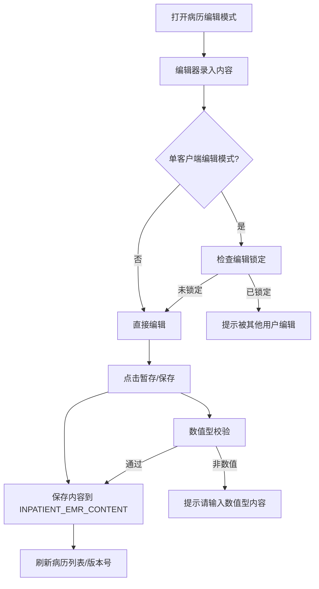
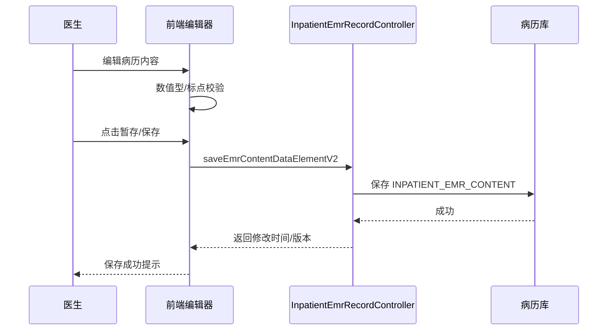

# BLGL-01-BLSX-002_病历编辑与保存-Spec

> **功能编号**：BLGL-01-BLSX-002
> **文档类型**：功能Spec（业务背景与设计）
> **文档版本**：V1.0
> **编写时间**：2026-08-15
> **编写人**：RACC

---

## 文档索引

#### 章节索引

**Spec（研发视角）**

| 章节号 | 章节名称 | 内容说明 |
|--------|---------|---------|
| 1、 | 文档概述 | 文档目的、文档范围、术语定义、阅读指南、参考文档 |
| 2、 | 功能背景与定位 | 功能背景、功能定位、目标用户、核心价值 |
| 3、 | 业务流程设计 | 主流程/异常流程/边界流程（Given/When/Then） |
| 4、 | 数据模型设计 | 核心数据结构、状态定义、系统参数定义 |
| 5、 | 接口契约设计 | API列表、接口详细设计、错误码定义 |
| 6、 | 技术方案设计 | 页面路径、技术栈、关键技术点、部署方案 |
| 7、 | 测试用例预设计 | 功能/边界/异常/性能测试用例 |
| 8、 | 非功能性要求 | 性能、安全、可用性、兼容性 |
| 9、 | 依赖与风险 | 外部依赖、风险项 |
| 10、 | 附录 | 流程图、时序图、参考文档 |

**PM-Spec（业务视角）**

| 章节号 | 章节名称 | 内容说明 |
|--------|---------|---------|
| 一 | 目标 | 功能定位与核心价值 |
| 二 | 约束 | 业务/技术/非功能性约束 |
| 三 | 验收标准 | 验收条件与验证方法 |
| 四 | 排除范围 | 本次不做项与明确边界 |
| 五 | 关键决策记录 | 方案决策与选型理由 |
| 六 | 优先级 | 优先级定义 |
| 七 | 关联文档 | 关联文档索引 |
| 附录 | 填写检查清单 | 质量检查 |

**Analyst-Spec（产品视角）**

| 章节号 | 章节名称 | 内容说明 |
|--------|---------|---------|
| 一 | 功能编号体系 | 功能编号与层级结构 |
| 二 | 核心业务流程 | 核心业务流程与时序 |
| 三 | 功能规格说明 | 详细功能规格与验收标准 |
| 四 | 排除范围 | 排除范围 |
| 五 | 业务规则清单 | 业务规则清单 |
| 六 | 关联文档 | 关联文档索引 |
| 七 | 待确认问题清单 | 待确认问题汇总 |
| - | 填写检查清单 | 质量检查 |

#### 版本历史

| 版本 | 日期 | 变更说明 | 编写人 |
|------|------|---------|--------|
| V1.0 | 2026-08-15 | 初始版本 | RACC |

#### 关联文档索引

| 序号 | 文档名称 | 文档类型 | 版本 | 位置 |
|------|---------|---------|------|------|
| 1 | BLGL-01-BLSX-002_病历编辑与保存_PM-spec.md | PM-Spec | V0.1 | 本目录 |
| 2 | BLGL-01-BLSX-002_病历编辑与保存_Analyst-spec.md | Analyst-Spec | V1.0 | 本目录 |
| 3 | BLGL-01-BLSX-002_病历编辑与保存-Spec.md | Spec（本文档） | V1.0 | 本目录 |
| 4 | BLGL-01-BLSX 01病历书写功能点Spec.md | 功能点Spec | V1.0 | 上级目录 |

---

## 1、文档概述

### 1.1、文档目的

本文档旨在明确"病历编辑与保存"功能（BLGL-01-BLSX-002）的业务背景与设计方案，为需求分析、研发实现、测试验收及评审提供统一的业务上下文、设计口径与决策依据。

### 1.2、文档范围

#### 1.2.1 纳入范围

本文档覆盖病历编辑与保存的完整业务背景与设计，包括：

- 病历内容编辑：编辑器书写/编辑病历内容，数值型控件校验、标点符号处理、批量调整行间距
- 病历保存（暂存）：暂存/保存病历，病历切换保留已输入内容，保存耗时优化
- 缺省值联动：入院记录与首次病程记录主诉/现病史/查体数据联动、病种生成、自定义取值
- 快捷操作：快捷键（复制/粘贴/保存/提交/打印）、病历间拖拽复制粘贴
- 编辑锁定：单客户端编辑模式（同一时间单账号编辑）、多客户端编辑模式、编辑临时锁定时长
- 多人协同书写：跨科多人同写一份病历文书、部分病历未提交时允许其他人修改
- 外部粘贴控制：按病历类型控制是否允许从外部编辑器复制粘贴

#### 1.2.2 排除范围

本文档不涉及以下内容（详见其他功能点或模块）：

- 病历创建与模板管理 —— BLGL-01-BLSX-001
- 病历签署—— BLGL-01-BLSX-003
- 病历提交与撤销提交 —— BLGL-01-BLSX-004
- 病历审签阅改 —— BLGL-01-BLSX-005
- 手术记录 —— BLGL-01-BLSX-006
- 病历数据引用（智能输入/医技报告/医嘱/过敏等辅助面板引用）—— BLGL-01-BLSX-009

### 1.3、术语定义

| 术语 | 定义 |
|------|------|
| 编辑器 | 病历文书编辑控件（自研编辑器），支持结构化数据编辑 |
| 缺省值 | 病历数据元的默认取值，从患者信息/护理文书/历史病历等自动填充 |
| 病历记录时间 | 病历文书的记录时间，可配置修改范围 |
| 编辑锁定 | 单客户端编辑模式下对病历的临时编辑锁定 |

### 1.4、阅读指南

- **章节关系**：第1~2章为业务全貌，第3~10章为设计实现层。与 Analyst-Spec、PM-Spec 互相引用保持一致。
- **读者对象**：产品经理/需求分析师读第1~2章；研发读第3~6、9~10章；测试读第3、7~8章；评审人员核对各层一致性。

### 1.5、参考文档

| 序号 | 文档名称 | 版本/日期 |
|------|---------|----------|
| 1 | 【历史需求】住院病历的历史需求.xlsx | - |
| 2 | BLGL-01-BLSX-002_病历编辑与保存_PM-spec.md | V0.1 |
| 3 | BLGL-01-BLSX-002_病历编辑与保存_Analyst-spec.md | V1.0 |
| 4 | BLGL-01-BLSX 01病历书写功能点Spec.md | V1.0 |
| 5 | 病历书写_功能清单_20260327_151500.md | 2026-03-27 |

---

## 2、功能背景与定位

### 2.1 功能背景

病历编辑与保存是病历书写模块的核心操作功能，需满足：

- **现状痛点**：病历切换后未保存内容清空、数值控件可输入文本、编辑无锁定多人冲突、跨系统复制内容不受控
- **管理要求**：病历数据联动准确（入院记录与首次病程记录数据同步）、编辑权限与锁定保障数据一致
- **历史需求演进**：从基础编辑/暂存 → 缺省值联动 → 数值型校验/编辑器迭代 → 快捷键/拖拽复制 → 单客户端编辑锁定 → 多人协同书写 → 外部粘贴控制

### 2.2 功能定位

"病历编辑与保存"是 WiNEX 病历管理-病历书写的核心操作功能点，定位为：

- **书写主战场**：医生在编辑器完成病历内容书写/编辑/暂存
- **数据联动引擎**：缺省值/病种/生命体征自动取值，降低手工录入
- **编辑一致性保障**：编辑锁定/多人协同/外部粘贴控制保障病历数据一致

### 2.3 目标用户

| 用户角色 | 主要使用场景 |
|---------|-------------|
| 住院医师 | 病历内容书写/编辑/暂存，缺省值引用，快捷键操作 |
| 上级医师 | 未提交病历内容修改（三级查房制度） |
| 规培生/实习生 | 代写病历（受权限控制） |
| 护士 | 特定病历协同书写（入院评估单等） |

### 2.4 核心价值

| 价值维度 | 价值描述 |
|---------|---------|
| 书写效率 | 缺省值/病种/生命体征自动取值、快捷键、拖拽复制降低录入工作量 |
| 数据一致性 | 入院记录与首次病程记录联动、编辑锁定防止并发冲突 |
| 内容质量 | 数值型校验、标点符号处理、外部粘贴控制保障病历内容质量 |

---

## 3、业务流程设计（Given/When/Then）

### 3.1 主流程

**Scenario 1: 医生编辑并暂存病历**

```gherkin
Given:
- 住院医生已打开一份待书写病历（编辑模式）
- 医生有该病历编辑权限

When:
- 医生在编辑器录入病历内容（文本/数值型/结构化元素）
- 点击"暂存"/"保存"（快捷键）

Then:
- 系统调用内容保存接口（content/data_element/save）
- 病历状态更新，编辑器暂存内容保留
- 保存成功提示
```

**Scenario 2: 缺省值联动（入院记录与首次病程记录）**

```gherkin
Given:
- 入院记录和首次病程记录均未提交

When:
- 医生书写入院记录的主诉、现病史、查体

Then:
- 首次病程记录的主诉、现病史和查体数据自动同步更新
- 反之亦然；若任一已提交则不更新到已提交文书
```

### 3.2 异常流程

**Scenario 3: 业务异常——单客户端编辑锁定冲突**

```gherkin
Given:
- 参数"是否启用病历单客户端编辑模式"为是
- 病历正在被用户A编辑中

When:
- 有编辑权限的用户B打开这份病历

Then:
- 系统提示病历正被用户A编辑，用户B无法编辑
```

**Scenario 4: 数据异常——数值控件输入非数值**

```gherkin
Given:
- 模板数值型控件已设置"只能为数值格式"属性

When:
- 医生在数值型控件输入文本内容

Then:
- 系统提示"请输入数值型内容"，拒绝非数值输入
```

**Scenario 5: 系统异常——保存接口异常**

```gherkin
Given:
- 内容保存接口（content/data_element/save）异常

When:
- 医生点击保存

Then:
- 系统提示保存失败，已输入内容保留在编辑器
- 可重试保存
```

### 3.3 边界流程

**Scenario 6: 边界——病历切换保留内容**

```gherkin
Given:
- 医生书写了当前病历但未保存

When:
- 医生切换到其他病历文书，再返回当前病历

Then:
- 已输入内容保留，不能清空
```

**Scenario 7: 边界——外部粘贴控制（按类型）**

```gherkin
Given:
- 参数"允许从外部编辑器粘贴的病历类型"配置为自定义选择
- 入院记录、出院记录禁止，日常病程记录允许

When:
- 医生从外部编辑器复制内容粘贴到不同病历类型

Then:
- 入院记录/出院记录禁止粘贴
- 日常病程记录允许粘贴
```

---

## 4、数据模型设计

### 4.1 核心数据结构

#### 4.1.1 核心保存请求

| 字段名 | 类型 | 必填 | 备注 |
|--------|------|------|------|
| inpatEmrSetId | Long | 是 | 病历ID |
| emrSaveInfo | Object | 是 | 保存内容数据（结构化数据元素） |
| operationType | String | 是 | 操作类型：save/commit |

#### 4.1.2 核心表/实体

| 表/实体 | 关键字段 | 说明 |
|---------|---------|------|
| INPATIENT_EMR_CONTENT（InpatientEmrContentPO） | INP_EMR_CONTENT_ID、INP_EMR_CONTENT_DATA（内容数据XML）、COMPRESSION_FLAG（压缩）、ENCRYPTION_TYPE_CODE（加密）、MRT_EDITOR_TYPE_NAME（编辑器类型） | 病历内容表，存储病历内容结构化数据 |
| INPATIENT_EMR_RECORD（InpatientEmrRecordPO） | INP_EMR_RECORD_ID、INP_EMR_SET_ID、INP_EMR_STATUS、INP_EMR_CONTENT_ID（关联内容） | 病历记录表，关联内容 |
| INP_EMR_CONTENT_ACTION（InpEmrContentActionPO） | INP_EMR_CONTENT_ACTION_ID、INP_EMR_CONTENT_DATA（操作前内容）、INP_EMR_CONTENT_PLAIN_TEXT | 操作留痕表（保存/修改历史） |

### 4.2 状态定义

| 状态码 | 状态名称 | 说明 |
|--------|---------|------|
| 960074 | 新建 | 病历刚创建 |
| 390030405 | 草稿 | 已暂存/编辑中 |
| 390030406 | 已签署 | 已签名 |

### 4.3 系统参数定义

| 参数编码 | 参数名称 | 说明 |
|---------|---------|------|
| 待确认 | 是否启用病历单客户端编辑模式 | {是，否}，默认否；是：单客户端编辑，同一时间单账号单电脑编辑一份病历 |
| 待确认 | 病历编辑临时锁定时长（COMMON143） | 数值型，默认为 2 小时 |
| 待确认 | 是否启用编辑器悬浮工具栏（COMMON087） | {是，否}，默认为否 |
| 待确认 | 允许从外部编辑器粘贴的病历类型 | 全部/无/自定义多选监控类型 |
| 待确认 | 体表面积公式计算方式 | 方式1/方式2，默认方式1 |
| 待确认 | 病历记录时间往前/后推移天数（COMMON005/006） | 病历记录时间允许修改范围 |
| 待确认 | 创建病历时生命体征优先同步缺省值的监控类型 | 多选监控类型，默认为空 |
| 待确认 | 离开病历界面的病历保存提醒类型（COMMON343） | 1强制保存/2提醒保存 |

---

## 5、接口契约设计

### 5.1 API列表

| 序号 | API名称（代码函数） | 路径 | 方法 | 说明 |
|:----:|---------|------|:----:|------|
| 1 | saveEmrContentDataElementV2（emrSaveBeforeSubmit） | /api/v2/app_record_inpatient/emr_inpatient/content/data_element/save | POST | 存储病历内容结构化数据（保存） |
| 2 | saveClinicalnoteContent | /api/v2/app_record_inpatient/emr_inpatient/content/data_element/correct/save | POST | 质控保存 |
| 3 | getInpatientEMRBySetIdV2（apiGetInpatientClinicalnoteContent） | /api/v2/app_record_inpatient/emr_inpatient/get/by_id | POST | 获取病历内容 |
| 4 | saveAuditEmr | /api/v1/app_record_inpatient/emr_inpatient/audit/save_audit_emr | POST | 审签保存 |
| 5 | getEditLockDetail | /api/v1/app_record_inpatient/inpatient_emr/emr_set/get_edit_clock_detail | POST | 查询病历编辑锁定详情 |
| 6 | closeEmrByEmrSetId | /api/v1/app_record_inpatient/emr_inpatient/set/edit/close | POST | 关闭病历编辑 |
| 7 | editInpatientEmrSetContinueV2 | /api/v2/app_record_inpatient/emr_inpatient/emr_set/content/continue_edit | POST | 连续病程编辑保存 |
| 8 | queryEmrContentDataELement | /api/v1/app_record_inpatient/emr_inpatient/content/data_element/query | POST | 获取病历内容结构化数据 |

### 5.2 接口详细设计

#### 5.2.1 保存病历内容（saveEmrContentDataElementV2）

**请求参数**:
```json
{
  "inpatEmrSetId": "病历ID",
  "emrSaveInfo": "病历内容结构化数据",
  "operationType": "save"
}
```

**返回值（成功）**:
```json
{
  "success": true,
  "data": {
    "modifyTime": "内容修改时间",
    "version": "病历版本号"
  }
}
```

**返回值（失败）**:
```json
{
  "success": false,
  "message": "<错误信息>",
  "data": null
}
```

> 请求/返回字段结构以 API 契约文档为准。

### 5.3 错误码定义

| 错误码 | 错误信息 | 处理方式 |
|--------|---------|---------|
| 待确认 | 请输入数值型内容 | 数值控件校验提示 |
| WB21620011 | 版本冲突/并发更新提示 | 弹窗提示用户 |
| 待确认 | 当前病历正在被其他用户编辑 | 单客户端编辑模式阻断 |

---

## 6、技术方案设计

### 6.1 页面路径

- **页面路径**: 住院医生站→住院病历书写界面→病历编辑器（EmrEditor/components/BaseEditor）
- **组件**：EmrEditor/components/BaseEditor/index.vue（编辑器主组件，保存/暂存/快捷键）、EmrEditor/components/BaseEditor/mixins/emrSaveAction.js（保存动作）、emrLock.js（编辑锁定）、EmrMenuActions（右键：修改病历时间/标题）
- **核心逻辑模块**: InpatientEmrRecordController（saveEmrContentDataElementV2/closeInpatientEmrSet/editInpatientEmrSetContinueV2）

### 6.2 技术栈

| 类别 | 技术 | 版本 |
|------|------|------|
| 前端框架 | Vue | 2.6.14 |
| 前端UI | element-ui | 2.13.0 |
| 后端框架 | Spring Boot（Java） | 17 |

### 6.3 关键技术点

- 病历内容保存走 content/data_element/save（保存结构化数据到 INPATIENT_EMR_CONTENT）
- 编辑器为自研编辑器（PG Editor），支持数值型校验/结构化数据
- 缺省值联动：入院记录与首次病程记录数据联动，提交后不更新
- 编辑锁定：单客户端编辑模式打标记【用户xxx(账号)、IP地址】，关闭病历退出编辑
- 保存耗时优化：非结构和结构化存储逻辑调整

### 6.4 部署方案

⏳ 待确认：部署方案未在资料区中找到。

---

## 7、测试用例预设计

### 7.1 功能测试

| 用例编号 | 测试场景 | Given | When | Then |
|---------|---------|-------|------|------|
| TC-001 | 编辑并暂存病历 | 医生打开病历编辑模式 | 录入内容点击暂存 | 内容保存，状态更新 |
| TC-002 | 缺省值联动 | 入院/首次病程均未提交 | 书写入院记录主诉/现病史/查体 | 首次病程记录自动同步 |
| TC-003 | 数值型校验 | 数值控件已设只能数值 | 输入文本 | 提示"请输入数值型内容" |

### 7.2 边界测试

| 用例编号 | 测试场景 | Given | When | Then |
|---------|---------|-------|------|------|
| TC-004 | 病历切换保留内容 | 未保存切换病历 | 切换后再返回 | 已输入内容保留 |
| TC-005 | 外部粘贴控制 | 入院记录禁止粘贴 | 从外部复制粘贴 | 入院记录禁止，日常病程允许 |

### 7.3 异常测试

| 用例编号 | 测试场景 | Given | When | Then |
|---------|---------|-------|------|------|
| TC-006 | 单客户端锁定冲突 | 病历被用户A编辑 | 用户B打开 | 提示被编辑，无法编辑 |
| TC-007 | 保存接口异常 | 保存接口异常 | 点击保存 | 提示保存失败，内容保留 |
| TC-008 | 版本冲突 | 版本不一致 | 保存 | 弹出冲突提示 |

### 7.4 性能测试

| 用例编号 | 测试场景 | 指标 |
|---------|---------|------|
| TC-009 | 病历保存响应 | ⏳ 待确认：性能指标未在资料区中找到 |
| TC-010 | 长病程记录加载（>3个月住院） | ⏳ 待确认 |

---

## 8、非功能性要求

### 8.1 性能要求

| 指标 | 要求 |
|------|------|
| 病历保存响应时间 | ⏳ 待确认 |
| 长病程记录加载效率 | 住院>3个月患者病程记录加载效率优化 |

### 8.2 安全要求

| 要求 | 说明 |
|------|------|
| 编辑权限控制 | 诊疗组/科室/上级医师编辑权限 |
| 单客户端编辑锁定 | 单账号单电脑编辑锁定防并发 |

**医疗行业特殊要求**

| 要求 | 说明 |
|------|------|
| 病历数据准确性 | 缺省值/联动数据与源数据一致，提交后不更新 |
| 外部粘贴内容管控 | 按病历类型控制外部复制内容，防内容污染 |

### 8.3 可用性要求

| 指标 | 要求值 |
|------|--------|
| 可用性 | ⏳ 待确认 |

### 8.4 兼容性要求

| 类型 | 要求 |
|------|------|
| 编辑器兼容 | 自研编辑器支持数值型/结构化元素/标点符号处理 |
| 快捷键配置 | 复制/粘贴/保存/提交/打印快捷键读取个人设置 |

---

## 9、依赖与风险

### 9.1 外部依赖

| 依赖项 | 说明 |
|--------|------|
| 主数据 | 员工/职称/权限 |
| 护理系统（医慧） | 生命体征/专项评估数据 |

### 9.2 风险项

| 风险项 | 等级 | 说明 | 应对方案 |
|--------|------|------|---------|
| 单客户端锁定误锁 | 中 | 单客户端编辑模式下锁定标记可能残留 | 设置编辑临时锁定时长（COMMON143） |
| 多人协同编辑冲突 | 中 | 跨科多人同写一份病历可能产生内容冲突 | 协同编辑+操作留痕 |
| 保存性能 | 低 | 保存耗时优化需求持续 | 非结构/结构化存储逻辑调整 |

---

## 10、附录

### 10.1 流程图



### 10.2 时序图



### 10.3 参考文档

- 病历书写_功能清单_20260327_151500.md（病历文书操作-暂存病历、书写规则设置、病历模式-编辑模式/痕迹模式）
- BLGL-01-BLSX 01病历书写功能点Spec.md（V1.0，第5章 BLGL-01-BLSX-002 行）
- 关联Spec：BLGL-01-BLSX-002_病历编辑与保存_PM-spec.md、BLGL-01-BLSX-002_病历编辑与保存_Analyst-spec.md

---

## 填写检查清单

| 序号 | 检查项 | 是否完成 |
|:----:|--------|:--------:|
| 1 | 章节索引与正文章节一致 | ✅ |
| 2 | 版本历史记录完整 | ✅ |
| 3 | 关联文档索引已登记全部Spec | ✅ |
| 4 | 文档目的明确回答"为什么做/做成什么/怎么做" | ✅ |
| 5 | 纳入范围/排除范围清晰 | ✅ |
| 6 | 术语定义覆盖关键概念，从资料区可溯源 | ✅ |
| 7 | 参考文档已登记 | ✅ |
| 8 | 功能背景基于法规/规范/需求来源组织 | ✅ |
| 9 | 功能定位体现业务价值（3~5个定位点） | ✅ |
| 10 | 目标用户角色覆盖完整，在需求原文中有出处 | ✅ |
| 11 | 核心价值可陈述，与 Phase 1 口径一致 | ✅ |
| 12 | 业务流程：主流程≥1、异常≥3、边界≥2，Given/When/Then 具体 | ✅ |
| 13 | 数据模型：字段/表/状态/参数可溯源 | ✅ |
| 14 | 接口契约：API列表+详细设计+错误码齐全或标记待确认 | ✅ |
| 15 | 技术方案：页面路径/技术栈/关键点/部署方案或标记待确认 | ✅ |
| 16 | 测试用例：功能/边界/异常/性能覆盖 | ✅ |
| 17 | 非功能性要求：性能/安全/可用性/兼容性指标可量化或标记待确认 | ✅ |
| 18 | 依赖与风险：外部依赖登记完整 | ✅ |
| 19 | 附录：流程图/时序图与正文流程一致 | ✅ |
| 20 | 全文无占位符 `< >` 残留 | ✅ |
| 21 | 全文陈述可溯源至资料区 | ✅ |
| 22 | 人工审核确认完成 | ⏳ 待确认 |

---

**文档状态**：⬜ 待审核
**维护责任**：RACC
**下次更新**：根据评审反馈优化