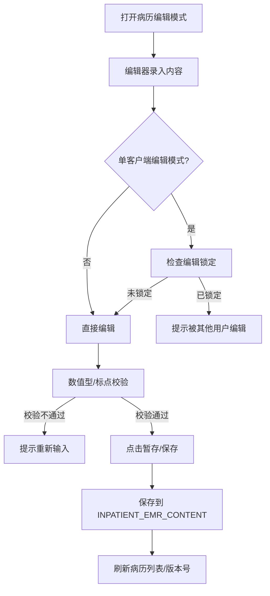
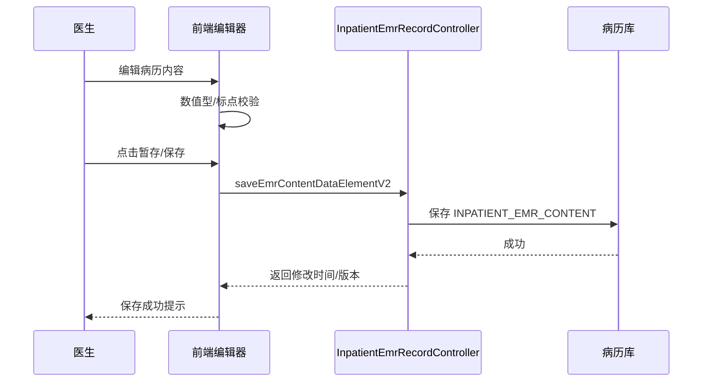

# BLGL-01-BLSX-002_病历编辑与保存_Analyst-Spec

> **文档版本**：V1.0
> **关联PM Spec**：BLGL-01-BLSX-002_病历编辑与保存_PM-spec.md
> **编写时间**：2026-08-15
> **编写人**：需求分析师

---

## 一、功能编号体系

### 1.1 功能层级结构

```
BLGL-01-BLSX-002-001: 病历内容编辑
  ├─ BLGL-01-BLSX-002-001-01: 文本/数值型控件编辑
  ├─ BLGL-01-BLSX-002-001-02: 标点符号处理
  └─ BLGL-01-BLSX-002-001-03: 批量调整行间距

BLGL-01-BLSX-002-002: 病历保存（暂存）
  ├─ BLGL-01-BLSX-002-002-01: 暂存/保存
  ├─ BLGL-01-BLSX-002-002-02: 病历切换保留内容
  └─ BLGL-01-BLSX-002-002-03: 连续病程编辑保存

BLGL-01-BLSX-002-003: 缺省值联动
  ├─ BLGL-01-BLSX-002-003-01: 入院/首次病程记录数据联动
  ├─ BLGL-01-BLSX-002-003-02: 体表面积公式计算
  ├─ BLGL-01-BLSX-002-003-03: 生命体征缺省值同步
  └─ BLGL-01-BLSX-002-003-04: 婚育史自动加载

BLGL-01-BLSX-002-004: 快捷操作
  ├─ BLGL-01-BLSX-002-004-01: 快捷键配置
  └─ BLGL-01-BLSX-002-004-02: 病历间拖拽复制粘贴

BLGL-01-BLSX-002-005: 编辑锁定与多人协同
  ├─ BLGL-01-BLSX-002-005-01: 单客户端编辑锁定
  ├─ BLGL-01-BLSX-002-005-02: 多人协同书写
  └─ BLGL-01-BLSX-002-005-03: 外部粘贴控制
```

### 1.2 功能编号表

| REQ-ID | 功能名称 | 类型 | 优先级 | 说明 |
|--------|---------|------|--------|------|
| BLGL-01-BLSX-002-001 | 病历内容编辑 | 功能 | P0 | 编辑器书写/编辑病历内容，数值型校验、标点符号处理、行间距 |
| BLGL-01-BLSX-002-001-01 | 文本/数值型控件编辑 | 子功能 | P0 | 数值型控件只能输入数字 |
| BLGL-01-BLSX-002-001-02 | 标点符号处理 | 子功能 | P1 | 输入域未填写时标点符号显示规则 |
| BLGL-01-BLSX-002-001-03 | 批量调整行间距 | 子功能 | P1 | 编辑器批量调整行间距 |
| BLGL-01-BLSX-002-002 | 病历保存（暂存） | 功能 | P0 | 暂存/保存病历，切换保留内容 |
| BLGL-01-BLSX-002-002-01 | 暂存/保存 | 子功能 | P0 | 医师书写完的病历进行保存动作 |
| BLGL-01-BLSX-002-002-02 | 病历切换保留内容 | 子功能 | P0 | 未保存切换后再返回内容保留 |
| BLGL-01-BLSX-002-002-03 | 连续病程编辑保存 | 子功能 | P0 | 连续病程（serial）编辑保存 |
| BLGL-01-BLSX-002-003 | 缺省值联动 | 功能 | P0 | 病历数据元自动取值与联动 |
| BLGL-01-BLSX-002-003-01 | 入院/首次病程数据联动 | 子功能 | P0 | 主诉/现病史/查体自动同步 |
| BLGL-01-BLSX-002-003-02 | 体表面积公式计算 | 子功能 | P1 | 支持配置不同计算方式 |
| BLGL-01-BLSX-002-003-03 | 生命体征缺省值同步 | 子功能 | P1 | 出院记录从入院记录/护理同步 |
| BLGL-01-BLSX-002-003-04 | 婚育史自动加载 | 子功能 | P1 | 根据婚姻状态自动加载婚育史 |
| BLGL-01-BLSX-002-004 | 快捷操作 | 功能 | P1 | 快捷键/拖拽复制粘贴 |
| BLGL-01-BLSX-002-004-01 | 快捷键配置 | 子功能 | P1 | 复制/粘贴/保存/提交/打印快捷键 |
| BLGL-01-BLSX-002-004-02 | 病历间拖拽复制粘贴 | 子功能 | P1 | 选中内容拖拽到另一份病历 |
| BLGL-01-BLSX-002-005 | 编辑锁定与多人协同 | 功能 | P0 | 编辑锁定/多人协同/外部粘贴控制 |
| BLGL-01-BLSX-002-005-01 | 单客户端编辑锁定 | 子功能 | P0 | 单账号单电脑编辑锁定 |
| BLGL-01-BLSX-002-005-02 | 多人协同书写 | 子功能 | P0 | 跨科多人同写一份病历 |
| BLGL-01-BLSX-002-005-03 | 外部粘贴控制 | 子功能 | P1 | 按病历类型控制外部粘贴 |

---

## 二、核心业务流程

### 2.1 病历编辑与保存主流程



### 2.2 病历编辑与保存时序



---

## 三、功能规格说明


### BLGL-01-BLSX-002-001: 病历内容编辑

#### 3.1.1 功能概述

编辑器书写/编辑病历内容，数值型控件只能输入数字，标点符号处理，批量调整行间距。

#### 3.1.2 用户角色

| 角色 | 使用场景 | 权限要求 | 操作频率 |
|------|---------|---------|---------|
| 住院医师 | 病历内容书写/编辑 | 病历编辑权限 | 高频 |

#### 3.1.3 业务流程（Given/When/Then）

##### 主流程

**Scenario 1: 编辑病历内容**

```gherkin
Given:
- 医生打开病历编辑模式

When:
- 医生在编辑器录入文本/数值内容
- 校验通过后暂存

Then:
- 内容保存，病历状态更新
```

##### 异常流程

**Scenario 2: 业务异常——数值控件非数值输入**

```gherkin
Given:
- 数值型控件已设"只能为数值格式"

When:
- 医生输入文本内容

Then:
- 提示"请输入数值型内容"，拒绝非数值输入
```

**Scenario 3: 数据异常——标点符号显示**

```gherkin
Given:
- 输入域后有标点符号且输入域未填写

When:
- 提交后或预览模式下查看

Then:
- 紧邻输入域后面的标点符号不显示
- 若输入域前无标点，则输入域后的标点符号需要显示
```

**Scenario 4: 系统异常——编辑器异常**

```gherkin
Given:
- 编辑器加载/操作异常

When:
- 医生编辑病历

Then:
- 编辑器提示异常，已输入内容保留
```

##### 边界流程

**Scenario 5: 边界——批量调整行间距**

```gherkin
Given:
- 编辑器支持批量行间距调整

When:
- 医生批量调整行间距

Then:
- 病历内容行间距统一调整
```

**Scenario 6: 边界——病程记录拼音显示**

```gherkin
Given:
- 写病程记录

When:
- 医生输入内容

Then:
- 病程记录不显示拼音输入条（搜狗输入法场景）
```

#### 3.1.4 验收标准

| AC编号 | 验收标准 | 对应REQ-ID | 验证方法 | 验证场景 |
|--------|---------|-----------|---------|---------|
| AC-001 | 数值型控件输入文本提示"请输入数值型内容" | BLGL-01-BLSX-002-001 | 功能测试 | Scenario 2 |
| AC-002 | 输入域未填写时标点符号按规则显示/隐藏 | BLGL-01-BLSX-002-001 | 功能测试 | Scenario 3 |


### BLGL-01-BLSX-002-002: 病历保存（暂存）

#### 3.2.1 功能概述

医师书写完的病历进行保存动作，病历切换保留已输入内容，连续病程编辑保存。

#### 3.2.2 用户角色

| 角色 | 使用场景 | 权限要求 | 操作频率 |
|------|---------|---------|---------|
| 住院医师 | 暂存/保存病历 | 病历编辑权限 | 高频 |

#### 3.2.3 业务流程（Given/When/Then）

##### 主流程

**Scenario 1: 暂存病历**

```gherkin
Given:
- 医生已书写病历内容

When:
- 点击"暂存"/"保存"

Then:
- 内容保存，病历状态更新，保存成功提示
```

##### 异常流程

**Scenario 2: 业务异常——保存校验失败**

```gherkin
Given:
- 病历存在必填项未填或校验不通过

When:
- 医生点击保存

Then:
- 系统提示校验失败原因，阻止保存
```

**Scenario 3: 数据异常——版本冲突**

```gherkin
Given:
- 病历版本不一致（他人已修改）

When:
- 医生保存

Then:
- 弹出版本冲突提示，需刷新后处理
```

**Scenario 4: 系统异常——保存接口异常**

```gherkin
Given:
- 保存接口异常

When:
- 医生点击保存

Then:
- 提示保存失败，内容保留，可重试
```

##### 边界流程

**Scenario 5: 边界——切换保留内容**

```gherkin
Given:
- 医生书写病历未保存

When:
- 切换到其他病历，再返回

Then:
- 已输入内容保留，不能清空
```

**Scenario 6: 边界——保存提醒**

```gherkin
Given:
- 参数"离开病历界面的病历保存提醒类型"已配置

When:
- 医生离开病历界面且未保存

Then:
- 按配置强制保存或提醒保存
```

#### 3.2.4 验收标准

| AC编号 | 验收标准 | 对应REQ-ID | 验证方法 | 验证场景 |
|--------|---------|-----------|---------|---------|
| AC-001 | 未保存病历切换后再返回内容保留 | BLGL-01-BLSX-002-002 | 功能测试 | Scenario 5 |
| AC-002 | 暂存保存后病历状态更新，保存成功提示 | BLGL-01-BLSX-002-002 | 功能测试 | Scenario 1 |


### BLGL-01-BLSX-002-003: 缺省值联动

#### 3.3.1 功能概述

病历数据元自动取值与联动：入院记录与首次病程记录主诉/现病史/查体联动、体表面积公式计算、生命体征缺省值同步、婚育史自动加载。

#### 3.3.2 用户角色

| 角色 | 使用场景 | 权限要求 | 操作频率 |
|------|---------|---------|---------|
| 住院医师 | 病历书写自动取值 | 病历编辑权限 | 高频 |

#### 3.3.3 业务流程（Given/When/Then）

##### 主流程

**Scenario 1: 缺省值联动**

```gherkin
Given:
- 入院记录和首次病程记录均未提交

When:
- 医生书写入院记录的主诉/现病史/查体

Then:
- 首次病程记录的对应数据自动同步更新
- 反之亦然；已提交则不更新
```

##### 异常流程

**Scenario 2: 业务异常——已提交不更新**

```gherkin
Given:
- 入院记录或首次病程记录已提交

When:
- 医生更新其中一份的主诉/现病史/查体

Then:
- 不更新到已提交的病历文书上
```

**Scenario 3: 数据异常——缺省值来源缺失**

```gherkin
Given:
- 生命体征缺省值来源（护理文书）无数据

When:
- 医生创建出院记录

Then:
- 生命体征从入院记录同步
```

**Scenario 4: 系统异常——第三方数据接口异常**

```gherkin
Given:
- 护理系统（医慧）接口异常

When:
- 医生刷新/新建病历获取生命体征/专项评估

Then:
- 缺省值取值失败，不阻断书写，可重试
```

##### 边界流程

**Scenario 5: 边界——体表面积公式配置**

```gherkin
Given:
- 参数"体表面积公式计算方式"已配置

When:
- 医生计算体表面积

Then:
- 按配置的方式1/方式2计算
```

**Scenario 6: 边界——婚育史自动加载**

```gherkin
Given:
- 患者婚姻状态已知

When:
- 医生打开入院记录婚育史

Then:
- 根据婚姻状态自动加载显示结构化数据（未婚/已婚/初婚/再婚）
```

#### 3.3.4 验收标准

| AC编号 | 验收标准 | 对应REQ-ID | 验证方法 | 验证场景 |
|--------|---------|-----------|---------|---------|
| AC-001 | 入院/首次病程未提交时主诉/现病史/查体自动同步 | BLGL-01-BLSX-002-003 | 功能测试 | Scenario 1 |
| AC-002 | 已提交的病历文书不参与联动更新 | BLGL-01-BLSX-002-003 | 功能测试 | Scenario 2 |
| AC-003 | 出院记录生命体征从入院记录同步 | BLGL-01-BLSX-002-003 | 功能测试 | Scenario 3 |


### BLGL-01-BLSX-002-004: 快捷操作

#### 3.4.1 功能概述

快捷键（复制/粘贴/保存/提交/打印）读取个人设置，病历间拖拽复制粘贴。

#### 3.4.2 用户角色

| 角色 | 使用场景 | 权限要求 | 操作频率 |
|------|---------|---------|---------|
| 住院医师 | 快捷键操作/拖拽复制 | 病历编辑权限 | 高频 |

#### 3.4.3 业务流程（Given/When/Then）

##### 主流程

**Scenario 1: 快捷键操作**

```gherkin
Given:
- 医生个人设置快捷键已配置

When:
- 医生使用快捷键保存/提交/打印

Then:
- 对应按钮有操作权限时快捷键可调用
```

##### 异常流程

**Scenario 2: 业务异常——快捷键无权限**

```gherkin
Given:
- 医生无保存/提交/打印权限

When:
- 医生使用对应快捷键

Then:
- 快捷键不可调用
```

**Scenario 3: 数据异常——拖拽粘贴位置错误**

```gherkin
Given:
- 医生选中内容拖拽到另一份病历

When:
- 拖拽到错误位置

Then:
- 内容不粘贴，可重新拖拽
```

**Scenario 4: 系统异常——快捷键冲突**

```gherkin
Given:
- 快捷键与系统快捷键冲突

When:
- 医生使用快捷键

Then:
- 按配置的快捷键执行或提示冲突
```

##### 边界流程

**Scenario 5: 边界——拖拽复制粘贴**

```gherkin
Given:
- 两份病历均打开

When:
- 医生在一份病历选中内容拖拽到另一份病历鼠标焦点处

Then:
- 选中内容粘贴到鼠标焦点处
```

**Scenario 6: 边界——快捷键个人设置同步**

```gherkin
Given:
- 医生个人设置初始化同步协同域启用状态

When:
- 医生使用快捷键

Then:
- 读取个人设置快捷键配置
```

#### 3.4.4 验收标准

| AC编号 | 验收标准 | 对应REQ-ID | 验证方法 | 验证场景 |
|--------|---------|-----------|---------|---------|
| AC-001 | 快捷键在对应按钮有权限时可调用 | BLGL-01-BLSX-002-004 | 功能测试 | Scenario 1 |
| AC-002 | 病历间拖拽复制粘贴到鼠标焦点处 | BLGL-01-BLSX-002-004 | 功能测试 | Scenario 5 |


### BLGL-01-BLSX-002-005: 编辑锁定与多人协同

#### 3.5.1 功能概述

单客户端编辑锁定、多人协同书写、外部粘贴控制。

#### 3.5.2 用户角色

| 角色 | 使用场景 | 权限要求 | 操作频率 |
|------|---------|---------|---------|
| 住院医师 | 单客户端编辑/多人协同 | 病历编辑权限 | 高频 |
| 护士 | 特定病历协同书写 | 特定监控类型权限 | 中频 |

#### 3.5.3 业务流程（Given/When/Then）

##### 主流程

**Scenario 1: 单客户端编辑锁定**

```gherkin
Given:
- 参数"是否启用病历单客户端编辑模式"为是

When:
- 用户A打开一份无人在编辑的病历

Then:
- 给病历打上【用户xxx(账号)、IP地址xxx.xx】编辑中标记
- 用户A关闭病历则退出编辑状态并删除标记
```

##### 异常流程

**Scenario 2: 业务异常——编辑锁定冲突**

```gherkin
Given:
- 病历正在被用户A编辑

When:
- 用户B打开这份病历

Then:
- 提示病历正被用户A编辑，用户B无法编辑
```

**Scenario 3: 数据异常——多端编辑踢下线**

```gherkin
Given:
- 用户A已在一台电脑编辑病历

When:
- 用户A在另一台电脑打开同一份病历

Then:
- 直接将之前的IP踢下线
- 保存之前电脑本地编辑的内容，回收病历编辑权限
```

**Scenario 4: 系统异常——锁定标记残留**

```gherkin
Given:
- 医生异常关闭病历（浏览器崩溃）

When:
- 其他医生打开病历

Then:
- 按编辑临时锁定时长（COMMON143，默认2小时）自动解锁
```

##### 边界流程

**Scenario 5: 边界——多人协同书写**

```gherkin
Given:
- 支持跨科多人同写一份病历文书（如手术风险评估表）

When:
- 多医生/护士共同编辑

Then:
- 多人可编辑并分别签名
```

**Scenario 6: 边界——外部粘贴控制**

```gherkin
Given:
- 参数"允许从外部编辑器粘贴的病历类型"配置自定义

When:
- 医生从外部复制内容粘贴到不同病历类型

Then:
- 配置允许的类型可粘贴，其余禁止
```

#### 3.5.4 验收标准

| AC编号 | 验收标准 | 对应REQ-ID | 验证方法 | 验证场景 |
|--------|---------|-----------|---------|---------|
| AC-001 | 单客户端编辑模式下同一时间仅一个账号可编辑，其他用户被提示 | BLGL-01-BLSX-002-005 | 功能测试 | Scenario 2 |
| AC-002 | 跨科多人同写一份病历文书 | BLGL-01-BLSX-002-005 | 功能测试 | Scenario 5 |
| AC-003 | 按病历类型控制外部粘贴 | BLGL-01-BLSX-002-005 | 功能测试 | Scenario 6 |


---

## 四、排除范围

本需求不包含以下功能项：

1. **病历创建与模板管理 —— BLGL-01-BLSX-001**
2. **病历签署—— BLGL-01-BLSX-003**
3. **病历提交与撤销提交 —— BLGL-01-BLSX-004**
4. **病历审签阅改 —— BLGL-01-BLSX-005**
5. **病历数据引用（辅助面板引用）—— BLGL-01-BLSX-009**

---

## 五、业务规则清单

| 规则ID | 规则名称 | 规则描述 | 优先级 |
|--------|---------|---------|--------|
| BR-001 | 切换保留内容 | 书写未保存的病历切换后再返回，已输入内容保留不能清空 | P0 |
| BR-002 | 缺省值联动 | 入院记录和首次病程记录未提交时主诉/现病史/查体自动同步；已提交不更新 | P0 |
| BR-003 | 数值型校验 | 数值型控件只能输入数字，非数值提示"请输入数值型内容" | P0 |
| BR-004 | 单客户端锁定 | 单客户端编辑模式同一时间只允许一个账号一个电脑编辑一份病历 | P0 |
| BR-005 | 多端踢下线 | 单客户端模式下同一用户另一台电脑打开则踢掉之前的IP并保存本地内容 | P0 |
| BR-006 | 外部粘贴控制 | 病历可分类型设置是否允许从外部编辑器复制粘贴 | P1 |
| BR-007 | 标点符号显示 | 输入域未填写时紧邻输入域后面的标点符号不显示；输入域前无标点时输入域后的标点需显示 | P1 |
| BR-008 | 快捷键权限 | 快捷键仅在对应按钮有操作权限时可调用 | P1 |

---

## 六、关联文档

| 文档类型 | 文档路径 | 说明 |
|---------|---------|------|
| PM-Spec | 本目录 BLGL-01-BLSX-002_病历编辑与保存_PM-spec.md（V0.1） | PM-Spec |
| Analyst-Spec | 本目录 BLGL-01-BLSX-002_病历编辑与保存_Analyst-spec.md（V1.0） | Analyst-Spec（本文档） |
| Spec | 本目录 BLGL-01-BLSX-002_病历编辑与保存-Spec.md（V1.0） | Spec |
| 功能点Spec | BLGL-01-BLSX 01病历书写功能点Spec.md（V1.0，上级目录） | 功能点Spec |
| data-model.md | 待产出 | 架构师产出的数据建模文档 |
| design.md | 待产出 | 架构师产出的技术方案文档 |
| api-contract.md | 待产出 | 开发经理产出的 API 契约文档 |

---

## 七、待确认问题清单

| 编号 | 问题描述 | 缺失信息 | 影响范围 | 建议补充方 |
|------|---------|---------|---------|-----------|
| Q-001 | 编辑保存接口完整入参/出参字段结构 | API 契约文档 | Spec 第5章、Analyst-Spec 数据字段 | 开发经理 |
| Q-002 | 编辑相关参数编码（单客户端/外部粘贴/锁定时长等） | 参数配置说明表 | 数据字段（概念ID） | 产品经理 |
| Q-003 | 性能指标（保存响应/长病程加载） | 非功能性需求 | Spec 第8章 | 需求分析师 |
| Q-004 | 多人协同书写的并发冲突处理细节 | 设计文档 | 协同书写场景 | 架构师 |
| Q-005 | 缺省值联动的完整数据元清单 | 数据元定义 | 缺省值联动场景 | 产品经理 |

---

## 填写检查清单

| 序号 | 检查项 | 是否完成 |
|:----:|--------|:--------:|
| 1 | 功能编号带父子层级 | ✅ |
| 2 | 每个 REQ-ID 有功能概述和用户角色 | ✅ |
| 3 | 主流程至少 1 个 Given/When/Then 场景 | ✅ |
| 4 | 异常流程至少 3 个 Given/When/Then 场景 | ✅ |
| 5 | 边界流程至少 2 个 Given/When/Then 场景 | ✅ |
| 6 | 每个 Given/When/Then 内容具体，不模糊 | ✅ |
| 7 | 数据字段定义完整（字段名、类型、必填、说明、概念ID） | N/A |
| 8 | 验收标准 AC 编号独立，可验证 | ✅ |
| 9 | 验收标准无"功能正常"等模糊表述 | ✅ |
| 10 | 排除范围明确列出 | ✅ |
| 11 | 业务规则清单列出所有规则，每条标注来源 | ✅ |
| 12 | 流程图使用 Mermaid 格式（≥2 个） | ✅ |
| 13 | 关联文档索引包含 Phase 1 功能点Spec | ✅ |
| 14 | 待确认问题清单汇总了全文所有 ⏳ 项 | ✅ |
| 15 | 全文无占位符 `< >` 残留 | ✅ |
| 16 | 全文陈述可溯源至资料区（S1~S10 溯源核查） | ✅ |
| 17 | 人工审核确认完成 | ⏳ 待确认 |

---

**文档状态**：⬜ 待审核
**维护责任**：需求分析师规范组
**下次更新**：根据评审反馈优化

---

## 版本历史

| 版本 | 日期 | 变更说明 | 编写人 |
|------|------|---------|--------|
| V1.0 | 2026-08-15 | 初始版本 | 需求分析师 |