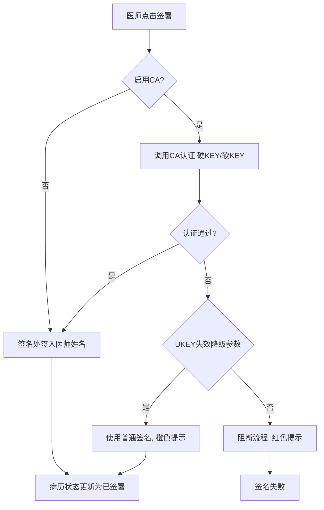
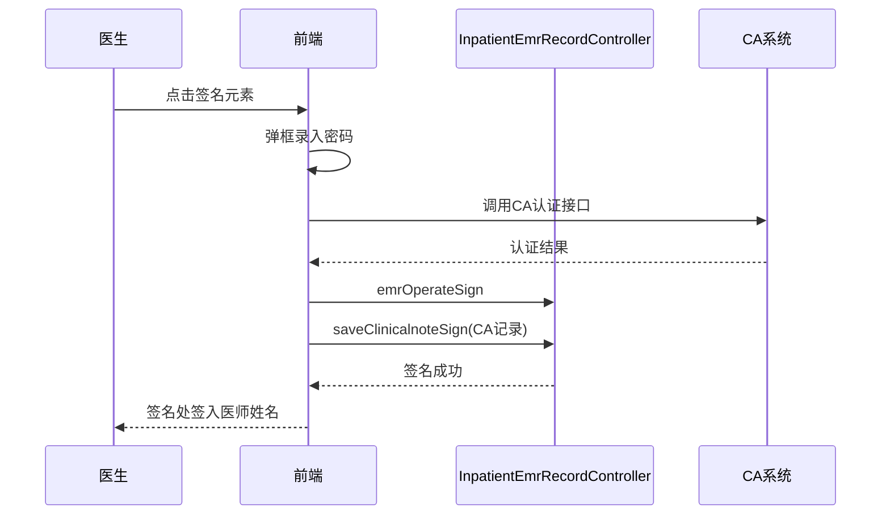

# BLGL-01-BLSX-003 病历签署 - Spec

> **功能编号**：BLGL-01-BLSX-003
> **文档类型**：功能Spec（业务背景与设计）
> **文档版本**：V1.0
> **编写时间**：2026-08-15
> **编写人**：RACC

---

## 文档索引

#### 章节索引

**Spec（研发视角）**

| 章节号 | 章节名称 | 内容说明 |
|--------|---------|---------|
| 1、 | 文档概述 | 文档目的、文档范围、术语定义、阅读指南、参考文档 |
| 2、 | 功能背景与定位 | 功能背景、功能定位、目标用户、核心价值 |
| 3、 | 业务流程设计 | 主流程/异常流程/边界流程（Given/When/Then） |
| 4、 | 数据模型设计 | 核心数据结构、状态定义、系统参数定义 |
| 5、 | 接口契约设计 | API列表、接口详细设计、错误码定义 |
| 6、 | 技术方案设计 | 页面路径、技术栈、关键技术点、部署方案 |
| 7、 | 测试用例预设计 | 功能/边界/异常/性能测试用例 |
| 8、 | 非功能性要求 | 性能、安全、可用性、兼容性 |
| 9、 | 依赖与风险 | 外部依赖、风险项 |
| 10、 | 附录 | 流程图、时序图、参考文档 |

**PM-Spec（业务视角）**

| 章节号 | 章节名称 | 内容说明 |
|--------|---------|---------|
| 一 | 目标 | 功能定位与核心价值 |
| 二 | 约束 | 业务/技术/非功能性约束 |
| 三 | 验收标准 | 验收条件与验证方法 |
| 四 | 排除范围 | 本次不做项与明确边界 |
| 五 | 关键决策记录 | 方案决策与选型理由 |
| 六 | 优先级 | 优先级定义 |
| 七 | 关联文档 | 关联文档索引 |
| 附录 | 填写检查清单 | 质量检查 |

**Analyst-Spec（产品视角）**

| 章节号 | 章节名称 | 内容说明 |
|--------|---------|---------|
| 一 | 功能编号体系 | 功能编号与层级结构 |
| 二 | 核心业务流程 | 核心业务流程与时序 |
| 三 | 功能规格说明 | 详细功能规格与验收标准 |
| 四 | 排除范围 | 排除范围 |
| 五 | 业务规则清单 | 业务规则清单 |
| 六 | 关联文档 | 关联文档索引 |
| 七 | 待确认问题清单 | 待确认问题汇总 |
| - | 填写检查清单 | 质量检查 |

#### 版本历史

| 版本 | 日期 | 变更说明 | 编写人 |
|------|------|---------|--------|
| V1.0 | 2026-08-15 | 初始版本 | RACC |

#### 关联文档索引

| 序号 | 文档名称 | 文档类型 | 版本 | 位置 |
|------|---------|---------|------|------|
| 1 | BLGL-01-BLSX-003_病历签署_PM-spec.md | PM-Spec（业务视角） | V0.1 | 本目录 |
| 2 | BLGL-01-BLSX-003_病历签署_Analyst-spec.md | Analyst-Spec（产品视角） | V1.0 | 本目录 |
| 3 | BLGL-01-BLSX-003_病历签署-Spec.md | Spec（研发视角）（本文档） | V1.0 | 本目录 |
| 4 | BLGL-01-BLSX 01病历书写功能点Spec.md | 功能点Spec（模块级） | V1.0 | 上级目录 |

---

## 1、文档概述

### 1.1、文档目的

本文档旨在明确"病历签署"功能（BLGL-01-BLSX-003）的业务背景与设计方案，为需求分析、研发实现、测试验收及评审提供统一的业务上下文、设计口径与决策依据。

### 1.2、文档范围

#### 1.2.1 纳入范围

本文档覆盖病历签署的完整业务背景与设计，包括：

- 病历签署：医师对书写的病历进行签名，在病历文书签名处签入医师姓名，不能重复签名
- 撤销签署：医师对等待提交且已经签署过的文书撤销签名，提交后的病历文书不能撤销签署
- CA签名认证：开启CA时签名必须使用硬KEY/软KEY认证，认证通过才能签名成功
- 批量签署/批量审签：批量提交/批量审签场景下自动签名
- 多人签名：产时记录接生人员多人CA签名、加签（上级医师在当前签名前加/）
- 签名工号：自动填充签署病历医师工号

#### 1.2.2 排除范围

本文档不涉及以下内容（详见其他功能点或模块）：

- 病历编辑与保存 —— BLGL-01-BLSX-002
- 病历提交与撤销提交 —— BLGL-01-BLSX-004
- 病历审签阅改（审签通过/退回/撤回）—— BLGL-01-BLSX-005
- 手术记录 —— BLGL-01-BLSX-006
- CA签名配置（UKEY失效模式参数等）—— 属基线能力（Phase 1 第6章 BC-BLSX-011）

### 1.3、术语定义

| 术语 | 定义 |
|------|------|
| 签署 | 医师对书写的病历进行签名，在病历文书中医师签名处签入医师姓名，不能进行重复签名动作 |
| 撤销签署 | 医师对等待提交且已经签署过的文书，撤销病历文书中医师签名处签入的医师姓名 |
| CA签名 | 医生在提交病历进行签名时调用CA接口，程序记录CA认证相关信息；签名时必须使用硬KEY或软KEY进行CA认证 |
| 硬KEY/软KEY | CA认证载体（USB Key / 软件证书） |
| 加签 | 上级医师在当前签名元素上加签，格式如 李四/张三 |

### 1.4、阅读指南

- **章节关系**：第1~2章为业务全貌，第3~10章为设计实现层。与 Analyst-Spec、PM-Spec 互相引用保持一致。
- **读者对象**：产品经理/需求分析师读第1~2章；研发读第3~6、9~10章；测试读第3、7~8章；评审人员核对各层一致性。

### 1.5、参考文档

| 序号 | 文档名称 | 版本/日期 |
|------|---------|----------|
| 1 | 【历史需求】住院病历的历史需求.xlsx | - |
| 2 | BLGL-01-BLSX-003_病历签署_PM-spec.md | V0.1 |
| 3 | BLGL-01-BLSX-003_病历签署_Analyst-spec.md | V1.0 |
| 4 | BLGL-01-BLSX 01病历书写功能点Spec.md | V1.0 |
| 5 | 病历书写_功能清单_20260327_151500.md | 2026-03-27 |

---

## 2、功能背景与定位

### 2.1 功能背景

病历签署是病历书写模块的关键环节，需满足：

- **法规/规范依据**：电子病历必须电子签名，任何修改病历的操作都必须签章，否则当前操作人不能打印病历
- **管理要求**：Key与电子病历用户绑定，医生站登录人与签章key一致才可签名；凡修改诊断后诊断所在病历需签章
- **历史需求演进**：从基础签署/撤销签署 → 北京CA硬key签章 → 每次签名校验CA → UKEY失效降级 → 批量审签 → 多人CA签名/加签 → 签名工号自动填充

### 2.2 功能定位

"病历签署"是 WiNEX 病历管理-病历书写的关键环节功能点，定位为：

- **签名法律效力**：病历签名/CA认证保障病历法律效力
- **签名流程入口**：签署/撤销签署/批量签署/多人签名
- **CA安全认证**：硬KEY/软KEY CA认证，UKEY失效降级控制

### 2.3 目标用户

| 用户角色 | 主要使用场景 |
|---------|-------------|
| 住院医师 | 病历签署/撤销签署/提交签名 |
| 上级医师 | 审签通过签名/加签 |
| 规培生/实习生 | 代书写病历签名（需带教老师审签） |
| 护士/麻醉师 | 特定病历多人签名（产时记录/麻醉文书） |

### 2.4 核心价值

| 价值维度 | 价值描述 |
|---------|---------|
| 法律效力 | 病历签名/CA认证保障病历法律效力 |
| 签名规范 | 不能重复签名、撤销签署规则、加签格式规范 |
| 流程效率 | 批量签署/批量审签、签名工号自动填充提升效率 |

---

## 3、业务流程设计（Given/When/Then）

### 3.1 主流程

**Scenario 1: 医师签署病历（含CA）**

```gherkin
Given:
- 医师已书写完成病历
- 病历状态为草稿/编辑中（未签署）
- 若启用CA，医师有CA业务权限且UKEY正常

When:
- 医师点击"签署"按钮
- 若启用CA，系统调用CA接口进行硬KEY/软KEY认证
- 认证通过后点击确定

Then:
- 在病历文书签名处签入医师姓名
- 病历状态更新为已签署
- 程序记录CA认证相关信息
```

**Scenario 2: 撤销签署**

```gherkin
Given:
- 病历处于等待提交状态
- 病历已签署过

When:
- 医师点击"撤销签署"

Then:
- 撤销病历文书签名处签入的医师姓名
- 病历回到未签署状态
```

### 3.2 异常流程

**Scenario 3: 业务异常——重复签署**

```gherkin
Given:
- 病历已签署

When:
- 医师再次点击签署

Then:
- 系统不允许重复签名动作
```

**Scenario 4: 数据异常——CA签章不匹配**

```gherkin
Given:
- 医生站登录人与签章key不一致

When:
- 医师点击签名元素验证CA

Then:
- 提示"当前登录用户与签章key不匹配"
- 签名失败
```

**Scenario 5: 系统异常——CA接口不可用**

```gherkin
Given:
- CA接口异常
- 参数"CA签名的ukey失效或停用时，是否不阻断流程并使用普通签名"为否（默认）

When:
- 医师签名时调用CA

Then:
- 阻断流程，红色轻提示【CA签名失败】
- 签名失败
```

### 3.3 边界流程

**Scenario 6: 边界——UKEY失效降级**

```gherkin
Given:
- 参数"CA签名的ukey失效或停用时，是否不阻断流程并使用普通签名"为是

When:
- 医师签名时UKEY失效

Then:
- 不阻断流程，使用普通签名完成签名流程
- 橙色轻提示【CA签名失败，已使用普通签名】
```

**Scenario 7: 边界——上级医师加签**

```gherkin
Given:
- 开启允许加签的参数
- 副主任创建并提交的病历

When:
- 主任点击同一签名元素，输入密码确定

Then:
- 在当前签名前自动加/（例如：李四/张三）
```

---

## 4、数据模型设计

### 4.1 核心数据结构

#### 4.1.1 核心保存请求（签署病历）

| 字段名 | 类型 | 必填 | 备注 |
|--------|------|------|------|
| inpatEmrSetId | Long | 是 | 病历ID |
| emrSaveInfo | Object | 是 | 签名保存内容 |
| caDataElementGroupNo | String | 否 | CA签名数据元分组（xid） |
| caSignatureId | String | 否 | CA签名ID |
| caActionCode | String | 是 | CA签名动作码（399542633签署病历/399542630提交病历） |
| caSuccessFlag | String | 是 | CA签名成功标志（-98175和98176） |

#### 4.1.2 核心表/实体

| 表/实体 | 关键字段 | 说明 |
|---------|---------|------|
| INP_EMR_CA_SIGNATURE_RECORD（InpatientCASignatureRecordPO） | INP_EMR_CA_SIGNATURE_RECORD_ID、INP_EMR_SET_ID、INP_EMR_RECORD_ID、SUBMIT_BY/SUBMIT_BY_NAME | CA签名记录表 |
| INPATIENT_EMR_SET（InpatientEmrSetPO） | INP_EMR_SET_ID、INP_EMR_STATUS（状态）、CA_ALL_SUCCESS_FLAG（CA全部成功标志） | 病历主表 |
| INP_EMR_SET_ESIGN（InpatEmrSignRecordPO） | 签名记录字段 | 病历电子签名记录 |

### 4.2 状态定义

| 状态码 | 状态名称 | 说明 |
|--------|---------|------|
| 390030405 | 草稿 | 未签署 |
| 390030406 | 已签署 | 已签名 |
| 399017130 | 已提交 | 提交后 |

### 4.3 系统参数定义

| 参数编码 | 参数名称 | 说明 |
|---------|---------|------|
| CA_SIGNATURE | 是否启用CA签名 | True |
| CA_SIGNATURE 相关（COMMON114） | CA签名的UKEY失效或停用时采用的签名模式 | 1阻断流程/2普通签名/3文字图片/4医生姓名文字 |
| COMMON071 | 点击签名元素是否弹出签名框 | 默认否 |
| COMMON145 | 系统生成的签名图片的字体是否加粗 | True |
| COMMON180 | CA对接模式 | 业务对接/组件对接，默认业务对接 |
| COMMON194 | 启用CA签名时是否判断用户主数据CA权限 | {是，否}，默认是 |
| EMR_SIGN_PICTURE | 病历签名时插入的图片来源 | 1员工签名图片/2姓名文字图片/3优先员工图片无则姓名文字 |
| EMR_SIGN_PICTURE_HEIGHT | 设置病历文书中签名图片的高度 | 默认30px |
| COMMON315 | 撤销提交时清除病历签名的逻辑 | submit清空撤销提交人/all清空全部 |

---

## 5、接口契约设计

### 5.1 API列表

| 序号 | API名称（代码函数） | 路径 | 方法 | 说明 |
|:----:|---------|------|:----:|------|
| 1 | signInpatientEmrSet（emrOperateSign） | /api/v1/app_record_inpatient/emr_inpatient/emr_set/operate/sign | POST | 签署病历内容操作按钮 |
| 2 | cancelInpatientEMRSign | /api/v1/app_record_inpatient/emr_inpatient/cancel_sign/by_id | POST | 撤回住院病历签署接口 |
| 3 | saveClinicalnoteSign | /api/v1/app_record_inpatient/emr_set/save/ca/signature_record | POST | 保存CA签名信息 |
| 4 | saveAuditEmr | /api/v1/app_record_inpatient/emr_inpatient/audit/save_audit_emr | POST | 审签保存（含签名） |
| 5 | signEmrAfterSubmit | /api/v1/app_record_inpatient/emr_inpatient/emr_set/content/edit_sign | POST | 编辑保存已提交的病历-签名 |
| 6 | unsignEmrAfterSubmit | /api/v1/app_record_inpatient/emr_inpatient/emr_set/content/edit_unsign | POST | 编辑保存已提交的病历-撤销签名 |
| 7 | addEmrCounterSign | /api/v1/app_record_inpatient/emr_inpatient/auth_sigin/add_auth_sign | POST | 授权加签 |
| 8 | INPATIENT_EMR_CA_SIGNATURE_RECORD_SAVE_V1 | /api/v1/app_record_inpatient/emr_inpatient/ca_signature_record/save | POST | 保存CA签名信息 |

### 5.2 接口详细设计

#### 5.2.1 签署病历（emrOperateSign）

**请求参数**:
```json
{
  "inpatEmrSetId": "病历ID",
  "emrSaveInfo": "签名保存内容",
  "caDataElementGroupNo": "xid",
  "caActionCode": "399542633",
  "caSuccessFlag": "签名成功标志"
}
```

**返回值（成功）**:
```json
{
  "success": true,
  "data": {
    "modifyTime": "内容修改时间"
  }
}
```

**返回值（失败）**:
```json
{
  "success": false,
  "message": "<错误信息，如：当前登录用户与签章key不匹配>",
  "data": null
}
```

> 请求/返回字段结构以 API 契约文档为准。

### 5.3 错误码定义

| 错误码 | 错误信息 | 处理方式 |
|--------|---------|---------|
| 待确认 | 当前登录用户与签章key不匹配 | 签名失败提示 |
| 待确认 | CA签名失败 | 按COMMON114配置阻断或降级 |
| 待确认 | 不能进行重复签名动作 | 阻断重复签署 |

---

## 6、技术方案设计

### 6.1 页面路径

- **页面路径**: 住院医生站→住院病历书写界面→病历编辑器→签署按钮（EmrEditor/components/BaseEditor）
- **组件**：BaseEditor/index.vue（签署按钮/撤销签署/审签通过/退回）、BaseEditor/mixins/signature.js（签名流程）、caAction.js（CA签名）、CaSignDialog.vue（CA签名查询）、BatchSubmitContainer.vue（批量提交签名）
- **核心逻辑模块**: InpatientEmrRecordController（signInpatientEmrSet/cancelInpatientEMRSign）+ InpatientEmrReviewController（审签签名）

### 6.2 技术栈

| 类别 | 技术 | 版本 |
|------|------|------|
| 前端框架 | Vue | 2.6.14 |
| 前端UI | element-ui | 2.13.0 |
| 后端框架 | Spring Boot（Java） | 17 |

### 6.3 关键技术点

- 签署走 emr_set/operate/sign
- CA签名：硬KEY/软KEY认证，弹框录入密码，认证通过签名成功
- 加签格式：上级医师在当前签名前自动加/（李四/张三）
- 签名工号：签名数据元配置联动元素【签名医师工号(399687424)】时自动填充工号，取用户账号user_code
- 多人CA签名：产时记录接生人员支持多人CA签名

### 6.4 部署方案

⏳ 待确认：部署方案未在资料区中找到。

---

## 7、测试用例预设计

### 7.1 功能测试

| 用例编号 | 测试场景 | Given | When | Then |
|---------|---------|-------|------|------|
| TC-001 | 签署病历（无CA） | 病历未签署 | 点击签署 | 签名处签入医师姓名，状态更新为已签署 |
| TC-002 | 签署病历（含CA） | 启用CA且UKEY正常 | 点击签名元素验证CA | 认证通过签名成功，记录CA信息 |
| TC-003 | 撤销签署 | 病历等待提交且已签署 | 点击撤销签署 | 撤销签名，回到未签署状态 |

### 7.2 边界测试

| 用例编号 | 测试场景 | Given | When | Then |
|---------|---------|-------|------|------|
| TC-004 | UKEY失效降级 | 参数设为是 | UKEY失效签名 | 使用普通签名，橙色轻提示 |
| TC-005 | 上级医师加签 | 开启加签参数 | 主任点击同一签名元素 | 当前签名前自动加/（李四/张三） |

### 7.3 异常测试

| 用例编号 | 测试场景 | Given | When | Then |
|---------|---------|-------|------|------|
| TC-006 | 重复签署 | 病历已签署 | 再次签署 | 不允许重复签名 |
| TC-007 | CA签章不匹配 | 登录人与key不一致 | 验证CA | 提示不匹配，签名失败 |
| TC-008 | CA接口异常 | 参数设为否 | 签名调用CA | 阻断流程，红色提示 |

### 7.4 性能测试

| 用例编号 | 测试场景 | 指标 |
|---------|---------|------|
| TC-009 | CA签名响应 | ⏳ 待确认：性能指标未在资料区中找到 |

---

## 8、非功能性要求

### 8.1 性能要求

| 指标 | 要求 |
|------|------|
| CA签名响应时间 | ⏳ 待确认 |

### 8.2 安全要求

| 要求 | 说明 |
|------|------|
| CA认证 | 硬KEY/软KEY认证，认证通过才能签名成功 |
| KEY绑定 | Key与电子病历用户绑定，医生站登录人与签章key一致才可签名 |

**医疗行业特殊要求**

| 要求 | 说明 |
|------|------|
| 病历法律效力 | 任何修改病历的操作必须签章，否则当前操作人不能打印病历 |
| 签名工号准确性 | 签名工号取用户账号user_code |

### 8.3 可用性要求

| 指标 | 要求值 |
|------|--------|
| 可用性 | ⏳ 待确认 |

### 8.4 兼容性要求

| 类型 | 要求 |
|------|------|
| CA对接模式 | 业务对接/组件对接，默认业务对接 |
| 签名图片来源 | 员工签名图片/姓名文字图片配置 |

---

## 9、依赖与风险

### 9.1 外部依赖

| 依赖项 | 说明 |
|--------|------|
| CA认证系统 | CA签名接口，北京CA等 |
| 主数据 | 员工工号/用户账号/CA权限 |

### 9.2 风险项

| 风险项 | 等级 | 说明 | 应对方案 |
|--------|------|------|---------|
| CA接口不可用 | 高 | CA中断影响签名流程 | UKEY失效降级参数控制 |
| 签章KEY不匹配 | 中 | 登录人与签章key不一致导致签名失败 | 绑定关系校验提示 |
| 加签权限滥用 | 低 | 加签授权需权限控制 | 加签参数+权限控制 |

---

## 10、附录

### 10.1 流程图



### 10.2 时序图



### 10.3 参考文档

- 病历书写_功能清单_20260327_151500.md（病历文书操作-签署病历/撤销签署、CA签名）
- 【历史需求】住院病历的历史需求.xlsx
- BLGL-01-BLSX 01病历书写功能点Spec.md（V1.0，第5章 BLGL-01-BLSX-003 行）
- 关联Spec：BLGL-01-BLSX-003_病历签署_PM-spec.md、BLGL-01-BLSX-003_病历签署_Analyst-spec.md

---

## 填写检查清单

| 序号 | 检查项 | 是否完成 |
|:----:|--------|:--------:|
| 1 | 章节索引与正文章节一致 | ✅ |
| 2 | 版本历史记录完整 | ✅ |
| 3 | 关联文档索引已登记全部Spec | ✅ |
| 4 | 文档目的明确回答"为什么做/做成什么/怎么做" | ✅ |
| 5 | 纳入范围/排除范围清晰 | ✅ |
| 6 | 术语定义覆盖关键概念，从资料区可溯源 | ✅ |
| 7 | 参考文档已登记 | ✅ |
| 8 | 功能背景基于法规/规范/需求来源组织 | ✅ |
| 9 | 功能定位体现业务价值（3~5个定位点） | ✅ |
| 10 | 目标用户角色覆盖完整，在需求原文中有出处 | ✅ |
| 11 | 核心价值可陈述，与 Phase 1 口径一致 | ✅ |
| 12 | 业务流程：主流程≥1、异常≥3、边界≥2，Given/When/Then 具体 | ✅ |
| 13 | 数据模型：字段/表/状态/参数可溯源 | ✅ |
| 14 | 接口契约：API列表+详细设计+错误码齐全或标记待确认 | ✅ |
| 15 | 技术方案：页面路径/技术栈/关键点/部署方案或标记待确认 | ✅ |
| 16 | 测试用例：功能/边界/异常/性能覆盖 | ✅ |
| 17 | 非功能性要求：性能/安全/可用性/兼容性指标可量化或标记待确认 | ✅ |
| 18 | 依赖与风险：外部依赖登记完整 | ✅ |
| 19 | 附录：流程图/时序图与正文流程一致 | ✅ |
| 20 | 全文无占位符 `< >` 残留 | ✅ |
| 21 | 全文陈述可溯源至资料区 | ✅ |
| 22 | 人工审核确认完成 | ⏳ 待确认 |

---

**文档状态**：⬜ 待审核
**维护责任**：RACC
**下次更新**：根据评审反馈优化