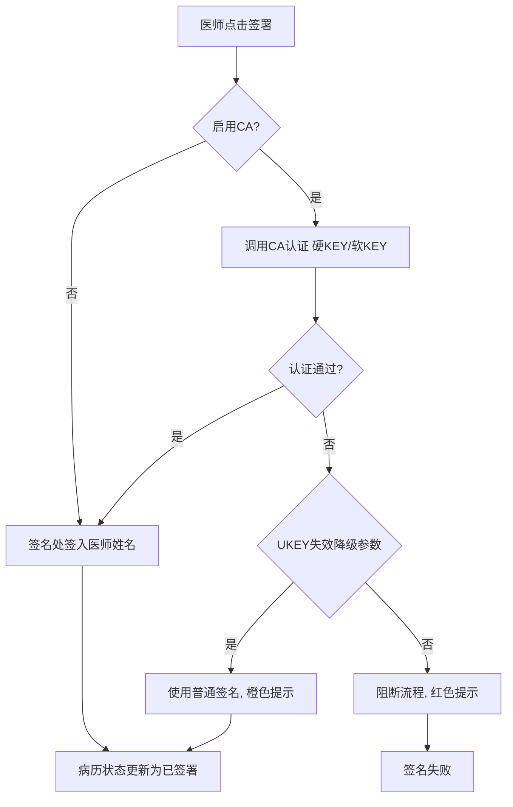
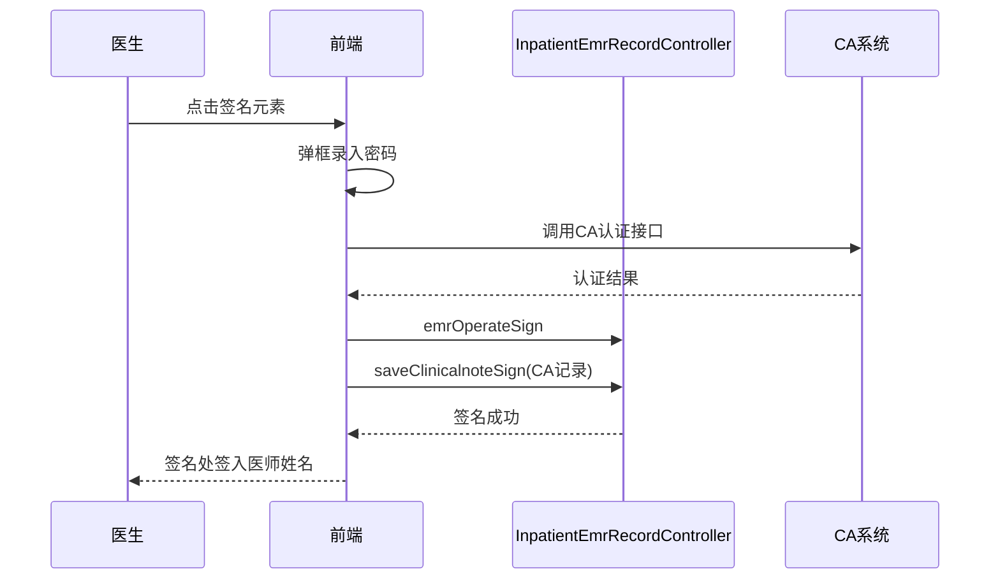

# BLGL-01-BLSX-003 病历签署 _ Analyst - Spec

> **需求编号**：BLGL-01-BLSX-003
> **父需求**：BLGL-01-BLSX
> **关联PM Spec**：BLGL-01-BLSX-003_病历签署_PM-spec.md
> **Spec版本**：V1.0
> **编写时间**：2026-08-15
> **编写人**：需求分析师

---

## 一、功能编号体系

### 1.1 功能层级结构

```
BLGL-01-BLSX-003-001: 病历签署
  ├─ BLGL-01-BLSX-003-001-01: 签署病历（签名处签入医师姓名）
  ├─ BLGL-01-BLSX-003-001-02: 不能重复签名
  └─ BLGL-01-BLSX-003-001-03: 撤销签署

BLGL-01-BLSX-003-002: CA签名认证
  ├─ BLGL-01-BLSX-003-002-01: CA认证（硬KEY/软KEY）
  ├─ BLGL-01-BLSX-003-002-02: CA签名记录保存
  ├─ BLGL-01-BLSX-003-002-03: UKEY失效降级
  └─ BLGL-01-BLSX-003-002-04: 签章KEY绑定校验

BLGL-01-BLSX-003-003: 批量签署与多人签名
  ├─ BLGL-01-BLSX-003-003-01: 批量签署/批量审签
  ├─ BLGL-01-BLSX-003-003-02: 多人CA签名
  ├─ BLGL-01-BLSX-003-003-03: 上级医师加签
  └─ BLGL-01-BLSX-003-003-04: 签名工号自动填充
```

### 1.2 功能编号表

| REQ-ID | 功能名称 | 类型 | 优先级 | 说明 |
|--------|---------|------|--------|------|
| BLGL-01-BLSX-003-001 | 病历签署 | 功能 | P0 | 医师对书写的病历进行签名，不能重复签名，可撤销签署 |
| BLGL-01-BLSX-003-001-01 | 签署病历 | 子功能 | P0 | 签名处签入医师姓名，状态更新为已签署 |
| BLGL-01-BLSX-003-001-02 | 不能重复签名 | 子功能 | P0 | 已签署病历不能再次签署 |
| BLGL-01-BLSX-003-001-03 | 撤销签署 | 子功能 | P0 | 等待提交且已签署的文书可撤销签名，提交后不能 |
| BLGL-01-BLSX-003-002 | CA签名认证 | 功能 | P0 | 硬KEY/软KEY认证，认证通过才能签名成功 |
| BLGL-01-BLSX-003-002-01 | CA认证 | 子功能 | P0 | 调用CA接口，弹框录入密码 |
| BLGL-01-BLSX-003-002-02 | CA签名记录保存 | 子功能 | P0 | 程序记录CA认证相关信息 |
| BLGL-01-BLSX-003-002-03 | UKEY失效降级 | 子功能 | P0 | 按参数阻断或使用普通签名 |
| BLGL-01-BLSX-003-002-04 | 签章KEY绑定校验 | 子功能 | P0 | 登录人与签章key不一致提示 |
| BLGL-01-BLSX-003-003 | 批量签署与多人签名 | 功能 | P1 | 批量审签/多人CA签名/加签/工号填充 |
| BLGL-01-BLSX-003-003-01 | 批量签署 | 子功能 | P1 | 批量提交/审签自动签名 |
| BLGL-01-BLSX-003-003-02 | 多人CA签名 | 子功能 | P1 | 产时记录接生人员多人CA签名 |
| BLGL-01-BLSX-003-003-03 | 上级医师加签 | 子功能 | P1 | 当前签名前自动加/（李四/张三） |
| BLGL-01-BLSX-003-003-04 | 签名工号自动填充 | 子功能 | P1 | 自动填充签署病历医师工号 |

---

## 二、核心业务流程

### 2.1 病历签署主流程



### 2.2 病历签署时序



---

## 三、功能规格说明


### BLGL-01-BLSX-003-001: 病历签署

#### 3.1.1 功能概述

医师对书写的病历进行签名，在签名处签入医师姓名，不能重复签名，等待提交且已签署的文书可撤销签署。

#### 3.1.2 用户角色

| 角色 | 使用场景 | 权限要求 | 操作频率 |
|------|---------|---------|---------|
| 住院医师 | 病历签署/撤销签署 | 病历签署权限 | 高频 |

#### 3.1.3 业务流程（Given/When/Then）

##### 主流程

**Scenario 1: 签署病历**

```gherkin
Given:
- 医师已书写完成病历
- 病历未签署

When:
- 医师点击"签署"按钮

Then:
- 在病历文书签名处签入医师姓名
- 病历状态更新为已签署
```

##### 异常流程

**Scenario 2: 业务异常——重复签名**

```gherkin
Given:
- 病历已签署

When:
- 医师再次点击签署

Then:
- 系统不允许重复签名动作
```

**Scenario 3: 数据异常——撤销签署限制**

```gherkin
Given:
- 病历已提交

When:
- 医师点击撤销签署

Then:
- 提交后的病历文书不能撤销签署
```

**Scenario 4: 系统异常——签名接口异常**

```gherkin
Given:
- 签署接口（operate/sign）异常

When:
- 医师点击签署

Then:
- 签名失败提示，可重试
```

##### 边界流程

**Scenario 5: 边界——撤销签署**

```gherkin
Given:
- 病历等待提交且已签署

When:
- 医师点击撤销签署

Then:
- 撤销签名处医师姓名，回到未签署状态
```

**Scenario 6: 边界——签名图片来源**

```gherkin
Given:
- 参数"病历签名时插入的图片来源"已配置

When:
- 医师签名

Then:
- 按配置使用员工签名图片或姓名文字图片
```

#### 3.1.5 验收标准

| AC编号 | 验收标准 | 对应REQ-ID | 验证方法 | 验证场景 |
|--------|---------|-----------|---------|---------|
| AC-001 | 签署病历在签名处签入医师姓名，状态更新为已签署 | BLGL-01-BLSX-003-001 | 功能测试 | Scenario 1 |
| AC-002 | 已签署病历不能重复签署 | BLGL-01-BLSX-003-001 | 功能测试 | Scenario 2 |
| AC-003 | 提交后的病历不能撤销签署 | BLGL-01-BLSX-003-001 | 功能测试 | Scenario 3 |


### BLGL-01-BLSX-003-002: CA签名认证

#### 3.2.1 功能概述

开启CA时签名必须使用硬KEY/软KEY认证，认证通过才能签名成功；程序记录CA认证信息；UKEY失效降级控制。

#### 3.2.2 用户角色

| 角色 | 使用场景 | 权限要求 | 操作频率 |
|------|---------|---------|---------|
| 住院医师 | CA认证签名 | CA业务权限 | 高频 |

#### 3.2.3 业务流程（Given/When/Then）

##### 主流程

**Scenario 1: CA认证签名**

```gherkin
Given:
- 启用CA
- 医师有CA业务权限
- UKEY正常

When:
- 医师点击签名元素
- 弹框录入密码，点击确定

Then:
- CA认证通过
- 签名成功，程序记录CA认证信息
```

##### 异常流程

**Scenario 2: 业务异常——签章不匹配**

```gherkin
Given:
- 登录人与签章key不一致

When:
- 医师签名验证CA

Then:
- 提示"当前登录用户与签章key不匹配"，签名失败
```

**Scenario 3: 数据异常——CA权限关闭**

```gherkin
Given:
- 参数"启用CA签名时是否判断用户主数据CA权限"为是
- 主数据关闭该用户CA权限

When:
- 医师签名

Then:
- 不调用CA接口
```

**Scenario 4: 系统异常——UKEY失效阻断**

```gherkin
Given:
- UKEY失效
- 参数"CA签名的ukey失效或停用时，是否不阻断流程并使用普通签名"为否（默认）

When:
- 医师签名

Then:
- 阻断流程，红色轻提示【CA签名失败】
```

##### 边界流程

**Scenario 5: 边界——UKEY失效降级**

```gherkin
Given:
- 参数为是

When:
- 医师签名时UKEY失效

Then:
- 使用普通签名，橙色轻提示【CA签名失败，已使用普通签名】
```

**Scenario 6: 边界——CA签名记录保存**

```gherkin
Given:
- CA认证通过

When:
- 医师签名

Then:
- 保存CA签名信息（caActionCode/caSignatureId/caSuccessFlag）
```

#### 3.2.5 验收标准

| AC编号 | 验收标准 | 对应REQ-ID | 验证方法 | 验证场景 |
|--------|---------|-----------|---------|---------|
| AC-001 | 启用CA时签名必须CA认证通过才能成功，记录CA认证信息 | BLGL-01-BLSX-003-002 | 集成测试 | Scenario 1 |
| AC-002 | UKEY失效按参数阻断或降级 | BLGL-01-BLSX-003-002 | 功能测试 | Scenario 4/5 |
| AC-003 | 登录人与签章key不匹配时提示并失败 | BLGL-01-BLSX-003-002 | 功能测试 | Scenario 2 |


### BLGL-01-BLSX-003-003: 批量签署与多人签名

#### 3.3.1 功能概述

批量签署/批量审签自动签名、多人CA签名（产时记录接生人员）、上级医师加签、签名工号自动填充。

#### 3.3.2 用户角色

| 角色 | 使用场景 | 权限要求 | 操作频率 |
|------|---------|---------|---------|
| 住院医师 | 批量提交签名 | 签署权限 | 中频 |
| 上级医师 | 批量审签/加签 | 审签权限 | 中频 |
| 护士 | 产时记录多人CA签名 | 特定文书权限 | 低频 |

#### 3.3.3 业务流程（Given/When/Then）

##### 主流程

**Scenario 1: 批量审签签名**

```gherkin
Given:
- 医生打开批量审签弹窗
- 存在待我审签的病历

When:
- 勾选病历（未在窗口打开的病历置灰无法选择）
- 点击审签通过

Then:
- 批量更新病历状态
- 审签通过的病历在病历上更新签名
```

##### 异常流程

**Scenario 2: 业务异常——未打开病历无法选择**

```gherkin
Given:
- 批量审签弹窗打开

When:
- 医生尝试勾选未在窗口打开的病历

Then:
- 置灰无法选择，提醒需要在当前页面打开
```

**Scenario 3: 数据异常——多人签名工号**

```gherkin
Given:
- 签名数据元配置联动元素【签名医师工号(399687424)】

When:
- 医师签名一个元素填充多个签名

Then:
- 工号获取最新的一个签名的工号
- 撤销医师签名也同时撤销工号
```

**Scenario 4: 系统异常——批量签名中断**

```gherkin
Given:
- 批量提交/审签过程中签名接口异常

When:
- 批量操作中断

Then:
- 已成功病历签名生效，失败病历提示重试
```

##### 边界流程

**Scenario 5: 边界——上级医师加签**

```gherkin
Given:
- 开启允许加签参数

When:
- 主任点击同一签名元素输入密码确定

Then:
- 当前签名前自动加/（李四/张三）
```

**Scenario 6: 边界——多人CA签名**

```gherkin
Given:
- 产时记录接生人员

When:
- 多医护签名

Then:
- 支持多人CA签名，按时间正序的第一位接生人员上传臻鼎
```

#### 3.3.5 验收标准

| AC编号 | 验收标准 | 对应REQ-ID | 验证方法 | 验证场景 |
|--------|---------|-----------|---------|---------|
| AC-001 | 批量审签通过后病历更新签名 | BLGL-01-BLSX-003-003 | 功能测试 | Scenario 1 |
| AC-002 | 上级医师加签在当前签名前自动加/ | BLGL-01-BLSX-003-003 | 功能测试 | Scenario 5 |
| AC-003 | 签名时自动填充签署病历医师工号 | BLGL-01-BLSX-003-003 | 功能测试 | Scenario 3 |


---

## 四、排除范围

本需求不包含以下功能项：

1. **病历编辑与保存 —— BLGL-01-BLSX-002**
2. **病历提交与撤销提交 —— BLGL-01-BLSX-004**
3. **病历审签阅改（审签通过/退回/撤回）—— BLGL-01-BLSX-005**
4. **手术记录 —— BLGL-01-BLSX-006**
5. **CA签名配置（UKEY失效模式参数）—— Phase 1 第6章 BC-BLSX-011**

---

## 五、业务规则清单

| 规则ID | 规则名称 | 规则描述 | 来源 | 优先级 |
|--------|---------|---------|------|--------|
| BR-001 | 签署动作 | 医师对书写的病历进行签名，在签名处签入医师姓名，不能进行重复签名动作 | 需求 | P0 |
| BR-002 | 撤销签署限制 | 医师对等待提交且已经签署过的文书撤销签名；提交后的病历文书不能撤销签署 | 需求 | P0 |
| BR-003 | CA认证必须 | 签名时必须使用硬KEY/软KEY进行CA认证，认证通过才能签名成功 | 需求 | P0 |
| BR-004 | KEY绑定 | Key与电子病历用户绑定，医生站登录人与签章key一致才可签名 | 需求 | P0 |
| BR-005 | 修改必签章 | 任何修改病历的操作都必须签章，否则当前操作人不能打印病历 | 需求 | P0 |
| BR-006 | UKEY降级 | CA签名失败时按COMMON114参数配置：阻断或使用普通签名/文字图片/医生姓名文字 | 需求 | P0 |
| BR-007 | 加签格式 | 上级医师加签在当前签名前自动加/（例如：李四/张三） | 需求 | P1 |
| BR-008 | 签名工号 | 签名数据元配置联动元素签名医师工号时自动填充，取用户账号user_code；撤销签名同时撤销工号 | 需求 | P1 |

---

## 六、关联文档

| 文档类型 | 文档路径 | 说明 |
|---------|---------|------|
| PM-Spec（业务视角） | 本目录 BLGL-01-BLSX-003_病历签署_PM-spec.md（V0.1） | PM 产出的 Spec 文档 |
| Analyst-Spec（产品视角） | 本目录 BLGL-01-BLSX-003_病历签署_Analyst-spec.md（V1.0） | 分析规格文档 |
| Spec（研发视角） | 本目录 BLGL-01-BLSX-003_病历签署-Spec.md（V1.0） | 业务背景与目标 Spec |
| 功能点Spec | BLGL-01-BLSX 01病历书写功能点Spec.md（V1.0，上级目录） | Phase 1 功能点索引 |
| data-model.md | 待产出 | 架构师产出的数据建模文档 |
| design.md | 待产出 | 架构师产出的技术方案文档 |
| api-contract.md | 待产出 | 开发经理产出的 API 契约文档 |

---

## 七、待确认问题清单

| 编号 | 问题描述 | 缺失信息 | 影响范围 | 建议补充方 |
|------|---------|---------|---------|-----------|
| Q-001 | 签署接口完整入参/出参字段结构 | API 契约文档 | -Spec 第5章、Analyst-Spec 数据字段 | 开发经理 |
| Q-002 | CA签名相关参数编码（CA_SIGNATURE/COMMON114等） | 参数配置说明表 | 数据字段（概念ID） | 产品经理 |
| Q-003 | 性能指标（CA签名响应） | 非功能性需求 | -Spec 第8章 | 需求分析师 |
| Q-004 | 多人CA签名上传臻鼎的字段对应关系 | 臻鼎平台接口 | 多人签名场景 | 接口负责人 |
| Q-005 | 撤销签署/撤销签名与审签流程的耦合细节 | 设计文档 | 签署/审签场景 | 架构师 |

---

## 填写检查清单

| 序号 | 检查项 | 是否完成 |
|:----:|--------|:--------:|
| 1 | 功能编号带父子层级 | ✅ |
| 2 | 每个 REQ-ID 有功能概述和用户角色 | ✅ |
| 3 | 主流程至少 1 个 Given/When/Then 场景 | ✅ |
| 4 | 异常流程至少 3 个 Given/When/Then 场景 | ✅ |
| 5 | 边界流程至少 2 个 Given/When/Then 场景 | ✅ |
| 6 | 每个 Given/When/Then 内容具体，不模糊 | ✅ |
| 7 | 数据字段定义完整（字段名、类型、必填、说明、概念ID） | N/A |
| 8 | 验收标准 AC 编号独立，可验证 | ✅ |
| 9 | 验收标准无"功能正常"等模糊表述 | ✅ |
| 10 | 排除范围明确列出 | ✅ |
| 11 | 业务规则清单列出所有规则，每条标注来源 | ✅ |
| 12 | 流程图使用 Mermaid 格式（≥2 个） | ✅ |
| 13 | 关联文档索引包含 Phase 1 功能点Spec | ✅ |
| 14 | 待确认问题清单汇总了全文所有 ⏳ 项 | ✅ |
| 15 | 全文无占位符 `< >` 残留 | ✅ |
| 16 | 全文陈述可溯源至资料区（S1~S10 溯源核查） | ✅ |
| 17 | 人工审核确认完成 | ⏳ 待确认 |

---

**文档状态**：⬜ 待审核
**维护责任**：需求分析师规范组
**下次更新**：根据评审反馈优化

---

## 版本历史

| 版本 | 日期 | 变更说明 | 编写人 |
|------|------|---------|--------|
| V1.0 | 2026-08-15 | 初始版本 | 需求分析师 |