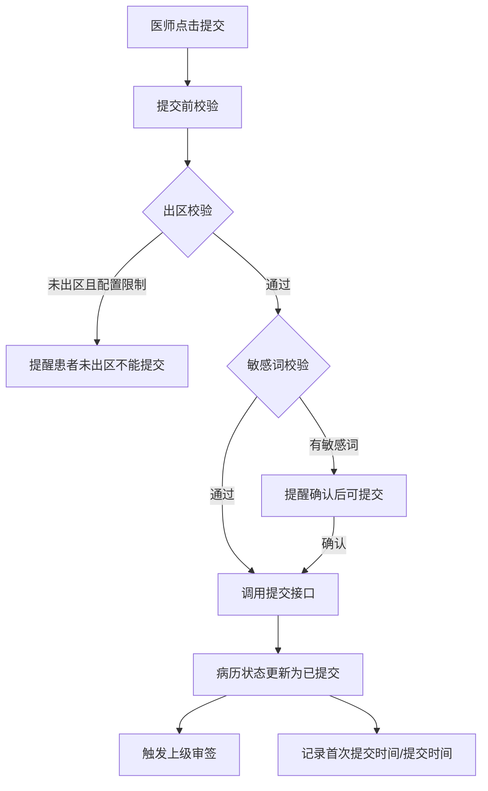
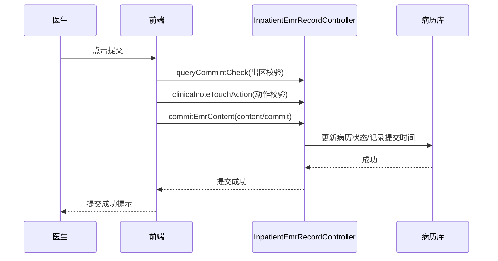

# BLGL-01-BLSX-004_病历提交与撤销提交-Spec

> **功能编号**：BLGL-01-BLSX-004
> **文档类型**：功能Spec（业务背景与设计）
> **文档版本**：V1.0
> **编写时间**：2026-08-15
> **编写人**：RACC

---

## 文档索引

#### 章节索引

**Spec（研发视角）**

| 章节号 | 章节名称 | 内容说明 |
|--------|---------|---------|
| 1、 | 文档概述 | 文档目的、文档范围、术语定义、阅读指南、参考文档 |
| 2、 | 功能背景与定位 | 功能背景、功能定位、目标用户、核心价值 |
| 3、 | 业务流程设计 | 主流程/异常流程/边界流程（Given/When/Then） |
| 4、 | 数据模型设计 | 核心数据结构、状态定义、系统参数定义 |
| 5、 | 接口契约设计 | API列表、接口详细设计、错误码定义 |
| 6、 | 技术方案设计 | 页面路径、技术栈、关键技术点、部署方案 |
| 7、 | 测试用例预设计 | 功能/边界/异常/性能测试用例 |
| 8、 | 非功能性要求 | 性能、安全、可用性、兼容性 |
| 9、 | 依赖与风险 | 外部依赖、风险项 |
| 10、 | 附录 | 流程图、时序图、参考文档 |

**PM-Spec（业务视角）**

| 章节号 | 章节名称 | 内容说明 |
|--------|---------|---------|
| 一 | 目标 | 功能定位与核心价值 |
| 二 | 约束 | 业务/技术/非功能性约束 |
| 三 | 验收标准 | 验收条件与验证方法 |
| 四 | 排除范围 | 本次不做项与明确边界 |
| 五 | 关键决策记录 | 方案决策与选型理由 |
| 六 | 优先级 | 优先级定义 |
| 七 | 关联文档 | 关联文档索引 |
| 附录 | 填写检查清单 | 质量检查 |

**Analyst-Spec（产品视角）**

| 章节号 | 章节名称 | 内容说明 |
|--------|---------|---------|
| 一 | 功能编号体系 | 功能编号与层级结构 |
| 二 | 核心业务流程 | 核心业务流程与时序 |
| 三 | 功能规格说明 | 详细功能规格与验收标准 |
| 四 | 排除范围 | 排除范围 |
| 五 | 业务规则清单 | 业务规则清单 |
| 六 | 关联文档 | 关联文档索引 |
| 七 | 待确认问题清单 | 待确认问题汇总 |
| - | 填写检查清单 | 质量检查 |

#### 版本历史

| 版本 | 日期 | 变更说明 | 编写人 |
|------|------|---------|--------|
| V1.0 | 2026-08-15 | 初始版本 | RACC |

#### 关联文档索引

| 序号 | 文档名称 | 文档类型 | 版本 | 位置 |
|------|---------|---------|------|------|
| 1 | BLGL-01-BLSX-004_病历提交与撤销提交_PM-spec.md | PM-Spec（业务视角） | V0.1 | 本目录 |
| 2 | BLGL-01-BLSX-004_病历提交与撤销提交_Analyst-spec.md | Analyst-Spec（产品视角） | V1.0 | 本目录 |
| 3 | BLGL-01-BLSX-004_病历提交与撤销提交-Spec.md | Spec（研发视角）（本文档） | V1.0 | 本目录 |
| 4 | BLGL-01-BLSX 01病历书写功能点Spec.md | 功能点Spec（模块级） | V1.0 | 上级目录 |

---

## 1、文档概述

### 1.1、文档目的

本文档旨在明确"病历提交与撤销提交"功能（BLGL-01-BLSX-004）的业务背景与设计方案，为需求分析、研发实现、测试验收及评审提供统一的业务上下文、设计口径与决策依据。

### 1.2、文档范围

#### 1.2.1 纳入范围

本文档覆盖病历提交与撤销提交的完整业务背景与设计，包括：

- 病历提交：医师对完成的病历提交后由上级医师进行审核，不能重复提交动作
- 撤销提交：病历文书未提交时不能撤销提交；提交后上级医师未审核时允许撤销提交；审核后不允许撤销提交
- 批量提交/批量撤销提交：批量提交病历、批量撤销提交
- 提交校验：提交前校验（出区限制、敏感词汇、必填校验）、提交后修改提醒
- 提交时间记录：病历簿新增首次提交时间/提交时间/创建时间字段
- 打印模式：自动提交（签名即提交）/手动提交（签名后点击提交）

#### 1.2.2 排除范围

本文档不涉及以下内容（详见其他功能点或模块）：

- 病历编辑与保存 —— BLGL-01-BLSX-002
- 病历签署—— BLGL-01-BLSX-003
- 病历审签阅改 —— BLGL-01-BLSX-005
- 手术记录 —— BLGL-01-BLSX-006
- 书写任务与时限提醒 —— BLGL-01-BLSX-007

### 1.3、术语定义

| 术语 | 定义 |
|------|------|
| 提交 | 医师对完成的病历提交后由上级医师进行审核，不能重复提交动作 |
| 撤销提交 | 病历文书未提交时不能进行撤销提交；病历文书提交后，上级医师未审核时允许医师进行撤销提交；上级医师审核后不允许撤销提交动作 |
| 出区 | 患者离开当前病区 |
| 首次提交时间 | 记录每份病历第一次提交的时间，数据产生后不再更新 |

### 1.4、阅读指南

- **章节关系**：第1~2章为业务全貌，第3~10章为设计实现层。与 Analyst-Spec、PM-Spec 互相引用保持一致。
- **读者对象**：产品经理/需求分析师读第1~2章；研发读第3~6、9~10章；测试读第3、7~8章；评审人员核对各层一致性。

### 1.5、参考文档

| 序号 | 文档名称 | 版本/日期 |
|------|---------|----------|
| 1 | 【历史需求】住院病历的历史需求.xlsx | - |
| 2 | BLGL-01-BLSX-004_病历提交与撤销提交_PM-spec.md | V0.1 |
| 3 | BLGL-01-BLSX-004_病历提交与撤销提交_Analyst-spec.md | V1.0 |
| 4 | BLGL-01-BLSX 01病历书写功能点Spec.md | V1.0 |
| 5 | 病历书写_功能清单_20260327_151500.md | 2026-03-27 |

---

## 2、功能背景与定位

### 2.1 功能背景

病历提交与撤销提交是病历书写流程的环节功能，需满足：

- **现状痛点**：病历提交后修改信息无提醒、提交校验不完整、出区前可提交部分病历导致质控问题
- **管理要求**：提交后由上级医师审核，不能重复提交；撤销提交受审核状态约束
- **历史需求演进**：从基础提交/撤销提交 → 出区前提交限制 → 敏感词提醒后可提交 → 提交时间字段 → 批量提交/批量撤销提交

### 2.2 功能定位

"病历提交与撤销提交"是 WiNEX 病历管理-病历书写的环节功能点，定位为：

- **流程推进**：病历书写完成后的提交流程入口，触发上级审签
- **状态管控**：提交/撤销提交的状态约束，防止误操作
- **合规校验**：提交前校验（出区/敏感词/必填），保障病历合规

### 2.3 目标用户

| 用户角色 | 主要使用场景 |
|---------|-------------|
| 住院医师 | 病历提交/撤销提交/批量提交 |
| 上级医师 | 提交后的阅改审签 |
| 护士 | 批量提交（特定场景） |

### 2.4 核心价值

| 价值维度 | 价值描述 |
|---------|---------|
| 流程规范 | 不能重复提交、撤销提交受审核状态约束 |
| 质控合规 | 出区前提交限制、敏感词校验保障质控 |
| 追溯能力 | 首次提交时间/提交时间/创建时间记录用于质控时限计算 |

---

## 3、业务流程设计（Given/When/Then）

### 3.1 主流程

**Scenario 1: 医师提交病历**

```gherkin
Given:
- 医师已完成病历书写并签署（或签名即提交模式）
- 病历未提交

When:
- 医师点击"提交"按钮
- 系统执行提交前校验（必填/出区/敏感词）
- 校验通过后调用提交接口

Then:
- 病历状态更新为已提交（待审核）
- 触发上级医师审签流程
- 不能重复提交动作
```

**Scenario 2: 撤销提交**

```gherkin
Given:
- 病历已提交
- 上级医师未审核

When:
- 医师点击"撤销提交"

Then:
- 病历状态回退到未提交
- 撤销提交后按参数清除病历签名（COMMON315）
```

### 3.2 异常流程

**Scenario 3: 业务异常——不能重复提交**

```gherkin
Given:
- 病历已提交

When:
- 医师再次点击提交

Then:
- 系统不允许重复提交动作
```

**Scenario 4: 业务异常——审核后不能撤销提交**

```gherkin
Given:
- 病历已提交且上级医师已审核

When:
- 医师点击撤销提交

Then:
- 系统不允许撤销提交动作
```

**Scenario 5: 数据异常——出区前提交限制**

```gherkin
Given:
- 参数"是否开启出区前不能提交部分病历的功能"为是
- 病历监控类型配置在"患者出区前不能提交的病历监控类型"中
- 患者未出区

When:
- 医师点击提交

Then:
- 弹出提醒"患者未出区时不能提交｛监控类型｝"
- 阻断提交流程
```

### 3.3 边界流程

**Scenario 6: 边界——敏感词提醒后允许提交**

```gherkin
Given:
- 病历存在敏感词（违禁词）提醒

When:
- 医师确认敏感词提醒后提交

Then:
- 允许提交病历
```

**Scenario 7: 边界——打印模式自动/手动**

```gherkin
Given:
- 参数"提交打印模式参数"（COMMON083）已配置

When:
- 医师签署病历

Then:
- 自动模式：签名即提交状态，删除签名即撤销动作
- 手动模式：签名后点击提交按钮
```

---

## 4、数据模型设计

### 4.1 核心数据结构

#### 4.1.1 核心保存请求（提交病历）

| 字段名 | 类型 | 必填 | 备注 |
|--------|------|------|------|
| inpatEmrSetId | Long | 是 | 病历ID |
| emrSaveInfo | Object | 是 | 提交内容数据 |
| operationType | String | 是 | 操作类型：commit |

#### 4.1.2 核心表/实体

| 表/实体 | 关键字段 | 说明 |
|---------|---------|------|
| INPATIENT_EMR_RECORD（InpatientEmrRecordPO） | SUBMIT_BY/SUBMIT_AT（提交人/时间）、REVIEWED_BY/REVIEWED_AT（审核人/时间）、WITHDRAWN_BY/WITHDRAWN_AT（撤销人/时间）、INP_EMR_STATUS | 病历记录表，记录提交/撤销/审核信息 |
| INPATIENT_EMR_SET（InpatientEmrSetPO） | INP_EMR_STATUS（状态）、REVIEW_REJECT_FLAG（审签退回标志） | 病历主表 |
| 病历簿 | 首次提交时间、提交时间、创建时间 | 新增字段 |

### 4.2 状态定义

| 状态码 | 状态名称 | 说明 |
|--------|---------|------|
| 390030406 | 已签署 | 已签名待提交 |
| 399017130 | 已提交/待审核 | 提交后待上级审核 |
| 390030407 | 已审核 | 审核完成 |
| 399303597 | 未提交 | 撤销提交后状态 |

### 4.3 系统参数定义

| 参数编码 | 参数名称 | 说明 |
|---------|---------|------|
| COMMON083 | 提交打印模式参数 | 1手动模式/2自动模式（签名即提交） |
| COMMON130 | 是否开启出区前不能提交部分病历的功能 | {是，否}，默认否 |
| COMMON131 | 患者出区前不能提交的病历监控类型 | 默认无，多选 |
| COMMON315 | 撤销提交时清除病历签名的逻辑 | submit清空撤销提交人/all清空全部 |
| COMMON249 | 撤销已经提交过的病历，是否填写撤销原因 | 默认True |
| COMMON164 | 已提交病历是否允许提交人继续编辑提交 | a保存并提交/b仅提交/c否 |
| COMMON353 | 是否允许提交人的科室/诊疗组同级医生共享撤销提交权限 | 0否/1诊疗组/2科室域 |
| COMMON354 | 是否允许提交人的科室/诊疗组上级医生共享撤销提交权限 | 0否/1诊疗组/2科室域 |

---

## 5、接口契约设计

### 5.1 API列表

| 序号 | API名称（代码函数） | 路径 | 方法 | 说明 |
|:----:|---------|------|:----:|------|
| 1 | commitInpatientEmrContentV2（commitEmrContent） | /api/v2/app_record_inpatient/emr_inpatient/content/commit | POST | 提交病历编辑内容 |
| 2 | canserCommitInpatientEmrSetV2（cancelSubmitEmr） | /api/v2/app_record_inpatient/emr_inpatient/emr_set/operate/canser_commit | POST | 取消提交病历内容操作按钮 |
| 3 | INPATIENT_EMR_CONTEMT_COMMIT_BATCH_V1 | /api/v1/app_record_inpatient/emr_inpatient/content/commit | POST | 批量提交病历编辑内容 |
| 4 | queryCommintCheck | /api/v1/app_record_inpatient/inpatient_emr/commit_patient_discharged/check | POST | 病历提交校验是否出区 |
| 5 | clinicalnoteTouchAction | /api/v1/app_record_inpatient/emr_inpatient/touch_action/check/with_verify_rule | POST | 提交前动作校验（含手术时间等） |
| 6 | INPATIENT_EMR_COMMIT_PATIENT_DISCHARGED_CHECK_V1 | /api/v1/app_record_inpatient/emr_inpatient/commit_patient_discharged/check | POST | 提交前校验患者出区前不能提交部分病历 |

### 5.2 接口详细设计

#### 5.2.1 提交病历（commitEmrContent）

**请求参数**:
```json
{
  "inpatEmrSetId": "病历ID",
  "emrSaveInfo": "提交内容数据",
  "operationType": "commit"
}
```

**返回值（成功）**:
```json
{
  "success": true,
  "data": {
    "modifyTime": "内容修改时间"
  }
}
```

**返回值（失败）**:
```json
{
  "success": false,
  "message": "<错误信息，如：患者未出区时不能提交｛监控类型｝>",
  "data": null
}
```

> 请求/返回字段结构以 API 契约文档为准。

### 5.3 错误码定义

| 错误码 | 错误信息 | 处理方式 |
|--------|---------|---------|
| 待确认 | 患者未出区时不能提交｛监控类型｝ | 阻断提交流程 |
| 待确认 | 不能重复提交 | 阻断重复提交 |
| 待确认 | 上级医师已审核，不允许撤销提交 | 阻断撤销提交 |
| 待确认 | 敏感词提醒 | 确认后允许提交 |

---

## 6、技术方案设计

### 6.1 页面路径

- **页面路径**: 住院医生站→住院病历书写界面→病历编辑器→提交按钮（EmrEditor/components/BaseEditor）
- **组件**：BaseEditor/index.vue（submitClinicalnoteInNormalAsync 提交逻辑）、BatchSubmitContainer.vue（批量提交/批量撤销提交）、BatchSubmitClinicalnote.vue（EmrNavigator 批量操作）
- **核心逻辑模块**: InpatientEmrRecordController（commitInpatientEmrContentV2/canserCommitInpatientEmrSetV2）

### 6.2 技术栈

| 类别 | 技术 | 版本 |
|------|------|------|
| 前端框架 | Vue | 2.6.14 |
| 前端UI | element-ui | 2.13.0 |
| 后端框架 | Spring Boot（Java） | 17 |

### 6.3 关键技术点

- 提交走 content/commit，撤销提交走 emr_set/operate/canser_commit
- 提交前校验链：出区校验（commit_patient_discharged/check）→ 动作校验（touch_action/check/with_verify_rule）
- 提交后通知护理病历、上传出生信息、患者签名
- 首次提交时间字段：记录病历第一次提交时间，精确到秒，不再更新

### 6.4 部署方案

⏳ 待确认：部署方案未在资料区中找到。

---

## 7、测试用例预设计

### 7.1 功能测试

| 用例编号 | 测试场景 | Given | When | Then |
|---------|---------|-------|------|------|
| TC-001 | 提交病历 | 病历已签署未提交 | 点击提交 | 状态更新为已提交，触发审签 |
| TC-002 | 撤销提交 | 病历已提交未审核 | 点击撤销提交 | 状态回退未提交，按参数清签名 |
| TC-003 | 批量提交 | 多份病历待提交 | 批量提交 | 全部提交，批量提示 |

### 7.2 边界测试

| 用例编号 | 测试场景 | Given | When | Then |
|---------|---------|-------|------|------|
| TC-004 | 出区前提交限制 | 参数开启且未出区 | 提交配置的病历 | 提醒"患者未出区时不能提交"阻断 |
| TC-005 | 敏感词提醒后可提交 | 存在敏感词 | 确认提醒后提交 | 允许提交 |
| TC-006 | 打印模式自动/手动 | 自动模式 | 签署病历 | 签名即提交状态 |

### 7.3 异常测试

| 用例编号 | 测试场景 | Given | When | Then |
|---------|---------|-------|------|------|
| TC-007 | 重复提交 | 病历已提交 | 再次提交 | 不允许重复提交 |
| TC-008 | 审核后撤销提交 | 已审核 | 撤销提交 | 不允许撤销 |
| TC-009 | 提交接口异常 | 提交接口异常 | 点击提交 | 提示失败可重试 |

### 7.4 性能测试

| 用例编号 | 测试场景 | 指标 |
|---------|---------|------|
| TC-010 | 提交响应 | ⏳ 待确认：性能指标未在资料区中找到 |

---

## 8、非功能性要求

### 8.1 性能要求

| 指标 | 要求 |
|------|------|
| 病历提交响应时间 | ⏳ 待确认 |

### 8.2 安全要求

| 要求 | 说明 |
|------|------|
| 提交权限 | 提交人/上级医师权限控制 |
| 撤销提交权限 | 科室/诊疗组同级/上级共享撤销提交权限可配置 |

**医疗行业特殊要求**

| 要求 | 说明 |
|------|------|
| 质控时限计算 | 首次提交时间/提交时间/创建时间用于质控时限计算 |
| 出区前质控 | 出区前不能提交部分病历 |

### 8.3 可用性要求

| 指标 | 要求值 |
|------|--------|
| 可用性 | ⏳ 待确认 |

### 8.4 兼容性要求

| 类型 | 要求 |
|------|------|
| 打印模式 | 自动/手动提交模式兼容 |
| 出区提交限制 | 对接60病案系统时参数无效 |

---

## 9、依赖与风险

### 9.1 外部依赖

| 依赖项 | 说明 |
|--------|------|
| 病历质控 | 时限质控/出区校验 |
| 病案系统 | 出区/出院判断 |

### 9.2 风险项

| 风险项 | 等级 | 说明 | 应对方案 |
|--------|------|------|---------|
| 出区判断不准确 | 中 | 出区前提交限制依赖患者出区状态判断 | 与病区/出区接口对齐 |
| 撤销提交签名残留 | 低 | 撤销提交后签名清除逻辑需配置 | 按参数配置清除策略 |
| 批量提交部分失败 | 中 | 批量提交可能部分失败 | 单份失败提示+统一样式 |

---

## 10、附录

### 10.1 流程图



### 10.2 时序图



### 10.3 参考文档

- 病历书写_功能清单_20260327_151500.md（病历文书操作-提交病历/撤销提交、书写规则设置）
- 【历史需求】住院病历的历史需求.xlsx
- BLGL-01-BLSX 01病历书写功能点Spec.md（V1.0，第5章 BLGL-01-BLSX-004 行）
- 关联Spec：BLGL-01-BLSX-004_病历提交与撤销提交_PM-spec.md、BLGL-01-BLSX-004_病历提交与撤销提交_Analyst-spec.md

---

## 填写检查清单

| 序号 | 检查项 | 是否完成 |
|:----:|--------|:--------:|
| 1 | 章节索引与正文章节一致 | ✅ |
| 2 | 版本历史记录完整 | ✅ |
| 3 | 关联文档索引已登记全部Spec | ✅ |
| 4 | 文档目的明确回答"为什么做/做成什么/怎么做" | ✅ |
| 5 | 纳入范围/排除范围清晰 | ✅ |
| 6 | 术语定义覆盖关键概念，从资料区可溯源 | ✅ |
| 7 | 参考文档已登记 | ✅ |
| 8 | 功能背景基于法规/规范/需求来源组织 | ✅ |
| 9 | 功能定位体现业务价值（3~5个定位点） | ✅ |
| 10 | 目标用户角色覆盖完整，在需求原文中有出处 | ✅ |
| 11 | 核心价值可陈述，与 Phase 1 口径一致 | ✅ |
| 12 | 业务流程：主流程≥1、异常≥3、边界≥2，Given/When/Then 具体 | ✅ |
| 13 | 数据模型：字段/表/状态/参数可溯源 | ✅ |
| 14 | 接口契约：API列表+详细设计+错误码齐全或标记待确认 | ✅ |
| 15 | 技术方案：页面路径/技术栈/关键点/部署方案或标记待确认 | ✅ |
| 16 | 测试用例：功能/边界/异常/性能覆盖 | ✅ |
| 17 | 非功能性要求：性能/安全/可用性/兼容性指标可量化或标记待确认 | ✅ |
| 18 | 依赖与风险：外部依赖登记完整 | ✅ |
| 19 | 附录：流程图/时序图与正文流程一致 | ✅ |
| 20 | 全文无占位符 `< >` 残留 | ✅ |
| 21 | 全文陈述可溯源至资料区 | ✅ |
| 22 | 人工审核确认完成 | ⏳ 待确认 |

---

**文档状态**：⬜ 待审核
**维护责任**：RACC
**下次更新**：根据评审反馈优化