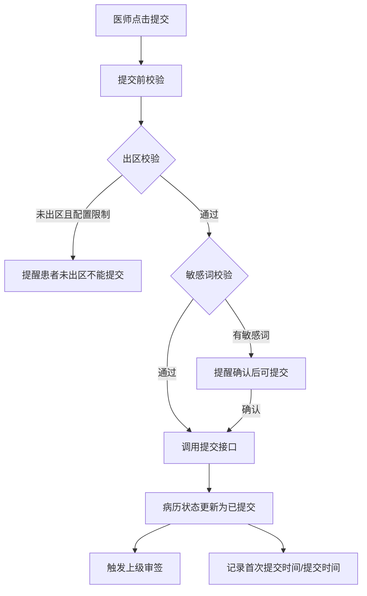
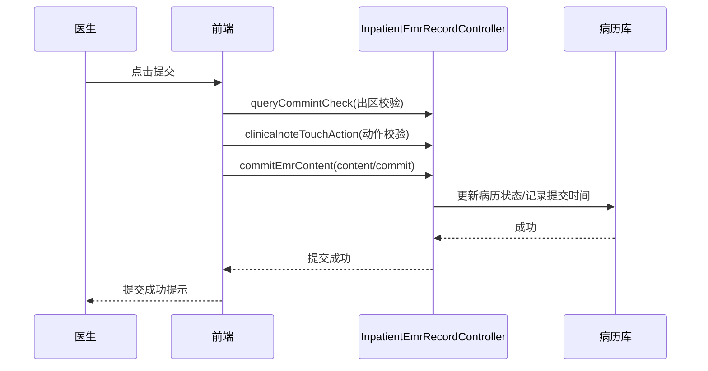

# BLGL-01-BLSX-004_病历提交与撤销提交_Analyst-Spec

> **需求编号**：BLGL-01-BLSX-004
> **父需求**：BLGL-01-BLSX
> **关联PM Spec**：BLGL-01-BLSX-004_病历提交与撤销提交_PM-spec.md
> **Spec版本**：V1.0
> **编写时间**：2026-08-15
> **编写人**：需求分析师

---

## 一、功能编号体系

### 1.1 功能层级结构

```
BLGL-01-BLSX-004-001: 病历提交
  ├─ BLGL-01-BLSX-004-001-01: 提交病历（提交后由上级审核）
  ├─ BLGL-01-BLSX-004-001-02: 不能重复提交
  └─ BLGL-01-BLSX-004-001-03: 批量提交

BLGL-01-BLSX-004-002: 撤销提交
  ├─ BLGL-01-BLSX-004-002-01: 撤销提交（上级未审核时可撤销）
  ├─ BLGL-01-BLSX-004-002-02: 审核后不可撤销
  ├─ BLGL-01-BLSX-004-002-03: 批量撤销提交
  └─ BLGL-01-BLSX-004-002-04: 撤销提交清除签名（COMMON315）

BLGL-01-BLSX-004-003: 提交校验
  ├─ BLGL-01-BLSX-004-003-01: 出区前提交限制
  ├─ BLGL-01-BLSX-004-003-02: 敏感词汇校验
  ├─ BLGL-01-BLSX-004-003-03: 提交必填校验
  └─ BLGL-01-BLSX-004-003-04: 手术时间校验

BLGL-01-BLSX-004-004: 提交时间记录
  ├─ BLGL-01-BLSX-004-004-01: 首次提交时间
  ├─ BLGL-01-BLSX-004-004-02: 提交时间
  └─ BLGL-01-BLSX-004-004-03: 创建时间
```

### 1.2 功能编号表

| REQ-ID | 功能名称 | 类型 | 优先级 | 说明 |
|--------|---------|------|--------|------|
| BLGL-01-BLSX-004-001 | 病历提交 | 功能 | P0 | 提交后由上级审核，不能重复提交，支持批量提交 |
| BLGL-01-BLSX-004-001-01 | 提交病历 | 子功能 | P0 | 提交后状态更新，触发审签 |
| BLGL-01-BLSX-004-001-02 | 不能重复提交 | 子功能 | P0 | 已提交病历不能再次提交 |
| BLGL-01-BLSX-004-001-03 | 批量提交 | 子功能 | P0 | 多份病历批量提交 |
| BLGL-01-BLSX-004-002 | 撤销提交 | 功能 | P0 | 上级未审核时可撤销，审核后不可撤销 |
| BLGL-01-BLSX-004-002-01 | 撤销提交 | 子功能 | P0 | 上级未审核时撤销提交 |
| BLGL-01-BLSX-004-002-02 | 审核后不可撤销 | 子功能 | P0 | 上级已审核不允许撤销提交 |
| BLGL-01-BLSX-004-002-03 | 批量撤销提交 | 子功能 | P1 | 批量撤销提交 |
| BLGL-01-BLSX-004-002-04 | 撤销提交清除签名 | 子功能 | P1 | 按COMMON315清除签名 |
| BLGL-01-BLSX-004-003 | 提交校验 | 功能 | P0 | 出区/敏感词/必填/手术时间校验 |
| BLGL-01-BLSX-004-003-01 | 出区前提交限制 | 子功能 | P0 | 未出区不能提交配置的病历 |
| BLGL-01-BLSX-004-003-02 | 敏感词汇校验 | 子功能 | P1 | 敏感词提醒后可提交 |
| BLGL-01-BLSX-004-003-03 | 提交必填校验 | 子功能 | P0 | 必填项未填阻断提交 |
| BLGL-01-BLSX-004-003-04 | 手术时间校验 | 子功能 | P1 | 手术记录提交校验手术时间 |
| BLGL-01-BLSX-004-004 | 提交时间记录 | 功能 | P1 | 首次提交/提交/创建时间记录 |
| BLGL-01-BLSX-004-004-01 | 首次提交时间 | 子功能 | P1 | 记录第一次提交时间，不再更新 |
| BLGL-01-BLSX-004-004-02 | 提交时间 | 子功能 | P1 | 记录最新提交时间 |
| BLGL-01-BLSX-004-004-03 | 创建时间 | 子功能 | P1 | 记录文书创建时间 |

---

## 二、核心业务流程

### 2.1 病历提交主流程



### 2.2 病历提交时序



---

## 三、功能规格说明


### BLGL-01-BLSX-004-001: 病历提交

#### 3.1.1 功能概述

医师对完成的病历提交后由上级医师进行审核，不能重复提交动作，支持批量提交。

#### 3.1.2 用户角色

| 角色 | 使用场景 | 权限要求 | 操作频率 |
|------|---------|---------|---------|
| 住院医师 | 病历提交/批量提交 | 提交权限 | 高频 |

#### 3.1.3 业务流程（Given/When/Then）

##### 主流程

**Scenario 1: 提交病历**

```gherkin
Given:
- 医师已完成病历书写并签署
- 病历未提交

When:
- 医师点击"提交"
- 提交校验通过

Then:
- 病历状态更新为已提交
- 触发上级医师审签
- 不能重复提交动作
```

##### 异常流程

**Scenario 2: 业务异常——重复提交**

```gherkin
Given:
- 病历已提交

When:
- 医师再次点击提交

Then:
- 系统不允许重复提交动作
```

**Scenario 3: 数据异常——必填校验失败**

```gherkin
Given:
- 病历存在必填项未填

When:
- 医师点击提交

Then:
- 提示【数据不完善，请完善信息后提交】，定位到未填项
```

**Scenario 4: 系统异常——提交接口异常**

```gherkin
Given:
- 提交接口（content/commit）异常

When:
- 医师点击提交

Then:
- 提示提交失败，可重试
```

##### 边界流程

**Scenario 5: 边界——批量提交**

```gherkin
Given:
- 多份病历待提交

When:
- 医师批量提交

Then:
- 全部病历依次提交，批量提示
- 单份失败单独提示
```

**Scenario 6: 边界——提交后修改提醒**

```gherkin
Given:
- 病历已提交

When:
- 医生修改病历信息

Then:
- 系统提醒"已修改病历信息"
```

#### 3.1.4 验收标准

| AC编号 | 验收标准 | 对应REQ-ID | 验证方法 | 验证场景 |
|--------|---------|-----------|---------|---------|
| AC-001 | 提交后状态更新为已提交，不能重复提交 | BLGL-01-BLSX-004-001 | 功能测试 | Scenario 1/2 |
| AC-002 | 必填项未填提交时提示完善信息 | BLGL-01-BLSX-004-001 | 功能测试 | Scenario 3 |
| AC-003 | 批量提交全部或部分成功 | BLGL-01-BLSX-004-001 | 功能测试 | Scenario 5 |


### BLGL-01-BLSX-004-002: 撤销提交

#### 3.2.1 功能概述

病历提交后上级医师未审核时允许撤销提交；审核后不允许撤销；支持批量撤销提交，撤销后按参数清除签名。

#### 3.2.2 用户角色

| 角色 | 使用场景 | 权限要求 | 操作频率 |
|------|---------|---------|---------|
| 住院医师 | 撤销提交/批量撤销 | 撤销提交权限 | 中频 |

#### 3.2.3 业务流程（Given/When/Then）

##### 主流程

**Scenario 1: 撤销提交**

```gherkin
Given:
- 病历已提交
- 上级医师未审核

When:
- 医师点击"撤销提交"

Then:
- 病历状态回退到未提交
- 按参数清除病历签名（COMMON315）
```

##### 异常流程

**Scenario 2: 业务异常——审核后不可撤销**

```gherkin
Given:
- 病历已提交且上级医师已审核

When:
- 医师点击撤销提交

Then:
- 系统不允许撤销提交动作
```

**Scenario 3: 业务异常——未提交不可撤销**

```gherkin
Given:
- 病历未提交

When:
- 医师点击撤销提交

Then:
- 系统不允许撤销提交动作
```

**Scenario 4: 数据异常——撤销原因必填**

```gherkin
Given:
- 参数"撤销已经提交过的病历，是否填写撤销原因"为是

When:
- 医师撤销提交

Then:
- 必须填写撤销原因
```

##### 边界流程

**Scenario 5: 边界——批量撤销提交**

```gherkin
Given:
- 多份已提交未审核的病历

When:
- 医师批量撤销提交

Then:
- 全部撤销，状态回退未提交
```

**Scenario 6: 边界——撤销权限共享**

```gherkin
Given:
- 参数"是否允许提交人的科室/诊疗组同级医生共享撤销提交权限"已配置

When:
- 同级医生撤销提交

Then:
- 按配置允许同级/上级共享撤销提交权限
```

#### 3.2.4 验收标准

| AC编号 | 验收标准 | 对应REQ-ID | 验证方法 | 验证场景 |
|--------|---------|-----------|---------|---------|
| AC-001 | 上级未审核时撤销提交，状态回退未提交 | BLGL-01-BLSX-004-002 | 功能测试 | Scenario 1 |
| AC-002 | 上级已审核不允许撤销提交 | BLGL-01-BLSX-004-002 | 功能测试 | Scenario 2 |
| AC-003 | 撤销提交按参数清除病历签名 | BLGL-01-BLSX-004-002 | 功能测试 | Scenario 1 |


### BLGL-01-BLSX-004-003: 提交校验

#### 3.3.1 功能概述

提交前校验：出区前提交限制、敏感词汇校验、必填校验、手术时间校验。

#### 3.3.2 用户角色

| 角色 | 使用场景 | 权限要求 | 操作频率 |
|------|---------|---------|---------|
| 住院医师 | 提交前校验 | 提交权限 | 高频 |

#### 3.3.3 业务流程（Given/When/Then）

##### 主流程

**Scenario 1: 提交校验通过**

```gherkin
Given:
- 病历必填项完整
- 无敏感词或已确认
- 出区校验通过

When:
- 医师点击提交

Then:
- 校验通过，正常提交
```

##### 异常流程

**Scenario 2: 业务异常——出区限制**

```gherkin
Given:
- 参数开启出区前限制
- 病历配置为出区前不能提交

When:
- 医师点击提交

Then:
- 弹出"患者未出区时不能提交｛监控类型｝"，阻断提交
```

**Scenario 3: 数据异常——敏感词提醒**

```gherkin
Given:
- 病历存在敏感词

When:
- 医师点击提交

Then:
- 弹出敏感词提醒，确认后可提交
```

**Scenario 4: 系统异常——校验接口异常**

```gherkin
Given:
- 校验接口（touch_action/check）异常

When:
- 医师点击提交

Then:
- 阻断提交并提示校验失败，可重试
```

##### 边界流程

**Scenario 5: 边界——手术时间校验**

```gherkin
Given:
- 手术记录需关联手术时间
- 参数"手术记录是否必须关联手术时间"为是

When:
- 医师提交手术记录

Then:
- 手术时间未关联时阻断提交
```

**Scenario 6: 边界——敏感词确认后可提交**

```gherkin
Given:
- 敏感词提醒已弹出

When:
- 医师确认提醒后提交

Then:
- 允许提交病历
```

#### 3.3.4 验收标准

| AC编号 | 验收标准 | 对应REQ-ID | 验证方法 | 验证场景 |
|--------|---------|-----------|---------|---------|
| AC-001 | 参数开启时未出区提交配置病历被阻断提醒 | BLGL-01-BLSX-004-003 | 功能测试 | Scenario 2 |
| AC-002 | 敏感词提醒确认后可提交 | BLGL-01-BLSX-004-003 | 功能测试 | Scenario 3/6 |


### BLGL-01-BLSX-004-004: 提交时间记录

#### 3.4.1 功能概述

病历簿新增首次提交时间/提交时间/创建时间字段，用于质控时限计算。

#### 3.4.2 用户角色

| 角色 | 使用场景 | 权限要求 | 操作频率 |
|------|---------|---------|---------|
| 系统 | 自动记录时间 | - | 自动 |

#### 3.4.3 业务流程（Given/When/Then）

##### 主流程

**Scenario 1: 记录提交时间**

```gherkin
Given:
- 病历首次提交

When:
- 提交成功

Then:
- 记录首次提交时间（精确到秒，不再更新）
- 记录提交时间（最新一次提交时间）
- 记录创建时间（文书创建时间）
```

##### 异常流程

**Scenario 2: 业务异常——审签驳回不更新**

```gherkin
Given:
- 病历被审签驳回或撤销提交

When:
- 状态变化

Then:
- 提交时间字段无需更新
```

**Scenario 3: 数据异常——文书删除**

```gherkin
Given:
- 文书删除

When:
- 删除文书

Then:
- 同步删除当前文书关联的字段内容数据
```

##### 边界流程

**Scenario 4: 边界——多次提交**

```gherkin
Given:
- 病历多次提交

When:
- 每次提交成功

Then:
- 首次提交时间保持不变
- 提交时间更新为最新一次
```

**Scenario 5: 边界——时间精度**

```gherkin
Given:
- 提交动作发生

When:
- 记录时间

Then:
- 精确到秒
```

#### 3.4.4 验收标准

| AC编号 | 验收标准 | 对应REQ-ID | 验证方法 | 验证场景 |
|--------|---------|-----------|---------|---------|
| AC-001 | 病历提交后记录首次提交/提交/创建时间（精确到秒） | BLGL-01-BLSX-004-004 | 功能测试 | Scenario 1 |
| AC-002 | 审签驳回/撤销提交时提交时间不更新 | BLGL-01-BLSX-004-004 | 功能测试 | Scenario 2 |
| AC-003 | 文书删除时同步删除关联字段数据 | BLGL-01-BLSX-004-004 | 功能测试 | Scenario 3 |


---

## 四、排除范围

本需求不包含以下功能项：

1. **病历编辑与保存 —— BLGL-01-BLSX-002**
2. **病历签署—— BLGL-01-BLSX-003**
3. **病历审签阅改 —— BLGL-01-BLSX-005**
4. **手术记录 —— BLGL-01-BLSX-006**
5. **书写任务与时限提醒 —— BLGL-01-BLSX-007**
6. **出区前提交限制参数（COMMON130/131）—— Phase 1 第6章 BC-BLSX-004**

---

## 五、业务规则清单

| 规则ID | 规则名称 | 规则描述 | 来源 | 优先级 |
|--------|---------|---------|------|--------|
| BR-001 | 提交动作 | 医师对完成的病历提交后由上级医师进行审核，不能重复提交动作 | 功能清单 | P0 |
| BR-002 | 撤销提交限制 | 病历文书未提交时不能撤销提交；提交后上级医师未审核时允许撤销；审核后不允许撤销 | 功能清单 | P0 |
| BR-003 | 出区前限制 | 设置了出区前不能提交的病历，未出区时弹出提醒"患者未出区时不能提交｛监控类型｝"，阻断提交流程 | 需求 | P0 |
| BR-004 | 敏感词可提交 | 敏感词汇提醒后，允许提交病历 | 需求 | P1 |
| BR-005 | 首次提交时间 | 病历薄首次提交时间记录第一次提交时间，精确到秒，数据产生后不再更新；文书删除时同步删除 | 需求 | P1 |
| BR-006 | 提交模式 | 自动模式签名即提交状态，删除签名即撤销动作；手动模式签名后点击提交按钮 | 功能清单 | P0 |
| BR-007 | 撤销清签名 | 撤销提交时按参数清除病历签名（submit清空撤销提交人/all清空全部） | 功能清单 | P1 |
| BR-008 | 提交时间不更新 | 审签驳回、撤销提交时提交时间字段无需更新 | 需求 | P1 |

---

## 六、关联文档

| 文档类型 | 文档路径 | 说明 |
|---------|---------|------|
| 功能点Spec | BLGL-01-BLSX 01病历书写功能点Spec.md（V1.0，上级目录） | Phase 1 功能点索引 |
| PM spec | 本目录 BLGL-01-BLSX-004_病历提交与撤销提交_PM-spec.md（V0.1） | PM 产出的 Spec 文档 |
| -Spec | 本目录 BLGL-01-BLSX-004_病历提交与撤销提交-Spec.md（V1.0） | 业务背景与目标 Spec |
| data-model.md | 待产出 | 架构师产出的数据建模文档 |
| design.md | 待产出 | 架构师产出的技术方案文档 |
| api-contract.md | 待产出 | 开发经理产出的 API 契约文档 |

---

## 七、待确认问题清单

| 编号 | 问题描述 | 缺失信息 | 影响范围 | 建议补充方 |
|------|---------|---------|---------|-----------|
| Q-001 | 提交/撤销提交接口完整入参/出参字段结构 | API 契约文档 | -Spec 第5章、Analyst-Spec 数据字段 | 开发经理 |
| Q-002 | 提交相关参数编码（COMMON083/130/131/315等） | 参数配置说明表 | 数据字段（概念ID） | 产品经理 |
| Q-003 | 性能指标（提交响应） | 非功能性需求 | -Spec 第8章 | 需求分析师 |
| Q-004 | 出区判断的数据来源（病区/出院接口） | 接口文档 | 出区校验场景 | 接口负责人 |
| Q-005 | 批量提交/撤销提交的失败处理细节 | 设计文档 | 批量场景 | 架构师 |

---

## 填写检查清单

| 序号 | 检查项 | 是否完成 |
|:----:|--------|:--------:|
| 1 | 功能编号带父子层级 | ✅ |
| 2 | 每个 REQ-ID 有功能概述和用户角色 | ✅ |
| 3 | 主流程至少 1 个 Given/When/Then 场景 | ✅ |
| 4 | 异常流程至少 3 个 Given/When/Then 场景 | ✅ |
| 5 | 边界流程至少 2 个 Given/When/Then 场景 | ✅ |
| 6 | 每个 Given/When/Then 内容具体，不模糊 | ✅ |
| 7 | 数据字段定义完整（字段名、类型、必填、说明、概念ID） | N/A |
| 8 | 验收标准 AC 编号独立，可验证 | ✅ |
| 9 | 验收标准无"功能正常"等模糊表述 | ✅ |
| 10 | 排除范围明确列出 | ✅ |
| 11 | 业务规则清单列出所有规则，每条标注来源 | ✅ |
| 12 | 流程图使用 Mermaid 格式（≥2 个） | ✅ |
| 13 | 关联文档索引包含 Phase 1 功能点Spec | ✅ |
| 14 | 待确认问题清单汇总了全文所有 ⏳ 项 | ✅ |
| 15 | 全文无占位符 `< >` 残留 | ✅ |
| 16 | 全文陈述可溯源至资料区（S1~S10 溯源核查） | ✅ |
| 17 | 人工审核确认完成 | ⏳ 待确认 |

---

**文档状态**：⬜ 待审核
**维护责任**：需求分析师规范组
**下次更新**：根据评审反馈优化

---

## 版本历史

| 版本 | 日期 | 变更说明 | 编写人 |
|------|------|---------|--------|
| V1.0 | 2026-08-15 | 初始版本 | 需求分析师 |