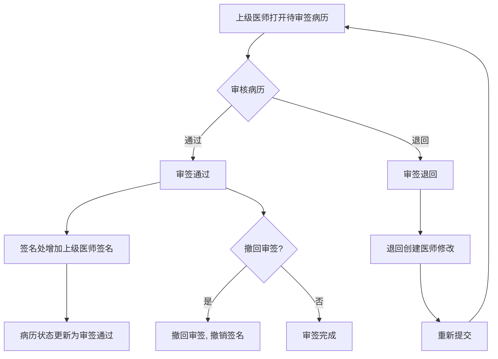
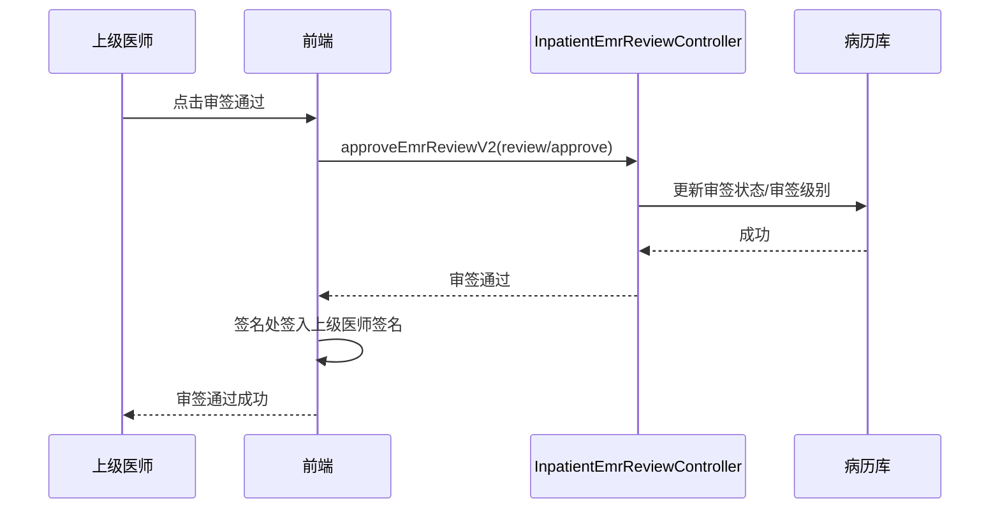

# BLGL-01-BLSX-005 病历审签阅改 - Spec

> **功能编号**：BLGL-01-BLSX-005
> **文档类型**：功能Spec（业务背景与设计）
> **文档版本**：V1.0
> **编写时间**：2026-08-15
> **编写人**：RACC

---

## 文档索引

#### 章节索引

**Spec（研发视角）**

| 章节号 | 章节名称 | 内容说明 |
|--------|---------|---------|
| 1、 | 文档概述 | 文档目的、文档范围、术语定义、阅读指南、参考文档 |
| 2、 | 功能背景与定位 | 功能背景、功能定位、目标用户、核心价值 |
| 3、 | 业务流程设计 | 主流程/异常流程/边界流程（Given/When/Then） |
| 4、 | 数据模型设计 | 核心数据结构、状态定义、系统参数定义 |
| 5、 | 接口契约设计 | API列表、接口详细设计、错误码定义 |
| 6、 | 技术方案设计 | 页面路径、技术栈、关键技术点、部署方案 |
| 7、 | 测试用例预设计 | 功能/边界/异常/性能测试用例 |
| 8、 | 非功能性要求 | 性能、安全、可用性、兼容性 |
| 9、 | 依赖与风险 | 外部依赖、风险项 |
| 10、 | 附录 | 流程图、时序图、参考文档 |

**PM-Spec（业务视角）**

| 章节号 | 章节名称 | 内容说明 |
|--------|---------|---------|
| 一 | 目标 | 功能定位与核心价值 |
| 二 | 约束 | 业务/技术/非功能性约束 |
| 三 | 验收标准 | 验收条件与验证方法 |
| 四 | 排除范围 | 本次不做项与明确边界 |
| 五 | 关键决策记录 | 方案决策与选型理由 |
| 六 | 优先级 | 优先级定义 |
| 七 | 关联文档 | 关联文档索引 |
| 附录 | 填写检查清单 | 质量检查 |

**Analyst-Spec（产品视角）**

| 章节号 | 章节名称 | 内容说明 |
|--------|---------|---------|
| 一 | 功能编号体系 | 功能编号与层级结构 |
| 二 | 核心业务流程 | 核心业务流程与时序 |
| 三 | 功能规格说明 | 详细功能规格与验收标准 |
| 四 | 排除范围 | 排除范围 |
| 五 | 业务规则清单 | 业务规则清单 |
| 六 | 关联文档 | 关联文档索引 |
| 七 | 待确认问题清单 | 待确认问题汇总 |
| - | 填写检查清单 | 质量检查 |

#### 版本历史

| 版本 | 日期 | 变更说明 | 编写人 |
|------|------|---------|--------|
| V1.0 | 2026-08-15 | 初始版本 | RACC |

#### 关联文档索引

| 序号 | 文档名称 | 文档类型 | 版本 | 位置 |
|------|---------|---------|------|------|
| 1 | BLGL-01-BLSX-005_病历审签阅改_PM-spec.md | PM-Spec（业务视角） | V0.1 | 本目录 |
| 2 | BLGL-01-BLSX-005_病历审签阅改_Analyst-spec.md | Analyst-Spec（产品视角） | V1.0 | 本目录 |
| 3 | BLGL-01-BLSX-005_病历审签阅改-Spec.md | Spec（研发视角）（本文档） | V1.0 | 本目录 |
| 4 | BLGL-01-BLSX 01病历书写功能点Spec.md | 功能点Spec（模块级） | V1.0 | 上级目录 |

---

## 1、文档概述

### 1.1、文档目的

本文档旨在明确"病历审签阅改"功能（BLGL-01-BLSX-005）的业务背景与设计方案，为需求分析、研发实现、测试验收及评审提供统一的业务上下文、设计口径与决策依据。

### 1.2、文档范围

#### 1.2.1 纳入范围

本文档覆盖病历审签阅改的完整业务背景与设计，包括：

- 审签通过：上级医师审核通过并在医师签名处增加审核的上级医师签名
- 审签退回：上级医师审核该病历文书有缺陷退回由创建医师修改后重新提交
- 审签撤回：审签后撤回审签
- 审签保存：审签过程中的保存
- 批量审签：批量审签通过/退回
- 审签流程配置：审签流程设置（多级审签流程、主治审签流程、指定人审签、主次审签）
- 同级阅改/加签：同级阅改、授权加签
- 转科审签：患者转科后原科室医生审签

#### 1.2.2 排除范围

本文档不涉及以下内容（详见其他功能点或模块）：

- 病历编辑与保存 —— BLGL-01-BLSX-002
- 病历签署—— BLGL-01-BLSX-003
- 病历提交与撤销提交 —— BLGL-01-BLSX-004
- 手术记录 —— BLGL-01-BLSX-006
- 书写任务与时限提醒 —— BLGL-01-BLSX-007

### 1.3、术语定义

| 术语 | 定义 |
|------|------|
| 审签通过 | 上级医师审核通过并在医师签名处增加审核的上级医师签名（来源：功能清单） |
| 审签退回 | 上级医师审核该病历文书有缺陷退回由创建医师进行修改文书内容重新提交（来源：功能清单） |
| 审签撤回 | 审签通过后撤回审签动作 |
| 阅改 | 上级医师对已提交病历的审签修改 |
| 加签 | 上级医师在当前签名元素上加签 |

### 1.4、阅读指南

- **章节关系**：第1~2章为业务全貌，第3~10章为设计实现层。与 Analyst-Spec、PM-Spec 互相引用保持一致。
- **读者对象**：产品经理/需求分析师读第1~2章；研发读第3~6、9~10章；测试读第3、7~8章；评审人员核对各层一致性。

### 1.5、参考文档

| 序号 | 文档名称 | 版本/日期 |
|------|---------|----------|
| 1 | 【历史需求】住院病历的历史需求.xlsx | - |
| 2 | BLGL-01-BLSX-005_病历审签阅改_PM-spec.md | V0.1 |
| 3 | BLGL-01-BLSX-005_病历审签阅改_Analyst-spec.md | V1.0 |
| 4 | BLGL-01-BLSX 01病历书写功能点Spec.md | V1.0 |
| 5 | 病历书写_功能清单_20260327_151500.md | 2026-03-27 |

---

## 2、功能背景与定位

### 2.1 功能背景

病历审签阅改是病历书写流程的审核环节，需满足：

- **现状痛点**：患者转科后原科室医生无法审签、指定人审签/主次审签等场景权限不完整
- **管理要求**：三级查房制度下，上级医师对下级医师病历进行阅改审签
- **历史需求演进**：从基础审签通过/退回 → 审签配置（二级审签流程下新增主治审签流程）→ 批量审签 → 转科审签 → 被授权科室审签权限 → 同级阅改/加签 → 查房双签名

### 2.2 功能定位

"病历审签阅改"是 WiNEX 病历管理-病历书写的审核环节功能点，定位为：

- **审核闭环**：审签通过/退回/撤回完整闭环（来源：功能清单、代码）
- **流程配置**：多级审签流程/指定人审签/主次审签配置
- **权限精细**：转科审签/被授权科室/同级阅改权限控制

### 2.3 目标用户

| 用户角色 | 主要使用场景 |
|---------|-------------|
| 上级医师（主治/主任） | 审签通过/退回/撤回、阅改 |
| 住院医师 | 审签退回后修改重新提交 |
| 规培生/实习生 | 代写病历由带教老师审签 |
| 被授权科室医生 | 被授权科室病历审签 |

### 2.4 核心价值

| 价值维度 | 价值描述 |
|---------|---------|
| 三级查房 | 上级医师阅改审签落实三级查房制度 |
| 流程规范 | 审签通过/退回/撤回规则明确（来源：功能清单、代码） |
| 权限完备 | 转科/被授权/同级阅改权限控制 |

---

## 3、业务流程设计（Given/When/Then）

### 3.1 主流程

**Scenario 1: 审签通过**

```gherkin
Given:
- 上级医师打开待审签病历
- 病历已提交且处于待审核状态

When:
- 上级医师点击"审签通过"
- 系统在医师签名处增加审核的上级医师签名

Then:
- 病历状态更新为审签通过
- 上级医师签名签入病历
```

**Scenario 2: 审签退回**

```gherkin
Given:
- 上级医师审核病历文书发现缺陷

When:
- 上级医师点击"审签退回"

Then:
- 病历退回给创建医师
- 创建医师修改文书内容后重新提交
```

### 3.2 异常流程

**Scenario 3: 业务异常——转科后原科室审签**

```gherkin
Given:
- 需要上级审签的病历在未审签时患者转科
- 患者从A科室转科到B科室

When:
- A科室医生审签转科前创建的病历

Then:
- 根据病历记录时间匹配创建病历的科室/3级医师/审签方式
- A科室医生可正常审签转科前创建的病历
```

**Scenario 4: 数据异常——批量审签未打开病历**

```gherkin
Given:
- 批量审签弹窗打开
- 存在待审签病历

When:
- 医生尝试勾选未在窗口打开的病历

Then:
- 置灰无法选择，提醒需要在当前页面打开
```

**Scenario 5: 系统异常——审签接口异常**

```gherkin
Given:
- 审签接口（review/approve）异常

When:
- 上级医师点击审签通过

Then:
- 审签失败提示，已签名需撤销
```

### 3.3 边界流程

**Scenario 6: 边界——审签撤回**

```gherkin
Given:
- 上级医师已审签通过
- 存在撤回审签权限

When:
- 上级医师点击"撤回审签"

Then:
- 审签状态撤回，上级医师签名撤销
```

**Scenario 7: 边界——查房双签名**

```gherkin
Given:
- 指定医师查房类型病历指定查房医生是提交者自己
- 参数"当指定医师查房记录指定查房医生是提交者，是否启用双签名"已配置

When:
- 提交病历自动审签

Then:
- 参数为是：显示两个签名（上级+医师）
- 参数为否：只显示一个签名
```

---

## 4、数据模型设计

### 4.1 核心数据结构

#### 4.1.1 核心保存请求（审签通过）

| 字段名 | 类型 | 必填 | 备注 |
|--------|------|------|------|
| inpatEmrSetId | Long | 是 | 病历ID |
| emrSaveInfo | Object | 是 | 审签内容数据 |

#### 4.1.2 核心表/实体

| 表/实体 | 关键字段 | 说明 |
|---------|---------|------|
| INPATIENT_EMR_RECORD（InpatientEmrRecordPO） | REVIEWED_BY/REVIEWED_AT（审核人/时间）、INP_EMR_STATUS | 病历记录表，记录审核信息 |
| INPATIENT_EMR_SET（InpatientEmrSetPO） | INP_EMR_REVIEW_LEVEL_CODE（审签级别）、CURRENT_REVIEW_LEVEL/REVIEW_LEVEL（当前/应审签级别）、REVIEW_REJECT_FLAG（审签退回标志）、ASSIGNING_FLAG | 病历主表，审签级别/退回标志 |
| EMR_REVIEW_FLOW_SETTING（EmrReviewFlowSettingPO） | 审签流程设置字段 | 审签流程配置 |
| EMR_REVIEW_FLOW_RULE_SETTING（EmrReviewFlowRuleSettingPO） | 审签流程规则设置字段 | 审签流程规则 |
| ERM_REVIEW_ASSIGNING（EmrReviewAssigningPO） | 审签指派字段 | 审签指派 |
| INP_EMR_REVIEW_STATUS（审签状态枚举） | 待审阅/审阅中/审阅完成/未提交 | 审签状态 |

### 4.2 状态定义

| 状态码 | 状态名称 | 说明 |
|--------|---------|------|
| 399017130 | 待审核/已提交 | 提交后待审签 |
| 399303594 | 未审核 | 待审阅 |
| 399303595 | 审核中 | 审阅中 |
| 399303596 | 已审核 | 审阅完成 |
| 399297357 | 审签通过 | 审签通过 |
| 399297358 | 审签退回 | 审签退回 |
| 399297359 | 撤回审签 | 撤回审签 |
| 390032001 | 一级阅改 | 一级阅改 |
| 390032002 | 二级阅改 | 二级阅改 |

### 4.3 系统参数定义

| 参数编码 | 参数名称 | 说明 |
|---------|---------|------|
| COMMON044 | 是否允许阅改签名同级别及下级医师提交的未配置在审签流程中的病历 | True（来源：功能清单公共参数） |
| COMMON154 | 是否支持任意上级医生编辑提交下级医生的病历文书，改变病历所属权 | True（来源：功能清单） |
| COMMON277 | 同级医生可以对已提交状态的病历进行阅改签名 | True（来源：功能清单） |
| 待确认 | 是否启用病历加签授权功能（COMMON167） | 启用后能授权本科室同级和下级医生对某份病历进行签名（来源：功能清单） |
| 待确认 | 当指定医师查房记录指定查房医生是提交者，是否启用双签名 | 是：双签名；否：单签名 |
| 待确认 | 住院病历审签配置-二级审签流程下新增主治审签流程 | 审签流程配置 |

---

## 5、接口契约设计

### 5.1 API列表

| 序号 | API名称（代码函数） | 路径 | 方法 | 说明 |
|:----:|---------|------|:----:|------|
| 1 | approveEmrReviewV2 | /api/v2/app_record_inpatient/emr_inpatient/review/approve/by_example | POST | 审签通过 |
| 2 | rejectEmrReviewV2 | /api/v2/app_record_inpatient/emr_inpatient/review/reject/by_example | POST | 审签驳回 |
| 3 | withdrawEmrReviewV2 | /api/v2/app_record_inpatient/emr_inpatient/review/withdraw/by_example | POST | 审签撤回 |
| 4 | saveSignEmr | /api/v1/app_record_inpatient/emr_inpatient/audit/save_audit_emr | POST | 病历审签保存 |
| 5 | queryPendingReviewRHBList | /api/v1/app_record_inpatient/emr_inpatient/pending_review_rhb/query/by_example | POST | 查询病历待审核列表 |
| 6 | queryMyInpEmrReviewedList | /api/v1/app_record_inpatient/emr_inpatient/review/my_inp_emr_reviewed/query | POST | 查询我的审核记录列表 |
| 7 | queryInpEmrReviewProcessList | /api/v1/app_record_inpatient/emr_inpatient/inp_emr_review_process_detail/query | POST | 查询审核流程详细信息 |
| 8 | saveEmrReviewFlowSettingInfo | /api/v1/app_record_inpatient/inpatient_emr/review/saveEmrReviewFlowSettingInfo | POST | 保存阅改指派流程设置信息 |
| 9 | saveInpatientEmrReviewAssignInfo | /api/v1/app_record_inpatient/inpatient_emr/review/saveInpatientEmrReviewAssignInfo | POST | 保存阅改指派信息 |
| 10 | addEmrCounterSign | /api/v1/app_record_inpatient/emr_inpatient/auth_sigin/add_auth_sign | POST | 授权加签（来源：前端） |

### 5.2 接口详细设计

#### 5.2.1 审签通过（approveEmrReviewV2）

**请求参数**:
```json
{
  "inpatEmrSetId": "病历ID",
  "emrSaveInfo": "审签内容数据"
}
```

**返回值（成功）**:
```json
{
  "success": true,
  "data": {
    "modifyTime": "内容修改时间"
  }
}
```

**返回值（失败）**:
```json
{
  "success": false,
  "message": "<错误信息>",
  "data": null
}
```

> 📌 请求/返回字段结构以 API 契约文档为准。

### 5.3 错误码定义

| 错误码 | 错误信息 | 处理方式 |
|--------|---------|---------|
| 待确认 | 审签失败 | 审签失败撤销签名 |
| 待确认 | 无审签权限 | 转科/被授权科室权限不足提示 |
| 待确认 | 未在窗口打开的病历无法选择 | 批量审签置灰 |

---

## 6、技术方案设计

### 6.1 页面路径

- **页面路径**: 住院医生站→住院病历书写界面→病历编辑器→审签通过/退回按钮（EmrEditor/components/BaseEditor）
- **组件**：BaseEditor/index.vue（handleReviewPassAction/handleReviewDismissAction）、InpatientClinicalnoteReviewPage（审签页面）、BatchSubmitContainer.vue（批量审签）、EmrMenuActions（加签/CA查询）
- **核心逻辑模块**: InpatientEmrReviewController（approveEmrReviewV2/rejectEmrReviewV2/withdrawEmrReviewV2）

### 6.2 技术栈

| 类别 | 技术 | 版本 |
|------|------|------|
| 前端框架 | Vue | 2.6.14 |
| 前端UI | element-ui | 2.13.0 |
| 后端框架 | Spring Boot（Java） | 17 |

### 6.3 关键技术点

- 审签通过/退回/撤回走 review/approve|reject|withdraw
- 审签流程配置：审签流程设置/规则设置/指派
- 转科审签：根据病历记录时间匹配科室/3级医师/审签方式更新审签数据
- 批量审签：审签通过的病历更新签名

### 6.4 部署方案

⏳ 待确认：部署方案未在资料区中找到。

---

## 7、测试用例预设计

### 7.1 功能测试

| 用例编号 | 测试场景 | Given | When | Then |
|---------|---------|-------|------|------|
| TC-001 | 审签通过 | 病历已提交待审核 | 上级医师审签通过 | 状态更新为审签通过，上级签名签入 |
| TC-002 | 审签退回 | 上级医师发现缺陷 | 审签退回 | 病历退回创建医师，修改后重新提交 |
| TC-003 | 审签撤回 | 已审签通过 | 撤回审签 | 审签状态撤回，签名撤销 |

### 7.2 边界测试

| 用例编号 | 测试场景 | Given | When | Then |
|---------|---------|-------|------|------|
| TC-004 | 批量审签 | 多份待审签病历 | 批量审签通过/退回 | 批量更新状态，通过的更新签名 |
| TC-005 | 查房双签名 | 查房医生是提交者 | 提交自动审签 | 参数为是双签名，为否单签名 |

### 7.3 异常测试

| 用例编号 | 测试场景 | Given | When | Then |
|---------|---------|-------|------|------|
| TC-006 | 转科后审签 | 转科前创建未审签病历 | A科室医生审签 | 按记录时间匹配科室正常审签 |
| TC-007 | 批量审签未打开病历 | 病历未打开 | 勾选该病历 | 置灰无法选择 |
| TC-008 | 审签接口异常 | 审签接口异常 | 审签通过 | 审签失败，撤销已签名 |

### 7.4 性能测试

| 用例编号 | 测试场景 | 指标 |
|---------|---------|------|
| TC-009 | 审签响应 | ⏳ 待确认：性能指标未在资料区中找到 |

---

## 8、非功能性要求

### 8.1 性能要求

| 指标 | 要求 |
|------|------|
| 审签响应时间 | ⏳ 待确认 |

### 8.2 安全要求

| 要求 | 说明 |
|------|------|
| 审签权限 | 三级查房制度下上级医师审签 |
| 被授权科室权限 | 被授权科室医生审签/阅改/加签权限 |
| 转科审签权限 | 按记录时间匹配科室判断审签权限 |

**医疗行业特殊要求**

| 要求 | 说明 |
|------|------|
| 三级查房制度 | 住院医师→主治/主任医师逐级阅改审签 |
| 审签签名法律效力 | 审签通过时上级医师签名签入（来源：功能清单） |

### 8.3 可用性要求

| 指标 | 要求值 |
|------|--------|
| 可用性 | ⏳ 待确认 |

### 8.4 兼容性要求

| 类型 | 要求 |
|------|------|
| 审签模式 | 指定人审签/主次审签/多级审签流程 |
| 同级阅改 | 同级医生阅改签名 |

---

## 9、依赖与风险

### 9.1 外部依赖

| 依赖项 | 说明 |
|--------|------|
| 病历质控 | 审签退回后质控整改 |
| 主数据 | 员工职级/职称/科室 |

### 9.2 风险项

| 风险项 | 等级 | 说明 | 应对方案 |
|--------|------|------|---------|
| 转科审签数据不一致 | 中 | 转科后审签数据需按记录时间重新匹配 | 更新审签数据逻辑 |
| 批量审签部分失败 | 中 | 批量审签可能部分失败 | 单份失败提示+统一样式 |
| 审签权限复杂 | 中 | 指定人/主次/被授权科室多模式 | 审签流程配置化 |

---

## 10、附录

### 10.1 流程图



### 10.2 时序图



### 10.3 参考文档

- 病历书写_功能清单_20260327_151500.md（病历文书操作-审签通过/审签退回、病历审签）
- 【历史需求】住院病历的历史需求.xlsx
- BLGL-01-BLSX 01病历书写功能点Spec.md（V1.0，第5章 BLGL-01-BLSX-005 行）
- 关联Spec：BLGL-01-BLSX-005_病历审签阅改_PM-spec.md、BLGL-01-BLSX-005_病历审签阅改_Analyst-spec.md

---

## 填写检查清单

| 序号 | 检查项 | 是否完成 |
|:----:|--------|:--------:|
| 1 | 章节索引与正文章节一致 | ✅ |
| 2 | 版本历史记录完整 | ✅ |
| 3 | 关联文档索引已登记全部Spec | ✅ |
| 4 | 文档目的明确回答"为什么做/做成什么/怎么做" | ✅ |
| 5 | 纳入范围/排除范围清晰 | ✅ |
| 6 | 术语定义覆盖关键概念，从资料区可溯源 | ✅ |
| 7 | 参考文档已登记 | ✅ |
| 8 | 功能背景基于法规/规范/需求来源组织 | ✅ |
| 9 | 功能定位体现业务价值（3~5个定位点） | ✅ |
| 10 | 目标用户角色覆盖完整，在需求原文中有出处 | ✅ |
| 11 | 核心价值可陈述，与 Phase 1 口径一致 | ✅ |
| 12 | 业务流程：主流程≥1、异常≥3、边界≥2，Given/When/Then 具体 | ✅ |
| 13 | 数据模型：字段/表/状态/参数可溯源 | ✅ |
| 14 | 接口契约：API列表+详细设计+错误码齐全或标记待确认 | ✅ |
| 15 | 技术方案：页面路径/技术栈/关键点/部署方案或标记待确认 | ✅ |
| 16 | 测试用例：功能/边界/异常/性能覆盖 | ✅ |
| 17 | 非功能性要求：性能/安全/可用性/兼容性指标可量化或标记待确认 | ✅ |
| 18 | 依赖与风险：外部依赖登记完整 | ✅ |
| 19 | 附录：流程图/时序图与正文流程一致 | ✅ |
| 20 | 全文无占位符 `< >` 残留 | ✅ |
| 21 | 全文陈述可溯源至资料区 | ✅ |
| 22 | 人工审核确认完成 | ⏳ 待确认 |

---

**文档状态**：⬜ 待审核
**维护责任**：RACC
**下次更新**：根据评审反馈优化