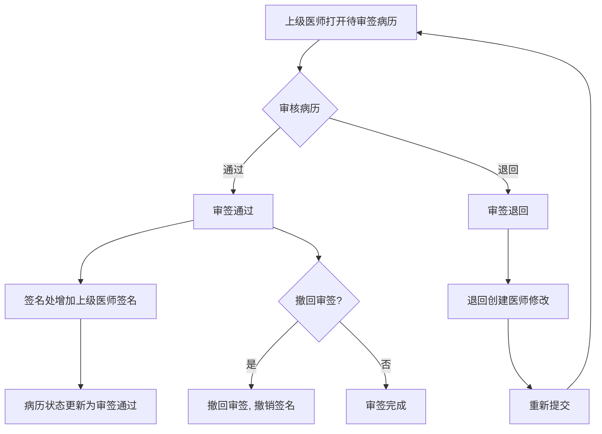
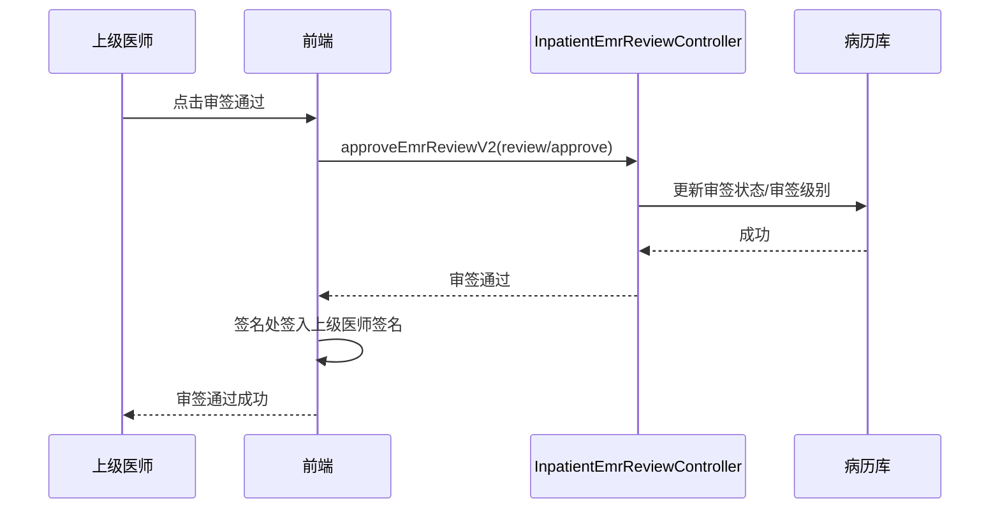

# BLGL-01-BLSX-005 病历审签阅改 - Analyst-Spec

> **需求编号**：BLGL-01-BLSX-005
> **父需求**：BLGL-01-BLSX
> **关联PM Spec**：BLGL-01-BLSX-005_病历审签阅改_PM-spec.md
> **Spec版本**：V1.0
> **编写时间**：2026-08-15
> **编写人**：需求分析师

---

## 一、功能编号体系

### 1.1 功能层级结构

```
BLGL-01-BLSX-005-001: 审签操作
  ├─ BLGL-01-BLSX-005-001-01: 审签通过
  ├─ BLGL-01-BLSX-005-001-02: 审签退回
  ├─ BLGL-01-BLSX-005-001-03: 审签撤回
  ├─ BLGL-01-BLSX-005-001-04: 审签保存
  └─ BLGL-01-BLSX-005-001-05: 批量审签

BLGL-01-BLSX-005-002: 审签流程配置
  ├─ BLGL-01-BLSX-005-002-01: 审签流程设置
  ├─ BLGL-01-BLSX-005-002-02: 审签流程规则设置
  └─ BLGL-01-BLSX-005-002-03: 审签指派

BLGL-01-BLSX-005-003: 阅改与加签
  ├─ BLGL-01-BLSX-005-003-01: 同级阅改
  ├─ BLGL-01-BLSX-005-003-02: 上级阅改
  └─ BLGL-01-BLSX-005-003-03: 授权加签

BLGL-01-BLSX-005-004: 转科审签
  ├─ BLGL-01-BLSX-005-004-01: 转科后原科室审签
  └─ BLGL-01-BLSX-005-004-02: 审签数据按记录时间匹配

BLGL-01-BLSX-005-005: 审签查询
  ├─ BLGL-01-BLSX-005-005-01: 待审签列表
  ├─ BLGL-01-BLSX-005-005-02: 我的审核记录
  └─ BLGL-01-BLSX-005-005-03: 审签历史记录
```

### 1.2 功能编号表

| REQ-ID | 功能名称 | 类型 | 优先级 | 说明 |
|--------|---------|------|--------|------|
| BLGL-01-BLSX-005-001 | 审签操作 | 功能 | P0 | 审签通过/退回/撤回/保存/批量审签 |
| BLGL-01-BLSX-005-001-01 | 审签通过 | 子功能 | P0 | 审核通过，签名处增加上级医师签名 |
| BLGL-01-BLSX-005-001-02 | 审签退回 | 子功能 | P0 | 退回创建医师修改后重新提交 |
| BLGL-01-BLSX-005-001-03 | 审签撤回 | 子功能 | P0 | 撤回审签，撤销签名 |
| BLGL-01-BLSX-005-001-04 | 审签保存 | 子功能 | P0 | 审签过程保存 |
| BLGL-01-BLSX-005-001-05 | 批量审签 | 子功能 | P0 | 批量审签通过/退回 |
| BLGL-01-BLSX-005-002 | 审签流程配置 | 功能 | P1 | 审签流程设置/规则/指派 |
| BLGL-01-BLSX-005-002-01 | 审签流程设置 | 子功能 | P1 | 多级/主治/指定人审签流程 |
| BLGL-01-BLSX-005-002-02 | 审签流程规则设置 | 子功能 | P1 | 审签流程规则 |
| BLGL-01-BLSX-005-002-03 | 审签指派 | 子功能 | P1 | 阅改指派 |
| BLGL-01-BLSX-005-003 | 阅改与加签 | 功能 | P0 | 同级阅改/上级阅改/授权加签 |
| BLGL-01-BLSX-005-003-01 | 同级阅改 | 子功能 | P0 | 同级医生阅改签名 |
| BLGL-01-BLSX-005-003-02 | 上级阅改 | 子功能 | P0 | 上级医师阅改审签 |
| BLGL-01-BLSX-005-003-03 | 授权加签 | 子功能 | P1 | 授权本科室同级/下级加签 |
| BLGL-01-BLSX-005-004 | 转科审签 | 功能 | P1 | 转科后原科室审签 |
| BLGL-01-BLSX-005-004-01 | 转科后原科室审签 | 子功能 | P1 | A科室医生审签转科前病历 |
| BLGL-01-BLSX-005-004-02 | 审签数据按记录时间匹配 | 子功能 | P1 | 按记录时间匹配科室/3级医师 |
| BLGL-01-BLSX-005-005 | 审签查询 | 功能 | P1 | 待审签/我的审核/审签历史 |
| BLGL-01-BLSX-005-005-01 | 待审签列表 | 子功能 | P1 | 待审签病历查询 |
| BLGL-01-BLSX-005-005-02 | 我的审核记录 | 子功能 | P1 | 我的审核记录查询 |
| BLGL-01-BLSX-005-005-03 | 审签历史记录 | 子功能 | P1 | 审签历史查询 |

---

## 二、核心业务流程

### 2.1 病历审签主流程



### 2.2 病历审签时序



---

## 三、功能规格说明


### BLGL-01-BLSX-005-001: 审签操作

#### 3.1.1 功能概述

审签通过/退回/撤回/保存/批量审签。

#### 3.1.2 用户角色

| 角色 | 使用场景 | 权限要求 | 操作频率 |
|------|---------|---------|---------|
| 上级医师（主治/主任） | 审签通过/退回/撤回 | 审签权限 | 高频 |

#### 3.1.3 业务流程（Given/When/Then）

##### 主流程

**Scenario 1: 审签通过**

```gherkin
Given:
- 上级医师打开待审签病历
- 病历已提交待审核

When:
- 上级医师点击"审签通过"

Then:
- 病历状态更新为审签通过
- 签名处增加审核的上级医师签名
```

##### 异常流程

**Scenario 2: 业务异常——审签退回**

```gherkin
Given:
- 上级医师审核病历文书发现缺陷

When:
- 上级医师点击"审签退回"

Then:
- 病历退回创建医师
- 创建医师修改文书内容后重新提交
```

**Scenario 3: 数据异常——批量审签未打开病历**

```gherkin
Given:
- 批量审签弹窗打开

When:
- 医生尝试勾选未在窗口打开的病历

Then:
- 置灰无法选择，提醒需要在当前页面打开
```

**Scenario 4: 系统异常——审签接口异常**

```gherkin
Given:
- 审签接口异常

When:
- 上级医师审签通过

Then:
- 审签失败提示，已签名撤销
```

##### 边界流程

**Scenario 5: 边界——审签撤回**

```gherkin
Given:
- 上级医师已审签通过
- 有撤回审签权限

When:
- 上级医师点击撤回审签

Then:
- 审签状态撤回，上级医师签名撤销
```

**Scenario 6: 边界——批量审签**

```gherkin
Given:
- 多份待审签病历

When:
- 勾选后批量审签通过/退回

Then:
- 批量更新状态，通过的更新签名
```

#### 3.1.5 验收标准

| AC编号 | 验收标准 | 对应REQ-ID | 验证方法 | 验证场景 |
|--------|---------|-----------|---------|---------|
| AC-001 | 审签通过后状态更新，上级签名签入（来源：功能清单） | BLGL-01-BLSX-005-001 | 功能测试 | Scenario 1 |
| AC-002 | 审签退回后病历退回创建医师（来源：功能清单） | BLGL-01-BLSX-005-001 | 功能测试 | Scenario 2 |
| AC-003 | 批量审签通过更新状态与签名 | BLGL-01-BLSX-005-001 | 功能测试 | Scenario 6 |


### BLGL-01-BLSX-005-002: 审签流程配置

#### 3.2.1 功能概述

审签流程设置/规则设置/指派，支持多级审签、主治审签流程、指定人审签、主次审签。

#### 3.2.2 用户角色

| 角色 | 使用场景 | 权限要求 | 操作频率 |
|------|---------|---------|---------|
| 管理员/配置人员 | 审签流程配置 | 配置权限 | 低频 |

#### 3.2.3 业务流程（Given/When/Then）

##### 主流程

**Scenario 1: 配置审签流程**

```gherkin
Given:
- 管理员打开审签流程配置

When:
- 配置二级审签流程下新增主治审签流程
- 保存审签流程设置

Then:
- 审签流程配置生效
- 新流程按配置执行审签
```

##### 异常流程

**Scenario 2: 业务异常——审签流程未配置**

```gherkin
Given:
- 病历未配置在审签流程中

When:
- 上级医师审签

Then:
- 按参数COMMON044是否允许阅改签名同级别及下级医师提交的未配置在审签流程中的病历控制
```

（来源：功能清单 COMMON044）

**Scenario 3: 数据异常——审签流程配置错误**

```gherkin
Given:
- 审签流程配置错误

When:
- 执行审签

Then:
- 审签流程无法匹配，提示配置错误
```

（来源：审签流程配置通用处理）

**Scenario 4: 系统异常——流程配置保存异常**

```gherkin
Given:
- 流程配置保存接口异常

When:
- 管理员保存配置

Then:
- 提示保存失败，可重试
```

（来源：接口异常通用处理）

##### 边界流程

**Scenario 5: 边界——指定人审签/主次审签**

```gherkin
Given:
- 重儿项目走指定人审签和主次审签模式

When:
- 配置审签方式

Then:
- 按指定人/主次模式执行审签
```

**Scenario 6: 边界——被授权科室审签**

```gherkin
Given:
- 被授权科室医生

When:
- 被授权科室医生审签病历

Then:
- 按被授权科室权限执行审签/阅改/加签
```

#### 3.2.5 验收标准

| AC编号 | 验收标准 | 对应REQ-ID | 验证方法 | 验证场景 |
|--------|---------|-----------|---------|---------|
| AC-001 | 二级审签流程下可配置主治审签流程 | BLGL-01-BLSX-005-002 | 功能测试 | Scenario 1 |
| AC-002 | 指定人审签/主次审签模式配置生效 | BLGL-01-BLSX-005-002 | 功能测试 | Scenario 5 |


### BLGL-01-BLSX-005-003: 阅改与加签

#### 3.3.1 功能概述

同级阅改、上级阅改、授权加签。

#### 3.3.2 用户角色

| 角色 | 使用场景 | 权限要求 | 操作频率 |
|------|---------|---------|---------|
| 上级医师 | 上级阅改 | 阅改权限 | 高频 |
| 同级医师 | 同级阅改 | 同级阅改权限 | 中频 |
| 授权医生 | 授权加签 | 加签授权 | 低频 |

#### 3.3.3 业务流程（Given/When/Then）

##### 主流程

**Scenario 1: 上级医师阅改审签**

```gherkin
Given:
- 三级查房制度下
- 住院医师创建的病历文书

When:
- 未提交前：上级主治/主任医师修改病历内容
- 提交后：上级主治/主任医师阅改审签

Then:
- 上级医师可修改/阅改审签
```

##### 异常流程

**Scenario 2: 业务异常——无阅改权限**

```gherkin
Given:
- 医生无阅改权限

When:
- 医生尝试阅改病历

Then:
- 拒绝阅改操作
```

**Scenario 3: 数据异常——同级阅改限制**

```gherkin
Given:
- 参数"同级医生可以对已提交状态的病历进行阅改签名"未开启

When:
- 同级医生尝试阅改签名

Then:
- 拒绝同级阅改
```

（来源：功能清单 COMMON277）

**Scenario 4: 系统异常——加签接口异常**

```gherkin
Given:
- 加签接口（auth_sigin/add_auth_sign）异常

When:
- 主任授权加签

Then:
- 加签失败提示，可重试
```

（来源：接口异常通用处理）

##### 边界流程

**Scenario 5: 边界——授权加签**

```gherkin
Given:
- 参数"是否启用病历加签授权功能"开启
- 副主任创建并提交的病历

When:
- 主任修改、加签

Then:
- 主任可在病历上加签
```

**Scenario 6: 边界——查房双签名**

```gherkin
Given:
- 指定医师查房记录指定查房医生是提交者
- 参数"是否启用双签名"为是

When:
- 提交病历自动审签

Then:
- 显示两个签名（上级+医师）
```

#### 3.3.5 验收标准

| AC编号 | 验收标准 | 对应REQ-ID | 验证方法 | 验证场景 |
|--------|---------|-----------|---------|---------|
| AC-001 | 三级查房制度下上级医师未提交前可修改、提交后可阅改审签 | BLGL-01-BLSX-005-003 | 功能测试 | Scenario 1 |
| AC-002 | 授权加签开启后主任可修改加签 | BLGL-01-BLSX-005-003 | 功能测试 | Scenario 5 |


### BLGL-01-BLSX-005-004: 转科审签

#### 3.4.1 功能概述

患者转科后，转科前创建的需要上级审签的病历由原科室医生按记录时间匹配审签。

#### 3.4.2 用户角色

| 角色 | 使用场景 | 权限要求 | 操作频率 |
|------|---------|---------|---------|
| 上级医师（原科室） | 转科前创建病历的审签 | 按记录时间匹配的审签权限 | 中频 |

#### 3.4.3 业务流程（Given/When/Then）

##### 主流程

**Scenario 1: 转科后原科室审签**

```gherkin
Given:
- 需要上级审签的病历未审签时患者转科
- 患者从A科室转科到B科室

When:
- 患者转科记录转科时间、科室、患者3级医师
- 根据病历创建时选择的记录时间匹配科室/3级医师/审签方式

Then:
- A科室医生可正常审签转科前创建的病历
```

##### 异常流程

**Scenario 2: 业务异常——审签权限不匹配**

```gherkin
Given:
- 病历记录时间与患者当前科室不匹配

When:
- 医生打开病历审签

Then:
- 根据记录时间匹配到的患者科室、当前登录科室及审签节点判断账号的审签权限
- 权限不足则拒绝审签
```

**Scenario 3: 数据异常——转科记录缺失**

```gherkin
Given:
- 患者转科记录缺失

When:
- 医生审签

Then:
- 无法匹配审签数据，提示数据不完整
```

##### 边界流程

**Scenario 4: 边界——记录时间可修改**

```gherkin
Given:
- 参数"支持修改病历时间的病历分类"控制记录时间可修改

When:
- 医生修改病历记录时间

Then:
- 按修改后的记录时间匹配审签数据
```

#### 3.4.5 验收标准

| AC编号 | 验收标准 | 对应REQ-ID | 验证方法 | 验证场景 |
|--------|---------|-----------|---------|---------|
| AC-001 | 转科前创建的病历由原科室医生按记录时间匹配审签 | BLGL-01-BLSX-005-004 | 功能测试 | Scenario 1 |
| AC-002 | 修改病历记录时间后按新时间匹配审签数据 | BLGL-01-BLSX-005-004 | 功能测试 | Scenario 4 |


### BLGL-01-BLSX-005-005: 审签查询

#### 3.5.1 功能概述

待审签列表、我的审核记录、审签历史记录查询。

#### 3.5.2 用户角色

| 角色 | 使用场景 | 权限要求 | 操作频率 |
|------|---------|---------|---------|
| 上级医师 | 查询待审签/审核记录 | 审签权限 | 高频 |

#### 3.5.3 业务流程（Given/When/Then）

##### 主流程

**Scenario 1: 查询待审签列表**

```gherkin
Given:
- 上级医师打开病历审签页面

When:
- 查询待审签病历

Then:
- 展示待审签病历列表（病历显示名称、提交人、提交时间）
```

##### 异常流程

**Scenario 2: 业务异常——无待审签病历**

```gherkin
Given:
- 无待审签病历

When:
- 上级医师查询

Then:
- 展示空列表
```

（来源：审签查询通用处理）

**Scenario 3: 数据异常——审签历史查询**

```gherkin
Given:
- 上级医师查询审签历史

When:
- 查询审核记录

Then:
- 展示我的审核记录列表
```

##### 边界流程

**Scenario 4: 边界——审签流程详情**

```gherkin
Given:
- 上级医师查看病历审签流程

When:
- 查询审核流程详细信息

Then:
- 展示审签流程各节点信息
```

#### 3.5.5 验收标准

| AC编号 | 验收标准 | 对应REQ-ID | 验证方法 | 验证场景 |
|--------|---------|-----------|---------|---------|
| AC-001 | 待审签列表展示病历名称/提交人/提交时间 | BLGL-01-BLSX-005-005 | 功能测试 | Scenario 1 |
| AC-002 | 我的审核记录列表可查询 | BLGL-01-BLSX-005-005 | 功能测试 | Scenario 3 |


---

## 四、排除范围

本需求不包含以下功能项：

1. **病历编辑与保存 —— BLGL-01-BLSX-002**
2. **病历签署—— BLGL-01-BLSX-003**
3. **病历提交与撤销提交 —— BLGL-01-BLSX-004**
4. **手术记录 —— BLGL-01-BLSX-006**
5. **书写任务与时限提醒 —— BLGL-01-BLSX-007**
6. **审签流程定义态配置 —— BLGL-04-QXGL 权限管理**

---

## 五、业务规则清单

| 规则ID | 规则名称 | 规则描述 | 来源 | 优先级 |
|--------|---------|---------|------|--------|
| BR-001 | 审签通过 | 上级医师审核通过并在医师签名处增加审核的上级医师签名（来源：功能清单） | 功能清单 | P0 |
| BR-002 | 审签退回 | 上级医师审核该病历文书有缺陷退回由创建医师修改文书内容重新提交（来源：功能清单） | 功能清单 | P0 |
| BR-003 | 三级查房 | 三级查房制度下，上级医师未提交前可修改、提交后可阅改审签 | 需求 | P0 |
| BR-004 | 转科审签 | 患者转科后，转科前创建的需要上级审签的病历由原科室医生按记录时间匹配审签 | 需求 | P1 |
| BR-005 | 批量审签 | 批量审签弹窗未在窗口打开的病历置灰无法选择；审签通过的病历更新签名 | 需求 | P0 |
| BR-006 | 查房双签名 | 指定医师查房记录指定查房医生是提交者时，参数为是显示双签名，为否单签名 | 需求 | P1 |
| BR-007 | 被授权科室审签 | 被授权科室医生对病历审签/阅改/加签权限优化 | 需求 | P1 |
| BR-008 | 同级阅改 | 参数开启后同级医生可以对已提交状态的病历进行阅改签名（来源：功能清单 COMMON277） | 功能清单 | P1 |

---

## 六、关联文档

| 文档类型 | 文档路径 | 说明 |
|---------|---------|------|
| PM-Spec | 本目录 BLGL-01-BLSX-005_病历审签阅改_PM-spec.md（V0.1） | PM 产出的 Spec 文档 |
| Analyst-Spec | 本目录 BLGL-01-BLSX-005_病历审签阅改_Analyst-spec.md（V1.0） | 本文档 |
| Spec | 本目录 BLGL-01-BLSX-005_病历审签阅改-Spec.md（V1.0） | 业务背景与目标 Spec |
| 功能点Spec | BLGL-01-BLSX 01病历书写功能点Spec.md（V1.0，上级目录） | Phase 1 功能点索引 |
| data-model.md | 待产出 | 架构师产出的数据建模文档 |
| design.md | 待产出 | 架构师产出的技术方案文档 |
| api-contract.md | 待产出 | 开发经理产出的 API 契约文档 |

---

## 七、待确认问题清单

| 编号 | 问题描述 | 缺失信息 | 影响范围 | 建议补充方 |
|------|---------|---------|---------|-----------|
| Q-001 | 审签接口完整入参/出参字段结构 | API 契约文档 | -Spec 第5章、Analyst-Spec 数据字段（概念ID） | 开发经理 |
| Q-002 | 审签相关参数编码（COMMON044/154/277等） | 参数配置说明表 | 数据模型 4.3 | 产品经理 |
| Q-003 | 性能指标（审签响应） | 非功能性需求 | -Spec 第8章 | 需求分析师 |
| Q-004 | 转科审签的数据匹配细节（3级医师取值） | 设计文档 | 转科审签场景 | 架构师 |
| Q-005 | 审签流程配置（多级/指定人/主次）的完整规则 | 定义态配置文档 | 审签流程配置场景 | 产品经理 |

---

## 填写检查清单

| 序号 | 检查项 | 是否完成 |
|:----:|--------|:--------:|
| 1 | 功能编号带父子层级 | ✅ |
| 2 | 每个 REQ-ID 有功能概述和用户角色 | ✅ |
| 3 | 主流程至少 1 个 Given/When/Then 场景 | ✅ |
| 4 | 异常流程至少 3 个 Given/When/Then 场景 | ✅ |
| 5 | 边界流程至少 2 个 Given/When/Then 场景 | ✅ |
| 6 | 每个 Given/When/Then 内容具体，不模糊 | ✅ |
| 7 | 数据字段定义完整（字段名、类型、必填、说明、概念ID） | N/A |
| 8 | 验收标准 AC 编号独立，可验证 | ✅ |
| 9 | 验收标准无"功能正常"等模糊表述 | ✅ |
| 10 | 排除范围明确列出 | ✅ |
| 11 | 业务规则清单列出所有规则，每条标注来源 | ✅ |
| 12 | 流程图使用 Mermaid 格式（≥2 个） | ✅ |
| 13 | 关联文档索引包含 Phase 1 功能点Spec | ✅ |
| 14 | 待确认问题清单汇总了全文所有 ⏳ 项 | ✅ |
| 15 | 全文无占位符 `< >` 残留 | ✅ |
| 16 | 全文陈述可溯源至资料区（S1~S10 溯源核查） | ✅ |
| 17 | 人工审核确认完成 | ⏳ 待确认 |

---

**文档状态**：⬜ 待审核
**维护责任**：需求分析师规范组
**下次更新**：根据评审反馈优化

---

## 版本历史

| 版本 | 日期 | 变更说明 | 编写人 |
|------|------|---------|--------|
| V1.0 | 2026-08-15 | 初始版本 | 需求分析师 |