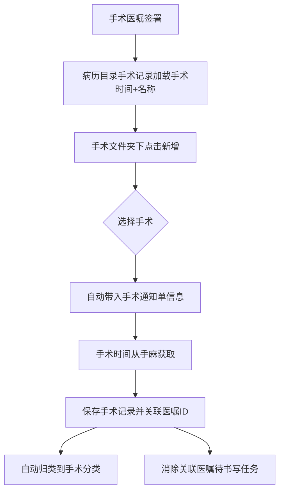
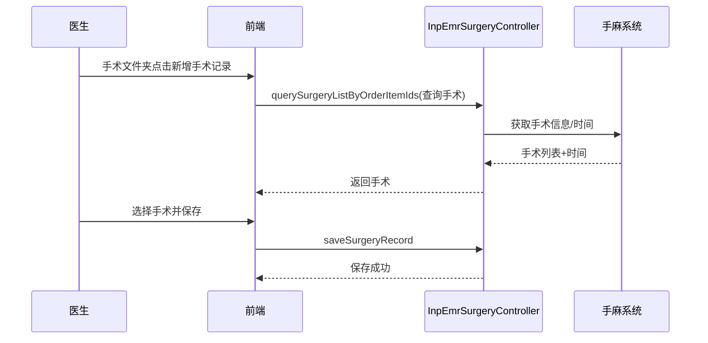

# BLGL-01-BLSX-006 手术记录 - Spec

> **功能编号**：BLGL-01-BLSX-006
> **文档类型**：功能Spec（业务背景与设计）
> **文档版本**：V1.0
> **编写时间**：2026-08-15
> **编写人**：RACC

---

## 文档索引

#### 章节索引

**Spec（研发视角）**

| 章节号 | 章节名称 | 内容说明 |
|--------|---------|---------|
| 1、 | 文档概述 | 文档目的、文档范围、术语定义、阅读指南、参考文档 |
| 2、 | 功能背景与定位 | 功能背景、功能定位、目标用户、核心价值 |
| 3、 | 业务流程设计 | 主流程/异常流程/边界流程（Given/When/Then） |
| 4、 | 数据模型设计 | 核心数据结构、状态定义、系统参数定义 |
| 5、 | 接口契约设计 | API列表、接口详细设计、错误码定义 |
| 6、 | 技术方案设计 | 页面路径、技术栈、关键技术点、部署方案 |
| 7、 | 测试用例预设计 | 功能/边界/异常/性能测试用例 |
| 8、 | 非功能性要求 | 性能、安全、可用性、兼容性 |
| 9、 | 依赖与风险 | 外部依赖、风险项 |
| 10、 | 附录 | 流程图、时序图、参考文档 |

**PM-Spec（业务视角）**

| 章节号 | 章节名称 | 内容说明 |
|--------|---------|---------|
| 一 | 目标 | 功能定位与核心价值 |
| 二 | 约束 | 业务/技术/非功能性约束 |
| 三 | 验收标准 | 验收条件与验证方法 |
| 四 | 排除范围 | 本次不做项与明确边界 |
| 五 | 关键决策记录 | 方案决策与选型理由 |
| 六 | 优先级 | 优先级定义 |
| 七 | 关联文档 | 关联文档索引 |
| 附录 | 填写检查清单 | 质量检查 |

**Analyst-Spec（产品视角）**

| 章节号 | 章节名称 | 内容说明 |
|--------|---------|---------|
| 一 | 功能编号体系 | 功能编号与层级结构 |
| 二 | 核心业务流程 | 核心业务流程与时序 |
| 三 | 功能规格说明 | 详细功能规格与验收标准 |
| 四 | 排除范围 | 排除范围 |
| 五 | 业务规则清单 | 业务规则清单 |
| 六 | 关联文档 | 关联文档索引 |
| 七 | 待确认问题清单 | 待确认问题汇总 |
| - | 填写检查清单 | 质量检查 |

#### 版本历史

| 版本 | 日期 | 变更说明 | 编写人 |
|------|------|---------|--------|
| V1.0 | 2026-08-15 | 初始版本 | RACC |

#### 关联文档索引

| 序号 | 文档名称 | 文档类型 | 版本 | 位置 |
|------|---------|---------|------|------|
| 1 | BLGL-01-BLSX-006_手术记录_PM-Spec.md | PM-Spec（业务视角） | V0.1 | 本目录 |
| 2 | BLGL-01-BLSX-006_手术记录_Analyst-Spec.md | Analyst-Spec（产品视角） | V1.0 | 本目录 |
| 3 | BLGL-01-BLSX-006_手术记录-Spec.md | Spec（研发视角）（本文档） | V1.0 | 本目录 |
| 4 | BLGL-01-BLSX 01病历书写功能点Spec.md | 功能点Spec（模块级） | V1.0 | 上级目录 |

---

## 1、文档概述

### 1.1、文档目的

本文档旨在明确"手术记录"功能（BLGL-01-BLSX-006）的业务背景与设计方案，为需求分析、研发实现、测试验收及评审提供统一的业务上下文、设计口径与决策依据。

### 1.2、文档范围

#### 1.2.1 纳入范围

本文档覆盖手术记录的完整业务背景与设计，包括：

- 手术记录创建：创建手术记录时自动带入手术通知单中的手术日期、手术前诊断、手术名称、手术人员等信息
- 手术信息获取：手术记录数据从手麻系统获取（手术开始时间/结束时间）
- 手术记录保存/删除/顺序调整：手术记录保存、批量保存、删除、调整顺序
- 手术目录与分类：his手术医嘱签署后病历目录手术记录默认加载开立手术时间+名称，按手术分类显示，手术目录下自动新增文书
- 手术安全核查表/风险评估表：可根据打印样式带出医生签名，日期自动获取当前时间
- 手术名称弹框录入：操作名称控件支持弹框录入（概念ID 399217888）

#### 1.2.2 排除范围

本文档不涉及以下内容（详见其他功能点或模块）：

- 病历编辑与保存 —— BLGL-01-BLSX-002
- 病历签署—— BLGL-01-BLSX-003
- 病历提交与撤销提交 —— BLGL-01-BLSX-004
- 病历审签阅改 —— BLGL-01-BLSX-005
- 书写任务与时限提醒 —— BLGL-01-BLSX-007
- 手术安全核查表来源配置（手麻/本地，COMMON261）—— Phase 1 第6章 BC-BLSX-013

### 1.3、术语定义

| 术语 | 定义 |
|------|------|
| 手术记录 | 手术相关病历文书，记录手术名称、手术日期、手术人员等 |
| 手术通知单 | 手术排程信息，含手术日期、手术前诊断、手术名称、手术人员 |
| 手麻系统 | 手术麻醉信息系统，提供手术开始/结束时间等数据 |
| 手术文件夹 | 病历目录下按手术分类生成的文件夹，承载手术相关文书 |

### 1.4、阅读指南

- **章节关系**：第1~2章为业务全貌，第3~10章为设计实现层。与 Analyst-Spec、PM-Spec 互相引用保持一致。
- **读者对象**：产品经理/需求分析师读第1~2章；研发读第3~6、9~10章；测试读第3、7~8章；评审人员核对各层一致性。

### 1.5、参考文档

| 序号 | 文档名称 | 版本/日期 |
|------|---------|----------|
| 1 | 【历史需求】住院病历的历史需求.xlsx | - |
| 2 | BLGL-01-BLSX-006_手术记录_PM-Spec.md | V0.1 |
| 3 | BLGL-01-BLSX-006_手术记录_Analyst-Spec.md | V1.0 |
| 4 | BLGL-01-BLSX 01病历书写功能点Spec.md | V1.0 |
| 5 | 病历书写_功能清单_20260327_151500.md | 2026-03-27 |

---

## 2、功能背景与定位

### 2.1 功能背景

手术记录是病历书写中与手术强相关的文书功能，需满足：

- **现状痛点**：手术记录手术开始时间无法获取、手术名称手工录入效率低、手术文件夹无自动关联
- **管理要求**：手术记录必须关联手术时间（手麻系统）、数据从手麻系统获取、按手术分类显示
- **历史需求演进**：从手术信息从医嘱/手麻获取→ 手术记录自动带入手术通知单信息→ 手术开始时间从手麻获取→ 手术目录按手术分类生成→ 手术文件夹自动新增文书→ 操作名称弹框录入

### 2.2 功能定位

"手术记录"是 WiNEX 病历管理-病历书写的手术相关文书功能点，定位为：

- **手术数据源**：对接手麻系统/医嘱系统获取手术信息
- **手术文书入口**：手术目录/手术文件夹承载手术相关文书
- **手术关联校验**：手术记录必须关联手术时间，手术安全核查表/风险评估表带签名

### 2.3 目标用户

| 用户角色 | 主要使用场景 |
|---------|-------------|
| 住院医师 | 创建/编辑手术记录，手术安全核查表/风险评估表 |
| 上级医师 | 手术记录审签（三级查房） |
| 麻醉师 | 麻醉相关文书（多人同写） |

### 2.4 核心价值

| 价值维度 | 价值描述 |
|---------|---------|
| 数据准确性 | 手术记录自动带入手术通知单信息、手术时间从手麻获取 |
| 书写效率 | 手术目录自动加载、手术文件夹自动新增文书 |
| 手术安全 | 手术安全核查表/风险评估表带签名，保障手术安全 |

---

## 3、业务流程设计（Given/When/Then）

### 3.1 主流程

**Scenario 1: 创建手术记录（自动带入手术通知单信息）**

```gherkin
Given:
- 患者存在手术医嘱/手术通知单
- 手术记录必须关联手术时间（手麻系统）

When:
- 医师在手术文件夹下点击新增手术记录
- 选择手术（手麻回传信息：时间+手术名称）

Then:
- 自动带入手术通知单中的手术日期、手术前诊断、手术名称、手术人员等信息
- 创建手术记录并关联医嘱ID，自动归类到该手术分类下
```

**Scenario 2: 手术记录数据从手麻系统获取**

```gherkin
Given:
- 手术记录病历模板已配置缺省值

When:
- 医师打开手术记录

Then:
- 手术开始时间从手麻系统获取
- 手术结束时间自动获取到手麻系统数据
```

### 3.2 异常流程

**Scenario 3: 业务异常——无手术时间不能添加手术记录**

```gherkin
Given:
- 参数"手术记录是否必须关联手术时间"为是
- 手麻系统无对应手术时间

When:
- 医师尝试添加手术记录

Then:
- 不能添加对应手术记录
```

**Scenario 4: 数据异常——手术信息获取失败**

```gherkin
Given:
- 手麻系统/医嘱系统手术信息获取失败

When:
- 医师创建手术记录

Then:
- 手术信息无法自动带入，可手动录入
```

**Scenario 5: 系统异常——手麻接口异常**

```gherkin
Given:
- 手麻接口异常

When:
- 医师查询手术信息

Then:
- 手术下拉无数据，提示接口异常可重试
```

### 3.3 边界流程

**Scenario 6: 边界——手术文件夹自动新增文书**

```gherkin
Given:
- 病历已生成手术文件夹

When:
- 医师在手术文件夹上点击新增

Then:
- 默认打开手术记录绑定的对应模板目录
- 选择手术框：只有选中手术记录目录关联模板后，底部才显示对应的手术名称，不支持切换（置灰）
- 创建成功后记录关联的医嘱ID，并消除关联医嘱的待书写任务
- 删除文书后同步删除和医嘱对应关系
```

**Scenario 7: 边界——手术名称弹框录入**

```gherkin
Given:
- 参数"添加手术名称需要弹框的监控类型"已配置
- 默认选中{手术记录，手术相关记录，有创诊疗操作记录}

When:
- 医师在操作名称数据元（概念ID 399217888）录入

Then:
- 弹出手术弹框录入界面
```

---

## 4、数据模型设计

### 4.1 核心数据结构

#### 4.1.1 核心保存请求（保存手术记录）

| 字段名 | 类型 | 必填 | 备注 |
|--------|------|------|------|
| encounterId | Long | 是 | 就诊标识 |
| inpEmrSetId | Long | 是 | 病历ID |
| 手术信息 | Object | 是 | 手术名称/时间/人员等 |
| 医嘱ID | Long | 否 | 关联医嘱 |

#### 4.1.2 核心表/实体

| 表/实体 | 关键字段 | 说明 |
|---------|---------|------|
| 手术记录实体 | 手术名称、手术时间、手术人员、医嘱ID | 手术记录数据 |
| 手术信息表 | 手术日期、手术前诊断、手术名称、手术人员 | 手术通知单信息 |
| INP_EMR_SET_QUOTE_CLI_ORDER | 关联医嘱记录 | 手术记录关联医嘱 |

### 4.2 状态定义

| 状态码 | 状态名称 | 说明 |
|--------|---------|------|
| 390030405 | 草稿 | 手术记录编辑中 |
| 390030406 | 已签署 | 手术记录已签署 |
| 399017130 | 已提交 | 手术记录已提交 |

### 4.3 系统参数定义

| 参数编码 | 参数名称 | 说明 |
|---------|---------|------|
| 待确认 | 手术记录是否必须关联手术时间 | 开启后创建手术记录时必须关联手术时间（手麻系统），默认关闭 |
| 待确认 | 手术信息从医嘱系统或手麻系统获取 | 默认医嘱系统 |
| COMMON261 | 是否使用手麻系统的手术安全核查表 | 1是/2否 |
| 待确认 | 添加手术名称需要弹框的监控类型 | 默认{手术记录，手术相关记录，有创诊疗操作记录} |

---

## 5、接口契约设计

### 5.1 API列表

| 序号 | API名称（代码函数） | 路径 | 方法 | 说明 |
|:----:|---------|------|:----:|------|
| 1 | saveSurgeryRecord | /api/v1/app_record_inpatient/emr_inpatient/surgery_record/save | POST | 保存手术信息（手术控件） |
| 2 | batchSaveSurgeryRecord | /api/v1/app_record_inpatient/emr_inpatient/surgery_record/batch_save | POST | 批量保存手术信息 |
| 3 | deleteSurgeryRecord | /api/v1/app_record_inpatient/emr_inpatient/surgery_record/delete | POST | 删除手术信息 |
| 4 | changeSurgeryRecord | /api/v1/app_record_inpatient/emr_inpatient/surgery_record_seq_no/change | POST | 调整手术信息顺序 |
| 5 | querySurgeryListByOrderItemIds | /api/v1/app_record_inpatient/emr_inpatient/surgery/query | POST | 查询手术列表 |
| 6 | syncSurgeryInfo | /api/v1/app_record_inpatient/emr/surgery_info_to_medical_archive/sync | POST | 同步手术信息到病案首页 |
| 7 | INPATIENT_EMR_SURGERY_RECORD_ADD_V1 | /api/v1/app_record_inpatient/emr_inpatient/inpatient_surgery_record/add | POST | 新增病历手术记录 |
| 8 | INPATIENT_EMR_SURGERY_RECORD_BATCH_ADD_V1 | /api/v1/app_record_inpatient/emr_inpatient/inpatient_surgery_record/batch_add | POST | 批量新增病历手术记录 |
| 9 | moveSurgeryRecord | /api/v1/app_record_inpatient/emr_inpatient/inpatient_surgery_record/move | POST | 病历簿-将手术记录移动到某个子目录下 |

### 5.2 接口详细设计

#### 5.2.1 保存手术记录（saveSurgeryRecord）

**请求参数**:
```json
{
  "encounterId": "就诊标识",
  "inpEmrSetId": "病历ID",
  "手术信息": "手术名称/时间/人员/医嘱ID"
}
```

**返回值（成功）**:
```json
{
  "success": true,
  "data": {
    "手术记录ID": "新建手术记录标识"
  }
}
```

**返回值（失败）**:
```json
{
  "success": false,
  "message": "<错误信息，如：手术记录必须关联手术时间>",
  "data": null
}
```

> 请求/返回字段结构以 API 契约文档为准。

### 5.3 错误码定义

| 错误码 | 错误信息 | 处理方式 |
|--------|---------|---------|
| 待确认 | 手术记录必须关联手术时间 | 阻断创建手术记录 |
| 待确认 | 手麻接口异常 | 手术下拉无数据，可重试 |
| 待确认 | 当前手术通知单信息缺失 | 手术信息无法自动带入 |

---

## 6、技术方案设计

### 6.1 页面路径

- **页面路径**: 住院医生站→住院病历书写界面→病历目录→手术文件夹→手术记录（InpEmrSurgeryController）
- **组件**：EmrEditor/api（querySurgeryListByOrderItemIds）、EmrNavigator（moveSurgeryRecord）、AuxiliaryOnAnesthesiaDoc（麻醉文书）
- **核心逻辑模块**: InpEmrSurgeryController（winning-emr-ipt-misc）

### 6.2 技术栈

| 类别 | 技术 | 版本 |
|------|------|------|
| 前端框架 | Vue | 2.6.14 |
| 前端UI | element-ui | 2.13.0 |
| 后端框架 | Spring Boot（Java） | 17 |

### 6.3 关键技术点

- 手术记录保存/删除/顺序调整走 surgery_record 系列接口
- 手术信息获取：从医嘱系统或手麻系统获取（默认医嘱系统）
- 手术时间：手术记录模板手术开始/结束时间从手麻系统获取
- 手术目录：his手术医嘱签署后病历目录手术记录默认加载开立手术时间+名称，存医嘱ID关联手麻和医嘱

### 6.4 部署方案

⏳ 待确认：部署方案未在资料区中找到。

---

## 7、测试用例预设计

### 7.1 功能测试

| 用例编号 | 测试场景 | Given | When | Then |
|---------|---------|-------|------|------|
| TC-001 | 创建手术记录自动带入手术通知单 | 存在手术通知单 | 新增手术记录选择手术 | 自动带入手术日期/前诊断/名称/人员 |
| TC-002 | 手术时间从手麻获取 | 手麻有数据 | 打开手术记录 | 手术开始/结束时间自动获取 |
| TC-003 | 手术记录保存/删除/顺序调整 | 手术记录已创建 | 保存/删除/调序 | 操作成功 |

### 7.2 边界测试

| 用例编号 | 测试场景 | Given | When | Then |
|---------|---------|-------|------|------|
| TC-004 | 无手术时间不能添加 | 参数开启且无手术时间 | 添加手术记录 | 不能添加 |
| TC-005 | 手术文件夹自动新增文书 | 已生成手术文件夹 | 手术文件夹上新增 | 默认打开绑定模板目录，关联医嘱ID |
| TC-006 | 手术名称弹框录入 | 参数已配置 | 操作名称控件录入 | 弹框录入 |

### 7.3 异常测试

| 用例编号 | 测试场景 | Given | When | Then |
|---------|---------|-------|------|------|
| TC-007 | 手麻接口异常 | 手麻接口异常 | 查询手术 | 手术下拉无数据提示重试 |
| TC-008 | 手术信息获取失败 | 手麻/医嘱无数据 | 创建手术记录 | 信息无法自动带入可手动录入 |

### 7.4 性能测试

| 用例编号 | 测试场景 | 指标 |
|---------|---------|------|
| TC-009 | 手术记录加载响应 | ⏳ 待确认：性能指标未在资料区中找到 |

---

## 8、非功能性要求

### 8.1 性能要求

| 指标 | 要求 |
|------|------|
| 手术记录加载响应时间 | ⏳ 待确认 |

### 8.2 安全要求

| 要求 | 说明 |
|------|------|
| 手术时间关联 | 手术记录必须关联手术时间 |
| 手术安全核查 | 手术安全核查表/风险评估表带医生签名 |

**医疗行业特殊要求**

| 要求 | 说明 |
|------|------|
| 手术数据准确性 | 手术记录自动带入手术通知单信息 |
| 手术安全 | 手术安全核查表/风险评估表 |

### 8.3 可用性要求

| 指标 | 要求值 |
|------|--------|
| 可用性 | ⏳ 待确认 |

### 8.4 兼容性要求

| 类型 | 要求 |
|------|------|
| 手术数据来源 | 医嘱系统/手麻系统可配置 |
| 手术安全核查表来源 | 手麻系统/本地可配置（COMMON261） |

---

## 9、依赖与风险

### 9.1 外部依赖

| 依赖项 | 说明 |
|--------|------|
| 手麻系统 | 手术开始/结束时间、手术信息 |
| 医嘱系统 | 手术医嘱开立、医嘱关联 |
| 病案首页 | 手术信息同步到病案首页（来源：前端 syncSurgeryInfo） |

### 9.2 风险项

| 风险项 | 等级 | 说明 | 应对方案 |
|--------|------|------|---------|
| 手麻接口不稳定 | 中 | 手术信息依赖手麻接口 | 接口异常降级+可重试 |
| 手术信息不完整 | 中 | 手术通知单信息缺失影响自动带入 | 手动录入兜底 |
| 医嘱取消后关联 | 低 | 医嘱取消等操作由医生手动删除 | 手动删除机制 |

---

## 10、附录

### 10.1 流程图



### 10.2 时序图



### 10.3 参考文档

- 病历书写_功能清单_20260327_151500.md（书写规则设置-手术信息取值设置/手术记录条件设置/手术知情同意书校验、病历打印）
- 【历史需求】住院病历的历史需求.xlsx
- BLGL-01-BLSX 01病历书写功能点Spec.md（V1.0，第5章 BLGL-01-BLSX-006 行）
- 关联Spec：BLGL-01-BLSX-006_手术记录_PM-Spec.md、BLGL-01-BLSX-006_手术记录_Analyst-Spec.md

---

## 填写检查清单

| 序号 | 检查项 | 是否完成 |
|:----:|--------|:--------:|
| 1 | 章节索引与正文章节一致 | ✅ |
| 2 | 版本历史记录完整 | ✅ |
| 3 | 关联文档索引已登记全部Spec | ✅ |
| 4 | 文档目的明确回答"为什么做/做成什么/怎么做" | ✅ |
| 5 | 纳入范围/排除范围清晰 | ✅ |
| 6 | 术语定义覆盖关键概念，从资料区可溯源 | ✅ |
| 7 | 参考文档已登记 | ✅ |
| 8 | 功能背景基于法规/规范/需求来源组织 | ✅ |
| 9 | 功能定位体现业务价值（3~5个定位点） | ✅ |
| 10 | 目标用户角色覆盖完整，在需求原文中有出处 | ✅ |
| 11 | 核心价值可陈述，与 Phase 1 口径一致 | ✅ |
| 12 | 业务流程：主流程≥1、异常≥3、边界≥2，Given/When/Then 具体 | ✅ |
| 13 | 数据模型：字段/表/状态/参数可溯源 | ✅ |
| 14 | 接口契约：API列表+详细设计+错误码齐全或标记待确认 | ✅ |
| 15 | 技术方案：页面路径/技术栈/关键点/部署方案或标记待确认 | ✅ |
| 16 | 测试用例：功能/边界/异常/性能覆盖 | ✅ |
| 17 | 非功能性要求：性能/安全/可用性/兼容性指标可量化或标记待确认 | ✅ |
| 18 | 依赖与风险：外部依赖登记完整 | ✅ |
| 19 | 附录：流程图/时序图与正文流程一致 | ✅ |
| 20 | 全文无占位符 `< >` 残留 | ✅ |
| 21 | 全文陈述可溯源至资料区 | ✅ |
| 22 | 人工审核确认完成 | ⏳ 待确认 |

---

**文档状态**：⬜ 待审核
**维护责任**：RACC
**下次更新**：根据评审反馈优化