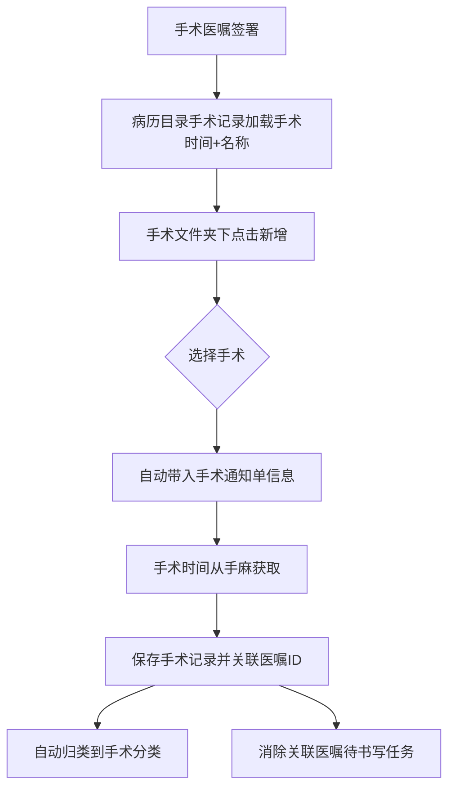
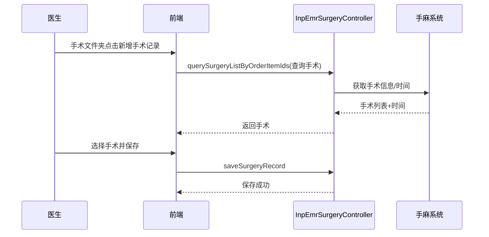

# BLGL-01-BLSX-006 手术记录_Analyst-Spec

> **需求编号**：BLGL-01-BLSX-006
> **父需求**：BLGL-01-BLSX
> **关联PM Spec**：BLGL-01-BLSX-006_手术记录_PM-Spec.md
> **Spec版本**：V1.0
> **编写时间**：2026-08-15
> **编写人**：需求分析师

---

## 一、功能编号体系

### 1.1 功能层级结构

```
BLGL-01-BLSX-006-001: 手术记录创建
  ├─ BLGL-01-BLSX-006-001-01: 自动带入手术通知单信息
  ├─ BLGL-01-BLSX-006-001-02: 手术时间从手麻获取
  ├─ BLGL-01-BLSX-006-001-03: 手术时间关联校验
  └─ BLGL-01-BLSX-006-001-04: 手术名称弹框录入

BLGL-01-BLSX-006-002: 手术记录维护
  ├─ BLGL-01-BLSX-006-002-01: 手术记录保存
  ├─ BLGL-01-BLSX-006-002-02: 手术记录批量保存
  ├─ BLGL-01-BLSX-006-002-03: 手术记录删除
  └─ BLGL-01-BLSX-006-002-04: 手术记录顺序调整

BLGL-01-BLSX-006-003: 手术目录与分类
  ├─ BLGL-01-BLSX-006-003-01: 手术目录加载（手术时间+名称）
  ├─ BLGL-01-BLSX-006-003-02: 手术文件夹自动新增文书
  └─ BLGL-01-BLSX-006-003-03: 手术记录关联医嘱

BLGL-01-BLSX-006-004: 手术安全文书
  ├─ BLGL-01-BLSX-006-004-01: 手术安全核查表
  ├─ BLGL-01-BLSX-006-004-02: 手术风险评估表
  └─ BLGL-01-BLSX-006-004-03: 带出医生签名
```

### 1.2 功能编号表

| REQ-ID | 功能名称 | 类型 | 优先级 | 说明 |
|--------|---------|------|--------|------|
| BLGL-01-BLSX-006-001 | 手术记录创建 | 功能 | P0 | 自动带入手术通知单信息，手术时间从手麻获取 |
| BLGL-01-BLSX-006-001-01 | 自动带入手术通知单信息 | 子功能 | P0 | 手术日期/前诊断/名称/人员自动带入 |
| BLGL-01-BLSX-006-001-02 | 手术时间从手麻获取 | 子功能 | P0 | 手术开始/结束时间从手麻获取 |
| BLGL-01-BLSX-006-001-03 | 手术时间关联校验 | 子功能 | P0 | 手麻有手术开始时间才可添加手术记录 |
| BLGL-01-BLSX-006-001-04 | 手术名称弹框录入 | 子功能 | P1 | 操作名称控件弹框录入（399217888） |
| BLGL-01-BLSX-006-002 | 手术记录维护 | 功能 | P0 | 手术记录保存/批量保存/删除/顺序调整 |
| BLGL-01-BLSX-006-002-01 | 手术记录保存 | 子功能 | P0 | 保存手术信息 |
| BLGL-01-BLSX-006-002-02 | 手术记录批量保存 | 子功能 | P1 | 批量保存手术信息 |
| BLGL-01-BLSX-006-002-03 | 手术记录删除 | 子功能 | P0 | 删除手术信息 |
| BLGL-01-BLSX-006-002-04 | 手术记录顺序调整 | 子功能 | P1 | 调整手术信息顺序 |
| BLGL-01-BLSX-006-003 | 手术目录与分类 | 功能 | P1 | 手术目录加载/手术文件夹新增/关联医嘱 |
| BLGL-01-BLSX-006-003-01 | 手术目录加载 | 子功能 | P1 | 手术医嘱签署后目录加载时间+名称 |
| BLGL-01-BLSX-006-003-02 | 手术文件夹自动新增文书 | 子功能 | P1 | 手术文件夹上新增文书，记录医嘱ID |
| BLGL-01-BLSX-006-003-03 | 手术记录关联医嘱 | 子功能 | P1 | 存医嘱ID关联手麻和医嘱 |
| BLGL-01-BLSX-006-004 | 手术安全文书 | 功能 | P1 | 安全核查表/风险评估表带签名 |
| BLGL-01-BLSX-006-004-01 | 手术安全核查表 | 子功能 | P1 | 手术安全核查表 |
| BLGL-01-BLSX-006-004-02 | 手术风险评估表 | 子功能 | P1 | 手术风险评估表 |
| BLGL-01-BLSX-006-004-03 | 带出医生签名 | 子功能 | P1 | 按打印样式带出医生签名 |

---

## 二、核心业务流程

### 2.1 手术记录创建主流程



### 2.2 手术记录时序



---

## 三、功能规格说明


### BLGL-01-BLSX-006-001: 手术记录创建

#### 3.1.1 功能概述

创建手术记录时自动带入手术通知单信息，手术时间从手麻获取，手术时间关联校验，手术名称弹框录入。

#### 3.1.2 用户角色

| 角色 | 使用场景 | 权限要求 | 操作频率 |
|------|---------|---------|---------|
| 住院医师 | 创建手术记录 | 手术文书创建权限 | 中频 |

#### 3.1.3 业务流程（Given/When/Then）

##### 主流程

**Scenario 1: 创建手术记录自动带入信息**

```gherkin
Given:
- 患者存在手术医嘱/手术通知单
- 手麻系统有手术开始时间

When:
- 医师在手术文件夹下点击新增手术记录
- 选择手术

Then:
- 自动带入手术日期、手术前诊断、手术名称、手术人员等信息
- 创建手术记录并关联医嘱ID
```

##### 异常流程

**Scenario 2: 业务异常——无手术时间不能添加**

```gherkin
Given:
- 参数"手术记录是否必须关联手术时间"为是
- 手麻系统无手术时间

When:
- 医师添加手术记录

Then:
- 不能添加对应手术记录
```

**Scenario 3: 数据异常——手术通知单信息缺失**

```gherkin
Given:
- 手术通知单信息不完整

When:
- 医师创建手术记录

Then:
- 手术信息无法自动带入，可手动录入
```

**Scenario 4: 系统异常——手麻接口异常**

```gherkin
Given:
- 手麻接口异常

When:
- 医师查询手术信息

Then:
- 手术下拉无数据，提示接口异常可重试
```

##### 边界流程

**Scenario 5: 边界——手术时间从手麻获取**

```gherkin
Given:
- 手术记录模板已配置缺省值

When:
- 医师打开手术记录

Then:
- 手术开始时间从手麻获取
- 手术结束时间自动获取
```

**Scenario 6: 边界——手术名称弹框录入**

```gherkin
Given:
- 参数"添加手术名称需要弹框的监控类型"已配置

When:
- 医师在操作名称控件录入

Then:
- 弹出手术弹框录入界面（概念ID 399217888）
```

#### 3.1.5 验收标准

| AC编号 | 验收标准 | 对应REQ-ID | 验证方法 | 验证场景 |
|--------|---------|-----------|---------|---------|
| AC-001 | 创建手术记录自动带入手术通知单信息 | BLGL-01-BLSX-006-001 | 功能测试 | Scenario 1 |
| AC-002 | 手麻无手术时间时不能添加手术记录 | BLGL-01-BLSX-006-001 | 集成测试 | Scenario 2 |
| AC-003 | 手术开始时间从手麻系统获取 | BLGL-01-BLSX-006-001 | 集成测试 | Scenario 5 |


### BLGL-01-BLSX-006-002: 手术记录维护

#### 3.2.1 功能概述

手术记录保存/批量保存/删除/顺序调整。

#### 3.2.2 用户角色

| 角色 | 使用场景 | 权限要求 | 操作频率 |
|------|---------|---------|---------|
| 住院医师 | 手术记录维护 | 手术文书编辑权限 | 中频 |

#### 3.2.3 业务流程（Given/When/Then）

##### 主流程

**Scenario 1: 保存手术记录**

```gherkin
Given:
- 手术记录已创建

When:
- 医师编辑手术记录并保存

Then:
- 手术记录保存成功
```

##### 异常流程

**Scenario 2: 业务异常——手术时间未关联**

```gherkin
Given:
- 参数"手术记录是否必须关联手术时间"为是

When:
- 医师保存未关联手术时间的手术记录

Then:
- 阻断保存
```

**Scenario 3: 数据异常——批量保存部分失败**

```gherkin
Given:
- 批量保存手术记录

When:
- 部分手术信息校验失败

Then:
- 失败项提示，成功项保存
```

**Scenario 4: 系统异常——保存接口异常**

```gherkin
Given:
- 保存接口异常

When:
- 医师保存手术记录

Then:
- 保存失败提示，可重试
```

##### 边界流程

**Scenario 5: 边界——删除手术记录**

```gherkin
Given:
- 手术记录已创建

When:
- 医师删除手术记录

Then:
- 删除成功，同步删除和医嘱对应关系（手术文件夹场景）
```

**Scenario 6: 边界——手术记录顺序调整**

```gherkin
Given:
- 多个手术记录

When:
- 医师调整手术记录顺序

Then:
- 顺序调整成功
```

#### 3.2.5 验收标准

| AC编号 | 验收标准 | 对应REQ-ID | 验证方法 | 验证场景 |
|--------|---------|-----------|---------|---------|
| AC-001 | 手术记录保存成功 | BLGL-01-BLSX-006-002 | 功能测试 | Scenario 1 |
| AC-002 | 删除手术记录后同步删除医嘱对应关系 | BLGL-01-BLSX-006-002 | 功能测试 | Scenario 5 |


### BLGL-01-BLSX-006-003: 手术目录与分类

#### 3.3.1 功能概述

手术医嘱签署后病历目录手术记录默认加载开立手术时间+名称，手术文件夹自动新增文书，手术记录关联医嘱。

#### 3.3.2 用户角色

| 角色 | 使用场景 | 权限要求 | 操作频率 |
|------|---------|---------|---------|
| 住院医师 | 手术目录查看/手术文件夹新增 | 手术文书权限 | 中频 |

#### 3.3.3 业务流程（Given/When/Then）

##### 主流程

**Scenario 1: 手术目录加载**

```gherkin
Given:
- his手术医嘱签署

When:
- 首次创建手术相关记录

Then:
- 病历目录手术记录默认加载开立手术时间+名称
- 生成手术资料目录下手术资料分类标题（时间+手术名称，多个手术用+号连接）
```

##### 异常流程

**Scenario 2: 业务异常——医嘱取消**

```gherkin
Given:
- 医嘱取消等操作

When:
- 手术目录已生成

Then:
- 由医生手动删除手术记录
```

**Scenario 3: 数据异常——手术文件夹无关联模板**

```gherkin
Given:
- 手术文件夹未关联手术记录模板

When:
- 医师在手术文件夹上新增文书

Then:
- 选择手术框不显示手术名称（置灰）
```

##### 边界流程

**Scenario 4: 边界——手术文件夹自动新增文书**

```gherkin
Given:
- 病历已生成手术文件夹

When:
- 医师在手术文件夹上新增

Then:
- 默认打开手术记录绑定的对应模板目录
- 创建成功记录关联医嘱ID，消除关联医嘱的待书写任务
```

**Scenario 5: 边界——手术记录移动子目录**

```gherkin
Given:
- 病历簿手术记录

When:
- 医师将手术记录移动到某个子目录下

Then:
- 移动成功
```

#### 3.3.5 验收标准

| AC编号 | 验收标准 | 对应REQ-ID | 验证方法 | 验证场景 |
|--------|---------|-----------|---------|---------|
| AC-001 | 手术医嘱签署后目录加载手术时间+名称 | BLGL-01-BLSX-006-003 | 功能测试 | Scenario 1 |
| AC-002 | 手术文件夹新增文书记录医嘱ID，消除待书写任务 | BLGL-01-BLSX-006-003 | 功能测试 | Scenario 4 |


### BLGL-01-BLSX-006-004: 手术安全文书

#### 3.4.1 功能概述

手术安全核查表、手术风险评估表根据打印样式带出医生签名。

#### 3.4.2 用户角色

| 角色 | 使用场景 | 权限要求 | 操作频率 |
|------|---------|---------|---------|
| 住院医师 | 手术安全核查表/风险评估表 | 手术文书权限 | 中频 |

#### 3.4.3 业务流程（Given/When/Then）

##### 主流程

**Scenario 1: 手术安全核查表带出签名**

```gherkin
Given:
- 手术安全核查表/手术风险评估表已填写

When:
- 医师查看打印样式

Then:
- 根据打印样式带出医生签名
```

##### 异常流程

**Scenario 2: 业务异常——无签名**

```gherkin
Given:
- 手术安全核查表/风险评估表未签名

When:
- 医师打印

Then:
- 无签名则不能打印（病历签名规范）
```

**Scenario 3: 数据异常——日期未获取**

```gherkin
Given:
- 手术风险评估表

When:
- 医师填写

Then:
- 日期自动获取当前时间
```

##### 边界流程

**Scenario 4: 边界——VTE风险评估表标签**

```gherkin
Given:
- 产科VTE评估表填写提交

When:
- 判断评分风险等级

Then:
- 传给床卡，床卡显示VTE等级标签
```

#### 3.4.5 验收标准

| AC编号 | 验收标准 | 对应REQ-ID | 验证方法 | 验证场景 |
|--------|---------|-----------|---------|---------|
| AC-001 | 手术安全核查表/风险评估表按打印样式带出医生签名 | BLGL-01-BLSX-006-004 | 功能测试 | Scenario 1 |
| AC-002 | 手术风险评估表日期自动获取当前时间 | BLGL-01-BLSX-006-004 | 功能测试 | Scenario 3 |


---

## 四、排除范围

本需求不包含以下功能项：

1. **病历编辑与保存 —— BLGL-01-BLSX-002**
2. **病历签署—— BLGL-01-BLSX-003**
3. **病历提交与撤销提交 —— BLGL-01-BLSX-004**
4. **病历审签阅改 —— BLGL-01-BLSX-005**
5. **书写任务与时限提醒 —— BLGL-01-BLSX-007**
6. **手术安全核查表来源配置（COMMON261）—— Phase 1 第6章 BC-BLSX-013**

---

## 五、业务规则清单

| 规则ID | 规则名称 | 规则描述 | 来源 | 优先级 |
|--------|---------|---------|------|--------|
| BR-001 | 手术时间关联 | 手麻系统有手术开始时间后，才可以添加对应的手术记录 | 需求 | P0 |
| BR-002 | 手术信息自动带入 | 创建手术记录时自动带入手术通知单中的手术日期、手术前诊断、手术名称、手术人员等信息 | 需求 | P0 |
| BR-003 | 手术时间获取 | 手术记录病历模板中手术开始时间从手麻系统获取 | 需求 | P0 |
| BR-004 | 手术数据来源 | 手术信息从医嘱系统或手麻系统获取，默认医嘱系统 | 需求 | P0 |
| BR-005 | 手术文件夹新增 | 手术文件夹上自动新增文书，默认打开绑定模板目录，创建成功记录医嘱ID，消除待书写任务，删除同步删除医嘱对应关系 | 需求 | P1 |
| BR-006 | 手术目录加载 | his手术医嘱签署后，病历目录手术记录默认加载开立手术时间+名称，生成手术资料分类标题（时间+手术名称，多个+号连接） | 需求 | P1 |
| BR-007 | 安全核查签名 | 手术安全核查表、手术风险评估表根据打印样式带出医生签名 | 需求 | P1 |
| BR-008 | 手术名称弹框 | 操作名称控件支持弹框录入，概念ID 399217888 | 需求 | P1 |

---

## 六、关联文档

| 文档类型 | 文档路径 | 说明 |
|---------|---------|------|
| 功能点Spec | BLGL-01-BLSX 01病历书写功能点Spec.md（V1.0，上级目录） | Phase 1 功能点索引 |
| PM spec | 本目录 BLGL-01-BLSX-006_手术记录_PM-Spec.md（V0.1） | PM 产出的 Spec 文档 |
| -Spec | 本目录 BLGL-01-BLSX-006_手术记录-Spec.md（V1.0） | 业务背景与目标 Spec |
| data-model.md | 待产出 | 架构师产出的数据建模文档 |
| design.md | 待产出 | 架构师产出的技术方案文档 |
| api-contract.md | 待产出 | 开发经理产出的 API 契约文档 |

---

## 七、待确认问题清单

| 编号 | 问题描述 | 缺失信息 | 影响范围 | 建议补充方 |
|------|---------|---------|---------|-----------|
| Q-001 | 手术记录接口完整入参/出参字段结构 | API 契约文档 | -Spec 第5章、Analyst-Spec 数据字段 | 开发经理 |
| Q-002 | 手术相关参数编码（手术时间关联/数据来源等） | 参数配置说明表 | 数据字段（概念ID） | 产品经理 |
| Q-003 | 性能指标（手术记录加载响应） | 非功能性需求 | -Spec 第8章 | 需求分析师 |
| Q-004 | 手麻系统接口契约（手术信息/时间字段） | 接口文档 | 手术数据场景 | 接口负责人 |
| Q-005 | 手术通知单数据字段完整定义 | 手术通知单接口 | 手术记录自动带入场景 | 接口负责人 |

---

## 填写检查清单

| 序号 | 检查项 | 是否完成 |
|:----:|--------|:--------:|
| 1 | 功能编号带父子层级 | ✅ |
| 2 | 每个 REQ-ID 有功能概述和用户角色 | ✅ |
| 3 | 主流程至少 1 个 Given/When/Then 场景 | ✅ |
| 4 | 异常流程至少 3 个 Given/When/Then 场景 | ✅ |
| 5 | 边界流程至少 2 个 Given/When/Then 场景 | ✅ |
| 6 | 每个 Given/When/Then 内容具体，不模糊 | ✅ |
| 7 | 数据字段定义完整（字段名、类型、必填、说明、概念ID） | N/A |
| 8 | 验收标准 AC 编号独立，可验证 | ✅ |
| 9 | 验收标准无"功能正常"等模糊表述 | ✅ |
| 10 | 排除范围明确列出 | ✅ |
| 11 | 业务规则清单列出所有规则，每条标注来源 | ✅ |
| 12 | 流程图使用 Mermaid 格式（≥2 个） | ✅ |
| 13 | 关联文档索引包含 Phase 1 功能点Spec | ✅ |
| 14 | 待确认问题清单汇总了全文所有 ⏳ 项 | ✅ |
| 15 | 全文无占位符 `< >` 残留 | ✅ |
| 16 | 全文陈述可溯源至资料区（S1~S10 溯源核查） | ✅ |
| 17 | 人工审核确认完成 | ⏳ 待确认 |

---

**文档状态**：⬜ 待审核
**维护责任**：需求分析师规范组
**下次更新**：根据评审反馈优化

---

## 版本历史

| 版本 | 日期 | 变更说明 | 编写人 |
|------|------|---------|--------|
| V1.0 | 2026-08-15 | 初始版本 | 需求分析师 |