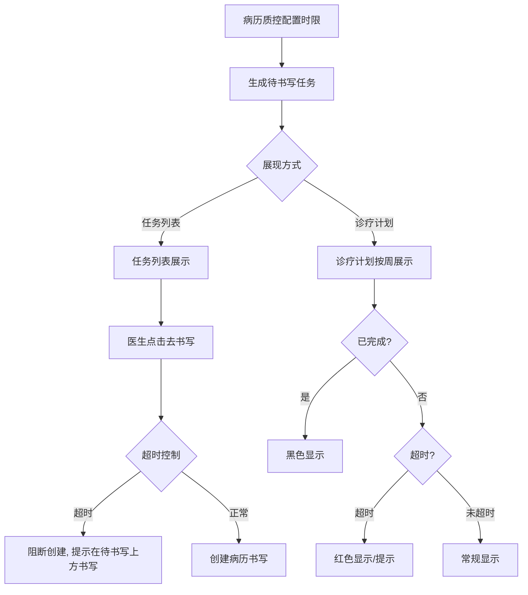
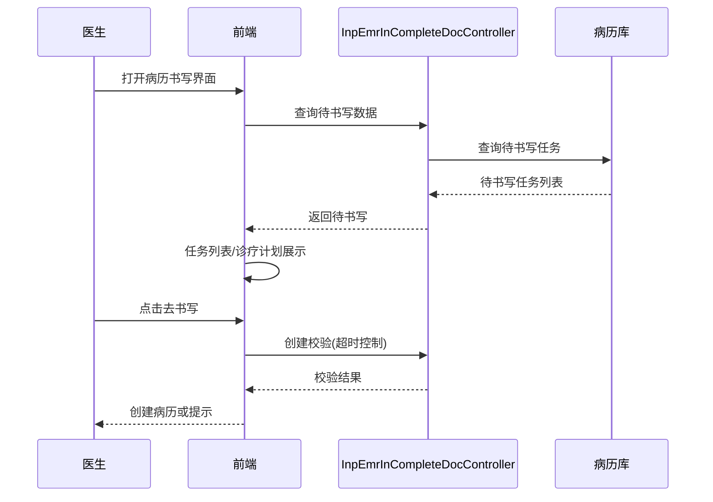

# BLGL-01-BLSX-007_书写任务与时限提醒-Spec

> **功能编号**：BLGL-01-BLSX-007
> **文档类型**：功能Spec（业务背景与设计）
> **文档版本**：V1.0
> **编写时间**：2026-08-15
> **编写人**：RACC

---

## 文档索引

#### 章节索引

**Spec（研发视角）**

| 章节号 | 章节名称 | 内容说明 |
|--------|---------|---------|
| 1、 | 文档概述 | 文档目的、文档范围、术语定义、阅读指南、参考文档 |
| 2、 | 功能背景与定位 | 功能背景、功能定位、目标用户、核心价值 |
| 3、 | 业务流程设计 | 主流程/异常流程/边界流程（Given/When/Then） |
| 4、 | 数据模型设计 | 核心数据结构、状态定义、系统参数定义 |
| 5、 | 接口契约设计 | API列表、接口详细设计、错误码定义 |
| 6、 | 技术方案设计 | 页面路径、技术栈、关键技术点、部署方案 |
| 7、 | 测试用例预设计 | 功能/边界/异常/性能测试用例 |
| 8、 | 非功能性要求 | 性能、安全、可用性、兼容性 |
| 9、 | 依赖与风险 | 外部依赖、风险项 |
| 10、 | 附录 | 流程图、时序图、参考文档 |

**PM-Spec（业务视角）**

| 章节号 | 章节名称 | 内容说明 |
|--------|---------|---------|
| 一 | 目标 | 功能定位与核心价值 |
| 二 | 约束 | 业务/技术/非功能性约束 |
| 三 | 验收标准 | 验收条件与验证方法 |
| 四 | 排除范围 | 本次不做项与明确边界 |
| 五 | 关键决策记录 | 方案决策与选型理由 |
| 六 | 优先级 | 优先级定义 |
| 七 | 关联文档 | 关联文档索引 |
| 附录 | 填写检查清单 | 质量检查 |

**Analyst-Spec（产品视角）**

| 章节号 | 章节名称 | 内容说明 |
|--------|---------|---------|
| 一 | 功能编号体系 | 功能编号与层级结构 |
| 二 | 核心业务流程 | 核心业务流程与时序 |
| 三 | 功能规格说明 | 详细功能规格与验收标准 |
| 四 | 排除范围 | 排除范围 |
| 五 | 业务规则清单 | 业务规则清单 |
| 六 | 关联文档 | 关联文档索引 |
| 七 | 待确认问题清单 | 待确认问题汇总 |
| - | 填写检查清单 | 质量检查 |
**Spec（研发视角）**：本文档（功能Spec：业务背景与设计）

#### 版本历史

| 版本 | 日期 | 变更说明 | 编写人 |
|------|------|---------|--------|
| V1.0 | 2026-08-15 | 初始版本 | RACC |

#### 关联文档索引

| 序号 | 文档名称 | 文档类型 | 版本 | 位置 |
|------|---------|---------|------|------|
| 1 | BLGL-01-BLSX-007_书写任务与时限提醒_PM-spec.md | PM-Spec（业务视角） | V0.1 | 本目录 |
| 2 | BLGL-01-BLSX-007_书写任务与时限提醒_Analyst-spec.md | Analyst-Spec（产品视角） | V1.0 | 本目录 |
| 3 | BLGL-01-BLSX-007_书写任务与时限提醒-Spec.md | Spec（研发视角）（本文档） | V1.0 | 本目录 |
| 4 | BLGL-01-BLSX 01病历书写功能点Spec.md | 功能点Spec（模块级） | V1.0 | 上级目录 |

---

## 1、文档概述

### 1.1、文档目的

本文档旨在明确"书写任务与时限提醒"功能（BLGL-01-BLSX-007）的业务背景与设计方案，为需求分析、研发实现、测试验收及评审提供统一的业务上下文、设计口径与决策依据。

### 1.2、文档范围

#### 1.2.1 纳入范围

本文档覆盖书写任务与时限提醒的完整业务背景与设计，包括：

- 书写任务展示：根据病历质控的时限要求生成病历待书写任务，支持任务列表和诊疗计划两种展现方式
- 书写任务提醒：提示医生按照病历时限要求完成病历
- 诊疗计划：按周/起始时间查看患者每天应书写记录，默认显示本周内需要完成和已完成的书写文书（已完成黑色、未完成红色）
- 待书写控制：超过时限需要控制的病历不可直接创建，需在"待书写"上方进行书写
- 书写任务触发：危急值记录、医嘱签署调用病历文书接口、交班提醒等
- 时限计算：首次提交时间/提交时间/创建时间用于质控时限计算

#### 1.2.2 排除范围

本文档不涉及以下内容（详见其他功能点或模块）：

- 病历创建与模板管理 —— BLGL-01-BLSX-001
- 病历编辑与保存 —— BLGL-01-BLSX-002
- 病历签署/提交/审签 —— BLGL-01-BLSX-003/004/005
- 手术记录 —— BLGL-01-BLSX-006
- 诊疗计划与评估表（评估表创建触发待书写）—— BLGL-01-BLSX-011

### 1.3、术语定义

| 术语 | 定义 |
|------|------|
| 待书写任务 | 根据病历质控时限要求生成病历待书写任务 |
| 书写任务提醒 | 提示医生按照病历时限要求完成病历 |
| 诊疗计划 | 按周/起始时间查看患者每天应书写记录以及添加已完成的记录 |
| 首次提交时间 | 记录每份病历第一次提交的时间，用于质控时限计算 |

### 1.4、阅读指南

- **章节关系**：第1~2章为业务全貌，第3~10章为设计实现层。与 Analyst-Spec、PM-Spec 互相引用保持一致。
- **读者对象**：产品经理/需求分析师读第1~2章；研发读第3~6、9~10章；测试读第3、7~8章；评审人员核对各层一致性。

### 1.5、参考文档

| 序号 | 文档名称 | 版本/日期 |
|------|---------|----------|
| 1 | 【历史需求】住院病历的历史需求.xlsx | - |
| 2 | BLGL-01-BLSX-007_书写任务与时限提醒_PM-spec.md | V0.1 |
| 3 | BLGL-01-BLSX-007_书写任务与时限提醒_Analyst-spec.md | V1.0 |
| 4 | BLGL-01-BLSX 01病历书写功能点Spec.md | V1.0 |
| 5 | 病历书写_功能清单_20260327_151500.md | 2026-03-27 |

---

## 2、功能背景与定位

### 2.1 功能背景

书写任务与时限提醒是病历书写的任务驱动功能，需满足：

- **管理要求**：根据病历质控的时限要求生成病历待书写任务，提示医生按照时限完成病历
- **现状痛点**：待书写任务不显示、超时控制只拦截目录树不拦截创建接口、床位卡界面未提醒
- **历史需求演进**：从书写任务展示/提醒 → 诊疗计划 → 超时控制优化 → 待书写任务不显示修复 → 首次提交时间用于时限计算 → 按文书时间更新抢救/手术/输血超时时间

### 2.2 功能定位

"书写任务与时限提醒"是 WiNEX 病历管理-病历书写的任务驱动功能点，定位为：

- **任务生成**：根据病历质控时限要求生成待书写任务
- **任务展现**：任务列表/诊疗计划两种展现方式
- **时限管控**：超时控制、时限提醒保障书写及时

### 2.3 目标用户

| 用户角色 | 主要使用场景 |
|---------|-------------|
| 住院医师 | 查看待书写任务/诊疗计划/书写提醒 |
| 质控办 | 时限质控（首次提交时间计算） |

### 2.4 核心价值

| 价值维度 | 价值描述 |
|---------|---------|
| 书写及时 | 待书写任务提醒医生按时完成病历 |
| 时限合规 | 超时控制、时限质控保障书写合规 |
| 任务可视 | 诊疗计划可视化待书写/已完成状态 |

---

## 3、业务流程设计（Given/When/Then）

### 3.1 主流程

**Scenario 1: 待书写任务展示与提醒**

```gherkin
Given:
- 病历质控已配置时限要求

When:
- 医生打开病历书写界面

Then:
- 系统生成病历待书写任务
- 支持任务列表和诊疗计划两种展现方式
- 提示医生按照病历时限要求完成病历
```

**Scenario 2: 诊疗计划查看**

```gherkin
Given:
- 参数"是否显示诊疗计划"已开启

When:
- 医生点击诊疗计划目录区域

Then:
- 打开诊疗计划
- 按周/起始时间查看患者每天应书写记录
- 默认显示本周内需要完成和已完成的书写文书，已完成黑色，未完成红色
```

### 3.2 异常流程

**Scenario 3: 业务异常——超时控制拦截创建**

```gherkin
Given:
- 病历超时限需要控制

When:
- 医生点击待书写-去书写

Then:
- 病历创建接口判断病历限制，不允许直接创建
- 弹出提示（同点击新增时的提示），超时病历在"待书写"上方进行书写
```

**Scenario 4: 数据异常——待书写任务不显示**

```gherkin
Given:
- 已创建出院小结或已书写术前小结

When:
- 医生查看待书写任务

Then:
- 不应提示存在待书写任务（修复不显示问题）
```

**Scenario 5: 系统异常——待书写查询接口异常**

```gherkin
Given:
- 待书写查询接口异常

When:
- 医生打开待书写列表

Then:
- 待书写任务不展示，提示可重试
```

### 3.3 边界流程

**Scenario 6: 边界——超时时间按文书时间更新**

```gherkin
Given:
- 抢救/手术/输血文书

When:
- 文书时间变化

Then:
- 按文书时间更新抢救、手术、输血超时时间
```

**Scenario 7: 边界——待书写任务床位卡提醒**

```gherkin
Given:
- 住院病历待书写任务

When:
- 医生查看床位卡界面

Then:
- 床位卡界面展示待书写任务提醒
```

---

## 4、数据模型设计

### 4.1 核心数据结构

#### 4.1.1 核心查询入参（待书写任务）

| 字段名 | 类型 | 必填 | 备注 |
|--------|------|------|------|
| encounterId | Long | 是 | 就诊标识 |
| inpEmrClassId | Long | 否 | 病历分类 |
| 查询条件 | Object | 否 | 时间/状态等筛选 |

#### 4.1.2 核心表/实体

| 表/实体 | 关键字段 | 说明 |
|---------|---------|------|
| 病历簿（InpatientRhbRecordPO） | 首次提交时间、提交时间、创建时间 | 时限质控计算字段 |
| 待书写任务数据 | 监控类型、待书写状态、时限 | 待书写任务 |
| 诊疗计划数据 | 周数、应书写记录、已完成记录 | 诊疗计划 |

### 4.2 状态定义

| 状态码 | 状态名称 | 说明 |
|--------|---------|------|
| 待书写 | 未书写 | 应书写但未完成 |
| 已完成 | 已书写 | 已完成书写 |
| 超时 | 超时/未超时 | 现阶段只实现超时与不超时 |

### 4.3 系统参数定义

| 参数编码 | 参数名称 | 说明 |
|---------|---------|------|
| 待确认 | 是否显示诊疗计划 | 默认停用；开启后诊疗计划目录区域点击即打开 |
| 待确认 | 加载病历时默认显示诊疗计划或最后一次记录 | 诊疗计划-0 最后一次记录-1，默认诊疗计划 |
| 待确认 | 支持修改病历时间的病历分类（COMMON007） | 控制记录时间可修改 |
| 待确认 | 病历文书查询范围 | 本次就诊/本次就诊+历史就诊，默认本次就诊 |

---

## 5、接口契约设计

### 5.1 API列表

| 序号 | API名称（代码函数） | 路径 | 方法 | 说明 |
|:----:|---------|------|:----:|------|
| 1 | queryInpEmrInCompleteDoc（待书写数据查询） | /api/v1/app_record_inpatient/emr_inpatient_task_complete_doc/by_example | POST | 根据查询条件筛选待书写数据接口 |
| 2 | queryInpEmrInCompleteDocForTaskCenter | /api/v1/app_record_inpatient/emr_inpatient_task_complete_doc/by_example | POST | 待书写数据查询-任务中心 |
| 3 | queryInpEmrInCompleteDocForDiagnosisPlan | /api/v1/app_record_inpatient/emr_inpatient_emr_set_cmd/by_example | POST | 待书写/病历数据查询-诊疗计划 |
| 4 | queryDiagnosisPlanDate | /api/v1/app_record_inpatient/emr_inpatient_diagnosis_plan_range/by_example | POST | 诊疗计划时间查询 |
| 5 | queryDiagnosisPlan | /api/v1/app_record_inpatient/emr_inpatient_diagnosis_plan/by_example | POST | 诊疗计划查询 |
| 6 | cancelTaskCenterItem | /api/v1/app_record_inpatient/emr_inpatient_task_complete_doc/cancel | POST | 取消任务中心待书写任务 |
| 7 | updateInpEmrInCompleteDoc | 更新待书写任务接口 | POST | 更新待书写任务 |

### 5.2 接口详细设计

#### 5.2.1 查询待书写数据（queryInpEmrInCompleteDoc）

**请求参数**:
```json
{
  "encounterId": "就诊标识",
  "inpEmrClassId": "病历分类（可选）"
}
```

**返回值（成功）**:
```json
{
  "success": true,
  "data": [
    {
      "监控类型": "入院记录",
      "待书写状态": "待书写/已完成",
      "时限": "书写时限"
    }
  ]
}
```

**返回值（失败）**:
```json
{
  "success": false,
  "message": "<错误信息>",
  "data": null
}
```

> 请求/返回字段结构以 API 契约文档为准。

### 5.3 错误码定义

| 错误码 | 错误信息 | 处理方式 |
|--------|---------|---------|
| 待确认 | 超过时限需要控制的病历不可直接创建 | 阻断创建，提示在待书写上方书写 |
| 待确认 | 待书写任务查询失败 | 提示可重试 |

---

## 6、技术方案设计

### 6.1 页面路径

- **页面路径**: 住院医生站→住院病历书写界面→待书写列表/诊疗计划（EmrCreatorAndWrite）
- **组件**：UnfinishedClinicalnote.vue（未完成文书/待书写）、DiagnosisPlan/index.vue（诊疗计划：writed已写/writing书写中/writeDay按天）、TaskCenterToBeWrite.vue（任务中心待书写）、UnSubmittedList.vue（未提交列表）
- **核心逻辑模块**: InpEmrInCompleteDocController（winning-emr-ipt-tasklist，tags: 业务态：住院病历待书写）

### 6.2 技术栈

| 类别 | 技术 | 版本 |
|------|------|------|
| 前端框架 | Vue | 2.6.14 |
| 前端UI | element-ui | 2.13.0 |
| 后端框架 | Spring Boot（Java） | 17 |

### 6.3 关键技术点

- 待书写任务查询走 emr_inpatient_task_complete_doc 系列接口
- 诊疗计划：周数=住院天数/周期天数，不满一周按一周算
- 超时控制：病历创建接口判断病历限制，不允许直接创建
- 时限计算：首次提交时间/提交时间/创建时间（精确到秒）用于质控时限计算

### 6.4 部署方案

⏳ 待确认：部署方案未在资料区中找到。

---

## 7、测试用例预设计

### 7.1 功能测试

| 用例编号 | 测试场景 | Given | When | Then |
|---------|---------|-------|------|------|
| TC-001 | 待书写任务展示 | 质控已配置时限 | 打开病历书写界面 | 生成待书写任务，任务列表/诊疗计划展现 |
| TC-002 | 诊疗计划查看 | 参数已开启 | 点击诊疗计划 | 按周查看，已完成黑色未完成红色 |
| TC-003 | 书写任务提醒 | 存在待书写 | 查看提醒 | 提示按时完成病历 |

### 7.2 边界测试

| 用例编号 | 测试场景 | Given | When | Then |
|---------|---------|-------|------|------|
| TC-004 | 超时控制 | 病历超时限 | 点击待书写-去书写 | 不允许直接创建，弹出提示 |
| TC-005 | 待书写任务不显示修复 | 已创建出院小结 | 查看待书写 | 不提示出院小结待书写 |
| TC-006 | 超时时间按文书时间更新 | 抢救/手术/输血 | 文书时间变化 | 超时时间更新 |

### 7.3 异常测试

| 用例编号 | 测试场景 | Given | When | Then |
|---------|---------|-------|------|------|
| TC-007 | 待书写查询接口异常 | 接口异常 | 打开待书写列表 | 不展示提示可重试 |
| TC-008 | 床位卡未提醒 | 待书写任务存在 | 查看床位卡 | 床位卡界面展示提醒 |

### 7.4 性能测试

| 用例编号 | 测试场景 | 指标 |
|---------|---------|------|
| TC-009 | 待书写列表加载 | ⏳ 待确认：性能指标未在资料区中找到 |

---

## 8、非功能性要求

### 8.1 性能要求

| 指标 | 要求 |
|------|------|
| 待书写列表加载响应时间 | ⏳ 待确认 |

### 8.2 安全要求

| 要求 | 说明 |
|------|------|
| 待书写任务权限 | 按医生/科室范围展示待书写 |

**医疗行业特殊要求**

| 要求 | 说明 |
|------|------|
| 时限质控 | 首次提交时间/提交时间/创建时间用于质控时限计算 |
| 书写合规 | 超时控制保障病历按时书写 |

### 8.3 可用性要求

| 指标 | 要求值 |
|------|--------|
| 可用性 | ⏳ 待确认 |

### 8.4 兼容性要求

| 类型 | 要求 |
|------|------|
| 展现方式 | 任务列表/诊疗计划可配置 |
| 诊疗计划显示开关 | 默认显示诊疗计划或最后一次记录可配置 |

---

## 9、依赖与风险

### 9.1 外部依赖

| 依赖项 | 说明 |
|--------|------|
| 病历质控 | 时限要求/时限质控 |

### 9.2 风险项

| 风险项 | 等级 | 说明 | 应对方案 |
|--------|------|------|---------|
| 待书写任务不准确 | 中 | 待书写任务与已书写文书不一致 | 修复任务生成逻辑 |
| 超时控制不完整 | 中 | 超时限制逻辑需拦截创建接口 | 拦截创建接口 |
| 时限计算字段 | 低 | 首次提交时间字段需正确记录 | 病历簿新增字段 |

---

## 10、附录

### 10.1 流程图



### 10.2 时序图



### 10.3 参考文档

- 病历书写_功能清单_20260327_151500.md（书写任务管理-书写任务展示/书写任务提醒）
- 【历史需求】住院病历的历史需求.xlsx
- BLGL-01-BLSX 01病历书写功能点Spec.md（V1.0，第5章 BLGL-01-BLSX-007 行）
- 关联Spec：BLGL-01-BLSX-007_书写任务与时限提醒_PM-spec.md、BLGL-01-BLSX-007_书写任务与时限提醒_Analyst-spec.md

---

## 填写检查清单

| 序号 | 检查项 | 是否完成 |
|:----:|--------|:--------:|
| 1 | 章节索引与正文章节一致 | ✅ |
| 2 | 版本历史记录完整 | ✅ |
| 3 | 关联文档索引已登记全部Spec | ✅ |
| 4 | 文档目的明确回答"为什么做/做成什么/怎么做" | ✅ |
| 5 | 纳入范围/排除范围清晰 | ✅ |
| 6 | 术语定义覆盖关键概念，从资料区可溯源 | ✅ |
| 7 | 参考文档已登记 | ✅ |
| 8 | 功能背景基于法规/规范/需求来源组织 | ✅ |
| 9 | 功能定位体现业务价值（3~5个定位点） | ✅ |
| 10 | 目标用户角色覆盖完整，在需求原文中有出处 | ✅ |
| 11 | 核心价值可陈述，与 Phase 1 口径一致 | ✅ |
| 12 | 业务流程：主流程≥1、异常≥3、边界≥2，Given/When/Then 具体 | ✅ |
| 13 | 数据模型：字段/表/状态/参数可溯源 | ✅ |
| 14 | 接口契约：API列表+详细设计+错误码齐全或标记待确认 | ✅ |
| 15 | 技术方案：页面路径/技术栈/关键点/部署方案或标记待确认 | ✅ |
| 16 | 测试用例：功能/边界/异常/性能覆盖 | ✅ |
| 17 | 非功能性要求：性能/安全/可用性/兼容性指标可量化或标记待确认 | ✅ |
| 18 | 依赖与风险：外部依赖登记完整 | ✅ |
| 19 | 附录：流程图/时序图与正文流程一致 | ✅ |
| 20 | 全文无占位符 `< >` 残留 | ✅ |
| 21 | 全文陈述可溯源至资料区 | ✅ |
| 22 | 人工审核确认完成 | ⏳ 待确认 |

---

**文档状态**：⬜ 待审核
**维护责任**：RACC
**下次更新**：根据评审反馈优化