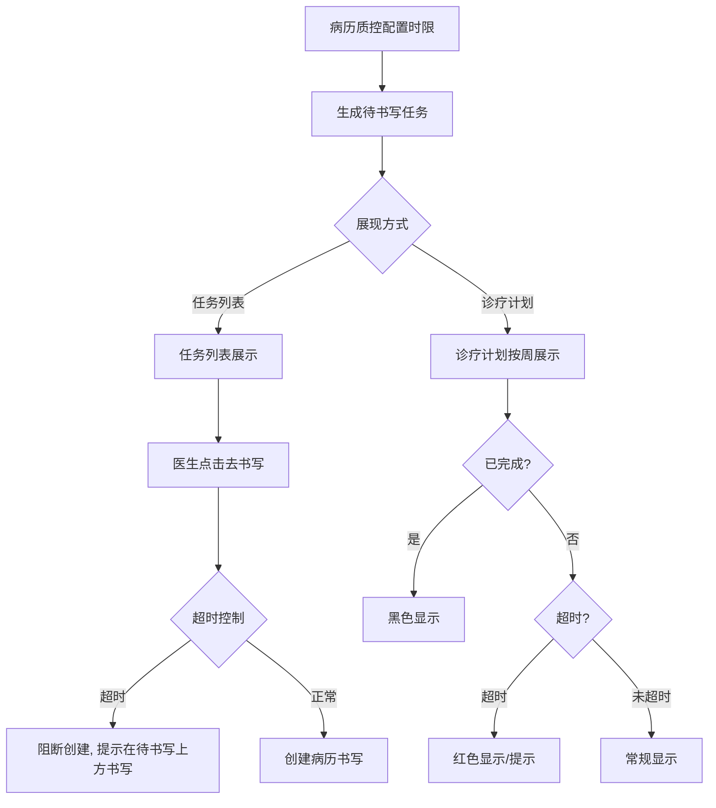
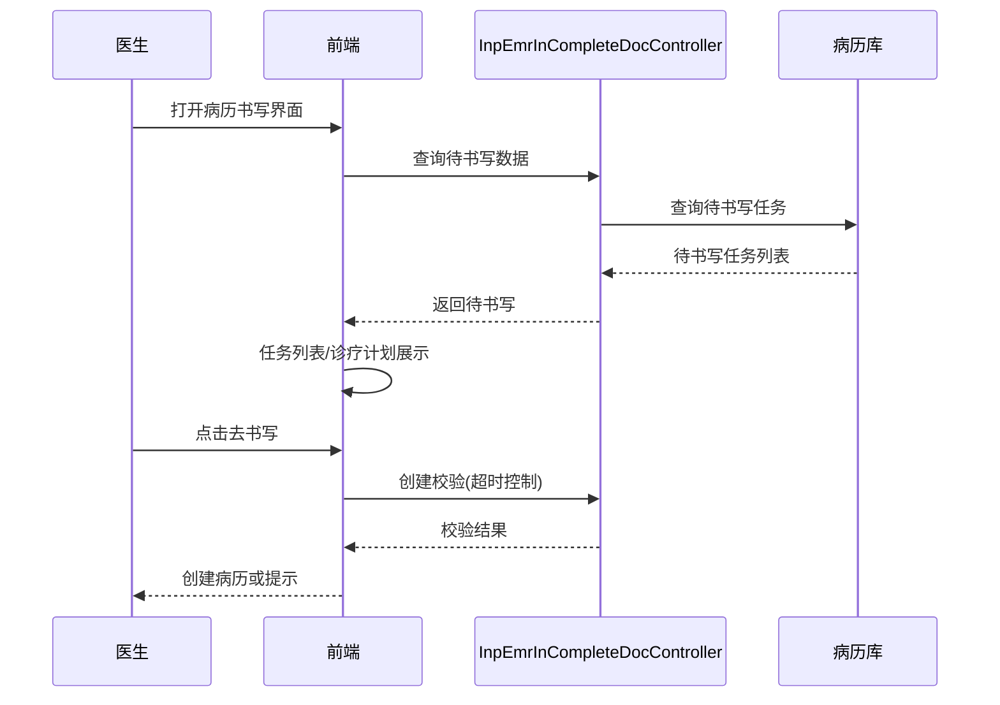

# BLGL-01-BLSX-007_书写任务与时限提醒_Analyst-Spec

> **需求编号**：BLGL-01-BLSX-007
> **父需求**：BLGL-01-BLSX
> **关联PM Spec**：BLGL-01-BLSX-007_书写任务与时限提醒_PM-spec.md
> **Spec版本**：V1.0
> **编写时间**：2026-08-15
> **编写人**：需求分析师

---

## 一、功能编号体系

### 1.1 功能层级结构

```
BLGL-01-BLSX-007-001: 书写任务展示
  ├─ BLGL-01-BLSX-007-001-01: 任务列表展现
  ├─ BLGL-01-BLSX-007-001-02: 诊疗计划展现
  └─ BLGL-01-BLSX-007-001-03: 书写任务提醒

BLGL-01-BLSX-007-002: 诊疗计划
  ├─ BLGL-01-BLSX-007-002-01: 按周查看
  ├─ BLGL-01-BLSX-007-002-02: 已完成/未完成状态
  └─ BLGL-01-BLSX-007-002-03: 诊疗计划显示开关

BLGL-01-BLSX-007-003: 待书写控制
  ├─ BLGL-01-BLSX-007-003-01: 超时控制（不允许直接创建）
  ├─ BLGL-01-BLSX-007-003-02: 待书写任务准确性
  ├─ BLGL-01-BLSX-007-003-03: 床位卡提醒
  └─ BLGL-01-BLSX-007-003-04: 超时时间按文书时间更新

BLGL-01-BLSX-007-004: 时限计算
  ├─ BLGL-01-BLSX-007-004-01: 首次提交时间
  ├─ BLGL-01-BLSX-007-004-02: 提交时间
  └─ BLGL-01-BLSX-007-004-03: 创建时间
```

### 1.2 功能编号表

| REQ-ID | 功能名称 | 类型 | 优先级 | 说明 |
|--------|---------|------|--------|------|
| BLGL-01-BLSX-007-001 | 书写任务展示 | 功能 | P0 | 根据质控时限生成待书写任务，任务列表/诊疗计划展现 |
| BLGL-01-BLSX-007-001-01 | 任务列表展现 | 子功能 | P0 | 任务列表展示待书写 |
| BLGL-01-BLSX-007-001-02 | 诊疗计划展现 | 子功能 | P0 | 诊疗计划方式展示 |
| BLGL-01-BLSX-007-001-03 | 书写任务提醒 | 子功能 | P0 | 提示按时完成病历 |
| BLGL-01-BLSX-007-002 | 诊疗计划 | 功能 | P1 | 按周查看，已完成黑色未完成红色 |
| BLGL-01-BLSX-007-002-01 | 按周查看 | 子功能 | P1 | 按住院天数计算周数 |
| BLGL-01-BLSX-007-002-02 | 已完成/未完成状态 | 子功能 | P1 | 已完成黑色，未完成红色 |
| BLGL-01-BLSX-007-002-03 | 诊疗计划显示开关 | 子功能 | P1 | 默认显示诊疗计划或最后一次记录 |
| BLGL-01-BLSX-007-003 | 待书写控制 | 功能 | P0 | 超时控制/任务准确性/床位卡提醒 |
| BLGL-01-BLSX-007-003-01 | 超时控制 | 子功能 | P0 | 超时限病历不允许直接创建 |
| BLGL-01-BLSX-007-003-02 | 待书写任务准确性 | 子功能 | P1 | 已书写文书不提示待书写 |
| BLGL-01-BLSX-007-003-03 | 床位卡提醒 | 子功能 | P1 | 床位卡界面提醒 |
| BLGL-01-BLSX-007-003-04 | 超时时间按文书时间更新 | 子功能 | P1 | 抢救/手术/输血超时时间更新 |
| BLGL-01-BLSX-007-004 | 时限计算 | 功能 | P1 | 首次提交/提交/创建时间 |
| BLGL-01-BLSX-007-004-01 | 首次提交时间 | 子功能 | P1 | 记录第一次提交时间，不再更新 |
| BLGL-01-BLSX-007-004-02 | 提交时间 | 子功能 | P1 | 记录最新提交时间 |
| BLGL-01-BLSX-007-004-03 | 创建时间 | 子功能 | P1 | 记录文书创建时间 |

---

## 二、核心业务流程

### 2.1 书写任务主流程



### 2.2 书写任务时序



---

## 三、功能规格说明


### BLGL-01-BLSX-007-001: 书写任务展示

#### 3.1.1 功能概述

根据病历质控的时限要求生成病历待书写任务，支持任务列表和诊疗计划两种展现方式，提示医生按时完成病历。

#### 3.1.2 用户角色

| 角色 | 使用场景 | 权限要求 | 操作频率 |
|------|---------|---------|---------|
| 住院医师 | 查看待书写任务/提醒 | 病历书写权限 | 高频 |

#### 3.1.3 业务流程（Given/When/Then）

##### 主流程

**Scenario 1: 待书写任务展示**

```gherkin
Given:
- 病历质控已配置时限要求

When:
- 医生打开病历书写界面

Then:
- 生成病历待书写任务
- 支持任务列表和诊疗计划两种展现方式
```

##### 异常流程

**Scenario 2: 业务异常——待书写任务不显示**

```gherkin
Given:
- 已创建出院小结

When:
- 医生查看待书写

Then:
- 不提示出院小结待书写
```

**Scenario 3: 数据异常——待书写已书写仍提示**

```gherkin
Given:
- 已书写术前小结

When:
- 医生查看待书写

Then:
- 不提示存在待书写任务
```

**Scenario 4: 系统异常——待书写查询接口异常**

```gherkin
Given:
- 待书写查询接口异常

When:
- 医生打开待书写列表

Then:
- 待书写任务不展示，提示可重试
```

##### 边界流程

**Scenario 5: 边界——床位卡提醒**

```gherkin
Given:
- 住院病历待书写任务

When:
- 医生查看床位卡界面

Then:
- 床位卡界面展示待书写任务提醒
```

**Scenario 6: 边界——书写提醒**

```gherkin
Given:
- 存在待书写任务

When:
- 医生查看提醒

Then:
- 提示医生按照病历时限要求完成病历
```

#### 3.1.5 验收标准

| AC编号 | 验收标准 | 对应REQ-ID | 验证方法 | 验证场景 |
|--------|---------|-----------|---------|---------|
| AC-001 | 打开病历书写界面生成待书写任务 | BLGL-01-BLSX-007-001 | 功能测试 | Scenario 1 |
| AC-002 | 已书写文书不提示待书写任务 | BLGL-01-BLSX-007-001 | 功能测试 | Scenario 2/3 |
| AC-003 | 床位卡界面展示待书写提醒 | BLGL-01-BLSX-007-001 | 功能测试 | Scenario 5 |


### BLGL-01-BLSX-007-002: 诊疗计划

#### 3.2.1 功能概述

按周/起始时间查看患者每天应书写记录，默认显示本周内需要完成和已完成的书写文书（已完成黑色、未完成红色）。

#### 3.2.2 用户角色

| 角色 | 使用场景 | 权限要求 | 操作频率 |
|------|---------|---------|---------|
| 住院医师 | 诊疗计划查看 | 病历书写权限 | 高频 |

#### 3.2.3 业务流程（Given/When/Then）

##### 主流程

**Scenario 1: 诊疗计划查看**

```gherkin
Given:
- 参数"是否显示诊疗计划"已开启

When:
- 医生点击诊疗计划目录区域

Then:
- 打开诊疗计划
- 按周查看患者每天应书写记录
- 已完成黑色，未完成红色
```

##### 异常流程

**Scenario 2: 业务异常——诊疗计划显示开关关闭**

```gherkin
Given:
- 参数"是否显示诊疗计划"默认停用

When:
- 医生打开病历

Then:
- 不显示诊疗计划
```

**Scenario 3: 数据异常——周数计算**

```gherkin
Given:
- 住院天数与周期天数

When:
- 计算住院周数

Then:
- 住院天数/周期天数=周数，不满一周按一周算
- 例：住院25天，周期7天，周数25/7+1=4周
```

##### 边界流程

**Scenario 4: 边界——默认显示设置**

```gherkin
Given:
- 参数"加载病历时默认显示诊疗计划或最后一次记录"

When:
- 医生加载病历

Then:
- 默认显示诊疗计划（0）或最后一次记录（1）
```

**Scenario 5: 边界——展开诊疗计划隐藏辅助栏**

```gherkin
Given:
- 诊疗计划展开

When:
- 医生查看诊疗计划

Then:
- 左侧辅助栏隐藏
```

#### 3.2.5 验收标准

| AC编号 | 验收标准 | 对应REQ-ID | 验证方法 | 验证场景 |
|--------|---------|-----------|---------|---------|
| AC-001 | 诊疗计划按周展示，已完成黑色未完成红色 | BLGL-01-BLSX-007-002 | 功能测试 | Scenario 1 |
| AC-002 | 周数按住院天数/周期天数计算，不满一周按一周 | BLGL-01-BLSX-007-002 | 功能测试 | Scenario 3 |
| AC-003 | 默认显示诊疗计划或最后一次记录可配置 | BLGL-01-BLSX-007-002 | 功能测试 | Scenario 4 |


### BLGL-01-BLSX-007-003: 待书写控制

#### 3.3.1 功能概述

超时控制（不允许直接创建）、待书写任务准确性、床位卡提醒、超时时间按文书时间更新。

#### 3.3.2 用户角色

| 角色 | 使用场景 | 权限要求 | 操作频率 |
|------|---------|---------|---------|
| 住院医师 | 待书写-去书写 | 病历书写权限 | 高频 |

#### 3.3.3 业务流程（Given/When/Then）

##### 主流程

**Scenario 1: 超时控制**

```gherkin
Given:
- 病历超时限需要控制

When:
- 医生点击待书写-去书写

Then:
- 病历创建接口判断病历限制，不允许直接创建
- 弹出提示（同点击新增时的提示）
```

##### 异常流程

**Scenario 2: 业务异常——超时拦截创建接口**

```gherkin
Given:
- 病历超时限制逻辑只拦截了目录树接口

When:
- 医生点击待书写直接创建

Then:
- 需同时拦截病历创建接口
```

**Scenario 3: 数据异常——超时时间不更新**

```gherkin
Given:
- 抢救/手术/输血文书时间变化

When:
- 文书时间更新

Then:
- 按文书时间更新抢救、手术、输血超时时间
```

##### 边界流程

**Scenario 4: 边界——记录时间可修改**

```gherkin
Given:
- 参数"支持修改病历时间的病历分类"控制记录时间可修改

When:
- 医生点击去书写

Then:
- 弹出记录时间修改界面
```

**Scenario 5: 边界——床位卡提醒**

```gherkin
Given:
- 待书写任务存在

When:
- 医生查看床位卡

Then:
- 床位卡界面展示待书写提醒
```

#### 3.3.5 验收标准

| AC编号 | 验收标准 | 对应REQ-ID | 验证方法 | 验证场景 |
|--------|---------|-----------|---------|---------|
| AC-001 | 超时限病历不允许直接创建，弹出提示 | BLGL-01-BLSX-007-003 | 功能测试 | Scenario 1 |
| AC-002 | 超时时间按文书时间更新 | BLGL-01-BLSX-007-003 | 功能测试 | Scenario 3 |


### BLGL-01-BLSX-007-004: 时限计算

#### 3.4.1 功能概述

病历簿新增首次提交时间/提交时间/创建时间字段，用于质控时限计算。

#### 3.4.2 用户角色

| 角色 | 使用场景 | 权限要求 | 操作频率 |
|------|---------|---------|---------|
| 系统 | 自动记录时间 | - | 自动 |

#### 3.4.3 业务流程（Given/When/Then）

##### 主流程

**Scenario 1: 记录时限字段**

```gherkin
Given:
- 病历首次提交

When:
- 提交成功

Then:
- 记录首次提交时间（精确到秒，不再更新）
- 记录提交时间（最新）
- 记录创建时间
```

##### 异常流程

**Scenario 2: 业务异常——审签驳回不更新**

```gherkin
Given:
- 病历被审签驳回或撤销提交

When:
- 状态变化

Then:
- 提交时间字段无需更新
```

**Scenario 3: 数据异常——文书删除**

```gherkin
Given:
- 文书删除

When:
- 删除文书

Then:
- 同步删除当前文书关联的字段内容数据
```

##### 边界流程

**Scenario 4: 边界——多次提交**

```gherkin
Given:
- 病历多次提交

When:
- 每次提交成功

Then:
- 首次提交时间保持不变
- 提交时间更新为最新一次
```

#### 3.4.5 验收标准

| AC编号 | 验收标准 | 对应REQ-ID | 验证方法 | 验证场景 |
|--------|---------|-----------|---------|---------|
| AC-001 | 病历提交后记录首次提交/提交/创建时间（精确到秒） | BLGL-01-BLSX-007-004 | 功能测试 | Scenario 1 |
| AC-002 | 审签驳回/撤销提交时提交时间不更新 | BLGL-01-BLSX-007-004 | 功能测试 | Scenario 2 |


---

## 四、排除范围

本需求不包含以下功能项：

1. **病历创建与模板管理 —— BLGL-01-BLSX-001**
2. **病历编辑与保存 —— BLGL-01-BLSX-002**
3. **病历签署/提交/审签 —— BLGL-01-BLSX-003/004/005**
4. **手术记录 —— BLGL-01-BLSX-006**
5. **诊疗计划与评估表（评估表创建触发待书写）—— BLGL-01-BLSX-011**

---

## 五、业务规则清单

| 规则ID | 规则名称 | 规则描述 | 来源 | 优先级 |
|--------|---------|---------|------|--------|
| BR-001 | 待书写任务生成 | 根据病历质控的时限要求生成病历待书写任务，支持任务列表和诊疗计划两种展现方式 | 功能清单 | P0 |
| BR-002 | 书写提醒 | 提示医生按照病历时限要求完成病历 | 功能清单 | P0 |
| BR-003 | 超时控制 | 超过时限需要控制的病历不可直接创建，需在"待书写"上方进行书写 | 需求 | P0 |
| BR-004 | 诊疗计划周数 | 住院天数/周期天数=周数，不满一周按一周算 | 需求 | P1 |
| BR-005 | 诊疗计划颜色 | 已完成黑色，未完成红色 | 需求 | P1 |
| BR-006 | 诊疗计划开关 | 加载病历时默认显示诊疗计划（0）或最后一次记录（1） | 需求 | P1 |
| BR-007 | 首次提交时间 | 首次提交时间记录第一次提交时间，精确到秒，不再更新；文书删除时同步删除 | 需求 | P1 |
| BR-008 | 超时时间更新 | 按照文书时间更新抢救、手术、输血超时时间 | 需求 | P1 |

---

## 六、关联文档

| 文档类型 | 文档路径 | 说明 |
|---------|---------|------|
| 功能点Spec | BLGL-01-BLSX 01病历书写功能点Spec.md（V1.0，上级目录） | Phase 1 功能点索引 |
| PM-Spec | 本目录 BLGL-01-BLSX-007_书写任务与时限提醒_PM-spec.md（V0.1） | PM-Spec（业务视角） |
| Analyst-Spec | 本目录 BLGL-01-BLSX-007_书写任务与时限提醒_Analyst-spec.md（V1.0） | Analyst-Spec（产品视角）（本文档） |
| Spec | 本目录 BLGL-01-BLSX-007_书写任务与时限提醒-Spec.md（V1.0） | Spec（研发视角） |
| data-model.md | 待产出 | 架构师产出的数据建模文档 |
| design.md | 待产出 | 架构师产出的技术方案文档 |
| api-contract.md | 待产出 | 开发经理产出的 API 契约文档 |

---

## 七、待确认问题清单

| 编号 | 问题描述 | 缺失信息 | 影响范围 | 建议补充方 |
|------|---------|---------|---------|-----------|
| Q-001 | 待书写接口完整入参/出参字段结构 | API 契约文档 | -Spec 第5章、Analyst-Spec 数据字段（概念ID） | 开发经理 |
| Q-002 | 待书写/诊疗计划相关参数编码 | 参数配置说明表 | 数据模型 4.3 | 产品经理 |
| Q-003 | 性能指标（待书写列表加载） | 非功能性需求 | -Spec 第8章 | 需求分析师 |
| Q-004 | 质控时限规则的具体阈值/周期配置 | 质控规则文档 | 时限计算场景 | 质控办 |
| Q-005 | 待书写任务生成的触发源完整清单 | 设计文档 | 待书写任务场景 | 架构师 |

---

## 填写检查清单

| 序号 | 检查项 | 是否完成 |
|:----:|--------|:--------:|
| 1 | 功能编号带父子层级 | ✅ |
| 2 | 每个 REQ-ID 有功能概述和用户角色 | ✅ |
| 3 | 主流程至少 1 个 Given/When/Then 场景 | ✅ |
| 4 | 异常流程至少 3 个 Given/When/Then 场景 | ✅ |
| 5 | 边界流程至少 2 个 Given/When/Then 场景 | ✅ |
| 6 | 每个 Given/When/Then 内容具体，不模糊 | ✅ |
| 7 | 数据字段定义完整（字段名、类型、必填、说明、概念ID） | N/A |
| 8 | 验收标准 AC 编号独立，可验证 | ✅ |
| 9 | 验收标准无"功能正常"等模糊表述 | ✅ |
| 10 | 排除范围明确列出 | ✅ |
| 11 | 业务规则清单列出所有规则，每条标注来源 | ✅ |
| 12 | 流程图使用 Mermaid 格式（≥2 个） | ✅ |
| 13 | 关联文档索引包含 Phase 1 功能点Spec | ✅ |
| 14 | 待确认问题清单汇总了全文所有 ⏳ 项 | ✅ |
| 15 | 全文无占位符 `< >` 残留 | ✅ |
| 16 | 全文陈述可溯源至资料区（S1~S10 溯源核查） | ✅ |
| 17 | 人工审核确认完成 | ⏳ 待确认 |

---

**文档状态**：⬜ 待审核
**维护责任**：需求分析师规范组
**下次更新**：根据评审反馈优化

---

## 版本历史

| 版本 | 日期 | 变更说明 | 编写人 |
|------|------|---------|--------|
| V1.0 | 2026-08-15 | 初始版本 | 需求分析师 |