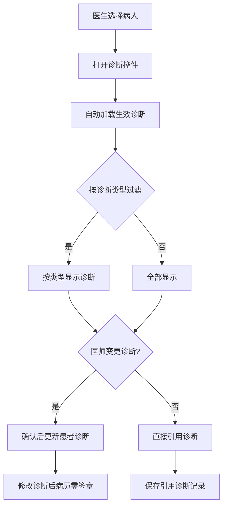
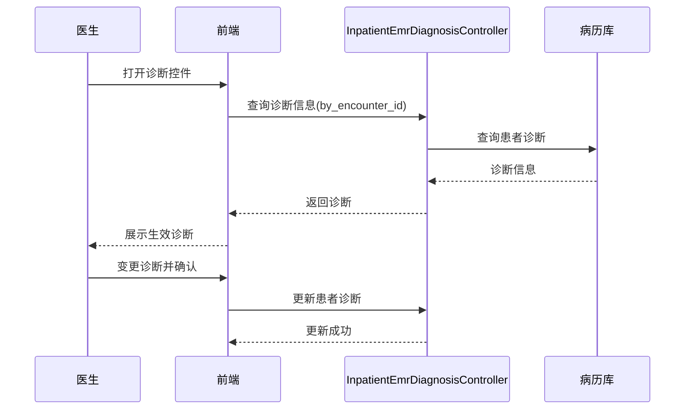

# BLGL-01-BLSX-008 诊断管理 - Spec

> **功能编号**：BLGL-01-BLSX-008
> **文档类型**：功能Spec（业务背景与设计）
> **文档版本**：V1.0
> **编写时间**：2026-08-15
> **编写人**：RACC

---

## 文档索引

#### 章节索引

**PM-Spec（业务视角）**

| 章节号 | 章节名称 | 内容说明 |
|--------|---------|---------|
| 一 | 目标 | 功能定位与核心价值 |
| 二 | 约束 | 业务/技术/非功能性约束 |
| 三 | 验收标准 | 验收条件与验证方法 |
| 四 | 排除范围 | 本次不做项与明确边界 |
| 五 | 关键决策记录 | 方案决策与选型理由 |
| 六 | 优先级 | 优先级定义 |
| 七 | 关联文档 | 关联文档索引 |
| 附录 | 填写检查清单 | 质量检查 |

**Analyst-Spec（产品视角）**

| 章节号 | 章节名称 | 内容说明 |
|--------|---------|---------|
| 一 | 功能编号体系 | 功能编号与层级结构 |
| 二 | 核心业务流程 | 核心业务流程与时序 |
| 三 | 功能规格说明 | 详细功能规格与验收标准 |
| 四 | 排除范围 | 排除范围 |
| 五 | 业务规则清单 | 业务规则清单 |
| 六 | 关联文档 | 关联文档索引 |
| 七 | 待确认问题清单 | 待确认问题汇总 |
| - | 填写检查清单 | 质量检查 |
**Spec（研发视角）**

| 章节号 | 章节名称 | 内容说明 |
|--------|---------|---------|
| 1、 | 文档概述 | 文档目的、文档范围、术语定义、阅读指南、参考文档 |
| 2、 | 功能背景与定位 | 功能背景、功能定位、目标用户、核心价值 |
| 3、 | 业务流程设计 | 主流程/异常流程/边界流程（Given/When/Then） |
| 4、 | 数据模型设计 | 核心数据结构、状态定义、系统参数定义 |
| 5、 | 接口契约设计 | API列表、接口详细设计、错误码定义 |
| 6、 | 技术方案设计 | 页面路径、技术栈、关键技术点、部署方案 |
| 7、 | 测试用例预设计 | 功能/边界/异常/性能测试用例 |
| 8、 | 非功能性要求 | 性能、安全、可用性、兼容性 |
| 9、 | 依赖与风险 | 外部依赖、风险项 |
| 10、 | 附录 | 流程图、时序图、参考文档 |

**PM-Spec（业务视角）**

| 章节号 | 章节名称 | 内容说明 |
|--------|---------|---------|
| 一 | 目标 | 功能定位与核心价值 |
| 二 | 约束 | 业务/技术/非功能性约束 |
| 三 | 验收标准 | 验收条件与验证方法 |
| 四 | 排除范围 | 本次不做项与明确边界 |
| 五 | 关键决策记录 | 方案决策与选型理由 |
| 六 | 优先级 | 优先级定义 |
| 七 | 关联文档 | 关联文档索引 |
| 附录 | 填写检查清单 | 质量检查 |

**Analyst-Spec（产品视角）**

| 章节号 | 章节名称 | 内容说明 |
|--------|---------|---------|
| 一 | 功能编号体系 | 功能编号与层级结构 |
| 二 | 核心业务流程 | 核心业务流程与时序 |
| 三 | 功能规格说明 | 详细功能规格与验收标准 |
| 四 | 排除范围 | 排除范围 |
| 五 | 业务规则清单 | 业务规则清单 |
| 六 | 关联文档 | 关联文档索引 |
| 七 | 待确认问题清单 | 待确认问题汇总 |
| - | 填写检查清单 | 质量检查 |

#### 版本历史

| 版本 | 日期 | 变更说明 | 编写人 |
|------|------|---------|--------|
| V1.0 | 2026-08-15 | 初始版本 | RACC |

#### 关联文档索引

| 序号 | 文档名称 | 文档类型 | 版本 | 位置 |
|------|---------|---------|------|------|
| 1 | BLGL-01-BLSX-008_诊断管理_PM-Spec.md | PM-Spec（业务视角） | V0.1 | 本目录 |
| 2 | BLGL-01-BLSX-008_诊断管理_Analyst-Spec.md | Analyst-Spec（产品视角） | V1.0 | 本目录 |
| 3 | BLGL-01-BLSX-008_诊断管理-Spec.md | Spec（研发视角）（本文档） | V1.0 | 本目录 |
| 4 | BLGL-01-BLSX 01病历书写功能点Spec.md | 功能点Spec（模块级） | V1.0 | 上级目录 |

---

## 1、文档概述

### 1.1、文档目的

本文档旨在明确"诊断管理"功能（BLGL-01-BLSX-008）的业务背景与设计方案，为需求分析、研发实现、测试验收及评审提供统一的业务上下文、设计口径与决策依据。

### 1.2、文档范围

#### 1.2.1 纳入范围

本文档覆盖诊断管理的完整业务背景与设计，包括：

- 自动加载诊断：根据选择的病人获取这些病人生效的诊断信息，支持过滤（诊断类型）
- 主动添加诊断：医师在诊断控件上变更诊断信息，确认后更新患者诊断的诊断信息
- 引用诊断：保存病历引用诊断类型记录、保存引用诊断（全部文书）
- 子诊断展示：病历文书中展示子诊断
- 诊断提醒：查询病历引用诊断是否发生变化（诊断提醒）
- 按职称显示诊断：根据职称集合控制诊断标题显示

#### 1.2.2 排除范围

本文档不涉及以下内容（详见其他功能点或模块）：

- 病历编辑与保存 —— BLGL-01-BLSX-002
- 病历创建与模板管理（病种模板按诊断自动生成）—— BLGL-01-BLSX-001
- 病历数据引用（诊断信息引用面板）—— BLGL-01-BLSX-009
- 手术记录（手术前诊断自动带入）—— BLGL-01-BLSX-006

### 1.3、术语定义

| 术语 | 定义 |
|------|------|
| 自动加载诊断 | 根据选择的病人获取这些病人生效的诊断信息，支持过滤，过滤条件包括诊断类型 |
| 主动添加诊断 | 医师在诊断控件上变更诊断信息，确认后更新患者诊断的诊断信息 |
| 引用诊断 | 病历中引用患者诊断信息，保存引用诊断类型记录 |
| 子诊断 | 病历文书中展示的子诊断 |

### 1.4、阅读指南

- **章节关系**：第1~2章为业务全貌，第3~10章为设计实现层。与 Analyst-Spec、PM-Spec 互相引用保持一致。
- **读者对象**：产品经理/需求分析师读第1~2章；研发读第3~6、9~10章；测试读第3、7~8章；评审人员核对各层一致性。

### 1.5、参考文档

| 序号 | 文档名称 | 版本/日期 |
|------|---------|----------|
| 1 | 【历史需求】住院病历的历史需求.xlsx | - |
| 2 | BLGL-01-BLSX-008_诊断管理_PM-spec.md | V0.1 |
| 3 | BLGL-01-BLSX-008_诊断管理_Analyst-spec.md | V1.0 |
| 4 | BLGL-01-BLSX 01病历书写功能点Spec.md | V1.0 |
| 5 | 病历书写_功能清单_20260327_151500.md | 2026-03-27 |

---

## 2、功能背景与定位

### 2.1 功能背景

诊断管理是病历书写中诊断信息加载与引用的功能，需满足：

- **现状痛点**：诊断信息需手工录入、诊断与病历引用无联动、子诊断无法展示
- **管理要求**：根据患者生效诊断自动加载，医师可主动添加/变更诊断
- **历史需求演进**：从自动加载诊断/主动添加诊断 → 子诊断展示 → 按职称显示诊断 → 诊断引用保存/诊断提醒

### 2.2 功能定位

"诊断管理"是 WiNEX 病历管理-病历书写的诊断加载功能点，定位为：

- **诊断加载**：根据患者生效诊断自动加载，按诊断类型过滤
- **诊断变更**：医师主动添加/变更诊断，确认后更新
- **诊断引用**：病历引用诊断类型记录保存/诊断提醒

### 2.3 目标用户

| 用户角色 | 主要使用场景 |
|---------|-------------|
| 住院医师 | 自动加载诊断/主动添加诊断/引用诊断 |
| 上级医师 | 入院诊断（按职称显示） |

### 2.4 核心价值

| 价值维度 | 价值描述 |
|---------|---------|
| 录入效率 | 自动加载生效诊断，减少手工录入 |
| 诊断准确 | 引用诊断与患者诊断联动，诊断提醒 |
| 权限精细 | 按职称显示诊断 |

---

## 3、业务流程设计（Given/When/Then）

### 3.1 主流程

**Scenario 1: 自动加载诊断**

```gherkin
Given:
- 医生已选择病人

When:
- 医生在诊断控件打开

Then:
- 系统获取该病人生效的诊断信息
- 支持按诊断类型过滤
- 在对应的诊断类型上显示诊断信息
```

**Scenario 2: 主动添加诊断**

```gherkin
Given:
- 医生打开诊断控件

When:
- 医师变更诊断信息并确认

Then:
- 更新患者诊断的诊断信息
```

### 3.2 异常流程

**Scenario 3: 业务异常——修改诊断后病历需签章**

```gherkin
Given:
- 医师修改了诊断

When:
- 修改诊断后

Then:
- 诊断所在的病历需签章
```

**Scenario 4: 数据异常——诊断引用发生变化**

```gherkin
Given:
- 病历引用诊断

When:
- 患者诊断发生变化

Then:
- 系统查询病历引用诊断是否发生变化（诊断提醒）
```

**Scenario 5: 系统异常——诊断查询接口异常**

```gherkin
Given:
- 诊断查询接口异常

When:
- 医生打开诊断控件

Then:
- 诊断信息不加载，提示可重试
```

### 3.3 边界流程

**Scenario 6: 边界——子诊断展示**

```gherkin
Given:
- 病历文书含子诊断

When:
- 医生查看病历文书

Then:
- 展示病历文书中子诊断
```

**Scenario 7: 边界——按职称显示诊断**

```gherkin
Given:
- 入院记录入院诊断标题职称集合设置了主治、副主任、主任

When:
- 住院医生创建病历

Then:
- 住院医生不能看到入院诊断以及入院诊断标题后的内容
```

---

## 4、数据模型设计

### 4.1 核心数据结构

#### 4.1.1 核心查询入参（查询诊断信息）

| 字段名 | 类型 | 必填 | 备注 |
|--------|------|------|------|
| encounterId | Long | 是 | 就诊标识 |
| 诊断类型 | String | 否 | 诊断类型过滤 |

#### 4.1.2 核心表/实体

| 表/实体 | 关键字段 | 说明 |
|---------|---------|------|
| 患者诊断数据 | 诊断类型、诊断信息、生效状态 | 患者诊断信息 |
| 病历引用诊断记录 | 病历ID、诊断类型、引用状态 | 病历引用诊断类型记录 |
| INP_EMR_DIAGNOSIS_SIGNATURE（InpEmrDiagnosisTypePO） | 诊断签名相关字段 | 诊断签名记录 |

### 4.2 状态定义

| 状态码 | 状态名称 | 说明 |
|--------|---------|------|
| 生效 | 诊断生效 | 自动加载生效诊断 |
| 引用 | 病历引用 | 病历引用诊断 |

### 4.3 系统参数定义

| 参数编码 | 参数名称 | 说明 |
|---------|---------|------|
| 待确认 | 诊断样式配置 | 查询诊断样式配置 |
| 待确认 | 诊断权限配置 | 查询诊断权限配置 |
| 待确认 | 诊断取值配置 | 查询诊断取值配置 |
| 待确认 | 支持调用特殊病种信息的监控类型 | 配置支持调用特殊病种信息的监控类型 |

---

## 5、接口契约设计

### 5.1 API列表

| 序号 | API名称（代码函数） | 路径 | 方法 | 说明 |
|:----:|---------|------|:----:|------|
| 1 | queryInpatientEmrDiagnosis | /api/v1/app_record_inpatient/emr_inpatient_diagnosis/query/by_encounter_id | POST | 根据就诊标识查询诊断信息 |
| 2 | saveQuoteDiagnosisRecord | /api/v1/app_record_inpatient/emr_inpatient/set/quote_diagnosis_record/save_all | POST | 保存病历引用诊断类型记录 |
| 3 | queryQuoteDiagnosisChange | 查询病历引用诊断是否发生变化（诊断提醒） | POST | 诊断提醒 |
| 4 | queryConfirmDiagnosis | 根据就诊标识查询患者确定诊断 | POST | 确定诊断 |
| 5 | queryClinicalDiagnosis | 根据就诊标识查询临床诊断信息 | POST | 临床诊断 |
| 6 | saveQuoteDiagnosisAll | 保存引用诊断（全部文书） | POST | 全部文书引用诊断 |

### 5.2 接口详细设计

#### 5.2.1 查询诊断信息

**请求参数**:
```json
{
  "encounterId": "就诊标识",
  "诊断类型": "诊断类型过滤（可选）"
}
```

**返回值（成功）**:
```json
{
  "success": true,
  "data": [
    {
      "诊断类型": "入院诊断",
      "诊断信息": "诊断内容"
    }
  ]
}
```

**返回值（失败）**:
```json
{
  "success": false,
  "message": "<错误信息>",
  "data": null
}
```

### 5.3 错误码定义

| 错误码 | 错误信息 | 处理方式 |
|--------|---------|---------|
| 待确认 | 修改诊断后病历需签章 | 提示签章 |
| 待确认 | 诊断引用发生变化 | 诊断提醒 |
| 待确认 | 职称权限不足 | 不显示诊断标题 |

---

## 6、技术方案设计

### 6.1 页面路径

- **页面路径**: 住院医生站→住院病历书写界面→诊断控件（InpatientEmrDiagnosisController）
- **组件**：EmrEditor/components/BaseEditor（诊断控件）、诊断引用面板（AuxiliaryOnDiagnosisInfo）
- **核心逻辑模块**: InpatientEmrDiagnosisController（winning-emr-ipt-diagnosis，tags: 业务态：住院病历业务诊断接口）

### 6.2 技术栈

| 类别 | 技术 | 版本 |
|------|------|------|
| 前端框架 | Vue | 2.6.14 |
| 前端UI | element-ui | 2.13.0 |
| 后端框架 | Spring Boot（Java） | 17 |

### 6.3 关键技术点

- 诊断加载/变更走 InpatientEmrDiagnosisController
- 诊断引用保存走 quote_diagnosis_record/save_all
- 按职称显示诊断：标题属性职称集合，空即未设置

### 6.4 部署方案

⏳ 待确认：部署方案未在资料区中找到。

---

## 7、测试用例预设计

### 7.1 功能测试

| 用例编号 | 测试场景 | Given | When | Then |
|---------|---------|-------|------|------|
| TC-001 | 自动加载诊断 | 医生选择病人 | 打开诊断控件 | 加载生效诊断，按类型过滤 |
| TC-002 | 主动添加诊断 | 医生打开诊断控件 | 变更诊断并确认 | 更新患者诊断信息 |
| TC-003 | 引用诊断 | 病历引用诊断 | 保存引用诊断类型记录 | 引用记录保存 |

### 7.2 边界测试

| 用例编号 | 测试场景 | Given | When | Then |
|---------|---------|-------|------|------|
| TC-004 | 子诊断展示 | 病历含子诊断 | 查看病历文书 | 展示子诊断 |
| TC-005 | 按职称显示诊断 | 职称集合含主治/副主任/主任 | 住院医创建病历 | 不显示入院诊断标题 |

### 7.3 异常测试

| 用例编号 | 测试场景 | Given | When | Then |
|---------|---------|-------|------|------|
| TC-006 | 修改诊断后需签章 | 医师修改诊断 | 修改后 | 诊断所在病历需签章 |
| TC-007 | 诊断提醒 | 患者诊断变化 | 查询引用诊断 | 提示诊断发生变化 |
| TC-008 | 诊断查询接口异常 | 接口异常 | 打开诊断控件 | 诊断不加载提示重试 |

### 7.4 性能测试

| 用例编号 | 测试场景 | 指标 |
|---------|---------|------|
| TC-009 | 诊断加载响应 | ⏳ 待确认：性能指标未在资料区中找到 |

---

## 8、非功能性要求

### 8.1 性能要求

| 指标 | 要求 |
|------|------|
| 诊断加载响应时间 | ⏳ 待确认 |

### 8.2 安全要求

| 要求 | 说明 |
|------|------|
| 诊断权限 | 按职称显示诊断 |
| 诊断修改签章 | 修改诊断后病历需签章 |

**医疗行业特殊要求**

| 要求 | 说明 |
|------|------|
| 诊断准确性 | 自动加载生效诊断 |
| 诊断签章 | 修改诊断后病历需签章 |

### 8.3 可用性要求

| 指标 | 要求值 |
|------|--------|
| 可用性 | ⏳ 待确认 |

### 8.4 兼容性要求

| 类型 | 要求 |
|------|------|
| 诊断过滤 | 按诊断类型过滤 |

---

## 9、依赖与风险

### 9.1 外部依赖

| 依赖项 | 说明 |
|--------|------|
| 主数据 | 诊断标准/诊断类型 |

### 9.2 风险项

| 风险项 | 等级 | 说明 | 应对方案 |
|--------|------|------|---------|
| 诊断联动 | 中 | 引用诊断与患者诊断联动 | 诊断提醒机制 |
| 职称权限 | 低 | 按职称显示诊断 | 职称集合属性 |

---

## 10、附录

### 10.1 流程图



### 10.2 时序图



### 10.3 参考文档

- 病历书写_功能清单_20260327_151500.md（诊断管理-自动加载诊断/主动添加诊断）
- 【历史需求】住院病历的历史需求.xlsx
- BLGL-01-BLSX 01病历书写功能点Spec.md（V1.0，第5章 BLGL-01-BLSX-008 行）
- 关联Spec：BLGL-01-BLSX-008_诊断管理_PM-spec.md、BLGL-01-BLSX-008_诊断管理_Analyst-spec.md

---

## 填写检查清单

| 序号 | 检查项 | 是否完成 |
|:----:|--------|:--------:|
| 1 | 章节索引与正文章节一致 | ✅ |
| 2 | 版本历史记录完整 | ✅ |
| 3 | 关联文档索引已登记全部Spec | ✅ |
| 4 | 文档目的明确回答"为什么做/做成什么/怎么做" | ✅ |
| 5 | 纳入范围/排除范围清晰 | ✅ |
| 6 | 术语定义覆盖关键概念，从资料区可溯源 | ✅ |
| 7 | 参考文档已登记 | ✅ |
| 8 | 功能背景基于法规/规范/需求来源组织 | ✅ |
| 9 | 功能定位体现业务价值（3~5个定位点） | ✅ |
| 10 | 目标用户角色覆盖完整，在需求原文中有出处 | ✅ |
| 11 | 核心价值可陈述，与 Phase 1 口径一致 | ✅ |
| 12 | 业务流程：主流程≥1、异常≥3、边界≥2，Given/When/Then 具体 | ✅ |
| 13 | 数据模型：字段/表/状态/参数可溯源 | ✅ |
| 14 | 接口契约：API列表+详细设计+错误码齐全或标记待确认 | ✅ |
| 15 | 技术方案：页面路径/技术栈/关键点/部署方案或标记待确认 | ✅ |
| 16 | 测试用例：功能/边界/异常/性能覆盖 | ✅ |
| 17 | 非功能性要求：性能/安全/可用性/兼容性指标可量化或标记待确认 | ✅ |
| 18 | 依赖与风险：外部依赖登记完整 | ✅ |
| 19 | 附录：流程图/时序图与正文流程一致 | ✅ |
| 20 | 全文无占位符 `< >` 残留 | ✅ |
| 21 | 全文陈述可溯源至资料区 | ✅ |
| 22 | 人工审核确认完成 | ⏳ 待确认 |

---

**文档状态**：⬜ 待审核
**维护责任**：RACC
**下次更新**：根据评审反馈优化