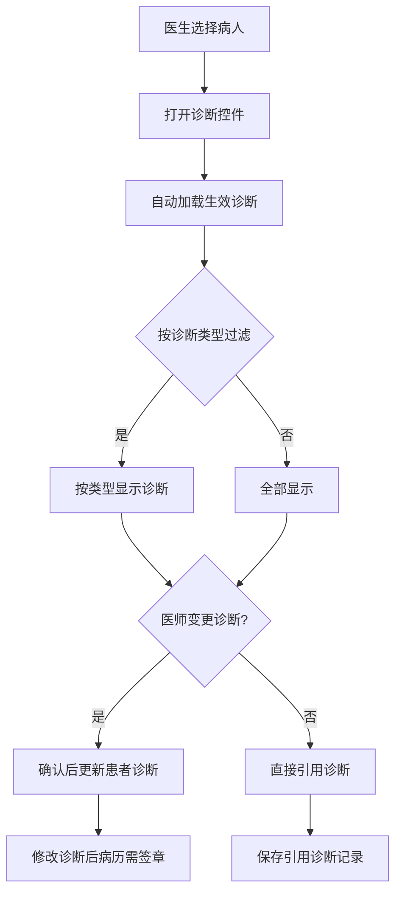
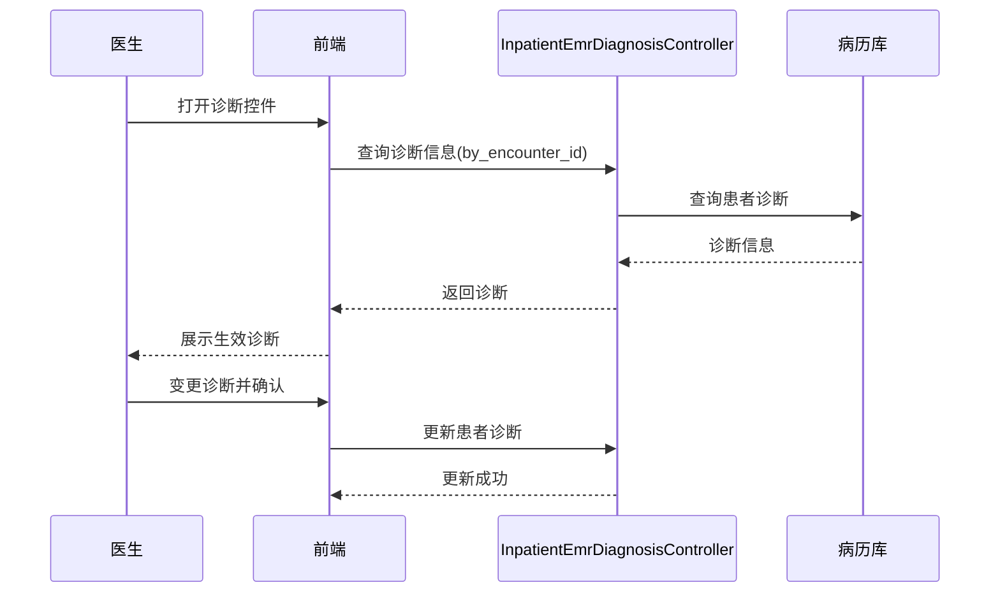

# BLGL-01-BLSX-008 诊断管理 - Analyst-Spec

> **需求编号**：BLGL-01-BLSX-008
> **父需求**：BLGL-01-BLSX
> **关联PM Spec**：BLGL-01-BLSX-008_诊断管理_PM-spec.md
> **Spec版本**：V1.0
> **编写时间**：2026-08-15
> **编写人**：需求分析师

---

## 一、功能编号体系

### 1.1 功能层级结构

```
BLGL-01-BLSX-008-001: 自动加载诊断
  ├─ BLGL-01-BLSX-008-001-01: 加载生效诊断
  └─ BLGL-01-BLSX-008-001-02: 按诊断类型过滤

BLGL-01-BLSX-008-002: 主动添加诊断
  ├─ BLGL-01-BLSX-008-002-01: 变更诊断并确认
  └─ BLGL-01-BLSX-008-002-02: 更新患者诊断

BLGL-01-BLSX-008-003: 引用诊断
  ├─ BLGL-01-BLSX-008-003-01: 保存引用诊断记录
  ├─ BLGL-01-BLSX-008-003-02: 引用诊断（全部文书）
  └─ BLGL-01-BLSX-008-003-03: 诊断提醒

BLGL-01-BLSX-008-004: 子诊断展示

BLGL-01-BLSX-008-005: 按职称显示诊断
```

### 1.2 功能编号表

| REQ-ID | 功能名称 | 类型 | 优先级 | 说明 |
|--------|---------|------|--------|------|
| BLGL-01-BLSX-008-001 | 自动加载诊断 | 功能 | P0 | 根据患者生效诊断自动加载，按诊断类型过滤 |
| BLGL-01-BLSX-008-001-01 | 加载生效诊断 | 子功能 | P0 | 获取病人生效诊断信息 |
| BLGL-01-BLSX-008-001-02 | 按诊断类型过滤 | 子功能 | P0 | 按诊断类型过滤显示 |
| BLGL-01-BLSX-008-002 | 主动添加诊断 | 功能 | P0 | 医师变更诊断并确认，更新患者诊断 |
| BLGL-01-BLSX-008-002-01 | 变更诊断并确认 | 子功能 | P0 | 诊断控件变更诊断 |
| BLGL-01-BLSX-008-002-02 | 更新患者诊断 | 子功能 | P0 | 确认后更新患者诊断信息 |
| BLGL-01-BLSX-008-003 | 引用诊断 | 功能 | P1 | 保存引用诊断记录/诊断提醒 |
| BLGL-01-BLSX-008-003-01 | 保存引用诊断记录 | 子功能 | P1 | 保存病历引用诊断类型记录 |
| BLGL-01-BLSX-008-003-02 | 引用诊断（全部文书） | 子功能 | P1 | 保存引用诊断全部文书 |
| BLGL-01-BLSX-008-003-03 | 诊断提醒 | 子功能 | P1 | 引用诊断是否发生变化提醒 |
| BLGL-01-BLSX-008-004 | 子诊断展示 | 功能 | P1 | 病历文书中展示子诊断 |
| BLGL-01-BLSX-008-005 | 按职称显示诊断 | 功能 | P1 | 职称集合控制诊断标题显示 |

---

## 二、核心业务流程

### 2.1 诊断管理主流程



### 2.2 诊断管理时序



---

## 三、功能规格说明


### BLGL-01-BLSX-008-001: 自动加载诊断

#### 3.1.1 功能概述

根据选择的病人获取生效的诊断信息，支持按诊断类型过滤，在对应诊断类型上显示。

#### 3.1.2 用户角色

| 角色 | 使用场景 | 权限要求 | 操作频率 |
|------|---------|---------|---------|
| 住院医师 | 打开诊断控件加载诊断 | 病历书写权限 | 高频 |

#### 3.1.3 业务流程（Given/When/Then）

##### 主流程

**Scenario 1: 自动加载诊断**

```gherkin
Given:
- 医生已选择病人

When:
- 医生打开诊断控件

Then:
- 系统获取该病人生效的诊断信息
- 支持按诊断类型过滤
- 在对应的诊断类型上显示诊断信息
```

##### 异常流程

**Scenario 2: 业务异常——无生效诊断**

```gherkin
Given:
- 患者无生效诊断

When:
- 医生打开诊断控件

Then:
- 诊断列表为空
```

**Scenario 3: 数据异常——诊断类型过滤无结果**

```gherkin
Given:
- 医生选择某诊断类型

When:
- 过滤诊断

Then:
- 该类型无诊断时展示空
```

**Scenario 4: 系统异常——诊断查询接口异常**

```gherkin
Given:
- 诊断查询接口异常

When:
- 医生打开诊断控件

Then:
- 诊断不加载，提示可重试
```

##### 边界流程

**Scenario 5: 边界——多诊断类型**

```gherkin
Given:
- 患者存在多种诊断类型

When:
- 医生查看诊断

Then:
- 按诊断类型分别显示
```

**Scenario 6: 边界——诊断自动填充**

```gherkin
Given:
- 病历创建

When:
- 诊断填充

Then:
- 按诊断取值配置自动填充
```

#### 3.1.5 验收标准

| AC编号 | 验收标准 | 对应REQ-ID | 验证方法 | 验证场景 |
|--------|---------|-----------|---------|---------|
| AC-001 | 自动加载患者生效诊断，按诊断类型过滤显示 | BLGL-01-BLSX-008-001 | 功能测试 | Scenario 1 |
| AC-002 | 无生效诊断时诊断列表为空 | BLGL-01-BLSX-008-001 | 功能测试 | Scenario 2 |


### BLGL-01-BLSX-008-002: 主动添加诊断

#### 3.2.1 功能概述

医师在诊断控件上变更诊断信息，确认后更新患者诊断的诊断信息。

#### 3.2.2 用户角色

| 角色 | 使用场景 | 权限要求 | 操作频率 |
|------|---------|---------|---------|
| 住院医师 | 主动添加/变更诊断 | 病历书写权限 | 中频 |

#### 3.2.3 业务流程（Given/When/Then）

##### 主流程

**Scenario 1: 主动添加诊断**

```gherkin
Given:
- 医生打开诊断控件

When:
- 医师变更诊断信息并确认

Then:
- 更新患者诊断的诊断信息
```

##### 异常流程

**Scenario 2: 业务异常——修改诊断后需签章**

```gherkin
Given:
- 医师修改了诊断

When:
- 修改诊断后

Then:
- 诊断所在的病历需签章
```

##### 异常流程

**Scenario 3: 数据异常——诊断保存失败**

```gherkin
Given:
- 诊断保存接口异常

When:
- 医师确认诊断变更

Then:
- 提示保存失败，可重试
```

##### 边界流程

**Scenario 4: 边界——诊断更新联动**

```gherkin
Given:
- 病历引用诊断

When:
- 患者诊断更新

Then:
- 引用诊断联动更新或提醒
```

#### 3.2.5 验收标准

| AC编号 | 验收标准 | 对应REQ-ID | 验证方法 | 验证场景 |
|--------|---------|-----------|---------|---------|
| AC-001 | 医师变更诊断确认后更新患者诊断信息 | BLGL-01-BLSX-008-002 | 功能测试 | Scenario 1 |
| AC-002 | 修改诊断后病历需签章 | BLGL-01-BLSX-008-002 | 集成测试 | Scenario 2 |


### BLGL-01-BLSX-008-003: 引用诊断

#### 3.3.1 功能概述

保存病历引用诊断类型记录、引用诊断（全部文书）、诊断提醒。

#### 3.3.2 用户角色

| 角色 | 使用场景 | 权限要求 | 操作频率 |
|------|---------|---------|---------|
| 住院医师 | 病历引用诊断 | 病历书写权限 | 中频 |

#### 3.3.3 业务流程（Given/When/Then）

##### 主流程

**Scenario 1: 引用诊断**

```gherkin
Given:
- 病历需引用诊断

When:
- 医师引用诊断并保存

Then:
- 保存病历引用诊断类型记录
```

##### 异常流程

**Scenario 2: 业务异常——引用诊断发生变化**

```gherkin
Given:
- 病历引用诊断

When:
- 患者诊断发生变化

Then:
- 系统查询病历引用诊断是否发生变化（诊断提醒）
```

**Scenario 3: 数据异常——引用保存失败**

```gherkin
Given:
- 引用保存接口异常

When:
- 医师保存引用诊断

Then:
- 提示保存失败，可重试
```

##### 边界流程

**Scenario 4: 边界——引用全部文书**

```gherkin
Given:
- 病历引用诊断

When:
- 医师保存引用诊断（全部文书）

Then:
- 全部文书引用诊断保存
```

#### 3.3.5 验收标准

| AC编号 | 验收标准 | 对应REQ-ID | 验证方法 | 验证场景 |
|--------|---------|-----------|---------|---------|
| AC-001 | 病历引用诊断记录保存成功 | BLGL-01-BLSX-008-003 | 功能测试 | Scenario 1 |
| AC-002 | 患者诊断变化时诊断提醒 | BLGL-01-BLSX-008-003 | 功能测试 | Scenario 2 |


### BLGL-01-BLSX-008-004: 子诊断展示

#### 3.4.1 功能概述

病历文书中展示子诊断。

#### 3.4.2 用户角色

| 角色 | 使用场景 | 权限要求 | 操作频率 |
|------|---------|---------|---------|
| 住院医师 | 查看病历文书子诊断 | 病历查看权限 | 中频 |

#### 3.4.3 业务流程（Given/When/Then）

##### 主流程

**Scenario 1: 子诊断展示**

```gherkin
Given:
- 病历文书含子诊断

When:
- 医生查看病历文书

Then:
- 展示病历文书中子诊断
```

##### 异常流程

**Scenario 2: 数据异常——无子诊断**

```gherkin
Given:
- 病历无子诊断

When:
- 医生查看

Then:
- 不展示子诊断
```

##### 边界流程

**Scenario 3: 边界——子诊断与主诊断**

```gherkin
Given:
- 病历含主诊断和子诊断

When:
- 医生查看

Then:
- 主诊断与子诊断分层展示
```

#### 3.4.5 验收标准

| AC编号 | 验收标准 | 对应REQ-ID | 验证方法 | 验证场景 |
|--------|---------|-----------|---------|---------|
| AC-001 | 病历文书中展示子诊断 | BLGL-01-BLSX-008-004 | 功能测试 | Scenario 1 |


### BLGL-01-BLSX-008-005: 按职称显示诊断

#### 3.5.1 功能概述

根据职称集合控制诊断标题及内容显示。

#### 3.5.2 用户角色

| 角色 | 使用场景 | 权限要求 | 操作频率 |
|------|---------|---------|---------|
| 住院医师 | 创建病历查看诊断标题 | 职称权限 | 高频 |

#### 3.5.3 业务流程（Given/When/Then）

##### 主流程

**Scenario 1: 按职称显示诊断**

```gherkin
Given:
- 入院记录入院诊断标题职称集合设置了主治、副主任、主任

When:
- 住院医生创建病历

Then:
- 住院医生不能看到入院诊断以及入院诊断标题后的内容
```

##### 异常流程

**Scenario 2: 业务异常——职称集合为空**

```gherkin
Given:
- 诊断标题职称集合为空

When:
- 医生创建病历

Then:
- 所有医生均可看到该标题（空即代表未设置该属性）
```

##### 边界流程

**Scenario 3: 边界——职称匹配**

```gherkin
Given:
- 主治医师创建病历

When:
- 职称集合含主治

Then:
- 主治医师可看到入院诊断标题
```

#### 3.5.5 验收标准

| AC编号 | 验收标准 | 对应REQ-ID | 验证方法 | 验证场景 |
|--------|---------|-----------|---------|---------|
| AC-001 | 职称集合设置时仅对应职称医生可见诊断标题 | BLGL-01-BLSX-008-005 | 功能测试 | Scenario 1 |


---

## 四、排除范围

本需求不包含以下功能项：

1. **病历编辑与保存 —— BLGL-01-BLSX-002**
2. **病历创建与模板管理（病种按诊断自动生成）—— BLGL-01-BLSX-001**
3. **病历数据引用（诊断信息引用面板）—— BLGL-01-BLSX-009**
4. **手术记录（手术前诊断自动带入）—— BLGL-01-BLSX-006**

---

## 五、业务规则清单

| 规则ID | 规则名称 | 规则描述 | 来源 | 优先级 |
|--------|---------|---------|------|--------|
| BR-001 | 自动加载诊断 | 根据选择的病人获取生效的诊断信息，支持按诊断类型过滤，在对应的诊断类型上显示 | 功能清单 | P0 |
| BR-002 | 主动添加诊断 | 医师在诊断控件上变更诊断信息，确认后更新患者诊断的诊断信息 | 功能清单 | P0 |
| BR-003 | 修改诊断签章 | 凡修改诊断后，诊断所在的病历需签章 | 需求 | P0 |
| BR-004 | 子诊断展示 | 住院病历新增展示病历文书中子诊断 | 需求 | P1 |
| BR-005 | 按职称显示 | 标题属性职称集合设置值时，只有设置的职称的医生创建病历才能看到该标题及内容 | 需求 | P1 |
| BR-006 | 诊断提醒 | 查询病历引用诊断是否发生变化 | 代码 | P1 |

---

## 六、关联文档

| 文档类型 | 文档路径 | 说明 |
|---------|---------|------|
| 功能点Spec | BLGL-01-BLSX 01病历书写功能点Spec.md（V1.0，上级目录） | Phase 1 功能点索引 |
| PM spec | 本目录 BLGL-01-BLSX-008_诊断管理_PM-spec.md（V0.1） | PM 产出的 Spec 文档 |
| -Spec | 本目录 BLGL-01-BLSX-008_诊断管理-Spec.md（V1.0） | 业务背景与目标 Spec |
| data-model.md | 待产出 | 架构师产出的数据建模文档 |
| design.md | 待产出 | 架构师产出的技术方案文档 |
| api-contract.md | 待产出 | 开发经理产出的 API 契约文档 |

---

## 七、待确认问题清单

| 编号 | 问题描述 | 缺失信息 | 影响范围 | 建议补充方 |
|------|---------|---------|---------|-----------|
| Q-001 | 诊断接口完整入参/出参字段结构 | API 契约文档 | -Spec 第5章、Analyst-Spec 数据字段 | 开发经理 |
| Q-002 | 诊断相关参数编码（诊断样式/权限/取值配置） | 参数配置说明表 | 数据字段（概念ID） | 产品经理 |
| Q-003 | 性能指标（诊断加载响应） | 非功能性需求 | -Spec 第8章 | 需求分析师 |
| Q-004 | 诊断引用联动的完整规则 | 设计文档 | 引用诊断场景 | 架构师 |
| Q-005 | 诊断类型清单（自动加载过滤条件） | 定义态配置文档 | 自动加载场景 | 产品经理 |

---

## 填写检查清单

| 序号 | 检查项 | 是否完成 |
|:----:|--------|:--------:|
| 1 | 功能编号带父子层级 | ✅ |
| 2 | 每个 REQ-ID 有功能概述和用户角色 | ✅ |
| 3 | 主流程至少 1 个 Given/When/Then 场景 | ✅ |
| 4 | 异常流程至少 3 个 Given/When/Then 场景 | ✅ |
| 5 | 边界流程至少 2 个 Given/When/Then 场景 | ✅ |
| 6 | 每个 Given/When/Then 内容具体，不模糊 | ✅ |
| 7 | 数据字段定义完整（字段名、类型、必填、说明、概念ID） | N/A |
| 8 | 验收标准 AC 编号独立，可验证 | ✅ |
| 9 | 验收标准无"功能正常"等模糊表述 | ✅ |
| 10 | 排除范围明确列出 | ✅ |
| 11 | 业务规则清单列出所有规则，每条标注来源 | ✅ |
| 12 | 流程图使用 Mermaid 格式（≥2 个） | ✅ |
| 13 | 关联文档索引包含 Phase 1 功能点Spec | ✅ |
| 14 | 待确认问题清单汇总了全文所有 ⏳ 项 | ✅ |
| 15 | 全文无占位符 `< >` 残留 | ✅ |
| 16 | 全文陈述可溯源至资料区（S1~S10 溯源核查） | ✅ |
| 17 | 人工审核确认完成 | ⏳ 待确认 |

---

**文档状态**：⬜ 待审核
**维护责任**：需求分析师规范组
**下次更新**：根据评审反馈优化

---

## 版本历史

| 版本 | 日期 | 变更说明 | 编写人 |
|------|------|---------|--------|
| V1.0 | 2026-08-15 | 初始版本 | 需求分析师 |