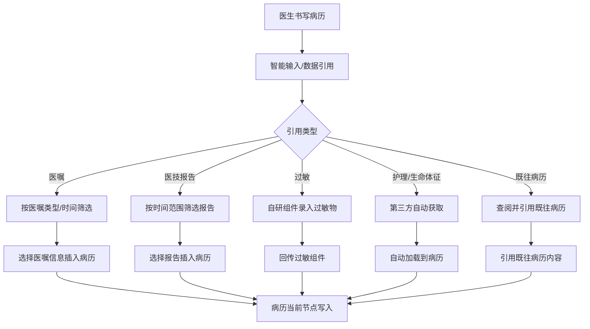
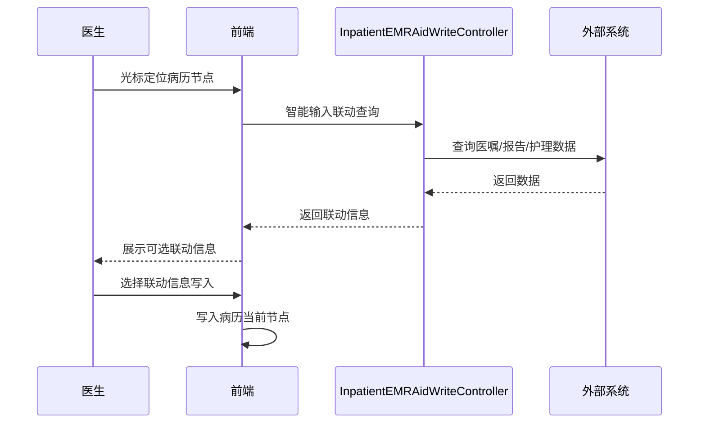

# BLGL-01-BLSX-009 病历数据引用 - Spec

> **功能编号**：BLGL-01-BLSX-009
> **文档类型**：功能Spec（业务背景与设计）
> **文档版本**：V1.0
> **编写时间**：2026-08-15
> **编写人**：RACC

---

## 文档索引

#### 章节索引

**Spec（研发视角）**

| 章节号 | 章节名称 | 内容说明 |
|--------|---------|---------|
| 1、 | 文档概述 | 文档目的、文档范围、术语定义、阅读指南、参考文档 |
| 2、 | 功能背景与定位 | 功能背景、功能定位、目标用户、核心价值 |
| 3、 | 业务流程设计 | 主流程/异常流程/边界流程（Given/When/Then） |
| 4、 | 数据模型设计 | 核心数据结构、状态定义、系统参数定义 |
| 5、 | 接口契约设计 | API列表、接口详细设计、错误码定义 |
| 6、 | 技术方案设计 | 页面路径、技术栈、关键技术点、部署方案 |
| 7、 | 测试用例预设计 | 功能/边界/异常/性能测试用例 |
| 8、 | 非功能性要求 | 性能、安全、可用性、兼容性 |
| 9、 | 依赖与风险 | 外部依赖、风险项 |
| 10、 | 附录 | 流程图、时序图、参考文档 |

**PM-Spec（业务视角）**

| 章节号 | 章节名称 | 内容说明 |
|--------|---------|---------|
| 一 | 目标 | 功能定位与核心价值 |
| 二 | 约束 | 业务/技术/非功能性约束 |
| 三 | 验收标准 | 验收条件与验证方法 |
| 四 | 排除范围 | 本次不做项与明确边界 |
| 五 | 关键决策记录 | 方案决策与选型理由 |
| 六 | 优先级 | 优先级定义 |
| 七 | 关联文档 | 关联文档索引 |
| 附录 | 填写检查清单 | 质量检查 |

**Analyst-Spec（产品视角）**

| 章节号 | 章节名称 | 内容说明 |
|--------|---------|---------|
| 一 | 功能编号体系 | 功能编号与层级结构 |
| 二 | 核心业务流程 | 核心业务流程与时序 |
| 三 | 功能规格说明 | 详细功能规格与验收标准 |
| 四 | 排除范围 | 排除范围 |
| 五 | 业务规则清单 | 业务规则清单 |
| 六 | 关联文档 | 关联文档索引 |
| 七 | 待确认问题清单 | 待确认问题汇总 |
| - | 填写检查清单 | 质量检查 |

#### 版本历史

| 版本 | 日期 | 变更说明 | 编写人 |
|------|------|---------|--------|
| V1.0 | 2026-08-15 | 初始版本 | RACC |

#### 关联文档索引

| 序号 | 文档名称 | 文档类型 | 版本 | 位置 |
|------|---------|---------|------|------|
| 1 | BLGL-01-BLSX-009_病历数据引用_PM-spec.md | PM-Spec（业务视角） | V0.1 | 本目录 |
| 2 | BLGL-01-BLSX-009_病历数据引用_Analyst-spec.md | Analyst-Spec（产品视角） | V1.0 | 本目录 |
| 3 | BLGL-01-BLSX-009_病历数据引用-Spec.md | Spec（研发视角）（本文档） | V1.0 | 本目录 |
| 4 | BLGL-01-BLSX 01病历书写功能点Spec.md | 功能点Spec（模块级） | V1.0 | 上级目录 |

---

## 1、文档概述

### 1.1、文档目的

本文档旨在明确"病历数据引用"功能（BLGL-01-BLSX-009）的业务背景与设计方案，为需求分析、研发实现、测试验收及评审提供统一的业务上下文、设计口径与决策依据。

### 1.2、文档范围

#### 1.2.1 纳入范围

本文档覆盖病历数据引用的完整业务背景与设计，包括：

- 智能输入：根据鼠标焦点定位的病历节点位置联动患者病历文书信息，选择联动信息写入当前节点
- 既往病历：查看患者既往病历文书，可查阅并引用既往病历文书内容
- 医技报告：通过时间范围等条件筛选报告，选择检验/检查报告查看详情并插入病历
- 医嘱信息：通过医嘱类型/时间等条件筛选医嘱信息，插入病历并选择引入格式字段
- 过敏信息：查阅并选择患者过敏信息引入病历
- 护理信息：通过时间范围筛选护理体征数据，插入病历
- 生命体征/专项评分：从护理系统（医慧）自动获取生命体征/专项评估数据
- 检查数据插入：选中检查项插入"检查结果"数据

#### 1.2.2 排除范围

本文档不涉及以下内容（详见其他功能点或模块）：

- 辅助录入模块各面板（检验报告调阅/检查报告调阅/医嘱信息引用等）—— BLGL-02-FZLR
- 诊断管理（诊断信息引用）—— BLGL-01-BLSX-008
- 短语引用 —— 属 BLGL-07-DYGL 短语管理
- 病历编辑与保存（缺省值联动）—— BLGL-01-BLSX-002

### 1.3、术语定义

| 术语 | 定义 |
|------|------|
| 智能输入 | 医生在书写病历文书过程中，根据鼠标焦点定位的病历节点位置联动患者病历文书信息，医师可以选择联动信息写入病历当前节点中 |
| 既往病历 | 患者既往病历文书，可查阅并引用 |
| 医技报告 | 检验/检查报告，可通过时间范围筛选并插入病历 |
| 医嘱信息 | 医嘱数据，可通过医嘱类型/时间筛选并插入病历 |

### 1.4、阅读指南

- **章节关系**：第1~2章为业务全貌，第3~10章为设计实现层。与 Analyst-Spec、PM-Spec 互相引用保持一致。
- **读者对象**：产品经理/需求分析师读第1~2章；研发读第3~6、9~10章；测试读第3、7~8章；评审人员核对各层一致性。

### 1.5、参考文档

| 序号 | 文档名称 | 版本/日期 |
|------|---------|----------|
| 1 | 【历史需求】住院病历的历史需求.xlsx | - |
| 2 | BLGL-01-BLSX-009_病历数据引用_PM-spec.md | V0.1 |
| 3 | BLGL-01-BLSX-009_病历数据引用_Analyst-spec.md | V1.0 |
| 4 | BLGL-01-BLSX 01病历书写功能点Spec.md | V1.0 |
| 5 | 病历书写_功能清单_20260327_151500.md | 2026-03-27 |

---

## 2、功能背景与定位

### 2.1 功能背景

病历数据引用是病历书写中临床数据引入的功能，需满足：

- **现状痛点**：医生书写病历时需跨系统查阅并手动转抄、门诊住院数据隔离、第三方护理数据无法获取
- **管理要求**：数据引用准确、可筛选、插入格式规范
- **历史需求演进**：从智能输入/既往病历/医技报告/医嘱信息/过敏/护理 → 检查数据插入优化 → 出院记录CT单号自动获取 → 过敏史录入优化 → 门诊住院数据互通 → 第三方体格检查/专项评估获取 → 既往病历加病历筛选条件

### 2.2 功能定位

"病历数据引用"是 WiNEX 病历管理-病历书写的临床数据引入功能点，定位为：

- **临床数据源**：智能输入联动患者病历文书信息
- **跨系统引用**：医技报告/医嘱/护理/过敏/既往病历引用
- **数据自动获取**：第三方生命体征/专项评估自动获取

### 2.3 目标用户

| 用户角色 | 主要使用场景 |
|---------|-------------|
| 住院医师 | 智能输入/既往病历/医技报告/医嘱/过敏/护理信息引用 |
| 住院医师 | 生命体征/专项评分自动获取 |

### 2.4 核心价值

| 价值维度 | 价值描述 |
|---------|---------|
| 书写效率 | 智能输入/自动获取降低手工录入 |
| 数据准确性 | 数据引用与源数据一致，插入格式规范 |
| 跨系统协同 | 第三方护理数据/门诊住院数据互通 |

---

## 3、业务流程设计（Given/When/Then）

### 3.1 主流程

**Scenario 1: 智能输入**

```gherkin
Given:
- 医生正在书写病历文书

When:
- 鼠标焦点定位在病历节点位置

Then:
- 系统联动患者病历文书信息
- 医生可选择联动信息写入病历当前节点中
```

**Scenario 2: 医嘱信息引用**

```gherkin
Given:
- 医生在病历书写中需要引用医嘱信息

When:
- 医生通过医嘱类型、时间等条件筛选医嘱信息
- 选择医嘱信息插入病历

Then:
- 医嘱信息插入病历
- 可对引入病历的医嘱信息格式进行字段选择
```

### 3.2 异常流程

**Scenario 3: 业务异常——检查数据插入**

```gherkin
Given:
- 医生选中某一个检查项

When:
- 插入数据到病历文书

Then:
- 只需要插入"检查结果"的数据
```

**Scenario 4: 数据异常——第三方数据获取失败**

```gherkin
Given:
- 护理系统（医慧）接口异常

When:
- 医生刷新/新建病历获取生命体征/专项评估

Then:
- 数据获取失败，不阻断书写，可重试
```

**Scenario 5: 系统异常——医技报告接口异常**

```gherkin
Given:
- 医技报告查询接口异常

When:
- 医生筛选医技报告

Then:
- 报告列表不展示，提示可重试
```

### 3.3 边界流程

**Scenario 6: 边界——过敏史录入**

```gherkin
Given:
- 医生点击药物过敏/食物过敏

When:
- 医生录入过敏物并点击确定

Then:
- 不弹过敏组件，使用自己的组件录入
- 回传过敏史给过敏组件：类型（药物/食物）+ 过敏物
```

**Scenario 7: 边界——既往病历筛选条件**

```gherkin
Given:
- 智能输入配置参数"病历文书查询范围"已配置

When:
- 智能标签类型为"病历文书"

Then:
- 数据查询范围由本次就诊扩展为{本次就诊+历史就诊}
```

---

## 4、数据模型设计

### 4.1 核心数据结构

#### 4.1.1 核心查询入参（医嘱/报告查询）

| 字段名 | 类型 | 必填 | 备注 |
|--------|------|------|------|
| encounterId | Long | 是 | 就诊标识 |
| 医嘱类型 | String | 否 | 医嘱类型筛选 |
| 时间范围 | Date | 否 | 时间条件筛选 |

#### 4.1.2 核心表/实体

| 表/实体 | 关键字段 | 说明 |
|---------|---------|------|
| 医嘱数据 | 医嘱类型、医嘱内容、时间 | 医嘱信息 |
| 医技报告 | 报告类型、报告内容、时间 | 检验/检查报告 |
| 过敏信息 | 类型（药物/食物）、过敏物 | 过敏史 |
| 生命体征数据 | 体温、脉搏、呼吸、血压、身高、体重 | 第三方获取 |

### 4.2 状态定义

| ⏳ 待确认 | 状态定义 | 状态定义未在资料区中找到 |

### 4.3 系统参数定义

| 参数编码 | 参数名称 | 说明 |
|---------|---------|------|
| COMMON109 | 体格检查从第三方获取开关 | 支持开关模式 |
| 待确认 | 专项评估项目的数值是否从护理获取 | {是，否}，默认否 |
| 待确认 | 病历文书查询范围 | 本次就诊/本次就诊+历史就诊，默认本次就诊 |
| 待确认 | 启用自动同步数据的监控类型 | 病历文书创建时自动同步住院/门诊相同模板病历数据 |

---

## 5、接口契约设计

### 5.1 API列表

| 序号 | API名称（代码函数） | 路径 | 方法 | 说明 |
|:----:|---------|------|:----:|------|
| 1 | queryMedicalAdvice | /api/v1/inpatient_emr_write/medical_advice/query/by_enc_id | POST | 按就诊查询医嘱信息 |
| 2 | queryLISReport / queryRISReport | /api/v2/inpatient_emr_write/lis_report/query/by_example | POST | 查询检验/检查报告 |
| 3 | queryPatientHistoryRecord | /api/v1/emr_inpatient/patient_history_record/query | POST | 查询患者历史病历 |
| 4 | queryAllergy | 查询住院患者过敏信息列表 | POST | 过敏信息查询 |
| 5 | queryVitalSigns | 查询生命体征数据 | POST | 生命体征查询 |
| 6 | setMedicalRecord | /api/v1/app_record_inpatient/emr_inpatient/medical_record/save | POST | 设置检验报告引用记录 |

### 5.2 接口详细设计

#### 5.2.1 查询医嘱信息

**请求参数**:
```json
{
  "encounterId": "就诊标识",
  "医嘱类型": "医嘱类型筛选（可选）",
  "时间范围": "时间条件（可选）"
}
```

**返回值（成功）**:
```json
{
  "success": true,
  "data": [
    {
      "医嘱类型": "长期医嘱",
      "医嘱内容": "医嘱信息"
    }
  ]
}
```

**返回值（失败）**:
```json
{
  "success": false,
  "message": "<错误信息>",
  "data": null
}
```

> 📌 请求/返回字段结构以 API 契约文档为准。

### 5.3 错误码定义

| 错误码 | 错误信息 | 处理方式 |
|--------|---------|---------|
| 待确认 | 第三方数据获取失败 | 不阻断书写，可重试 |
| 待确认 | 医技报告查询失败 | 报告列表不展示，提示重试 |

---

## 6、技术方案设计

### 6.1 页面路径

- **页面路径**: 住院医生站→住院病历书写界面→编辑器内智能输入/辅助区面板（EmrEditor/components/BaseEditor）
- **组件**：EmrEditor/components/BaseEditor（智能输入/数据插入）、AuxiliaryOn*/（辅助区面板）
- **核心逻辑模块**: InpatientEMRAidWriteController（辅助录入查询）+ InpatientEmrEncounterController（过敏/历史就诊）

### 6.2 技术栈

| 类别 | 技术 | 版本 |
|------|------|------|
| 前端框架 | Vue | 2.6.14 |
| 前端UI | element-ui | 2.13.0 |
| 后端框架 | Spring Boot（Java） | 17 |

### 6.3 关键技术点

- 医嘱/报告查询走 inpatient_emr_write 系列接口
- 智能输入联动患者病历文书信息
- 第三方数据获取：接口组对接医慧，住院病历调用
- 过敏史录入：自研组件，回传过敏组件

### 6.4 部署方案

⏳ 待确认：部署方案未在资料区中找到。

---

## 7、测试用例预设计

### 7.1 功能测试

| 用例编号 | 测试场景 | Given | When | Then |
|---------|---------|-------|------|------|
| TC-001 | 智能输入 | 医生书写病历 | 鼠标焦点定位节点 | 联动患者病历文书信息可写入 |
| TC-002 | 医嘱信息引用 | 医生需引用医嘱 | 筛选医嘱信息插入 | 医嘱信息插入病历，格式可字段选择 |
| TC-003 | 检查数据插入 | 选中检查项 | 插入病历 | 只插入"检查结果"数据 |

### 7.2 边界测试

| 用例编号 | 测试场景 | Given | When | Then |
|---------|---------|-------|------|------|
| TC-004 | 过敏史录入 | 点击药物过敏 | 录入过敏物确定 | 自研组件录入，回传过敏组件 |
| TC-005 | 既往病历筛选 | 参数已配置 | 智能标签病历文书 | 查询范围扩展本次+历史就诊 |
| TC-006 | 出院记录CT单号 | 患者有CT单号 | 打开出院记录CT | 自动获取CT单号，多单号逗号隔开 |

### 7.3 异常测试

| 用例编号 | 测试场景 | Given | When | Then |
|---------|---------|-------|------|------|
| TC-007 | 第三方数据获取失败 | 护理系统接口异常 | 刷新获取生命体征 | 获取失败不阻断书写 |
| TC-008 | 医技报告接口异常 | 接口异常 | 筛选医技报告 | 报告不展示提示重试 |

### 7.4 性能测试

| 用例编号 | 测试场景 | 指标 |
|---------|---------|------|
| TC-009 | 数据引用响应 | ⏳ 待确认：性能指标未在资料区中找到 |

---

## 8、非功能性要求

### 8.1 性能要求

| 指标 | 要求 |
|------|------|
| 数据引用响应时间 | ⏳ 待确认 |

### 8.2 安全要求

| 要求 | 说明 |
|------|------|
| 数据权限 | 按就诊/患者范围隔离展示 |
| 第三方数据对接 | 通过接口组对接，数据隔离 |

**医疗行业特殊要求**

| 要求 | 说明 |
|------|------|
| 引用数据准确性 | 引用内容与源数据一致 |
| 过敏信息准确 | 过敏史录入回传准确 |

### 8.3 可用性要求

| 指标 | 要求值 |
|------|--------|
| 可用性 | ⏳ 待确认 |

### 8.4 兼容性要求

| 类型 | 要求 |
|------|------|
| 第三方系统 | 接口组对接医慧 |
| 数据互通 | 门诊/住院数据互通 |

---

## 9、依赖与风险

### 9.1 外部依赖

| 依赖项 | 说明 |
|--------|------|
| 执行域中台 | 检验/检查报告 |
| 护理系统（医慧） | 生命体征/专项评估 |
| 医嘱系统 | 医嘱信息 |

### 9.2 风险项

| 风险项 | 等级 | 说明 | 应对方案 |
|--------|------|------|---------|
| 第三方接口不稳定 | 中 | 生命体征/专项评估依赖医慧接口 | 接口异常降级不阻断书写 |
| 引用格式不统一 | 中 | 医嘱/报告引用格式字段选择差异 | 字段选择配置化 |
| 数据互通复杂度 | 中 | 门诊住院数据同步 | 自动同步参数控制 |

---

## 10、附录

### 10.1 流程图



### 10.2 时序图



### 10.3 参考文档

- 病历书写_功能清单_20260327_151500.md（辅助功能-智能输入/既往病历/医技报告/医嘱信息/过敏信息/护理信息）
- 【历史需求】住院病历的历史需求.xlsx
- BLGL-01-BLSX 01病历书写功能点Spec.md（V1.0，第5章 BLGL-01-BLSX-009 行）
- 关联Spec：BLGL-01-BLSX-009_病历数据引用_PM-spec.md、BLGL-01-BLSX-009_病历数据引用_Analyst-spec.md

---

## 填写检查清单

| 序号 | 检查项 | 是否完成 |
|:----:|--------|:--------:|
| 1 | 章节索引与正文章节一致 | ✅ |
| 2 | 版本历史记录完整 | ✅ |
| 3 | 关联文档索引已登记全部Spec | ✅ |
| 4 | 文档目的明确回答"为什么做/做成什么/怎么做" | ✅ |
| 5 | 纳入范围/排除范围清晰 | ✅ |
| 6 | 术语定义覆盖关键概念，从资料区可溯源 | ✅ |
| 7 | 参考文档已登记 | ✅ |
| 8 | 功能背景基于法规/规范/需求来源组织 | ✅ |
| 9 | 功能定位体现业务价值（3~5个定位点） | ✅ |
| 10 | 目标用户角色覆盖完整，在需求原文中有出处 | ✅ |
| 11 | 核心价值可陈述，与 Phase 1 口径一致 | ✅ |
| 12 | 业务流程：主流程≥1、异常≥3、边界≥2，Given/When/Then 具体 | ✅ |
| 13 | 数据模型：字段/表/状态/参数可溯源 | ✅ |
| 14 | 接口契约：API列表+详细设计+错误码齐全或标记待确认 | ✅ |
| 15 | 技术方案：页面路径/技术栈/关键点/部署方案或标记待确认 | ✅ |
| 16 | 测试用例：功能/边界/异常/性能覆盖 | ✅ |
| 17 | 非功能性要求：性能/安全/可用性/兼容性指标可量化或标记待确认 | ✅ |
| 18 | 依赖与风险：外部依赖登记完整 | ✅ |
| 19 | 附录：流程图/时序图与正文流程一致 | ✅ |
| 20 | 全文无占位符 `< >` 残留 | ✅ |
| 21 | 全文陈述可溯源至资料区 | ✅ |
| 22 | 人工审核确认完成 | ⏳ 待确认 |

---

**文档状态**：⬜ 待审核
**维护责任**：RACC
**下次更新**：根据评审反馈优化