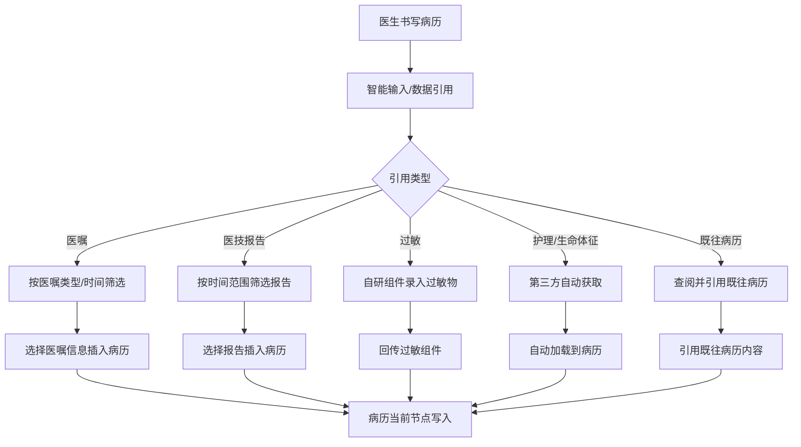
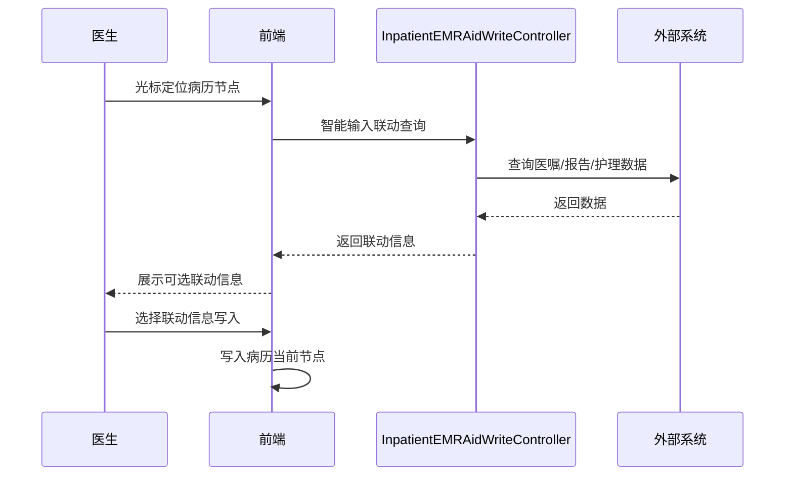

# BLGL-01-BLSX-009 病历数据引用 _ Analyst - Spec

> **需求编号**：BLGL-01-BLSX-009
> **父需求**：BLGL-01-BLSX
> **关联PM Spec**：BLGL-01-BLSX-009_病历数据引用_PM-spec.md
> **Spec版本**：V1.0
> **编写时间**：2026-08-15
> **编写人**：需求分析师

---

## 一、功能编号体系

### 1.1 功能层级结构

```
BLGL-01-BLSX-009-001: 智能输入
  ├─ BLGL-01-BLSX-009-001-01: 光标节点联动
  └─ BLGL-01-BLSX-009-001-02: 联动信息写入

BLGL-01-BLSX-009-002: 既往病历引用
  ├─ BLGL-01-BLSX-009-002-01: 既往病历查阅
  ├─ BLGL-01-BLSX-009-002-02: 既往病历内容引用
  └─ BLGL-01-BLSX-009-002-03: 病历筛选条件

BLGL-01-BLSX-009-003: 医技报告引用
  ├─ BLGL-01-BLSX-009-003-01: 报告筛选
  ├─ BLGL-01-BLSX-009-003-02: 报告详情查看
  └─ BLGL-01-BLSX-009-003-03: 报告插入病历

BLGL-01-BLSX-009-004: 医嘱信息引用
  ├─ BLGL-01-BLSX-009-004-01: 医嘱筛选
  ├─ BLGL-01-BLSX-009-004-02: 医嘱插入病历
  └─ BLGL-01-BLSX-009-004-03: 引入格式字段选择

BLGL-01-BLSX-009-005: 过敏信息引用
  ├─ BLGL-01-BLSX-009-005-01: 自研组件录入
  └─ BLGL-01-BLSX-009-005-02: 回传过敏组件

BLGL-01-BLSX-009-006: 护理/生命体征引用
  ├─ BLGL-01-BLSX-009-006-01: 护理信息筛选
  ├─ BLGL-01-BLSX-009-006-02: 生命体征自动获取
  └─ BLGL-01-BLSX-009-006-03: 专项评估自动获取
```

### 1.2 功能编号表

| REQ-ID | 功能名称 | 类型 | 优先级 | 说明 |
|--------|---------|------|--------|------|
| BLGL-01-BLSX-009-001 | 智能输入 | 功能 | P0 | 光标节点联动患者病历文书信息可写入 |
| BLGL-01-BLSX-009-001-01 | 光标节点联动 | 子功能 | P0 | 鼠标焦点定位病历节点联动信息 |
| BLGL-01-BLSX-009-001-02 | 联动信息写入 | 子功能 | P0 | 选择联动信息写入当前节点 |
| BLGL-01-BLSX-009-002 | 既往病历引用 | 功能 | P1 | 查阅并引用既往病历内容 |
| BLGL-01-BLSX-009-002-01 | 既往病历查阅 | 子功能 | P1 | 查看患者既往病历文书 |
| BLGL-01-BLSX-009-002-02 | 既往病历内容引用 | 子功能 | P1 | 引用既往病历文书内容 |
| BLGL-01-BLSX-009-002-03 | 病历筛选条件 | 子功能 | P1 | 病历文书查询范围扩展 |
| BLGL-01-BLSX-009-003 | 医技报告引用 | 功能 | P0 | 报告筛选/详情/插入 |
| BLGL-01-BLSX-009-003-01 | 报告筛选 | 子功能 | P0 | 时间范围条件筛选 |
| BLGL-01-BLSX-009-003-02 | 报告详情查看 | 子功能 | P0 | 查看报告详情 |
| BLGL-01-BLSX-009-003-03 | 报告插入病历 | 子功能 | P0 | 选择报告插入病历 |
| BLGL-01-BLSX-009-004 | 医嘱信息引用 | 功能 | P0 | 医嘱筛选/插入/格式选择 |
| BLGL-01-BLSX-009-004-01 | 医嘱筛选 | 子功能 | P0 | 医嘱类型/时间筛选 |
| BLGL-01-BLSX-009-004-02 | 医嘱插入病历 | 子功能 | P0 | 医嘱信息插入病历 |
| BLGL-01-BLSX-009-004-03 | 引入格式字段选择 | 子功能 | P1 | 医嘱信息格式字段选择 |
| BLGL-01-BLSX-009-005 | 过敏信息引用 | 功能 | P1 | 自研组件录入回传 |
| BLGL-01-BLSX-009-005-01 | 自研组件录入 | 子功能 | P1 | 药物/食物过敏自研组件 |
| BLGL-01-BLSX-009-005-02 | 回传过敏组件 | 子功能 | P1 | 回传类型+过敏物 |
| BLGL-01-BLSX-009-006 | 护理/生命体征引用 | 功能 | P1 | 护理筛选/生命体征/专项评估自动获取 |
| BLGL-01-BLSX-009-006-01 | 护理信息筛选 | 子功能 | P1 | 时间范围筛选护理体征 |
| BLGL-01-BLSX-009-006-02 | 生命体征自动获取 | 子功能 | P1 | 第三方自动获取生命体征 |
| BLGL-01-BLSX-009-006-03 | 专项评估自动获取 | 子功能 | P1 | 专项评分从护理自动获取 |

---

## 二、核心业务流程

### 2.1 病历数据引用主流程



### 2.2 病历数据引用时序



---

## 三、功能规格说明


### BLGL-01-BLSX-009-001: 智能输入

#### 3.1.1 功能概述

根据鼠标焦点定位的病历节点位置联动患者病历文书信息，选择联动信息写入当前节点。

#### 3.1.2 用户角色

| 角色 | 使用场景 | 权限要求 | 操作频率 |
|------|---------|---------|---------|
| 住院医师 | 病历书写智能输入 | 病历书写权限 | 高频 |

#### 3.1.3 业务流程（Given/When/Then）

##### 主流程

**Scenario 1: 智能输入**

```gherkin
Given:
- 医生正在书写病历文书

When:
- 鼠标焦点定位在病历节点位置

Then:
- 系统联动患者病历文书信息
- 医生可选择联动信息写入病历当前节点中
```

##### 异常流程

**Scenario 2: 业务异常——无联动信息**

```gherkin
Given:
- 病历节点无对应联动数据

When:
- 医生光标定位节点

Then:
- 无联动信息可写
```

**Scenario 3: 数据异常——联动信息不完整**

```gherkin
Given:
- 患者病历文书信息不完整

When:
- 医生选择联动信息

Then:
- 部分联动信息缺失，可手动补充
```

**Scenario 4: 系统异常——联动查询接口异常**

```gherkin
Given:
- 联动查询接口异常

When:
- 医生光标定位节点

Then:
- 联动信息不展示，提示可重试
```

##### 边界流程

**Scenario 5: 边界——病历文书查询范围**

```gherkin
Given:
- 智能标签类型为"病历文书"
- 参数"病历文书查询范围"已配置

When:
- 医生查询病历文书

Then:
- 查询范围由本次就诊扩展为{本次就诊+历史就诊}
```

#### 3.1.5 验收标准

| AC编号 | 验收标准 | 对应REQ-ID | 验证方法 | 验证场景 |
|--------|---------|-----------|---------|---------|
| AC-001 | 光标定位节点联动患者病历文书信息可写入 | BLGL-01-BLSX-009-001 | 功能测试 | Scenario 1 |
| AC-002 | 病历文书查询范围可配置本次/本次+历史 | BLGL-01-BLSX-009-001 | 功能测试 | Scenario 5 |


### BLGL-01-BLSX-009-002: 既往病历引用

#### 3.2.1 功能概述

查看患者既往病历文书，可查阅并引用既往病历文书内容。

#### 3.2.2 用户角色

| 角色 | 使用场景 | 权限要求 | 操作频率 |
|------|---------|---------|---------|
| 住院医师 | 查看/引用既往病历 | 病历查看权限 | 中频 |

#### 3.2.3 业务流程（Given/When/Then）

##### 主流程

**Scenario 1: 既往病历引用**

```gherkin
Given:
- 患者存在既往病历

When:
- 医生查看患者既往病历文书
- 选择引用内容

Then:
- 引用既往病历文书内容到当前病历
```

##### 异常流程

**Scenario 2: 业务异常——无既往病历**

```gherkin
Given:
- 患者无既往病历

When:
- 医生查看既往病历

Then:
- 既往病历列表为空
```

**Scenario 3: 系统异常——既往病历查询接口异常**

```gherkin
Given:
- 既往病历查询接口异常

When:
- 医生查看既往病历

Then:
- 不展示既往病历，提示可重试
```

##### 边界流程

**Scenario 4: 边界——历史手术定位**

```gherkin
Given:
- 医生需快速定位历史手术记录

When:
- 医生在既往病历中筛选

Then:
- 可快速定位历史手术记录
```

#### 3.2.5 验收标准

| AC编号 | 验收标准 | 对应REQ-ID | 验证方法 | 验证场景 |
|--------|---------|-----------|---------|---------|
| AC-001 | 既往病历可查阅并引用内容 | BLGL-01-BLSX-009-002 | 功能测试 | Scenario 1 |


### BLGL-01-BLSX-009-003: 医技报告引用

#### 3.3.1 功能概述

通过时间范围等条件筛选报告，选择检验/检查报告查看详情并插入病历。

#### 3.3.2 用户角色

| 角色 | 使用场景 | 权限要求 | 操作频率 |
|------|---------|---------|---------|
| 住院医师 | 医技报告筛选/插入 | 病历书写权限 | 高频 |

#### 3.3.3 业务流程（Given/When/Then）

##### 主流程

**Scenario 1: 医技报告引用**

```gherkin
Given:
- 医生在病历书写中需引用医技报告

When:
- 医生通过时间范围等条件筛选报告
- 选择检验/检查报告查看详情
- 插入病历

Then:
- 报告内容插入病历
```

##### 异常流程

**Scenario 2: 业务异常——检查数据插入**

```gherkin
Given:
- 医生选中某一个检查项

When:
- 插入数据到病历文书

Then:
- 只需要插入"检查结果"的数据
```

**Scenario 3: 数据异常——报告筛选无结果**

```gherkin
Given:
- 时间范围内无报告

When:
- 医生筛选报告

Then:
- 报告列表为空
```

**Scenario 4: 系统异常——报告查询接口异常**

```gherkin
Given:
- 报告查询接口异常

When:
- 医生筛选报告

Then:
- 报告列表不展示，提示可重试
```

##### 边界流程

**Scenario 5: 边界——出院记录CT单号自动获取**

```gherkin
Given:
- 患者存在CT单号

When:
- 医生打开出院记录CT

Then:
- 自动获取患者的CT单号并展示
- 多个CT单号用逗号隔开
```

#### 3.3.5 验收标准

| AC编号 | 验收标准 | 对应REQ-ID | 验证方法 | 验证场景 |
|--------|---------|-----------|---------|---------|
| AC-001 | 医技报告按条件筛选并插入病历 | BLGL-01-BLSX-009-003 | 功能测试 | Scenario 1 |
| AC-002 | 检查项插入只插入"检查结果"数据 | BLGL-01-BLSX-009-003 | 功能测试 | Scenario 2 |
| AC-003 | 出院记录CT单号自动获取 | BLGL-01-BLSX-009-003 | 功能测试 | Scenario 5 |


### BLGL-01-BLSX-009-004: 医嘱信息引用

#### 3.4.1 功能概述

通过医嘱类型/时间等条件筛选医嘱信息，插入病历并选择引入格式字段。

#### 3.4.2 用户角色

| 角色 | 使用场景 | 权限要求 | 操作频率 |
|------|---------|---------|---------|
| 住院医师 | 医嘱信息引用 | 病历书写权限 | 高频 |

#### 3.4.3 业务流程（Given/When/Then）

##### 主流程

**Scenario 1: 医嘱信息引用**

```gherkin
Given:
- 医生在病历书写中需引用医嘱信息

When:
- 医生通过医嘱类型、时间等条件筛选医嘱信息
- 选择医嘱信息插入病历

Then:
- 医嘱信息插入病历
- 可对引入病历的医嘱信息格式进行字段选择
```

##### 异常流程

**Scenario 2: 业务异常——医嘱筛选无结果**

```gherkin
Given:
- 条件内无医嘱

When:
- 医生筛选医嘱

Then:
- 医嘱列表为空
```

**Scenario 3: 系统异常——医嘱查询接口异常**

```gherkin
Given:
- 医嘱查询接口异常

When:
- 医生筛选医嘱

Then:
- 医嘱不展示，提示可重试
```

##### 边界流程

**Scenario 4: 边界——医嘱关联文书**

```gherkin
Given:
- 开立相关医嘱

When:
- 医生选择当前医嘱需要关联的病历文书

Then:
- 医嘱签署调用病历文书接口，提醒待书写记录
```

#### 3.4.5 验收标准

| AC编号 | 验收标准 | 对应REQ-ID | 验证方法 | 验证场景 |
|--------|---------|-----------|---------|---------|
| AC-001 | 医嘱信息按类型/时间筛选插入病历 | BLGL-01-BLSX-009-004 | 功能测试 | Scenario 1 |
| AC-002 | 医嘱关联病历文书选择 | BLGL-01-BLSX-009-004 | 功能测试 | Scenario 4 |


### BLGL-01-BLSX-009-005: 过敏信息引用

#### 3.5.1 功能概述

点击药物/食物过敏不弹过敏组件，使用自研组件录入，回传过敏组件。

#### 3.5.2 用户角色

| 角色 | 使用场景 | 权限要求 | 操作频率 |
|------|---------|---------|---------|
| 住院医师 | 过敏史录入 | 病历书写权限 | 中频 |

#### 3.5.3 业务流程（Given/When/Then）

##### 主流程

**Scenario 1: 过敏史录入**

```gherkin
Given:
- 医生点击药物过敏或食物过敏

When:
- 医生录入过敏物并点击确定

Then:
- 使用自研组件录入
- 回传过敏史给过敏组件（类型+过敏物）
```

##### 异常流程

**Scenario 2: 业务异常——过敏物重复**

```gherkin
Given:
- 患者已存在该过敏物

When:
- 医生录入过敏物

Then:
- 提示过敏物重复
```

**Scenario 3: 系统异常——回传失败**

```gherkin
Given:
- 回传过敏组件接口异常

When:
- 医生确认过敏物

Then:
- 提示回传失败，可重试
```

##### 边界流程

**Scenario 4: 边界——过敏类型**

```gherkin
Given:
- 医生录入过敏物

When:
- 确认后

Then:
- 回传内容：类型（药物/食物）+ 过敏物
```

#### 3.5.5 验收标准

| AC编号 | 验收标准 | 对应REQ-ID | 验证方法 | 验证场景 |
|--------|---------|-----------|---------|---------|
| AC-001 | 过敏史自研组件录入，回传过敏组件 | BLGL-01-BLSX-009-005 | 功能测试 | Scenario 1 |


### BLGL-01-BLSX-009-006: 护理/生命体征引用

#### 3.6.1 功能概述

护理信息筛选、生命体征/专项评估从第三方（医慧）自动获取。

#### 3.6.2 用户角色

| 角色 | 使用场景 | 权限要求 | 操作频率 |
|------|---------|---------|---------|
| 住院医师 | 护理信息/生命体征引用 | 病历书写权限 | 中频 |

#### 3.6.3 业务流程（Given/When/Then）

##### 主流程

**Scenario 1: 生命体征自动获取**

```gherkin
Given:
- 参数"专项评估项目的数值是否从护理获取"为是

When:
- 医生新建/刷新入院记录

Then:
- 从医慧系统自动获取生命体征/专项评估数据
- 自动加载到入院记录的专项评估汇总中
```

##### 异常流程

**Scenario 2: 业务异常——开关关闭**

```gherkin
Given:
- 参数"专项评估项目的数值是否从护理获取"为否（默认）

When:
- 医生新建/刷新入院记录

Then:
- 不获取第三方数据，使用本地数据
```

**Scenario 3: 数据异常——第三方无数据**

```gherkin
Given:
- 医慧系统无该患者数据

When:
- 医生刷新获取

Then:
- 专项评估为空，可手动录入
```

**Scenario 4: 系统异常——第三方接口异常**

```gherkin
Given:
- 医慧接口异常

When:
- 医生刷新获取

Then:
- 获取失败，不阻断书写，可重试
```

##### 边界流程

**Scenario 5: 边界——护理信息筛选**

```gherkin
Given:
- 医生需引用护理体征数据

When:
- 医生通过时间范围筛选护理信息

Then:
- 选择护理信息插入病历
```

**Scenario 6: 边界——出院记录生命体征同步**

```gherkin
Given:
- 参数"创建病历时生命体征优先同步缺省值的监控类型"已配置

When:
- 医生创建出院记录

Then:
- 生命体征优先根据数据元缺省值取值，缺省值没有再从护理的生命体征里取值
```

#### 3.6.5 验收标准

| AC编号 | 验收标准 | 对应REQ-ID | 验证方法 | 验证场景 |
|--------|---------|-----------|---------|---------|
| AC-001 | 参数开启时生命体征/专项评估从第三方自动获取 | BLGL-01-BLSX-009-006 | 集成测试 | Scenario 1 |
| AC-002 | 第三方数据获取失败不阻断书写 | BLGL-01-BLSX-009-006 | 集成测试 | Scenario 4 |


---

## 四、排除范围

本需求不包含以下功能项：

1. **辅助录入模块各面板（检验/检查报告调阅等）—— BLGL-02-FZLR**
2. **诊断管理（诊断信息引用）—— BLGL-01-BLSX-008**
3. **短语引用 —— BLGL-07-DYGL 短语管理**
4. **病历编辑与保存（缺省值联动）—— BLGL-01-BLSX-002**

---

## 五、业务规则清单

| 规则ID | 规则名称 | 规则描述 | 来源 | 优先级 |
|--------|---------|---------|------|--------|
| BR-001 | 智能输入 | 医生在书写病历文书过程中，根据鼠标焦点定位的病历节点位置联动患者病历文书信息，医师可以选择联动信息写入病历当前节点中 | 功能清单 | P0 |
| BR-002 | 检查数据插入 | 选中检查项插入数据到病历，只需要插入"检查结果"的数据 | 功能清单 | P0 |
| BR-003 | 过敏史录入 | 点击药物/食物过敏不弹过敏组件，使用自研组件录入，回传过敏组件：类型（药物/食物）+过敏物 | 功能清单 | P1 |
| BR-004 | 医嘱引用 | 医嘱信息通过医嘱类型/时间筛选插入病历，可对引入格式进行字段选择 | 功能清单 | P0 |
| BR-005 | 生命体征获取 | 专项评估项目数值从护理获取，开关{是，否}默认否；入院后各项目初次评估分值和结果 | 功能清单 | P1 |
| BR-006 | 既往病历查询范围 | 智能标签类型为病历文书时，数据查询范围由本次就诊扩展为{本次就诊+历史就诊} | 功能清单 | P1 |

---

## 六、关联文档

| 文档类型 | 文档路径 | 说明 |
|---------|---------|------|
| 功能点Spec | BLGL-01-BLSX 01病历书写功能点Spec.md（V1.0，上级目录） | Phase 1 功能点索引 |
| PM spec | 本目录 BLGL-01-BLSX-009_病历数据引用_PM-spec.md（V0.1） | PM 产出的 Spec 文档 |
| -Spec | 本目录 BLGL-01-BLSX-009_病历数据引用-Spec.md（V1.0） | 业务背景与目标 Spec |
| data-model.md | 待产出 | 架构师产出的数据建模文档 |
| design.md | 待产出 | 架构师产出的技术方案文档 |
| api-contract.md | 待产出 | 开发经理产出的 API 契约文档 |

---

## 七、待确认问题清单

| 编号 | 问题描述 | 缺失信息 | 影响范围 | 建议补充方 |
|------|---------|---------|---------|-----------|
| Q-001 | 数据引用接口完整入参/出参字段结构 | API 契约文档 | -Spec 第5章、Analyst-Spec 数据字段 | 开发经理 |
| Q-002 | 数据引用相关参数编码（COMMON109等） | 参数配置说明表 | 数据字段（概念ID） | 产品经理 |
| Q-003 | 性能指标（数据引用响应） | 非功能性需求 | -Spec 第8章 | 需求分析师 |
| Q-004 | 医慧系统接口契约（生命体征/专项评估字段） | 接口文档 | 第三方数据场景 | 接口负责人 |
| Q-005 | 智能输入联动数据源完整规则 | 设计文档 | 智能输入场景 | 架构师 |

---

## 填写检查清单

| 序号 | 检查项 | 是否完成 |
|:----:|--------|:--------:|
| 1 | 功能编号带父子层级 | ✅ |
| 2 | 每个 REQ-ID 有功能概述和用户角色 | ✅ |
| 3 | 主流程至少 1 个 Given/When/Then 场景 | ✅ |
| 4 | 异常流程至少 3 个 Given/When/Then 场景 | ✅ |
| 5 | 边界流程至少 2 个 Given/When/Then 场景 | ✅ |
| 6 | 每个 Given/When/Then 内容具体，不模糊 | ✅ |
| 7 | 数据字段定义完整（字段名、类型、必填、说明、概念ID） | N/A |
| 8 | 验收标准 AC 编号独立，可验证 | ✅ |
| 9 | 验收标准无"功能正常"等模糊表述 | ✅ |
| 10 | 排除范围明确列出 | ✅ |
| 11 | 业务规则清单列出所有规则，每条标注来源 | ✅ |
| 12 | 流程图使用 Mermaid 格式（≥2 个） | ✅ |
| 13 | 关联文档索引包含 Phase 1 功能点Spec | ✅ |
| 14 | 待确认问题清单汇总了全文所有 ⏳ 项 | ✅ |
| 15 | 全文无占位符 `< >` 残留 | ✅ |
| 16 | 全文陈述可溯源至资料区（S1~S10 溯源核查） | ✅ |
| 17 | 人工审核确认完成 | ⏳ 待确认 |

---

**文档状态**：⬜ 待审核
**维护责任**：需求分析师规范组
**下次更新**：根据评审反馈优化

---

## 版本历史

| 版本 | 日期 | 变更说明 | 编写人 |
|------|------|---------|--------|
| V1.0 | 2026-08-15 | 初始版本 | 需求分析师 |