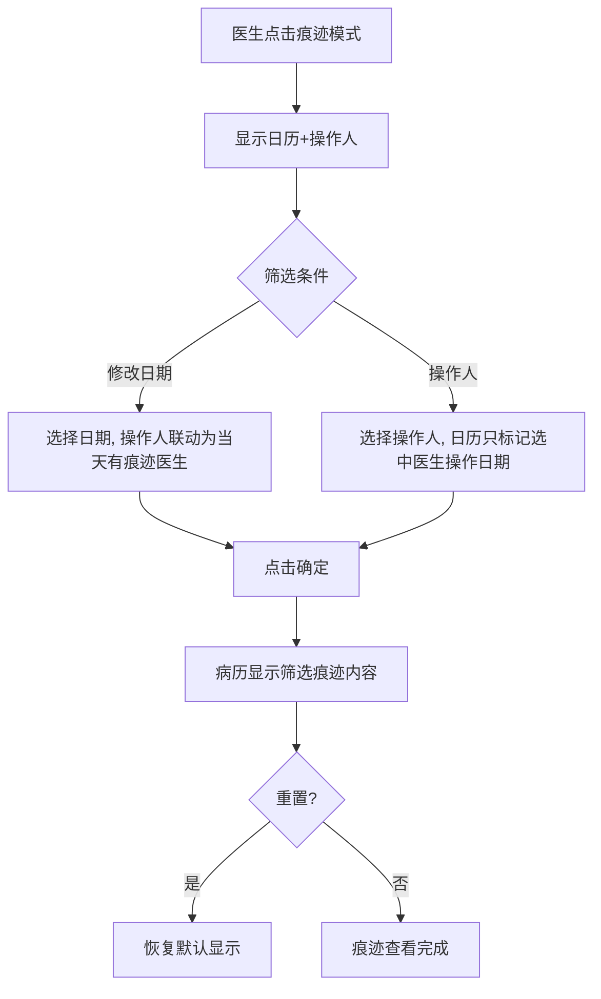
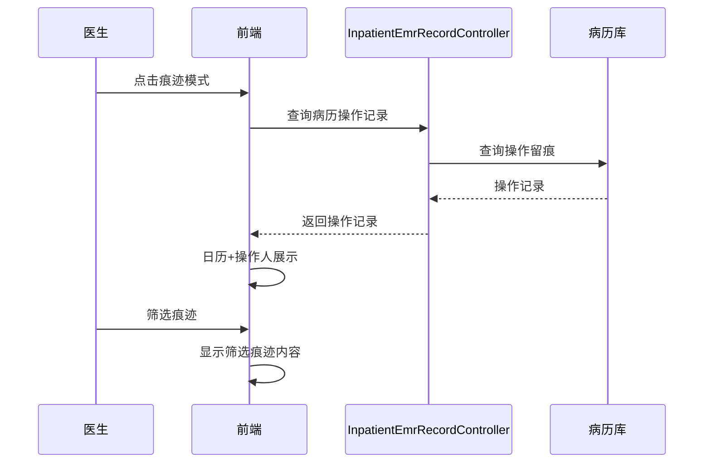

# BLGL-01-BLSX-010 痕迹与修改历史 - Spec

> **功能编号**：BLGL-01-BLSX-010
> **文档类型**：Spec（研发视角）
> **文档版本**：V1.0
> **编写时间**：2026-08-15
> **编写人**：RACC

---

## 文档索引

#### 章节索引

**Spec（研发视角）**

| 章节号 | 章节名称 | 内容说明 |
|--------|---------|---------|
| 1、 | 文档概述 | 文档目的、文档范围、术语定义、阅读指南、参考文档 |
| 2、 | 功能背景与定位 | 功能背景、功能定位、目标用户、核心价值 |
| 3、 | 业务流程设计 | 主流程/异常流程/边界流程（Given/When/Then） |
| 4、 | 数据模型设计 | 核心数据结构、状态定义、系统参数定义 |
| 5、 | 接口契约设计 | API列表、接口详细设计、错误码定义 |
| 6、 | 技术方案设计 | 页面路径、技术栈、关键技术点、部署方案 |
| 7、 | 测试用例预设计 | 功能/边界/异常/性能测试用例 |
| 8、 | 非功能性要求 | 性能、安全、可用性、兼容性 |
| 9、 | 依赖与风险 | 外部依赖、风险项 |
| 10、 | 附录 | 流程图、时序图、参考文档 |

**PM-Spec（业务视角）**

| 章节号 | 章节名称 | 内容说明 |
|--------|---------|---------|
| 一 | 目标 | 功能定位与核心价值 |
| 二 | 约束 | 业务/技术/非功能性约束 |
| 三 | 验收标准 | 验收条件与验证方法 |
| 四 | 排除范围 | 本次不做项与明确边界 |
| 五 | 关键决策记录 | 方案决策与选型理由 |
| 六 | 优先级 | 优先级定义 |
| 七 | 关联文档 | 关联文档索引 |
| 附录 | 填写检查清单 | 质量检查 |

**Analyst-Spec（产品视角）**

| 章节号 | 章节名称 | 内容说明 |
|--------|---------|---------|
| 一 | 功能编号体系 | 功能编号与层级结构 |
| 二 | 核心业务流程 | 核心业务流程与时序 |
| 三 | 功能规格说明 | 详细功能规格与验收标准 |
| 四 | 排除范围 | 排除范围 |
| 五 | 业务规则清单 | 业务规则清单 |
| 六 | 关联文档 | 关联文档索引 |
| 七 | 待确认问题清单 | 待确认问题汇总 |
| - | 填写检查清单 | 质量检查 |

#### 版本历史

| 版本 | 日期 | 变更说明 | 编写人 |
|------|------|---------|--------|
| V1.0 | 2026-08-15 | 初始版本 | RACC |

#### 关联文档索引

| 序号 | 文档名称 | 文档类型 | 版本 | 位置 |
|------|---------|---------|------|------|
| 1 | BLGL-01-BLSX-010_痕迹与修改历史_PM-spec.md | PM-Spec（业务视角） | V0.1 | 本目录 |
| 2 | BLGL-01-BLSX-010_痕迹与修改历史_Analyst-spec.md | Analyst-Spec（产品视角） | V1.0 | 本目录 |
| 3 | BLGL-01-BLSX-010_痕迹与修改历史-Spec.md | Spec（研发视角）（本文档） | V1.0 | 本目录 |
| 4 | BLGL-01-BLSX 01病历书写功能点Spec.md | 功能点Spec（模块级） | V1.0 | 上级目录 |

---

## 1、文档概述

### 1.1、文档目的

本文档旨在明确"痕迹与修改历史"功能（BLGL-01-BLSX-010）的业务背景与设计方案，为需求分析、研发实现、测试验收及评审提供统一的业务上下文、设计口径与决策依据。

### 1.2、文档范围

#### 1.2.1 纳入范围

本文档覆盖痕迹与修改历史的完整业务背景与设计，包括：

- 痕迹记录：按照修改时间及记录人来查询显示修改痕迹
- 痕迹模式：支持查看病历修改历史的查看，不能进行病历录入/保存，只支持病历查看
- 痕迹查询弹窗：日历+操作人联动筛选（日期单选、操作人多选）、重置、确定
- 操作人职称显示：痕迹模式查询弹窗操作人下拉显示姓名（工号）+职级
- 删除线内容复制：病历日志管理和痕迹模式中划红色删除线的内容可复制
- 修改历史记录：病历操作记录查询/导出、修改人列表

#### 1.2.2 排除范围

本文档不涉及以下内容（详见其他功能点或模块）：

- 病历编辑与保存 —— BLGL-01-BLSX-002
- 病历签署/提交/审签 —— BLGL-01-BLSX-003/004/005
- 手术记录 —— BLGL-01-BLSX-006
- 书写任务与时限提醒 —— BLGL-01-BLSX-007
- 病历数据引用 —— BLGL-01-BLSX-009

### 1.3、术语定义

| 术语 | 定义 |
|------|------|
| 痕迹模式 | 支持查看病历修改历史的查看，但是不能进行病历的录入、保存，只支持病历查看 |
| 痕迹记录 | 按照修改时间及记录人来查询显示修改痕迹 |
| 修改历史 | 病历操作记录/修改人列表 |

### 1.4、阅读指南

- **章节关系**：第1~2章为业务全貌，第3~10章为设计实现层。与 Analyst-Spec、PM-Spec 互相引用保持一致。
- **读者对象**：产品经理/需求分析师读第1~2章；研发读第3~6、9~10章；测试读第3、7~8章；评审人员核对各层一致性。

### 1.5、参考文档

| 序号 | 文档名称 | 版本/日期 |
|------|---------|----------|
| 1 | 【历史需求】住院病历的历史需求.xlsx | - |
| 2 | BLGL-01-BLSX-010_痕迹与修改历史_PM-spec.md | V0.1 |
| 3 | BLGL-01-BLSX-010_痕迹与修改历史_Analyst-spec.md | V1.0 |
| 4 | BLGL-01-BLSX 01病历书写功能点Spec.md | V1.0 |
| 5 | 病历书写_功能清单_20260327_151500.md | 2026-03-27 |

---

## 2、功能背景与定位

### 2.1 功能背景

痕迹与修改历史是病历书写的可追溯功能，需满足：

- **管理要求**：按照修改时间及记录人来查询显示修改痕迹，保障病历修改可追溯
- **现状痛点**：痕迹模式无法显示操作人员职称、删除线内容无法复制
- **历史需求演进**：从痕迹模式查看 → 按时间/记录人查询 → 显示操作人职称 → 删除线内容可复制

### 2.2 功能定位

"痕迹与修改历史"是 WiNEX 病历管理-病历书写的可追溯功能点，定位为：

- **修改留痕**：病历修改历史记录查询/导出
- **痕迹查看**：痕迹模式查看病历修改历史，不能录入保存
- **筛选联动**：按修改时间/记录人联动筛选

### 2.3 目标用户

| 用户角色 | 主要使用场景 |
|---------|-------------|
| 住院医师 | 查看病历修改历史/痕迹 |
| 质控科 | 痕迹模式查看操作人职称 |

### 2.4 核心价值

| 价值维度 | 价值描述 |
|---------|---------|
| 可追溯 | 病历修改历史可查询可导出 |
| 质控支撑 | 痕迹模式显示操作人职称 |
| 操作留痕 | 修改痕迹完整记录 |

---

## 3、业务流程设计（Given/When/Then）

### 3.1 主流程

**Scenario 1: 痕迹模式查看**

```gherkin
Given:
- 病历存在修改历史

When:
- 医生点击"痕迹模式"

Then:
- 显示日历+操作人
- 默认显示所有的修改日期及操作人，修改日期通过浅蓝底色标识
- 不能进行病历录入/保存，只支持病历查看
```

**Scenario 2: 按修改时间及记录人查询**

```gherkin
Given:
- 医生打开痕迹模式查询弹窗

When:
- 医生选择修改日期（日期单选）
- 选择操作人（操作人多选）

Then:
- 日期和操作人保持联动
- 选择日期后操作人下拉更换为当天有痕迹的医生
- 选择医生后日历只标记选中医生操作的日期
- 点击确定，病历里显示筛选出的痕迹内容
```

### 3.2 异常流程

**Scenario 3: 业务异常——操作人职称显示**

```gherkin
Given:
- 质控科要求痕迹模式显示操作人员的专业技术职称

When:
- 医生在查询弹框操作人下拉选择

Then:
- 操作人下拉新增人员的职级
- 下拉格式：姓名（工号）+职级
```

**Scenario 4: 数据异常——删除线内容复制**

```gherkin
Given:
- 病历日志管理和痕迹模式中划红色删除线的内容

When:
- 医生复制删除线内容

Then:
- 支持复制删除的痕迹内容
```

**Scenario 5: 系统异常——操作记录查询接口异常**

```gherkin
Given:
- 操作记录查询接口异常

When:
- 医生查询修改历史

Then:
- 修改历史不展示，提示可重试
```

### 3.3 边界流程

**Scenario 6: 边界——重置**

```gherkin
Given:
- 医生已筛选痕迹

When:
- 点击重置

Then:
- 恢复为默认显示（所有修改日期及操作人）
```

**Scenario 7: 边界——修改历史导出**

```gherkin
Given:
- 病历存在操作记录

When:
- 医生导出病历操作记录

Then:
- 导出病历操作记录
```

---

## 4、数据模型设计

### 4.1 核心数据结构

#### 4.1.1 核心查询入参（操作记录查询）

| 字段名 | 类型 | 必填 | 备注 |
|--------|------|------|------|
| inpatEmrSetId | Long | 是 | 病历ID |
| 修改时间 | Date | 否 | 修改时间筛选 |
| 操作人 | String | 否 | 操作人筛选 |

#### 4.1.2 核心表/实体

| 表/实体 | 关键字段 | 说明 |
|---------|---------|------|
| INP_EMR_CONTENT_ACTION（InpEmrContentActionPO） | INP_EMR_RECORD_ID、INP_EMR_CONTENT_DATA（操作前内容）、INP_EMR_CONTENT_PLAIN_TEXT（操作明文）、INP_EMR_EDITOR_TYPE | 操作留痕表 |
| 病历操作记录 | 操作人、操作时间、操作内容 | 修改历史 |

### 4.2 状态定义

| ⏳ 待确认 | 状态定义 | 状态定义未在资料区中找到 |

### 4.3 系统参数定义

| 参数编码 | 参数名称 | 说明 |
|---------|---------|------|
| 待确认 | 病程记录目录默认加载最近多少天内的数据 | 1~100天，默认60天 |

---

## 5、接口契约设计

### 5.1 API列表

| 序号 | API名称（代码函数） | 路径 | 方法 | 说明 |
|:----:|---------|------|:----:|------|
| 1 | queryInpatEmrOperationRecord | /api/v1/app_record_inpatient/emr_inpatient/emr_set_opreation_record/query | POST | 查询病历操作记录 |
| 2 | exportInpatEmrOperationRecord | /api/v1/app_record_inpatient/emr_inpatient/emr_set_opreation_record/export | POST | 导出病历操作记录 |
| 3 | getSnapshoot | /api/v2/app_record_inpatient/emr_inpatient/inpatient_emr_content/query/by_inp_emr_record_id | POST | 历史快照查询（痕迹查看） |
| 4 | queryEmrSetOperator | /api/v1/app_record_inpatient/emr_inpatient/query_emr_set_operator/by_inp_emr_set_id | POST | 病历修改人列表查询 |
| 5 | getEmrHistroyContentList | /api/v2/app_record_inpatient/inpatient_emr_content/query/by_encounter_and_class | POST | 查询病历历史内容列表 |

### 5.2 接口详细设计

#### 5.2.1 查询病历操作记录

**请求参数**:
```json
{
  "inpatEmrSetId": "病历ID",
  "修改时间": "修改时间筛选（可选）",
  "操作人": "操作人筛选（可选）"
}
```

**返回值（成功）**:
```json
{
  "success": true,
  "data": [
    {
      "操作人": "操作医生",
      "操作时间": "修改时间",
      "操作内容": "修改内容"
    }
  ]
}
```

**返回值（失败）**:
```json
{
  "success": false,
  "message": "<错误信息>",
  "data": null
}
```

### 5.3 错误码定义

| 错误码 | 错误信息 | 处理方式 |
|--------|---------|---------|
| 待确认 | 操作记录查询失败 | 提示可重试 |

---

## 6、技术方案设计

### 6.1 页面路径

- **页面路径**: 住院医生站→住院病历书写界面→病历编辑器→痕迹模式（EmrEditor/components/SnapShootEditorForTrace）
- **组件**：SnapShootEditor.vue（痕迹快照）、SnapShootEditorForTrace.vue（痕迹比对）、TraceCompareDialog.vue（痕迹比对弹窗）、HistoryOperateDialog.vue（历史操作弹窗）
- **核心逻辑模块**: InpatientEmrRecordController（queryInpatEmrOperationRecord/exportInpatEmrOperationRecord）

### 6.2 技术栈

| 类别 | 技术 | 版本 |
|------|------|------|
| 前端框架 | Vue | 2.6.14 |
| 前端UI | element-ui | 2.13.0 |
| 后端框架 | Spring Boot（Java） | 17 |

### 6.3 关键技术点

- 操作记录查询/导出走 emr_set_opreation_record 系列接口
- 痕迹查看走历史快照接口（inpatient_emr_content/query/by_inp_emr_record_id）
- 痕迹模式只读，不能录入/保存
- 日期+操作人联动筛选

### 6.4 部署方案

⏳ 待确认：部署方案未在资料区中找到。

---

## 7、测试用例预设计

### 7.1 功能测试

| 用例编号 | 测试场景 | Given | When | Then |
|---------|---------|-------|------|------|
| TC-001 | 痕迹模式查看 | 病历有修改历史 | 点击痕迹模式 | 显示日历+操作人，浅蓝底色标识，只读 |
| TC-002 | 按时间/记录人查询 | 打开查询弹窗 | 选择日期/操作人 | 联动筛选，病历显示筛选痕迹 |
| TC-003 | 修改历史查询/导出 | 病历有操作记录 | 查询/导出 | 展示/导出操作记录 |

### 7.2 边界测试

| 用例编号 | 测试场景 | Given | When | Then |
|---------|---------|-------|------|------|
| TC-004 | 操作人职称显示 | 质控要求 | 操作人下拉 | 姓名（工号）+职级 |
| TC-005 | 重置 | 已筛选痕迹 | 点击重置 | 恢复默认显示 |
| TC-006 | 删除线内容复制 | 痕迹模式有删除线 | 复制删除线内容 | 支持复制 |

### 7.3 异常测试

| 用例编号 | 测试场景 | Given | When | Then |
|---------|---------|-------|------|------|
| TC-007 | 操作记录查询接口异常 | 接口异常 | 查询修改历史 | 不展示提示可重试 |

### 7.4 性能测试

| 用例编号 | 测试场景 | 指标 |
|---------|---------|------|
| TC-008 | 痕迹加载响应 | ⏳ 待确认：性能指标未在资料区中找到 |

---

## 8、非功能性要求

### 8.1 性能要求

| 指标 | 要求 |
|------|------|
| 痕迹加载响应时间 | ⏳ 待确认 |

### 8.2 安全要求

| 要求 | 说明 |
|------|------|
| 痕迹只读 | 痕迹模式不能录入/保存，只支持查看 |

**医疗行业特殊要求**

| 要求 | 说明 |
|------|------|
| 修改可追溯 | 病历修改历史完整记录 |

### 8.3 可用性要求

| 指标 | 要求值 |
|------|--------|
| 可用性 | ⏳ 待确认 |

### 8.4 兼容性要求

| 类型 | 要求 |
|------|------|
| 痕迹比对 | 痕迹1/痕迹2对比 |

---

## 9、依赖与风险

### 9.1 外部依赖

| 依赖项 | 说明 |
|--------|------|
| 操作留痕数据 | INP_EMR_CONTENT_ACTION 表记录 |

### 9.2 风险项

| 风险项 | 等级 | 说明 | 应对方案 |
|--------|------|------|---------|
| 操作留痕不完整 | 中 | 操作记录依赖留痕写入 | 完善留痕逻辑 |
| 痕迹加载性能 | 低 | 大量操作记录加载 | 优化加载 |

---

## 10、附录

### 10.1 流程图



### 10.2 时序图



### 10.3 参考文档

- 病历书写_功能清单_20260327_151500.md（病历模式-病历编辑模式/病历痕迹模式）
- 【历史需求】住院病历的历史需求.xlsx
- BLGL-01-BLSX 01病历书写功能点Spec.md（V1.0，第5章 BLGL-01-BLSX-010 行）
- 关联Spec：BLGL-01-BLSX-010_痕迹与修改历史_PM-spec.md、BLGL-01-BLSX-010_痕迹与修改历史_Analyst-spec.md

---

## 填写检查清单

| 序号 | 检查项 | 是否完成 |
|:----:|--------|:--------:|
| 1 | 章节索引与正文章节一致 | ✅ |
| 2 | 版本历史记录完整 | ✅ |
| 3 | 关联文档索引已登记全部Spec | ✅ |
| 4 | 文档目的明确回答"为什么做/做成什么/怎么做" | ✅ |
| 5 | 纳入范围/排除范围清晰 | ✅ |
| 6 | 术语定义覆盖关键概念，从资料区可溯源 | ✅ |
| 7 | 参考文档已登记 | ✅ |
| 8 | 功能背景基于法规/规范/需求来源组织 | ✅ |
| 9 | 功能定位体现业务价值（3~5个定位点） | ✅ |
| 10 | 目标用户角色覆盖完整，在需求原文中有出处 | ✅ |
| 11 | 核心价值可陈述，与 Phase 1 口径一致 | ✅ |
| 12 | 业务流程：主流程≥1、异常≥3、边界≥2，Given/When/Then 具体 | ✅ |
| 13 | 数据模型：字段/表/状态/参数可溯源 | ✅ |
| 14 | 接口契约：API列表+详细设计+错误码齐全或标记待确认 | ✅ |
| 15 | 技术方案：页面路径/技术栈/关键点/部署方案或标记待确认 | ✅ |
| 16 | 测试用例：功能/边界/异常/性能覆盖 | ✅ |
| 17 | 非功能性要求：性能/安全/可用性/兼容性指标可量化或标记待确认 | ✅ |
| 18 | 依赖与风险：外部依赖登记完整 | ✅ |
| 19 | 附录：流程图/时序图与正文流程一致 | ✅ |
| 20 | 全文无占位符 `< >` 残留 | ✅ |
| 21 | 全文陈述可溯源至资料区 | ✅ |
| 22 | 人工审核确认完成 | ⏳ 待确认 |

---

**文档状态**：⬜ 待审核
**维护责任**：RACC
**下次更新**：根据评审反馈优化