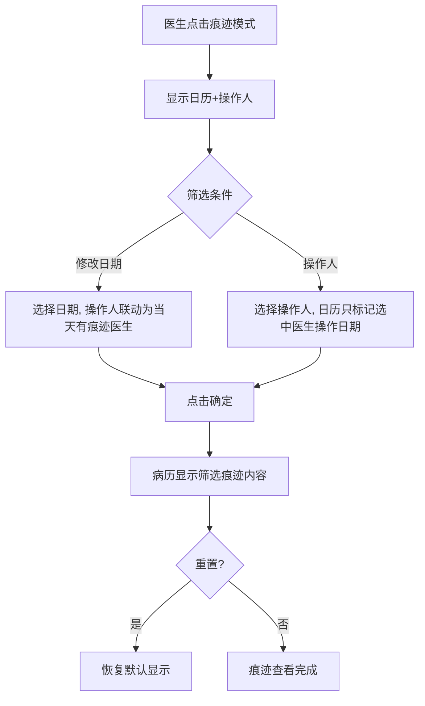
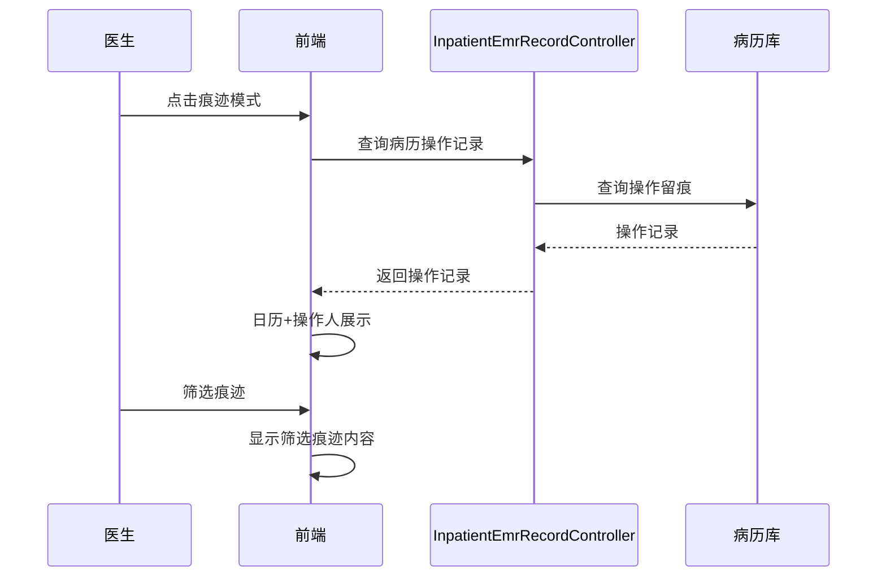

# BLGL-01-BLSX-010 痕迹与修改历史_Analyst-Spec

> **需求编号**：BLGL-01-BLSX-010
> **父需求**：BLGL-01-BLSX
> **关联PM Spec**：BLGL-01-BLSX-010_痕迹与修改历史_PM-spec.md
> **Spec版本**：V1.0
> **编写时间**：2026-08-15
> **编写人**：需求分析师

---

## 一、功能编号体系

### 1.1 功能层级结构

```
BLGL-01-BLSX-010-001: 痕迹模式查看
  ├─ BLGL-01-BLSX-010-001-01: 痕迹模式（只读查看）
  ├─ BLGL-01-BLSX-010-001-02: 日历+操作人展示
  └─ BLGL-01-BLSX-010-001-03: 浅蓝底色标识修改日期

BLGL-01-BLSX-010-002: 痕迹筛选
  ├─ BLGL-01-BLSX-010-002-01: 按修改日期筛选
  ├─ BLGL-01-BLSX-010-002-02: 按操作人筛选
  ├─ BLGL-01-BLSX-010-002-03: 日期/操作人联动
  ├─ BLGL-01-BLSX-010-002-04: 重置
  └─ BLGL-01-BLSX-010-002-05: 确定显示筛选痕迹

BLGL-01-BLSX-010-003: 痕迹增强
  ├─ BLGL-01-BLSX-010-003-01: 操作人职称显示
  ├─ BLGL-01-BLSX-010-003-02: 删除线内容复制
  └─ BLGL-01-BLSX-010-003-03: 痕迹比对

BLGL-01-BLSX-010-004: 修改历史
  ├─ BLGL-01-BLSX-010-004-01: 修改历史查询
  ├─ BLGL-01-BLSX-010-004-02: 修改历史导出
  └─ BLGL-01-BLSX-010-004-03: 修改人列表
```

### 1.2 功能编号表

| REQ-ID | 功能名称 | 类型 | 优先级 | 说明 |
|--------|---------|------|--------|------|
| BLGL-01-BLSX-010-001 | 痕迹模式查看 | 功能 | P0 | 只读查看病历修改历史，不能录入/保存 |
| BLGL-01-BLSX-010-001-01 | 痕迹模式 | 子功能 | P0 | 只读查看，浅蓝底色标识修改日期 |
| BLGL-01-BLSX-010-001-02 | 日历+操作人展示 | 子功能 | P0 | 默认显示所有修改日期及操作人 |
| BLGL-01-BLSX-010-002 | 痕迹筛选 | 功能 | P0 | 按日期/操作人联动筛选 |
| BLGL-01-BLSX-010-002-01 | 按修改日期筛选 | 子功能 | P0 | 日期单选 |
| BLGL-01-BLSX-010-002-02 | 按操作人筛选 | 子功能 | P0 | 操作人多选 |
| BLGL-01-BLSX-010-002-03 | 日期/操作人联动 | 子功能 | P0 | 日期和操作人联动 |
| BLGL-01-BLSX-010-002-04 | 重置 | 子功能 | P1 | 恢复默认显示 |
| BLGL-01-BLSX-010-002-05 | 确定显示筛选痕迹 | 子功能 | P0 | 病历显示筛选痕迹内容 |
| BLGL-01-BLSX-010-003 | 痕迹增强 | 功能 | P1 | 操作人职称/删除线复制/痕迹比对 |
| BLGL-01-BLSX-010-003-01 | 操作人职称显示 | 子功能 | P1 | 姓名（工号）+职级 |
| BLGL-01-BLSX-010-003-02 | 删除线内容复制 | 子功能 | P1 | 红色删除线内容可复制 |
| BLGL-01-BLSX-010-003-03 | 痕迹比对 | 子功能 | P1 | 痕迹1/痕迹2对比 |
| BLGL-01-BLSX-010-004 | 修改历史 | 功能 | P1 | 查询/导出/修改人列表 |
| BLGL-01-BLSX-010-004-01 | 修改历史查询 | 子功能 | P1 | 病历操作记录查询 |
| BLGL-01-BLSX-010-004-02 | 修改历史导出 | 子功能 | P1 | 病历操作记录导出 |
| BLGL-01-BLSX-010-004-03 | 修改人列表 | 子功能 | P1 | 病历修改人列表查询 |

---

## 二、核心业务流程

### 2.1 痕迹查看主流程



### 2.2 痕迹查看时序



---

## 三、功能规格说明


### BLGL-01-BLSX-010-001: 痕迹模式查看

#### 3.1.1 功能概述

痕迹模式支持查看病历修改历史，不能进行录入/保存，只支持查看；显示日历+操作人，浅蓝底色标识修改日期。

#### 3.1.2 用户角色

| 角色 | 使用场景 | 权限要求 | 操作频率 |
|------|---------|---------|---------|
| 住院医师 | 查看病历修改历史 | 病历查看权限 | 中频 |
| 质控科 | 痕迹模式查看操作人职称 | 质控查看权限 | 低频 |

#### 3.1.3 业务流程（Given/When/Then）

##### 主流程

**Scenario 1: 痕迹模式查看**

```gherkin
Given:
- 病历存在修改历史

When:
- 医生点击"痕迹模式"

Then:
- 显示日历+操作人
- 默认显示所有修改日期及操作人，修改日期浅蓝底色标识
- 不能录入/保存，只支持查看
```

##### 异常流程

**Scenario 2: 业务异常——无修改历史**

```gherkin
Given:
- 病历无修改历史

When:
- 医生点击痕迹模式

Then:
- 无痕迹可显示
```

**Scenario 3: 数据异常——操作留痕缺失**

```gherkin
Given:
- 部分操作未留痕

When:
- 医生查看痕迹

Then:
- 仅显示已留痕操作
```

**Scenario 4: 系统异常——快照查询接口异常**

```gherkin
Given:
- 快照查询接口异常

When:
- 医生查看痕迹

Then:
- 痕迹不展示，提示可重试
```

##### 边界流程

**Scenario 5: 边界——痕迹只读**

```gherkin
Given:
- 痕迹模式打开

When:
- 医生尝试录入/保存

Then:
- 不允许操作，只支持查看
```

#### 3.1.5 验收标准

| AC编号 | 验收标准 | 对应REQ-ID | 验证方法 | 验证场景 |
|--------|---------|-----------|---------|---------|
| AC-001 | 痕迹模式只读查看，浅蓝底色标识修改日期 | BLGL-01-BLSX-010-001 | 功能测试 | Scenario 1 |
| AC-002 | 痕迹模式不能录入/保存 | BLGL-01-BLSX-010-001 | 功能测试 | Scenario 5 |


### BLGL-01-BLSX-010-002: 痕迹筛选

#### 3.2.1 功能概述

按修改日期（单选）和操作人（多选）联动筛选，重置恢复默认，确定显示筛选痕迹。

#### 3.2.2 用户角色

| 角色 | 使用场景 | 权限要求 | 操作频率 |
|------|---------|---------|---------|
| 住院医师 | 筛选痕迹 | 病历查看权限 | 中频 |

#### 3.2.3 业务流程（Given/When/Then）

##### 主流程

**Scenario 1: 按修改时间及记录人查询**

```gherkin
Given:
- 医生打开痕迹模式查询弹窗

When:
- 选择修改日期（单选）
- 选择操作人（多选）

Then:
- 日期和操作人联动
- 选择日期后操作人下拉更换为当天有痕迹的医生
- 选择医生后日历只标记选中医生操作日期
- 点击确定，病历显示筛选痕迹内容
```

##### 异常流程

**Scenario 2: 业务异常——当天无痕迹医生**

```gherkin
Given:
- 选中某日期

When:
- 医生查看操作人下拉

Then:
- 操作人下拉更换为当天有痕迹的所有医生
```

**Scenario 3: 数据异常——选中医生无操作日期**

```gherkin
Given:
- 选中某医生

When:
- 医生查看日历

Then:
- 日历只标记选中医生进行过操作的日期
```

##### 边界流程

**Scenario 4: 边界——重置**

```gherkin
Given:
- 医生已筛选痕迹

When:
- 点击重置

Then:
- 恢复为默认显示（所有修改日期及操作人）
```

**Scenario 5: 边界——确定**

```gherkin
Given:
- 医生已筛选

When:
- 点击确定

Then:
- 关闭弹窗，病历里显示筛选出的痕迹内容
```

#### 3.2.5 验收标准

| AC编号 | 验收标准 | 对应REQ-ID | 验证方法 | 验证场景 |
|--------|---------|-----------|---------|---------|
| AC-001 | 日期/操作人联动筛选，确定后显示筛选痕迹 | BLGL-01-BLSX-010-002 | 功能测试 | Scenario 1 |
| AC-002 | 点击重置恢复默认显示 | BLGL-01-BLSX-010-002 | 功能测试 | Scenario 4 |


### BLGL-01-BLSX-010-003: 痕迹增强

#### 3.3.1 功能概述

操作人职称显示、删除线内容复制、痕迹比对。

#### 3.3.2 用户角色

| 角色 | 使用场景 | 权限要求 | 操作频率 |
|------|---------|---------|---------|
| 质控科 | 查看操作人职称 | 质控查看权限 | 低频 |
| 住院医师 | 复制删除线内容/痕迹比对 | 病历查看权限 | 中频 |

#### 3.3.3 业务流程（Given/When/Then）

##### 主流程

**Scenario 1: 操作人职称显示**

```gherkin
Given:
- 质控科要求痕迹模式显示操作人员的专业技术职称

When:
- 医生在查询弹框操作人下拉选择

Then:
- 操作人下拉新增人员的职级
- 下拉格式：姓名（工号）+职级
```

##### 异常流程

**Scenario 2: 数据异常——删除线内容复制**

```gherkin
Given:
- 病历日志管理和痕迹模式中划红色删除线的内容

When:
- 医生复制删除线内容

Then:
- 支持复制删除的痕迹内容
```

##### 边界流程

**Scenario 3: 边界——痕迹比对**

```gherkin
Given:
- 存在两份痕迹快照

When:
- 医生打开痕迹比对弹窗

Then:
- 展示痕迹1/痕迹2对比
```

#### 3.3.5 验收标准

| AC编号 | 验收标准 | 对应REQ-ID | 验证方法 | 验证场景 |
|--------|---------|-----------|---------|---------|
| AC-001 | 操作人下拉显示姓名（工号）+职级 | BLGL-01-BLSX-010-003 | 功能测试 | Scenario 1 |
| AC-002 | 删除线内容可复制 | BLGL-01-BLSX-010-003 | 功能测试 | Scenario 2 |


### BLGL-01-BLSX-010-004: 修改历史

#### 3.4.1 功能概述

病历操作记录查询/导出、修改人列表查询。

#### 3.4.2 用户角色

| 角色 | 使用场景 | 权限要求 | 操作频率 |
|------|---------|---------|---------|
| 住院医师 | 查看修改历史 | 病历查看权限 | 中频 |

#### 3.4.3 业务流程（Given/When/Then）

##### 主流程

**Scenario 1: 修改历史查询**

```gherkin
Given:
- 病历存在操作记录

When:
- 医生查询病历操作记录

Then:
- 展示操作记录（操作人/时间/内容）
```

##### 异常流程

**Scenario 2: 数据异常——无操作记录**

```gherkin
Given:
- 病历无操作记录

When:
- 医生查询

Then:
- 操作记录为空
```

**Scenario 3: 系统异常——查询接口异常**

```gherkin
Given:
- 操作记录查询接口异常

When:
- 医生查询

Then:
- 不展示，提示可重试
```

##### 边界流程

**Scenario 4: 边界——修改历史导出**

```gherkin
Given:
- 病历存在操作记录

When:
- 医生导出病历操作记录

Then:
- 导出操作记录
```

**Scenario 5: 边界——修改人列表**

```gherkin
Given:
- 病历被多人修改

When:
- 医生查询修改人列表

Then:
- 展示病历修改人列表
```

#### 3.4.5 验收标准

| AC编号 | 验收标准 | 对应REQ-ID | 验证方法 | 验证场景 |
|--------|---------|-----------|---------|---------|
| AC-001 | 修改历史查询/导出成功 | BLGL-01-BLSX-010-004 | 功能测试 | Scenario 1/4 |


---

## 四、排除范围

本需求不包含以下功能项：

1. **病历编辑与保存 —— BLGL-01-BLSX-002**
2. **病历签署/提交/审签 —— BLGL-01-BLSX-003/004/005**
3. **手术记录 —— BLGL-01-BLSX-006**
4. **书写任务与时限提醒 —— BLGL-01-BLSX-007**
5. **病历数据引用 —— BLGL-01-BLSX-009**

---

## 五、业务规则清单

| 规则ID | 规则名称 | 规则描述 | 来源 | 优先级 |
|--------|---------|---------|------|--------|
| BR-001 | 痕迹只读 | 痕迹模式支持查看病历修改历史，不能进行录入、保存，只支持查看 | 功能清单 | P0 |
| BR-002 | 痕迹筛选联动 | 痕迹记录按照修改时间及记录人来查询显示，日期单选、操作人多选，日期和操作人联动 | 需求 | P0 |
| BR-003 | 浅蓝底色标识 | 修改日期通过浅蓝底色进行标识 | 需求 | P0 |
| BR-004 | 重置 | 点击重置，恢复为默认显示 | 需求 | P1 |
| BR-005 | 操作人职称 | 痕迹模式查询弹框操作人下拉新增人员的职级，下拉格式：姓名（工号）+职级 | 需求 | P1 |
| BR-006 | 删除线复制 | 病历日志管理和痕迹模式中划红色删除线的内容要可以复制出来 | 需求 | P1 |

---

## 六、关联文档

| 文档类型 | 文档路径 | 说明 |
|---------|---------|------|
| PM-Spec（业务视角） | 本目录 BLGL-01-BLSX-010_痕迹与修改历史_PM-spec.md（V0.1） | PM 产出的 Spec 文档 |
| Spec（研发视角） | 本目录 BLGL-01-BLSX-010_痕迹与修改历史-Spec.md（V1.0） | 业务背景与目标 Spec |
| 功能点Spec（模块级） | BLGL-01-BLSX 01病历书写功能点Spec.md（V1.0，上级目录） | Phase 1 功能点索引 |
| data-model.md | 待产出 | 架构师产出的数据建模文档 |
| design.md | 待产出 | 架构师产出的技术方案文档 |
| api-contract.md | 待产出 | 开发经理产出的 API 契约文档 |

---

## 七、待确认问题清单

| 编号 | 问题描述 | 缺失信息 | 影响范围 | 建议补充方 |
|------|---------|---------|---------|-----------|
| Q-001 | 操作记录接口完整入参/出参字段结构 | API 契约文档 | -Spec 第5章、Analyst-Spec 数据字段 | 开发经理 |
| Q-002 | 性能指标（痕迹加载响应） | 非功能性需求 | 数据字段（概念ID） | 需求分析师 |
| Q-003 | 操作留痕的数据范围（哪些操作需留痕） | 设计文档 | 修改历史场景 | 架构师 |
| Q-004 | 痕迹快照的存储与版本机制 | 设计文档 | 痕迹比对场景 | 架构师 |

---

## 填写检查清单

| 序号 | 检查项 | 是否完成 |
|:----:|--------|:--------:|
| 1 | 功能编号带父子层级 | ✅ |
| 2 | 每个 REQ-ID 有功能概述和用户角色 | ✅ |
| 3 | 主流程至少 1 个 Given/When/Then 场景 | ✅ |
| 4 | 异常流程至少 3 个 Given/When/Then 场景 | ✅ |
| 5 | 边界流程至少 2 个 Given/When/Then 场景 | ✅ |
| 6 | 每个 Given/When/Then 内容具体，不模糊 | ✅ |
| 7 | 数据字段定义完整（字段名、类型、必填、说明、概念ID） | N/A |
| 8 | 验收标准 AC 编号独立，可验证 | ✅ |
| 9 | 验收标准无"功能正常"等模糊表述 | ✅ |
| 10 | 排除范围明确列出 | ✅ |
| 11 | 业务规则清单列出所有规则，每条标注来源 | ✅ |
| 12 | 流程图使用 Mermaid 格式（≥2 个） | ✅ |
| 13 | 关联文档索引包含 Phase 1 功能点Spec | ✅ |
| 14 | 待确认问题清单汇总了全文所有 ⏳ 项 | ✅ |
| 15 | 全文无占位符 `< >` 残留 | ✅ |
| 16 | 全文陈述可溯源至资料区（S1~S10 溯源核查） | ✅ |
| 17 | 人工审核确认完成 | ⏳ 待确认 |

---

**文档状态**：⬜ 待审核
**维护责任**：需求分析师规范组
**下次更新**：根据评审反馈优化

---

## 版本历史

| 版本 | 日期 | 变更说明 | 编写人 |
|------|------|---------|--------|
| V1.0 | 2026-08-15 | 初始版本 | 需求分析师 |