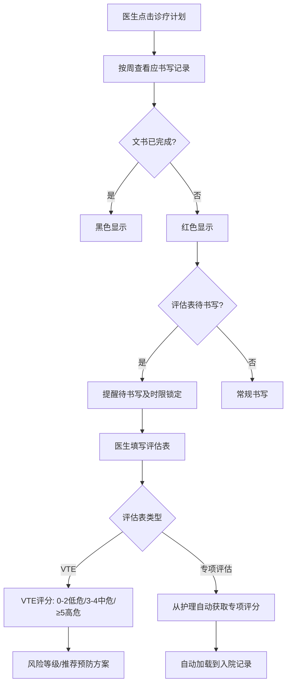
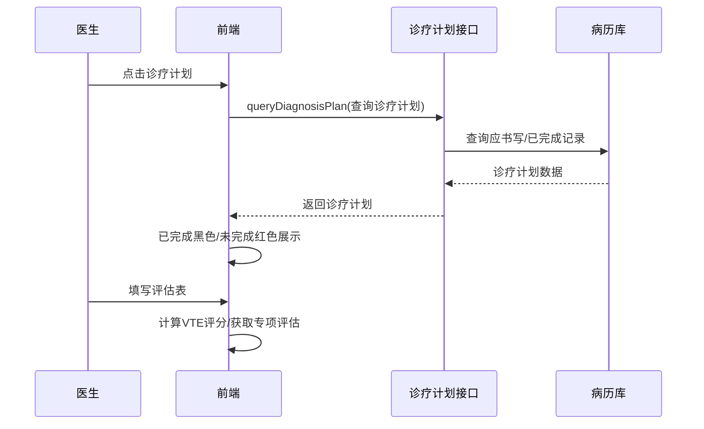

# BLGL-01-BLSX-011 诊疗计划与评估表 - Spec

> **功能编号**：BLGL-01-BLSX-011
> **文档类型**：功能Spec（业务背景与设计）
> **文档版本**：V1.0
> **编写时间**：2026-08-15
> **编写人**：RACC

---

## 文档索引

#### 章节索引

**Spec（研发视角）**

| 章节号 | 章节名称 | 内容说明 |
|--------|---------|---------|
| 1、 | 文档概述 | 文档目的、文档范围、术语定义、阅读指南、参考文档 |
| 2、 | 功能背景与定位 | 功能背景、功能定位、目标用户、核心价值 |
| 3、 | 业务流程设计 | 主流程/异常流程/边界流程（Given/When/Then） |
| 4、 | 数据模型设计 | 核心数据结构、状态定义、系统参数定义 |
| 5、 | 接口契约设计 | API列表、接口详细设计、错误码定义 |
| 6、 | 技术方案设计 | 页面路径、技术栈、关键技术点、部署方案 |
| 7、 | 测试用例预设计 | 功能/边界/异常/性能测试用例 |
| 8、 | 非功能性要求 | 性能、安全、可用性、兼容性 |
| 9、 | 依赖与风险 | 外部依赖、风险项 |
| 10、 | 附录 | 流程图、时序图、参考文档 |

**PM-Spec（业务视角）**

| 章节号 | 章节名称 | 内容说明 |
|--------|---------|---------|
| 一 | 目标 | 功能定位与核心价值 |
| 二 | 约束 | 业务/技术/非功能性约束 |
| 三 | 验收标准 | 验收条件与验证方法 |
| 四 | 排除范围 | 本次不做项与明确边界 |
| 五 | 关键决策记录 | 方案决策与选型理由 |
| 六 | 优先级 | 优先级定义 |
| 七 | 关联文档 | 关联文档索引 |
| 附录 | 填写检查清单 | 质量检查 |

**Analyst-Spec（产品视角）**

| 章节号 | 章节名称 | 内容说明 |
|--------|---------|---------|
| 一 | 功能编号体系 | 功能编号与层级结构 |
| 二 | 核心业务流程 | 核心业务流程与时序 |
| 三 | 功能规格说明 | 详细功能规格与验收标准 |
| 四 | 排除范围 | 排除范围 |
| 五 | 业务规则清单 | 业务规则清单 |
| 六 | 关联文档 | 关联文档索引 |
| 七 | 待确认问题清单 | 待确认问题汇总 |
| - | 填写检查清单 | 质量检查 |

#### 版本历史

| 版本 | 日期 | 变更说明 | 编写人 |
|------|------|---------|--------|
| V1.0 | 2026-08-15 | 初始版本 | RACC |

#### 关联文档索引

| 序号 | 文档名称 | 文档类型 | 版本 | 位置 |
|------|---------|---------|------|------|
| 1 | BLGL-01-BLSX-011_诊疗计划与评估表_PM-spec.md | PM-Spec（业务视角） | V0.1 | 本目录 |
| 2 | BLGL-01-BLSX-011_诊疗计划与评估表_Analyst-spec.md | Analyst-Spec（产品视角） | V1.0 | 本目录 |
| 3 | BLGL-01-BLSX-011_诊疗计划与评估表-Spec.md | Spec（研发视角）（本文档） | V1.0 | 本目录 |
| 4 | BLGL-01-BLSX 01病历书写功能点Spec.md | 功能点Spec（模块级） | V1.0 | 上级目录 |

---

## 1、文档概述

### 1.1、文档目的

本文档旨在明确"诊疗计划与评估表"功能（BLGL-01-BLSX-011）的业务背景与设计方案，为需求分析、研发实现、测试验收及评审提供统一的业务上下文、设计口径与决策依据。

### 1.2、文档范围

#### 1.2.1 纳入范围

本文档覆盖诊疗计划与评估表的完整业务背景与设计，包括：

- 诊疗计划：按周/起始时间查看患者每天应书写记录，默认显示本周内需要完成和已完成的书写文书（已完成黑色、未完成红色）
- 诊疗计划显示开关：加载病历时默认显示诊疗计划或最后一次记录
- 评估表创建触发待书写：新增监控类型"评估表"，营养风险筛查表等提醒待书写及时限锁定
- 评估表评分：VTE评分（0-2低危/3-4中危/≥5高危）、CHA2DS2-VASC评分表、HAS-BLED评分表
- 专项评估自动获取：入院记录专项评分从护理文书（医慧）自动获取

#### 1.2.2 排除范围

本文档不涉及以下内容（详见其他功能点或模块）：

- 病历创建与模板管理 —— BLGL-01-BLSX-001
- 病历编辑与保存 —— BLGL-01-BLSX-002
- 病历签署/提交/审签 —— BLGL-01-BLSX-003/004/005
- 手术记录 —— BLGL-01-BLSX-006
- 书写任务与时限提醒 —— BLGL-01-BLSX-007

### 1.3、术语定义

| 术语 | 定义 |
|------|------|
| 诊疗计划 | 按周、起始时间查看患者每天应书写记录以及添加已完成的记录 |
| 评估表 | 病历监控类型，如VTE风险评估表、营养风险筛查表、CHA2DS2-VASC评分表、HAS-BLED评分表 |
| VTE评分 | 静脉血栓栓塞风险评估，0-2低危/3-4中危/≥5高危 |

### 1.4、阅读指南

- **章节关系**：第1~2章为业务全貌，第3~10章为设计实现层。与 Analyst-Spec、PM-Spec 互相引用保持一致。
- **读者对象**：产品经理/需求分析师读第1~2章；研发读第3~6、9~10章；测试读第3、7~8章；评审人员核对各层一致性。

### 1.5、参考文档

| 序号 | 文档名称 | 版本/日期 |
|------|---------|----------|
| 1 | 【历史需求】住院病历的历史需求.xlsx | - |
| 2 | BLGL-01-BLSX-011_诊疗计划与评估表_PM-spec.md | V0.1 |
| 3 | BLGL-01-BLSX-011_诊疗计划与评估表_Analyst-spec.md | V1.0 |
| 4 | BLGL-01-BLSX 01病历书写功能点Spec.md | V1.0 |
| 5 | 病历书写_功能清单_20260327_151500.md | 2026-03-27 |

---

## 2、功能背景与定位

### 2.1 功能背景

诊疗计划与评估表是病历书写的计划与评估功能，需满足：

- **管理要求**：临床医师通过诊疗计划查看患者每天应书写记录及已完成的记录
- **临床安全**：VTE风险评估、CHA2DS2-VASC评分表、HAS-BLED评分表等评估表识别风险
- **历史需求演进**：从诊疗计划 → 评估表监控类型 → VTE评分标准 → 产科VTE评估表传床头卡 → 专项评估从护理自动获取

### 2.2 功能定位

"诊疗计划与评估表"是 WiNEX 病历管理-病历书写的计划评估功能点，定位为：

- **诊疗计划**：按周查看患者应书写记录及已完成状态
- **评估表体系**：VTE/CHA2DS2-VASC/HAS-BLED等评估表
- **评估数据来源**：专项评分从护理自动获取

### 2.3 目标用户

| 用户角色 | 主要使用场景 |
|---------|-------------|
| 住院医师 | 诊疗计划查看、评估表填写 |
| 护士 | 特定评估表创建（入院评估单等） |

### 2.4 核心价值

| 价值维度 | 价值描述 |
|---------|---------|
| 计划可视 | 诊疗计划可视化待书写/已完成状态 |
| 风险识别 | 评估表评分识别患者风险（VTE等） |
| 数据自动获取 | 专项评分从护理自动获取降低录入 |

---

## 3、业务流程设计（Given/When/Then）

### 3.1 主流程

**Scenario 1: 诊疗计划查看**

```gherkin
Given:
- 参数"是否显示诊疗计划"已开启

When:
- 医生点击诊疗计划目录区域

Then:
- 打开诊疗计划
- 按周/起始时间查看患者每天应书写记录
- 默认显示本周内需要完成和已完成的书写文书，已完成黑色，未完成红色
```

**Scenario 2: VTE评估表评分**

```gherkin
Given:
- 医生填写VTE风险评估表

When:
- 医生根据风险因素计算总分

Then:
- 0-2分 低危（健康宣教，早期活动）
- 3-4分 中危（建议行下肢静脉超声检查；物理预防或药物预防）
- ≥5分 高危（建议行下肢静脉超声检查；物理预防和药物预防）
```

### 3.2 异常流程

**Scenario 3: 业务异常——评估表待书写提醒**

```gherkin
Given:
- 新增监控类型"评估表"
- 营养风险筛查表需待书写提醒

When:
- 医生查看待书写

Then:
- 评估表类似入院记录一样，提醒待书写及时限锁定
```

**Scenario 4: 数据异常——专项评估从护理获取失败**

```gherkin
Given:
- 参数"专项评估项目的数值是否从护理获取"为是
- 医慧系统无数据

When:
- 医生刷新获取

Then:
- 专项评估为空，可手动录入
```

**Scenario 5: 系统异常——VTE接口异常**

```gherkin
Given:
- VTE评估接口异常

When:
- 医生计算VTE评分

Then:
- 评分计算失败，可重试
```

### 3.3 边界流程

**Scenario 6: 边界——诊疗计划显示开关**

```gherkin
Given:
- 参数"加载病历时默认显示诊疗计划或最后一次记录"已配置

When:
- 医生加载病历

Then:
- 默认显示诊疗计划（0）或最后一次记录（1）
```

**Scenario 7: 边界——产科VTE评估表传床头卡**

```gherkin
Given:
- 产科VTE评估表填写提交

When:
- 判断评分属于哪个风险等级

Then:
- 传给床卡，床卡显示VTE等级标签
```

---

## 4、数据模型设计

### 4.1 核心数据结构

#### 4.1.1 核心查询入参（诊疗计划）

| 字段名 | 类型 | 必填 | 备注 |
|--------|------|------|------|
| encounterId | Long | 是 | 就诊标识 |
| 周数 | Int | 否 | 周数 |
| 起始时间 | Date | 否 | 起始时间 |

#### 4.1.2 核心表/实体

| 表/实体 | 关键字段 | 说明 |
|---------|---------|------|
| 诊疗计划数据 | 周数、应书写记录、已完成记录 | 诊疗计划 |
| VTE评估表 | 风险因素、总分、风险等级 | VTE评分 |
| 专项评估数据 | 疼痛/VTE/营养/心理/功能评分 | 从护理获取 |
| INP_EMR_SET_CHART_ASSESS（InpatientEmrSetChartPO） | 评分评估相关字段 | 评估表数据 |

### 4.2 状态定义

| 状态码 | 状态名称 | 说明 |
|--------|---------|------|
| 已完成 | 已书写 | 已完成黑色 |
| 未完成 | 未书写 | 未完成红色 |
| 低危/中危/高危 | VTE风险等级 | 0-2低危/3-4中危/≥5高危 |

### 4.3 系统参数定义

| 参数编码 | 参数名称 | 说明 |
|---------|---------|------|
| 待确认 | 是否显示诊疗计划 | 默认停用；开启后诊疗计划目录区域点击即打开 |
| 待确认 | 加载病历时默认显示诊疗计划或最后一次记录 | 诊疗计划-0 最后一次记录-1，默认诊疗计划 |
| 待确认 | 专项评估项目的数值是否从护理获取 | {是，否}，默认否 |
| 待确认 | 体表面积公式计算方式 | 方式1/方式2，默认方式1 |

---

## 5、接口契约设计

### 5.1 API列表

| 序号 | API名称（代码函数） | 路径 | 方法 | 说明 |
|:----:|---------|------|:----:|------|
| 1 | queryDiagnosisPlan | /api/v1/app_record_inpatient/emr_inpatient_diagnosis_plan/by_example | POST | 诊疗计划查询 |
| 2 | queryDiagnosisPlanDate | /api/v1/app_record_inpatient/emr_inpatient_diagnosis_plan_range/by_example | POST | 诊疗计划时间查询 |
| 3 | queryVteLevelConfig | /api/v1/app_record_mdm/inp_emr_vte_scale_config/query | POST | VTE等级配置查询 |
| 4 | getVteScore | 获取VTE评分 | POST | VTE评分 |
| 5 | queryVteValue | /api/v1/app_record_inpatient/emr_inpatient/content/data_element/query | POST | 查询VTE数据元值 |
| 6 | getRiskGrade | /api/v1/app_record_inpatient/emr_inpatient/chart_assess_code/by_example | POST | 获取风险等级 |
| 7 | queryInpEmrInCompleteDocForDiagnosisPlan | /api/v1/app_record_inpatient/emr_inpatient_emr_set_cmd/by_example | POST | 待书写/病历数据查询-诊疗计划 |

### 5.2 接口详细设计

#### 5.2.1 查询诊疗计划

**请求参数**:
```json
{
  "encounterId": "就诊标识",
  "周数": "周数（可选）",
  "起始时间": "起始时间（可选）"
}
```

**返回值（成功）**:
```json
{
  "success": true,
  "data": [
    {
      "日期": "应书写日期",
      "应书写文书": "入院记录等",
      "已完成": true
    }
  ]
}
```

**返回值（失败）**:
```json
{
  "success": false,
  "message": "<错误信息>",
  "data": null
}
```

> 📌 请求/返回字段结构以 API 契约文档为准

### 5.3 错误码定义

| 错误码 | 错误信息 | 处理方式 |
|--------|---------|---------|
| 待确认 | 专项评估获取失败 | 专项评估为空可手动录入 |
| 待确认 | VTE评分计算失败 | 提示可重试 |

---

## 6、技术方案设计

### 6.1 页面路径

- **页面路径**: 住院医生站→住院病历书写界面→诊疗计划（EmrCreatorAndWrite/components/DiagnosisPlan）
- **组件**：DiagnosisPlan/index.vue（诊疗计划）、writed.vue（已写）/writing.vue（书写中）/writeDay.vue（按天）、AuxiliaryOnVTE（VTE评估）
- **核心逻辑模块**: InpEmrInCompleteDocController（待书写/诊疗计划）+ VTE相关接口

### 6.2 技术栈

| 类别 | 技术 | 版本 |
|------|------|------|
| 前端框架 | Vue | 2.6.14 |
| 前端UI | element-ui | 2.13.0 |
| 后端框架 | Spring Boot（Java） | 17 |

### 6.3 关键技术点

- 诊疗计划查询走 emr_inpatient_diagnosis_plan 系列接口
- 周数计算：住院天数/周期天数，不满一周按一周算
- VTE评分：0-2低危/3-4中危/≥5高危，推荐预防方案
- 专项评估：从医慧系统获取，患者入院后各项目初次评估分值和结果

### 6.4 部署方案

⏳ 待确认：部署方案未在资料区中找到。

---

## 7、测试用例预设计

### 7.1 功能测试

| 用例编号 | 测试场景 | Given | When | Then |
|---------|---------|-------|------|------|
| TC-001 | 诊疗计划查看 | 参数已开启 | 点击诊疗计划 | 按周查看，已完成黑色未完成红色 |
| TC-002 | VTE评分 | 医生填写风险因素 | 计算总分 | 0-2低危/3-4中危/≥5高危 |
| TC-003 | 评估表待书写提醒 | 新增评估表监控类型 | 查看待书写 | 营养风险筛查表提醒待书写及时限锁定 |

### 7.2 边界测试

| 用例编号 | 测试场景 | Given | When | Then |
|---------|---------|-------|------|------|
| TC-004 | 诊疗计划显示开关 | 参数已配置 | 加载病历 | 默认诊疗计划或最后一次记录 |
| TC-005 | 产科VTE传床头卡 | 产科VTE评估表提交 | 判断风险等级 | 床卡显示VTE等级标签 |
| TC-006 | 专项评估开关 | 参数为否 | 新建入院记录 | 不获取第三方数据 |

### 7.3 异常测试

| 用例编号 | 测试场景 | Given | When | Then |
|---------|---------|-------|------|------|
| TC-007 | 专项评估获取失败 | 医慧无数据 | 刷新获取 | 专项评估为空可手动录入 |
| TC-008 | VTE接口异常 | 接口异常 | 计算评分 | 提示可重试 |

### 7.4 性能测试

| 用例编号 | 测试场景 | 指标 |
|---------|---------|------|
| TC-009 | 诊疗计划加载响应 | ⏳ 待确认：性能指标未在资料区中找到 |

---

## 8、非功能性要求

### 8.1 性能要求

| 指标 | 要求 |
|------|------|
| 诊疗计划加载响应时间 | ⏳ 待确认 |

### 8.2 安全要求

| 要求 | 说明 |
|------|------|
| 专项评估数据 | 从护理系统获取，按患者范围隔离 |

**医疗行业特殊要求**

| 要求 | 说明 |
|------|------|
| VTE风险评估准确性 | 评分标准与推荐预防方案 |
| 风险识别 | 评估表识别患者风险 |

### 8.3 可用性要求

| 指标 | 要求值 |
|------|--------|
| 可用性 | ⏳ 待确认 |

### 8.4 兼容性要求

| 类型 | 要求 |
|------|------|
| 评估表监控类型 | 新增评估表监控类型 |
| 体表面积公式 | 支持配置不同计算方式 |

---

## 9、依赖与风险

### 9.1 外部依赖

| 依赖项 | 说明 |
|--------|------|
| 护理系统（医慧） | 专项评估数据 |
| 床卡系统 | VTE等级标签 |

### 9.2 风险项

| 风险项 | 等级 | 说明 | 应对方案 |
|--------|------|------|---------|
| VTE评分标准差异 | 中 | 评分标准需医院配置 | VTE等级配置接口 |
| 专项评估数据依赖 | 中 | 依赖医慧接口 | 开关控制+手动录入 |
| 评估表监控类型扩展 | 低 | 评估表类型持续新增 | 监控类型配置化 |

---

## 10、附录

### 10.1 流程图



### 10.2 时序图



### 10.3 参考文档

- 病历书写_功能清单_20260327_151500.md（书写任务管理-书写任务展示）
- 【历史需求】住院病历的历史需求.xlsx
- BLGL-01-BLSX 01病历书写功能点Spec.md（V1.0，第5章 BLGL-01-BLSX-011 行）
- 关联Spec：BLGL-01-BLSX-011_诊疗计划与评估表_PM-spec.md、BLGL-01-BLSX-011_诊疗计划与评估表_Analyst-spec.md

---

## 填写检查清单

| 序号 | 检查项 | 是否完成 |
|:----:|--------|:--------:|
| 1 | 章节索引与正文章节一致 | ✅ |
| 2 | 版本历史记录完整 | ✅ |
| 3 | 关联文档索引已登记全部Spec | ✅ |
| 4 | 文档目的明确回答"为什么做/做成什么/怎么做" | ✅ |
| 5 | 纳入范围/排除范围清晰 | ✅ |
| 6 | 术语定义覆盖关键概念，从资料区可溯源 | ✅ |
| 7 | 参考文档已登记 | ✅ |
| 8 | 功能背景基于法规/规范/需求来源组织 | ✅ |
| 9 | 功能定位体现业务价值（3~5个定位点） | ✅ |
| 10 | 目标用户角色覆盖完整，在需求原文中有出处 | ✅ |
| 11 | 核心价值可陈述，与 Phase 1 口径一致 | ✅ |
| 12 | 业务流程：主流程≥1、异常≥3、边界≥2，Given/When/Then 具体 | ✅ |
| 13 | 数据模型：字段/表/状态/参数可溯源 | ✅ |
| 14 | 接口契约：API列表+详细设计+错误码齐全或标记待确认 | ✅ |
| 15 | 技术方案：页面路径/技术栈/关键点/部署方案或标记待确认 | ✅ |
| 16 | 测试用例：功能/边界/异常/性能覆盖 | ✅ |
| 17 | 非功能性要求：性能/安全/可用性/兼容性指标可量化或标记待确认 | ✅ |
| 18 | 依赖与风险：外部依赖登记完整 | ✅ |
| 19 | 附录：流程图/时序图与正文流程一致 | ✅ |
| 20 | 全文无占位符 `< >` 残留 | ✅ |
| 21 | 全文陈述可溯源至资料区 | ✅ |
| 22 | 人工审核确认完成 | ⏳ 待确认 |

---

**文档状态**：⬜ 待审核
**维护责任**：RACC
**下次更新**：根据评审反馈优化