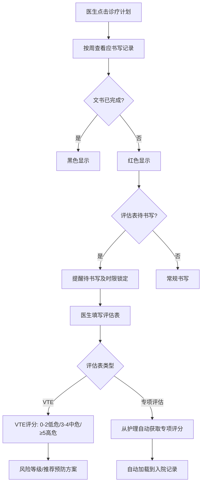
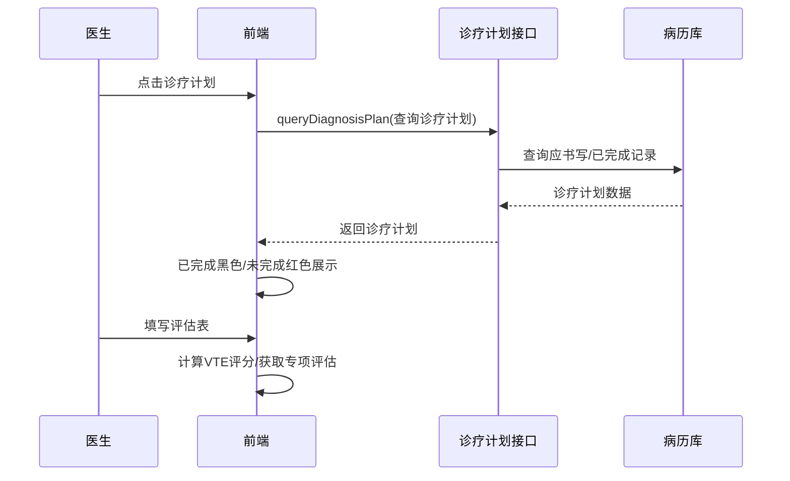

# BLGL-01-BLSX-011 诊疗计划与评估表 _ Analyst - Spec

> **需求编号**：BLGL-01-BLSX-011
> **父需求**：BLGL-01-BLSX
> **关联PM Spec**：BLGL-01-BLSX-011_诊疗计划与评估表_PM-spec.md
> **Spec版本**：V1.0
> **编写时间**：2026-08-15
> **编写人**：需求分析师

---

## 一、功能编号体系

### 1.1 功能层级结构

```
BLGL-01-BLSX-011-001: 诊疗计划
  ├─ BLGL-01-BLSX-011-001-01: 按周查看
  ├─ BLGL-01-BLSX-011-001-02: 已完成/未完成状态
  ├─ BLGL-01-BLSX-011-001-03: 周数计算
  └─ BLGL-01-BLSX-011-001-04: 诊疗计划显示开关

BLGL-01-BLSX-011-002: 评估表体系
  ├─ BLGL-01-BLSX-011-002-01: VTE风险评估表
  ├─ BLGL-01-BLSX-011-002-02: CHA2DS2-VASC评分表
  ├─ BLGL-01-BLSX-011-002-03: HAS-BLED评分表
  └─ BLGL-01-BLSX-011-002-04: 评估表监控类型

BLGL-01-BLSX-011-003: 评估表待书写提醒
  ├─ BLGL-01-BLSX-011-003-01: 营养风险筛查表待书写提醒
  └─ BLGL-01-BLSX-011-003-02: 评估表时限锁定

BLGL-01-BLSX-011-004: 专项评估自动获取
  ├─ BLGL-01-BLSX-011-004-01: 专项评分从护理获取
  ├─ BLGL-01-BLSX-011-004-02: 开关控制
  └─ BLGL-01-BLSX-011-004-03: 产科VTE传床头卡
```

### 1.2 功能编号表

| REQ-ID | 功能名称 | 类型 | 优先级 | 说明 |
|--------|---------|------|--------|------|
| BLGL-01-BLSX-011-001 | 诊疗计划 | 功能 | P0 | 按周查看应书写记录，已完成黑色未完成红色 |
| BLGL-01-BLSX-011-001-01 | 按周查看 | 子功能 | P0 | 按住院天数计算周数查看 |
| BLGL-01-BLSX-011-001-02 | 已完成/未完成状态 | 子功能 | P0 | 已完成黑色，未完成红色 |
| BLGL-01-BLSX-011-001-03 | 周数计算 | 子功能 | P0 | 住院天数/周期天数，不满一周按一周 |
| BLGL-01-BLSX-011-001-04 | 诊疗计划显示开关 | 子功能 | P1 | 默认显示诊疗计划或最后一次记录 |
| BLGL-01-BLSX-011-002 | 评估表体系 | 功能 | P0 | VTE/CHA2DS2-VASC/HAS-BLED评分表 |
| BLGL-01-BLSX-011-002-01 | VTE风险评估表 | 子功能 | P0 | 0-2低危/3-4中危/≥5高危 |
| BLGL-01-BLSX-011-002-02 | CHA2DS2-VASC评分表 | 子功能 | P1 | 新增监控类型 |
| BLGL-01-BLSX-011-002-03 | HAS-BLED评分表 | 子功能 | P1 | 新增监控类型 |
| BLGL-01-BLSX-011-002-04 | 评估表监控类型 | 子功能 | P1 | 营养风险筛查表等 |
| BLGL-01-BLSX-011-003 | 评估表待书写提醒 | 功能 | P1 | 营养风险筛查表提醒待书写及时限锁定 |
| BLGL-01-BLSX-011-003-01 | 营养风险筛查表待书写提醒 | 子功能 | P1 | 类似入院记录提醒待书写 |
| BLGL-01-BLSX-011-003-02 | 评估表时限锁定 | 子功能 | P1 | 时限锁定 |
| BLGL-01-BLSX-011-004 | 专项评估自动获取 | 功能 | P1 | 专项评分从护理获取/传床头卡 |
| BLGL-01-BLSX-011-004-01 | 专项评分从护理获取 | 子功能 | P1 | 疼痛/VTE/营养/心理/功能评分 |
| BLGL-01-BLSX-011-004-02 | 开关控制 | 子功能 | P1 | {是，否}默认否 |
| BLGL-01-BLSX-011-004-03 | 产科VTE传床头卡 | 子功能 | P1 | 床卡显示VTE等级标签 |

---

## 二、核心业务流程

### 2.1 诊疗计划与评估表主流程



### 2.2 诊疗计划时序



---

## 三、功能规格说明


### BLGL-01-BLSX-011-001: 诊疗计划

#### 3.1.1 功能概述

按周/起始时间查看患者每天应书写记录，默认显示本周内需要完成和已完成的书写文书（已完成黑色、未完成红色）。

#### 3.1.2 用户角色

| 角色 | 使用场景 | 权限要求 | 操作频率 |
|------|---------|---------|---------|
| 住院医师 | 诊疗计划查看 | 病历查看权限 | 高频 |

#### 3.1.3 业务流程（Given/When/Then）

##### 主流程

**Scenario 1: 诊疗计划查看**

```gherkin
Given:
- 参数"是否显示诊疗计划"已开启

When:
- 医生点击诊疗计划目录区域

Then:
- 打开诊疗计划
- 按周查看患者每天应书写记录
- 默认显示本周内需要完成和已完成的书写文书，已完成黑色，未完成红色
```

##### 异常流程

**Scenario 2: 业务异常——诊疗计划显示开关关闭**

```gherkin
Given:
- 参数"是否显示诊疗计划"默认停用

When:
- 医生打开病历

Then:
- 不显示诊疗计划
```

**Scenario 3: 数据异常——周数计算**

```gherkin
Given:
- 住院天数与周期天数

When:
- 计算住院周数

Then:
- 住院天数/周期天数=周数，不满一周按一周算
- 例：住院25天，周期7天，周数25/7+1=4周
```

**Scenario 4: 系统异常——诊疗计划查询接口异常**

```gherkin
Given:
- 诊疗计划查询接口异常

When:
- 医生点击诊疗计划

Then:
- 诊疗计划不展示，提示可重试
```

##### 边界流程

**Scenario 5: 边界——默认显示设置**

```gherkin
Given:
- 参数"加载病历时默认显示诊疗计划或最后一次记录"

When:
- 医生加载病历

Then:
- 默认显示诊疗计划（0）或最后一次记录（1）
```

**Scenario 6: 边界——展开诊疗计划隐藏辅助栏**

```gherkin
Given:
- 诊疗计划展开

When:
- 医生查看诊疗计划

Then:
- 左侧辅助栏隐藏
```

#### 3.1.5 验收标准

| AC编号 | 验收标准 | 对应REQ-ID | 验证方法 | 验证场景 |
|--------|---------|-----------|---------|---------|
| AC-001 | 诊疗计划按周展示，已完成黑色未完成红色 | BLGL-01-BLSX-011-001 | 功能测试 | Scenario 1 |
| AC-002 | 周数按住院天数/周期天数计算 | BLGL-01-BLSX-011-001 | 功能测试 | Scenario 3 |


### BLGL-01-BLSX-011-002: 评估表体系

#### 3.2.1 功能概述

VTE风险评估表、CHA2DS2-VASC评分表、HAS-BLED评分表等评估表监控类型。

#### 3.2.2 用户角色

| 角色 | 使用场景 | 权限要求 | 操作频率 |
|------|---------|---------|---------|
| 住院医师 | 评估表填写 | 病历书写权限 | 中频 |

#### 3.2.3 业务流程（Given/When/Then）

##### 主流程

**Scenario 1: VTE评估表评分**

```gherkin
Given:
- 医生填写VTE风险评估表

When:
- 医生根据风险因素计算总分

Then:
- 0-2分 低危（健康宣教，早期活动）
- 3-4分 中危（建议行下肢静脉超声检查；物理预防或药物预防）
- ≥5分 高危（建议行下肢静脉超声检查；物理预防和药物预防）
```

##### 异常流程

**Scenario 2: 数据异常——VTE评分标准配置**

```gherkin
Given:
- 参数"VTE等级配置"已配置

When:
- 医生计算评分

Then:
- 按配置的评分标准计算
```

**Scenario 3: 系统异常——VTE接口异常**

```gherkin
Given:
- VTE接口异常

When:
- 医生计算评分

Then:
- 评分失败，可重试
```

##### 边界流程

**Scenario 4: 边界——新增监控类型**

```gherkin
Given:
- 新增病历监控类型

When:
- 配置评估表类型

Then:
- CHA2DS2-VASC评分表、HAS-BLED评分表可配置
```

#### 3.2.5 验收标准

| AC编号 | 验收标准 | 对应REQ-ID | 验证方法 | 验证场景 |
|--------|---------|-----------|---------|---------|
| AC-001 | VTE评分0-2低危/3-4中危/≥5高危，对应预防方案 | BLGL-01-BLSX-011-002 | 功能测试 | Scenario 1 |
| AC-002 | CHA2DS2-VASC/HAS-BLED评分表可配置 | BLGL-01-BLSX-011-002 | 功能测试 | Scenario 4 |


### BLGL-01-BLSX-011-003: 评估表待书写提醒

#### 3.3.1 功能概述

新增监控类型"评估表"，营养风险筛查表等提醒待书写及时限锁定。

#### 3.3.2 用户角色

| 角色 | 使用场景 | 权限要求 | 操作频率 |
|------|---------|---------|---------|
| 住院医师 | 查看待书写提醒 | 病历书写权限 | 中频 |

#### 3.3.3 业务流程（Given/When/Then）

##### 主流程

**Scenario 1: 评估表待书写提醒**

```gherkin
Given:
- 新增监控类型"评估表"
- 营养风险筛查表

When:
- 医生查看待书写

Then:
- 评估表类似入院记录一样，提醒待书写及时限锁定
```

##### 异常流程

**Scenario 2: 数据异常——评估表未配置**

```gherkin
Given:
- 评估表监控类型未配置

When:
- 医生查看待书写

Then:
- 不提醒评估表待书写
```

##### 边界流程

**Scenario 3: 边界——时限锁定**

```gherkin
Given:
- 评估表已配置

When:
- 医生查看待书写

Then:
- 评估表纳入时限锁定
```

#### 3.3.5 验收标准

| AC编号 | 验收标准 | 对应REQ-ID | 验证方法 | 验证场景 |
|--------|---------|-----------|---------|---------|
| AC-001 | 评估表提醒待书写及时限锁定 | BLGL-01-BLSX-011-003 | 功能测试 | Scenario 1 |


### BLGL-01-BLSX-011-004: 专项评估自动获取

#### 3.4.1 功能概述

专项评分从护理（医慧）自动获取，开关控制，产科VTE传床头卡。

#### 3.4.2 用户角色

| 角色 | 使用场景 | 权限要求 | 操作频率 |
|------|---------|---------|---------|
| 住院医师 | 入院记录专项评分 | 病历书写权限 | 中频 |

#### 3.4.3 业务流程（Given/When/Then）

##### 主流程

**Scenario 1: 专项评估自动获取**

```gherkin
Given:
- 参数"专项评估项目的数值是否从护理获取"为是

When:
- 医生新建/刷新入院记录

Then:
- 从医慧系统自动获取专项评估数据（疼痛/VTE/营养/心理/功能评分）
- 自动加载到入院记录的专项评估汇总中
```

##### 异常流程

**Scenario 2: 业务异常——开关关闭**

```gherkin
Given:
- 参数为否（默认）

When:
- 医生新建/刷新入院记录

Then:
- 不获取第三方数据
```

**Scenario 3: 数据异常——第三方无数据**

```gherkin
Given:
- 医慧系统无该患者数据

When:
- 医生刷新获取

Then:
- 专项评估为空，可手动录入
```

**Scenario 4: 系统异常——第三方接口异常**

```gherkin
Given:
- 医慧接口异常

When:
- 医生刷新获取

Then:
- 获取失败，不阻断书写，可重试
```

##### 边界流程

**Scenario 5: 边界——产科VTE传床头卡**

```gherkin
Given:
- 产科VTE评估表填写提交

When:
- 判断评分属于哪个风险等级

Then:
- 传给床卡，床卡显示VTE等级标签
```

#### 3.4.5 验收标准

| AC编号 | 验收标准 | 对应REQ-ID | 验证方法 | 验证场景 |
|--------|---------|-----------|---------|---------|
| AC-001 | 参数开启时专项评估从护理自动获取 | BLGL-01-BLSX-011-004 | 集成测试 | Scenario 1 |
| AC-002 | 产科VTE评估表提交后床卡显示VTE等级标签 | BLGL-01-BLSX-011-004 | 集成测试 | Scenario 5 |


---

## 四、排除范围

本需求不包含以下功能项：

1. **病历创建与模板管理 —— BLGL-01-BLSX-001**
2. **病历编辑与保存 —— BLGL-01-BLSX-002**
3. **病历签署/提交/审签 —— BLGL-01-BLSX-003/004/005**
4. **手术记录 —— BLGL-01-BLSX-006**
5. **书写任务与时限提醒 —— BLGL-01-BLSX-007**
6. **诊疗计划显示开关参数 —— Phase 1 第6章 BC-BLSX-014**

---

## 五、业务规则清单

| 规则ID | 规则名称 | 规则描述 | 来源 | 优先级 |
|--------|---------|---------|------|--------|
| BR-001 | 诊疗计划颜色 | 诊疗计划默认显示本周内需要完成和已完成的书写文书，已完成黑色，未完成红色 | 需求 | P0 |
| BR-002 | 周数计算 | 住院天数/周期天数=周数，不满一周按一周算 | 需求 | P0 |
| BR-003 | VTE评分标准 | 0-2分低危、3-4分中危、≥5高危，对应推荐预防方案 | 需求 | P0 |
| BR-004 | 评估表监控类型 | 新增监控类型"评估表"，营养风险筛查表提醒待书写及时限锁定 | 需求 | P1 |
| BR-005 | 专项评估获取 | 专项评估项目数值从护理获取，开关{是，否}默认否；患者入院后各项目初次评估分值和结果 | 需求 | P1 |
| BR-006 | 诊疗计划开关 | 加载病历时默认显示诊疗计划（0）或最后一次记录（1） | 需求 | P1 |
| BR-007 | VTE传床头卡 | 产科VTE评估表填写提交后，判断评分风险等级传给床卡 | 需求 | P1 |

---

## 六、关联文档

| 文档类型 | 文档路径 | 说明 |
|---------|---------|------|
| PM-Spec（业务视角） | 本目录 BLGL-01-BLSX-011_诊疗计划与评估表_PM-spec.md（V0.1） | PM 产出的 Spec 文档 |
| Analyst-Spec（产品视角） | 本目录 BLGL-01-BLSX-011_诊疗计划与评估表_Analyst-spec.md（V1.0） | 本文档 |
| Spec（研发视角） | 本目录 BLGL-01-BLSX-011_诊疗计划与评估表-Spec.md（V1.0） | 业务背景与目标 Spec |
| 功能点Spec | BLGL-01-BLSX 01病历书写功能点Spec.md（V1.0，上级目录） | Phase 1 功能点索引 |
| data-model.md | 待产出 | 架构师产出的数据建模文档 |
| design.md | 待产出 | 架构师产出的技术方案文档 |
| api-contract.md | 待产出 | 开发经理产出的 API 契约文档 |

---

## 七、待确认问题清单

| 编号 | 问题描述 | 缺失信息 | 影响范围 | 建议补充方 |
|------|---------|---------|---------|-----------|
| Q-001 | 诊疗计划/评估表接口完整入参/出参字段结构 | API 契约文档 | -Spec 第5章、Analyst-Spec 数据字段（概念ID） | 开发经理 |
| Q-002 | 诊疗计划/评估表相关参数编码 | 参数配置说明表 | 数据字段（概念ID） | 产品经理 |
| Q-003 | 性能指标（诊疗计划加载响应） | 非功能性需求 | -Spec 第8章 | 需求分析师 |
| Q-004 | VTE评分标准的医院配置范围 | 配置文档 | VTE评分场景 | 产品经理 |
| Q-005 | 医慧系统专项评估接口契约 | 接口文档 | 专项评估场景 | 接口负责人 |

---

## 填写检查清单

| 序号 | 检查项 | 是否完成 |
|:----:|--------|:--------:|
| 1 | 功能编号带父子层级 | ✅ |
| 2 | 每个 REQ-ID 有功能概述和用户角色 | ✅ |
| 3 | 主流程至少 1 个 Given/When/Then 场景 | ✅ |
| 4 | 异常流程至少 3 个 Given/When/Then 场景 | ✅ |
| 5 | 边界流程至少 2 个 Given/When/Then 场景 | ✅ |
| 6 | 每个 Given/When/Then 内容具体，不模糊 | ✅ |
| 7 | 数据字段定义完整（字段名、类型、必填、说明、概念ID） | N/A |
| 8 | 验收标准 AC 编号独立，可验证 | ✅ |
| 9 | 验收标准无"功能正常"等模糊表述 | ✅ |
| 10 | 排除范围明确列出 | ✅ |
| 11 | 业务规则清单列出所有规则，每条标注来源 | ✅ |
| 12 | 流程图使用 Mermaid 格式（≥2 个） | ✅ |
| 13 | 关联文档索引包含 Phase 1 功能点Spec | ✅ |
| 14 | 待确认问题清单汇总了全文所有 ⏳ 项 | ✅ |
| 15 | 全文无占位符 `< >` 残留 | ✅ |
| 16 | 全文陈述可溯源至资料区（S1~S10 溯源核查） | ✅ |
| 17 | 人工审核确认完成 | ⏳ 待确认 |

---

**文档状态**：⬜ 待审核
**维护责任**：需求分析师规范组
**下次更新**：根据评审反馈优化

---

## 版本历史

| 版本 | 日期 | 变更说明 | 编写人 |
|------|------|---------|--------|
| V1.0 | 2026-08-15 | 初始版本 | 需求分析师 |