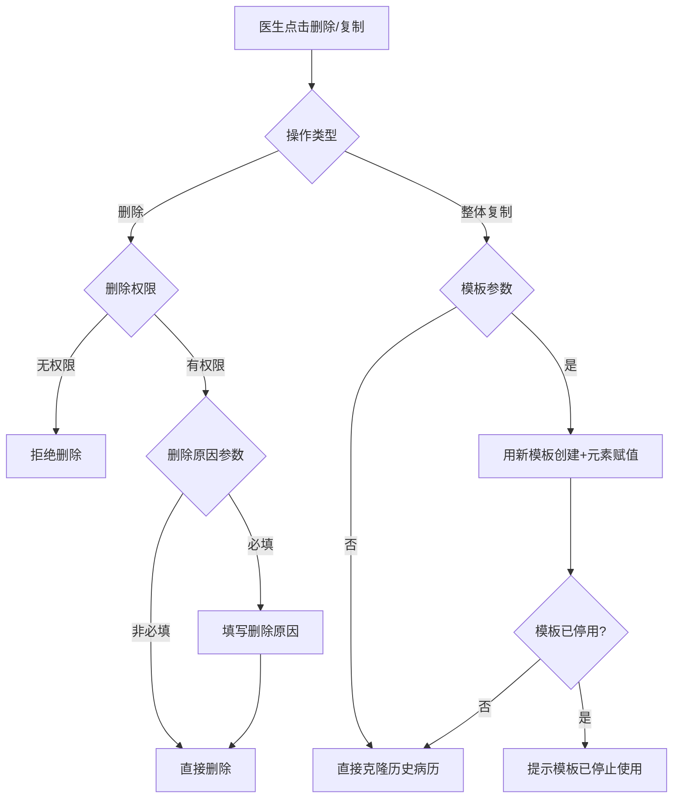
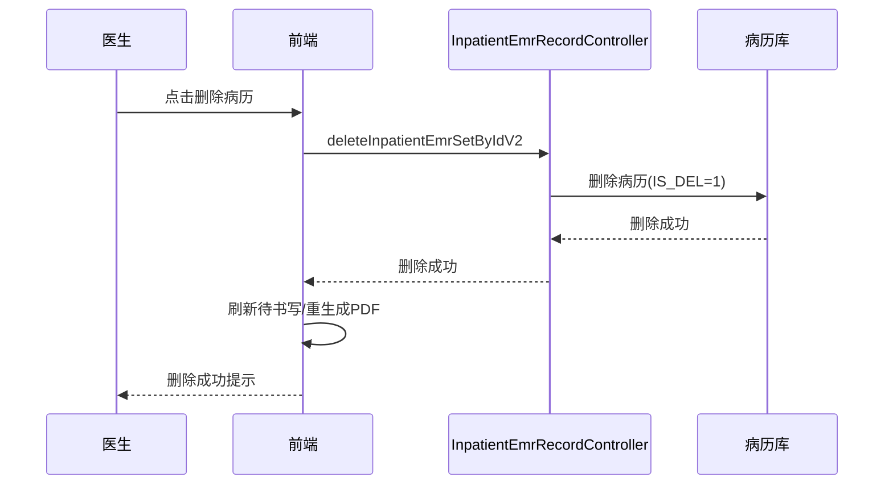

# BLGL-01-BLSX-012 病历删除与复制 - Spec

> **功能编号**：BLGL-01-BLSX-012
> **文档类型**：功能Spec（业务背景与设计）
> **文档版本**：V1.0
> **编写时间**：2026-08-15
> **编写人**：RACC

---

## 文档索引

#### 章节索引

**Spec（研发视角）**

| 章节号 | 章节名称 | 内容说明 |
|--------|---------|---------|
| 1、 | 文档概述 | 文档目的、文档范围、术语定义、阅读指南、参考文档 |
| 2、 | 功能背景与定位 | 功能背景、功能定位、目标用户、核心价值 |
| 3、 | 业务流程设计 | 主流程/异常流程/边界流程（Given/When/Then） |
| 4、 | 数据模型设计 | 核心数据结构、状态定义、系统参数定义 |
| 5、 | 接口契约设计 | API列表、接口详细设计、错误码定义 |
| 6、 | 技术方案设计 | 页面路径、技术栈、关键技术点、部署方案 |
| 7、 | 测试用例预设计 | 功能/边界/异常/性能测试用例 |
| 8、 | 非功能性要求 | 性能、安全、可用性、兼容性 |
| 9、 | 依赖与风险 | 外部依赖、风险项 |
| 10、 | 附录 | 流程图、时序图、参考文档 |

**PM-Spec（业务视角）**

| 章节号 | 章节名称 | 内容说明 |
|--------|---------|---------|
| 一 | 目标 | 功能定位与核心价值 |
| 二 | 约束 | 业务/技术/非功能性约束 |
| 三 | 验收标准 | 验收条件与验证方法 |
| 四 | 排除范围 | 本次不做项与明确边界 |
| 五 | 关键决策记录 | 方案决策与选型理由 |
| 六 | 优先级 | 优先级定义 |
| 七 | 关联文档 | 关联文档索引 |
| 附录 | 填写检查清单 | 质量检查 |

**Analyst-Spec（产品视角）**

| 章节号 | 章节名称 | 内容说明 |
|--------|---------|---------|
| 一 | 功能编号体系 | 功能编号与层级结构 |
| 二 | 核心业务流程 | 核心业务流程与时序 |
| 三 | 功能规格说明 | 详细功能规格与验收标准 |
| 四 | 排除范围 | 排除范围 |
| 五 | 业务规则清单 | 业务规则清单 |
| 六 | 关联文档 | 关联文档索引 |
| 七 | 待确认问题清单 | 待确认问题汇总 |
| - | 填写检查清单 | 质量检查 |

#### 版本历史

| 版本 | 日期 | 变更说明 | 编写人 |
|------|------|---------|--------|
| V1.0 | 2026-08-15 | 初始版本 | RACC |

#### 关联文档索引

| 序号 | 文档名称 | 文档类型 | 版本 | 位置 |
|------|---------|---------|------|------|
| 1 | BLGL-01-BLSX-012_病历删除与复制_PM-spec.md | PM-Spec（业务视角） | V0.1 | 本目录 |
| 2 | BLGL-01-BLSX-012_病历删除与复制_Analyst-spec.md | Analyst-Spec（产品视角） | V1.0 | 本目录 |
| 3 | BLGL-01-BLSX-012_病历删除与复制-Spec.md | Spec（研发视角）（本文档） | V1.0 | 本目录 |
| 4 | BLGL-01-BLSX 01病历书写功能点Spec.md | 功能点Spec（模块级） | V1.0 | 上级目录 |

---

## 1、文档概述

### 1.1、文档目的

本文档旨在明确"病历删除与复制"功能（BLGL-01-BLSX-012）的业务背景与设计方案，为需求分析、研发实现、测试验收及评审提供统一的业务上下文、设计口径与决策依据。

### 1.2、文档范围

#### 1.2.1 纳入范围

本文档覆盖病历删除与复制的完整业务背景与设计，包括：

- 病历删除：删除自己创建的病历，上级医师可删除下级医师创建的病历（参数控制），删除原因必填
- 病历批量删除：批量删除病历
- 病历克隆/复制：历史病历整体复制、病历间拖拽复制粘贴
- 病历替换：同类型病历只能创建一次时重复创建提示替换，替换后原内容同步到新病历相同概念ID元素
- 病历回收站：辅助录入既往病历展示本次住院已删除病历（参数控制）
- 起草者变更：开启病历起草者功能后，变更后起草者可编辑、提交、删除病历

#### 1.2.2 排除范围

本文档不涉及以下内容（详见其他功能点或模块）：

- 病历创建与模板管理 —— BLGL-01-BLSX-001
- 病历编辑与保存 —— BLGL-01-BLSX-002
- 病历签署/提交/审签 —— BLGL-01-BLSX-003/004/005
- 手术记录 —— BLGL-01-BLSX-006
- 书写任务与时限提醒 —— BLGL-01-BLSX-007

### 1.3、术语定义

| 术语 | 定义 |
|------|------|
| 病历删除 | 删除病历文书 |
| 病历克隆/复制 | 历史病历整体复制/病历间复制粘贴 |
| 病历替换 | 同类型病历只能创建一次时重复创建提示替换，替换后原内容同步 |
| 起草者变更 | 病历起草者变更功能 |

### 1.4、阅读指南

- **章节关系**：第1~2章为业务全貌，第3~10章为设计实现层。与 Analyst-Spec、PM-Spec 互相引用保持一致。
- **读者对象**：产品经理/需求分析师读第1~2章；研发读第3~6、9~10章；测试读第3、7~8章；评审人员核对各层一致性。

### 1.5、参考文档

| 序号 | 文档名称 | 版本/日期 |
|------|---------|----------|
| 1 | 【历史需求】住院病历的历史需求.xlsx | - |
| 2 | BLGL-01-BLSX-012_病历删除与复制_PM-spec.md | V0.1 |
| 3 | BLGL-01-BLSX-012_病历删除与复制_Analyst-spec.md | V1.0 |
| 4 | BLGL-01-BLSX 01病历书写功能点Spec.md | V1.0 |
| 5 | 病历书写_功能清单_20260327_151500.md | 2026-03-27 |

---

## 2、功能背景与定位

### 2.1 功能背景

病历删除与复制是病历书写的管理功能，需满足：

- **管理要求**：删除权限控制（自己创建/上级删除下级）、删除原因必填
- **现状痛点**：病历间复制粘贴不便、历史病历整体复制用旧模板、替换后数据不同步
- **历史需求演进**：从基础删除/克隆 → 病历间拖拽复制 → 整体复制优化 → 病历替换数据同步 → 起草者变更优化 → 回收站功能

### 2.2 功能定位

"病历删除与复制"是 WiNEX 病历管理-病历书写的管理功能点，定位为：

- **删除管控**：删除权限/删除原因/批量删除
- **复制能力**：病历间拖拽复制/整体复制
- **替换同步**：病历替换后内容同步到相同概念ID元素

### 2.3 目标用户

| 用户角色 | 主要使用场景 |
|---------|-------------|
| 住院医师 | 删除自己创建的病历、病历间复制粘贴 |
| 上级医师 | 删除下级医师创建的病历（参数控制） |
| 病历起草者 | 起草者变更后删除病历 |

### 2.4 核心价值

| 价值维度 | 价值描述 |
|---------|---------|
| 删除合规 | 删除权限/删除原因管控 |
| 书写效率 | 病历间复制粘贴/整体复制 |
| 数据一致 | 病历替换内容同步 |

---

## 3、业务流程设计（Given/When/Then）

### 3.1 主流程

**Scenario 1: 删除病历**

```gherkin
Given:
- 医生有删除权限（自己创建的病历或上级医师删除下级医师创建的病历）
- 参数"是否支持上级医师删除下级医师创建的病历"已配置

When:
- 医生点击删除病历

Then:
- 删除成功
- 若参数"已保存过的病历文书删除时，是否填写删除原因"为是，需填写删除原因
```

**Scenario 2: 历史病历整体复制**

```gherkin
Given:
- 参数"历史病历整体复制是否使用历史病历的最新病历模板"已配置

When:
- 医生发起历史病历整体复制

Then:
- 参数为否（默认）：整体复制直接克隆一份历史病历
- 参数为是：先用历史病历对应的病历模板创建病历，再把历史病历的元素内容赋值到新建病历上
```

### 3.2 异常流程

**Scenario 3: 业务异常——无删除权限**

```gherkin
Given:
- 医生非病历创建者且非上级医师
- 参数"是否支持上级医师删除下级医师创建的病历"为否

When:
- 医生尝试删除他人病历

Then:
- 拒绝删除
```

**Scenario 4: 数据异常——模板已停用**

```gherkin
Given:
- 历史病历模板已停用或删除
- 参数为是

When:
- 医生发起整体复制

Then:
- 提示"当前历史病历对应的病历模板已经停止使用，无法使用整体复制功能"
```

**Scenario 5: 系统异常——删除接口异常**

```gherkin
Given:
- 删除接口异常

When:
- 医生点击删除

Then:
- 删除失败提示，可重试
```

### 3.3 边界流程

**Scenario 6: 边界——病历替换数据同步**

```gherkin
Given:
- 某类型病历设置只能创建一次

When:
- 医生重复创建同类型病历，提示替换
- 确认替换

Then:
- 自动把原来病历删除，新选择的病历创建
- 原病历内容同步到新病历相同概念ID元素
```

**Scenario 7: 边界——病历间拖拽复制粘贴**

```gherkin
Given:
- 两份病历均打开

When:
- 医生在一份病历选中内容拖拽到另一份病历鼠标焦点处

Then:
- 选中内容粘贴到鼠标焦点处
```

---

## 4、数据模型设计

### 4.1 核心数据结构

#### 4.1.1 核心保存请求（删除病历）

| 字段名 | 类型 | 必填 | 备注 |
|--------|------|------|------|
| inpatEmrSetId | Long | 是 | 病历ID |
| 删除原因 | String | 否 | 参数控制 |
| 删除方式 | String | 否 | 单个/批量 |

#### 4.1.2 核心表/实体

| 表/实体 | 关键字段 | 说明 |
|---------|---------|------|
| INPATIENT_EMR_SET（InpatientEmrSetPO） | INP_EMR_SET_ID、IS_DEL（删除标志） | 病历主表 |
| INPATIENT_EMR_RECORD（InpatientEmrRecordPO） | CREATED_BY（创建人）、IS_DEL | 病历记录表 |
| 回收站数据 | 已删除病历、删除时间、删除人 | 已删除病历 |

### 4.2 状态定义

| 状态码 | 状态名称 | 说明 |
|--------|---------|------|
| IS_DEL=0 | 未删除 | 病历正常 |
| IS_DEL=1 | 已删除 | 病历已删除 |

### 4.3 系统参数定义

| 参数编码 | 参数名称 | 说明 |
|---------|---------|------|
| COMMON056 | 是否支持上级医师删除下级医师创建的病历 | 否：只能删除自己创建；是：上级可删除下级 |
| COMMON073 | 已保存过的病历文书删除时，是否填写删除原因 | 默认否 |
| 待确认 | 历史病历整体复制是否使用历史病历的最新病历模板 | 0否/1是，默认0否 |
| COMMON033 | 允许克隆病历的监控类型 | 初始数据配置：其他文书：一份病历直接再复制一份 |
| 待确认 | 辅助录入既往病历是否展示本次住院已删除病历 | {是，否}，默认为否 |
| 待确认 | 是否允许更改病历起草者 | 开启后病历起草者变更 |

---

## 5、接口契约设计

### 5.1 API列表

| 序号 | API名称（代码函数） | 路径 | 方法 | 说明 |
|:----:|---------|------|:----:|------|
| 1 | deleteInpatientEmrSetByIdV2 | /api/v2/app_record_inpatient/emr_inpatient/delete | POST | 住院病历删除接口 |
| 2 | deleteInpatientEmrSetByIds | /api/v1/app_record_inpatient/emr_inpatient/batch_delete | POST | 住院病历批量删除接口 |
| 3 | bachSaveCloneEmr | /api/v1/app_record_inpatient/emr_inpatient/emr_set_info/batch_save | POST | 批量克隆 |
| 4 | queryPastEmr | /api/v1/app_record_inpatient/emr/pat/his_set/query | POST | 查询既往病历（整体复制源） |
| 5 | createClinicalnote（cloneEmrSetId） | /api/v1/app_record_inpatient/emr/medical_set/save | POST | 克隆创建（带cloneEmrSetId） |

### 5.2 接口详细设计

#### 5.2.1 删除病历（deleteInpatientEmrSetByIdV2）

**请求参数**:
```json
{
  "inpatEmrSetId": "病历ID",
  "删除原因": "删除原因（参数控制必填）"
}
```

**返回值（成功）**:
```json
{
  "success": true,
  "data": {}
}
```

**返回值（失败）**:
```json
{
  "success": false,
  "message": "<错误信息，如：无删除权限>",
  "data": null
}
```

> 📌 请求/返回字段结构以 API 契约文档为准。

### 5.3 错误码定义

| 错误码 | 错误信息 | 处理方式 |
|--------|---------|---------|
| 待确认 | 无删除权限 | 拒绝删除 |
| 待确认 | 当前历史病历对应的病历模板已经停止使用 | 阻断整体复制 |
| 待确认 | 删除原因必填 | 提示填写删除原因 |

---

## 6、技术方案设计

### 6.1 页面路径

- **页面路径**: 住院医生站→住院病历书写界面→病历目录树右键删除（EmrMenuActions）
- **组件**：EmrMenuActions/index.vue（删除病历）、createWritMixin.js（handleDeleteEmrWhenCreate 删除病历）、EmrCreatorAndWrite（整体复制）
- **核心逻辑模块**: InpatientEmrRecordController（deleteInpatientEmrSetByIdV2/deleteInpatientEmrSetByIds）

### 6.2 技术栈

| 类别 | 技术 | 版本 |
|------|------|------|
| 前端框架 | Vue | 2.6.14 |
| 前端UI | element-ui | 2.13.0 |
| 后端框架 | Spring Boot（Java） | 17 |

### 6.3 关键技术点

- 删除走 emr_inpatient/delete 系列接口
- 整体复制：参数控制使用最新模板或直接克隆
- 病历替换：重复创建提示替换，替换后内容同步到相同概念ID元素
- 删除后刷新待书写/重生成PDF

### 6.4 部署方案

⏳ 待确认：部署方案未在资料区中找到。

---

## 7、测试用例预设计

### 7.1 功能测试

| 用例编号 | 测试场景 | Given | When | Then |
|---------|---------|-------|------|------|
| TC-001 | 删除病历 | 医生有删除权限 | 点击删除 | 删除成功，删除原因参数控制 |
| TC-002 | 批量删除 | 多份病历 | 批量删除 | 批量删除成功 |
| TC-003 | 历史病历整体复制 | 存在历史病历 | 发起整体复制 | 按参数克隆或新模板赋值 |

### 7.2 边界测试

| 用例编号 | 测试场景 | Given | When | Then |
|---------|---------|-------|------|------|
| TC-004 | 病历替换数据同步 | 同类型只能创建一次 | 重复创建提示替换 | 替换后内容同步到相同概念ID元素 |
| TC-005 | 病历间拖拽复制 | 两份病历打开 | 拖拽内容到另一份 | 粘贴到鼠标焦点处 |
| TC-006 | 回收站展示 | 参数为是 | 查看既往病历 | 展示本次删除tab |

### 7.3 异常测试

| 用例编号 | 测试场景 | Given | When | Then |
|---------|---------|-------|------|------|
| TC-007 | 无删除权限 | 非创建者非上级 | 删除他人病历 | 拒绝删除 |
| TC-008 | 模板已停用 | 历史模板停用参数为是 | 整体复制 | 提示模板已停止使用 |
| TC-009 | 删除接口异常 | 接口异常 | 点击删除 | 提示失败可重试 |

### 7.4 性能测试

| 用例编号 | 测试场景 | 指标 |
|---------|---------|------|
| TC-010 | 删除/复制响应 | ⏳ 待确认：性能指标未在资料区中找到 |

---

## 8、非功能性要求

### 8.1 性能要求

| 指标 | 要求 |
|------|------|
| 删除/复制响应时间 | ⏳ 待确认 |

### 8.2 安全要求

| 要求 | 说明 |
|------|------|
| 删除权限 | 自己创建/上级删除下级 |
| 起草者变更权限 | 变更后起草者可编辑/提交/删除 |

**医疗行业特殊要求**

| 要求 | 说明 |
|------|------|
| 删除合规 | 删除原因必填 |
| 数据一致性 | 病历替换内容同步到相同概念ID元素 |

### 8.3 可用性要求

| 指标 | 要求值 |
|------|--------|
| 可用性 | ⏳ 待确认 |

### 8.4 兼容性要求

| 类型 | 要求 |
|------|------|
| 克隆监控类型 | 允许克隆的病历监控类型可配置 |
| 删除后处理 | 删除后刷新待书写/重生成PDF |

---

## 9、依赖与风险

### 9.1 外部依赖

| 依赖项 | 说明 |
|--------|------|
| 主数据 | 员工/权限 |

### 9.2 风险项

| 风险项 | 等级 | 说明 | 应对方案 |
|--------|------|------|---------|
| 误删风险 | 中 | 删除权限控制不当导致误删 | 删除原因+权限控制 |
| 替换数据不一致 | 中 | 替换后内容同步遗漏 | 概念ID映射校验 |
| 克隆模板失效 | 低 | 历史模板停用影响整体复制 | 模板停用提示 |

---

## 10、附录

### 10.1 流程图



### 10.2 时序图



### 10.3 参考文档

- 病历书写_功能清单_20260327_151500.md（病历文书操作-删除/克隆相关参数）
- 【历史需求】住院病历的历史需求.xlsx
- BLGL-01-BLSX 01病历书写功能点Spec.md（V1.0，第5章 BLGL-01-BLSX-012 行）
- 关联Spec：BLGL-01-BLSX-012_病历删除与复制_PM-spec.md、BLGL-01-BLSX-012_病历删除与复制_Analyst-spec.md

---

## 填写检查清单

| 序号 | 检查项 | 是否完成 |
|:----:|--------|:--------:|
| 1 | 章节索引与正文章节一致 | ✅ |
| 2 | 版本历史记录完整 | ✅ |
| 3 | 关联文档索引已登记全部Spec | ✅ |
| 4 | 文档目的明确回答"为什么做/做成什么/怎么做" | ✅ |
| 5 | 纳入范围/排除范围清晰 | ✅ |
| 6 | 术语定义覆盖关键概念，从资料区可溯源 | ✅ |
| 7 | 参考文档已登记 | ✅ |
| 8 | 功能背景基于法规/规范/需求来源组织 | ✅ |
| 9 | 功能定位体现业务价值（3~5个定位点） | ✅ |
| 10 | 目标用户角色覆盖完整，在需求原文中有出处 | ✅ |
| 11 | 核心价值可陈述，与 Phase 1 口径一致 | ✅ |
| 12 | 业务流程：主流程≥1、异常≥3、边界≥2，Given/When/Then 具体 | ✅ |
| 13 | 数据模型：字段/表/状态/参数可溯源 | ✅ |
| 14 | 接口契约：API列表+详细设计+错误码齐全或标记待确认 | ✅ |
| 15 | 技术方案：页面路径/技术栈/关键点/部署方案或标记待确认 | ✅ |
| 16 | 测试用例：功能/边界/异常/性能覆盖 | ✅ |
| 17 | 非功能性要求：性能/安全/可用性/兼容性指标可量化或标记待确认 | ✅ |
| 18 | 依赖与风险：外部依赖登记完整 | ✅ |
| 19 | 附录：流程图/时序图与正文流程一致 | ✅ |
| 20 | 全文无占位符 `< >` 残留 | ✅ |
| 21 | 全文陈述可溯源至资料区 | ✅ |
| 22 | 人工审核确认完成 | ⏳ 待确认 |

---

**文档状态**：⬜ 待审核
**维护责任**：RACC
**下次更新**：根据评审反馈优化