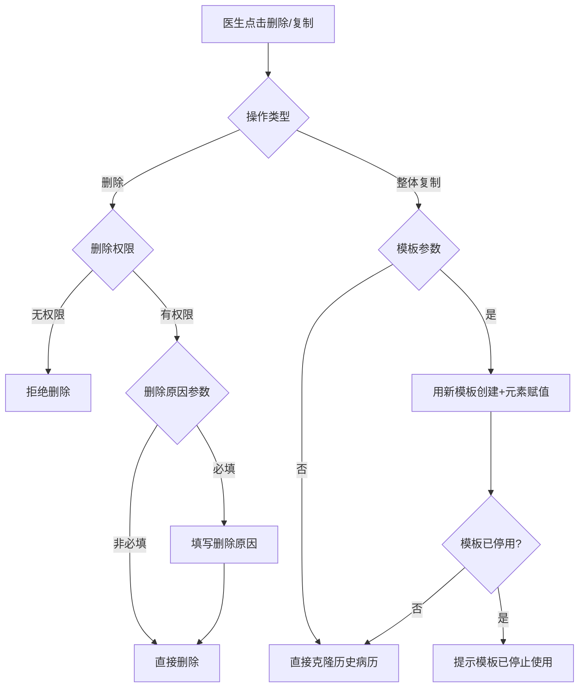
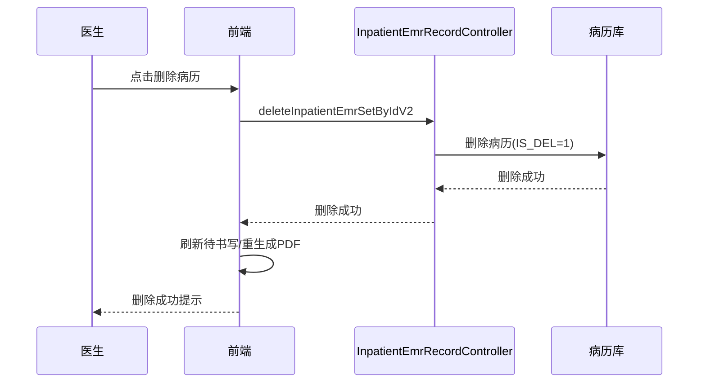

# BLGL-01-BLSX-012 病历删除与复制 _ Analyst - Spec

> **需求编号**：BLGL-01-BLSX-012
> **父需求**：BLGL-01-BLSX
> **关联PM Spec**：BLGL-01-BLSX-012_病历删除与复制_PM-spec.md
> **Spec版本**：V1.0
> **编写时间**：2026-08-15
> **编写人**：需求分析师

---

## 一、功能编号体系

### 1.1 功能层级结构

```
BLGL-01-BLSX-012-001: 病历删除
  ├─ BLGL-01-BLSX-012-001-01: 删除病历
  ├─ BLGL-01-BLSX-012-001-02: 批量删除病历
  ├─ BLGL-01-BLSX-012-001-03: 删除权限控制
  └─ BLGL-01-BLSX-012-001-04: 删除原因

BLGL-01-BLSX-012-002: 病历克隆/复制
  ├─ BLGL-01-BLSX-012-002-01: 历史病历整体复制
  ├─ BLGL-01-BLSX-012-002-02: 病历间拖拽复制粘贴
  └─ BLGL-01-BLSX-012-002-03: 克隆监控类型配置

BLGL-01-BLSX-012-003: 病历替换
  ├─ BLGL-01-BLSX-012-003-01: 替换提示
  ├─ BLGL-01-BLSX-012-003-02: 删除原病历创建新病历
  └─ BLGL-01-BLSX-012-003-03: 内容同步到相同概念ID元素

BLGL-01-BLSX-012-004: 起草者变更
  ├─ BLGL-01-BLSX-012-004-01: 起草者变更
  └─ BLGL-01-BLSX-012-004-02: 变更后起草者权限
```

### 1.2 功能编号表

| REQ-ID | 功能名称 | 类型 | 优先级 | 说明 |
|--------|---------|------|--------|------|
| BLGL-01-BLSX-012-001 | 病历删除 | 功能 | P0 | 删除/批量删除，权限控制，删除原因 |
| BLGL-01-BLSX-012-001-01 | 删除病历 | 子功能 | P0 | 删除病历（IS_DEL=1） |
| BLGL-01-BLSX-012-001-02 | 批量删除病历 | 子功能 | P0 | 批量删除 |
| BLGL-01-BLSX-012-001-03 | 删除权限控制 | 子功能 | P0 | 自己创建/上级删除下级 |
| BLGL-01-BLSX-012-001-04 | 删除原因 | 子功能 | P1 | 参数控制必填 |
| BLGL-01-BLSX-012-002 | 病历克隆/复制 | 功能 | P1 | 整体复制/拖拽复制/克隆配置 |
| BLGL-01-BLSX-012-002-01 | 历史病历整体复制 | 子功能 | P1 | 参数控制克隆或新模板赋值 |
| BLGL-01-BLSX-012-002-02 | 病历间拖拽复制粘贴 | 子功能 | P1 | 选中内容拖拽到另一份病历 |
| BLGL-01-BLSX-012-002-03 | 克隆监控类型配置 | 子功能 | P1 | 允许克隆的病历监控类型 |
| BLGL-01-BLSX-012-003 | 病历替换 | 功能 | P1 | 替换提示/删除原病历/内容同步 |
| BLGL-01-BLSX-012-003-01 | 替换提示 | 子功能 | P1 | 同类型重复创建提示替换 |
| BLGL-01-BLSX-012-003-02 | 删除原病历创建新病历 | 子功能 | P1 | 替换后原病历删除新病历创建 |
| BLGL-01-BLSX-012-003-03 | 内容同步到相同概念ID元素 | 子功能 | P1 | 原内容同步到新病历相同概念ID元素 |
| BLGL-01-BLSX-012-004 | 起草者变更 | 功能 | P1 | 起草者变更权限 |
| BLGL-01-BLSX-012-004-01 | 起草者变更 | 子功能 | P1 | 病历起草者变更 |
| BLGL-01-BLSX-012-004-02 | 变更后起草者权限 | 子功能 | P1 | 可编辑/提交/删除 |

---

## 二、核心业务流程

### 2.1 病历删除/复制主流程



### 2.2 病历删除时序



---

## 三、功能规格说明


### BLGL-01-BLSX-012-001: 病历删除

#### 3.1.1 功能概述

删除/批量删除病历，删除权限控制，删除原因参数控制。

#### 3.1.2 用户角色

| 角色 | 使用场景 | 权限要求 | 操作频率 |
|------|---------|---------|---------|
| 住院医师 | 删除自己创建的病历 | 删除权限 | 低频 |
| 上级医师 | 删除下级医师创建的病历 | 参数控制权限 | 低频 |

#### 3.1.3 业务流程（Given/When/Then）

##### 主流程

**Scenario 1: 删除病历**

```gherkin
Given:
- 医生有删除权限

When:
- 医生点击删除病历
- 参数"已保存过的病历文书删除时，是否填写删除原因"为是时填写删除原因

Then:
- 删除成功（IS_DEL=1）
- 刷新待书写/重生成PDF
```

##### 异常流程

**Scenario 2: 业务异常——无删除权限**

```gherkin
Given:
- 医生非病历创建者且非上级医师
- 参数为否

When:
- 医生尝试删除他人病历

Then:
- 拒绝删除
```

**Scenario 3: 数据异常——删除原因必填**

```gherkin
Given:
- 参数"已保存过的病历文书删除时，是否填写删除原因"为是

When:
- 医生删除病历未填原因

Then:
- 提示填写删除原因
```

**Scenario 4: 系统异常——删除接口异常**

```gherkin
Given:
- 删除接口异常

When:
- 医生点击删除

Then:
- 删除失败提示，可重试
```

##### 边界流程

**Scenario 5: 边界——批量删除**

```gherkin
Given:
- 多份病历待删除

When:
- 医生批量删除

Then:
- 全部删除成功
```

**Scenario 6: 边界——起草者变更后删除**

```gherkin
Given:
- 病历开启起草者变更功能
- A书写的病历，B发起起草者变更

When:
- B删除该病历

Then:
- B支持删除该病历
```

#### 3.1.5 验收标准

| AC编号 | 验收标准 | 对应REQ-ID | 验证方法 | 验证场景 |
|--------|---------|-----------|---------|---------|
| AC-001 | 删除权限控制，无权限拒绝删除 | BLGL-01-BLSX-012-001 | 功能测试 | Scenario 2 |
| AC-002 | 删除原因参数控制必填 | BLGL-01-BLSX-012-001 | 功能测试 | Scenario 3 |
| AC-003 | 起草者变更后新起草者可删除 | BLGL-01-BLSX-012-001 | 功能测试 | Scenario 6 |


### BLGL-01-BLSX-012-002: 病历克隆/复制

#### 3.2.1 功能概述

历史病历整体复制、病历间拖拽复制粘贴、克隆监控类型配置。

#### 3.2.2 用户角色

| 角色 | 使用场景 | 权限要求 | 操作频率 |
|------|---------|---------|---------|
| 住院医师 | 整体复制/拖拽复制 | 病历书写权限 | 中频 |

#### 3.2.3 业务流程（Given/When/Then）

##### 主流程

**Scenario 1: 历史病历整体复制**

```gherkin
Given:
- 患者存在历史病历
- 参数"历史病历整体复制是否使用历史病历的最新病历模板"已配置

When:
- 医生发起整体复制

Then:
- 参数为否（默认）：直接克隆一份历史病历
- 参数为是：先用历史病历对应模板创建病历，再把历史病历元素内容赋值到新建病历
```

##### 异常流程

**Scenario 2: 业务异常——模板已停用**

```gherkin
Given:
- 历史病历模板已停用或删除
- 参数为是

When:
- 医生发起整体复制

Then:
- 提示"当前历史病历对应的病历模板已经停止使用，无法使用整体复制功能"
```

**Scenario 3: 数据异常——元素赋值不完整**

```gherkin
Given:
- 历史病历元素与段落

When:
- 整体复制元素赋值

Then:
- 通过段落对应的元素进行赋值
```

**Scenario 4: 系统异常——克隆接口异常**

```gherkin
Given:
- 克隆接口异常

When:
- 医生发起复制

Then:
- 复制失败提示，可重试
```

##### 边界流程

**Scenario 5: 边界——病历间拖拽复制粘贴**

```gherkin
Given:
- 两份病历均打开

When:
- 医生在一份病历选中内容拖拽到另一份病历鼠标焦点处

Then:
- 选中内容粘贴到鼠标焦点处
```

**Scenario 6: 边界——克隆监控类型配置**

```gherkin
Given:
- 参数"允许克隆病历的监控类型"已配置

When:
- 医生克隆病历

Then:
- 仅允许克隆配置的监控类型
```

#### 3.2.5 验收标准

| AC编号 | 验收标准 | 对应REQ-ID | 验证方法 | 验证场景 |
|--------|---------|-----------|---------|---------|
| AC-001 | 整体复制参数为否直接克隆，为是模板停用提示 | BLGL-01-BLSX-012-002 | 功能测试 | Scenario 1/2 |
| AC-002 | 病历间拖拽复制粘贴到鼠标焦点处 | BLGL-01-BLSX-012-002 | 功能测试 | Scenario 5 |


### BLGL-01-BLSX-012-003: 病历替换

#### 3.3.1 功能概述

同类型病历只能创建一次时重复创建提示替换，替换后原内容同步到新病历相同概念ID元素。

#### 3.3.2 用户角色

| 角色 | 使用场景 | 权限要求 | 操作频率 |
|------|---------|---------|---------|
| 住院医师 | 重复创建同类型病历 | 病历创建权限 | 低频 |

#### 3.3.3 业务流程（Given/When/Then）

##### 主流程

**Scenario 1: 病历替换**

```gherkin
Given:
- 某类型病历设置只能创建一次

When:
- 医生重复创建同类型病历
- 系统提示已存在相同类型的病历是否替换
- 医生确认替换

Then:
- 自动把原来病历删除，新选择的病历创建
- 原病历中写在元素内的内容替换到新病历相同概念ID元素中
```

##### 异常流程

**Scenario 2: 业务异常——拒绝替换**

```gherkin
Given:
- 系统提示替换

When:
- 医生选择不替换

Then:
- 保持原病历，不创建新病历
```

**Scenario 3: 数据异常——概念ID映射缺失**

```gherkin
Given:
- 原病历元素概念ID与新病历不匹配

When:
- 替换后内容同步

Then:
- 相同概念ID元素同步，缺失的无法同步
```

##### 边界流程

**Scenario 4: 边界——内容同步**

```gherkin
Given:
- 原病历存在已填写内容

When:
- 替换后

Then:
- 原内容同步到新病历相同概念ID元素
```

#### 3.3.5 验收标准

| AC编号 | 验收标准 | 对应REQ-ID | 验证方法 | 验证场景 |
|--------|---------|-----------|---------|---------|
| AC-001 | 病历替换后内容同步到新病历相同概念ID元素 | BLGL-01-BLSX-012-003 | 功能测试 | Scenario 1 |
| AC-002 | 拒绝替换时保持原病历 | BLGL-01-BLSX-012-003 | 功能测试 | Scenario 2 |


### BLGL-01-BLSX-012-004: 起草者变更

#### 3.4.1 功能概述

病历起草者变更，变更后起草者可编辑/提交/删除病历。

#### 3.4.2 用户角色

| 角色 | 使用场景 | 权限要求 | 操作频率 |
|------|---------|---------|---------|
| 住院医师 | 起草者变更 | 变更权限 | 低频 |

#### 3.4.3 业务流程（Given/When/Then）

##### 主流程

**Scenario 1: 起草者变更**

```gherkin
Given:
- 参数"是否允许更改病历起草者"为是

When:
- B发起病历起草者变更（A书写的病历）

Then:
- B成为新起草者
- B可编辑、提交、删除该病历
```

##### 异常流程

**Scenario 2: 业务异常——起草者功能未开启**

```gherkin
Given:
- 参数"是否允许更改病历起草者"为否

When:
- 医生发起起草者变更

Then:
- 不允许变更
```

##### 边界流程

**Scenario 3: 边界——变更后权限**

```gherkin
Given:
- B为变更后起草者

When:
- B编辑/提交/删除病历

Then:
- B支持编辑/提交/删除该病历
```

#### 3.4.5 验收标准

| AC编号 | 验收标准 | 对应REQ-ID | 验证方法 | 验证场景 |
|--------|---------|-----------|---------|---------|
| AC-001 | 起草者变更后新起草者可编辑/提交/删除 | BLGL-01-BLSX-012-004 | 功能测试 | Scenario 1 |


---

## 四、排除范围

本需求不包含以下功能项：

1. **病历创建与模板管理 —— BLGL-01-BLSX-001**
2. **病历编辑与保存 —— BLGL-01-BLSX-002**
3. **病历签署/提交/审签 —— BLGL-01-BLSX-003/004/005**
4. **手术记录 —— BLGL-01-BLSX-006**
5. **书写任务与时限提醒 —— BLGL-01-BLSX-007**
6. **删除原因必填校验（COMMON073）—— Phase 1 第6章 BC-BLSX-003**

---

## 五、业务规则清单

| 规则ID | 规则名称 | 规则描述 | 来源 | 优先级 |
|--------|---------|---------|------|--------|
| BR-001 | 删除权限 | 参数选择否，只能删除自己创建的病历；选择是，上级医师可以删除下级医师创建的病历 | 功能清单 | P0 |
| BR-002 | 删除原因 | 已保存过的病历文书删除时，是否填写删除原因，默认否 | 功能清单 | P1 |
| BR-003 | 整体复制 | 参数为否直接克隆一份历史病历；为是先用历史病历对应模板创建病历，再把历史病历元素内容赋值到新建病历 | 需求 | P1 |
| BR-004 | 模板停用提示 | 历史病历模板已停用/删除时提示"当前历史病历对应的病历模板已经停止使用，无法使用整体复制功能" | 需求 | P1 |
| BR-005 | 病历替换 | 同类型病历只能创建一次时重复创建提示替换，替换后原内容同步到新病历相同概念ID元素 | 需求 | P1 |
| BR-006 | 起草者变更 | 开启起草者变更功能后，变更后的病历起草者可编辑、提交、删除病历 | 需求 | P1 |

---

## 六、关联文档

| 文档类型 | 文档路径 | 说明 |
|---------|---------|------|
| 功能点Spec | BLGL-01-BLSX 01病历书写功能点Spec.md（V1.0，上级目录） | Phase 1 功能点索引 |
| PM spec | 本目录 BLGL-01-BLSX-012_病历删除与复制_PM-spec.md（V0.1） | PM 产出的 Spec 文档 |
| -Spec | 本目录 BLGL-01-BLSX-012_病历删除与复制-Spec.md（V1.0） | 业务背景与目标 Spec |
| data-model.md | 待产出 | 架构师产出的数据建模文档 |
| design.md | 待产出 | 架构师产出的技术方案文档 |
| api-contract.md | 待产出 | 开发经理产出的 API 契约文档 |

---

## 七、待确认问题清单

| 编号 | 问题描述 | 缺失信息 | 影响范围 | 建议补充方 |
|------|---------|---------|---------|-----------|
| Q-001 | 删除/克隆接口完整入参/出参字段结构 | API 契约文档 | -Spec 第5章、Analyst-Spec 数据字段 | 开发经理 |
| Q-002 | 删除/克隆相关参数编码（COMMON056/073/033等） | 参数配置说明表 | 数据模型 4.3、数据字段（概念ID） | 产品经理 |
| Q-003 | 性能指标（删除/复制响应） | 非功能性需求 | -Spec 第8章 | 需求分析师 |
| Q-004 | 回收站功能（本次住院已删除病历展示）的完整规则 | 设计文档 | 回收站场景 | 产品经理 |
| Q-005 | 病历替换概念ID同步的完整映射机制 | 设计文档 | 替换场景 | 架构师 |

---

## 填写检查清单

| 序号 | 检查项 | 是否完成 |
|:----:|--------|:--------:|
| 1 | 功能编号带父子层级 | ✅ |
| 2 | 每个 REQ-ID 有功能概述和用户角色 | ✅ |
| 3 | 主流程至少 1 个 Given/When/Then 场景 | ✅ |
| 4 | 异常流程至少 3 个 Given/When/Then 场景 | ✅ |
| 5 | 边界流程至少 2 个 Given/When/Then 场景 | ✅ |
| 6 | 每个 Given/When/Then 内容具体，不模糊 | ✅ |
| 7 | 数据字段定义完整（字段名、类型、必填、说明、概念ID） | N/A |
| 8 | 验收标准 AC 编号独立，可验证 | ✅ |
| 9 | 验收标准无"功能正常"等模糊表述 | ✅ |
| 10 | 排除范围明确列出 | ✅ |
| 11 | 业务规则清单列出所有规则，每条标注来源 | ✅ |
| 12 | 流程图使用 Mermaid 格式（≥2 个） | ✅ |
| 13 | 关联文档索引包含 Phase 1 功能点Spec | ✅ |
| 14 | 待确认问题清单汇总了全文所有 ⏳ 项 | ✅ |
| 15 | 全文无占位符 `< >` 残留 | ✅ |
| 16 | 全文陈述可溯源至资料区（S1~S10 溯源核查） | ✅ |
| 17 | 人工审核确认完成 | ⏳ 待确认 |

---

**文档状态**：⬜ 待审核
**维护责任**：需求分析师规范组
**下次更新**：根据评审反馈优化

---

## 版本历史

| 版本 | 日期 | 变更说明 | 编写人 |
|------|------|---------|--------|
| V1.0 | 2026-08-15 | 初始版本 | 需求分析师 |