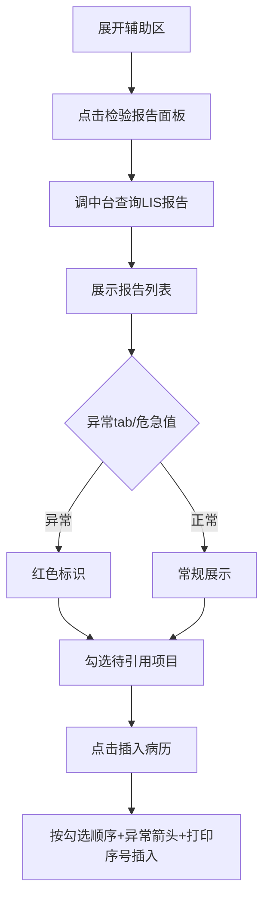
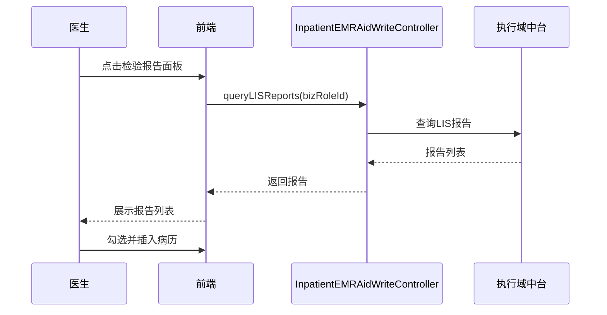

# BLGL-02-FZLR-001 检验报告调阅与引用 _ Analyst - Spec

> **需求编号**：BLGL-02-FZLR-001
> **父需求**：BLGL-02-FZLR
> **关联PM Spec**：BLGL-02-FZLR-001_检验报告调阅与引用_PM-spec.md
> **Spec版本**：V1.0
> **编写时间**：2026-08-14
> **编写人**：需求分析师

---

## 一、功能编号体系

#

## 1.1 功能层级结构

```
BLGL-02-FZLR-001-001: 检验报告调阅

BLGL-02-FZLR-001-002: 检验报告引用（插入病历）
```

#

## 1.2 功能编号表

| REQ-ID | 功能名称 | 类型 | 优先级 | 说明 |
|

----

----|

----

-----|

------|

----

----|

------|
| BLGL-02-FZLR-001-001 | 检验报告调阅 | 功能 | P0 | 辅助区检验报告面板调阅本次就诊 LIS 检验报告（含异常tab筛选、危急值红色标识、分页、按发布时间排序） |
| BLGL-02-FZLR-001-002 | 检验报告引用（插入病历） | 功能 | P0 | 将检验报告结果（含异常值上下箭头、打印序号正序、标点分隔符）按医生勾选顺序插入病历 |

---

## 二、核心业务流程

#

## 2.1 检验报告调阅与引用主流程



#

## 2.2 检验报告调阅与引用时序



---

## 三、功能规格说明


### BLGL-02-FZLR-001-001: 检验报告调阅

##

## 3.x.1 功能概述

辅助区检验报告面板调阅本次就诊 LIS 检验报告（含异常tab筛选、危急值红色标识、分页、按发布时间排序）

##

## 3.x.2 用户角色

| 角色 | 使用场景 | 权限要求 | 操作频率 |
|

------|

----

-----|

----

-----|

----

-----|
| 住院医生 | 调阅检验报告并筛选异常项/危急值 | 本次就诊检验数据 | 高频 |
| 住院医生 | 病历书写时在辅助区引用临床数据 | 当前就诊数据查看 | 高频 |

##

## 3.x.3 业务流程（Given/When/Then）

**Scenario 1: 调阅检验报告**

```gherkin
Given:
- 医生已打开住院病历书写界面并展开右侧辅助区
- 当前患者存在本次就诊 LIS 检验报告

When:
- 点击"检验报告"面板
- 系统调用执行域中台接口查询检验报告

Then:
- 展示检验报告列表（报告名称、发布时间、报告单号等）
- 支持异常tab筛选、危急值字体红色显示
```

**Scenario 2: 业务异常——危急值报告**

```gherkin
Given:
- 检验报告存在危急值项目

When:
- 医生筛选危急值类型

Then:
- 危急值项目在列表中以红色字体/背景标识
```

**Scenario 3: 数据异常——报告分页超限**

```gherkin
Given:
- 检验报告超过 100 条

When:
- 医生翻页查看

Then:
- 报告按分页展示，支持翻页加载
```

**Scenario 4: 系统异常——中台接口不可用**

```gherkin
Given:
- 执行域中台检验报告查询接口异常

When:
- 医生点击检验报告面板

Then:
- 提示查询失败，检验报告面板不展示数据
```

**Scenario 5: 边界——异常tab为空**

```gherkin
Given:
- 患者无异常检验项目

When:
- 医生切换异常tab

Then:
- 异常tab展示空列表
```

**Scenario 6: 边界——报告时间范围过滤**

```gherkin
Given:
- 医生设置报告时间范围

When:
- 按时间范围过滤查询

Then:
- 仅展示范围内检验报告
```

##

## 3.x.4 数据字段定义

| 字段名 | 类型 | 必填 | 默认值 | 取值范围 | 说明 | 概念ID |
|

----

----|

------|

------|

----

----|

----

-----|

------|

----

----|
| bizRoleId | String | 是 | - | - | 业务角色标识| ⏳ 待确认 |
| medtechRptName | String | 否 | - | - | 医技报告名称（报告名称检索，来源：需求） | ⏳ 待确认 |
| 发布时间 | Date | 否 | - | - | 报告发布时间（排序/过滤，来源：需求） | ⏳ 待确认 |
| 危急值标识 | String | 否 | - | 异常/偏高/偏低 | 危急值/异常值标识（红色显示，来源：需求） | ⏳ 待确认 |

##

## 3.x.5 验收标准

| AC编号 | 验收标准 | 对应REQ-ID | 验证方法 | 验证场景 |
|

----

----|

----

-----|

----

----

---|

----

-----|

----

-----|
| AC-001 | 点击检验报告面板，展示本次就诊检验报告列表| BLGL-02-FZLR-001-001 | 功能测试 | Scenario 1 |
| AC-002 | 异常tab仅展示异常检验项目，危急值红色标识| BLGL-02-FZLR-001-001 | 功能测试 | Scenario 1 |


### BLGL-02-FZLR-001-002: 检验报告引用（插入病历）

##

## 3.x.1 功能概述

将检验报告结果（含异常值上下箭头、打印序号正序、标点分隔符）按医生勾选顺序插入病历

##

## 3.x.2 用户角色

| 角色 | 使用场景 | 权限要求 | 操作频率 |
|

------|

----

-----|

----

-----|

----

-----|
| 住院医生 | 病历书写时在辅助区引用临床数据 | 当前就诊数据查看 | 高频 |

##

## 3.x.3 业务流程（Given/When/Then）

**Scenario 1: 引用检验报告结果**

```gherkin
Given:
- 医生已勾选待引用的检验报告项目

When:
- 个人设置引入选项已配置

Then:
- 点击"插入病历"
```

**Scenario 2: 业务异常——异常值箭头**

```gherkin
Given:
- 检验结果含异常上下箭头

When:
- 医生引用异常值

Then:
- 异常值上下符号一并引用进病历
```

**Scenario 3: 数据异常——插错顺序**

```gherkin
Given:
- 医生勾选顺序与右侧展示顺序不一致

When:
- 医生插入

Then:
- 按医生点击选择顺序插入，非右侧展示顺序
```

**Scenario 4: 系统异常——引用后未变色**

```gherkin
Given:
- 检验报告引用后

When:
- 医生观察引用状态

Then:
- 引用过的项目置灰，与未引用区分
```

**Scenario 5: 边界——标点分隔符**

```gherkin
Given:
- 多个报告/多指标引用

When:
- 医生插入

Then:
- 报告间用"；"、同报告指标间用"、"、结尾"。"
```

**Scenario 6: 边界——报告名称去重**

```gherkin
Given:
- 参数"检查报告去重判断逻辑"=按报告单号去重

When:
- 医生引用

Then:
- 相同 medtechRptId 的结果去重展示
```

##

## 3.x.4 数据字段定义

| 字段名 | 类型 | 必填 | 默认值 | 取值范围 | 说明 | 概念ID |
|

----

----|

------|

------|

----

----|

----

-----|

------|

----

----|
| printSerialNumber | Int | 否 | - | - | 打印序号（检验结果正序排序，来源：需求） | ⏳ 待确认 |
| 异常程度/上下箭头 | String | 否 | - | - | 异常值高低箭头标识| ⏳ 待确认 |

##

## 3.x.5 验收标准

| AC编号 | 验收标准 | 对应REQ-ID | 验证方法 | 验证场景 |
|

----

----|

----

-----|

----

----

---|

----

-----|

----

-----|
| AC-001 | 引用检验报告结果按医生勾选顺序插入| BLGL-02-FZLR-001-002 | 功能测试 | Scenario 1 |
| AC-002 | 异常值上下箭头一并引用| BLGL-02-FZLR-001-002 | 功能测试 | Scenario 1 |


---

## 四、排除范围

本需求不包含以下功能项：

1. **检查报告调阅与引用 —— BLGL-02-FZLR-002**
2. **微生物报告调阅与引用 —— BLGL-02-FZLR-003**
3. **报告分页展示优化（基线能力）—— Phase 1 功能点Spec 第6章 BC-FZLR-004**

---

## 五、业务规则清单

| 规则ID | 规则名称 | 规则描述 | 优先级 |
|

----

----|

----

-----|

----

-----|

------|

----

----|
| BR-001 | 异常值默认规则 | 检验大项是否默认选择异常值取决于个性化配置参数；选择大项后小项默认展示异常值| P0 |
| BR-002 | 危急值红色标识 | 列表模式下危急值检验项目整行背景色标红| P0 |
| BR-003 | 打印序号排序 | 检验明细小项按业务中台返回的打印序号正序显示| P0 |
| BR-004 | 引用分隔符 | 报告之间"；"、同一报告不同项目"、"、结尾保持"。"| P1 |

---

## 六、关联文档

| 文档类型 | 文档路径 | 说明 |
|

----

-----|

----

-----|

------|
| 功能点Spec | BLGL-02-FZLR 02辅助录入功能点Spec.md（V1.0，上级目录） | Phase 1 功能点索引 |
| PM spec | 本目录 BLGL-02-FZLR-001_检验报告调阅与引用_PM-spec.md（V0.1） | PM 产出的 Spec 文档 |
| -Spec | 本目录 BLGL-02-FZLR-001_检验报告调阅与引用_Spec.md（V1.0） | 业务背景与目标 Spec |
| data-model.md | 待产出 | 架构师产出的数据建模文档 |
| design.md | 待产出 | 架构师产出的技术方案文档 |
| api-contract.md | 待产出 | 开发经理产出的 API 契约文档 |

---

## 七、待确认问题清单

| 编号 | 问题描述 | 缺失信息 | 影响范围 | 建议补充方 |
|

------|

----

-----|

----

-----|

----

-----|

----

----

---|
| Q-001 | 检验报告查询接口完整入参/出参字段结构 | API 契约文档 | -Spec 第5章、Analyst-Spec 数据字段 | 开发经理 |
| Q-002 | 子项勾选类型参数编码 | 参数配置说明表 | 数据模型 4.3 | 产品经理 |
| Q-003 | 性能指标（响应时间/并发） | 非功能性需求 | -Spec 第8章 | 需求分析师 |

---

## 填写检查清单

| 序号 | 检查项 | 是否完成 |
|:

----:|

----

----|:

----

----:|
| 1 | 功能编号带父子层级 | ✅ |
| 2 | 每个 REQ-ID 有功能概述和用户角色 | ✅ |
| 3 | 主流程至少 1 个 Given/When/Then 场景 | ✅ |
| 4 | 异常流程至少 3 个 Given/When/Then 场景 | ✅ |
| 5 | 边界流程至少 2 个 Given/When/Then 场景 | ✅ |
| 6 | 每个 Given/When/Then 内容具体，不模糊 | ✅ |
| 7 | 数据字段定义完整（字段名、类型、必填、说明、概念ID） | ✅ |
| 8 | 验收标准 AC 编号独立，可验证 | ✅ |
| 9 | 验收标准无"功能正常"等模糊表述 | ✅ |
| 10 | 排除范围明确列出 | ✅ |
| 11 | 业务规则清单列出所有规则，每条标注来源 | ✅ |
| 12 | 流程图使用 Mermaid 格式（≥2 个） | ✅ |
| 13 | 关联文档索引包含 Phase 1 功能点Spec | ✅ |
| 14 | 待确认问题清单汇总了全文所有 ⏳ 项 | ✅ |
| 15 | 全文无占位符 `< >` 残留 | ✅ |
| 16 | 全文陈述可溯源至资料区（S1~S10 溯源核查） | ✅ |
| 17 | 人工审核确认完成 | ⏳ 待确认 |

---

**文档状态**：⬜ 待审核
**维护责任**：需求分析师规范组
**下次更新**：根据评审反馈优化

---

## 版本历史

| 版本 | 日期 | 变更说明 | 编写人 |
|

------|

------|

----

-----|

----

----|
| V1.0 | 2026-08-14 | 初始版本 | 需求分析师 |
