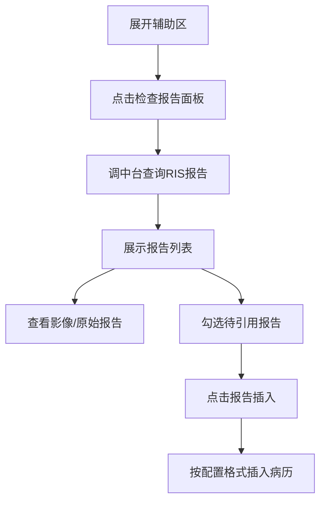
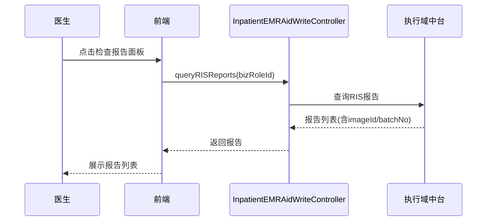

# BLGL-02-FZLR-002 检查报告调阅与引用 _ Analyst - Spec

> **需求编号**：BLGL-02-FZLR-002
> **父需求**：BLGL-02-FZLR
> **关联PM Spec**：BLGL-02-FZLR-002_检查报告调阅与引用_PM-spec.md
> **Spec版本**：V1.0
> **编写时间**：2026-08-14
> **编写人**：需求分析师

---

## 一、功能编号体系

#

## 1.1 功能层级结构

```
BLGL-02-FZLR-002-001: 检查报告调阅

BLGL-02-FZLR-002-002: 检查报告引用（插入病历）
```

#

## 1.2 功能编号表

| REQ-ID | 功能名称 | 类型 | 优先级 | 说明 |
|

----

----|

----

-----|

------|

----

----|

------|
| BLGL-02-FZLR-002-001 | 检查报告调阅 | 功能 | P0 | 辅助区检查报告面板调阅本次就诊 RIS 检查报告（含影像/病理/心电图，按发布时间排序、报告名称检索） |
| BLGL-02-FZLR-002-002 | 检查报告引用（插入病历） | 功能 | P0 | 将检查报告内容（检查名称、检查所见、检查结论）按自定义格式插入病历 |

---

## 二、核心业务流程

#

## 2.1 检查报告调阅与引用主流程



#

## 2.2 检查报告调阅与引用时序



---

## 三、功能规格说明


### BLGL-02-FZLR-002-001: 检查报告调阅

##

## 3.x.1 功能概述

辅助区检查报告面板调阅本次就诊 RIS 检查报告（含影像/病理/心电图，按发布时间排序、报告名称检索）

##

## 3.x.2 用户角色

| 角色 | 使用场景 | 权限要求 | 操作频率 |
|

------|

----

-----|

----

-----|

----

-----|
| 住院医生 | 病历书写时在辅助区引用临床数据 | 当前就诊数据查看 | 高频 |

##

## 3.x.3 业务流程（Given/When/Then）

**Scenario 1: 调阅检查报告**

```gherkin
Given:
- 医生已打开住院病历书写界面并展开辅助区
- 当前患者存在检查报告

When:
- 点击"检查报告"面板
- 系统调用执行域中台接口查询检查报告

Then:
- 展示检查报告列表（报告名称、发布时间、检查所见/结论）
- 支持按发布时间排序
```

**Scenario 2: 业务异常——报告名称为空**

```gherkin
Given:
- 检查报告名称为空

When:
- 医生查看检查报告

Then:
- 报告名称列正常显示，不便查看时补全报告名称
```

**Scenario 3: 数据异常——影像无影像号**

```gherkin
Given:
- 检查报告影像需影像号

When:
- 医生点击【影像】

Then:
- 后端返回 ImageId/BatchNo，前端正确调阅影像
```

**Scenario 4: 系统异常——查看原始报告报错**

```gherkin
Given:
- 原始报告调阅地址异常

When:
- 医生点击查看原始报告

Then:
- 前端判断返回 http 地址则不拼接 portal，未返回则按原处理
```

**Scenario 5: 边界——报告时间条件**

```gherkin
Given:
- 医生设置报告时间范围过滤

When:
- 按时间范围查询

Then:
- 仅展示范围内检查报告
```

**Scenario 6: 边界——报告名称检索**

```gherkin
Given:
- 参数"医技报告是否显示报告名称检索框"开启

When:
- 医生按报告名称检索

Then:
- 按 medtechRptName/medtechRptTypeName 过滤
```

##

## 3.x.4 数据字段定义

| 字段名 | 类型 | 必填 | 默认值 | 取值范围 | 说明 | 概念ID |
|

----

----|

------|

------|

----

----|

----

-----|

------|

----

----|
| ImageId | String | 否 | - | - | 影像号（接口返回字段，来源：需求） | ⏳ 待确认 |
| BatchNo | String | 否 | - | - | 批次号| ⏳ 待确认 |
| 报告名称/检查部位 | String | 否 | - | - | 检查报告名称与部位| ⏳ 待确认 |

##

## 3.x.5 验收标准

| AC编号 | 验收标准 | 对应REQ-ID | 验证方法 | 验证场景 |
|

----

----|

----

-----|

----

----

---|

----

-----|

----

-----|
| AC-001 | 点击检查报告面板，展示本次就诊检查报告列表| BLGL-02-FZLR-002-001 | 功能测试 | Scenario 1 |
| AC-002 | 按发布时间倒序排列，报告名称可检索| BLGL-02-FZLR-002-001 | 功能测试 | Scenario 1 |


### BLGL-02-FZLR-002-002: 检查报告引用（插入病历）

##

## 3.x.1 功能概述

将检查报告内容（检查名称、检查所见、检查结论）按自定义格式插入病历

##

## 3.x.2 用户角色

| 角色 | 使用场景 | 权限要求 | 操作频率 |
|

------|

----

-----|

----

-----|

----

-----|
| 住院医生 | 病历书写时在辅助区引用临床数据 | 当前就诊数据查看 | 高频 |

##

## 3.x.3 业务流程（Given/When/Then）

**Scenario 1: 引用检查报告**

```gherkin
Given:
- 医生已勾选待引用的检查报告

When:
- 点击"报告插入"

Then:
- 检查报告内容（检查名称、所见、结论）按配置格式插入病历
```

**Scenario 2: 业务异常——检查结果无法引用**

```gherkin
Given:
- 检查报告缺少勾选框

When:
- 医生引用检查结果

Then:
- 检查结果支持勾选引用
```

**Scenario 3: 数据异常——部位取报告名称**

```gherkin
Given:
- 检查报告部位/报告名称取值错位

When:
- 医生引用

Then:
- 部位取报告名称、报告名称取分类修正
```

**Scenario 4: 系统异常——引用后未变色**

```gherkin
Given:
- 检查报告引用后

When:
- 医生观察引用状态

Then:
- 引用过的项目置灰
```

**Scenario 5: 边界——插入格式自定义**

```gherkin
Given:
- 个人设置检查报告插入格式已自定义

When:
- 医生插入

Then:
- 按自定义格式插入```

**Scenario 6: 边界——报告去重**

```gherkin
Given:
- 参数"检查报告去重判断逻辑"=按报告单号去重

When:
- 医生引用

Then:
- 相同 medtechRptId 结果去重
```

##

## 3.x.4 数据字段定义

| 字段名 | 类型 | 必填 | 默认值 | 取值范围 | 说明 | 概念ID |
|

----

----|

------|

------|

----

----|

----

-----|

------|

----

----|
| examFindings | String | 否 | - | - | 检查所见| ⏳ 待确认 |
| examResult | String | 否 | - | - | 检查结论| ⏳ 待确认 |
| medtechRptId | String | 否 | - | - | 医技报告ID（去重依据，来源：需求） | ⏳ 待确认 |

##

## 3.x.5 验收标准

| AC编号 | 验收标准 | 对应REQ-ID | 验证方法 | 验证场景 |
|

----

----|

----

-----|

----

----

---|

----

-----|

----

-----|
| AC-001 | 引用检查报告内容按配置格式插入| BLGL-02-FZLR-002-002 | 功能测试 | Scenario 1 |
| AC-002 | 检查结果支持勾选引用| BLGL-02-FZLR-002-002 | 功能测试 | Scenario 1 |


---

## 四、排除范围

本需求不包含以下功能项：

1. **检验报告调阅与引用 —— BLGL-02-FZLR-001**
2. **微生物报告调阅与引用 —— BLGL-02-FZLR-003**
3. **报告分页展示优化（基线能力）—— Phase 1 第6章 BC-FZLR-004**

---

## 五、业务规则清单

| 规则ID | 规则名称 | 规则描述 | 优先级 |
|

----

----|

----

-----|

----

-----|

------|

----

----|
| BR-001 | 发布时间倒序 | 检查报告按报告发布时间倒序排列| P0 |
| BR-002 | 部位/报告名称取值 | 部位取报告名称，报告名称取分类| P0 |
| BR-003 | 插入格式自定义 | 检查报告插入格式支持自定义设置| P1 |

---

## 六、关联文档

| 文档类型 | 文档路径 | 说明 |
|

----

-----|

----

-----|

------|
| 功能点Spec | BLGL-02-FZLR 02辅助录入功能点Spec.md（V1.0，上级目录） | Phase 1 功能点索引 |
| PM spec | 本目录 BLGL-02-FZLR-002_检查报告调阅与引用_PM-spec.md（V0.1） | PM 产出的 Spec 文档 |
| -Spec | 本目录 BLGL-02-FZLR-002_检查报告调阅与引用_Spec.md（V1.0） | 业务背景与目标 Spec |
| data-model.md | 待产出 | 架构师产出的数据建模文档 |
| design.md | 待产出 | 架构师产出的技术方案文档 |
| api-contract.md | 待产出 | 开发经理产出的 API 契约文档 |

---

## 七、待确认问题清单

| 编号 | 问题描述 | 缺失信息 | 影响范围 | 建议补充方 |
|

------|

----

-----|

----

-----|

----

-----|

----

----

---|
| Q-001 | 检查报告查询接口完整入参/出参结构 | API 契约文档 | -Spec 第5章 | 开发经理 |
| Q-002 | 检查报告数据表名 | 数据表清单 | 数据模型 4.1 | 架构师 |
| Q-003 | 性能指标 | 非功能性需求 | -Spec 第8章 | 需求分析师 |

---

## 填写检查清单

| 序号 | 检查项 | 是否完成 |
|:

----:|

----

----|:

----

----:|
| 1 | 功能编号带父子层级 | ✅ |
| 2 | 每个 REQ-ID 有功能概述和用户角色 | ✅ |
| 3 | 主流程至少 1 个 Given/When/Then 场景 | ✅ |
| 4 | 异常流程至少 3 个 Given/When/Then 场景 | ✅ |
| 5 | 边界流程至少 2 个 Given/When/Then 场景 | ✅ |
| 6 | 每个 Given/When/Then 内容具体，不模糊 | ✅ |
| 7 | 数据字段定义完整（字段名、类型、必填、说明、概念ID） | ✅ |
| 8 | 验收标准 AC 编号独立，可验证 | ✅ |
| 9 | 验收标准无"功能正常"等模糊表述 | ✅ |
| 10 | 排除范围明确列出 | ✅ |
| 11 | 业务规则清单列出所有规则，每条标注来源 | ✅ |
| 12 | 流程图使用 Mermaid 格式（≥2 个） | ✅ |
| 13 | 关联文档索引包含 Phase 1 功能点Spec | ✅ |
| 14 | 待确认问题清单汇总了全文所有 ⏳ 项 | ✅ |
| 15 | 全文无占位符 `< >` 残留 | ✅ |
| 16 | 全文陈述可溯源至资料区（S1~S10 溯源核查） | ✅ |
| 17 | 人工审核确认完成 | ⏳ 待确认 |

---

**文档状态**：⬜ 待审核
**维护责任**：需求分析师规范组
**下次更新**：根据评审反馈优化

---

## 版本历史

| 版本 | 日期 | 变更说明 | 编写人 |
|

------|

------|

----

-----|

----

----|
| V1.0 | 2026-08-14 | 初始版本 | 需求分析师 |
