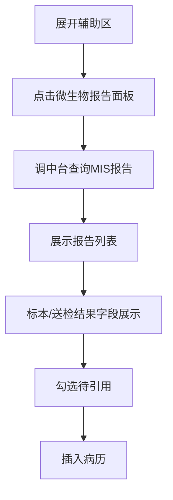
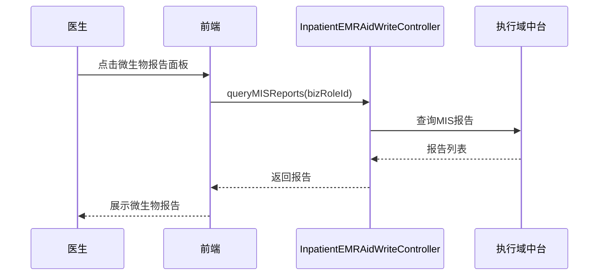

# BLGL-02-FZLR-003 微生物报告调阅与引用 _ Analyst - Spec

> **需求编号**：BLGL-02-FZLR-003
> **父需求**：BLGL-02-FZLR
> **关联PM Spec**：BLGL-02-FZLR-003_微生物报告调阅与引用_PM-spec.md
> **Spec版本**：V1.0
> **编写时间**：2026-08-14
> **编写人**：需求分析师

---

## 一、功能编号体系

#

## 1.1 功能层级结构

```
BLGL-02-FZLR-003-001: 微生物报告调阅

BLGL-02-FZLR-003-002: 微生物报告引用（插入病历）
```

#

## 1.2 功能编号表

| REQ-ID | 功能名称 | 类型 | 优先级 | 说明 |
|

----

----|

----

-----|

------|

----

----|

------|
| BLGL-02-FZLR-003-001 | 微生物报告调阅 | 功能 | P0 | 辅助区微生物报告面板调阅本次就诊微生物报告（含标本字段、送检结果、按发布时间倒序） |
| BLGL-02-FZLR-003-002 | 微生物报告引用（插入病历） | 功能 | P0 | 将微生物报告结果（鉴定结果、培养结果、耐药机制等）按格式插入病历 |

---

## 二、核心业务流程

#

## 2.1 微生物报告调阅与引用主流程



#

## 2.2 微生物报告调阅与引用时序



---

## 三、功能规格说明


### BLGL-02-FZLR-003-001: 微生物报告调阅

##

## 3.x.1 功能概述

辅助区微生物报告面板调阅本次就诊微生物报告（含标本字段、送检结果、按发布时间倒序）

##

## 3.x.2 用户角色

| 角色 | 使用场景 | 权限要求 | 操作频率 |
|

------|

----

-----|

----

-----|

----

-----|
| 住院医生 | 病历书写时在辅助区引用临床数据 | 当前就诊数据查看 | 高频 |

##

## 3.x.3 业务流程（Given/When/Then）

**Scenario 1: 调阅微生物报告**

```gherkin
Given:
- 医生已打开住院病历书写界面并展开辅助区
- 当前患者存在微生物报告

When:
- 点击"微生物报告"面板
- 系统调用执行域中台接口查询微生物报告

Then:
- 展示微生物报告列表（报告名称、发布时间、报告单号、标本/样本）
- 按发布时间倒序排列
```

**Scenario 2: 业务异常——标本字段缺失**

```gherkin
Given:
- 微生物报告未显示标本字段

When:
- 医生查看微生物报告

Then:
- 样本字段替换为标本字段显示
```

**Scenario 3: 数据异常——送检结果不显示**

```gherkin
Given:
- 三方分送检结果/鉴定结果两字段

When:
- 医生查看微生物结果

Then:
- 新增"检测结果"字段，取值 misCultureResult
```

**Scenario 4: 系统异常——三方返回成功但不显示**

```gherkin
Given:
- 三方传了且医生站返回成功

When:
- 医生查看微生物报告

Then:
- 报告正常显示，排查不显示问题
```

**Scenario 5: 边界——检验/检查/微生物分类**

```gherkin
Given:
- 右侧医技报告需分类

When:
- 医生切换检验/检查/微生物

Then:
- 检验/检查/微生物分类展示，前面增加"全部"
```

**Scenario 6: 边界——无微生物报告**

```gherkin
Given:
- 患者无微生物报告

When:
- 医生打开微生物面板

Then:
- 展示空列表
```

##

## 3.x.4 数据字段定义

| 字段名 | 类型 | 必填 | 默认值 | 取值范围 | 说明 | 概念ID |
|

----

----|

------|

------|

----

----|

----

-----|

------|

----

----|
| 标本 | String | 否 | - | - | 微生物标本字段（原样本替换为标本，来源：需求） | ⏳ 待确认 |
| misCultureResult | String | 否 | - | - | 检测结果（送检结果，来源：需求） | ⏳ 待确认 |
| 鉴定结果 | String | 否 | - | - | 微生物鉴定结果| ⏳ 待确认 |

##

## 3.x.5 验收标准

| AC编号 | 验收标准 | 对应REQ-ID | 验证方法 | 验证场景 |
|

----

----|

----

-----|

----

----

---|

----

-----|

----

-----|
| AC-001 | 点击微生物报告面板，展示本次就诊微生物报告| BLGL-02-FZLR-003-001 | 功能测试 | Scenario 1 |
| AC-002 | 标本字段替换样本字段显示| BLGL-02-FZLR-003-001 | 功能测试 | Scenario 1 |


### BLGL-02-FZLR-003-002: 微生物报告引用（插入病历）

##

## 3.x.1 功能概述

将微生物报告结果（鉴定结果、培养结果、耐药机制等）按格式插入病历

##

## 3.x.2 用户角色

| 角色 | 使用场景 | 权限要求 | 操作频率 |
|

------|

----

-----|

----

-----|

----

-----|
| 住院医生 | 病历书写时在辅助区引用临床数据 | 当前就诊数据查看 | 高频 |

##

## 3.x.3 业务流程（Given/When/Then）

**Scenario 1: 引用微生物报告**

```gherkin
Given:
- 医生已勾选待引用的微生物报告

When:
- 点击"插入病历"

Then:
- 微生物报告结果（含标本、送检目的等）按格式插入病历
```

**Scenario 2: 业务异常——明细项缺勾选框**

```gherkin
Given:
- 微生物报告明细项缺少勾选框

When:
- 医生引用微生物明细

Then:
- 明细项支持勾选引用
```

**Scenario 3: 数据异常——引用结果异常**

```gherkin
Given:
- 微生物报告结果引用问题

When:
- 医生引用

Then:
- 合并需求至 250815 修复引用
```

**Scenario 4: 系统异常——引用报错**

```gherkin
Given:
- 微生物报告引用时报错

When:
- 医生插入

Then:
- 排查并修复引用报错
```

**Scenario 5: 边界——分隔符**

```gherkin
Given:
- 微生物报告间引用

When:
- 医生插入

Then:
- 报告间"；"、结尾"。"
```

**Scenario 6: 边界——外院微生物互认**

```gherkin
Given:
- 外院互认微生物报告

When:
- 医生查看外院报告

Then:
- 增加医疗机构名称、互认标志、不互认理由字段
```

##

## 3.x.4 数据字段定义

| 字段名 | 类型 | 必填 | 默认值 | 取值范围 | 说明 | 概念ID |
|

----

----|

------|

------|

----

----|

----

-----|

------|

----

----|
| 医疗机构名称 | String | 否 | - | - | 外院报告字段| ⏳ 待确认 |
| 互认标志/不互认理由 | String | 否 | - | - | 外院互认字段| ⏳ 待确认 |

##

## 3.x.5 验收标准

| AC编号 | 验收标准 | 对应REQ-ID | 验证方法 | 验证场景 |
|

----

----|

----

-----|

----

----

---|

----

-----|

----

-----|
| AC-001 | 引用微生物报告结果按格式插入| BLGL-02-FZLR-003-002 | 功能测试 | Scenario 1 |
| AC-002 | 明细项支持勾选引用| BLGL-02-FZLR-003-002 | 功能测试 | Scenario 1 |


---

## 四、排除范围

本需求不包含以下功能项：

1. **检验报告调阅与引用 —— BLGL-02-FZLR-001**
2. **检查报告调阅与引用 —— BLGL-02-FZLR-002**
3. **报告分页展示优化（基线能力）—— Phase 1 第6章 BC-FZLR-004**

---

## 五、业务规则清单

| 规则ID | 规则名称 | 规则描述 | 优先级 |
|

----

----|

----

-----|

----

-----|

------|

----

----|
| BR-001 | 标本字段 | 样本字段替换为标本字段显示| P0 |
| BR-002 | 送检结果字段 | 新增检测结果字段，取值 misCultureResult| P0 |
| BR-003 | 外院互认字段 | 外院检查检验微生物增加医疗机构名称、互认标志、不互认理由| P1 |

---

## 六、关联文档

| 文档类型 | 文档路径 | 说明 |
|

----

-----|

----

-----|

------|
| 功能点Spec | BLGL-02-FZLR 02辅助录入功能点Spec.md（V1.0，上级目录） | Phase 1 功能点索引 |
| PM spec | 本目录 BLGL-02-FZLR-003_微生物报告调阅与引用_PM-spec.md（V0.1） | PM 产出的 Spec 文档 |
| -Spec | 本目录 BLGL-02-FZLR-003_微生物报告调阅与引用_Spec.md（V1.0） | 业务背景与目标 Spec |
| data-model.md | 待产出 | 架构师产出的数据建模文档 |
| design.md | 待产出 | 架构师产出的技术方案文档 |
| api-contract.md | 待产出 | 开发经理产出的 API 契约文档 |

---

## 七、待确认问题清单

| 编号 | 问题描述 | 缺失信息 | 影响范围 | 建议补充方 |
|

------|

----

-----|

----

-----|

----

-----|

----

----

---|
| Q-001 | 微生物报告查询接口完整入参/出参 | API 契约文档 | -Spec 第5章 | 开发经理 |
| Q-002 | 微生物报告数据表名 | 数据表清单 | 数据模型 4.1 | 架构师 |
| Q-003 | 性能指标 | 非功能性需求 | -Spec 第8章 | 需求分析师 |

---

## 填写检查清单

| 序号 | 检查项 | 是否完成 |
|:

----:|

----

----|:

----

----:|
| 1 | 功能编号带父子层级 | ✅ |
| 2 | 每个 REQ-ID 有功能概述和用户角色 | ✅ |
| 3 | 主流程至少 1 个 Given/When/Then 场景 | ✅ |
| 4 | 异常流程至少 3 个 Given/When/Then 场景 | ✅ |
| 5 | 边界流程至少 2 个 Given/When/Then 场景 | ✅ |
| 6 | 每个 Given/When/Then 内容具体，不模糊 | ✅ |
| 7 | 数据字段定义完整（字段名、类型、必填、说明、概念ID） | ✅ |
| 8 | 验收标准 AC 编号独立，可验证 | ✅ |
| 9 | 验收标准无"功能正常"等模糊表述 | ✅ |
| 10 | 排除范围明确列出 | ✅ |
| 11 | 业务规则清单列出所有规则，每条标注来源 | ✅ |
| 12 | 流程图使用 Mermaid 格式（≥2 个） | ✅ |
| 13 | 关联文档索引包含 Phase 1 功能点Spec | ✅ |
| 14 | 待确认问题清单汇总了全文所有 ⏳ 项 | ✅ |
| 15 | 全文无占位符 `< >` 残留 | ✅ |
| 16 | 全文陈述可溯源至资料区（S1~S10 溯源核查） | ✅ |
| 17 | 人工审核确认完成 | ⏳ 待确认 |

---

**文档状态**：⬜ 待审核
**维护责任**：需求分析师规范组
**下次更新**：根据评审反馈优化

---

## 版本历史

| 版本 | 日期 | 变更说明 | 编写人 |
|

------|

------|

----

-----|

----

----|
| V1.0 | 2026-08-14 | 初始版本 | 需求分析师 |
