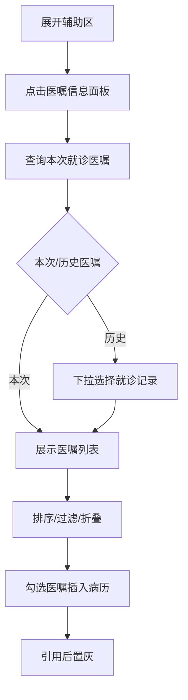
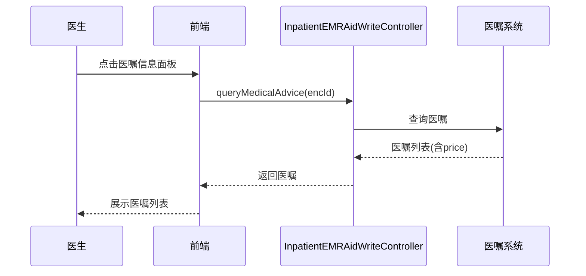

# BLGL-02-FZLR-004 医嘱信息引用 _ Analyst - Spec

> **需求编号**：BLGL-02-FZLR-004
> **父需求**：BLGL-02-FZLR
> **关联PM Spec**：BLGL-02-FZLR-004_医嘱信息引用_PM-spec.md
> **Spec版本**：V1.0
> **编写时间**：2026-08-14
> **编写人**：需求分析师

---

## 一、功能编号体系

#

## 1.1 功能层级结构

```
BLGL-02-FZLR-004-001: 医嘱信息调阅

BLGL-02-FZLR-004-002: 医嘱引用（插入病历）
```

#

## 1.2 功能编号表

| REQ-ID | 功能名称 | 类型 | 优先级 | 说明 |
|

----

----|

----

-----|

------|

----

----|

------|
| BLGL-02-FZLR-004-001 | 医嘱信息调阅 | 功能 | P0 | 辅助区医嘱信息面板查询本次就诊医嘱（含历史医嘱、门诊处方、中药饮品折叠、排序记忆） |
| BLGL-02-FZLR-004-002 | 医嘱引用（插入病历） | 功能 | P0 | 将医嘱内容（含药品名称、单价、处方法则、出院带药格式）按医生勾选顺序插入病历 |

---

## 二、核心业务流程

#

## 2.1 医嘱信息引用主流程



#

## 2.2 医嘱信息引用时序



---

## 三、功能规格说明


### BLGL-02-FZLR-004-001: 医嘱信息调阅

##

## 3.x.1 功能概述

辅助区医嘱信息面板查询本次就诊医嘱（含历史医嘱、门诊处方、中药饮品折叠、排序记忆）

##

## 3.x.2 用户角色

| 角色 | 使用场景 | 权限要求 | 操作频率 |
|

------|

----

-----|

----

-----|

----

-----|
| 住院医生 | 病历书写时在辅助区引用临床数据 | 当前就诊数据查看 | 高频 |

##

## 3.x.3 业务流程（Given/When/Then）

**Scenario 1: 调阅医嘱信息**

```gherkin
Given:
- 医生已打开住院病历书写界面并展开辅助区
- 当前患者有医嘱

When:
- 点击"医嘱信息"面板
- 系统查询医嘱信息

Then:
- 展示医嘱列表（药品名称、规格、剂量、用法、频次）
- 支持开始时间正序/倒序排序
```

**Scenario 2: 业务异常——医嘱过滤规则**

```gherkin
Given:
- 存在停用长期/临时医嘱

When:
- 医生查看医嘱

Then:
- 停用长期和临时医嘱不显示
```

**Scenario 3: 数据异常——频次英文显示**

```gherkin
Given:
- 医院自定义频次开立中文

When:
- 医生引用医嘱

Then:
- 频次显示中文而非英文
```

**Scenario 4: 系统异常——医嘱信息卡死刷新**

```gherkin
Given:
- 医嘱信息引用一直刷新

When:
- 医生操作

Then:
- 优化避免卡死强制刷新医生站
```

**Scenario 5: 边界——历史医嘱**

```gherkin
Given:
- 医生查看历史医嘱

When:
- 切换"历史医嘱"页签

Then:
- 下拉选择就诊记录显示该次医嘱
```

**Scenario 6: 边界——中药饮品折叠**

```gherkin
Given:
- 医嘱含中药饮品列表

When:
- 医生查看

Then:
- 中药饮品列表折叠显示
```

##

## 3.x.4 数据字段定义

| 字段名 | 类型 | 必填 | 默认值 | 取值范围 | 说明 | 概念ID |
|

----

----|

------|

------|

----

----|

----

-----|

------|

----

----|
| 药品名称 | String | 是 | - | - | 医嘱药品名称| ⏳ 待确认 |
| price | String | 否 | - | - | 单价字段| ⏳ 待确认 |
| 频次 | String | 否 | - | - | 医嘱频次| ⏳ 待确认 |

##

## 3.x.5 验收标准

| AC编号 | 验收标准 | 对应REQ-ID | 验证方法 | 验证场景 |
|

----

----|

----

-----|

----

----

---|

----

-----|

----

-----|
| AC-001 | 点击医嘱信息面板，展示本次就诊医嘱列表| BLGL-02-FZLR-004-001 | 功能测试 | Scenario 1 |
| AC-002 | 医嘱按开始时间支持正序/倒序| BLGL-02-FZLR-004-001 | 功能测试 | Scenario 1 |


### BLGL-02-FZLR-004-002: 医嘱引用（插入病历）

##

## 3.x.1 功能概述

将医嘱内容（含药品名称、单价、处方法则、出院带药格式）按医生勾选顺序插入病历

##

## 3.x.2 用户角色

| 角色 | 使用场景 | 权限要求 | 操作频率 |
|

------|

----

-----|

----

-----|

----

-----|
| 住院医生 | 病历书写时在辅助区引用临床数据 | 当前就诊数据查看 | 高频 |

##

## 3.x.3 业务流程（Given/When/Then）

**Scenario 1: 引用医嘱信息**

```gherkin
Given:
- 医生已勾选待引用的医嘱

When:
- 点击"插入病历"

Then:
- 医嘱内容（药品名称、规格、剂量、用法、频次）插入病历
- 引用过的医嘱置灰
```

**Scenario 2: 业务异常——成组医嘱格式**

```gherkin
Given:
- 成组医嘱引用

When:
- 医生插入

Then:
- 成组医嘱格式正确```

**Scenario 3: 数据异常——草药医嘱误带规格**

```gherkin
Given:
- 引入门诊草药处方

When:
- 医生插入

Then:
- 不误带规格信息
```

**Scenario 4: 系统异常——医嘱无法勾选**

```gherkin
Given:
- 医嘱列表无法勾选

When:
- 医生勾选医嘱

Then:
- 医嘱可正常勾选插入
```

**Scenario 5: 边界——出院带药格式**

```gherkin
Given:
- 出院带药数据源

When:
- 医生引用

Then:
- 名称+(规格)+剂量+用法+频次格式
```

**Scenario 6: 边界——中药饮片处方法则**

```gherkin
Given:
- 草药医嘱引用

When:
- 医生插入

Then:
- 支持插入"处方法则"字段
```

##

## 3.x.4 数据字段定义

| 字段名 | 类型 | 必填 | 默认值 | 取值范围 | 说明 | 概念ID |
|

----

----|

------|

------|

----

----|

----

-----|

------|

----

----|
| 单价 | String | 否 | - | - | 单价列，可勾选引入| ⏳ 待确认 |
| 处方法则 | String | 否 | - | - | 中药饮片处方法则| ⏳ 待确认 |
| 出院带药总量 | String | 否 | - | - | 出院带药总量字段| ⏳ 待确认 |

##

## 3.x.5 验收标准

| AC编号 | 验收标准 | 对应REQ-ID | 验证方法 | 验证场景 |
|

----

----|

----

-----|

----

----

---|

----

-----|

----

-----|
| AC-001 | 引用医嘱内容插入病历，引用后置灰| BLGL-02-FZLR-004-002 | 功能测试 | Scenario 1 |
| AC-002 | 出院带药格式 名称+(规格)+剂量+用法+频次| BLGL-02-FZLR-004-002 | 功能测试 | Scenario 1 |


---

## 四、排除范围

本需求不包含以下功能项：

1. **检验/检查/微生物报告调阅 —— BLGL-02-FZLR-001/002/003**
2. **医嘱/报告引用防卡死优化（基线能力）—— Phase 1 第6章 BC-FZLR-008**

---

## 五、业务规则清单

| 规则ID | 规则名称 | 规则描述 | 优先级 |
|

----

----|

----

-----|

----

-----|

------|

----

----|
| BR-001 | 医嘱过滤 | 停用长期和临时医嘱不显示| P0 |
| BR-002 | 药品名称显示 | 医嘱插入病历显示药品名称| P0 |
| BR-003 | 出院带药格式 | 名称+(规格)+剂量+用法+频次| P0 |
| BR-004 | 引用置灰 | 引用过的医嘱置灰区分| P1 |

---

## 六、关联文档

| 文档类型 | 文档路径 | 说明 |
|

----

-----|

----

-----|

------|
| 功能点Spec | BLGL-02-FZLR 02辅助录入功能点Spec.md（V1.0，上级目录） | Phase 1 功能点索引 |
| PM spec | 本目录 BLGL-02-FZLR-004_医嘱信息引用_PM-spec.md（V0.1） | PM 产出的 Spec 文档 |
| -Spec | 本目录 BLGL-02-FZLR-004_医嘱信息引用_Spec.md（V1.0） | 业务背景与目标 Spec |
| data-model.md | 待产出 | 架构师产出的数据建模文档 |
| design.md | 待产出 | 架构师产出的技术方案文档 |
| api-contract.md | 待产出 | 开发经理产出的 API 契约文档 |

---

## 七、待确认问题清单

| 编号 | 问题描述 | 缺失信息 | 影响范围 | 建议补充方 |
|

------|

----

-----|

----

-----|

----

-----|

----

----

---|
| Q-001 | 医嘱信息查询接口完整入参/出参 | API 契约文档 | -Spec 第5章 | 开发经理 |
| Q-002 | 医嘱信息数据表名 | 数据表清单 | 数据模型 4.1 | 架构师 |
| Q-003 | 性能指标 | 非功能性需求 | -Spec 第8章 | 需求分析师 |

---

## 填写检查清单

| 序号 | 检查项 | 是否完成 |
|:

----:|

----

----|:

----

----:|
| 1 | 功能编号带父子层级 | ✅ |
| 2 | 每个 REQ-ID 有功能概述和用户角色 | ✅ |
| 3 | 主流程至少 1 个 Given/When/Then 场景 | ✅ |
| 4 | 异常流程至少 3 个 Given/When/Then 场景 | ✅ |
| 5 | 边界流程至少 2 个 Given/When/Then 场景 | ✅ |
| 6 | 每个 Given/When/Then 内容具体，不模糊 | ✅ |
| 7 | 数据字段定义完整（字段名、类型、必填、说明、概念ID） | ✅ |
| 8 | 验收标准 AC 编号独立，可验证 | ✅ |
| 9 | 验收标准无"功能正常"等模糊表述 | ✅ |
| 10 | 排除范围明确列出 | ✅ |
| 11 | 业务规则清单列出所有规则，每条标注来源 | ✅ |
| 12 | 流程图使用 Mermaid 格式（≥2 个） | ✅ |
| 13 | 关联文档索引包含 Phase 1 功能点Spec | ✅ |
| 14 | 待确认问题清单汇总了全文所有 ⏳ 项 | ✅ |
| 15 | 全文无占位符 `< >` 残留 | ✅ |
| 16 | 全文陈述可溯源至资料区（S1~S10 溯源核查） | ✅ |
| 17 | 人工审核确认完成 | ⏳ 待确认 |

---

**文档状态**：⬜ 待审核
**维护责任**：需求分析师规范组
**下次更新**：根据评审反馈优化

---

## 版本历史

| 版本 | 日期 | 变更说明 | 编写人 |
|

------|

------|

----

-----|

----

----|
| V1.0 | 2026-08-14 | 初始版本 | 需求分析师 |
