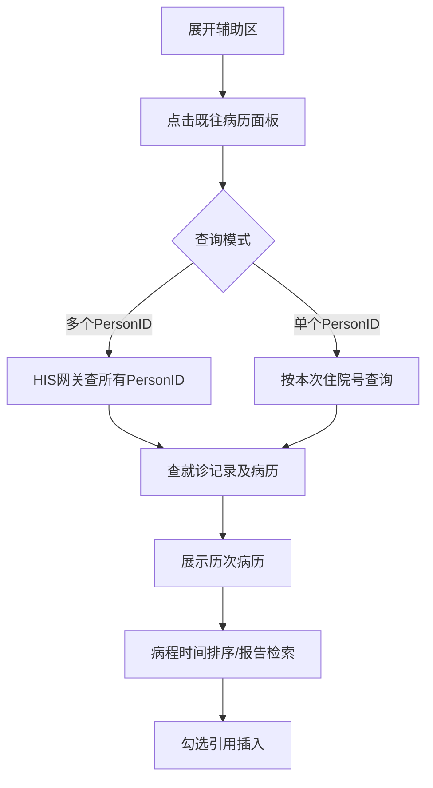
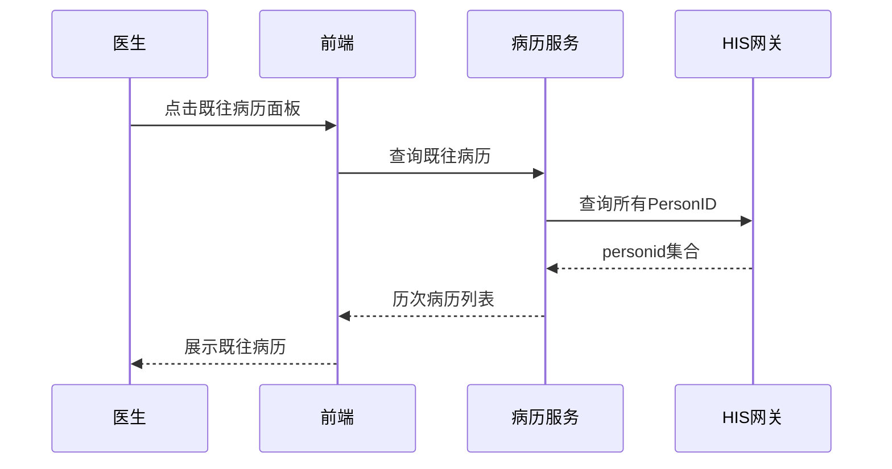

# BLGL-02-FZLR-005 既往病历引用 _ Analyst - Spec

> **需求编号**：BLGL-02-FZLR-005
> **父需求**：BLGL-02-FZLR
> **关联PM Spec**：BLGL-02-FZLR-005_既往病历引用_PM-spec.md
> **Spec版本**：V1.0
> **编写时间**：2026-08-14
> **编写人**：需求分析师

---

## 一、功能编号体系

#

## 1.1 功能层级结构

```
BLGL-02-FZLR-005-001: 既往病历调阅

BLGL-02-FZLR-005-002: 既往病历引用（插入病历）
```

#

## 1.2 功能编号表

| REQ-ID | 功能名称 | 类型 | 优先级 | 说明 |
|

----

----|

----

-----|

------|

----

----|

------|
| BLGL-02-FZLR-005-001 | 既往病历调阅 | 功能 | P0 | 辅助区既往病历面板查看患者历次住院/门诊病历（含多个PersonID查询、病程时间排序、报告名称检索） |
| BLGL-02-FZLR-005-002 | 既往病历引用（插入病历） | 功能 | P0 | 引用历史病历内容（含表格、标题勾选）到当前病历 |

---

## 二、核心业务流程

#

## 2.1 既往病历引用主流程



#

## 2.2 既往病历引用时序



---

## 三、功能规格说明


### BLGL-02-FZLR-005-001: 既往病历调阅

##

## 3.x.1 功能概述

辅助区既往病历面板查看患者历次住院/门诊病历（含多个PersonID查询、病程时间排序、报告名称检索）

##

## 3.x.2 用户角色

| 角色 | 使用场景 | 权限要求 | 操作频率 |
|

------|

----

-----|

----

-----|

----

-----|
| 住院医生 | 病历书写时在辅助区引用临床数据 | 当前就诊数据查看 | 高频 |

##

## 3.x.3 业务流程（Given/When/Then）

**Scenario 1: 调阅既往病历**

```gherkin
Given:
- 医生已打开住院病历书写界面并展开辅助区
- 患者存在历次就诊病历

When:
- 点击"既往病历"面板
- 系统查询历次住院/门诊病历

Then:
- 展示既往病历列表（按时间倒序）
- 支持门诊病历/住院病历切换
```

**Scenario 2: 业务异常——多PersonID查询**

```gherkin
Given:
- 患者多次建档不同身份

When:
- 医生查询既往病历

Then:
- 参数=多个PersonID时经HIS网关查询所有PersonID再查病历
```

**Scenario 3: 数据异常——病程未按时间排序**

```gherkin
Given:
- 病程记录未按时间排序

When:
- 医生查看

Then:
- 支持按时间正序/倒序排列，默认正序
```

**Scenario 4: 系统异常——打开既往病历卡慢/白屏**

```gherkin
Given:
- 既往病历加载卡慢或白屏

When:
- 医生打开

Then:
- 优化加载性能，加载目录同时返回病历列表
```

**Scenario 5: 边界——报告名称检索**

```gherkin
Given:
- 既往病历需检索报告

When:
- 医生按报告名称检索

Then:
- 支持报告名称检索
```

**Scenario 6: 边界——血糖记录单查看**

```gherkin
Given:
- 既往病历含血糖记录单

When:
- 医生查看

Then:
- 支持查看并调用血糖记录单
```

##

## 3.x.4 数据字段定义

| 字段名 | 类型 | 必填 | 默认值 | 取值范围 | 说明 | 概念ID |
|

----

----|

------|

------|

----

----|

----

-----|

------|

----

----|
| PersonID | String | 是 | - | - | 患者标识，多PersonID查询模式| ⏳ 待确认 |
| 证件类型/证件号码 | String | 否 | - | - | 关联PersonID入参| ⏳ 待确认 |
| 病历新建时间 | Date | 否 | - | - | 既往病历显示新建时间| ⏳ 待确认 |

##

## 3.x.5 验收标准

| AC编号 | 验收标准 | 对应REQ-ID | 验证方法 | 验证场景 |
|

----

----|

----

-----|

----

----

---|

----

-----|

----

-----|
| AC-001 | 点击既往病历面板，展示历次住院/门诊病历| BLGL-02-FZLR-005-001 | 功能测试 | Scenario 1 |
| AC-002 | 病程记录按时间正序/倒序排列| BLGL-02-FZLR-005-001 | 功能测试 | Scenario 1 |


### BLGL-02-FZLR-005-002: 既往病历引用（插入病历）

##

## 3.x.1 功能概述

引用历史病历内容（含表格、标题勾选）到当前病历

##

## 3.x.2 用户角色

| 角色 | 使用场景 | 权限要求 | 操作频率 |
|

------|

----

-----|

----

-----|

----

-----|
| 住院医生 | 病历书写时在辅助区引用临床数据 | 当前就诊数据查看 | 高频 |

##

## 3.x.3 业务流程（Given/When/Then）

**Scenario 1: 引用既往病历**

```gherkin
Given:
- 医生已打开既往病历

When:
- 勾选病历标题/内容→插入病历

Then:
- 历史病历内容（含表格）引用插入当前病历
```

**Scenario 2: 业务异常——标题勾选迭代**

```gherkin
Given:
- 既往病历标题勾选引用

When:
- 医生勾选标题

Then:
- 支持标题勾选引用```

**Scenario 3: 数据异常——引用报错**

```gherkin
Given:
- 引用历史病历报错

When:
- 医生引用

Then:
- 排查并修复引用报错
```

**Scenario 4: 系统异常——病历比例过大**

```gherkin
Given:
- 会诊书写界既往病历比例过大

When:
- 医生打开

Then:
- 优化默认比例，无需手动缩小
```

**Scenario 5: 边界——引用表格**

```gherkin
Given:
- 历史病历含表格

When:
- 医生引用

Then:
- 支持引用病历中的表格
```

**Scenario 6: 边界——会诊页面显示不完整**

```gherkin
Given:
- 会诊申请/答复页面既往病历显示不完整

When:
- 医生查看

Then:
- 既往病历完整显示
```

##

## 3.x.4 数据字段定义

| 字段名 | 类型 | 必填 | 默认值 | 取值范围 | 说明 | 概念ID |
|

----

----|

------|

------|

----

----|

----

-----|

------|

----

----|
| 病历目录 | String | 否 | - | - | 既往病历目录（树结构展示，来源：需求） | ⏳ 待确认 |
| 病程记录 | String | 否 | - | - | 病程记录列表| ⏳ 待确认 |

##

## 3.x.5 验收标准

| AC编号 | 验收标准 | 对应REQ-ID | 验证方法 | 验证场景 |
|

----

----|

----

-----|

----

----

---|

----

-----|

----

-----|
| AC-001 | 引用历史病历内容（含表格）插入当前病历| BLGL-02-FZLR-005-002 | 功能测试 | Scenario 1 |
| AC-002 | 支持标题勾选引用| BLGL-02-FZLR-005-002 | 功能测试 | Scenario 1 |


---

## 四、排除范围

本需求不包含以下功能项：

1. **病历调阅（跨模块）—— BLGL-16-BLDY**
2. **诊断信息引用 —— BLGL-02-FZLR-006**

---

## 五、业务规则清单

| 规则ID | 规则名称 | 规则描述 | 优先级 |
|

----

----|

----

-----|

----

-----|

------|

----

----|
| BR-001 | 多PersonID查询 | 参数=多个PersonID时经HIS网关查询所有PersonID再查病历| P0 |
| BR-002 | 病程排序 | 病程记录按时间正序/倒序，默认正序，账号记忆| P0 |
| BR-003 | 血糖记录单 | 支持查看并调用血糖记录单| P1 |

---

## 六、关联文档

| 文档类型 | 文档路径 | 说明 |
|

----

-----|

----

-----|

------|
| 功能点Spec | BLGL-02-FZLR 02辅助录入功能点Spec.md（V1.0，上级目录） | Phase 1 功能点索引 |
| PM spec | 本目录 BLGL-02-FZLR-005_既往病历引用_PM-spec.md（V0.1） | PM 产出的 Spec 文档 |
| -Spec | 本目录 BLGL-02-FZLR-005_既往病历引用_Spec.md（V1.0） | 业务背景与目标 Spec |
| data-model.md | 待产出 | 架构师产出的数据建模文档 |
| design.md | 待产出 | 架构师产出的技术方案文档 |
| api-contract.md | 待产出 | 开发经理产出的 API 契约文档 |

---

## 七、待确认问题清单

| 编号 | 问题描述 | 缺失信息 | 影响范围 | 建议补充方 |
|

------|

----

-----|

----

-----|

----

-----|

----

----

---|
| Q-001 | 既往病历查询接口完整入参/出参 | API 契约文档 | -Spec 第5章 | 开发经理 |
| Q-002 | 既往病历数据表名 | 数据表清单 | 数据模型 4.1 | 架构师 |
| Q-003 | 性能指标 | 非功能性需求 | -Spec 第8章 | 需求分析师 |

---

## 填写检查清单

| 序号 | 检查项 | 是否完成 |
|:

----:|

----

----|:

----

----:|
| 1 | 功能编号带父子层级 | ✅ |
| 2 | 每个 REQ-ID 有功能概述和用户角色 | ✅ |
| 3 | 主流程至少 1 个 Given/When/Then 场景 | ✅ |
| 4 | 异常流程至少 3 个 Given/When/Then 场景 | ✅ |
| 5 | 边界流程至少 2 个 Given/When/Then 场景 | ✅ |
| 6 | 每个 Given/When/Then 内容具体，不模糊 | ✅ |
| 7 | 数据字段定义完整（字段名、类型、必填、说明、概念ID） | ✅ |
| 8 | 验收标准 AC 编号独立，可验证 | ✅ |
| 9 | 验收标准无"功能正常"等模糊表述 | ✅ |
| 10 | 排除范围明确列出 | ✅ |
| 11 | 业务规则清单列出所有规则，每条标注来源 | ✅ |
| 12 | 流程图使用 Mermaid 格式（≥2 个） | ✅ |
| 13 | 关联文档索引包含 Phase 1 功能点Spec | ✅ |
| 14 | 待确认问题清单汇总了全文所有 ⏳ 项 | ✅ |
| 15 | 全文无占位符 `< >` 残留 | ✅ |
| 16 | 全文陈述可溯源至资料区（S1~S10 溯源核查） | ✅ |
| 17 | 人工审核确认完成 | ⏳ 待确认 |

---

**文档状态**：⬜ 待审核
**维护责任**：需求分析师规范组
**下次更新**：根据评审反馈优化

---

## 版本历史

| 版本 | 日期 | 变更说明 | 编写人 |
|

------|

------|

----

-----|

----

----|
| V1.0 | 2026-08-14 | 初始版本 | 需求分析师 |
