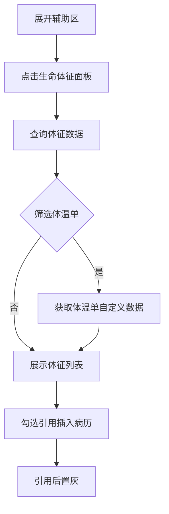
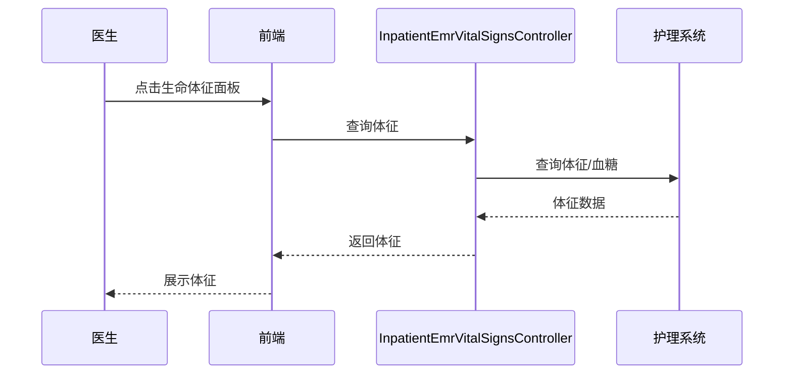

# BLGL-02-FZLR-007 生命体征与体温单引入 _ Analyst - Spec

> **需求编号**：BLGL-02-FZLR-007
> **父需求**：BLGL-02-FZLR
> **关联PM Spec**：BLGL-02-FZLR-007_生命体征与体温单引入_PM-spec.md
> **Spec版本**：V1.0
> **编写时间**：2026-08-14
> **编写人**：需求分析师

---

## 一、功能编号体系

#

## 1.1 功能层级结构

```
BLGL-02-FZLR-007-001: 生命体征调阅

BLGL-02-FZLR-007-002: 生命体征与体温单引用
```

#

## 1.2 功能编号表

| REQ-ID | 功能名称 | 类型 | 优先级 | 说明 |
|

----

----|

----

-----|

------|

----

----|

------|
| BLGL-02-FZLR-007-001 | 生命体征调阅 | 功能 | P0 | 辅助区生命体征面板调阅患者体征数据（含体温单、血糖、血压、身高、体表面积） |
| BLGL-02-FZLR-007-002 | 生命体征与体温单引用 | 功能 | P0 | 将生命体征、体温单自定义数据引用到病历 |

---

## 二、核心业务流程

#

## 2.1 生命体征与体温单引入主流程



#

## 2.2 生命体征与体温单引入时序



---

## 三、功能规格说明


### BLGL-02-FZLR-007-001: 生命体征调阅

##

## 3.x.1 功能概述

辅助区生命体征面板调阅患者体征数据（含体温单、血糖、血压、身高、体表面积）

##

## 3.x.2 用户角色

| 角色 | 使用场景 | 权限要求 | 操作频率 |
|

------|

----

-----|

----

-----|

----

-----|
| 住院医生 | 病历书写时在辅助区引用临床数据 | 当前就诊数据查看 | 高频 |

##

## 3.x.3 业务流程（Given/When/Then）

**Scenario 1: 调阅生命体征**

```gherkin
Given:
- 医生已打开住院病历书写界面并展开辅助区
- 当前患者有体征数据

When:
- 点击"生命体征"面板
- 系统查询体征信息

Then:
- 展示生命体征（体温、脉搏、心率、呼吸、血压、血氧、身高、体重等）
- 支持字段显示配置
```

**Scenario 2: 业务异常——血压不显示**

```gherkin
Given:
- 护士站录入血压

When:
- 医生查看生命体征

Then:
- 生命体征显示血压（含体温单血压同步）
```

**Scenario 3: 数据异常——血糖监测记录数量不符**

```gherkin
Given:
- 护理血糖记录与实际不符

When:
- 医生查看

Then:
- 血糖监测记录数量与实际护理记录一致
```

**Scenario 4: 系统异常——体温未显示小数**

```gherkin
Given:
- 体温为小数

When:
- 医生查看

Then:
- 体温显示小数
```

**Scenario 5: 边界——字段显示配置**

```gherkin
Given:
- 参数配置生命体征展示字段

When:
- 医生查看

Then:
- 按配置显示对应字段
```

**Scenario 6: 边界——体表面积**

```gherkin
Given:
- 医生查看体表面积

When:
- 按男女自动默认

Then:
- 体表面积按性别自动默认
```

##

## 3.x.4 数据字段定义

| 字段名 | 类型 | 必填 | 默认值 | 取值范围 | 说明 | 概念ID |
|

----

----|

------|

------|

----

----|

----

-----|

------|

----

----|
| 体温/脉搏/心率/呼吸/血压/血氧 | String | 否 | - | - | 生命体征字段| ⏳ 待确认 |
| 血糖 | String | 否 | - | 餐前/餐后/随机 | 血糖监测数据| ⏳ 待确认 |
| 身高/体重/体表面积 | String | 否 | - | - | 身高体重及体表面积| ⏳ 待确认 |

##

## 3.x.5 验收标准

| AC编号 | 验收标准 | 对应REQ-ID | 验证方法 | 验证场景 |
|

----

----|

----

-----|

----

----

---|

----

-----|

----

-----|
| AC-001 | 点击生命体征面板，展示体征数据| BLGL-02-FZLR-007-001 | 功能测试 | Scenario 1 |
| AC-002 | 体征字段按配置显示| BLGL-02-FZLR-007-001 | 功能测试 | Scenario 1 |


### BLGL-02-FZLR-007-002: 生命体征与体温单引用

##

## 3.x.1 功能概述

将生命体征、体温单自定义数据引用到病历

##

## 3.x.2 用户角色

| 角色 | 使用场景 | 权限要求 | 操作频率 |
|

------|

----

-----|

----

-----|

----

-----|
| 住院医生 | 病历书写时在辅助区引用临床数据 | 当前就诊数据查看 | 高频 |

##

## 3.x.3 业务流程（Given/When/Then）

**Scenario 1: 引用生命体征**

```gherkin
Given:
- 医生已勾选待引用的体征数据

When:
- 点击"插入病历"

Then:
- 体征数据引用插入病历，引用过的置灰
```

**Scenario 2: 业务异常——体温单自定义数据**

```gherkin
Given:
- 护理体温单自定义数据

When:
- 医生筛选体温单

Then:
- 获取体温单基本信息栏4个自定义数据，空值不显示
```

**Scenario 3: 数据异常——数据错行**

```gherkin
Given:
- 生命体征数据错行

When:
- 医生查看

Then:
- 生命体征数据不错行
```

**Scenario 4: 系统异常——输血调用无血压**

```gherkin
Given:
- 输血调用的生命体征无血压

When:
- 医生查看

Then:
- 生命体征含血压
```

**Scenario 5: 边界——引用置灰**

```gherkin
Given:
- 生命体征已引用

When:
- 医生查看

Then:
- 引用过的数据置灰
```

**Scenario 6: 边界——多时间点数据**

```gherkin
Given:
- 体温单多时间点数据

When:
- 医生多选

Then:
- 按时间正序排列展示
```

##

## 3.x.4 数据字段定义

| 字段名 | 类型 | 必填 | 默认值 | 取值范围 | 说明 | 概念ID |
|

----

----|

------|

------|

----

----|

----

-----|

------|

----

----|
| 自定义数据 | String | 否 | - | - | 体温单基本信息栏自定义数据| ⏳ 待确认 |
| 监测时段 | String | 否 | - | - | 血糖监测时段| ⏳ 待确认 |

##

## 3.x.5 验收标准

| AC编号 | 验收标准 | 对应REQ-ID | 验证方法 | 验证场景 |
|

----

----|

----

-----|

----

----

---|

----

-----|

----

-----|
| AC-001 | 引用生命体征数据插入病历| BLGL-02-FZLR-007-002 | 功能测试 | Scenario 1 |
| AC-002 | 引用过的数据置灰区分| BLGL-02-FZLR-007-002 | 功能测试 | Scenario 1 |


---

## 四、排除范围

本需求不包含以下功能项：

1. **护理文书与护理信息引入 —— BLGL-02-FZLR-008**
2. **过敏信息引入 —— BLGL-02-FZLR-009**

---

## 五、业务规则清单

| 规则ID | 规则名称 | 规则描述 | 优先级 |
|

----

----|

----

-----|

----

-----|

------|

----

----|
| BR-001 | 字段配置 | 生命体征展示字段支持配置| P0 |
| BR-002 | 体温单自定义数据 | 按时间正序排列，空值不显示| P0 |
| BR-003 | 血糖排序 | 按记录日期倒序，优先最新| P1 |

---

## 六、关联文档

| 文档类型 | 文档路径 | 说明 |
|

----

-----|

----

-----|

------|
| 功能点Spec | BLGL-02-FZLR 02辅助录入功能点Spec.md（V1.0，上级目录） | Phase 1 功能点索引 |
| PM spec | 本目录 BLGL-02-FZLR-007_生命体征与体温单引入_PM-spec.md（V0.1） | PM 产出的 Spec 文档 |
| -Spec | 本目录 BLGL-02-FZLR-007_生命体征与体温单引入_Spec.md（V1.0） | 业务背景与目标 Spec |
| data-model.md | 待产出 | 架构师产出的数据建模文档 |
| design.md | 待产出 | 架构师产出的技术方案文档 |
| api-contract.md | 待产出 | 开发经理产出的 API 契约文档 |

---

## 七、待确认问题清单

| 编号 | 问题描述 | 缺失信息 | 影响范围 | 建议补充方 |
|

------|

----

-----|

----

-----|

----

-----|

----

----

---|
| Q-001 | 体征接口完整入参/出参 | API 契约文档 | -Spec 第5章 | 开发经理 |
| Q-002 | 体征数据表名 | 数据表清单 | 数据模型 4.1 | 架构师 |
| Q-003 | 性能指标 | 非功能性需求 | -Spec 第8章 | 需求分析师 |

---

## 填写检查清单

| 序号 | 检查项 | 是否完成 |
|:

----:|

----

----|:

----

----:|
| 1 | 功能编号带父子层级 | ✅ |
| 2 | 每个 REQ-ID 有功能概述和用户角色 | ✅ |
| 3 | 主流程至少 1 个 Given/When/Then 场景 | ✅ |
| 4 | 异常流程至少 3 个 Given/When/Then 场景 | ✅ |
| 5 | 边界流程至少 2 个 Given/When/Then 场景 | ✅ |
| 6 | 每个 Given/When/Then 内容具体，不模糊 | ✅ |
| 7 | 数据字段定义完整（字段名、类型、必填、说明、概念ID） | ✅ |
| 8 | 验收标准 AC 编号独立，可验证 | ✅ |
| 9 | 验收标准无"功能正常"等模糊表述 | ✅ |
| 10 | 排除范围明确列出 | ✅ |
| 11 | 业务规则清单列出所有规则，每条标注来源 | ✅ |
| 12 | 流程图使用 Mermaid 格式（≥2 个） | ✅ |
| 13 | 关联文档索引包含 Phase 1 功能点Spec | ✅ |
| 14 | 待确认问题清单汇总了全文所有 ⏳ 项 | ✅ |
| 15 | 全文无占位符 `< >` 残留 | ✅ |
| 16 | 全文陈述可溯源至资料区（S1~S10 溯源核查） | ✅ |
| 17 | 人工审核确认完成 | ⏳ 待确认 |

---

**文档状态**：⬜ 待审核
**维护责任**：需求分析师规范组
**下次更新**：根据评审反馈优化

---

## 版本历史

| 版本 | 日期 | 变更说明 | 编写人 |
|

------|

------|

----

-----|

----

----|
| V1.0 | 2026-08-14 | 初始版本 | 需求分析师 |
