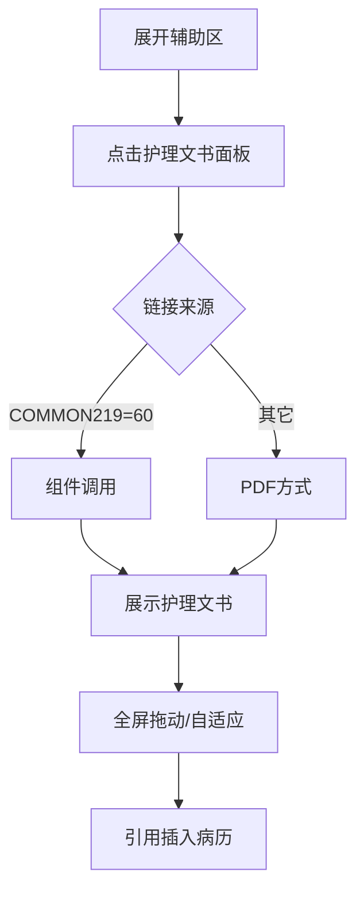
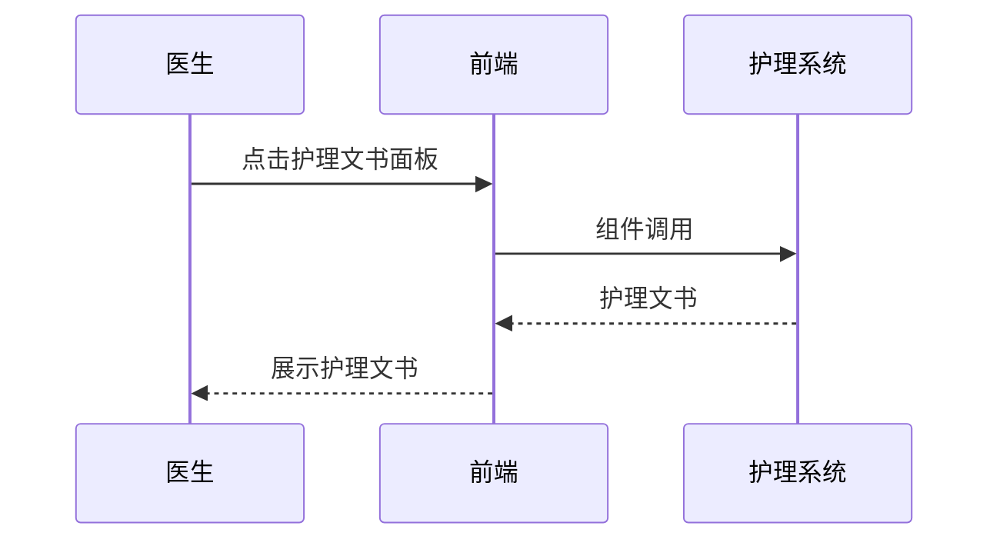

# BLGL-02-FZLR-008 护理文书与护理信息引入 _ Analyst - Spec

> **需求编号**：BLGL-02-FZLR-008
> **父需求**：BLGL-02-FZLR
> **关联PM Spec**：BLGL-02-FZLR-008_护理文书与护理信息引入_PM-spec.md
> **Spec版本**：V1.0
> **编写时间**：2026-08-14
> **编写人**：需求分析师

---

## 一、功能编号体系

#

## 1.1 功能层级结构

```
BLGL-02-FZLR-008-001: 护理文书调阅

BLGL-02-FZLR-008-002: 护理信息（生命体征/血糖）引入
```

#

## 1.2 功能编号表

| REQ-ID | 功能名称 | 类型 | 优先级 | 说明 |
|

----

----|

----

-----|

------|

----

----|

------|
| BLGL-02-FZLR-008-001 | 护理文书调阅 | 功能 | P0 | 辅助区护理文书面板调阅护理文书（组件调用方式，支持全屏拖动、屏幕自适应） |
| BLGL-02-FZLR-008-002 | 护理信息（生命体征/血糖）引入 | 功能 | P0 | 将护理信息（血糖、生命体征等护理数据）引入病历 |

---

## 二、核心业务流程

#

## 2.1 护理文书与护理信息引入主流程



#

## 2.2 护理文书与护理信息引入时序



---

## 三、功能规格说明


### BLGL-02-FZLR-008-001: 护理文书调阅

##

## 3.x.1 功能概述

辅助区护理文书面板调阅护理文书（组件调用方式，支持全屏拖动、屏幕自适应）

##

## 3.x.2 用户角色

| 角色 | 使用场景 | 权限要求 | 操作频率 |
|

------|

----

-----|

----

-----|

----

-----|
| 住院医生 | 病历书写时在辅助区引用临床数据 | 当前就诊数据查看 | 高频 |

##

## 3.x.3 业务流程（Given/When/Then）

**Scenario 1: 调阅护理文书**

```gherkin
Given:
- 医生已打开住院病历书写界面并展开辅助区
- 存在护理文书

When:
- 点击"护理文书"面板
- 系统调用护理文书组件

Then:
- 展示护理文书（组件调用方式）
- 支持全屏拖动、屏幕自适应宽度
```

**Scenario 2: 业务异常——护理文书按钮无效**

```gherkin
Given:
- 护理文书插入按钮无效

When:
- 医生点击插入病历

Then:
- 插入病历按钮生效
```

**Scenario 3: 数据异常——护理文书链接识别**

```gherkin
Given:
- 病区号放链接识别不出

When:
- 医生查看

Then:
- 病区号默认1正确识别
```

**Scenario 4: 系统异常——打开组件空白**

```gherkin
Given:
- 护理文书组件空白

When:
- 医生打开

Then:
- 组件正常打开
```

**Scenario 5: 边界——链接来源参数**

```gherkin
Given:
- 参数 COMMON219=60护理文书

When:
- 医生查看

Then:
- 组件调用方式而非 PDF
```

**Scenario 6: 边界——缺失护理文书选项**

```gherkin
Given:
- 通用配置缺失护理文书

When:
- 医生查看

Then:
- 通用配置含护理文书选项
```

##

## 3.x.4 数据字段定义

| 字段名 | 类型 | 必填 | 默认值 | 取值范围 | 说明 | 概念ID |
|

----

----|

------|

------|

----

----|

----

-----|

------|

----

----|
| 病区号 | String | 否 | 1 | - | 护理文书链接病区号，默认1| ⏳ 待确认 |

##

## 3.x.5 验收标准

| AC编号 | 验收标准 | 对应REQ-ID | 验证方法 | 验证场景 |
|

----

----|

----

-----|

----

----

---|

----

-----|

----

-----|
| AC-001 | 点击护理文书面板，展示护理文书| BLGL-02-FZLR-008-001 | 功能测试 | Scenario 1 |
| AC-002 | 护理文书支持全屏拖动| BLGL-02-FZLR-008-001 | 功能测试 | Scenario 1 |


### BLGL-02-FZLR-008-002: 护理信息（生命体征/血糖）引入

##

## 3.x.1 功能概述

将护理信息（血糖、生命体征等护理数据）引入病历

##

## 3.x.2 用户角色

| 角色 | 使用场景 | 权限要求 | 操作频率 |
|

------|

----

-----|

----

-----|

----

-----|
| 住院医生 | 病历书写时在辅助区引用临床数据 | 当前就诊数据查看 | 高频 |

##

## 3.x.3 业务流程（Given/When/Then）

**Scenario 1: 引用护理信息**

```gherkin
Given:
- 医生已勾选待引用的护理数据

When:
- 点击"插入病历"

Then:
- 护理信息（血糖等）引用插入病历
```

**Scenario 2: 业务异常——护理文书缺失**

```gherkin
Given:
- 病历辅助录入缺少护理文书

When:
- 医生查看

Then:
- 补充护理文书选项
```

**Scenario 3: 数据异常——界面显示空白**

```gherkin
Given:
- 护理文书界面空白

When:
- 医生查看

Then:
- 护理文书界面正常显示
```

**Scenario 4: 系统异常——质控卡死**

```gherkin
Given:
- 质控点护理文书按钮卡死

When:
- 医生操作

Then:
- 护理文书不卡死
```

**Scenario 5: 边界——嵌入三方护理文书**

```gherkin
Given:
- 对接三方中嘉护理文书

When:
- 医生查看

Then:
- 嵌入三方护理文书网页到书写助手
```

**Scenario 6: 边界——全屏拖动**

```gherkin
Given:
- 护理文书支持全屏拖动

When:
- 医生拖动

Then:
- 护理文书全屏拖动
```

##

## 3.x.4 数据字段定义

| 字段名 | 类型 | 必填 | 默认值 | 取值范围 | 说明 | 概念ID |
|

----

----|

------|

------|

----

----|

----

-----|

------|

----

----|
| 护理文书 | String | 否 | - | - | 护理文书数据| ⏳ 待确认 |

##

## 3.x.5 验收标准

| AC编号 | 验收标准 | 对应REQ-ID | 验证方法 | 验证场景 |
|

----

----|

----

-----|

----

----

---|

----

-----|

----

-----|
| AC-001 | 引用护理信息插入病历| BLGL-02-FZLR-008-002 | 功能测试 | Scenario 1 |
| AC-002 | 护理文书界面正常显示| BLGL-02-FZLR-008-002 | 功能测试 | Scenario 1 |


---

## 四、排除范围

本需求不包含以下功能项：

1. **生命体征与体温单引入 —— BLGL-02-FZLR-007**
2. **过敏信息引入 —— BLGL-02-FZLR-009**

---

## 五、业务规则清单

| 规则ID | 规则名称 | 规则描述 | 优先级 |
|

----

----|

----

-----|

----

-----|

------|

----

----|
| BR-001 | 组件调用 | COMMON219=60护理文书时组件调用| P0 |
| BR-002 | 病区号默认 | 护理文书链接病区号默认1| P1 |
| BR-003 | 全屏拖动 | 护理文书支持全屏拖动| P1 |

---

## 六、关联文档

| 文档类型 | 文档路径 | 说明 |
|

----

-----|

----

-----|

------|
| 功能点Spec | BLGL-02-FZLR 02辅助录入功能点Spec.md（V1.0，上级目录） | Phase 1 功能点索引 |
| PM spec | 本目录 BLGL-02-FZLR-008_护理文书与护理信息引入_PM-spec.md（V0.1） | PM 产出的 Spec 文档 |
| -Spec | 本目录 BLGL-02-FZLR-008_护理文书与护理信息引入_Spec.md（V1.0） | 业务背景与目标 Spec |
| data-model.md | 待产出 | 架构师产出的数据建模文档 |
| design.md | 待产出 | 架构师产出的技术方案文档 |
| api-contract.md | 待产出 | 开发经理产出的 API 契约文档 |

---

## 七、待确认问题清单

| 编号 | 问题描述 | 缺失信息 | 影响范围 | 建议补充方 |
|

------|

----

-----|

----

-----|

----

-----|

----

----

---|
| Q-001 | 护理文书组件调用接口 | API 契约文档 | -Spec 第5章 | 开发经理 |
| Q-002 | 护理文书数据表名 | 数据表清单 | 数据模型 4.1 | 架构师 |
| Q-003 | 性能指标 | 非功能性需求 | -Spec 第8章 | 需求分析师 |

---

## 填写检查清单

| 序号 | 检查项 | 是否完成 |
|:

----:|

----

----|:

----

----:|
| 1 | 功能编号带父子层级 | ✅ |
| 2 | 每个 REQ-ID 有功能概述和用户角色 | ✅ |
| 3 | 主流程至少 1 个 Given/When/Then 场景 | ✅ |
| 4 | 异常流程至少 3 个 Given/When/Then 场景 | ✅ |
| 5 | 边界流程至少 2 个 Given/When/Then 场景 | ✅ |
| 6 | 每个 Given/When/Then 内容具体，不模糊 | ✅ |
| 7 | 数据字段定义完整（字段名、类型、必填、说明、概念ID） | ✅ |
| 8 | 验收标准 AC 编号独立，可验证 | ✅ |
| 9 | 验收标准无"功能正常"等模糊表述 | ✅ |
| 10 | 排除范围明确列出 | ✅ |
| 11 | 业务规则清单列出所有规则，每条标注来源 | ✅ |
| 12 | 流程图使用 Mermaid 格式（≥2 个） | ✅ |
| 13 | 关联文档索引包含 Phase 1 功能点Spec | ✅ |
| 14 | 待确认问题清单汇总了全文所有 ⏳ 项 | ✅ |
| 15 | 全文无占位符 `< >` 残留 | ✅ |
| 16 | 全文陈述可溯源至资料区（S1~S10 溯源核查） | ✅ |
| 17 | 人工审核确认完成 | ⏳ 待确认 |

---

**文档状态**：⬜ 待审核
**维护责任**：需求分析师规范组
**下次更新**：根据评审反馈优化

---

## 版本历史

| 版本 | 日期 | 变更说明 | 编写人 |
|

------|

------|

----

-----|

----

----|
| V1.0 | 2026-08-14 | 初始版本 | 需求分析师 |
