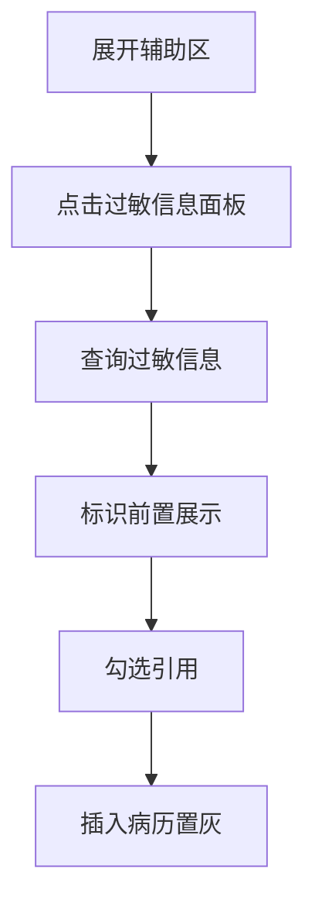
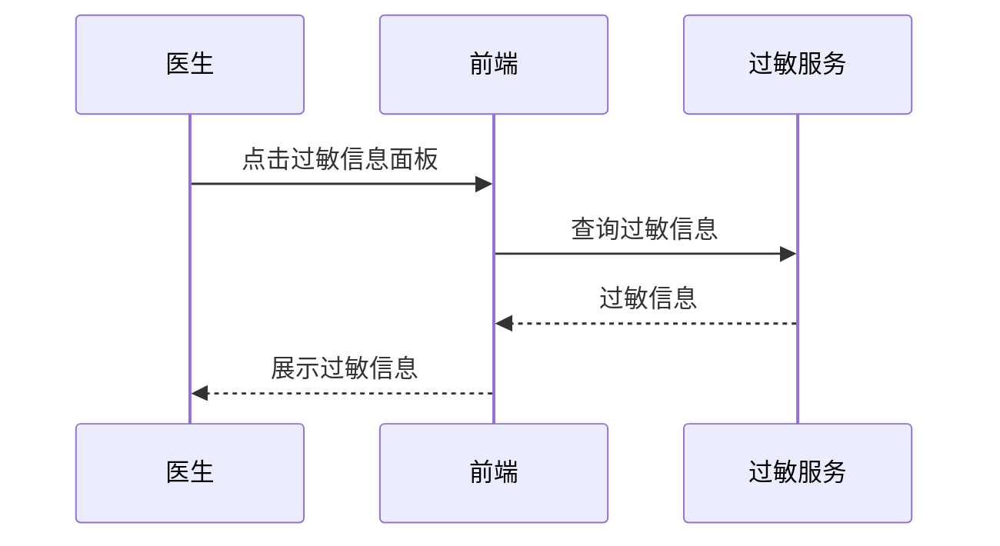

# BLGL-02-FZLR-009 过敏信息引入 _ Analyst - Spec

> **需求编号**：BLGL-02-FZLR-009
> **父需求**：BLGL-02-FZLR
> **关联PM Spec**：BLGL-02-FZLR-009_过敏信息引入_PM-spec.md
> **Spec版本**：V1.0
> **编写时间**：2026-08-14
> **编写人**：需求分析师

---

## 一、功能编号体系

#

## 1.1 功能层级结构

```
BLGL-02-FZLR-009-001: 过敏信息调阅

BLGL-02-FZLR-009-002: 过敏信息引用
```

#

## 1.2 功能编号表

| REQ-ID | 功能名称 | 类型 | 优先级 | 说明 |
|

----

----|

----

-----|

------|

----

----|

------|
| BLGL-02-FZLR-009-001 | 过敏信息调阅 | 功能 | P0 | 辅助区过敏信息面板调阅患者过敏信息（药品、食物、环境） |
| BLGL-02-FZLR-009-002 | 过敏信息引用 | 功能 | P0 | 将过敏信息（药品/食物/环境）引用插入病历 |

---

## 二、核心业务流程

#

## 2.1 过敏信息引入主流程



#

## 2.2 过敏信息引入时序



---

## 三、功能规格说明


### BLGL-02-FZLR-009-001: 过敏信息调阅

##

## 3.x.1 功能概述

辅助区过敏信息面板调阅患者过敏信息（药品、食物、环境）

##

## 3.x.2 用户角色

| 角色 | 使用场景 | 权限要求 | 操作频率 |
|

------|

----

-----|

----

-----|

----

-----|
| 住院医生 | 病历书写时在辅助区引用临床数据 | 当前就诊数据查看 | 高频 |

##

## 3.x.3 业务流程（Given/When/Then）

**Scenario 1: 调阅过敏信息**

```gherkin
Given:
- 医生已打开住院病历书写界面并展开辅助区
- 患者有过敏信息

When:
- 点击"过敏信息"面板
- 系统查询过敏信息

Then:
- 展示过敏信息（药品、食物、环境）
- 标识（阴、阳、不详）显示在名称前面
```

**Scenario 2: 业务异常——皮试结果重复**

```gherkin
Given:
- 历次皮试结果

When:
- 医生查看

Then:
- 仅显示本次入院对应的阳性皮试结果
```

**Scenario 3: 数据异常——过敏信息自动同步**

```gherkin
Given:
- 护士填写过敏信息

When:
- 医生查看未提交病历

Then:
- 过敏信息自动同步到入院病历
```

**Scenario 4: 系统异常——底部弹出布局**

```gherkin
Given:
- 辅助区显示位置为下侧

When:
- 医生查看

Then:
- 过敏信息调整显示布局
```

**Scenario 5: 边界——引入内容修改**

```gherkin
Given:
- 过敏信息引入内容

When:
- 医生导入

Then:
- "测试"改为"检测"
```

**Scenario 6: 边界——引用置灰**

```gherkin
Given:
- 过敏信息已引用

When:
- 医生查看

Then:
- 引用过的置灰
```

##

## 3.x.4 数据字段定义

| 字段名 | 类型 | 必填 | 默认值 | 取值范围 | 说明 | 概念ID |
|

----

----|

------|

------|

----

----|

----

-----|

------|

----

----|
| 过敏类型 | String | 否 | - | 药品/食物/环境 | 过敏信息类型| ⏳ 待确认 |
| 标识 | String | 否 | - | 阴/阳/不详 | 过敏标识| ⏳ 待确认 |

##

## 3.x.5 验收标准

| AC编号 | 验收标准 | 对应REQ-ID | 验证方法 | 验证场景 |
|

----

----|

----

-----|

----

----

---|

----

-----|

----

-----|
| AC-001 | 点击过敏信息面板，展示过敏信息| BLGL-02-FZLR-009-001 | 功能测试 | Scenario 1 |
| AC-002 | 标识显示在名称前面| BLGL-02-FZLR-009-001 | 功能测试 | Scenario 1 |


### BLGL-02-FZLR-009-002: 过敏信息引用

##

## 3.x.1 功能概述

将过敏信息（药品/食物/环境）引用插入病历

##

## 3.x.2 用户角色

| 角色 | 使用场景 | 权限要求 | 操作频率 |
|

------|

----

-----|

----

-----|

----

-----|
| 住院医生 | 病历书写时在辅助区引用临床数据 | 当前就诊数据查看 | 高频 |

##

## 3.x.3 业务流程（Given/When/Then）

**Scenario 1: 引用过敏信息**

```gherkin
Given:
- 医生已勾选待引用的过敏信息

When:
- 点击"插入病历"

Then:
- 过敏信息引用插入病历，引用后置灰
```

**Scenario 2: 业务异常——内容文案**

```gherkin
Given:
- 过敏信息引入内容

When:
- 医生导入

Then:
- "测试"改"检测"
```

**Scenario 3: 数据异常——非药品过敏**

```gherkin
Given:
- 非药品过敏对接结果

When:
- 医生查看

Then:
- 结果对接"过敏"
```

**Scenario 4: 系统异常——引用后未置灰**

```gherkin
Given:
- 过敏信息引用后

When:
- 医生查看

Then:
- 引用过的置灰
```

**Scenario 5: 边界——底部弹出**

```gherkin
Given:
- 辅助区下侧

When:
- 医生查看

Then:
- 调整布局
```

**Scenario 6: 边界——过敏信息为空**

```gherkin
Given:
- 患者无过敏信息

When:
- 医生打开

Then:
- 空列表
```

##

## 3.x.4 数据字段定义

| 字段名 | 类型 | 必填 | 默认值 | 取值范围 | 说明 | 概念ID |
|

----

----|

------|

------|

----

----|

----

-----|

------|

----

----|
| 过敏信息 | String | 否 | - | - | 过敏信息内容| ⏳ 待确认 |

##

## 3.x.5 验收标准

| AC编号 | 验收标准 | 对应REQ-ID | 验证方法 | 验证场景 |
|

----

----|

----

-----|

----

----

---|

----

-----|

----

-----|
| AC-001 | 引用过敏信息插入病历，引用后置灰| BLGL-02-FZLR-009-002 | 功能测试 | Scenario 1 |
| AC-002 | 引入内容"测试"改"检测"| BLGL-02-FZLR-009-002 | 功能测试 | Scenario 1 |


---

## 四、排除范围

本需求不包含以下功能项：

1. **生命体征与体温单引入 —— BLGL-02-FZLR-007**
2. **护理文书与护理信息引入 —— BLGL-02-FZLR-008**

---

## 五、业务规则清单

| 规则ID | 规则名称 | 规则描述 | 优先级 |
|

----

----|

----

-----|

----

-----|

------|

----

----|
| BR-001 | 标识前置 | 过敏标识（阴、阳、不详）显示在名称前面| P0 |
| BR-002 | 阳性皮试去重 | 仅显示本次入院对应的阳性皮试结果| P1 |
| BR-003 | 引入文案 | 引入内容"测试"改"检测"| P1 |

---

## 六、关联文档

| 文档类型 | 文档路径 | 说明 |
|

----

-----|

----

-----|

------|
| 功能点Spec | BLGL-02-FZLR 02辅助录入功能点Spec.md（V1.0，上级目录） | Phase 1 功能点索引 |
| PM spec | 本目录 BLGL-02-FZLR-009_过敏信息引入_PM-spec.md（V0.1） | PM 产出的 Spec 文档 |
| -Spec | 本目录 BLGL-02-FZLR-009_过敏信息引入_Spec.md（V1.0） | 业务背景与目标 Spec |
| data-model.md | 待产出 | 架构师产出的数据建模文档 |
| design.md | 待产出 | 架构师产出的技术方案文档 |
| api-contract.md | 待产出 | 开发经理产出的 API 契约文档 |

---

## 七、待确认问题清单

| 编号 | 问题描述 | 缺失信息 | 影响范围 | 建议补充方 |
|

------|

----

-----|

----

-----|

----

-----|

----

----

---|
| Q-001 | 过敏信息接口/数据表 | API 契约文档/数据表清单 | -Spec 第4、5章 | 开发经理/架构师 |
| Q-002 | 性能指标 | 非功能性需求 | -Spec 第8章 | 需求分析师 |

---

## 填写检查清单

| 序号 | 检查项 | 是否完成 |
|:

----:|

----

----|:

----

----:|
| 1 | 功能编号带父子层级 | ✅ |
| 2 | 每个 REQ-ID 有功能概述和用户角色 | ✅ |
| 3 | 主流程至少 1 个 Given/When/Then 场景 | ✅ |
| 4 | 异常流程至少 3 个 Given/When/Then 场景 | ✅ |
| 5 | 边界流程至少 2 个 Given/When/Then 场景 | ✅ |
| 6 | 每个 Given/When/Then 内容具体，不模糊 | ✅ |
| 7 | 数据字段定义完整（字段名、类型、必填、说明、概念ID） | ✅ |
| 8 | 验收标准 AC 编号独立，可验证 | ✅ |
| 9 | 验收标准无"功能正常"等模糊表述 | ✅ |
| 10 | 排除范围明确列出 | ✅ |
| 11 | 业务规则清单列出所有规则，每条标注来源 | ✅ |
| 12 | 流程图使用 Mermaid 格式（≥2 个） | ✅ |
| 13 | 关联文档索引包含 Phase 1 功能点Spec | ✅ |
| 14 | 待确认问题清单汇总了全文所有 ⏳ 项 | ✅ |
| 15 | 全文无占位符 `< >` 残留 | ✅ |
| 16 | 全文陈述可溯源至资料区（S1~S10 溯源核查） | ✅ |
| 17 | 人工审核确认完成 | ⏳ 待确认 |

---

**文档状态**：⬜ 待审核
**维护责任**：需求分析师规范组
**下次更新**：根据评审反馈优化

---

## 版本历史

| 版本 | 日期 | 变更说明 | 编写人 |
|

------|

------|

----

-----|

----

----|
| V1.0 | 2026-08-14 | 初始版本 | 需求分析师 |
