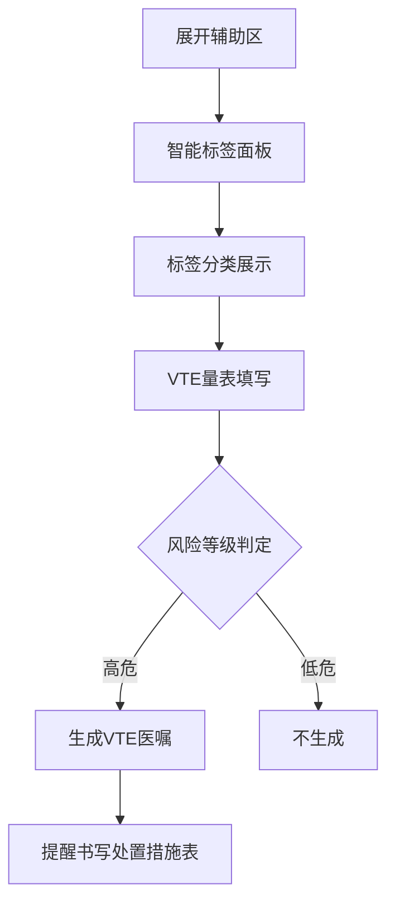
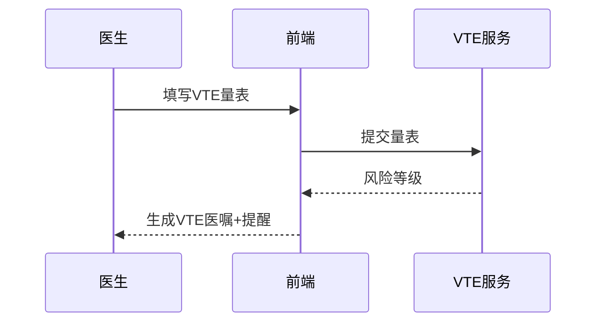

# BLGL-02-FZLR-010 智能标签引入 _ Analyst - Spec

> **需求编号**：BLGL-02-FZLR-010
> **父需求**：BLGL-02-FZLR
> **关联PM Spec**：BLGL-02-FZLR-010_智能标签引入_PM-spec.md
> **Spec版本**：V1.0
> **编写时间**：2026-08-14
> **编写人**：需求分析师

---

## 一、功能编号体系

#

## 1.1 功能层级结构

```
BLGL-02-FZLR-010-001: 智能标签调阅

BLGL-02-FZLR-010-002: VTE 评估与生成医嘱
```

#

## 1.2 功能编号表

| REQ-ID | 功能名称 | 类型 | 优先级 | 说明 |
|

----

----|

----

-----|

------|

----

----|

------|
| BLGL-02-FZLR-010-001 | 智能标签调阅 | 功能 | P0 | 辅助区智能标签面板展示标签分类与标签（搜索、标签自适应、病史时间轴、诊断标签） |
| BLGL-02-FZLR-010-002 | VTE 评估与生成医嘱 | 功能 | P0 | 根据 VTE 量表值计算风险等级，生成 VTE 医嘱并提醒书写处置措施表 |

---

## 二、核心业务流程

#

## 2.1 智能标签引入主流程



#

## 2.2 智能标签引入时序



---

## 三、功能规格说明


### BLGL-02-FZLR-010-001: 智能标签调阅

##

## 3.x.1 功能概述

辅助区智能标签面板展示标签分类与标签（搜索、标签自适应、病史时间轴、诊断标签）

##

## 3.x.2 用户角色

| 角色 | 使用场景 | 权限要求 | 操作频率 |
|

------|

----

-----|

----

-----|

----

-----|
| 住院医生 | 病历书写时在辅助区引用临床数据 | 当前就诊数据查看 | 高频 |

##

## 3.x.3 业务流程（Given/When/Then）

**Scenario 1: 调阅智能标签**

```gherkin
Given:
- 医生已打开住院病历书写界面并展开辅助区
- 存在智能标签

When:
- 点击"智能标签"面板→搜索标签

Then:
- 展示标签分类与标签（默认第一个分类）
- 标签宽度自适应、超行换行
```

**Scenario 2: 业务异常——标签重复**

```gherkin
Given:
- 全院病历查询智能标签重复

When:
- 医生查看

Then:
- 智能标签不重复
```

**Scenario 3: 数据异常——选病历文书报错**

```gherkin
Given:
- 医生选病历文书智能标签

When:
- 医生操作

Then:
- 智能标签不报错
```

**Scenario 4: 系统异常——关闭按钮失效**

```gherkin
Given:
- 智能标签关闭x

When:
- 医生点击关闭

Then:
- 智能标签可关闭
```

**Scenario 5: 边界——智能标签自动打开**

```gherkin
Given:
- 病历智能标签

When:
- 医生操作

Then:
- 智能标签自动打开
```

**Scenario 6: 边界——底部弹出布局**

```gherkin
Given:
- 辅助区下侧

When:
- 医生查看

Then:
- 智能标签横排变纵排
```

##

## 3.x.4 数据字段定义

| 字段名 | 类型 | 必填 | 默认值 | 取值范围 | 说明 | 概念ID |
|

----

----|

------|

------|

----

----|

----

-----|

------|

----

----|
| 标签名称 | String | 否 | - | - | 智能标签名称| ⏳ 待确认 |
| 标签分类 | String | 否 | - | - | 标签分类| ⏳ 待确认 |

##

## 3.x.5 验收标准

| AC编号 | 验收标准 | 对应REQ-ID | 验证方法 | 验证场景 |
|

----

----|

----

-----|

----

----

---|

----

-----|

----

-----|
| AC-001 | 点击智能标签面板，展示标签分类与标签| BLGL-02-FZLR-010-001 | 功能测试 | Scenario 1 |
| AC-002 | 标签宽度自适应| BLGL-02-FZLR-010-001 | 功能测试 | Scenario 1 |


### BLGL-02-FZLR-010-002: VTE 评估与生成医嘱

##

## 3.x.1 功能概述

根据 VTE 量表值计算风险等级，生成 VTE 医嘱并提醒书写处置措施表

##

## 3.x.2 用户角色

| 角色 | 使用场景 | 权限要求 | 操作频率 |
|

------|

----

-----|

----

-----|

----

-----|
| 住院医生 | 病历书写时在辅助区引用临床数据 | 当前就诊数据查看 | 高频 |

##

## 3.x.3 业务流程（Given/When/Then）

**Scenario 1: VTE量表生成医嘱**

```gherkin
Given:
- 医生填写 VTE 量表

When:
- 系统根据 VTE 量表值计算风险等级

Then:
- 内科3项及以上/外科任一高危项生成 VTE 医嘱，提醒书写 VTE 处置措施表
```

**Scenario 2: 业务异常——VTE评估后未生成病程**

```gherkin
Given:
- 医生评估后

When:
- 系统生成

Then:
- VTE评估后生成病程记录
```

**Scenario 3: 数据异常——自动带入异常**

```gherkin
Given:
- 同步参数已关闭

When:
- 医生操作

Then:
- VTE不自动带入（排查修复）
```

**Scenario 4: 系统异常——床位卡标签不显示**

```gherkin
Given:
- VTE评估后

When:
- 医生查看

Then:
- 床位卡标签栏显示
```

**Scenario 5: 边界——风险等级参数**

```gherkin
Given:
- 内科/外科风险项数参数

When:
- 医生配置

Then:
- 按参数判定风险等级
```

**Scenario 6: 边界——引用VTE评分**

```gherkin
Given:
- 病程记录引用VTE评分

When:
- 医生操作

Then:
- 引用VTE评分结果
```

##

## 3.x.4 数据字段定义

| 字段名 | 类型 | 必填 | 默认值 | 取值范围 | 说明 | 概念ID |
|

----

----|

------|

------|

----

----|

----

-----|

------|

----

----|
| 风险等级 | String | 否 | - | 高危/低危 | VTE风险等级| ⏳ 待确认 |
| VTE量表值 | String | 否 | - | - | VTE评估量表值| ⏳ 待确认 |

##

## 3.x.5 验收标准

| AC编号 | 验收标准 | 对应REQ-ID | 验证方法 | 验证场景 |
|

----

----|

----

-----|

----

----

---|

----

-----|

----

-----|
| AC-001 | 根据 VTE 量表值生成 VTE 医嘱| BLGL-02-FZLR-010-002 | 功能测试 | Scenario 1 |
| AC-002 | 提醒医生书写 VTE 处置措施表| BLGL-02-FZLR-010-002 | 功能测试 | Scenario 1 |


---

## 四、排除范围

本需求不包含以下功能项：

1. **书写助手与临床数据提取 —— BLGL-02-FZLR-013**
2. **待书写提醒（跨模块）—— BLGL-06-DSXTX**

---

## 五、业务规则清单

| 规则ID | 规则名称 | 规则描述 | 优先级 |
|

----

----|

----

-----|

----

-----|

------|

----

----|
| BR-001 | VTE高危判定 | 内科3项及以上/外科任一高危项判定高危| P0 |
| BR-002 | 生成医嘱+提醒 | 生成VTE医嘱同时提醒书写处置措施表| P0 |
| BR-003 | 标签默认分类 | 标签默认展示第一个分类| P1 |

---

## 六、关联文档

| 文档类型 | 文档路径 | 说明 |
|

----

-----|

----

-----|

------|
| 功能点Spec | BLGL-02-FZLR 02辅助录入功能点Spec.md（V1.0，上级目录） | Phase 1 功能点索引 |
| PM spec | 本目录 BLGL-02-FZLR-010_智能标签引入_PM-spec.md（V0.1） | PM 产出的 Spec 文档 |
| -Spec | 本目录 BLGL-02-FZLR-010_智能标签引入_Spec.md（V1.0） | 业务背景与目标 Spec |
| data-model.md | 待产出 | 架构师产出的数据建模文档 |
| design.md | 待产出 | 架构师产出的技术方案文档 |
| api-contract.md | 待产出 | 开发经理产出的 API 契约文档 |

---

## 七、待确认问题清单

| 编号 | 问题描述 | 缺失信息 | 影响范围 | 建议补充方 |
|

------|

----

-----|

----

-----|

----

-----|

----

----

---|
| Q-001 | VTE评估接口/数据表 | API 契约文档/数据表清单 | -Spec 第4、5章 | 开发经理/架构师 |
| Q-002 | 性能指标 | 非功能性需求 | -Spec 第8章 | 需求分析师 |

---

## 填写检查清单

| 序号 | 检查项 | 是否完成 |
|:

----:|

----

----|:

----

----:|
| 1 | 功能编号带父子层级 | ✅ |
| 2 | 每个 REQ-ID 有功能概述和用户角色 | ✅ |
| 3 | 主流程至少 1 个 Given/When/Then 场景 | ✅ |
| 4 | 异常流程至少 3 个 Given/When/Then 场景 | ✅ |
| 5 | 边界流程至少 2 个 Given/When/Then 场景 | ✅ |
| 6 | 每个 Given/When/Then 内容具体，不模糊 | ✅ |
| 7 | 数据字段定义完整（字段名、类型、必填、说明、概念ID） | ✅ |
| 8 | 验收标准 AC 编号独立，可验证 | ✅ |
| 9 | 验收标准无"功能正常"等模糊表述 | ✅ |
| 10 | 排除范围明确列出 | ✅ |
| 11 | 业务规则清单列出所有规则，每条标注来源 | ✅ |
| 12 | 流程图使用 Mermaid 格式（≥2 个） | ✅ |
| 13 | 关联文档索引包含 Phase 1 功能点Spec | ✅ |
| 14 | 待确认问题清单汇总了全文所有 ⏳ 项 | ✅ |
| 15 | 全文无占位符 `< >` 残留 | ✅ |
| 16 | 全文陈述可溯源至资料区（S1~S10 溯源核查） | ✅ |
| 17 | 人工审核确认完成 | ⏳ 待确认 |

---

**文档状态**：⬜ 待审核
**维护责任**：需求分析师规范组
**下次更新**：根据评审反馈优化

---

## 版本历史

| 版本 | 日期 | 变更说明 | 编写人 |
|

------|

------|

----

-----|

----

----|
| V1.0 | 2026-08-14 | 初始版本 | 需求分析师 |
