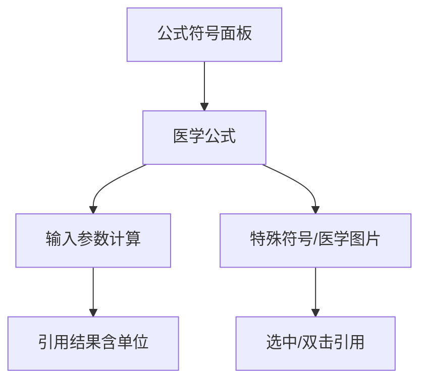
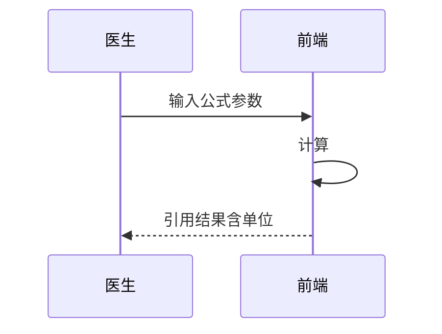

# BLGL-02-FZLR-014 公式符号引用 _ Analyst - Spec

> **需求编号**：BLGL-02-FZLR-014
> **父需求**：BLGL-02-FZLR
> **关联PM Spec**：BLGL-02-FZLR-014_公式符号引用_PM-spec.md
> **Spec版本**：V1.0
> **编写时间**：2026-08-14
> **编写人**：需求分析师

---

## 一、功能编号体系

#

## 1.1 功能层级结构

```
BLGL-02-FZLR-014-001: 医学公式引用

BLGL-02-FZLR-014-002: 特殊符号与医学图片引用
```

#

## 1.2 功能编号表

| REQ-ID | 功能名称 | 类型 | 优先级 | 说明 |
|

----

----|

----

-----|

------|

----

----|

------|
| BLGL-02-FZLR-014-001 | 医学公式引用 | 功能 | P0 | 辅助区公式符号面板引用医学公式（体表面积、简易MDRD/eGFR等） |
| BLGL-02-FZLR-014-002 | 特殊符号与医学图片引用 | 功能 | P0 | 辅助区公式符号面板引用特殊符号、医学图片（拖动排序） |

---

## 二、核心业务流程

#

## 2.1 公式符号引用主流程



#

## 2.2 公式符号引用时序



---

## 三、功能规格说明


### BLGL-02-FZLR-014-001: 医学公式引用

##

## 3.x.1 功能概述

辅助区公式符号面板引用医学公式（体表面积、简易MDRD/eGFR等）

##

## 3.x.2 用户角色

| 角色 | 使用场景 | 权限要求 | 操作频率 |
|

------|

----

-----|

----

-----|

----

-----|
| 住院医生 | 病历书写时在辅助区引用临床数据 | 当前就诊数据查看 | 高频 |

##

## 3.x.3 业务流程（Given/When/Then）

**Scenario 1: 引用医学公式**

```gherkin
Given:
- 医生已打开住院病历书写界面并展开辅助区

When:
- 点击"公式符号"→医学公式→输入参数

Then:
- 计算并引用医学公式结果（含单位）到病历
```

**Scenario 2: 业务异常——体表面积公式**

```gherkin
Given:
- 体表面积公式计算方式

When:
- 医生配置

Then:
- 成人/小孩体表面积公式可配置
```

**Scenario 3: 数据异常——MDRD单位**

```gherkin
Given:
- 简易MDRD计算结果

When:
- 医生插入

Then:
- 带入单位 eGFR: xx ml/min1.73m2
```

**Scenario 4: 系统异常——医学公式显示空白**

```gherkin
Given:
- 医学公式显示空白

When:
- 医生查看

Then:
- 医学公式正常显示
```

**Scenario 5: 边界——公式收藏**

```gherkin
Given:
- 医学公式收藏/全部筛选

When:
- 医生操作

Then:
- 已收藏公式显示在收藏下可拖拽排序
```

**Scenario 6: 边界——性别相关公式**

```gherkin
Given:
- 涉及性别的公式

When:
- 医生录入

Then:
- 性别统一放置第一位
```

##

## 3.x.4 数据字段定义

| 字段名 | 类型 | 必填 | 默认值 | 取值范围 | 说明 | 概念ID |
|

----

----|

------|

------|

----

----|

----

-----|

------|

----

----|
| 体表面积 | String | 否 | - | - | 体表面积公式| ⏳ 待确认 |
| eGFR | String | 否 | - | - | 肾小球滤过率| ⏳ 待确认 |

##

## 3.x.5 验收标准

| AC编号 | 验收标准 | 对应REQ-ID | 验证方法 | 验证场景 |
|

----

----|

----

-----|

----

----

---|

----

-----|

----

-----|
| AC-001 | 引用医学公式结果（含单位）插入病历| BLGL-02-FZLR-014-001 | 功能测试 | Scenario 1 |
| AC-002 | 体表面积公式可配置| BLGL-02-FZLR-014-001 | 功能测试 | Scenario 1 |


### BLGL-02-FZLR-014-002: 特殊符号与医学图片引用

##

## 3.x.1 功能概述

辅助区公式符号面板引用特殊符号、医学图片（拖动排序）

##

## 3.x.2 用户角色

| 角色 | 使用场景 | 权限要求 | 操作频率 |
|

------|

----

-----|

----

-----|

----

-----|
| 住院医生 | 病历书写时在辅助区引用临床数据 | 当前就诊数据查看 | 高频 |

##

## 3.x.3 业务流程（Given/When/Then）

**Scenario 1: 引用特殊符号/医学图片**

```gherkin
Given:
- 医生已打开公式符号面板

When:
- 单击选中符号/双击引用符号/预览医学图片

Then:
- 特殊符号、医学图片引用到病历
```

**Scenario 2: 业务异常——特殊符号缺失**

```gherkin
Given:
- 短语引用无特殊符号只有医学公式

When:
- 医生查看

Then:
- 特殊符号正常显示
```

**Scenario 3: 数据异常——特殊符号排序**

```gherkin
Given:
- 医学图片/特殊符号拖动排序

When:
- 医生操作

Then:
- 支持拖动排序
```

**Scenario 4: 系统异常——底部弹出布局**

```gherkin
Given:
- 辅助区下侧

When:
- 医生查看

Then:
- 公式符号树状结构平铺
```

**Scenario 5: 边界——右键打开特殊符号**

```gherkin
Given:
- 右键菜单配置打开特殊符号

When:
- 医生右键

Then:
- 定位符号界面
```

**Scenario 6: 边界——快速引用特殊符号**

```gherkin
Given:
- 快速引用特殊符号

When:
- 医生操作

Then:
- 快速引用
```

##

## 3.x.4 数据字段定义

| 字段名 | 类型 | 必填 | 默认值 | 取值范围 | 说明 | 概念ID |
|

----

----|

------|

------|

----

----|

----

-----|

------|

----

----|
| 特殊符号 | String | 否 | - | - | 特殊符号| ⏳ 待确认 |
| 医学图片 | String | 否 | - | - | 医学图片| ⏳ 待确认 |

##

## 3.x.5 验收标准

| AC编号 | 验收标准 | 对应REQ-ID | 验证方法 | 验证场景 |
|

----

----|

----

-----|

----

----

---|

----

-----|

----

-----|
| AC-001 | 引用特殊符号/医学图片到病历| BLGL-02-FZLR-014-002 | 功能测试 | Scenario 1 |
| AC-002 | 医学图片/特殊符号支持拖动排序| BLGL-02-FZLR-014-002 | 功能测试 | Scenario 1 |


---

## 四、排除范围

本需求不包含以下功能项：

1. **书写助手与临床数据提取 —— BLGL-02-FZLR-013**
2. **短语引用（基线能力）—— Phase 1 第6章 BC-FZLR-001**

---

## 五、业务规则清单

| 规则ID | 规则名称 | 规则描述 | 优先级 |
|

----

----|

----

-----|

----

-----|

------|

----

----|
| BR-001 | 体表面积公式 | 成人/小孩体表面积公式可配置| P0 |
| BR-002 | MDRD单位 | 简易MDRD结果带单位| P0 |
| BR-003 | 拖动排序 | 医学图片/特殊符号拖动排序| P1 |

---

## 六、关联文档

| 文档类型 | 文档路径 | 说明 |
|

----

-----|

----

-----|

------|
| 功能点Spec | BLGL-02-FZLR 02辅助录入功能点Spec.md（V1.0，上级目录） | Phase 1 功能点索引 |
| PM spec | 本目录 BLGL-02-FZLR-014_公式符号引用_PM-spec.md（V0.1） | PM 产出的 Spec 文档 |
| -Spec | 本目录 BLGL-02-FZLR-014_公式符号引用_Spec.md（V1.0） | 业务背景与目标 Spec |
| data-model.md | 待产出 | 架构师产出的数据建模文档 |
| design.md | 待产出 | 架构师产出的技术方案文档 |
| api-contract.md | 待产出 | 开发经理产出的 API 契约文档 |

---

## 七、待确认问题清单

| 编号 | 问题描述 | 缺失信息 | 影响范围 | 建议补充方 |
|

------|

----

-----|

----

-----|

----

-----|

----

----

---|
| Q-001 | 医学公式计算接口 | API 契约文档 | -Spec 第5章 | 开发经理 |
| Q-002 | 性能指标 | 非功能性需求 | -Spec 第8章 | 需求分析师 |

---

## 填写检查清单

| 序号 | 检查项 | 是否完成 |
|:

----:|

----

----|:

----

----:|
| 1 | 功能编号带父子层级 | ✅ |
| 2 | 每个 REQ-ID 有功能概述和用户角色 | ✅ |
| 3 | 主流程至少 1 个 Given/When/Then 场景 | ✅ |
| 4 | 异常流程至少 3 个 Given/When/Then 场景 | ✅ |
| 5 | 边界流程至少 2 个 Given/When/Then 场景 | ✅ |
| 6 | 每个 Given/When/Then 内容具体，不模糊 | ✅ |
| 7 | 数据字段定义完整（字段名、类型、必填、说明、概念ID） | ✅ |
| 8 | 验收标准 AC 编号独立，可验证 | ✅ |
| 9 | 验收标准无"功能正常"等模糊表述 | ✅ |
| 10 | 排除范围明确列出 | ✅ |
| 11 | 业务规则清单列出所有规则，每条标注来源 | ✅ |
| 12 | 流程图使用 Mermaid 格式（≥2 个） | ✅ |
| 13 | 关联文档索引包含 Phase 1 功能点Spec | ✅ |
| 14 | 待确认问题清单汇总了全文所有 ⏳ 项 | ✅ |
| 15 | 全文无占位符 `< >` 残留 | ✅ |
| 16 | 全文陈述可溯源至资料区（S1~S10 溯源核查） | ✅ |
| 17 | 人工审核确认完成 | ⏳ 待确认 |

---

**文档状态**：⬜ 待审核
**维护责任**：需求分析师规范组
**下次更新**：根据评审反馈优化

---

## 版本历史

| 版本 | 日期 | 变更说明 | 编写人 |
|

------|

------|

----

-----|

----

----|
| V1.0 | 2026-08-14 | 初始版本 | 需求分析师 |
