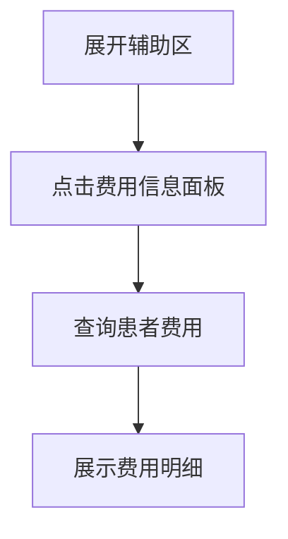
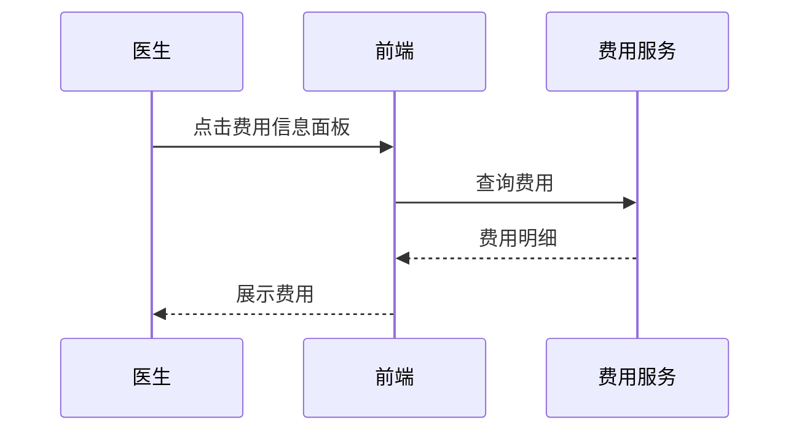

# BLGL-02-FZLR-015 费用信息查看 - Spec

> **功能编号**：BLGL-02-FZLR-015
> **文档类型**：功能Spec（业务背景与设计）
> **文档版本**：V1.0
> **编写时间**：2026-08-14
> **编写人**：RACC

---

## 文档索引

#

### 章节索引

**本文档（功能Spec：业务背景与设计）**

| 章节号 | 章节名称 | 内容说明 |
|

----

----|

----

-----|

----

-----|
| 第1章 | 文档概述 | 文档目的、文档范围、术语定义、阅读指南、参考文档 |
| 第2章 | 功能背景与定位 | 功能背景、功能定位、目标用户、核心价值 |
| 第3章 | 业务流程设计 | 主流程/异常流程/边界流程（Given/When/Then） |
| 第4章 | 数据模型设计 | 核心数据结构、状态定义、系统参数定义 |
| 第5章 | 接口契约设计 | API列表、接口详细设计、错误码定义 |
| 第6章 | 技术方案设计 | 页面路径、技术栈、关键技术点、部署方案 |
| 第7章 | 测试用例预设计 | 功能/边界/异常/性能测试用例 |
| 第8章 | 非功能性要求 | 性能、安全、可用性、兼容性 |
| 第9章 | 依赖与风险 | 外部依赖、风险项 |
| 第10章 | 附录 | 流程图、时序图、参考文档 |

**PM-Spec（需求规格）**：目标/约束/验收标准/排除范围/关键决策/优先级
**Analyst-Spec（分析规格）**：功能编号体系/核心业务流程/功能规格/排除范围/业务规则/关联文档/待确认问题

#

### 版本历史

| 版本 | 日期 | 变更说明 | 编写人 |
|

------|

------|

----

-----|

----

----|
| V1.0 | 2026-08-14 | 初始版本 | RACC |

#

### 关联文档索引

| 序号 | 文档名称 | 文档类型 | 版本 | 位置 |
|

------|

----

-----|

----

-----|

------|

------|
| 1 | BLGL-02-FZLR-015_费用信息查看_Spec.md | 功能Spec（业务背景与设计）（本文档） | V1.0 | 本目录 |
| 2 | BLGL-02-FZLR-015_费用信息查看_PM-spec.md | PM-Spec（需求规格） | V0.1 | 本目录 |
| 3 | BLGL-02-FZLR-015_费用信息查看_Analyst-spec.md | Analyst-Spec（分析规格） | V1.0 | 本目录 |
| 4 | BLGL-02-FZLR 02辅助录入功能点Spec.md | 功能点Spec（模块级） | V1.0 | 上级目录 |

---

## 1、文档概述

#

## 1.1、文档目的

本文档旨在明确"费用信息查看"功能（BLGL-02-FZLR-015）的业务背景与设计方案，为需求分析、研发实现、测试验收及评审提供统一的业务上下文、设计口径与决策依据。

#

## 1.2、文档范围

#

#

## 1.2.1 纳入范围

本文档覆盖费用信息查看的完整业务背景与设计，包括：

- 费用信息查看：辅助区费用信息面板查看患者费用（住院费用、最终账单）

#

#

## 1.2.2 排除范围

本文档不涉及以下内容（详见其他功能点或模块）：

- 费用信息管理（病案首页）—— BLGL-13-BASY-004
- 诊疗回顾调阅 —— BLGL-02-FZLR-016

#

## 1.3、术语定义

| 术语 | 定义 |
|

------|

------|
| 费用信息 | 患者住院费用、最终账单|

#

## 1.4、阅读指南


- **章节关系**：第1~2章为业务全貌，第3~10章为设计实现层。与 Analyst-Spec、PM-Spec 互相引用保持一致。

- **读者对象**：产品经理/需求分析师读第1~2章；研发读第3~6、9~10章；测试读第3、7~8章；评审人员核对各层一致性。

#

## 1.5、参考文档

| 序号 | 文档名称 | 版本/日期 |
|

------|

----

-----|

----

------|
| 1 | 【历史需求】住院病历的历史需求.xlsx | - |
| 2 | BLGL-02-FZLR-015_费用信息查看_PM-spec.md | V0.1 |
| 3 | BLGL-02-FZLR-015_费用信息查看_Analyst-spec.md | V1.0 |
| 4 | BLGL-02-FZLR 02辅助录入功能点Spec.md | V1.0 |

---

## 2、功能背景与定位

#

## 2.1 功能背景

费用信息查看是辅助录入模块的财务支撑面板，需满足：


- **现状痛点**：医生书写病历时需查看患者费用（病理费用等），费用查询未迁移到病历辅助区
- **历史需求演进**：从费用查询复制到患者界面→ 辅助录入菜单增加费用查询→ 费用信息引用置灰

#

## 2.2 功能定位

"费用信息查看"是 WiNEX 病历管理-辅助录入的重要功能点，定位为：


- **费用数据源**：查看患者费用明细（住院费用/最终账单）
- **菜单集成**：辅助录入菜单集成费用信息

#

## 2.3 目标用户

| 用户角色 | 主要使用场景 |
|

----

-----|

----

----

-----|
| 住院医生 | 病历书写时在辅助区引用临床数据 |

#

## 2.4 核心价值

| 价值维度 | 价值描述 |
|

----

-----|

----

-----|
| 效率提升 | 医生书病历时查看费用信息|

---

## 3、业务流程设计（Given/When/Then）

#

## 3.1 主流程

**Scenario 1: 费用信息查看**

```gherkin
Given:
- 医生已打开辅助区

When:
- 点击"费用信息"面板

Then:
- 展示患者费用明细
```

#

## 3.2 异常流程

**Scenario 2: 业务异常——质控不显示**

```gherkin
Given:
- 环节质控住院费用

When:
- 医生查看

Then:
- 正常显示
```

**Scenario 3: 数据异常——引用置灰**

```gherkin
Given:
- 费用已引用

When:
- 医生查看

Then:
- 置灰
```

**Scenario 4: 系统异常——菜单缺失**

```gherkin
Given:
- 菜单缺费用查询

When:
- 医生查看

Then:
- 增加费用查询
```

#

## 3.3 边界流程

**Scenario 5: 边界——菜单术语**

```gherkin
Given:
- 新增费用信息

When:
- 医生查看

Then:
- 新增术语值
```

**Scenario 6: 边界——查询位置**

```gherkin
Given:
- 迁移费用查询

When:
- 医生查看

Then:
- 自定义位置
```

---

## 4、数据模型设计

#

## 4.1 核心数据结构

#

#

## 4.1.1 核心保存请求 / 查询入参

| 字段名 | 类型 | 必填 | 备注 |
|

----

----|

------|

------|

------|
| 费用明细 | String | 否 | 费用明细|

#

#

## 4.1.2 核心表/实体

| 表/实体 | 关键字段 | 说明 |
|

----

-----|

----

-----|

------|
| ⏳ 待确认 | - | 费用信息表未明确 |

#

## 4.2 状态定义

| ⏳ 待确认 | 状态定义 | 状态定义未在资料区中找到 |

#

## 4.3 系统参数定义

| 参数编码 | 参数名称 | 说明 |
|

----

-----|

----

-----|

------|
| 399573996 | 辅助录入菜单启用配置 | 新增术语值"费用信息"|

---

## 5、接口契约设计

#

## 5.1 API列表

| 序号 | API名称（代码函数） | 路径 | 方法 | 说明 |
|:

----:|

----

-----|

------|:

----:|

------|
| 1 | queryInpatientOnedayExpenseByExample | /api/v1/inpatient_emr_write/... | POST | 查询患者费用|

#

## 5.2 接口详细设计

⏳ 待确认：费用查询接口以 API 契约文档为准（InpEmrDayExpenseDetailOutputVO，来源：代码）。

#

## 5.3 错误码定义

| 错误码 | 错误信息 | 处理方式 |
|

----

----|

----

-----|

----

-----|
| ⏳ 待确认 | 费用查询失败 | 提示错误并返回面板 |

---

## 6、技术方案设计

#

## 6.1 页面路径


- **页面路径**: 住院医生站→住院病历书写界面→右侧辅助区→费用信息面板（AuxiliaryOnCostInfo）

- **核心逻辑模块**: InpatientEMRAidWriteController（queryInpatientOnedayExpenseByExample，来源：代码）

#

## 6.2 技术栈

| 类别 | 技术 | 版本 |
|

------|

------|

------|
| 前端框架 | Vue | 2.6.14 |
| 前端UI | element-ui | 2.13.0 |
| 后端框架 | Spring Boot（Java） | 17 |

#

## 6.3 关键技术点

- 费用查询接口

#

## 6.4 部署方案

⏳ 待确认：部署方案未在资料区中找到。

---

## 7、测试用例预设计

#

## 7.1 功能测试

| TC-001 | 费用信息查看 | 见主流程 Scenario 1 | 执行费用信息查看操作 | 见主流程 Then 预期结果 |

#

## 7.2 边界测试

| TC-001 | 费用信息查看边界 | 见边界流程 Scenario 5 | 执行边界操作 | 见边界流程 Then 预期结果 |

#

## 7.3 异常测试

| TC-001 | 费用信息查看异常 | 见异常流程 Scenario 2~4 | 执行异常操作 | 见异常流程 Then 预期结果 |

#

## 7.4 性能测试

| 用例编号 | 测试场景 | 指标 |
|

----

-----|

----

-----|

------|
| TC-00X | 费用信息查看响应 | ⏳ 待确认：性能指标未在资料区中找到 |

---

## 8、非功能性要求

#

## 8.1 性能要求

| 指标 | 要求 |
|

------|

------|
| 费用信息查看响应时间 | ⏳ 待确认 |

#

## 8.2 安全要求

| 要求 | 说明 |
|

------|

------|
| 数据权限 | 按就诊/患者范围隔离展示|

**医疗行业特殊要求**

| 要求 | 说明 |
|

------|

------|
| 临床数据准确性 | 引用内容与源报告一致|

#

## 8.3 可用性要求

| 指标 | 要求值 |
|

------|

----

----|
| 可用性 | ⏳ 待确认 |

#

## 8.4 兼容性要求

| 类型 | 要求 |
|

------|

------|
| 显示模式 | 右侧/底部/弹框三种辅助区显示位置均需支持|

---

## 9、依赖与风险

#

## 9.1 外部依赖

| 依赖项 | 说明 |
|

----

----|

------|
| HIS/费用系统 | 费用数据源|

#

## 9.2 风险项

| 风险项 | 等级 | 说明 | 应对方案 |
|

----

----|

------|

------|

----

-----|
| 费用不显示 | 中 | 质控界面住院费用不显示| 排查接口 |

---

## 10、附录

#

## 10.1 流程图



#

## 10.2 时序图



#

## 10.3 参考文档

- 【历史需求】住院病历的历史需求.xlsx- BLGL-02-FZLR 02辅助录入功能点Spec.md（V1.0，第5章 BLGL-02-FZLR-015 行）
- 关联Spec：BLGL-02-FZLR-015_费用信息查看_PM-spec.md、BLGL-02-FZLR-015_费用信息查看_Analyst-spec.md

---

## 填写检查清单

| 序号 | 检查项 | 是否完成 |
|:

----:|

----

----|:

----

----:|
| 1 | 章节索引与正文章节一致 | ✅ |
| 2 | 版本历史记录完整 | ✅ |
| 3 | 关联文档索引已登记全部Spec | ✅ |
| 4 | 文档目的明确回答"为什么做/做成什么/怎么做" | ✅ |
| 5 | 纳入范围/排除范围清晰 | ✅ |
| 6 | 术语定义覆盖关键概念，从资料区可溯源 | ✅ |
| 7 | 参考文档已登记 | ✅ |
| 8 | 功能背景基于法规/规范/需求来源组织 | ✅ |
| 9 | 功能定位体现业务价值（3~5个定位点） | ✅ |
| 10 | 目标用户角色覆盖完整，在需求原文中有出处 | ✅ |
| 11 | 核心价值可陈述，与 Phase 1 口径一致 | ✅ |
| 12 | 业务流程：主流程≥1、异常≥3、边界≥2，Given/When/Then 具体 | ✅ |
| 13 | 数据模型：字段/表/状态/参数可溯源 | ✅ |
| 14 | 接口契约：API列表+详细设计+错误码齐全或标记待确认 | ✅ |
| 15 | 技术方案：页面路径/技术栈/关键点/部署方案或标记待确认 | ✅ |
| 16 | 测试用例：功能/边界/异常/性能覆盖 | ✅ |
| 17 | 非功能性要求：性能/安全/可用性/兼容性指标可量化或标记待确认 | ✅ |
| 18 | 依赖与风险：外部依赖登记完整 | ✅ |
| 19 | 附录：流程图/时序图与正文流程一致 | ✅ |
| 20 | 全文无占位符 `< >` 残留 | ✅ |
| 21 | 全文陈述可溯源至资料区 | ✅ |
| 22 | 人工审核确认完成 | ⏳ 待确认 |

---

**文档状态**：⬜ 待审核
**维护责任**：RACC
**下次更新**：根据评审反馈优化
