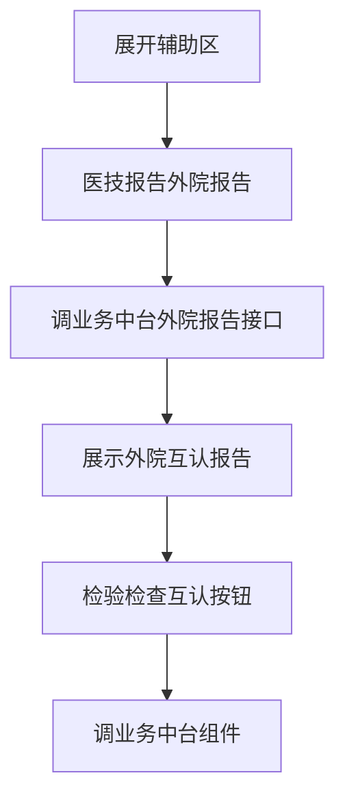
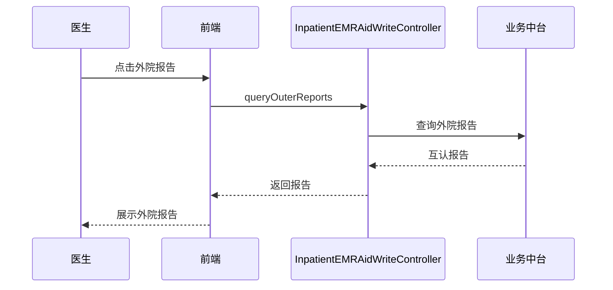

# BLGL-02-FZLR-017 检查互认调阅 _ Analyst - Spec

> **需求编号**：BLGL-02-FZLR-017
> **父需求**：BLGL-02-FZLR
> **关联PM Spec**：BLGL-02-FZLR-017_检查互认调阅_PM-spec.md
> **Spec版本**：V1.0
> **编写时间**：2026-08-14
> **编写人**：需求分析师

---

## 一、功能编号体系

#

## 1.1 功能层级结构

```
BLGL-02-FZLR-017-001: 外院互认报告调阅

BLGL-02-FZLR-017-002: 检查互认与互认统计
```

#

## 1.2 功能编号表

| REQ-ID | 功能名称 | 类型 | 优先级 | 说明 |
|

----

----|

----

-----|

------|

----

----|

------|
| BLGL-02-FZLR-017-001 | 外院互认报告调阅 | 功能 | P0 | 辅助区医技报告外院报告调阅院外互认报告（增加医疗机构名称、互认标志、不互认理由） |
| BLGL-02-FZLR-017-002 | 检查互认与互认统计 | 功能 | P0 | 辅助区检验检查互认按钮调用业务中台组件，互认统计展示 |

---

## 二、核心业务流程

#

## 2.1 检查互认调阅主流程



#

## 2.2 检查互认调阅时序



---

## 三、功能规格说明


### BLGL-02-FZLR-017-001: 外院互认报告调阅

##

## 3.x.1 功能概述

辅助区医技报告外院报告调阅院外互认报告（增加医疗机构名称、互认标志、不互认理由）

##

## 3.x.2 用户角色

| 角色 | 使用场景 | 权限要求 | 操作频率 |
|

------|

----

-----|

----

-----|

----

-----|
| 住院医生 | 病历书写时在辅助区引用临床数据 | 当前就诊数据查看 | 高频 |

##

## 3.x.3 业务流程（Given/When/Then）

**Scenario 1: 调阅外院互认报告**

```gherkin
Given:
- 医生已打开住院病历书写界面并展开辅助区
- 参数启用外院报告

When:
- 点击医技报告→【外院报告】
- 调用业务中台外院报告接口

Then:
- 展示外院检查/检验/微生物报告，增加互认三字段
```

**Scenario 2: 业务异常——互认字段缺失**

```gherkin
Given:
- 外院报告缺互认字段

When:
- 医生查看

Then:
- 补 encRegSeqNo、employeeNo 入参
```

**Scenario 3: 数据异常——外院报告无数据**

```gherkin
Given:
- 外院报告无数据

When:
- 医生查看

Then:
- 补充调阅字段支持互认显示
```

**Scenario 4: 系统异常——外院报告报错**

```gherkin
Given:
- 外院报告打开报错

When:
- 医生操作

Then:
- 修复报错
```

**Scenario 5: 边界——外院报告字段**

```gherkin
Given:
- 外院检查检验微生物

When:
- 医生查看

Then:
- 增加医疗机构名称/互认标志/不互认理由
```

**Scenario 6: 边界——双检平台对接**

```gherkin
Given:
- 对接双检平台

When:
- 医生查看

Then:
- 补充外院报告调阅字段
```

##

## 3.x.4 数据字段定义

| 字段名 | 类型 | 必填 | 默认值 | 取值范围 | 说明 | 概念ID |
|

----

----|

------|

------|

----

----|

----

-----|

------|

----

----|
| 医疗机构名称 | String | 否 | - | - | 外院报告字段| ⏳ 待确认 |
| 互认标志/不互认理由 | String | 否 | - | - | 互认字段| ⏳ 待确认 |
| encRegSeqNo/employeeNo | String | 是 | - | - | 外院报告必传入参| ⏳ 待确认 |

##

## 3.x.5 验收标准

| AC编号 | 验收标准 | 对应REQ-ID | 验证方法 | 验证场景 |
|

----

----|

----

-----|

----

----

---|

----

-----|

----

-----|
| AC-001 | 点击外院报告，展示外院互认报告| BLGL-02-FZLR-017-001 | 功能测试 | Scenario 1 |
| AC-002 | 增加互认三字段| BLGL-02-FZLR-017-001 | 功能测试 | Scenario 1 |


### BLGL-02-FZLR-017-002: 检查互认与互认统计

##

## 3.x.1 功能概述

辅助区检验检查互认按钮调用业务中台组件，互认统计展示

##

## 3.x.2 用户角色

| 角色 | 使用场景 | 权限要求 | 操作频率 |
|

------|

----

-----|

----

-----|

----

-----|
| 住院医生 | 病历书写时在辅助区引用临床数据 | 当前就诊数据查看 | 高频 |

##

## 3.x.3 业务流程（Given/When/Then）

**Scenario 1: 检查检验互认**

```gherkin
Given:
- 医生已打开辅助区

When:
- 点击检验检查互认按钮

Then:
- 调用业务中台组件，原接口增加 remoteType 固定传参
```

**Scenario 2: 业务异常——互认报告无法取值**

```gherkin
Given:
- 病历互认报告无法取值

When:
- 医生查看

Then:
- 互认报告正常取值
```

**Scenario 3: 数据异常——互认报告无法引用**

```gherkin
Given:
- 检查结果互认无法引用

When:
- 医生引用

Then:
- 互认报告可引用到病历
```

**Scenario 4: 系统异常——互认统计报错**

```gherkin
Given:
- 互认统计报错未获取互认记录

When:
- 医生查看

Then:
- 互认统计正常
```

**Scenario 5: 边界——右键插入互认**

```gherkin
Given:
- 住院病历右键插入互认

When:
- 医生右键

Then:
- 右键插入互认
```

**Scenario 6: 边界——互认统计跨院影像**

```gherkin
Given:
- 互认统计跨院影像及DRG营运

When:
- 医生查看

Then:
- 调用正常
```

##

## 3.x.4 数据字段定义

| 字段名 | 类型 | 必填 | 默认值 | 取值范围 | 说明 | 概念ID |
|

----

----|

------|

------|

----

----|

----

-----|

------|

----

----|
| remoteType | String | 是 | 399743790 | - | 互认按钮固定传参| ⏳ 待确认 |

##

## 3.x.5 验收标准

| AC编号 | 验收标准 | 对应REQ-ID | 验证方法 | 验证场景 |
|

----

----|

----

-----|

----

----

---|

----

-----|

----

-----|
| AC-001 | 点击检验检查互认按钮，调用业务中台组件| BLGL-02-FZLR-017-002 | 功能测试 | Scenario 1 |
| AC-002 | 互认报告可引用到病历| BLGL-02-FZLR-017-002 | 功能测试 | Scenario 1 |


---

## 四、排除范围

本需求不包含以下功能项：

1. **医技报告调阅与引用 —— BLGL-02-FZLR-001/002/003**
2. **远程会诊调阅 —— BLGL-02-FZLR-018**

---

## 五、业务规则清单

| 规则ID | 规则名称 | 规则描述 | 优先级 |
|

----

----|

----

-----|

----

-----|

------|

----

----|
| BR-001 | 互认三字段 | 外院报告增加医疗机构名称/互认标志/不互认理由| P0 |
| BR-002 | 互认传参 | remoteType 固定传参 399743790| P0 |

---

## 六、关联文档

| 文档类型 | 文档路径 | 说明 |
|

----

-----|

----

-----|

------|
| 功能点Spec | BLGL-02-FZLR 02辅助录入功能点Spec.md（V1.0，上级目录） | Phase 1 功能点索引 |
| PM spec | 本目录 BLGL-02-FZLR-017_检查互认调阅_PM-spec.md（V0.1） | PM 产出的 Spec 文档 |
| -Spec | 本目录 BLGL-02-FZLR-017_检查互认调阅_Spec.md（V1.0） | 业务背景与目标 Spec |
| data-model.md | 待产出 | 架构师产出的数据建模文档 |
| design.md | 待产出 | 架构师产出的技术方案文档 |
| api-contract.md | 待产出 | 开发经理产出的 API 契约文档 |

---

## 七、待确认问题清单

| 编号 | 问题描述 | 缺失信息 | 影响范围 | 建议补充方 |
|

------|

----

-----|

----

-----|

----

-----|

----

----

---|
| Q-001 | 外院报告接口完整入参/出参 | API 契约文档 | -Spec 第5章 | 开发经理 |
| Q-002 | 互认报告数据表名 | 数据表清单 | 数据模型 4.1 | 架构师 |

---

## 填写检查清单

| 序号 | 检查项 | 是否完成 |
|:

----:|

----

----|:

----

----:|
| 1 | 功能编号带父子层级 | ✅ |
| 2 | 每个 REQ-ID 有功能概述和用户角色 | ✅ |
| 3 | 主流程至少 1 个 Given/When/Then 场景 | ✅ |
| 4 | 异常流程至少 3 个 Given/When/Then 场景 | ✅ |
| 5 | 边界流程至少 2 个 Given/When/Then 场景 | ✅ |
| 6 | 每个 Given/When/Then 内容具体，不模糊 | ✅ |
| 7 | 数据字段定义完整（字段名、类型、必填、说明、概念ID） | ✅ |
| 8 | 验收标准 AC 编号独立，可验证 | ✅ |
| 9 | 验收标准无"功能正常"等模糊表述 | ✅ |
| 10 | 排除范围明确列出 | ✅ |
| 11 | 业务规则清单列出所有规则，每条标注来源 | ✅ |
| 12 | 流程图使用 Mermaid 格式（≥2 个） | ✅ |
| 13 | 关联文档索引包含 Phase 1 功能点Spec | ✅ |
| 14 | 待确认问题清单汇总了全文所有 ⏳ 项 | ✅ |
| 15 | 全文无占位符 `< >` 残留 | ✅ |
| 16 | 全文陈述可溯源至资料区（S1~S10 溯源核查） | ✅ |
| 17 | 人工审核确认完成 | ⏳ 待确认 |

---

**文档状态**：⬜ 待审核
**维护责任**：需求分析师规范组
**下次更新**：根据评审反馈优化

---

## 版本历史

| 版本 | 日期 | 变更说明 | 编写人 |
|

------|

------|

----

-----|

----

----|
| V1.0 | 2026-08-14 | 初始版本 | 需求分析师 |
