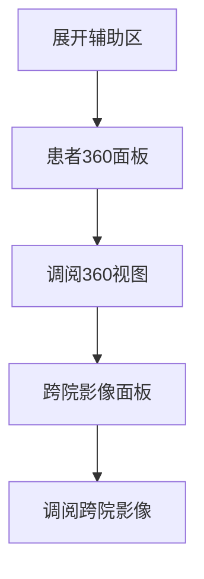
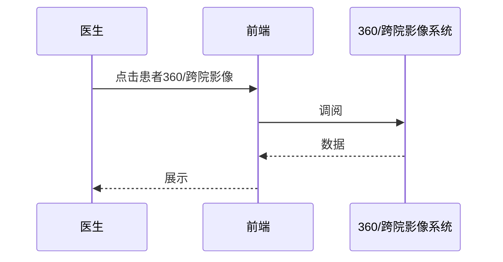

# BLGL-02-FZLR-019 患者360与跨院影像调阅 _ Analyst - Spec

> **需求编号**：BLGL-02-FZLR-019
> **父需求**：BLGL-02-FZLR
> **关联PM Spec**：BLGL-02-FZLR-019_患者360与跨院影像调阅_PM-spec.md
> **Spec版本**：V1.0
> **编写时间**：2026-08-14
> **编写人**：需求分析师

---

## 一、功能编号体系

#

## 1.1 功能层级结构

```
BLGL-02-FZLR-019-001: 患者360调阅

BLGL-02-FZLR-019-002: 跨院影像调阅
```

#

## 1.2 功能编号表

| REQ-ID | 功能名称 | 类型 | 优先级 | 说明 |
|

----

----|

----

-----|

------|

----

----|

------|
| BLGL-02-FZLR-019-001 | 患者360调阅 | 功能 | P0 | 辅助区患者360面板调阅患者360视图（记忆大小、ThirdToken传参） |
| BLGL-02-FZLR-019-002 | 跨院影像调阅 | 功能 | P0 | 辅助区跨院影像/区域影像面板调阅跨院影像 |

---

## 二、核心业务流程

#

## 2.1 患者360与跨院影像调阅主流程



#

## 2.2 患者360与跨院影像调阅时序



---

## 三、功能规格说明


### BLGL-02-FZLR-019-001: 患者360调阅

##

## 3.x.1 功能概述

辅助区患者360面板调阅患者360视图（记忆大小、ThirdToken传参）

##

## 3.x.2 用户角色

| 角色 | 使用场景 | 权限要求 | 操作频率 |
|

------|

----

-----|

----

-----|

----

-----|
| 住院医生 | 病历书写时在辅助区引用临床数据 | 当前就诊数据查看 | 高频 |

##

## 3.x.3 业务流程（Given/When/Then）

**Scenario 1: 调阅患者360**

```gherkin
Given:
- 医生已打开住院病历书写界面并展开辅助区

When:
- 点击"患者360"面板

Then:
- 调阅患者360视图
```

**Scenario 2: 业务异常——患者360无反应**

```gherkin
Given:
- 双击患者360无反应

When:
- 医生操作

Then:
- 患者360正常打开
```

**Scenario 3: 数据异常——缺失字段报错**

```gherkin
Given:
- 和佑版本缺失字段

When:
- 医生调阅

Then:
- 接口新增 ThirdToken 传参
```

**Scenario 4: 系统异常——患者360无法打开**

```gherkin
Given:
- 患者360无法打开

When:
- 医生操作

Then:
- 正常打开
```

**Scenario 5: 边界——记忆大小**

```gherkin
Given:
- 患者360拖动大小

When:
- 医生切换患者

Then:
- 记忆上次拖动大小
```

**Scenario 6: 边界——质控对接360**

```gherkin
Given:
- 质控界面对接患者360

When:
- 医生查看

Then:
- 质控界面调360
```

##

## 3.x.4 数据字段定义

| 字段名 | 类型 | 必填 | 默认值 | 取值范围 | 说明 | 概念ID |
|

----

----|

------|

------|

----

----|

----

-----|

------|

----

----|
| ThirdToken | String | 否 | - | - | 360接口新增字段| ⏳ 待确认 |

##

## 3.x.5 验收标准

| AC编号 | 验收标准 | 对应REQ-ID | 验证方法 | 验证场景 |
|

----

----|

----

-----|

----

----

---|

----

-----|

----

-----|
| AC-001 | 点击患者360面板，调阅患者360视图| BLGL-02-FZLR-019-001 | 功能测试 | Scenario 1 |
| AC-002 | 患者360记忆上次拖动大小| BLGL-02-FZLR-019-001 | 功能测试 | Scenario 1 |


### BLGL-02-FZLR-019-002: 跨院影像调阅

##

## 3.x.1 功能概述

辅助区跨院影像/区域影像面板调阅跨院影像

##

## 3.x.2 用户角色

| 角色 | 使用场景 | 权限要求 | 操作频率 |
|

------|

----

-----|

----

-----|

----

-----|
| 住院医生 | 病历书写时在辅助区引用临床数据 | 当前就诊数据查看 | 高频 |

##

## 3.x.3 业务流程（Given/When/Then）

**Scenario 1: 调阅跨院影像**

```gherkin
Given:
- 医生已打开住院病历书写界面并展开辅助区

When:
- 点击"跨院影像"面板

Then:
- 调阅跨院影像
```

**Scenario 2: 业务异常——无跨院影像按钮**

```gherkin
Given:
- 病历右侧无跨院影像按钮

When:
- 医生查看

Then:
- 增加跨院影像按钮
```

**Scenario 3: 数据异常——跨院影像报错**

```gherkin
Given:
- 互认统计跨院影像报错

When:
- 医生查看

Then:
- 跨院影像正常
```

**Scenario 4: 系统异常——区域影像报错**

```gherkin
Given:
- 区域影像调用报错

When:
- 医生查看

Then:
- 区域影像正常
```

**Scenario 5: 边界——跨院影像按钮**

```gherkin
Given:
- 跨院影像按钮缺失

When:
- 医生查看

Then:
- 补充按钮
```

**Scenario 6: 边界——区域影像面板**

```gherkin
Given:
- 区域影像面板

When:
- 医生查看

Then:
- 区域影像调阅
```

##

## 3.x.4 数据字段定义

| 字段名 | 类型 | 必填 | 默认值 | 取值范围 | 说明 | 概念ID |
|

----

----|

------|

------|

----

----|

----

-----|

------|

----

----|
| 跨院影像 | String | 否 | - | - | 跨院影像数据| ⏳ 待确认 |

##

## 3.x.5 验收标准

| AC编号 | 验收标准 | 对应REQ-ID | 验证方法 | 验证场景 |
|

----

----|

----

-----|

----

----

---|

----

-----|

----

-----|
| AC-001 | 点击跨院影像面板，调阅跨院影像| BLGL-02-FZLR-019-002 | 功能测试 | Scenario 1 |


---

## 四、排除范围

本需求不包含以下功能项：

1. **诊疗回顾调阅 —— BLGL-02-FZLR-016**
2. **检查互认调阅 —— BLGL-02-FZLR-017**

---

## 五、业务规则清单

| 规则ID | 规则名称 | 规则描述 | 优先级 |
|

----

----|

----

-----|

----

-----|

------|

----

----|
| BR-001 | ThirdToken | 360接口新增 ThirdToken 传参| P0 |
| BR-002 | 记忆大小 | 患者360记忆上次拖动大小| P1 |

---

## 六、关联文档

| 文档类型 | 文档路径 | 说明 |
|

----

-----|

----

-----|

------|
| 功能点Spec | BLGL-02-FZLR 02辅助录入功能点Spec.md（V1.0，上级目录） | Phase 1 功能点索引 |
| PM spec | 本目录 BLGL-02-FZLR-019_患者360与跨院影像调阅_PM-spec.md（V0.1） | PM 产出的 Spec 文档 |
| -Spec | 本目录 BLGL-02-FZLR-019_患者360与跨院影像调阅_Spec.md（V1.0） | 业务背景与目标 Spec |
| data-model.md | 待产出 | 架构师产出的数据建模文档 |
| design.md | 待产出 | 架构师产出的技术方案文档 |
| api-contract.md | 待产出 | 开发经理产出的 API 契约文档 |

---

## 七、待确认问题清单

| 编号 | 问题描述 | 缺失信息 | 影响范围 | 建议补充方 |
|

------|

----

-----|

----

-----|

----

-----|

----

----

---|
| Q-001 | 患者360/跨院影像接口、数据表 | API 契约文档/数据表清单 | -Spec 第4、5章 | 开发经理/架构师 |
| Q-002 | 性能指标 | 非功能性需求 | -Spec 第8章 | 需求分析师 |

---

## 填写检查清单

| 序号 | 检查项 | 是否完成 |
|:

----:|

----

----|:

----

----:|
| 1 | 功能编号带父子层级 | ✅ |
| 2 | 每个 REQ-ID 有功能概述和用户角色 | ✅ |
| 3 | 主流程至少 1 个 Given/When/Then 场景 | ✅ |
| 4 | 异常流程至少 3 个 Given/When/Then 场景 | ✅ |
| 5 | 边界流程至少 2 个 Given/When/Then 场景 | ✅ |
| 6 | 每个 Given/When/Then 内容具体，不模糊 | ✅ |
| 7 | 数据字段定义完整（字段名、类型、必填、说明、概念ID） | ✅ |
| 8 | 验收标准 AC 编号独立，可验证 | ✅ |
| 9 | 验收标准无"功能正常"等模糊表述 | ✅ |
| 10 | 排除范围明确列出 | ✅ |
| 11 | 业务规则清单列出所有规则，每条标注来源 | ✅ |
| 12 | 流程图使用 Mermaid 格式（≥2 个） | ✅ |
| 13 | 关联文档索引包含 Phase 1 功能点Spec | ✅ |
| 14 | 待确认问题清单汇总了全文所有 ⏳ 项 | ✅ |
| 15 | 全文无占位符 `< >` 残留 | ✅ |
| 16 | 全文陈述可溯源至资料区（S1~S10 溯源核查） | ✅ |
| 17 | 人工审核确认完成 | ⏳ 待确认 |

---

**文档状态**：⬜ 待审核
**维护责任**：需求分析师规范组
**下次更新**：根据评审反馈优化

---

## 版本历史

| 版本 | 日期 | 变更说明 | 编写人 |
|

------|

------|

----

-----|

----

----|
| V1.0 | 2026-08-14 | 初始版本 | 需求分析师 |
