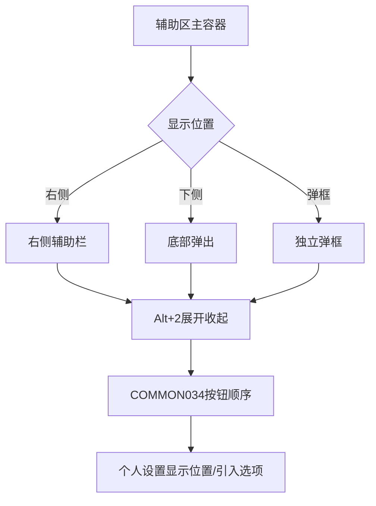
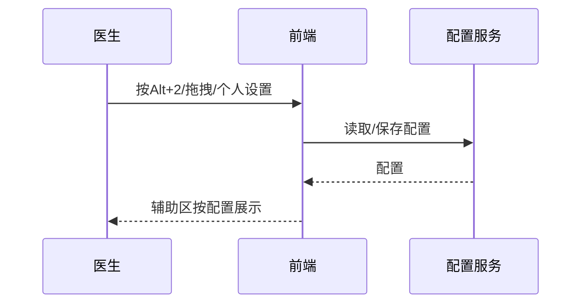

# BLGL-02-FZLR-020 辅助区交互与配置 _ Analyst - Spec

> **需求编号**：BLGL-02-FZLR-020
> **父需求**：BLGL-02-FZLR
> **关联PM Spec**：BLGL-02-FZLR-020_辅助区交互与配置_PM-spec.md
> **Spec版本**：V1.0
> **编写时间**：2026-08-14
> **编写人**：需求分析师

---

## 一、功能编号体系

#

## 1.1 功能层级结构

```
BLGL-02-FZLR-020-001: 辅助区展开收起与快捷键

BLGL-02-FZLR-020-002: 辅助区按钮位置与菜单配置

BLGL-02-FZLR-020-003: 个人设置与通用配置
```

#

## 1.2 功能编号表

| REQ-ID | 功能名称 | 类型 | 优先级 | 说明 |
|

----

----|

----

-----|

------|

----

----|

------|
| BLGL-02-FZLR-020-001 | 辅助区展开收起与快捷键 | 功能 | P0 | 辅助区展开/收起快捷键（Alt+2）、默认展开配置 |
| BLGL-02-FZLR-020-002 | 辅助区按钮位置与菜单配置 | 功能 | P0 | 辅助区按钮顺序可配置（COMMON034 拖拉排序）、菜单项配置 |
| BLGL-02-FZLR-020-003 | 个人设置与通用配置 | 功能 | P0 | 个人设置参数（辅助区显示位置、引入选项）、统一配置界面 |

---

## 二、核心业务流程

#

## 2.1 辅助区交互与配置主流程



#

## 2.2 辅助区交互与配置时序



---

## 三、功能规格说明


### BLGL-02-FZLR-020-001: 辅助区展开收起与快捷键

##

## 3.x.1 功能概述

辅助区展开/收起快捷键（Alt+2）、默认展开配置

##

## 3.x.2 用户角色

| 角色 | 使用场景 | 权限要求 | 操作频率 |
|

------|

----

-----|

----

-----|

----

-----|
| 住院医生 | 病历书写时在辅助区引用临床数据 | 当前就诊数据查看 | 高频 |

##

## 3.x.3 业务流程（Given/When/Then）

**Scenario 1: 辅助区展开收起**

```gherkin
Given:
- 医生已打开住院病历书写界面

When:
- 按快捷键 Alt+2 / 点击展开收起

Then:
- 辅助区展开/收起（含右侧和底部），hover 提示 Alt+2
```

**Scenario 2: 业务异常——默认展开配置**

```gherkin
Given:
- 辅助区默认展开配置

When:
- 医生打开病历

Then:
- 按配置展开/收起/自适应
```

**Scenario 3: 数据异常——快捷键提示**

```gherkin
Given:
- 快捷键无文字提示

When:
- 医生悬浮

Then:
- hover 显示 Alt+2 提示
```

**Scenario 4: 系统异常——创建病历后自动展开**

```gherkin
Given:
- 创建病历后

When:
- 医生查看

Then:
- 无需打开右侧辅助菜单
```

**Scenario 5: 边界——弹框回弹**

```gherkin
Given:
- 弹框收缩后

When:
- 医生打开

Then:
- 记忆上次拖动宽度
```

**Scenario 6: 边界——记忆功能**

```gherkin
Given:
- 辅助区拖动位置

When:
- 医生切换患者

Then:
- 按电脑记忆位置和大小
```

##

## 3.x.4 数据字段定义

| 字段名 | 类型 | 必填 | 默认值 | 取值范围 | 说明 | 概念ID |
|

----

----|

------|

------|

----

----|

----

-----|

------|

----

----|
| 辅助区显示模式 | String | 否 | 自适应 | 展开/收起/自适应 | 辅助区显示模式| ⏳ 待确认 |

##

## 3.x.5 验收标准

| AC编号 | 验收标准 | 对应REQ-ID | 验证方法 | 验证场景 |
|

----

----|

----

-----|

----

----

---|

----

-----|

----

-----|
| AC-001 | 按 Alt+2 快捷键展开收起辅助区| BLGL-02-FZLR-020-001 | 功能测试 | Scenario 1 |
| AC-002 | hover 提示 Alt+2| BLGL-02-FZLR-020-001 | 功能测试 | Scenario 1 |


### BLGL-02-FZLR-020-002: 辅助区按钮位置与菜单配置

##

## 3.x.1 功能概述

辅助区按钮顺序可配置（COMMON034 拖拉排序）、菜单项配置

##

## 3.x.2 用户角色

| 角色 | 使用场景 | 权限要求 | 操作频率 |
|

------|

----

-----|

----

-----|

----

-----|
| 住院医生 | 病历书写时在辅助区引用临床数据 | 当前就诊数据查看 | 高频 |

##

## 3.x.3 业务流程（Given/When/Then）

**Scenario 1: 配置辅助区按钮顺序**

```gherkin
Given:
- 管理员已打开病历业务配置

When:
- COMMON034 设置选项拖拉调整顺序

Then:
- 右侧辅助栏顺序读取 COMMON034 顺序
```

**Scenario 2: 业务异常——按钮固定右侧**

```gherkin
Given:
- 辅助录入按钮固定右侧

When:
- 医生查看

Then:
- 滚动按钮菜单
```

**Scenario 3: 数据异常——菜单名称显示不全**

```gherkin
Given:
- 右侧菜单名称显示不全

When:
- 医生查看

Then:
- 菜单名称完整显示
```

**Scenario 4: 系统异常——底部模式不显示既往病历**

```gherkin
Given:
- 辅助区设为下侧

When:
- 医生查看

Then:
- 底部模式显示既往病历
```

**Scenario 5: 边界——底部弹出布局**

```gherkin
Given:
- 辅助区显示位置为下侧

When:
- 医生查看

Then:
- 各面板调整显示布局
```

**Scenario 6: 边界——术语名称**

```gherkin
Given:
- 书写助手按钮名称

When:
- 医生查看

Then:
- 读取术语名称
```

##

## 3.x.4 数据字段定义

| 字段名 | 类型 | 必填 | 默认值 | 取值范围 | 说明 | 概念ID |
|

----

----|

------|

------|

----

----|

----

-----|

------|

----

----|
| 辅助录入菜单（COMMON034） | String | 否 | - | - | 辅助录入菜单配置| ⏳ 待确认 |

##

## 3.x.5 验收标准

| AC编号 | 验收标准 | 对应REQ-ID | 验证方法 | 验证场景 |
|

----

----|

----

-----|

----

----

---|

----

-----|

----

-----|
| AC-001 | 辅助栏顺序读取 COMMON034 顺序| BLGL-02-FZLR-020-002 | 功能测试 | Scenario 1 |
| AC-002 | 支持拖拉调整顺序| BLGL-02-FZLR-020-002 | 功能测试 | Scenario 1 |


### BLGL-02-FZLR-020-003: 个人设置与通用配置

##

## 3.x.1 功能概述

个人设置参数（辅助区显示位置、引入选项）、统一配置界面

##

## 3.x.2 用户角色

| 角色 | 使用场景 | 权限要求 | 操作频率 |
|

------|

----

-----|

----

-----|

----

-----|
| 住院医生 | 病历书写时在辅助区引用临床数据 | 当前就诊数据查看 | 高频 |

##

## 3.x.3 业务流程（Given/When/Then）

**Scenario 1: 个人设置配置**

```gherkin
Given:
- 医生已打开个人设置

When:
- 配置辅助区显示位置/引入选项

Then:
- 个人设置保存后生效
```

**Scenario 2: 业务异常——设置保存失效**

```gherkin
Given:
- 个人设置保存后

When:
- 医生重登录

Then:
- 设置不失效
```

**Scenario 3: 数据异常——分类下多单选参数**

```gherkin
Given:
- 一个分类下多单选参数

When:
- 医生配置

Then:
- 支持多单选参数维护
```

**Scenario 4: 系统异常——统一配置界面**

```gherkin
Given:
- 个人设置需统一配置

When:
- 管理员配置

Then:
- 全院生效，医生个性化才手动改
```

**Scenario 5: 边界——底部模式**

```gherkin
Given:
- 辅助区设为下侧

When:
- 医生查看

Then:
- 本次就诊病历内容显示
```

**Scenario 6: 边界——配置重复**

```gherkin
Given:
- 医嘱信息配置重复

When:
- 医生查看

Then:
- 配置不重复
```

##

## 3.x.4 数据字段定义

| 字段名 | 类型 | 必填 | 默认值 | 取值范围 | 说明 | 概念ID |
|

----

----|

------|

------|

----

----|

----

-----|

------|

----

----|
| 辅助区显示位置 | String | 否 | 右侧 | 右侧/下侧/独立弹框 | 辅助区显示位置| ⏳ 待确认 |

##

## 3.x.5 验收标准

| AC编号 | 验收标准 | 对应REQ-ID | 验证方法 | 验证场景 |
|

----

----|

----

-----|

----

----

---|

----

-----|

----

-----|
| AC-001 | 个人设置保存后生效| BLGL-02-FZLR-020-003 | 功能测试 | Scenario 1 |
| AC-002 | 统一配置界面全院生效| BLGL-02-FZLR-020-003 | 功能测试 | Scenario 1 |


---

## 四、排除范围

本需求不包含以下功能项：

1. **短语引用（基线能力）—— Phase 1 第6章 BC-FZLR-001**
2. **质控提醒（基线能力）—— Phase 1 第6章 BC-FZLR-002**
3. **个人设置参数（基线能力）—— Phase 1 第6章 BC-FZLR-003**
4. **辅助区快捷键/默认展开（基线能力）—— Phase 1 第6章 BC-FZLR-005/007**

---

## 五、业务规则清单

| 规则ID | 规则名称 | 规则描述 | 优先级 |
|

----

----|

----

-----|

----

-----|

------|

----

----|
| BR-001 | 快捷键 | 辅助菜单栏收起展开快捷键 Alt+2| P0 |
| BR-002 | 显示模式 | 辅助区显示模式{展开，收起，自适应}默认自适应| P0 |
| BR-003 | 按钮顺序 | 右侧辅助栏顺序读取 COMMON034| P0 |
| BR-004 | 位置记忆 | 辅助区拖拽位置按电脑记忆| P1 |

---

## 六、关联文档

| 文档类型 | 文档路径 | 说明 |
|

----

-----|

----

-----|

------|
| 功能点Spec | BLGL-02-FZLR 02辅助录入功能点Spec.md（V1.0，上级目录） | Phase 1 功能点索引 |
| PM spec | 本目录 BLGL-02-FZLR-020_辅助区交互与配置_PM-spec.md（V0.1） | PM 产出的 Spec 文档 |
| -Spec | 本目录 BLGL-02-FZLR-020_辅助区交互与配置_Spec.md（V1.0） | 业务背景与目标 Spec |
| data-model.md | 待产出 | 架构师产出的数据建模文档 |
| design.md | 待产出 | 架构师产出的技术方案文档 |
| api-contract.md | 待产出 | 开发经理产出的 API 契约文档 |

---

## 七、待确认问题清单

| 编号 | 问题描述 | 缺失信息 | 影响范围 | 建议补充方 |
|

------|

----

-----|

----

-----|

----

-----|

----

----

---|
| Q-001 | 辅助区配置接口 | API 契约文档 | -Spec 第5章 | 开发经理 |
| Q-002 | 性能指标 | 非功能性需求 | -Spec 第8章 | 需求分析师 |

---

## 填写检查清单

| 序号 | 检查项 | 是否完成 |
|:

----:|

----

----|:

----

----:|
| 1 | 功能编号带父子层级 | ✅ |
| 2 | 每个 REQ-ID 有功能概述和用户角色 | ✅ |
| 3 | 主流程至少 1 个 Given/When/Then 场景 | ✅ |
| 4 | 异常流程至少 3 个 Given/When/Then 场景 | ✅ |
| 5 | 边界流程至少 2 个 Given/When/Then 场景 | ✅ |
| 6 | 每个 Given/When/Then 内容具体，不模糊 | ✅ |
| 7 | 数据字段定义完整（字段名、类型、必填、说明、概念ID） | ✅ |
| 8 | 验收标准 AC 编号独立，可验证 | ✅ |
| 9 | 验收标准无"功能正常"等模糊表述 | ✅ |
| 10 | 排除范围明确列出 | ✅ |
| 11 | 业务规则清单列出所有规则，每条标注来源 | ✅ |
| 12 | 流程图使用 Mermaid 格式（≥2 个） | ✅ |
| 13 | 关联文档索引包含 Phase 1 功能点Spec | ✅ |
| 14 | 待确认问题清单汇总了全文所有 ⏳ 项 | ✅ |
| 15 | 全文无占位符 `< >` 残留 | ✅ |
| 16 | 全文陈述可溯源至资料区（S1~S10 溯源核查） | ✅ |
| 17 | 人工审核确认完成 | ⏳ 待确认 |

---

**文档状态**：⬜ 待审核
**维护责任**：需求分析师规范组
**下次更新**：根据评审反馈优化

---

## 版本历史

| 版本 | 日期 | 变更说明 | 编写人 |
|

------|

------|

----

-----|

----

----|
| V1.0 | 2026-08-14 | 初始版本 | 需求分析师 |
