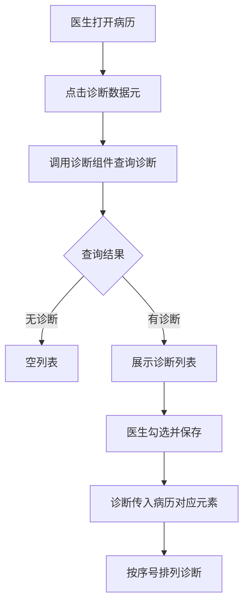
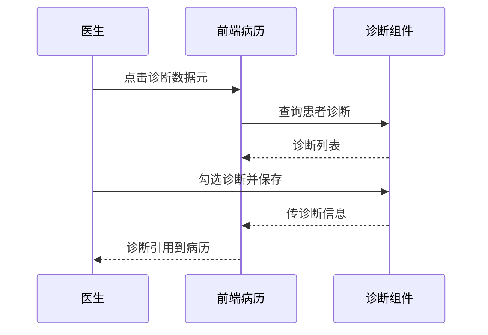

# BLGL-03-ZDYY-001 诊断数据接入与查询 - Spec

> **功能编号**：BLGL-03-ZDYY-001
> **文档类型**：Spec（研发视角）
> **文档版本**：V1.0
> **编写时间**：2026-08-15
> **编写人**：RACC

---

## 文档索引

#### 章节索引

**Spec（研发视角）**

| 章节号 | 章节名称 | 内容说明 |
|--------|---------|---------|
| 1、 | 文档概述 | 文档目的、文档范围、术语定义、阅读指南、参考文档 |
| 2、 | 功能背景与定位 | 功能背景、功能定位、目标用户、核心价值 |
| 3、 | 业务流程设计 | 主流程/异常流程/边界流程（Given/When/Then） |
| 4、 | 数据模型设计 | 核心数据结构、状态定义、系统参数定义 |
| 5、 | 接口契约设计 | API列表、接口详细设计、错误码定义 |
| 6、 | 技术方案设计 | 页面路径、技术栈、关键技术点、部署方案 |
| 7、 | 测试用例预设计 | 功能/边界/异常/性能测试用例 |
| 8、 | 非功能性要求 | 性能、安全、可用性、兼容性 |
| 9、 | 依赖与风险 | 外部依赖、风险项 |
| 10、 | 附录 | 流程图、时序图、参考文档 |

**PM-Spec（业务视角）**

| 章节号 | 章节名称 | 内容说明 |
|--------|---------|---------|
| 一 | 目标 | 功能定位与核心价值 |
| 二 | 约束 | 业务/技术/非功能性约束 |
| 三 | 验收标准 | 验收条件与验证方法 |
| 四 | 排除范围 | 本次不做项与明确边界 |
| 五 | 关键决策记录 | 方案决策与选型理由 |
| 六 | 优先级 | 优先级定义 |
| 七 | 关联文档 | 关联文档索引 |
| 附录 | 填写检查清单 | 质量检查 |

**Analyst-Spec（产品视角）**

| 章节号 | 章节名称 | 内容说明 |
|--------|---------|---------|
| 一 | 功能编号体系 | 功能编号与层级结构 |
| 二 | 核心业务流程 | 核心业务流程与时序 |
| 三 | 功能规格说明 | 详细功能规格与验收标准 |
| 四 | 排除范围 | 排除范围 |
| 五 | 业务规则清单 | 业务规则清单 |
| 六 | 关联文档 | 关联文档索引 |
| 七 | 待确认问题清单 | 待确认问题汇总 |
| - | 填写检查清单 | 质量检查 |

#### 版本历史

| 版本 | 日期 | 变更说明 | 编写人 |
|------|------|---------|--------|
| V1.0 | 2026-08-15 | 初始版本 | RACC |

#### 关联文档索引

| 序号 | 文档名称 | 文档类型 | 版本 | 位置 |
|------|---------|---------|------|------|
| 1 | BLGL-03-ZDYY-001_诊断数据接入与查询_PM-spec.md | PM-Spec（业务视角） | V0.1 | 本目录 |
| 2 | BLGL-03-ZDYY-001_诊断数据接入与查询_Analyst-spec.md | Analyst-Spec（产品视角） | V1.0 | 本目录 |
| 3 | BLGL-03-ZDYY-001_诊断数据接入与查询-Spec.md | Spec（研发视角）（本文档） | V1.0 | 本目录 |
| 4 | BLGL-03-ZDYY 诊断引用功能点Spec.md | 功能点Spec（模块级） | V1.1 | 上级目录 |
---

## 1、文档概述

### 1.1、文档目的

本文档旨在明确"诊断数据接入与查询"功能（BLGL-03-ZDYY-001）的业务背景与设计方案，为需求分析、研发实现、测试验收及评审提供统一的业务上下文、设计口径与决策依据。

**具体目的包括**：

1. 梳理诊断数据接入与查询功能的业务由来与历史需求演进脉络，说明"为什么要做"；
2. 明确功能的定位边界、目标用户与核心价值，回答"做成什么"；
3. 描述功能的业务流程、数据模型、接口契约与技术方案，回答"怎么做"；
4. 预设计测试用例并明确非功能性要求、依赖与风险，为研发与验收提供依据；
5. 作为 Analyst-Spec（功能编号体系、功能详情、业务规则、验收标准等章节）的业务前提与设计输入，保证各层文档业务口径一致。

### 1.2、文档范围

#### 1.2.1 纳入范围

本文档覆盖诊断数据接入与查询的完整业务背景与设计，包括：

- 诊断数据查询接口：病历中调用诊断组件（控件）查询患者诊断数据
- 诊断引用对接新模式：诊断组件点"保存"后传诊断信息给病历
- ICD-11 诊断体系改造：CL037 参数控制是否启用 ICD-11
- 诊断接口返回排序：按接口返回序号字段排列
- 主诊断获取：病历中主要诊断/主诊断获取
- 跨病历类型诊断引用：不管什么病历都可以引用患者诊断，辅助区"诊断信息"页签

#### 1.2.2 排除范围

本文档不涉及以下内容（详见其他功能点或模块）：

- 诊断变更同步与提醒（同步方式/提醒弹窗）—— BLGL-03-ZDYY-002
- 诊断引用弹窗交互（勾选/关闭/触发方式）—— BLGL-03-ZDYY-003
- 诊断权限与签名（诊断OnlyEdit/上级加签）—— BLGL-03-ZDYY-004
- 诊断样式显示配置（排序/标题/序号/分隔符）—— BLGL-03-ZDYY-005
- 诊断落库与对外对接（结构化落库/传值病案系统）—— BLGL-03-ZDYY-008
- 患者诊断的录入/开立（医生站诊断控件内部）—— 归医生站模块，非病历侧

### 1.3、术语定义

| 术语 | 定义 |
|------|------|
| 诊断组件（控件） | 病历中弹出用于查询/勾选患者诊断的组件，病历调用医生站诊断组件取数 |
| 诊断数据元 | 病历模板中承载诊断内容的结构化数据元素，点击后触发诊断组件 |
| ICD-11 诊断体系 | 世界卫生组织第十一版国际疾病分类，是否启用由参数 CL037 控制 |
| 数据中台 | 诊断组件数据来源（医生站诊断数据中台），病历新建带入诊断顺序调整 |

### 1.4、阅读指南

- **章节关系**：第1~2章为业务全貌，第3~10章为设计实现层。与 Analyst-Spec、PM-Spec 互相引用保持一致。
- **读者对象**：产品经理/需求分析师读第1~2章；研发读第3~6、9~10章；测试读第3、7~8章；评审人员核对各层一致性。

### 1.5、参考文档

| 序号 | 文档名称 | 版本/日期 |
|------|---------|----------|
| 1 | 【历史需求】住院病历的历史需求.xlsx | - |
| 2 | BLGL-03-ZDYY-001_诊断数据接入与查询_PM-spec.md | V0.1 |
| 3 | BLGL-03-ZDYY-001_诊断数据接入与查询_Analyst-spec.md | V1.0 |
| 4 | BLGL-03-ZDYY 诊断引用功能点Spec.md | V1.1 |

---

## 2、功能背景与定位

### 2.1 功能背景

诊断数据接入与查询是诊断引用模块的数据来源层，需满足：

- **现状痛点**：写病历的时候引用不了诊断，要求不管是什么病历都可以引用患者的诊断；病历的目前诊断只取了入院诊断，需获取患者所有诊断；诊断接口返回结果未按页面顺序返回
- **历史需求演进**：提供诊断数据查询接口、将诊断组件调用模式提供给病历组（需求）→ 病历中诊断引用对接新模式，去掉包装的"引用"按钮，组件保存后传诊断信息（需求）→ ICD-11 诊断体系改造（需求）→ 诊断组件数据中台修改（需求）

### 2.2 功能定位

"诊断数据接入与查询"是 WiNEX 病历管理-诊断引用的数据接入层，定位为：

- **诊断数据源**：病历中调用诊断组件（控件）查询患者诊断数据，是病历诊断引用的数据来源
- **对接新模式**：诊断组件保存后直接传诊断信息给病历，去掉包装的"引用"按钮
- **体系适配**：支持 ICD-11 诊断体系参数化改造

### 2.3 目标用户

| 用户角色 | 主要使用场景 |
|---------|-------------|
| 住院医生 | 病历书写时触发诊断组件查询患者诊断并引用到病历 |
| 护士 | 护理文书引用医生站诊断（受入参控制不可新增/修改，见 ZDYY-004） |

### 2.4 核心价值

| 价值维度 | 价值描述 |
|---------|---------|
| 数据完整性 | 病历可引用患者全部诊断而非仅入院诊断 |
| 一致性 | 诊断排序与医生站弹窗保持一致 |
| 体系升级 | 支持 ICD-11 诊断体系参数化切换 |

---

## 3、业务流程设计（Given/When/Then）

### 3.1 主流程

**Scenario 1: 病历触发诊断组件查询并引用诊断**

```gherkin
Given:
 - 医生已打开病历文书（任意病历类型）
 - 病历中已放置诊断数据元
 - 诊断组件（控件）接口可用

When:
 - 医生点击/双击病历中的诊断数据元
 - 系统调用诊断组件查询患者诊断数据
 - 医生在诊断组件中勾选所需诊断并点"保存"

Then:
 - 诊断组件将诊断信息传给病历
 - 病历将诊断引用到对应的诊断元素内
 - 诊断排序按接口返回的序号字段排列，与医生站弹窗保持一致
```


### 3.2 异常流程

**Scenario 2: 业务异常——诊断组件无法弹出**

```gherkin
Given:
 - 病历创建后未打开过病历
 - 诊断组件（控件）偶发无法触发

When:
 - 医生双击诊断数据元

Then:
 - 诊断弹框不弹出
 - 提示医生诊断引用失败，需研发排查处理
```


**Scenario 3: 数据异常——接口返回无顺序/主诊断代码为空**

```gherkin
Given:
 - 诊断接口返回结果未按页面顺序返回
 - 或 ICD-11 开启时主诊断代码为空

When:
 - 病历引用诊断

Then:
 - 按接口返回的序号字段排列诊断（需求）
 - ICD-11 开启时病历归档不校验主诊断是否为空（需求）
```

**Scenario 4: 系统异常——诊断组件服务不可用**

```gherkin
Given:
 - 医生站诊断组件服务不可用或超时

When:
 - 医生点击诊断数据元

Then:
 - 诊断弹框无法加载数据
 - 提示引用失败，病历保持原状态
```


### 3.3 边界流程

**Scenario 5: 边界——患者无诊断**

```gherkin
Given:
 - 患者当前无任何诊断

When:
 - 医生触发诊断组件

Then:
 - 诊断组件展示空诊断列表
 - 病历不引用任何诊断
```


**Scenario 6: 边界——诊断类型过滤**

```gherkin
Given:
 - 诊断组件入参携带诊断类别（诊断类型编码）

When:
 - 病历按诊断类型定位打开诊断组件

Then:
 - 诊断组件只展示对应诊断类型的数据
```


---

## 4、数据模型设计

### 4.1 核心数据结构

#### 4.1.1 核心保存请求

| 字段名 | 类型 | 必填 | 备注 |
|--------|------|------|------|
| 诊断类别 | Long | 否 | 诊断组件查询入参，可能有诊断类别 |
| 就诊标识（encounterId） | Long | 是 | 按就诊标识查询患者诊断 |
| 病历目录 | - | 否 | 按就诊标识+病历目录查询诊断信息 |

> ⏳ 待确认：诊断组件查询接口的完整入参/出参字段结构需以医生站诊断组件 API 契约为准（资料区仅提及"入参可能有诊断类别"）。

#### 4.1.2 核心表/实体

| 表/实体 | 关键字段 | 说明 |
|---------|---------|------|
| INP_EMR_DIAGNOSIS | inpEmrDiagnosisRecordId、inpEmrDiagnosisTypeId、inpEmrSetId、patientEncounterDiagnosisId、encounterId、diagnosisTypeCode、diagnosisPriSecCode、diagnosisCode、diagnosisModifiedAt | 病历引用诊断记录表 |
| INPATIENT_RHB_DIAGNOSIS | inpatientRhbDiagnosisId、inpRhbRecordId、encounterId、patientEncounterDiagnosisId、diagnosisTypeCode、diagnosisCode、diagnosisDesc、diagnosisPrefixName、diagnosisSuffixName、diagnosisDate | 住院病历患者就诊主诊断表 |
| INP_EMR_DIAGNOSIS_RECORD | inpEmrDiagnosisRecordId、diagnosisGroupNo、quoteAt、diagnosisTypeCode、diagnosisNo、diagnosisCodeSystemId、diagnosisCode、diagnosisDesc、diagnosisPrefixName、diagnosisSuffixName、diagnosisAt、seqNo | 诊断引用记录表（结构化明细，来源：代码） |

### 4.2 状态定义

| ⏳ 待确认 | 状态定义 | 状态定义未在资料区中找到（诊断状态过滤见 ZDYY-006） |

### 4.3 系统参数定义

| 参数编码 | 参数名称 | 说明 |
|---------|---------|------|
| CL037 | 是否启用 ICD-11 诊断体系版本 | 值：是/否，默认否。设置为"是"时诊断引入病历按 ICD-11 规则，病历归档不校验主诊断为空 |
| CL036 | 病历中中医诊断和西医诊断的排序 | 控制中西医诊断排序 |

---

## 5、接口契约设计

### 5.1 API列表

| 序号 | API名称（代码函数） | 路径 | 方法 | 说明 |
|:----:|---------|------|:----:|------|
| 1 | 根据就诊标识查询诊断信息并填充数据元编码 | /api/v1/app_record_inpatient/emr_inpatient_diagnosis/query/by_encounter_id | POST | 按就诊标识查询诊断信息 |
| 2 | 根据就诊标识+病历目录查询诊断信息 | /api/v1/app_record_inpatient/emr_inpatient_diagnosis/query/by_encounter_and_class | POST | 记录域 RPC |
| 3 | 根据患者标识查询患者诊断信息 | /api/v1/app_record_inpatient/inp_patient_diagnosis/query/by_encounter_id | POST | 患者诊断信息 |
| 4 | 诊断组件查询接口 | ⏳ 待确认（医生站诊断组件） | - | 病历调用诊断组件查询患者诊断 |

### 5.2 接口详细设计

#### 5.2.1 根据就诊标识查询诊断信息（emr_inpatient_diagnosis/query/by_encounter_id）

**请求参数**:
```json
{
 "encounterId": "12345",
 "diagnosisTypeCode": "991323"
}
```

**返回值（成功）**:
```json
{
 "success": true,
 "data": [
 {
 "diagnosisTypeCode": "991323",
 "diagnosisPriSecCode": "1",
 "diagnosisCode": "A09",
 "diagnosisDesc": "感染性腹泻",
 "diagnosisPrefixName": "急性",
 "diagnosisSuffixName": "",
 "seqNo": 1
 }
 ]
}
```

> ⏳ 待确认：接口字段名以代码扫描结果为主，具体字段结构需以 API 契约/设计评审为准。

**返回值（失败）**:
```json
{
 "success": false,
 "message": "查询诊断信息失败",
 "data": null
}
```

### 5.3 错误码定义

| 错误码 | 错误信息 | 处理方式 |
|--------|---------|---------|
| ⏳ 待确认 | 诊断引用失败 | 提示医生，病历保持原状态 |

---

## 6、技术方案设计

### 6.1 页面路径

- **页面路径**: 住院医生站→住院病历书写界面→诊断数据元触发诊断组件（PgEditor/widget/widget_diagnosis.vue 诊断弹窗组件）
- **核心逻辑模块**: InpatientEmrDiagnosisController（根据就诊标识查询诊断信息）、InpatientEmrDiagnosisServiceImpl
- **前端 API**: src/api/global.js diagnosisApi.queryDiagnosisData → emr_inpatient_diagnosis/query/by_encounter_id

### 6.2 技术栈

| 类别 | 技术 | 版本 |
|------|------|------|
| 前端框架 | Vue | 2.6.14 |
| 前端UI | element-ui | 2.13.0 |
| 后端框架 | Spring Boot（Java 17）+ JPA/Hibernate | - |
| RPC | winning-akso-rpc-rest（WinRpcResponse） | - |

### 6.3 关键技术点

- 病历调用诊断组件时，入参区分来源（医生可编辑/护士不可编辑，见 ZDYY-004）
- 诊断接口返回排序按接口返回的序号字段排列
- ICD-11 参数控制诊断引入规则

### 6.4 部署方案

⏳ 待确认：部署方案未在资料区中找到。

---

## 7、测试用例预设计

### 7.1 功能测试

| 用例编号 | 测试场景 | Given | When | Then |
|---------|---------|-------|------|------|
| TC-001 | 病历触发诊断组件引用 | 病历已放诊断数据元，诊断组件可用 | 点击诊断数据元→勾选→保存 | 诊断引用到病历对应元素，排序与医生站一致 |

### 7.2 边界测试

| 用例编号 | 测试场景 | Given | When | Then |
|---------|---------|-------|------|------|
| TC-002 | 患者无诊断 | 患者无任何诊断 | 触发诊断组件 | 空诊断列表，病历不引用 |

### 7.3 异常测试

| 用例编号 | 测试场景 | Given | When | Then |
|---------|---------|-------|------|------|
| TC-003 | 诊断组件无法弹出 | 诊断组件偶发无法触发 | 双击诊断数据元 | 弹框不弹出，提示引用失败 |

### 7.4 性能测试

| 用例编号 | 测试场景 | 指标 |
|---------|---------|------|
| TC-004 | 诊断查询响应 | ⏳ 待确认：性能指标未在资料区中找到 |

---

## 8、非功能性要求

### 8.1 性能要求

| 指标 | 要求 |
|------|------|
| 诊断查询响应时间 | ⏳ 待确认 |

### 8.2 安全要求

| 要求 | 说明 |
|------|------|
| 数据权限 | 按就诊/患者范围隔离展示诊断数据 |

**医疗行业特殊要求**

| 要求 | 说明 |
|------|------|
| 诊断数据准确性 | 引用内容与医生站诊断源一致 |

### 8.3 可用性要求

| 指标 | 要求值 |
|------|--------|
| 可用性 | ⏳ 待确认 |

### 8.4 兼容性要求

| 类型 | 要求 |
|------|------|
| 诊断体系 | 支持 ICD-11 与现有体系参数化切换 |
| 病历类型 | 不管什么病历都可以引用患者诊断 |

---

## 9、依赖与风险

### 9.1 外部依赖

| 依赖项 | 说明 |
|--------|------|
| 医生站诊断组件 | 患者诊断数据源 |
| 患者诊断数据中台 | 诊断组件数据来源，病历新建带入诊断顺序调整 |

### 9.2 风险项

| 风险项 | 等级 | 说明 | 应对方案 |
|--------|------|------|---------|
| 诊断组件接口依赖 | 中 | 诊断组件无法弹出导致医生无法引用诊断 | 排查组件触发逻辑 |
| ICD-11 改造影响 | 中 | 诊断编码/规则变化影响病历引用 | 参数化控制，默认关闭 |

---

## 10、附录

### 10.1 流程图



### 10.2 时序图



### 10.3 参考文档

- 【历史需求】住院病历的历史需求.xlsx（需求）
- BLGL-03-ZDYY 诊断引用功能点Spec.md（V1.1，第5章 BLGL-03-ZDYY-001 行）
- 关联Spec: BLGL-03-ZDYY-001_诊断数据接入与查询_PM-spec.md、BLGL-03-ZDYY-001_诊断数据接入与查询_Analyst-spec.md

---

## 填写检查清单

| 序号 | 检查项 | 是否完成 |
|:----:|--------|:--------:|
| 1 | 章节索引与正文章节一致 | ✅ |
| 2 | 版本历史记录完整 | ✅ |
| 3 | 关联文档索引已登记全部Spec | ✅ |
| 4 | 文档目的明确回答"为什么做/做成什么/怎么做" | ✅ |
| 5 | 纳入范围/排除范围清晰 | ✅ |
| 6 | 术语定义覆盖关键概念，从资料区可溯源 | ✅ |
| 7 | 参考文档已登记 | ✅ |
| 8 | 功能背景基于法规/规范/需求来源组织 | ✅ |
| 9 | 功能定位体现业务价值（3~5个定位点） | ✅ |
| 10 | 目标用户角色覆盖完整，在需求原文中有出处 | ✅ |
| 11 | 核心价值可陈述，与 Phase 1 口径一致 | ✅ |
| 12 | 业务流程：主流程≥1、异常≥3、边界≥2，Given/When/Then 具体 | ✅ |
| 13 | 数据模型：字段/表/状态/参数可溯源 | ✅ |
| 14 | 接口契约：API列表+详细设计+错误码齐全或标记待确认 | ✅ |
| 15 | 技术方案：页面路径/技术栈/关键点/部署方案或标记待确认 | ✅ |
| 16 | 测试用例：功能/边界/异常/性能覆盖 | ✅ |
| 17 | 非功能性要求：性能/安全/可用性/兼容性指标可量化或标记待确认 | ✅ |
| 18 | 依赖与风险：外部依赖登记完整 | ✅ |
| 19 | 附录：流程图/时序图与正文流程一致 | ✅ |
| 20 | 全文无占位符 `< >` 残留 | ✅ |
| 21 | 全文陈述可溯源至资料区 | ✅ |
| 22 | 人工审核确认完成 | ⏳ 待确认 |

---

**文档状态**：⬜ 待审核
**维护责任**：RACC
**下次更新**：根据评审反馈优化
