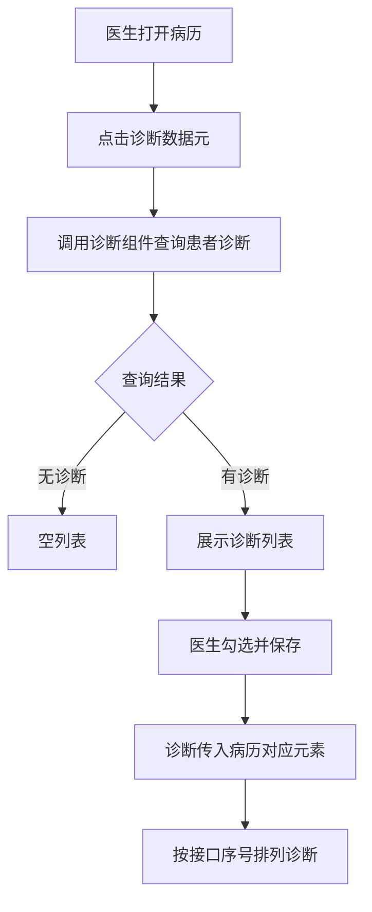
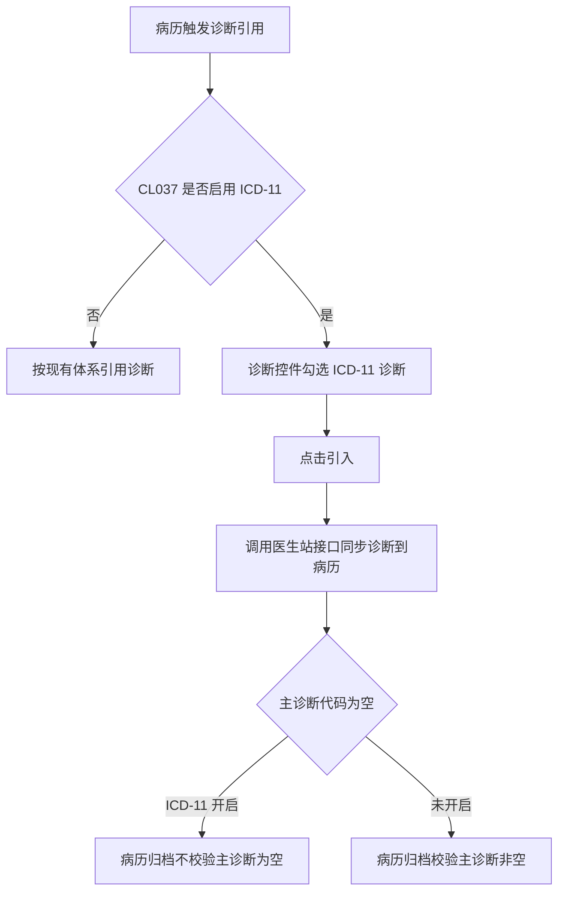

# BLGL-03-ZDYY-001 诊断数据接入与查询 _ Analyst - Spec

> **需求编号**：BLGL-03-ZDYY-001
> **父需求**：BLGL-03-ZDYY
> **关联PM Spec**：BLGL-03-ZDYY-001_诊断数据接入与查询_PM-spec.md
> **Spec版本**：V1.0
> **编写时间**：2026-08-15
> **编写人**：需求分析师

---

## 一、功能编号体系

### 1.1 功能层级结构

```
BLGL-03-ZDYY-001-001: 病历触发诊断组件查询
  ├─ BLGL-03-ZDYY-001-001-01: 按就诊标识查询诊断并填充数据元编码
  ├─ BLGL-03-ZDYY-001-001-02: 按就诊标识+病历目录查询诊断
  └─ BLGL-03-ZDYY-001-001-03: 诊断接口返回排序

BLGL-03-ZDYY-001-002: 诊断引用对接新模式
  └─ BLGL-03-ZDYY-001-002-01: 诊断组件保存后传诊断信息给病历

BLGL-03-ZDYY-001-003: ICD-11 诊断体系改造
  └─ BLGL-03-ZDYY-001-003-01: CL037 参数控制（是/否，默认否）
```

### 1.2 功能编号表

| REQ-ID | 功能名称 | 类型 | 优先级 | 说明 |
|--------|---------|------|--------|------|
| BLGL-03-ZDYY-001-001 | 病历触发诊断组件查询 | 功能 | P0 | 病历中调用诊断组件查询患者诊断数据 |
| BLGL-03-ZDYY-001-001-01 | 按就诊标识查询诊断 | 子功能 | P0 | 按就诊标识查询诊断信息并填充数据元编码 |
| BLGL-03-ZDYY-001-001-02 | 按就诊标识+病历目录查询诊断 | 子功能 | P1 | 记录域 RPC 查询 |
| BLGL-03-ZDYY-001-001-03 | 诊断接口返回排序 | 子功能 | P0 | 诊断在病历的排序按接口返回序号排列 |
| BLGL-03-ZDYY-001-002 | 诊断引用对接新模式 | 功能 | P0 | 去掉"引用"按钮，组件保存后传诊断信息 |
| BLGL-03-ZDYY-001-002-01 | 组件保存后传诊断信息 | 子功能 | P0 | 诊断组件下完诊断点保存传诊断信息给病历 |
| BLGL-03-ZDYY-001-003 | ICD-11 诊断体系改造 | 功能 | P1 | 参数控制是否启用 ICD-11 诊断体系 |
| BLGL-03-ZDYY-001-003-01 | CL037 参数控制 | 子功能 | P1 | 是否启用 ICD-11，是/否，默认否 |

---

## 二、核心业务流程

### 2.1 病历触发诊断组件查询主流程



### 2.2 ICD-11 诊断体系改造流程




---

## 三、功能规格说明

### BLGL-03-ZDYY-001-001: 病历触发诊断组件查询

#### 3.1.1 功能概述

病历中调用诊断组件（控件）查询患者诊断数据，提供诊断数据查询接口（入参可能有诊断类别），将诊断组件调用模式提供给病历组开发。诊断在病历的排序按照接口返回的序号字段排列，和医生站的弹窗保持一致。

#### 3.1.2 用户角色

| 角色 | 使用场景 | 权限要求 | 操作频率 |
|------|---------|---------|---------|
| 住院医生 | 病历书写时触发诊断组件查询诊断 | 病历书写权限（含诊断引用） | 高频 |
| 护士 | 护理文书引用医生站诊断 | 受入参控制不可新增/修改（见 ZDYY-004） | 中频 |

#### 3.1.3 业务流程（Given/When/Then）

**Scenario 1: 病历触发诊断组件查询并引用诊断（主流程）**

```gherkin
Given:
  - 医生已打开病历文书
  - 病历中已放置诊断数据元
  - 诊断组件接口可用

When:
  - 医生点击诊断数据元
  - 系统调用诊断组件查询患者诊断
  - 医生勾选诊断并点"保存"

Then:
  - 诊断引用到病历对应元素
  - 诊断排序按接口返回的序号字段排列，与医生站一致
```


**Scenario 2: 业务异常——诊断组件无法弹出**

```gherkin
Given:
  - 病历创建后双击诊断不弹出诊断框
  - 诊断组件偶发无法触发

When:
  - 医生双击诊断数据元

Then:
  - 诊断弹框不弹出
  - 医生无法引用诊断，需研发排查处理
```


**Scenario 3: 数据异常——诊断接口返回无顺序**

```gherkin
Given:
  - 诊断接口返回结果未按页面顺序返回

When:
  - 病历引用诊断

Then:
  - 诊断在病历的排序按照接口返回的序号字段排列
  - 与医生站弹窗保持一致
```


**Scenario 4: 系统异常——ICD-11 开启时主诊断代码为空**

```gherkin
Given:
  - CL037 设置为"是"（启用 ICD-11）
  - 患者主诊断代码为空

When:
  - 病历归档

Then:
  - 不校验主诊断是否为空
  - 支持归档成功
```


**Scenario 5: 边界——患者无诊断**

```gherkin
Given:
  - 患者当前无任何诊断

When:
  - 医生触发诊断组件

Then:
  - 诊断组件展示空列表
  - 病历不引用任何诊断
```

**Scenario 6: 边界——诊断类别过滤**

```gherkin
Given:
  - 诊断组件入参携带诊断类别

When:
  - 病历按诊断类型定位打开诊断组件

Then:
  - 诊断组件只展示对应诊断类型的数据
```


#### 3.1.5 验收标准

| AC编号 | 验收标准 | 对应REQ-ID | 验证方法 | 验证场景 |
|--------|---------|-----------|---------|---------|
| AC-001 | 点击诊断数据元触发诊断组件查询患者诊断，引用后排序与医生站一致 | BLGL-03-ZDYY-001-001 | 功能测试 | Scenario 1 |
| AC-002 | 诊断组件无法弹出时提示引用失败，病历保持原状态 | BLGL-03-ZDYY-001-001 | 功能测试 | Scenario 2 |
| AC-003 | 诊断接口返回按序号字段排列，与医生站弹窗一致 | BLGL-03-ZDYY-001-001 | 功能测试 | Scenario 3 |

---

### BLGL-03-ZDYY-001-002: 诊断引用对接新模式

#### 3.2.1 功能概述

病历中调用诊断组件时，去掉包装的"引用"按钮，诊断组件中下完诊断点"保存"按钮时，传诊断信息给病历，病历引用到对应的诊断元素内。

#### 3.2.2 用户角色

| 角色 | 使用场景 | 权限要求 | 操作频率 |
|------|---------|---------|---------|
| 住院医生 | 病历中引用诊断 | 病历书写权限 | 高频 |

#### 3.2.3 业务流程（Given/When/Then）

**Scenario 1: 诊断组件保存后传诊断信息（主流程）**

```gherkin
Given:
  - 医生已打开诊断组件
  - 病历已放诊断数据元

When:
  - 医生在诊断组件下完诊断
  - 点击"保存"按钮

Then:
  - 诊断组件传诊断信息给病历
  - 病历引用到对应的诊断元素内
  - 无包装的"引用"按钮
```


**Scenario 2: 数据异常——诊断前端传参有误**

```gherkin
Given:
  - 诊断组件传参异常

When:
  - 医生保存诊断

Then:
  - 病历引用失败或数据不完整
  - 排查前端传参逻辑
```

**Scenario 3: 系统异常——诊断组件数据元引用数据增多**

```gherkin
Given:
  - 诊断数据元引用数据增多导致性能问题

When:
  - 大量诊断引用

Then:
  - ⏳ 待确认：处理方式资料区未明确
```

#### 3.2.5 验收标准

| AC编号 | 验收标准 | 对应REQ-ID | 验证方法 | 验证场景 |
|--------|---------|-----------|---------|---------|
| AC-004 | 诊断组件保存后诊断传入病历对应元素，无"引用"按钮包装 | BLGL-03-ZDYY-001-002 | 功能测试 | Scenario 1 |

---

### BLGL-03-ZDYY-001-003: ICD-11 诊断体系改造

#### 3.3.1 功能概述

新增是否启用 ICD-11 的参数 CL037（路径：主数据/病历配置管理/住院病历配置/病历业务配置/病历诊断配置/参数配置，名称"是否启用 ICD-11 诊断体系版本"，是/否，默认否）。参数设置为"是"时，医生新增/修改/删除病历文书中的诊断，触发诊断控件，在控件中勾选/修改 ICD-11 诊断，点击"引入"调用医生站接口把诊断信息同步到病历文书中；诊断编码（主干码、后组配编码、后组配具体表现编码）由诊断控件回传。

#### 3.3.2 用户角色

| 角色 | 使用场景 | 权限要求 | 操作频率 |
|------|---------|---------|---------|
| 住院医生 | ICD-11 诊断引入病历 | 病历书写权限 | 中频 |
| 病案管理员 | 病历归档校验 | 归档权限 | 低频 |

#### 3.3.3 业务流程（Given/When/Then）

**Scenario 1: ICD-11 开启时引入诊断（主流程）**

```gherkin
Given:
  - CL037 = 是（启用 ICD-11）
  - 医生已开立 ICD-11 诊断

When:
  - 医生新增病历文书中的诊断
  - 触发诊断控件勾选 ICD-11 诊断
  - 点击"引入"

Then:
  - 调用医生站接口把诊断信息同步到病历文书
  - 诊断编码（主干码/后组配编码/后组配具体表现编码）由诊断控件回传
```


**Scenario 2: 数据异常——主诊断代码为空**

```gherkin
Given:
  - CL037 = 是
  - 患者主诊断代码为空

When:
  - 病历归档

Then:
  - 不校验主诊断是否为空，支持归档成功
```


**Scenario 3: 系统异常——CL037 未开启**

```gherkin
Given:
  - CL037 = 否（默认）

When:
  - 病历引用诊断

Then:
  - 保持现有体系逻辑不变
```


**Scenario 4: 边界——诊断编码样式**

```gherkin
Given:
  - ICD-11 诊断包含主干码、后组配编码、后组配具体表现编码

When:
  - 诊断编码回传病历

Then:
  - 诊断编码样式为主干码1&【后组配编码1&具体表现编码1...】&【后组配...】
```


#### 3.3.5 验收标准

| AC编号 | 验收标准 | 对应REQ-ID | 验证方法 | 验证场景 |
|--------|---------|-----------|---------|---------|
| AC-005 | CL037=是 时按 ICD-11 引入诊断且编码由控件回传；=否 时保持原逻辑 | BLGL-03-ZDYY-001-003 | 功能测试 | Scenario 1/3 |
| AC-006 | CL037=是 且主诊断为空时病历归档成功 | BLGL-03-ZDYY-001-003 | 功能测试 | Scenario 2 |

---

## 四、排除范围

本需求不包含以下功能项：

1. **诊断变更同步与提醒**（CL025 同步方式/强制同步弹窗）—— BLGL-03-ZDYY-002
2. **诊断引用弹窗交互细节**（勾选/关闭/触发方式/缩放）—— BLGL-03-ZDYY-003
3. **诊断权限与签名**（诊断OnlyEdit/上级加签/职称比较）—— BLGL-03-ZDYY-004
4. **诊断样式显示配置**（排序/标题/序号/分隔符）—— BLGL-03-ZDYY-005
5. **患者诊断录入/开立**（医生站诊断控件内部）—— 归医生站模块

---

## 五、业务规则清单

| 规则ID | 规则名称 | 规则描述 | 优先级 |
|--------|---------|---------|--------|
| BR-001 | 诊断排序规则 | 诊断在病历的排序按照接口返回的序号字段排列，和医生站的弹窗保持一致 | P0 |
| BR-002 | 对接新模式 | 病历中调用诊断组件时去掉包装的"引用"按钮，组件保存后传诊断信息给病历 | P0 |
| BR-003 | ICD-11 参数控制 | 是否启用 ICD-11 由参数 CL037 控制，是/否，默认否 | P1 |
| BR-004 | ICD-11 主诊断校验 | CL037=是 时病历归档不校验主诊断为空 | P1 |
| BR-005 | 跨病历类型引用 | 不管是什么病历都可以引用患者的诊断 | P0 |

---

## 六、关联文档

| 文档类型 | 文档路径 | 说明 |
|---------|---------|------|
| 功能点Spec（模块级） | BLGL-03-ZDYY 诊断引用功能点Spec.md（V1.1，上级目录） | Phase 1 功能点索引 |
| PM-Spec（业务视角） | 本目录 BLGL-03-ZDYY-001_诊断数据接入与查询_PM-spec.md（V0.1） | PM 产出的 Spec 文档 |
| Spec（研发视角） | 本目录 BLGL-03-ZDYY-001_诊断数据接入与查询-Spec.md（V1.0） | 业务背景与目标 Spec |
| data-model.md | 待产出 | 架构师产出的数据建模文档 |
| design.md | 待产出 | 架构师产出的技术方案文档 |
| api-contract.md | 待产出 | 开发经理产出的 API 契约文档 |

---

## 七、待确认问题清单

| 编号 | 问题描述 | 缺失信息 | 影响范围 | 建议补充方 |
|------|---------|---------|---------|-----------|
| Q-001 | 诊断组件查询接口的完整入参/出参字段结构 | 医生站诊断组件 API 契约 | -Spec 第5章、3.1.4 | 开发经理 |
| Q-002 | 诊断接口返回字段名（seqNo 等）的完整定义 | API 契约 | 3.1.4 数据字段 | 开发经理 |
| Q-003 | 诊断前端传参错误的具体表现 | 需求分析原文缺失 | 3.2.3 Scenario 2 | 需求分析师 |
| Q-004 | 诊断数据元引用数据增多的性能处理方式 | 需求分析原文缺失 | 3.2.3 Scenario 3 | 需求分析师 |
| Q-005 | 性能指标（诊断查询响应时间） | 资料区无量化指标 | -Spec 第8章 | 产品经理 |

---

## 填写检查清单

| 序号 | 检查项 | 是否完成 |
|:----:|--------|:--------:|
| 1 | 功能编号带父子层级 | ✅ |
| 2 | 每个 REQ-ID 有功能概述和用户角色 | ✅ |
| 3 | 主流程至少 1 个 Given/When/Then 场景 | ✅ |
| 4 | 异常流程至少 3 个 Given/When/Then 场景 | ✅ |
| 5 | 边界流程至少 2 个 Given/When/Then 场景 | ✅ |
| 6 | 每个 Given/When/Then 内容具体，不模糊 | ✅ |
| 7 | 数据字段定义完整（字段名、类型、必填、说明、概念ID） | ✅ |
| 8 | 验收标准 AC 编号独立，可验证 | ✅ |
| 9 | 验收标准无"功能正常"等模糊表述 | ✅ |
| 10 | 排除范围明确列出 | ✅ |
| 11 | 业务规则清单列出所有规则，每条标注来源 | ✅ |
| 12 | 流程图使用 Mermaid 格式（≥2 个） | ✅ |
| 13 | 关联文档索引包含 Phase 1 功能点Spec | ✅ |
| 14 | 待确认问题清单汇总了全文所有 ⏳ 项 | ✅ |
| 15 | 全文无占位符 `< >` 残留 | ✅ |
| 16 | 全文陈述可溯源至资料区（S1~S10 溯源核查） | ✅ |
| 17 | 人工审核确认完成 | ⏳ 待确认 |

---

**文档状态**：⬜ 待审核
**维护责任**：需求分析师规范组
**下次更新**：根据评审反馈优化

---

## 版本历史

| 版本 | 日期 | 变更说明 | 编写人 |
|------|------|---------|--------|
| V1.0 | 2026-08-15 | 初始版本 | 需求分析师 |
