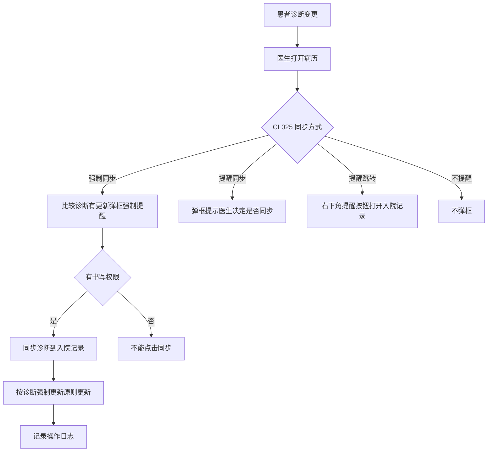
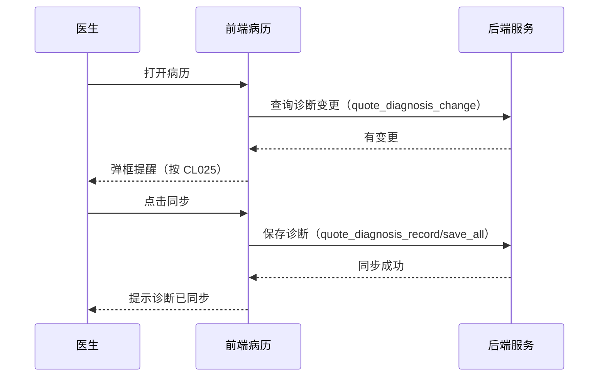

# BLGL-03-ZDYY-002 诊断变更同步与提醒 - Spec

> **功能编号**：BLGL-03-ZDYY-002
> **文档类型**：Spec（研发视角）
> **文档版本**：V1.0
> **编写时间**：2026-08-15
> **编写人**：RACC

---

## 文档索引

#### 章节索引

**Spec（研发视角）**

| 章节号 | 章节名称 | 内容说明 |
|--------|---------|---------|
| 1、 | 文档概述 | 文档目的、文档范围、术语定义、阅读指南、参考文档 |
| 2、 | 功能背景与定位 | 功能背景、功能定位、目标用户、核心价值 |
| 3、 | 业务流程设计 | 主流程/异常流程/边界流程（Given/When/Then） |
| 4、 | 数据模型设计 | 核心数据结构、状态定义、系统参数定义 |
| 5、 | 接口契约设计 | API列表、接口详细设计、错误码定义 |
| 6、 | 技术方案设计 | 页面路径、技术栈、关键技术点、部署方案 |
| 7、 | 测试用例预设计 | 功能/边界/异常/性能测试用例 |
| 8、 | 非功能性要求 | 性能、安全、可用性、兼容性 |
| 9、 | 依赖与风险 | 外部依赖、风险项 |
| 10、 | 附录 | 流程图、时序图、参考文档 |

**PM-Spec（业务视角）**

| 章节号 | 章节名称 | 内容说明 |
|--------|---------|---------|
| 一 | 目标 | 功能定位与核心价值 |
| 二 | 约束 | 业务/技术/非功能性约束 |
| 三 | 验收标准 | 验收条件与验证方法 |
| 四 | 排除范围 | 本次不做项与明确边界 |
| 五 | 关键决策记录 | 方案决策与选型理由 |
| 六 | 优先级 | 优先级定义 |
| 七 | 关联文档 | 关联文档索引 |
| 附录 | 填写检查清单 | 质量检查 |

**Analyst-Spec（产品视角）**

| 章节号 | 章节名称 | 内容说明 |
|--------|---------|---------|
| 一 | 功能编号体系 | 功能编号与层级结构 |
| 二 | 核心业务流程 | 核心业务流程与时序 |
| 三 | 功能规格说明 | 详细功能规格与验收标准 |
| 四 | 排除范围 | 排除范围 |
| 五 | 业务规则清单 | 业务规则清单 |
| 六 | 关联文档 | 关联文档索引 |
| 七 | 待确认问题清单 | 待确认问题汇总 |
| - | 填写检查清单 | 质量检查 |

#### 版本历史

| 版本 | 日期 | 变更说明 | 编写人 |
|------|------|---------|--------|
| V1.0 | 2026-08-15 | 初始版本 | RACC |

#### 关联文档索引

| 序号 | 文档名称 | 文档类型 | 版本 | 位置 |
|------|---------|---------|------|------|
| 1 | BLGL-03-ZDYY-002_诊断变更同步与提醒_PM-spec.md | PM-Spec（业务视角） | V0.1 | 本目录 |
| 2 | BLGL-03-ZDYY-002_诊断变更同步与提醒_Analyst-spec.md | Analyst-Spec（产品视角） | V1.0 | 本目录 |
| 3 | BLGL-03-ZDYY-002_诊断变更同步与提醒-Spec.md | Spec（研发视角）（本文档） | V1.0 | 本目录 |
| 4 | BLGL-03-ZDYY 诊断引用功能点Spec.md | 功能点Spec（模块级） | V1.1 | 上级目录 |
---

## 1、文档概述

### 1.1、文档目的

本文档旨在明确"诊断变更同步与提醒"功能（BLGL-03-ZDYY-002）的业务背景与设计方案，为需求分析、研发实现、测试验收及评审提供统一的业务上下文、设计口径与决策依据。

**具体目的包括**：

1. 梳理诊断变更同步与提醒功能的业务由来与历史需求演进脉络，说明"为什么要做"；
2. 明确功能的定位边界、目标用户与核心价值，回答"做成什么"；
3. 描述功能的业务流程、数据模型、接口契约与技术方案，回答"怎么做"；
4. 预设计测试用例并明确非功能性要求、依赖与风险，为研发与验收提供依据；
5. 作为 Analyst-Spec 的业务前提与设计输入，保证各层文档业务口径一致。

### 1.2、文档范围

#### 1.2.1 纳入范围

本文档覆盖诊断变更同步与提醒的完整业务背景与设计，包括：

- 入院记录诊断同步方式配置：CL025 参数（不提醒/提醒同步/强制同步/提醒跳转，未提交/提交后 8 值多选）
- 诊断变更提醒：打开病历界面比较诊断控件和入院记录诊断，不一致时提醒
- 三日确定诊断提醒：CL027 开启时入区三日后入院记录无确定诊断的提醒
- 诊断自动同步/自动引入：补充/修正/初步诊断填写后自动引入入院记录、入院记录未提交自动同步、批量创建病历诊断带入
- 诊断强制更新原则：初步/确定/补充/修正诊断的同步更新规则
- 出院诊断自动更新：出院记录/疾病证明的出院诊断后台自动更新

#### 1.2.2 排除范围

本文档不涉及以下内容（详见其他功能点或模块）：

- 诊断数据接入与查询（诊断组件查询）—— BLGL-03-ZDYY-001
- 诊断引用弹窗交互（勾选/关闭/触发方式）—— BLGL-03-ZDYY-003
- 诊断权限与签名（上级加签/职称比较）—— BLGL-03-ZDYY-004
- 诊断样式显示配置（排序/标题/序号/分隔符）—— BLGL-03-ZDYY-005
- 诊断落库与对外对接（结构化落库/传值病案系统）—— BLGL-03-ZDYY-008

### 1.3、术语定义

| 术语 | 定义 |
|------|------|
| CL025 | "入院记录上诊断同步方式"参数，控制诊断变更时病历的同步/提醒方式 |
| CL027 | 确定诊断提醒参数，开启后入区三日入院记录无确定诊断时提醒 |
| 强制同步 | CL025 的一种取值：打开病历界面比较诊断，有更新弹框强制提醒，不点同步不消失，病历界面不能进行其他操作 |
| 提醒跳转 | CL025 的一种取值：右下角弹出提醒，按钮"打开入院记录"，点击跳转由医生手动引用诊断 |

### 1.4、阅读指南

- **章节关系**：第1~2章为业务全貌，第3~10章为设计实现层。与 Analyst-Spec、PM-Spec 互相引用保持一致。
- **读者对象**：产品经理/需求分析师读第1~2章；研发读第3~6、9~10章；测试读第3、7~8章；评审人员核对各层一致性。

### 1.5、参考文档

| 序号 | 文档名称 | 版本/日期 |
|------|---------|----------|
| 1 | 【历史需求】住院病历的历史需求.xlsx | - |
| 2 | BLGL-03-ZDYY-002_诊断变更同步与提醒_PM-spec.md | V0.1 |
| 3 | BLGL-03-ZDYY-002_诊断变更同步与提醒_Analyst-spec.md | V1.0 |
| 4 | BLGL-03-ZDYY 诊断引用功能点Spec.md | V1.1 |

---

## 2、功能背景与定位

### 2.1 功能背景

诊断变更同步与提醒是诊断引用模块的一致性保障层，需满足：

- **现状痛点**：患者诊断修订后未强制同步到入院记录，导致部分病历未及时同步诊断，诊断缺失及不一致（质控科黄铭娜反馈，来源：需求）；入院记录诊断与诊断控件不一致时医生可能未注意到提示
- **管理要求**：诊断不一致影响病历质控与诊疗连续性，需通过同步方式参数化控制
- **历史需求演进**：入院记录诊断同步方式强同步（需求）→ 新增"提醒跳转"选项（需求）→ CL025 拓展为未提交/提交后 8 值多选（需求）→ 三日确定诊断提醒优化（需求）→ 患者诊断保存调用入院记录同步（需求）

### 2.2 功能定位

"诊断变更同步与提醒"是 WiNEX 病历管理-诊断引用的一致性保障层，定位为：

- **一致性保障**：保证病历诊断与医生站诊断一致，避免诊断缺失及不一致
- **同步方式参数化**：CL025 控制不提醒/提醒同步/强制同步/提醒跳转，按病历提交状态细分
- **提醒触达**：诊断变更/确定诊断缺失时通过弹框提醒医生处理

### 2.3 目标用户

| 用户角色 | 主要使用场景 |
|---------|-------------|
| 住院医生 | 打开病历收到诊断变更提醒，手动或强制同步诊断到入院记录 |
| 质控科 | 关注诊断缺失及不一致的同步 |
| 护士 | 无病历书写权限时不能点击同步按钮 |

### 2.4 核心价值

| 价值维度 | 价值描述 |
|---------|---------|
| 一致性 | 患者诊断修订后强制同步入院记录，避免诊断缺失及不一致 |
| 质控合规 | 质控科反馈的诊断同步问题得到解决 |
| 触达效率 | 三日确定诊断提醒优化到右下角，医生可立即处理 |

---

## 3、业务流程设计（Given/When/Then）

### 3.1 主流程

**Scenario 1: 强制同步——患者诊断修订后同步到入院记录**

```gherkin
Given:
 - CL025 设置为"强制同步"
 - 患者诊断控件有更新（初步/确定/补充/修正诊断变更）

When:
 - 医生打开病历界面
 - 系统比较诊断控件和入院记录上诊断，发现更新

Then:
 - 弹框强制提醒"入院记录上诊断有更新，需要同步"
 - 不点同步更新，弹框不消失，病历界面不能进行其他操作
 - 可点击同步按钮的人必须有病历书写权限，无权限者不能点击同步
 - 同步后按诊断强制更新原则更新入院记录诊断
 - 手动添加诊断和同步修改诊断时增加日志记录
```


### 3.2 异常流程

**Scenario 2: 业务异常——无病历书写权限点击同步**

```gherkin
Given:
 - CL025 = 强制同步
 - 当前登录人员无病历书写权限（如护士）

When:
 - 诊断变更弹框出现
 - 尝试点击同步按钮

Then:
 - 不能点击同步
 - 同步操作被阻止
```


**Scenario 3: 数据异常——修正诊断清空**

```gherkin
Given:
 - 入院记录上已有修正诊断记录
 - 诊断控件的修正诊断清空

When:
 - 触发同步

Then:
 - 入院记录上修正诊断记录全部删除
```


**Scenario 4: 系统异常——同步过程中病历被操作**

```gherkin
Given:
 - 患者诊断界面保存后调用入院记录进行诊断同步

When:
 - 同步进行中

Then:
 - 同步过程中不能关闭弹框
 - 病历不能进行操作，显示"同步诊断中"
 - 同步完成后提示"诊断已同步到入院记录，请确认"
```

### 3.3 边界流程

**Scenario 5: 边界——入院记录未提交自动同步**

```gherkin
Given:
 - 入院记录未提交
 - 患者诊断有更新

When:
 - 医生打开入院记录

Then:
 - 自动同步最新的入院诊断
 - 不需要医生再去点击一下
```


**Scenario 6: 边界——批量创建病历诊断带入**

```gherkin
Given:
 - 病历多选批量创建（知情同意书、讨论记录、成套模板等）
 - 病历未打开过、诊断内容未填充

When:
 - 批量提交时

Then:
 - 更新新建状态的病历中的诊断
 - 按诊断数据元、诊断类型和样式配置自动带入诊断信息
```


---

## 4、数据模型设计

### 4.1 核心数据结构

#### 4.1.1 核心保存请求

| 字段名 | 类型 | 必填 | 备注 |
|--------|------|------|------|
| 病历目录 | - | 是 | 入院记录目录（已包含再次或多次入院记录类型） |
| 病历状态 | - | 是 | 未提交/提交后，接口返回给前端 |
| 诊断信息 | - | 是 | 同步到入院记录的诊断 |

> ⏳ 待确认：同步接口完整入参/出参以代码扫描和 API 契约为准。

#### 4.1.2 核心表/实体

| 表/实体 | 关键字段 | 说明 |
|---------|---------|------|
| INP_EMR_DIAGNOSIS | inpEmrDiagnosisRecordId、inpEmrDiagnosisTypeId、inpEmrSetId、encounterId、diagnosisTypeCode、diagnosisPriSecCode、diagnosisCode | 病历引用诊断记录表 |
| INP_EMR_DIAGNOSIS_SIGNATURE | inpEmrDiagnosisTypeId、diagnosisGroupNo、inpEmrSetId、encounterId、emrDiagnosisTypeCode | 病历引用诊断类型记录表 |
| INPATIENT_RHB_DIAGNOSIS | inpatientRhbDiagnosisId、inpRhbRecordId、encounterId、patientEncounterDiagnosisId、diagnosisCode | 住院病历患者就诊主诊断表 |

### 4.2 状态定义

| ⏳ 待确认 | 状态定义 | 状态定义未在资料区中找到（病历提交状态见 CL025 配置，来源：需求） |

### 4.3 系统参数定义

| 参数编码 | 参数名称 | 说明 |
|---------|---------|------|
| CL025 | 入院记录上诊断同步方式 | 值（初版）：1.不提醒；2.提醒同步；3.强制同步；拓展（需求）：未提交时不提醒/提醒同步/强制同步/提醒跳转、提交后不提醒/提醒同步/强制同步/提醒跳转，支持多选，原值映射见需求|
| CL027 | 确定诊断提醒 | 开启后入区三日后入院记录无确定诊断打开病历提醒 |
| 补充诊断每次插入是否重新编号 | - | 默认否（否时补充诊断序号按照已插入诊断计算，如已插入 1 和 2，再次插入从 3 开始显示） |

---

## 5、接口契约设计

### 5.1 API列表

| 序号 | API名称（代码函数） | 路径 | 方法 | 说明 |
|:----:|---------|------|:----:|------|
| 1 | 查询病历引用诊断是否发生变化 | /api/v1/app_record_inpatient/emr_inpatient/set/quote_diagnosis_change/query | POST | 诊断提醒 |
| 2 | 保存病历引用诊断类型记录 | /api/v1/app_record_inpatient/emr_inpatient/set/quote_diagnosis_record/save | POST | 增量保存 |
| 3 | 保存全部病历引用诊断类型记录 V1 | /api/v1/app_record_inpatient/emr_inpatient/set/quote_diagnosis_record/save_all | POST | 全量覆盖 |
| 4 | 查询确定诊断 | /api/v1/app_record_inpatient/emr_final_diagnosis/query/by_encounter_id | POST | 确定诊断缺失提醒 |

### 5.2 接口详细设计

#### 5.2.1 查询病历引用诊断是否发生变化（quote_diagnosis_change/query）

**请求参数**:
```json
{
 "inpEmrSetId": "12345",
 "encounterId": "12345"
}
```

**返回值（成功）**:
```json
{
 "success": true,
 "data": {
 "hasChange": true,
 "changedDiagnosis": []
 }
}
```

> ⏳ 待确认：字段名以代码扫描和 API 契约为准。

**返回值（失败）**:
```json
{
 "success": false,
 "message": "查询诊断变更失败",
 "data": null
}
```

### 5.3 错误码定义

| 错误码 | 错误信息 | 处理方式 |
|--------|---------|---------|
| ⏳ 待确认 | 同步失败 | 弹框不消失，病历界面不能进行其他操作 |

---

## 6、技术方案设计

### 6.1 页面路径

- **页面路径**: 住院医生站→住院病历书写界面→入院记录（/admissionNote），挂载诊断同步提醒 SyncDiagnosisDialog
- **前端组件**: src/pages/EmrDiagnosis/components/SyncDiagnosis.vue（诊断同步提醒弹窗，配置 CL025/CL027）
- **前端 API**: src/pages/EmrDiagnosis/api/index.js getConfirmDiagnosis → emr_final_diagnosis/query/by_encounter_id、getQuoteDiagnosisChange → quote_diagnosis_change/query
- **触发事件**: eventHubHelper 事件 checkDiagnosisOnDischargeSubmit

### 6.2 技术栈

| 类别 | 技术 | 版本 |
|------|------|------|
| 前端框架 | Vue | 2.6.14 |
| 前端UI | element-ui | 2.13.0 |
| 后端框架 | Spring Boot（Java 17）+ JPA/Hibernate | - |
| RPC | winning-akso-rpc-rest | - |

### 6.3 关键技术点

- 参数 CL025 修改新增下拉选项，后台接口在原来基础上把病历的状态返回给前端
- 前端根据相关参数做同步还是提醒
- 强制同步弹框不点同步不消失，病历界面不能进行其他操作

### 6.4 部署方案

⏳ 待确认：部署方案未在资料区中找到。

---

## 7、测试用例预设计

### 7.1 功能测试

| 用例编号 | 测试场景 | Given | When | Then |
|---------|---------|-------|------|------|
| TC-001 | CL025=强制同步 | 患者诊断有更新，医生打开病历 | 系统比较诊断发现更新 | 弹框强制提醒，不点同步不消失 |

### 7.2 边界测试

| 用例编号 | 测试场景 | Given | When | Then |
|---------|---------|-------|------|------|
| TC-002 | 无书写权限点击同步 | 护士无书写权限，CL025=强制同步 | 尝试点击同步 | 不能点击同步 |

### 7.3 异常测试

| 用例编号 | 测试场景 | Given | When | Then |
|---------|---------|-------|------|------|
| TC-003 | 修正诊断清空 | 入院记录已有修正诊断，控件修正诊断清空 | 触发同步 | 入院记录修正诊断全部删除 |

### 7.4 性能测试

| 用例编号 | 测试场景 | 指标 |
|---------|---------|------|
| TC-004 | 诊断变更查询响应 | ⏳ 待确认：性能指标未在资料区中找到 |

---

## 8、非功能性要求

### 8.1 性能要求

| 指标 | 要求 |
|------|------|
| 诊断变更查询响应时间 | ⏳ 待确认 |

### 8.2 安全要求

| 要求 | 说明 |
|------|------|
| 权限控制 | 可点击同步按钮的人必须有病历书写权限，无权限不能点击同步 |

**医疗行业特殊要求**

| 要求 | 说明 |
|------|------|
| 诊断一致性 | 保证病历与医生站诊断一致，避免诊断缺失及不一致影响诊疗 |

### 8.3 可用性要求

| 指标 | 要求值 |
|------|--------|
| 可用性 | ⏳ 待确认 |

### 8.4 兼容性要求

| 类型 | 要求 |
|------|------|
| 病历状态 | CL025 需兼容未提交/提交后两种状态取值，原下拉值与新值需映射 |
| 入院记录类型 | 以入院记录目录为判断标准，已包含再次或多次入院记录类型 |

---

## 9、依赖与风险

### 9.1 外部依赖

| 依赖项 | 说明 |
|--------|------|
| 医生站诊断组件 | 诊断变更数据源，病历比较诊断控件和入院记录诊断 |

### 9.2 风险项

| 风险项 | 等级 | 说明 | 应对方案 |
|--------|------|------|---------|
| 强制同步阻断 | 中 | 强制同步时病历界面不能操作，可能影响医生工作流 | 弹框引导医生同步后继续 |
| CL025 兼容 | 中 | 参数取值拓展（未提交/提交后 8 值）需与旧配置值映射 | 按需求映射关系处理 |

---

## 10、附录

### 10.1 流程图



### 10.2 时序图



### 10.3 参考文档

- 【历史需求】住院病历的历史需求.xlsx（需求）
- BLGL-03-ZDYY 诊断引用功能点Spec.md（V1.1，第5章 BLGL-03-ZDYY-002 行）
- 关联Spec: BLGL-03-ZDYY-002_诊断变更同步与提醒_PM-spec.md、BLGL-03-ZDYY-002_诊断变更同步与提醒_Analyst-spec.md

---

## 填写检查清单

| 序号 | 检查项 | 是否完成 |
|:----:|--------|:--------:|
| 1 | 章节索引与正文章节一致 | ✅ |
| 2 | 版本历史记录完整 | ✅ |
| 3 | 关联文档索引已登记全部Spec | ✅ |
| 4 | 文档目的明确回答"为什么做/做成什么/怎么做" | ✅ |
| 5 | 纳入范围/排除范围清晰 | ✅ |
| 6 | 术语定义覆盖关键概念，从资料区可溯源 | ✅ |
| 7 | 参考文档已登记 | ✅ |
| 8 | 功能背景基于法规/规范/需求来源组织 | ✅ |
| 9 | 功能定位体现业务价值（3~5个定位点） | ✅ |
| 10 | 目标用户角色覆盖完整，在需求原文中有出处 | ✅ |
| 11 | 核心价值可陈述，与 Phase 1 口径一致 | ✅ |
| 12 | 业务流程：主流程≥1、异常≥3、边界≥2，Given/When/Then 具体 | ✅ |
| 13 | 数据模型：字段/表/状态/参数可溯源 | ✅ |
| 14 | 接口契约：API列表+详细设计+错误码齐全或标记待确认 | ✅ |
| 15 | 技术方案：页面路径/技术栈/关键点/部署方案或标记待确认 | ✅ |
| 16 | 测试用例：功能/边界/异常/性能覆盖 | ✅ |
| 17 | 非功能性要求：性能/安全/可用性/兼容性指标可量化或标记待确认 | ✅ |
| 18 | 依赖与风险：外部依赖登记完整 | ✅ |
| 19 | 附录：流程图/时序图与正文流程一致 | ✅ |
| 20 | 全文无占位符 `< >` 残留 | ✅ |
| 21 | 全文陈述可溯源至资料区 | ✅ |
| 22 | 人工审核确认完成 | ⏳ 待确认 |

---

**文档状态**：⬜ 待审核
**维护责任**：RACC
**下次更新**：根据评审反馈优化
