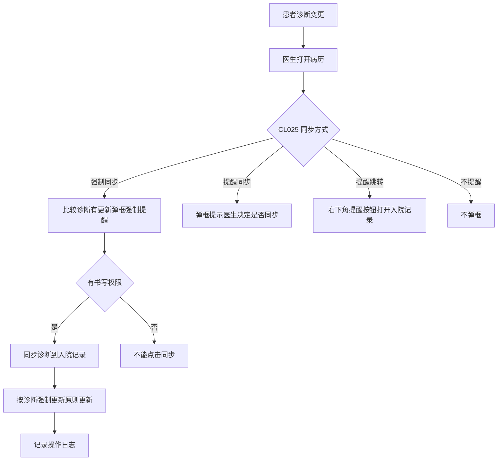
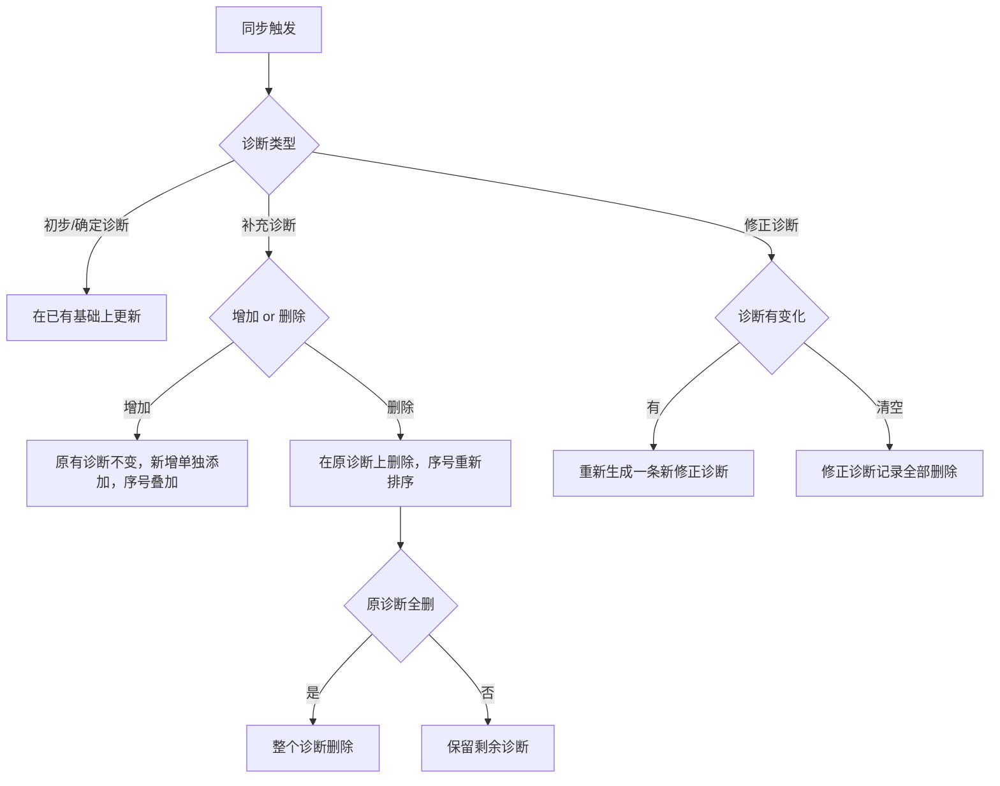

# BLGL-03-ZDYY-002 诊断变更同步与提醒 _ Analyst - Spec

> **需求编号**：BLGL-03-ZDYY-002
> **父需求**：BLGL-03-ZDYY
> **关联PM Spec**：BLGL-03-ZDYY-002_诊断变更同步与提醒_PM-spec.md
> **Spec版本**：V1.0
> **编写时间**：2026-08-15
> **编写人**：需求分析师

---

## 一、功能编号体系

### 1.1 功能层级结构

```
BLGL-03-ZDYY-002-001: 入院记录诊断同步方式配置
  └─ BLGL-03-ZDYY-002-001-01: CL025 参数配置（未提交/提交后 8 值多选）

BLGL-03-ZDYY-002-002: 诊断变更提醒与强制同步
  ├─ BLGL-03-ZDYY-002-002-01: 诊断变更比较与弹框提醒
  ├─ BLGL-03-ZDYY-002-002-02: 强制同步权限校验
  └─ BLGL-03-ZDYY-002-002-03: 诊断强制更新原则

BLGL-03-ZDYY-002-003: 三日确定诊断提醒
  └─ BLGL-03-ZDYY-002-003-01: CL027 提醒弹框优化

BLGL-03-ZDYY-002-004: 诊断自动同步与引入
  ├─ BLGL-03-ZDYY-002-004-01: 补充/修正/初步诊断自动引入
  ├─ BLGL-03-ZDYY-002-004-02: 入院记录未提交自动同步
  ├─ BLGL-03-ZDYY-002-004-03: 批量创建病历诊断带入
  └─ BLGL-03-ZDYY-002-004-04: 出院诊断后台自动更新
```

### 1.2 功能编号表

| REQ-ID | 功能名称 | 类型 | 优先级 | 说明 |
|--------|---------|------|--------|------|
| BLGL-03-ZDYY-002-001 | 入院记录诊断同步方式配置 | 功能 | P0 | CL025 参数控制同步方式 |
| BLGL-03-ZDYY-002-001-01 | CL025 参数配置 | 子功能 | P0 | 未提交/提交后 8 值多选，原值映射 |
| BLGL-03-ZDYY-002-002 | 诊断变更提醒与强制同步 | 功能 | P0 | 打开病历比较诊断，按 CL025 提醒/强制同步 |
| BLGL-03-ZDYY-002-002-01 | 诊断变更比较与弹框提醒 | 子功能 | P0 | 比较诊断控件和入院记录诊断，有更新弹框 |
| BLGL-03-ZDYY-002-002-02 | 强制同步权限校验 | 子功能 | P0 | 无病历书写权限不能点击同步 |
| BLGL-03-ZDYY-002-002-03 | 诊断强制更新原则 | 子功能 | P0 | 初步/确定/补充/修正诊断同步更新规则 |
| BLGL-03-ZDYY-002-003 | 三日确定诊断提醒 | 功能 | P1 | CL027 开启时入区三日无确定诊断提醒 |
| BLGL-03-ZDYY-002-003-01 | CL027 提醒弹框优化 | 子功能 | P1 | 右下角弹框，点"立即处理"跳转 |
| BLGL-03-ZDYY-002-004 | 诊断自动同步与引入 | 功能 | P1 | 自动引入/自动同步/批量带入/后台更新 |
| BLGL-03-ZDYY-002-004-01 | 补充/修正/初步诊断自动引入 | 子功能 | P1 | 填写后入院记录自动引入 |
| BLGL-03-ZDYY-002-004-02 | 入院记录未提交自动同步 | 子功能 | P1 | 未提交时自动同步最新入院诊断 |
| BLGL-03-ZDYY-002-004-03 | 批量创建病历诊断带入 | 子功能 | P1 | 批量提交时按数据元/类型/样式自动带入 |
| BLGL-03-ZDYY-002-004-04 | 出院诊断后台自动更新 | 子功能 | P1 | 出院诊断更新后台自动更新出院记录/疾病证明 |

---

## 二、核心业务流程

### 2.1 诊断变更同步与提醒主流程



### 2.2 诊断强制更新原则流程




---

## 三、功能规格说明

### BLGL-03-ZDYY-002-001: 入院记录诊断同步方式配置

#### 3.1.1 功能概述

增加入院记录上诊断同步方式参数 CL025，初版值：1.不提醒；2.提醒同步；3.强制同步；参数位置移动到病历诊断配置-参数配置中。后拓展为未提交/提交后 8 值多选。

#### 3.1.2 用户角色

| 角色 | 使用场景 | 权限要求 | 操作频率 |
|------|---------|---------|---------|
| 病案管理员/配置人员 | 病历业务配置-病历诊断配置-参数配置 | 配置权限 | 低频 |

#### 3.1.3 业务流程（Given/When/Then）

**Scenario 1: CL025 参数配置（主流程）**

```gherkin
Given:
  - 配置人员已打开病历业务配置→病历诊断配置→参数配置

When:
  - 配置 CL025"入院记录上诊断同步方式"的值

Then:
  - 可选择不提醒/提醒同步/强制同步/提醒跳转
  - 支持未提交时/提交后细分取值，支持多选
  - 原下拉值正确映射到新值
```


**Scenario 2: 异常——原配置值映射**

```gherkin
Given:
  - 系统已有旧 CL025 配置值（不提醒/提醒同步/强制同步/提醒跳转）

When:
  - 升级后查看参数

Then:
  - 不提醒→未提交时不提醒+提交后不提醒
  - 提醒同步→未提交时提醒同步+提交后提醒同步
  - 强制同步→未提交时强制同步+提交后强制同步
  - 提醒跳转→未提交时提醒跳转+提交后提醒跳转
```


#### 3.1.5 验收标准

| AC编号 | 验收标准 | 对应REQ-ID | 验证方法 | 验证场景 |
|--------|---------|-----------|---------|---------|
| AC-001 | CL025 配置为 8 值多选且原值正确映射 | BLGL-03-ZDYY-002-001 | 功能测试 | Scenario 1/2 |

---

### BLGL-03-ZDYY-002-002: 诊断变更提醒与强制同步

#### 3.2.1 功能概述

打开病历界面时比较诊断控件和入院记录上诊断，若有更新按 CL025 配置弹框提醒或强制同步。强制同步时弹框不点同步不消失、病历界面不能操作、无书写权限不能点击同步；同步按诊断强制更新原则执行并记录日志。

#### 3.2.2 用户角色

| 角色 | 使用场景 | 权限要求 | 操作频率 |
|------|---------|---------|---------|
| 住院医生 | 打开病历收到诊断变更提醒 | 病历书写权限 | 高频 |
| 护士 | 尝试点击同步 | 无书写权限不可同步 | 中频 |

#### 3.2.3 业务流程（Given/When/Then）

**Scenario 1: 强制同步（主流程）**

```gherkin
Given:
  - CL025 = 强制同步
  - 患者诊断控件有更新

When:
  - 医生打开病历界面

Then:
  - 弹框强制提醒入院记录诊断有更新需要同步
  - 不点同步弹框不消失，病历界面不能进行其他操作
  - 有书写权限者可点击同步
```


**Scenario 2: 业务异常——无权限点击同步**

```gherkin
Given:
  - CL025 = 强制同步
  - 当前人员无病历书写权限

When:
  - 尝试点击同步按钮

Then:
  - 不能点击同步
  - 同步被阻止
```


**Scenario 3: 数据异常——修正诊断清空**

```gherkin
Given:
  - 入院记录已有修正诊断记录
  - 诊断控件修正诊断清空

When:
  - 触发同步

Then:
  - 入院记录修正诊断记录全部删除
```


**Scenario 4: 数据异常——补充诊断序号**

```gherkin
Given:
  - 入院记录已插入补充诊断 1 和 2
  - "补充诊断每次插入是否重新编号"=否

When:
  - 再次插入补充诊断

Then:
  - 新增的诊断从 3 开始显示，原有诊断不变
```


**Scenario 5: 边界——诊断无变化**

```gherkin
Given:
  - 诊断控件和入院记录诊断一致

When:
  - 打开病历

Then:
  - 不弹框提醒
```


**Scenario 6: 边界——同步后日志**

```gherkin
Given:
  - 入院记录手动添加诊断或同步修改诊断

When:
  - 操作完成

Then:
  - 增加日志记录
```


#### 3.2.5 验收标准

| AC编号 | 验收标准 | 对应REQ-ID | 验证方法 | 验证场景 |
|--------|---------|-----------|---------|---------|
| AC-002 | 强制同步时弹框不消失、病历界面不能操作 | BLGL-03-ZDYY-002-002 | 功能测试 | Scenario 1 |
| AC-003 | 无书写权限不能点击同步 | BLGL-03-ZDYY-002-002 | 功能测试 | Scenario 2 |
| AC-004 | 修正诊断清空时全部删除；补充诊断按序号规则叠加 | BLGL-03-ZDYY-002-002 | 功能测试 | Scenario 3/4 |

---

### BLGL-03-ZDYY-002-003: 三日确定诊断提醒

#### 3.3.1 功能概述

患者入区三日后若入院记录没有确定诊断，打开病历就会提醒，但原提醒不够明显。优化为：参数 CL027 开启时提醒弹框放到右下角，优先悬浮在其他弹框上面，点"立即处理"跳转打开入院记录。

#### 3.3.2 用户角色

| 角色 | 使用场景 | 权限要求 | 操作频率 |
|------|---------|---------|---------|
| 住院医生 | 入区三日入院记录无确定诊断时打开病历 | 病历书写权限 | 中频 |

#### 3.3.3 业务流程（Given/When/Then）

**Scenario 1: 三日确定诊断提醒（主流程）**

```gherkin
Given:
  - CL027 开启
  - 患者入区三日后入院记录无确定诊断

When:
  - 医生打开病历

Then:
  - 右下角弹出确定诊断提醒
  - 弹框优先悬浮在其他弹框上面
  - 弹框不点"立即处理"不消失
  - 点"立即处理"跳转打开入院记录
```


#### 3.3.5 验收标准

| AC编号 | 验收标准 | 对应REQ-ID | 验证方法 | 验证场景 |
|--------|---------|-----------|---------|---------|
| AC-005 | 三日无确定诊断弹框右下角、悬浮顶层、点"立即处理"跳转入院记录 | BLGL-03-ZDYY-002-003 | 功能测试 | Scenario 1 |

---

### BLGL-03-ZDYY-002-004: 诊断自动同步与引入

#### 3.4.1 功能概述

补充诊断、修正诊断、初步诊断填写后入院记录自动引入；入院记录未提交时自动同步最新入院诊断；病历批量创建（知情同意书、讨论记录等）提交时按诊断数据元/类型/样式配置自动带入诊断；出院诊断更新后后台自动更新出院记录和疾病证明。

#### 3.4.2 用户角色

| 角色 | 使用场景 | 权限要求 | 操作频率 |
|------|---------|---------|---------|
| 住院医生 | 诊断填写后自动同步/引入 | 病历书写权限 | 高频 |

#### 3.4.3 业务流程（Given/When/Then）

**Scenario 1: 补充/修正/初步诊断自动引入（主流程）**

```gherkin
Given:
  - 患者已填写补充诊断、修正诊断、初步诊断

When:
  - 入院记录打开/生成

Then:
  - 入院记录中自动引入这些诊断
```


**Scenario 2: 入院记录未提交自动同步**

```gherkin
Given:
  - 入院记录未提交
  - 患者入院诊断有更新

When:
  - 医生打开入院记录

Then:
  - 自动同步最新入院诊断
  - 不需要医生再点击一下
```


**Scenario 3: 批量创建病历诊断带入**

```gherkin
Given:
  - 病历多选批量创建（知情同意书、讨论记录等，除入院记录/首次病程/病案首页目录外，含成套模板）
  - 病历未打开过、诊断内容未填充

When:
  - 批量提交

Then:
  - 更新新建状态病历中的诊断
  - 按诊断数据元、诊断类型和样式配置自动带入诊断信息
```


**Scenario 4: 出院诊断后台自动更新**

```gherkin
Given:
  - 出院诊断更新

When:
  - 后台处理

Then:
  - 自动更新出院记录和疾病证明的出院诊断
```


#### 3.4.5 验收标准

| AC编号 | 验收标准 | 对应REQ-ID | 验证方法 | 验证场景 |
|--------|---------|-----------|---------|---------|
| AC-006 | 补充/修正/初步诊断填写后入院记录自动引入 | BLGL-03-ZDYY-002-004 | 功能测试 | Scenario 1 |
| AC-007 | 入院记录未提交时自动同步最新入院诊断 | BLGL-03-ZDYY-002-004 | 功能测试 | Scenario 2 |
| AC-008 | 批量创建病历提交时按配置自动带入诊断 | BLGL-03-ZDYY-002-004 | 功能测试 | Scenario 3 |
| AC-009 | 出院诊断更新后后台自动更新出院记录和疾病证明 | BLGL-03-ZDYY-002-004 | 集成测试 | Scenario 4 |

---

## 四、排除范围

本需求不包含以下功能项：

1. **诊断数据接入与查询**（诊断组件查询/ICD-11 改造）—— BLGL-03-ZDYY-001
2. **诊断引用弹窗交互**（勾选/关闭/触发方式/缩放）—— BLGL-03-ZDYY-003
3. **诊断权限与签名**（上级加签/职称比较）—— BLGL-03-ZDYY-004
4. **诊断样式显示配置**（排序/标题/序号/分隔符）—— BLGL-03-ZDYY-005
5. **诊断落库与对外对接**（结构化落库/传值病案系统）—— BLGL-03-ZDYY-008

---

## 五、业务规则清单

| 规则ID | 规则名称 | 规则描述 | 优先级 |
|--------|---------|---------|--------|
| BR-001 | CL025 同步方式 | 入院记录诊断同步方式：不提醒/提醒同步/强制同步/提醒跳转，未提交/提交后 8 值多选 | P0 |
| BR-002 | 强制同步阻断 | 强制同步时不点同步弹框不消失，病历界面不能进行其他操作 | P0 |
| BR-003 | 同步权限 | 可点击同步按钮的人必须有病历书写权限，无权限不能点击 | P0 |
| BR-004 | 初步/确定诊断更新 | 初步诊断、确定诊断在已有基础上更新 | P0 |
| BR-005 | 补充诊断更新 | 增加补充诊断时原有诊断不变，新增单独添加序号叠加；删除时在原诊断上删除，序号重新排序，全删则整个诊断删除 | P0 |
| BR-006 | 修正诊断更新 | 诊断有变化时入院记录重新生成新修正诊断；修正诊断清空时记录全部删除 | P0 |
| BR-007 | 补充诊断编号 | 补充诊断每次插入是否重新编号，默认否（否时序号按已插入诊断计算） | P1 |
| BR-008 | 同步日志 | 入院记录手动添加诊断和同步修改诊断时增加日志记录 | P1 |
| BR-009 | CL025 映射 | 原下拉值映射：不提醒→未提交/提交后不提醒，提醒同步→未提交/提交后提醒同步，强制同步→未提交/提交后强制同步，提醒跳转→未提交/提交后提醒跳转 | P0 |

---

## 六、关联文档

| 文档类型 | 文档路径 | 说明 |
|---------|---------|------|
| 功能点Spec（模块级） | BLGL-03-ZDYY 诊断引用功能点Spec.md（V1.1，上级目录） | Phase 1 功能点索引 |
| PM-Spec（业务视角） | 本目录 BLGL-03-ZDYY-002_诊断变更同步与提醒_PM-spec.md（V0.1） | PM 产出的 Spec 文档 |
| Spec（研发视角） | 本目录 BLGL-03-ZDYY-002_诊断变更同步与提醒-Spec.md（V1.0） | 业务背景与目标 Spec |
| data-model.md | 待产出 | 架构师产出的数据建模文档 |
| design.md | 待产出 | 架构师产出的技术方案文档 |
| api-contract.md | 待产出 | 开发经理产出的 API 契约文档 |

---

## 七、待确认问题清单

| 编号 | 问题描述 | 缺失信息 | 影响范围 | 建议补充方 |
|------|---------|---------|---------|-----------|
| Q-001 | 诊断变更查询接口（quote_diagnosis_change）完整入参/出参 | API 契约 | -Spec 第5章 | 开发经理 |
| Q-002 | 同步日志落库表结构 | 数据表清单 | 3.2.4 数据字段 | 架构师 |
| Q-003 | CL025 参数概念 ID | 概念ID | 3.1.4 数据字段 | 产品经理 |
| Q-004 | 出院诊断后台自动更新的具体更新规则 | 需求分析原文缺失 | 3.4.3 Scenario 4 | 需求分析师 |
| Q-005 | 性能指标（诊断变更查询响应时间） | 资料区无量化指标 | -Spec 第8章 | 产品经理 |

---

## 填写检查清单

| 序号 | 检查项 | 是否完成 |
|:----:|--------|:--------:|
| 1 | 功能编号带父子层级 | ✅ |
| 2 | 每个 REQ-ID 有功能概述和用户角色 | ✅ |
| 3 | 主流程至少 1 个 Given/When/Then 场景 | ✅ |
| 4 | 异常流程至少 3 个 Given/When/Then 场景 | ✅ |
| 5 | 边界流程至少 2 个 Given/When/Then 场景 | ✅ |
| 6 | 每个 Given/When/Then 内容具体，不模糊 | ✅ |
| 7 | 数据字段定义完整（字段名、类型、必填、说明、概念ID） | ✅ |
| 8 | 验收标准 AC 编号独立，可验证 | ✅ |
| 9 | 验收标准无"功能正常"等模糊表述 | ✅ |
| 10 | 排除范围明确列出 | ✅ |
| 11 | 业务规则清单列出所有规则，每条标注来源 | ✅ |
| 12 | 流程图使用 Mermaid 格式（≥2 个） | ✅ |
| 13 | 关联文档索引包含 Phase 1 功能点Spec | ✅ |
| 14 | 待确认问题清单汇总了全文所有 ⏳ 项 | ✅ |
| 15 | 全文无占位符 `< >` 残留 | ✅ |
| 16 | 全文陈述可溯源至资料区（S1~S10 溯源核查） | ✅ |
| 17 | 人工审核确认完成 | ⏳ 待确认 |

---

**文档状态**：⬜ 待审核
**维护责任**：需求分析师规范组
**下次更新**：根据评审反馈优化

---

## 版本历史

| 版本 | 日期 | 变更说明 | 编写人 |
|------|------|---------|--------|
| V1.0 | 2026-08-15 | 初始版本 | 需求分析师 |
