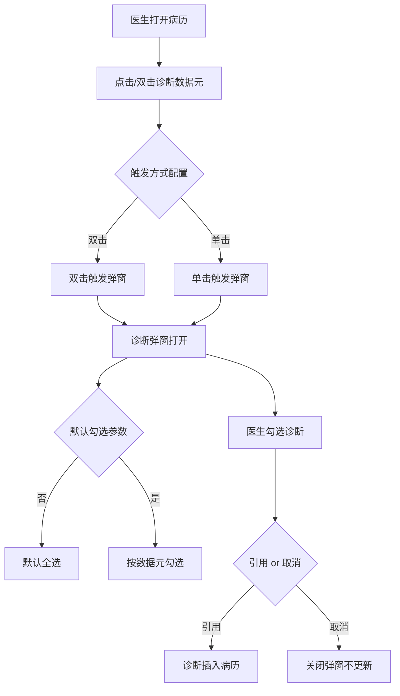
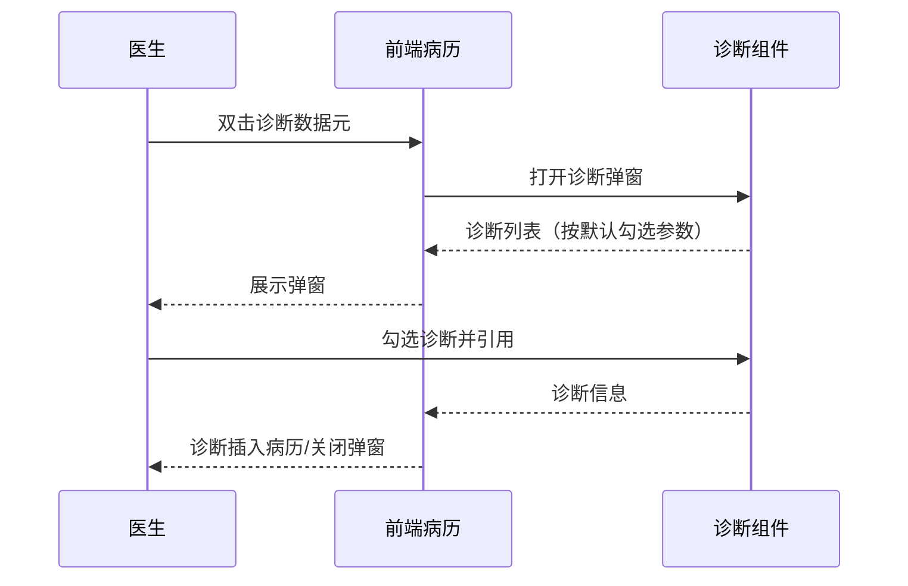

# BLGL-03-ZDYY-003 诊断引用交互 - Spec

> **功能编号**：BLGL-03-ZDYY-003
> **文档类型**：Spec（研发视角）
> **文档版本**：V1.0
> **编写时间**：2026-08-15
> **编写人**：RACC

---

## 文档索引

#### 章节索引

**Spec（研发视角）**

| 章节号 | 章节名称 | 内容说明 |
|--------|---------|---------|
| 1、 | 文档概述 | 文档目的、文档范围、术语定义、阅读指南、参考文档 |
| 2、 | 功能背景与定位 | 功能背景、功能定位、目标用户、核心价值 |
| 3、 | 业务流程设计 | 主流程/异常流程/边界流程（Given/When/Then） |
| 4、 | 数据模型设计 | 核心数据结构、状态定义、系统参数定义 |
| 5、 | 接口契约设计 | API列表、接口详细设计、错误码定义 |
| 6、 | 技术方案设计 | 页面路径、技术栈、关键技术点、部署方案 |
| 7、 | 测试用例预设计 | 功能/边界/异常/性能测试用例 |
| 8、 | 非功能性要求 | 性能、安全、可用性、兼容性 |
| 9、 | 依赖与风险 | 外部依赖、风险项 |
| 10、 | 附录 | 流程图、时序图、参考文档 |

**PM-Spec（业务视角）**

| 章节号 | 章节名称 | 内容说明 |
|--------|---------|---------|
| 一 | 目标 | 功能定位与核心价值 |
| 二 | 约束 | 业务/技术/非功能性约束 |
| 三 | 验收标准 | 验收条件与验证方法 |
| 四 | 排除范围 | 本次不做项与明确边界 |
| 五 | 关键决策记录 | 方案决策与选型理由 |
| 六 | 优先级 | 优先级定义 |
| 七 | 关联文档 | 关联文档索引 |
| 附录 | 填写检查清单 | 质量检查 |

**Analyst-Spec（产品视角）**

| 章节号 | 章节名称 | 内容说明 |
|--------|---------|---------|
| 一 | 功能编号体系 | 功能编号与层级结构 |
| 二 | 核心业务流程 | 核心业务流程与时序 |
| 三 | 功能规格说明 | 详细功能规格与验收标准 |
| 四 | 排除范围 | 排除范围 |
| 五 | 业务规则清单 | 业务规则清单 |
| 六 | 关联文档 | 关联文档索引 |
| 七 | 待确认问题清单 | 待确认问题汇总 |
| - | 填写检查清单 | 质量检查 |

#### 版本历史

| 版本 | 日期 | 变更说明 | 编写人 |
|------|------|---------|--------|
| V1.0 | 2026-08-15 | 初始版本 | RACC |

#### 关联文档索引

| 序号 | 文档名称 | 文档类型 | 版本 | 位置 |
|------|---------|---------|------|------|
| 1 | BLGL-03-ZDYY-003_诊断引用交互_PM-spec.md | PM-Spec（业务视角） | V0.1 | 本目录 |
| 2 | BLGL-03-ZDYY-003_诊断引用交互_Analyst-spec.md | Analyst-Spec（产品视角） | V1.0 | 本目录 |
| 3 | BLGL-03-ZDYY-003_诊断引用交互-Spec.md | Spec（研发视角）（本文档） | V1.0 | 本目录 |
| 4 | BLGL-03-ZDYY 诊断引用功能点Spec.md | 功能点Spec（模块级） | V1.1 | 上级目录 |
---

## 1、文档概述

### 1.1、文档目的

本文档旨在明确"诊断引用交互"功能（BLGL-03-ZDYY-003）的业务背景与设计方案，为需求分析、研发实现、测试验收及评审提供统一的业务上下文、设计口径与决策依据。

**具体目的包括**：

1. 梳理诊断引用交互功能的业务由来与历史需求演进脉络，说明"为什么要做"；
2. 明确功能的定位边界、目标用户与核心价值，回答"做成什么"；
3. 描述功能的业务流程、数据模型、接口契约与技术方案，回答"怎么做"；
4. 预设计测试用例并明确非功能性要求、依赖与风险，为研发与验收提供依据；
5. 作为 Analyst-Spec 的业务前提与设计输入，保证各层文档业务口径一致。

### 1.2、文档范围

#### 1.2.1 纳入范围

本文档覆盖诊断引用交互的完整业务背景与设计，包括：

- 诊断弹窗打开与关闭：点击诊断数据元触发、取消/关闭按钮
- 诊断触发方式：双击/单击触发
- 诊断弹窗勾选：默认勾选参数控制（病案首页始终全选）、勾选无效问题
- 诊断弹窗界面交互：缩放拖动、自适应、搜索别名宽度
- 子诊断/次级子诊断引用：多级子诊断支持
- 模板预留诊断类型元素：入院记录模板预留诊断类型控件
- 诊断弹窗临床路径校验：诊断组件是否校验临床路径参数
- 辅助区诊断信息页签：病历辅助录入菜单添加诊断信息

#### 1.2.2 排除范围

本文档不涉及以下内容（详见其他功能点或模块）：

- 诊断数据接入与查询（诊断组件查询/ICD-11）—— BLGL-03-ZDYY-001
- 诊断变更同步与提醒（CL025 同步方式/强制同步）—— BLGL-03-ZDYY-002
- 诊断权限与签名（诊断OnlyEdit/上级加签）—— BLGL-03-ZDYY-004
- 诊断样式显示配置（排序/标题/序号/分隔符）—— BLGL-03-ZDYY-005
- 诊断插入与编辑（插入位置/序号重算）—— BLGL-03-ZDYY-007
- 患者诊断录入/开立（医生站诊断控件内部）—— 归医生站模块

### 1.3、术语定义

| 术语 | 定义 |
|------|------|
| 诊断弹窗/诊断控件 | 病历中弹出用于勾选诊断的弹窗组件，支持打开/勾选/引用/关闭 |
| 诊断数据元 | 病历模板中承载诊断内容的结构化数据元素 |
| 子诊断（伴发病症） | 主诊断下的下级诊断，支持多级子诊断引用 |
| 次级子诊断 | 子诊断（伴发病症）的下级诊断，属于西医诊断，序号单独计算 |
| 临床路径 | 诊断组件是否触发临床路径接口/界面，由参数控制 |

### 1.4、阅读指南

- **章节关系**：第1~2章为业务全貌，第3~10章为设计实现层。与 Analyst-Spec、PM-Spec 互相引用保持一致。
- **读者对象**：产品经理/需求分析师读第1~2章；研发读第3~6、9~10章；测试读第3、7~8章；评审人员核对各层一致性。

### 1.5、参考文档

| 序号 | 文档名称 | 版本/日期 |
|------|---------|----------|
| 1 | 【历史需求】住院病历的历史需求.xlsx | - |
| 2 | BLGL-03-ZDYY-003_诊断引用交互_PM-spec.md | V0.1 |
| 3 | BLGL-03-ZDYY-003_诊断引用交互_Analyst-spec.md | V1.0 |
| 4 | BLGL-03-ZDYY 诊断引用功能点Spec.md | V1.1 |

---

## 2、功能背景与定位

### 2.1 功能背景

诊断引用交互是诊断引用模块的弹窗交互层，需满足：

- **现状痛点**：出院记录点击诊断弹出诊断引用界面操作不便；诊断弹窗无关闭按钮、界面缩小不自适应、无法关闭；诊断每次都要点好多下才能打开、双击不行
- **管理要求**：诊断弹框是否启用关闭功能需参数化配置
- **历史需求演进**：诊断弹窗取消叉号参数化（需求）→ 引用旁增加关闭按钮（需求）→ 弹窗支持缩放拖动、最小 80px 限制（需求）→ 默认勾选参数控制（需求）→ 诊断弹窗临床路径校验参数（需求）

### 2.2 功能定位

"诊断引用交互"是 WiNEX 病历管理-诊断引用的弹窗交互层，定位为：

- **弹窗入口**：诊断数据元触发诊断弹窗，承载勾选/引用/关闭交互
- **交互体验**：双击触发、弹窗缩放拖动、自适应、默认勾选控制
- **层级引用**：支持子诊断/次级子诊断多级引用

### 2.3 目标用户

| 用户角色 | 主要使用场景 |
|---------|-------------|
| 住院医生 | 病历书写时打开诊断弹窗引用诊断 |
| 病案管理员 | 配置诊断弹窗默认勾选参数 |

### 2.4 核心价值

| 价值维度 | 价值描述 |
|---------|---------|
| 交互效率 | 双击触发、弹窗可缩放自适应，减少操作步骤 |
| 可关闭性 | 弹窗可取消/关闭，避免无法关闭影响操作 |
| 引用完整性 | 子诊断/次级子诊断多级引用支持 |

---

## 3、业务流程设计（Given/When/Then）

### 3.1 主流程

**Scenario 1: 诊断弹窗打开并引用诊断**

```gherkin
Given:
 - 医生已打开病历
 - 病历中已放诊断数据元
 - 诊断弹窗组件可用

When:
 - 医生双击诊断数据元（触发方式按配置为双击）
 - 诊断弹窗打开，展示患者诊断

Then:
 - 医生勾选所需诊断
 - 点击【引用】或【取消】关闭按钮
 - 引用则诊断插入病历，取消则关闭弹窗不更新诊断
```


### 3.2 异常流程

**Scenario 2: 业务异常——弹窗无法触发**

```gherkin
Given:
 - 诊断触发方式设置为双击
 - 但双击不可以触发，单击可以

When:
 - 医生双击诊断数据元

Then:
 - 弹窗不弹出
 - 需排查触发方式配置与组件逻辑
```


**Scenario 3: 数据异常——勾选无效始终全引**

```gherkin
Given:
 - 医生在诊断弹窗中勾选部分诊断

When:
 - 点击引用

Then:
 - 勾选无效，始终全引
 - 需排查勾选状态传递逻辑
```


**Scenario 4: 系统异常——诊断弹窗无法显示**

```gherkin
Given:
 - 引用功能异常，诊断无法显示

When:
 - 医生打开诊断弹窗

Then:
 - 诊断列表无法显示
 - 提示引用失败，需排查
```


### 3.3 边界流程

**Scenario 5: 边界——默认勾选参数**

```gherkin
Given:
 - 参数"诊断弹窗的勾选项是否按诊断数据元内容默认选择"
 - 配置为否（默认）

When:
 - 打开诊断弹窗

Then:
 - 默认勾选全部诊断
 - 配置为是时按数据元显示的诊断勾选，为空则不勾选
 - 病案首页打开诊断弹窗始终默认全选
```


**Scenario 6: 边界——无诊断**

```gherkin
Given:
 - 患者无诊断

When:
 - 打开诊断弹窗

Then:
 - 诊断列表为空
 - 无法勾选引用
```


---

## 4、数据模型设计

### 4.1 核心数据结构

#### 4.1.1 核心保存请求

| 字段名 | 类型 | 必填 | 备注 |
|--------|------|------|------|
| 诊断信息 | - | 是 | 弹窗勾选后引用到病历的诊断 |
| 勾选状态 | - | 否 | 弹窗勾选的诊断项 |

> ⏳ 待确认：弹窗勾选/引用接口的完整字段以代码扫描和 API 契约为准。

#### 4.1.2 核心表/实体

| 表/实体 | 关键字段 | 说明 |
|---------|---------|------|
| INP_EMR_DIAGNOSIS | inpEmrDiagnosisRecordId、inpEmrDiagnosisTypeId、inpEmrSetId、encounterId、diagnosisTypeCode、diagnosisPriSecCode、diagnosisCode | 病历引用诊断记录表 |
| INP_EMR_DIAGNOSIS_SIGNATURE | inpEmrDiagnosisTypeId、diagnosisGroupNo、inpEmrSetId、encounterId、emrDiagnosisTypeCode | 病历引用诊断类型记录表 |

### 4.2 状态定义

| ⏳ 待确认 | 状态定义 | 状态定义未在资料区中找到 |

### 4.3 系统参数定义

| 参数编码 | 参数名称 | 说明 |
|---------|---------|------|
| - | 病历中诊断弹框是否启用关闭功能 | 是：启用显示关闭"×"按钮；否：不启用；默认是 |
| - | 诊断弹窗的勾选项是否按诊断数据元内容默认选择 | 否：默认勾选全部；是：按数据元显示勾选，为空不勾选；默认否。病案首页始终默认全选 |
| - | 诊断组件是否校验临床路径 | 是/否，默认否。是时调用诊断组件入参增加 cancheckcliPathRule |

---

## 5、接口契约设计

### 5.1 API列表

| 序号 | API名称（代码函数） | 路径 | 方法 | 说明 |
|:----:|---------|------|:----:|------|
| 1 | 查询诊断取值配置 | /api/v1/app_record_inpatient/inpatient_record_emr/query_emr_diagnosis_default_value/by_example | GET | 查询诊断取值配置 |
| 2 | 根据就诊标识查询诊断信息 | /api/v1/app_record_inpatient/emr_inpatient_diagnosis/query/by_encounter_id | POST | 弹窗诊断数据 |
| 3 | 保存病历引用诊断类型记录 V1 | /api/v1/app_record_inpatient/emr_inpatient/set/quote_diagnosis_record/save_all | POST | 全量覆盖引用落库 |

### 5.2 接口详细设计

#### 5.2.1 根据就诊标识查询诊断信息（弹窗数据源）

**请求参数**:
```json
{
 "encounterId": "12345",
 "diagnosisTypeCode": "991323"
}
```

**返回值（成功）**:
```json
{
 "success": true,
 "data": [
 {
 "diagnosisDesc": "感染性腹泻",
 "diagnosisCode": "A09",
 "seqNo": 1
 }
 ]
}
```

> ⏳ 待确认：接口字段名以代码扫描和 API 契约为准。

**返回值（失败）**:
```json
{
 "success": false,
 "message": "查询诊断失败",
 "data": null
}
```

### 5.3 错误码定义

| 错误码 | 错误信息 | 处理方式 |
|--------|---------|---------|
| ⏳ 待确认 | 诊断引用失败 | 提示医生，弹窗保持打开可重试 |

---

## 6、技术方案设计

### 6.1 页面路径

- **页面路径**: 住院医生站→住院病历书写界面→诊断弹窗组件（PgEditor/widget/widget_diagnosis.vue）
- **前端逻辑**: 点击编辑器诊断相关数据元执行 setDiagnosisWinOpenInfo 方法弹出诊断弹窗组件
- **前端 API**: src/api/global.js diagnosisApi.queryDiagnosisData → emr_inpatient_diagnosis/query/by_encounter_id、saveQuoteDiagnosisAll → quote_diagnosis_record/save_all

### 6.2 技术栈

| 类别 | 技术 | 版本 |
|------|------|------|
| 前端框架 | Vue | 2.6.14 |
| 前端UI | element-ui | 2.13.0 |
| 后端框架 | Spring Boot（Java 17）+ JPA/Hibernate | - |
| RPC | winning-akso-rpc-rest | - |

### 6.3 关键技术点

- 对接医生站诊断接口增加入参 showDiagnosisCategory（TCM/WM/all），根据模板自定义属性控制
- 诊断弹窗支持部分拖动到屏幕外，方向：右侧/左侧/底部，最小 80px 限制
- 诊断弹窗勾选参数控制与病案首页始终全选

### 6.4 部署方案

⏳ 待确认：部署方案未在资料区中找到。

---

## 7、测试用例预设计

### 7.1 功能测试

| 用例编号 | 测试场景 | Given | When | Then |
|---------|---------|-------|------|------|
| TC-001 | 诊断弹窗打开引用 | 病历已放诊断数据元 | 双击诊断数据元→勾选→引用 | 诊断插入病历对应元素 |

### 7.2 边界测试

| 用例编号 | 测试场景 | Given | When | Then |
|---------|---------|-------|------|------|
| TC-002 | 默认勾选参数 | 参数=否 | 打开弹窗 | 默认全选；参数=是时按数据元勾选 |

### 7.3 异常测试

| 用例编号 | 测试场景 | Given | When | Then |
|---------|---------|-------|------|------|
| TC-003 | 弹窗无法触发 | 触发方式=双击但组件异常 | 双击 | 弹窗不弹出，提示排查 |

### 7.4 性能测试

| 用例编号 | 测试场景 | 指标 |
|---------|---------|------|
| TC-004 | 弹窗打开响应 | ⏳ 待确认：性能指标未在资料区中找到 |

---

## 8、非功能性要求

### 8.1 性能要求

| 指标 | 要求 |
|------|------|
| 弹窗打开响应时间 | ⏳ 待确认 |

### 8.2 安全要求

| 要求 | 说明 |
|------|------|
| 权限控制 | 无诊断类型权限时点击弹窗提示无操作权限 |

**医疗行业特殊要求**

| 要求 | 说明 |
|------|------|
| 诊断准确性 | 弹窗引用内容与医生站诊断源一致 |

### 8.3 可用性要求

| 指标 | 要求值 |
|------|--------|
| 可用性 | ⏳ 待确认 |

### 8.4 兼容性要求

| 类型 | 要求 |
|------|------|
| 弹窗显示 | 界面缩小后引用界面需自适应 |
| 拖动 | 诊断弹框支持部分拖动到屏幕外，最小 80px 限制 |

---

## 9、依赖与风险

### 9.1 外部依赖

| 依赖项 | 说明 |
|--------|------|
| 医生站诊断组件 | 弹窗诊断数据源 |
| 临床路径系统 | 诊断组件是否校验临床路径 |

### 9.2 风险项

| 风险项 | 等级 | 说明 | 应对方案 |
|--------|------|------|---------|
| 弹窗无法触发 | 中 | 双击/单击触发异常影响诊断引用 | 排查触发逻辑，提供降级触发 |
| 勾选状态异常 | 中 | 勾选无效始终全引影响引用准确性 | 排查勾选状态传递 |

---

## 10、附录

### 10.1 流程图



### 10.2 时序图



### 10.3 参考文档

- 【历史需求】住院病历的历史需求.xlsx（需求）
- BLGL-03-ZDYY 诊断引用功能点Spec.md（V1.1，第5章 BLGL-03-ZDYY-003 行）
- 关联Spec: BLGL-03-ZDYY-003_诊断引用交互_PM-spec.md、BLGL-03-ZDYY-003_诊断引用交互_Analyst-spec.md

---

## 填写检查清单

| 序号 | 检查项 | 是否完成 |
|:----:|--------|:--------:|
| 1 | 章节索引与正文章节一致 | ✅ |
| 2 | 版本历史记录完整 | ✅ |
| 3 | 关联文档索引已登记全部Spec | ✅ |
| 4 | 文档目的明确回答"为什么做/做成什么/怎么做" | ✅ |
| 5 | 纳入范围/排除范围清晰 | ✅ |
| 6 | 术语定义覆盖关键概念，从资料区可溯源 | ✅ |
| 7 | 参考文档已登记 | ✅ |
| 8 | 功能背景基于法规/规范/需求来源组织 | ✅ |
| 9 | 功能定位体现业务价值（3~5个定位点） | ✅ |
| 10 | 目标用户角色覆盖完整，在需求原文中有出处 | ✅ |
| 11 | 核心价值可陈述，与 Phase 1 口径一致 | ✅ |
| 12 | 业务流程：主流程≥1、异常≥3、边界≥2，Given/When/Then 具体 | ✅ |
| 13 | 数据模型：字段/表/状态/参数可溯源 | ✅ |
| 14 | 接口契约：API列表+详细设计+错误码齐全或标记待确认 | ✅ |
| 15 | 技术方案：页面路径/技术栈/关键点/部署方案或标记待确认 | ✅ |
| 16 | 测试用例：功能/边界/异常/性能覆盖 | ✅ |
| 17 | 非功能性要求：性能/安全/可用性/兼容性指标可量化或标记待确认 | ✅ |
| 18 | 依赖与风险：外部依赖登记完整 | ✅ |
| 19 | 附录：流程图/时序图与正文流程一致 | ✅ |
| 20 | 全文无占位符 `< >` 残留 | ✅ |
| 21 | 全文陈述可溯源至资料区 | ✅ |
| 22 | 人工审核确认完成 | ⏳ 待确认 |

---

**文档状态**：⬜ 待审核
**维护责任**：RACC
**下次更新**：根据评审反馈优化
