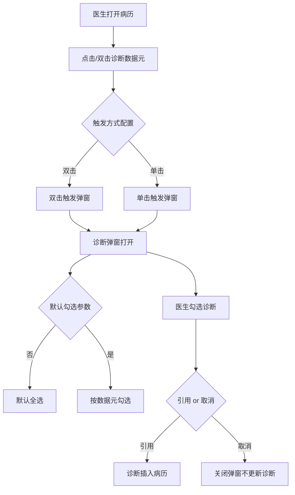

# BLGL-03-ZDYY-003 诊断引用交互 _ Analyst - Spec

> **需求编号**：BLGL-03-ZDYY-003
> **父需求**：BLGL-03-ZDYY
> **关联PM Spec**：BLGL-03-ZDYY-003_诊断引用交互_PM-spec.md
> **Spec版本**：V1.0
> **编写时间**：2026-08-15
> **编写人**：需求分析师

---

## 一、功能编号体系

### 1.1 功能层级结构

```
BLGL-03-ZDYY-003-001: 诊断弹窗打开与关闭
  ├─ BLGL-03-ZDYY-003-001-01: 诊断数据元触发弹窗
  ├─ BLGL-03-ZDYY-003-001-02: 弹窗关闭/取消按钮
  └─ BLGL-03-ZDYY-003-001-03: 弹窗关闭功能参数控制

BLGL-03-ZDYY-003-002: 诊断触发方式
  ├─ BLGL-03-ZDYY-003-002-01: 双击触发
  └─ BLGL-03-ZDYY-003-002-02: 单击触发

BLGL-03-ZDYY-003-003: 诊断弹窗勾选
  ├─ BLGL-03-ZDYY-003-003-01: 默认勾选参数控制
  └─ BLGL-03-ZDYY-003-003-02: 勾选状态传递

BLGL-03-ZDYY-003-004: 诊断弹窗界面交互
  ├─ BLGL-03-ZDYY-003-004-01: 弹窗缩放拖动
  ├─ BLGL-03-ZDYY-003-004-02: 弹窗自适应
  └─ BLGL-03-ZDYY-003-004-03: 搜索别名宽度调整

BLGL-03-ZDYY-003-005: 子诊断多级引用
  └─ BLGL-03-ZDYY-003-005-01: 子诊断/次级子诊断引用

BLGL-03-ZDYY-003-006: 模板预留诊断类型元素
  └─ BLGL-03-ZDYY-003-006-01: 预留元素双击弹控件

BLGL-03-ZDYY-003-007: 诊断弹窗临床路径校验
  └─ BLGL-03-ZDYY-003-007-01: 临床路径校验参数

BLGL-03-ZDYY-003-008: 辅助区诊断信息页签
  └─ BLGL-03-ZDYY-003-008-01: 病历辅助录入菜单添加诊断信息
```

### 1.2 功能编号表

| REQ-ID | 功能名称 | 类型 | 优先级 | 说明 |
|--------|---------|------|--------|------|
| BLGL-03-ZDYY-003-001 | 诊断弹窗打开与关闭 | 功能 | P0 | 弹窗打开/关闭/取消 |
| BLGL-03-ZDYY-003-001-01 | 诊断数据元触发弹窗 | 子功能 | P0 | 点击诊断数据元弹出诊断弹窗 |
| BLGL-03-ZDYY-003-001-02 | 弹窗关闭/取消按钮 | 子功能 | P0 | 引用旁增加取消按钮，关闭弹窗不更新诊断 |
| BLGL-03-ZDYY-003-001-03 | 弹窗关闭功能参数控制 | 子功能 | P1 | 是否启用关闭"×"按钮参数，默认启用 |
| BLGL-03-ZDYY-003-002 | 诊断触发方式 | 功能 | P1 | 双击/单击触发弹窗 |
| BLGL-03-ZDYY-003-002-01 | 双击触发 | 子功能 | P1 | 双击诊断数据元触发 |
| BLGL-03-ZDYY-003-002-02 | 单击触发 | 子功能 | P1 | 单击触发 |
| BLGL-03-ZDYY-003-003 | 诊断弹窗勾选 | 功能 | P0 | 弹窗勾选诊断与默认勾选控制 |
| BLGL-03-ZDYY-003-003-01 | 默认勾选参数控制 | 子功能 | P0 | 否=全选，是=按数据元勾选，病案首页始终全选 |
| BLGL-03-ZDYY-003-003-02 | 勾选状态传递 | 子功能 | P0 | 勾选状态正确传递，避免始终全引 |
| BLGL-03-ZDYY-003-004 | 诊断弹窗界面交互 | 功能 | P1 | 缩放/自适应/搜索宽度 |
| BLGL-03-ZDYY-003-004-01 | 弹窗缩放拖动 | 子功能 | P1 | 支持部分拖动屏幕外，最小 80px |
| BLGL-03-ZDYY-003-004-02 | 弹窗自适应 | 子功能 | P1 | 界面缩小后自适应 |
| BLGL-03-ZDYY-003-005 | 子诊断多级引用 | 功能 | P1 | 子诊断/次级子诊断多级引用 |
| BLGL-03-ZDYY-003-005-01 | 子诊断/次级子诊断引用 | 子功能 | P1 | 次级子诊断序号单独从 1 递增 |
| BLGL-03-ZDYY-003-006 | 模板预留诊断类型元素 | 功能 | P1 | 入院记录模板预留诊断类型控件 |
| BLGL-03-ZDYY-003-007 | 诊断弹窗临床路径校验 | 功能 | P1 | 诊断组件是否校验临床路径参数 |
| BLGL-03-ZDYY-003-008 | 辅助区诊断信息页签 | 功能 | P1 | 病历辅助录入菜单添加诊断信息 |

---

## 二、核心业务流程

### 2.1 诊断弹窗打开与引用主流程



### 2.2 子诊断多级引用流程

```mermaid
flowchart TD
    A[诊断组件支持录入3级子诊断] --> B[病历引用诊断]
    B --> C{诊断层级}
    C -->|一级诊断| D[主诊断展示]
    C -->|二级子诊断| E[伴发病症展示 序号1)]
    C -->|三级次级子诊断| F[次级子诊断展示 <1>]
    E --> G[序号1)从1按排列递增]
    F --> H[每个子诊断下的次级子诊断序号从1重新计算]
```


---

## 三、功能规格说明

### BLGL-03-ZDYY-003-001: 诊断弹窗打开与关闭

#### 3.1.1 功能概述

病历中弹出诊断引用界面，支持打开、勾选、引用、取消/关闭。出院记录点击诊断弹出诊断引用界面操作需优化；引用旁增加【取消】按钮；弹窗是否启用关闭"×"按钮参数化。

#### 3.1.2 用户角色

| 角色 | 使用场景 | 权限要求 | 操作频率 |
|------|---------|---------|---------|
| 住院医生 | 病历书写时打开诊断弹窗引用诊断 | 病历书写权限 | 高频 |

#### 3.1.3 业务流程（Given/When/Then）

**Scenario 1: 诊断弹窗打开并引用（主流程）**

```gherkin
Given:
  - 医生已打开病历
  - 病历中已放诊断数据元

When:
  - 医生点击/双击诊断数据元
  - 诊断弹窗打开展示诊断

Then:
  - 医生勾选所需诊断
  - 点击【引用】诊断插入病历，或点击【取消】关闭弹窗不更新诊断
```


**Scenario 2: 业务异常——弹窗无法关闭**

```gherkin
Given:
  - 诊断引用弹出框太大
  - 没有取消引用等按钮

When:
  - 医生打开弹窗

Then:
  - 弹窗无法正常关闭
  - 需增加取消/关闭按钮
```


**Scenario 3: 数据异常——关闭功能参数**

```gherkin
Given:
  - 参数"病历中诊断弹框是否启用关闭功能"=否

When:
  - 医生打开弹窗

Then:
  - 不显示关闭"×"按钮
  - 参数=是（默认）时显示"×"按钮
```


**Scenario 4: 边界——弹窗引用界面自适应**

```gherkin
Given:
  - 引用诊断界面

When:
  - 界面缩小

Then:
  - 引用界面自适应
```


#### 3.1.5 验收标准

| AC编号 | 验收标准 | 对应REQ-ID | 验证方法 | 验证场景 |
|--------|---------|-----------|---------|---------|
| AC-001 | 弹窗可打开引用，取消/关闭按钮可关闭弹窗不更新诊断 | BLGL-03-ZDYY-003-001 | 功能测试 | Scenario 1/2 |
| AC-002 | 弹窗关闭功能参数生效（是=显示×，否=不显示） | BLGL-03-ZDYY-003-001 | 功能测试 | Scenario 3 |

---

### BLGL-03-ZDYY-003-002: 诊断触发方式

#### 3.2.1 功能概述

诊断触发方式支持双击/单击。当前存在"触发方式设置为双击但双击不可触发、单击可以"及"每次都要点好多下才能打开、双击不行"的问题。

#### 3.2.2 用户角色

| 角色 | 使用场景 | 权限要求 | 操作频率 |
|------|---------|---------|---------|
| 住院医生 | 病历中触发诊断弹窗 | 病历书写权限 | 高频 |

#### 3.2.3 业务流程（Given/When/Then）

**Scenario 1: 双击触发（主流程）**

```gherkin
Given:
  - 诊断触发方式设置为双击

When:
  - 医生双击诊断数据元

Then:
  - 诊断弹窗打开
```


**Scenario 2: 异常——双击不可触发**

```gherkin
Given:
  - 诊断触发方式设置为双击
  - 但双击不可以触发，单击可以

When:
  - 医生双击诊断数据元

Then:
  - 弹窗不弹出
  - 需排查触发逻辑
```


**Scenario 3: 异常——诊断无法双击引用**

```gherkin
Given:
  - 入院记录诊断

When:
  - 医生双击诊断

Then:
  - 无法双击引用，需点多次才能打开
```


#### 3.2.5 验收标准

| AC编号 | 验收标准 | 对应REQ-ID | 验证方法 | 验证场景 |
|--------|---------|-----------|---------|---------|
| AC-003 | 触发方式配置为双击时双击触发弹窗，单击时单击触发 | BLGL-03-ZDYY-003-002 | 功能测试 | Scenario 1/2 |

---

### BLGL-03-ZDYY-003-003: 诊断弹窗勾选

#### 3.3.1 功能概述

诊断弹窗勾选诊断时，默认勾选行为由参数控制：配置为否（默认）打开后默认勾选全部诊断；配置为是打开后按数据元显示的诊断进行勾选，为空则不勾选。病案首页打开诊断弹窗始终默认全选。需修复勾选无效始终全引的问题。

#### 3.3.2 用户角色

| 角色 | 使用场景 | 权限要求 | 操作频率 |
|------|---------|---------|---------|
| 住院医生 | 弹窗中勾选诊断 | 病历书写权限 | 高频 |

#### 3.3.3 业务流程（Given/When/Then）

**Scenario 1: 默认勾选参数（主流程）**

```gherkin
Given:
  - 参数"诊断弹窗的勾选项是否按诊断数据元内容默认选择"=否（默认）

When:
  - 打开诊断弹窗

Then:
  - 默认勾选全部诊断
```


**Scenario 2: 参数为是时按数据元勾选**

```gherkin
Given:
  - 参数=是
  - 病历中诊断数据元已显示部分诊断

When:
  - 打开诊断弹窗

Then:
  - 按数据元显示的诊断勾选
  - 数据元为空则不勾选
```


**Scenario 3: 病案首页始终全选**

```gherkin
Given:
  - 病案首页打开诊断弹窗

When:
  - 打开弹窗

Then:
  - 始终默认全选
```


**Scenario 4: 异常——勾选无效始终全引**

```gherkin
Given:
  - 医生在弹窗勾选部分诊断

When:
  - 点击引用

Then:
  - 勾选无效始终全引
  - 需修复勾选状态传递
```


#### 3.3.5 验收标准

| AC编号 | 验收标准 | 对应REQ-ID | 验证方法 | 验证场景 |
|--------|---------|-----------|---------|---------|
| AC-004 | 默认勾选参数生效，病案首页始终全选 | BLGL-03-ZDYY-003-003 | 功能测试 | Scenario 1/2/3 |
| AC-005 | 勾选部分诊断后引用仅引用勾选项 | BLGL-03-ZDYY-003-003 | 功能测试 | Scenario 4 |

---

### BLGL-03-ZDYY-003-004: 诊断弹窗界面交互

#### 3.4.1 功能概述

诊断弹框、手术弹框支持部分拖动到屏幕外（方向：右侧、左侧、底部），拖动限制需留最小 80px 宽度或高度；界面缩小后引用界面需自适应；搜索别名位置宽度可调整。

#### 3.4.2 用户角色

| 角色 | 使用场景 | 权限要求 | 操作频率 |
|------|---------|---------|---------|
| 住院医生 | 病历书写时调整诊断弹窗 | 病历书写权限 | 高频 |

#### 3.4.3 业务流程（Given/When/Then）

**Scenario 1: 弹窗缩放拖动（主流程）**

```gherkin
Given:
  - 医生打开诊断弹窗

When:
  - 拖动弹窗到屏幕外

Then:
  - 支持向右/左/底部部分拖动
  - 拖动限制最小 80px 宽度或高度
```


**Scenario 2: 边界——界面缩小**

```gherkin
Given:
  - 引用诊断界面

When:
  - 界面缩小

Then:
  - 引用界面自适应
```


**Scenario 3: 边界——搜索别名宽度**

```gherkin
Given:
  - 病历书写弹窗诊断界面

When:
  - 调整搜索别名的位置

Then:
  - 宽度可以调整
```


#### 3.4.5 验收标准

| AC编号 | 验收标准 | 对应REQ-ID | 验证方法 | 验证场景 |
|--------|---------|-----------|---------|---------|
| AC-006 | 弹窗支持拖动到屏幕外且最小 80px 限制 | BLGL-03-ZDYY-003-004 | 功能测试 | Scenario 1 |
| AC-007 | 界面缩小后引用界面自适应 | BLGL-03-ZDYY-003-004 | 功能测试 | Scenario 2 |

---

### BLGL-03-ZDYY-003-005: 子诊断多级引用

#### 3.5.1 功能概述

患者诊断界面及诊断组件支持录入 3 级子诊断。主从诊断标志概念域增加次级子诊断；入院记录诊断样式配置、其他诊断样式配置增加【次级子诊断样式】配置功能。次级子诊断是子诊断（伴发病症）的下级诊断，属于西医诊断，支持引用到病历，序号单独计算，每个子诊断（伴发病症）下属的次级子诊断序号从 1 重新按排列顺序递增。子诊断要有编号 1),2)（参考海泰），伴发病症样式增加可配置项【空格+序号+")"】。

#### 3.5.2 用户角色

| 角色 | 使用场景 | 权限要求 | 操作频率 |
|------|---------|---------|---------|
| 住院医生 | 引用子诊断/次级子诊断到病历 | 病历书写权限 | 中频 |

#### 3.5.3 业务流程（Given/When/Then）

**Scenario 1: 子诊断多级引用（主流程）**

```gherkin
Given:
  - 患者诊断组件支持录入 3 级子诊断

When:
  - 病历引用诊断

Then:
  - 一级诊断（主诊断）正常展示
  - 二级子诊断（伴发病症）序号从 1 按排列递增
  - 三级次级子诊断序号在每个子诊断下从 1 重新计算
```


**Scenario 2: 边界——伴发病症样式**

```gherkin
Given:
  - 入院诊断样式配置和其他诊断样式配置的伴发病症样式增加可配置项【空格+序号+")"】

When:
  - 配置该样式后添加伴发病症/子诊断

Then:
  - 伴发病症/子诊断按【空格+序号+")"】显示（半角符号）
```


#### 3.5.5 验收标准

| AC编号 | 验收标准 | 对应REQ-ID | 验证方法 | 验证场景 |
|--------|---------|-----------|---------|---------|
| AC-008 | 子诊断/次级子诊断支持多级引用，序号按规则计算 | BLGL-03-ZDYY-003-005 | 功能测试 | Scenario 1 |

---

### BLGL-03-ZDYY-003-006: 模板预留诊断类型元素

#### 3.6.1 功能概述

入院记录模板预留诊断类型元素，将原来"右键、选择诊断类型、添加、确定"4 步优化为"系统选择对应诊断类型，确定"2 步。入院记录添加预留诊断类型元素，双击弹诊断控件指定分类，如果账号没有权限，进行提示。

#### 3.6.2 用户角色

| 角色 | 使用场景 | 权限要求 | 操作频率 |
|------|---------|---------|---------|
| 住院医生 | 入院记录模板中引用诊断 | 病历书写权限 | 中频 |

#### 3.6.3 业务流程（Given/When/Then）

**Scenario 1: 预留诊断类型元素（主流程）**

```gherkin
Given:
  - 入院记录模板已添加预留诊断类型元素

When:
  - 医生双击诊断类型元素

Then:
  - 弹出诊断控件并定位到指定分类
  - 医生选择诊断类型并确定（2 步完成）
```


**Scenario 2: 异常——无权限**

```gherkin
Given:
  - 当前账号没有对应诊断类型的权限

When:
  - 医生双击诊断类型元素

Then:
  - 提示无操作权限
```


#### 3.6.5 验收标准

| AC编号 | 验收标准 | 对应REQ-ID | 验证方法 | 验证场景 |
|--------|---------|-----------|---------|---------|
| AC-009 | 预留诊断类型元素双击弹控件指定分类，无权限提示 | BLGL-03-ZDYY-003-006 | 功能测试 | Scenario 1/2 |

---

### BLGL-03-ZDYY-003-007: 诊断弹窗临床路径校验

#### 3.7.1 功能概述

病历中调用诊断组件下诊断时，需支持是否调用临床路径接口和界面。病历业务配置→病历书写配置→功能开关新增参数"诊断组件是否校验临床路径"，选项{是，否}默认"否"。参数=否保持原逻辑不变；参数=是时调用诊断组件的入参里增加入参 cancheckcliPathRule。

#### 3.7.2 用户角色

| 角色 | 使用场景 | 权限要求 | 操作频率 |
|------|---------|---------|---------|
| 病案管理员 | 配置诊断组件是否校验临床路径 | 配置权限 | 低频 |

#### 3.7.3 业务流程（Given/When/Then）

**Scenario 1: 校验临床路径（主流程）**

```gherkin
Given:
  - 参数"诊断组件是否校验临床路径"=是

When:
  - 病历调用诊断组件下诊断

Then:
  - 诊断组件入参增加 cancheckcliPathRule
  - 触发临床路径接口和界面
```


**Scenario 2: 边界——参数为否**

```gherkin
Given:
  - 参数=否（默认）

When:
  - 病历调用诊断组件

Then:
  - 保持原逻辑不变，不触发临床路径
```


#### 3.7.5 验收标准

| AC编号 | 验收标准 | 对应REQ-ID | 验证方法 | 验证场景 |
|--------|---------|-----------|---------|---------|
| AC-010 | 参数=是时入参增加 cancheckcliPathRule 触发临床路径；=否保持原逻辑 | BLGL-03-ZDYY-003-007 | 集成测试 | Scenario 1/2 |

---

### BLGL-03-ZDYY-003-008: 辅助区诊断信息页签

#### 3.8.1 功能概述

写病历的时候引用不了诊断，要求不管是什么病历都可以引用患者的诊断。辅助助手新增"诊断信息"标签，点击显示智能标签下的诊断信息界面；病历辅助录入菜单添加诊断信息。

#### 3.8.2 用户角色

| 角色 | 使用场景 | 权限要求 | 操作频率 |
|------|---------|---------|---------|
| 住院医生 | 病历书写时在辅助区引用诊断 | 病历书写权限 | 高频 |

#### 3.8.3 业务流程（Given/When/Then）

**Scenario 1: 辅助区诊断信息（主流程）**

```gherkin
Given:
  - 医生已打开病历书写界面并展开辅助区

When:
  - 点击辅助助手"诊断信息"标签

Then:
  - 显示智能标签下的诊断信息界面
  - 可引用诊断到病历
```


#### 3.8.5 验收标准

| AC编号 | 验收标准 | 对应REQ-ID | 验证方法 | 验证场景 |
|--------|---------|-----------|---------|---------|
| AC-011 | 任意病历可在辅助区"诊断信息"页签引用诊断 | BLGL-03-ZDYY-003-008 | 功能测试 | Scenario 1 |

---

## 四、排除范围

本需求不包含以下功能项：

1. **诊断数据接入与查询**（诊断组件查询/ICD-11）—— BLGL-03-ZDYY-001
2. **诊断变更同步与提醒**（CL025 同步方式/强制同步）—— BLGL-03-ZDYY-002
3. **诊断权限与签名**（上级加签/职称比较）—— BLGL-03-ZDYY-004
4. **诊断样式显示配置**（排序/标题/序号/分隔符）—— BLGL-03-ZDYY-005
5. **诊断插入与编辑**（插入位置/序号重算）—— BLGL-03-ZDYY-007
6. **患者诊断录入/开立**（医生站诊断控件内部）—— 归医生站模块

---

## 五、业务规则清单

| 规则ID | 规则名称 | 规则描述 | 优先级 |
|--------|---------|---------|--------|
| BR-001 | 弹窗取消 | 弹窗引用左边增加【取消】按钮，点击关闭弹窗不更新诊断 | P0 |
| BR-002 | 弹窗关闭参数 | 病历中诊断弹框是否启用关闭功能，默认是启用显示"×"按钮 | P1 |
| BR-003 | 默认勾选参数 | 诊断弹窗默认勾选：否=全部，是=按数据元勾选，病案首页始终全选 | P0 |
| BR-004 | 子诊断序号 | 次级子诊断序号单独计算，每个子诊断（伴发病症）下属的次级子诊断序号从 1 递增 | P1 |
| BR-005 | 伴发病症样式 | 伴发病症样式增加可配置项【空格+序号+")"】，半角符号 | P1 |
| BR-006 | 临床路径校验 | 诊断组件是否校验临床路径参数，默认否；是时入参增加 cancheckcliPathRule | P1 |
| BR-007 | 弹窗拖动 | 诊断弹框支持部分拖动到屏幕外，最小 80px 限制 | P1 |

---

## 六、关联文档

| 文档类型 | 文档路径 | 说明 |
|---------|---------|------|
| 功能点Spec（模块级） | BLGL-03-ZDYY 诊断引用功能点Spec.md（V1.1，上级目录） | Phase 1 功能点索引 |
| PM-Spec（业务视角） | 本目录 BLGL-03-ZDYY-003_诊断引用交互_PM-spec.md（V0.1） | PM 产出的 Spec 文档 |
| Spec（研发视角） | 本目录 BLGL-03-ZDYY-003_诊断引用交互-Spec.md（V1.0） | 业务背景与目标 Spec |
| data-model.md | 待产出 | 架构师产出的数据建模文档 |
| design.md | 待产出 | 架构师产出的技术方案文档 |
| api-contract.md | 待产出 | 开发经理产出的 API 契约文档 |

---

## 七、待确认问题清单

| 编号 | 问题描述 | 缺失信息 | 影响范围 | 建议补充方 |
|--------|---------|---------|-----------|-----------|
| Q-001 | 诊断弹窗勾选/引用接口完整入参/出参 | API 契约 | -Spec 第5章 | 开发经理 |
| Q-002 | 弹窗关闭功能参数/默认勾选参数概念 ID | 概念ID | 3.1.4/3.3.4 | 产品经理 |
| Q-003 | 勾选无效始终全引的根因 | 需求分析原文缺失 | 3.3.3 Scenario 4 | 开发经理 |
| Q-004 | 诊断导入病历不全的具体场景 | 需求分析原文缺失 | 3.3.3 Scenario 4 | 需求分析师 |
| Q-005 | 性能指标（弹窗打开响应时间） | 资料区无量化指标 | -Spec 第8章 | 产品经理 |

---

## 填写检查清单

| 序号 | 检查项 | 是否完成 |
|:----:|--------|:--------:|
| 1 | 功能编号带父子层级 | ✅ |
| 2 | 每个 REQ-ID 有功能概述和用户角色 | ✅ |
| 3 | 主流程至少 1 个 Given/When/Then 场景 | ✅ |
| 4 | 异常流程至少 3 个 Given/When/Then 场景 | ✅ |
| 5 | 边界流程至少 2 个 Given/When/Then 场景 | ✅ |
| 6 | 每个 Given/When/Then 内容具体，不模糊 | ✅ |
| 7 | 数据字段定义完整（字段名、类型、必填、说明、概念ID） | ✅ |
| 8 | 验收标准 AC 编号独立，可验证 | ✅ |
| 9 | 验收标准无"功能正常"等模糊表述 | ✅ |
| 10 | 排除范围明确列出 | ✅ |
| 11 | 业务规则清单列出所有规则，每条标注来源 | ✅ |
| 12 | 流程图使用 Mermaid 格式（≥2 个） | ✅ |
| 13 | 关联文档索引包含 Phase 1 功能点Spec | ✅ |
| 14 | 待确认问题清单汇总了全文所有 ⏳ 项 | ✅ |
| 15 | 全文无占位符 `< >` 残留 | ✅ |
| 16 | 全文陈述可溯源至资料区（S1~S10 溯源核查） | ✅ |
| 17 | 人工审核确认完成 | ⏳ 待确认 |

---

**文档状态**：⬜ 待审核
**维护责任**：需求分析师规范组
**下次更新**：根据评审反馈优化

---

## 版本历史

| 版本 | 日期 | 变更说明 | 编写人 |
|------|------|---------|--------|
| V1.0 | 2026-08-15 | 初始版本 | 需求分析师 |
