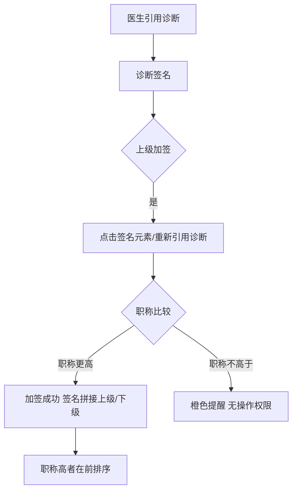
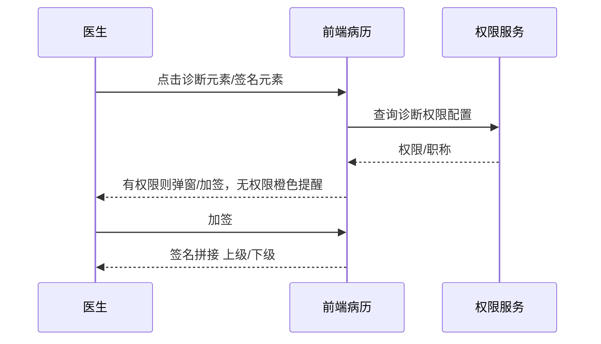

# BLGL-03-ZDYY-004 诊断权限与签名 - Spec

> **功能编号**：BLGL-03-ZDYY-004
> **文档类型**：Spec（研发视角）
> **文档版本**：V1.0
> **编写时间**：2026-08-15
> **编写人**：RACC

---

## 文档索引

#### 章节索引

**Spec（研发视角）**

| 章节号 | 章节名称 | 内容说明 |
|--------|---------|---------|
| 1、 | 文档概述 | 文档目的、文档范围、术语定义、阅读指南、参考文档 |
| 2、 | 功能背景与定位 | 功能背景、功能定位、目标用户、核心价值 |
| 3、 | 业务流程设计 | 主流程/异常流程/边界流程（Given/When/Then） |
| 4、 | 数据模型设计 | 核心数据结构、状态定义、系统参数定义 |
| 5、 | 接口契约设计 | API列表、接口详细设计、错误码定义 |
| 6、 | 技术方案设计 | 页面路径、技术栈、关键技术点、部署方案 |
| 7、 | 测试用例预设计 | 功能/边界/异常/性能测试用例 |
| 8、 | 非功能性要求 | 性能、安全、可用性、兼容性 |
| 9、 | 依赖与风险 | 外部依赖、风险项 |
| 10、 | 附录 | 流程图、时序图、参考文档 |

**PM-Spec（业务视角）**

| 章节号 | 章节名称 | 内容说明 |
|--------|---------|---------|
| 一 | 目标 | 功能定位与核心价值 |
| 二 | 约束 | 业务/技术/非功能性约束 |
| 三 | 验收标准 | 验收条件与验证方法 |
| 四 | 排除范围 | 本次不做项与明确边界 |
| 五 | 关键决策记录 | 方案决策与选型理由 |
| 六 | 优先级 | 优先级定义 |
| 七 | 关联文档 | 关联文档索引 |
| 附录 | 填写检查清单 | 质量检查 |

**Analyst-Spec（产品视角）**

| 章节号 | 章节名称 | 内容说明 |
|--------|---------|---------|
| 一 | 功能编号体系 | 功能编号与层级结构 |
| 二 | 核心业务流程 | 核心业务流程与时序 |
| 三 | 功能规格说明 | 详细功能规格与验收标准 |
| 四 | 排除范围 | 排除范围 |
| 五 | 业务规则清单 | 业务规则清单 |
| 六 | 关联文档 | 关联文档索引 |
| 七 | 待确认问题清单 | 待确认问题汇总 |
| - | 填写检查清单 | 质量检查 |

#### 版本历史

| 版本 | 日期 | 变更说明 | 编写人 |
|------|------|---------|--------|
| V1.0 | 2026-08-15 | 初始版本 | RACC |

#### 关联文档索引

| 序号 | 文档名称 | 文档类型 | 版本 | 位置 |
|------|---------|---------|------|------|
| 1 | BLGL-03-ZDYY-004_诊断权限与签名_PM-spec.md | PM-Spec（业务视角） | V0.1 | 本目录 |
| 2 | BLGL-03-ZDYY-004_诊断权限与签名_Analyst-spec.md | Analyst-Spec（产品视角） | V1.0 | 本目录 |
| 3 | BLGL-03-ZDYY-004_诊断权限与签名-Spec.md | Spec（研发视角）（本文档） | V1.0 | 本目录 |
| 4 | BLGL-03-ZDYY 诊断引用功能点Spec.md | 功能点Spec（模块级） | V1.1 | 上级目录 |
---

## 1、文档概述

### 1.1、文档目的

本文档旨在明确"诊断权限与签名"功能（BLGL-03-ZDYY-004）的业务背景与设计方案，为需求分析、研发实现、测试验收及评审提供统一的业务上下文、设计口径与决策依据。

**具体目的包括**：

1. 梳理诊断权限与签名功能的业务由来与历史需求演进脉络，说明"为什么要做"；
2. 明确功能的定位边界、目标用户与核心价值，回答"做成什么"；
3. 描述功能的业务流程、数据模型、接口契约与技术方案，回答"怎么做"；
4. 预设计测试用例并明确非功能性要求、依赖与风险，为研发与验收提供依据；
5. 作为 Analyst-Spec 的业务前提与设计输入，保证各层文档业务口径一致。

### 1.2、文档范围

#### 1.2.1 纳入范围

本文档覆盖诊断权限与签名的完整业务背景与设计，包括：

- 录入诊断权限：临床诊断录入权限控制字段（diagnosisOnlyEdit 参数）
- 诊断来源权限：诊断组件入参区分来源，护士不可编辑诊断
- 诊断类型权限：病历诊断配置-医生权限新增"初步诊断"等诊断类型
- 上级加签：确定诊断/补充诊断上级加签，职称比较
- 诊断签名：确定/补充诊断直接点击签名元素签名、记录签名人和职称
- 预制诊断权限：入院记录预制诊断元素在编辑模式可点击添加
- 签名优化：入院记录签名与打印状态联动

#### 1.2.2 排除范围

本文档不涉及以下内容（详见其他功能点或模块）：

- 诊断数据接入与查询（诊断组件查询/ICD-11）—— BLGL-03-ZDYY-001
- 诊断变更同步与提醒（CL025 同步方式）—— BLGL-03-ZDYY-002
- 诊断引用弹窗交互（勾选/关闭/触发方式）—— BLGL-03-ZDYY-003
- 诊断样式显示配置（排序/标题/序号/分隔符）—— BLGL-03-ZDYY-005
- 诊断插入与编辑（插入位置/序号重算）—— BLGL-03-ZDYY-007
- 患者诊断录入/开立（医生站诊断控件内部）—— 归医生站模块

### 1.3、术语定义

| 术语 | 定义 |
|------|------|
| diagnosisOnlyEdit | 临床诊断录入权限控制字段，病历来源传值为 true |
| 上级加签 | 下级医师引用诊断后，上级医师再次修改并引用诊断，签名拼接为"上级医师姓名/下级医师姓名" |
| 职称 | 医师上下级关系通过员工专业技术职务判断：主任医师＞副主任医师＞主治医师＞医师 |
| 诊断签名元素 | 病历中诊断的签名数据元，直接点击可签名/加签 |

### 1.4、阅读指南

- **章节关系**：第1~2章为业务全貌，第3~10章为设计实现层。与 Analyst-Spec、PM-Spec 互相引用保持一致。
- **读者对象**：产品经理/需求分析师读第1~2章；研发读第3~6、9~10章；测试读第3、7~8章；评审人员核对各层一致性。

### 1.5、参考文档

| 序号 | 文档名称 | 版本/日期 |
|------|---------|----------|
| 1 | 【历史需求】住院病历的历史需求.xlsx | - |
| 2 | BLGL-03-ZDYY-004_诊断权限与签名_PM-spec.md | V0.1 |
| 3 | BLGL-03-ZDYY-004_诊断权限与签名_Analyst-spec.md | V1.0 |
| 4 | BLGL-03-ZDYY 诊断引用功能点Spec.md | V1.1 |

---

## 2、功能背景与定位

### 2.1 功能背景

诊断权限与签名是诊断引用模块的权限与合规层，需满足：

- **现状痛点**：护士在书写护理文书时可添加/修改/删除医生站诊断，需按来源控制；病历提交后确定诊断和补充诊断添加不了；入院记录撤销提交后医生签名全部消失
- **管理要求**：确定诊断允许上级加签需参数控制，职称决定加签权限
- **历史需求演进**：确定诊断上级加签参数 CL030（需求）→ 去掉 CL030 改为统一职称比较逻辑（需求）→ 诊断签名及加签直接点击签名元素（需求）

### 2.2 功能定位

"诊断权限与签名"是 WiNEX 病历管理-诊断引用的权限与合规层，定位为：

- **权限控制**：诊断录入/来源/类型权限，医生可编辑、护士不可编辑
- **签名加签**：确定/补充诊断直接点击签名元素签名/加签，职称高者在前
- **合规保障**：加签权限职称判断，无权限橙色提醒

### 2.3 目标用户

| 用户角色 | 主要使用场景 |
|---------|-------------|
| 住院医生 | 引用诊断并签名，确定/补充诊断上级加签 |
| 上级医师 | 对下级医师已引用的确定/补充诊断加签 |
| 护士 | 书写护理文书时引用诊断（不可编辑） |

### 2.4 核心价值

| 价值维度 | 价值描述 |
|---------|---------|
| 权限合规 | 护士不可编辑医生站诊断，诊断录入权限控制 |
| 加签合规 | 职称决定加签权限，签名职称高者在前 |
| 签名稳定 | 撤销提交后签名不消失 |

---

## 3、业务流程设计（Given/When/Then）

### 3.1 主流程

**Scenario 1: 确定诊断上级加签**

```gherkin
Given:
 - 下级医师已引用确定诊断并签名
 - 上级医师职称高于下级医师

When:
 - 上级医师点击确定诊断元素重新引用诊断或点击签名元素加签

Then:
 - 上级医师可修改并引用确定诊断
 - 上级医师姓名签在下级医师签名前面，样式"上级医师姓名/下级医师姓名"
 - 加签后职称高的放在前面
```


### 3.2 异常流程

**Scenario 2: 业务异常——无加签权限**

```gherkin
Given:
 - 当前用户职称低于或等于该诊断片段的最新签名人职称

When:
 - 点击诊断片段或签名元素加签

Then:
 - 不能加签
 - 橙色提醒"该诊断上级医师已签名，无操作权限！"
 - 加签失败不更新诊断
```


**Scenario 3: 数据异常——无诊断权限**

```gherkin
Given:
 - 当前登录账号没有确定诊断的权限

When:
 - 点击确定诊断元素

Then:
 - 不弹窗
 - 提示"没有操作权限"
```


**Scenario 4: 系统异常——撤销提交后签名消失**

```gherkin
Given:
 - 入院记录已填写并签名
 - 医生撤销提交

When:
 - 撤销提交后查看入院记录

Then:
 - 医生签名全部消失（问题）
 - 需修复签名保留逻辑
```


### 3.3 边界流程

**Scenario 5: 边界——护士引用诊断不可编辑**

```gherkin
Given:
 - 护士打开护理文书（知情同意书）
 - 双击引用医生站诊断

When:
 - 护士尝试添加/修改/删除诊断

Then:
 - 护士不能编辑诊断（包含护理病历、病历协同页面）
 - 医生可以编辑诊断
```


**Scenario 6: 边界——本人删除**

```gherkin
Given:
 - 医生在入院记录预制诊断元素插入诊断并签名

When:
 - 其他医生尝试删除

Then:
 - 本人插入的诊断只有本人能够删除
 - 删除后恢复预制的样式
```


---

## 4、数据模型设计

### 4.1 核心数据结构

#### 4.1.1 核心保存请求

| 字段名 | 类型 | 必填 | 备注 |
|--------|------|------|------|
| diagnosisOnlyEdit | Boolean | 否 | 录入诊断权限控制字段，病历来源传值为 true |
| 签名人 | String | 否 | 手动插入入院记录的诊断记录签名人和签名人职称 |
| 签名人职称 | String | 否 | 诊断签名人的职称 |

> ⏳ 待确认：签名/加签接口完整字段以 API 契约为准。

#### 4.1.2 核心表/实体

| 表/实体 | 关键字段 | 说明 |
|---------|---------|------|
| INP_EMR_DIAGNOSIS | inpEmrDiagnosisRecordId、inpEmrDiagnosisTypeId、inpEmrSetId、encounterId、diagnosisTypeCode、diagnosisPriSecCode、diagnosisCode | 病历引用诊断记录表 |
| INP_EMR_DIAGNOSIS_SIGNATURE | inpEmrDiagnosisTypeId、diagnosisGroupNo、inpEmrSetId、encounterId、emrDiagnosisTypeCode、employeeId | 病历引用诊断类型记录表（含开诊断医生，来源：代码） |

### 4.2 状态定义

| ⏳ 待确认 | 状态定义 | 状态定义未在资料区中找到（打印状态见需求） |

### 4.3 系统参数定义

| 参数编码 | 参数名称 | 说明 |
|---------|---------|------|
| CL030 | 确定诊断是否允许上级加签 | 值{是，否}，默认否。需求后去掉该参数及控制效果 |
| - | 病历诊断配置-医生权限 | 诊断类型权限配置，新增"初步诊断"等 |

---

## 5、接口契约设计

### 5.1 API列表

| 序号 | API名称（代码函数） | 路径 | 方法 | 说明 |
|:----:|---------|------|:----:|------|
| 1 | 查询诊断权限配置 | /api/v1/app_record_inpatient/inp_emr_diagnostic_permission_config/query | GET | 查询诊断权限配置 |
| 2 | 根据就诊标识查询确定诊断 | /api/v1/app_record_inpatient/emr_final_diagnosis/query/by_encounter_id | POST | 确定诊断查询 |

### 5.2 接口详细设计

#### 5.2.1 查询诊断权限配置（inp_emr_diagnostic_permission_config/query）

**请求参数**:
```json
{
 "diagnosisTypeCode": "991323"
}
```

**返回值（成功）**:
```json
{
 "success": true,
 "data": {
 "doctorPermissionList": []
 }
}
```

> ⏳ 待确认：接口字段名以代码扫描和 API 契约为准。

**返回值（失败）**:
```json
{
 "success": false,
 "message": "查询诊断权限配置失败",
 "data": null
}
```

### 5.3 错误码定义

| 错误码 | 错误信息 | 处理方式 |
|--------|---------|---------|
| ⏳ 待确认 | 该诊断上级医师已签名，无操作权限！ | 橙色提醒，加签失败不更新诊断 |
| ⏳ 待确认 | 没有操作权限 | 点击诊断元素不弹窗，提示无权限 |

---

## 6、技术方案设计

### 6.1 页面路径

- **页面路径**: 住院医生站→住院病历书写界面→诊断签名元素（点击签名/加签）
- **前端逻辑**: 点击编辑器诊断数据元执行 setDiagnosisWinOpenInfo 方法弹出诊断弹窗
- **核心模块**: InpatientEmrDiagnosisController（查询诊断权限配置）

### 6.2 技术栈

| 类别 | 技术 | 版本 |
|------|------|------|
| 前端框架 | Vue | 2.6.14 |
| 前端UI | element-ui | 2.13.0 |
| 后端框架 | Spring Boot（Java 17）+ JPA/Hibernate | - |
| RPC | winning-akso-rpc-rest | - |

### 6.3 关键技术点

- 诊断组件打开时入参区分来源，医生可编辑、护士不可编辑
- 上级加签职称比较：主任医师＞副主任医师＞主治医师＞医师
- 诊断签名校验参数：CA_SIGNATURE、PICTURE_SIGNATURE、COMMON071、COMMON114、COMMON145

### 6.4 部署方案

⏳ 待确认：部署方案未在资料区中找到。

---

## 7、测试用例预设计

### 7.1 功能测试

| 用例编号 | 测试场景 | Given | When | Then |
|---------|---------|-------|------|------|
| TC-001 | 上级加签 | 下级已签名确定诊断，上级职称更高 | 上级点击签名元素加签 | 签名拼接"上级/下级"，职称高在前 |

### 7.2 边界测试

| 用例编号 | 测试场景 | Given | When | Then |
|---------|---------|-------|------|------|
| TC-002 | 护士不可编辑 | 护士打开护理文书 | 双击引用诊断 | 不能编辑诊断 |

### 7.3 异常测试

| 用例编号 | 测试场景 | Given | When | Then |
|---------|---------|-------|------|------|
| TC-003 | 无加签权限 | 当前职称不高于签名人 | 点击加签 | 橙色提醒，不更新诊断 |

### 7.4 性能测试

| 用例编号 | 测试场景 | 指标 |
|---------|---------|------|
| TC-004 | 权限查询响应 | ⏳ 待确认：性能指标未在资料区中找到 |

---

## 8、非功能性要求

### 8.1 性能要求

| 指标 | 要求 |
|------|------|
| 权限查询响应时间 | ⏳ 待确认 |

### 8.2 安全要求

| 要求 | 说明 |
|------|------|
| 权限控制 | 诊断录入权限（diagnosisOnlyEdit）、诊断类型权限、来源区分（医生/护士） |

**医疗行业特殊要求**

| 要求 | 说明 |
|------|------|
| 签名合规 | 诊断签名校验参数与正常签名一致（CA_SIGNATURE 等） |

### 8.3 可用性要求

| 指标 | 要求值 |
|------|--------|
| 可用性 | ⏳ 待确认 |

### 8.4 兼容性要求

| 类型 | 要求 |
|------|------|
| 签名兼容 | 签名删除后重新签名或加签不影响病历流程，只插入签名图片 |

---

## 9、依赖与风险

### 9.1 外部依赖

| 依赖项 | 说明 |
|--------|------|
| 员工专业技术职务 | 医师上下级关系判断依据 |
| CA签名系统 | 诊断签名校验（CA_SIGNATURE） |

### 9.2 风险项

| 风险项 | 等级 | 说明 | 应对方案 |
|--------|------|------|---------|
| 加签权限误判 | 中 | 职称判断错误影响加签 | 严格按职称比较逻辑 |
| 签名丢失 | 中 | 撤销提交后签名消失 | 修复签名保留逻辑 |

---

## 10、附录

### 10.1 流程图



### 10.2 时序图



### 10.3 参考文档

- 【历史需求】住院病历的历史需求.xlsx（需求）
- BLGL-03-ZDYY 诊断引用功能点Spec.md（V1.1，第5章 BLGL-03-ZDYY-004 行）
- 关联Spec: BLGL-03-ZDYY-004_诊断权限与签名_PM-spec.md、BLGL-03-ZDYY-004_诊断权限与签名_Analyst-spec.md

---

## 填写检查清单

| 序号 | 检查项 | 是否完成 |
|:----:|--------|:--------:|
| 1 | 章节索引与正文章节一致 | ✅ |
| 2 | 版本历史记录完整 | ✅ |
| 3 | 关联文档索引已登记全部Spec | ✅ |
| 4 | 文档目的明确回答"为什么做/做成什么/怎么做" | ✅ |
| 5 | 纳入范围/排除范围清晰 | ✅ |
| 6 | 术语定义覆盖关键概念，从资料区可溯源 | ✅ |
| 7 | 参考文档已登记 | ✅ |
| 8 | 功能背景基于法规/规范/需求来源组织 | ✅ |
| 9 | 功能定位体现业务价值（3~5个定位点） | ✅ |
| 10 | 目标用户角色覆盖完整，在需求原文中有出处 | ✅ |
| 11 | 核心价值可陈述，与 Phase 1 口径一致 | ✅ |
| 12 | 业务流程：主流程≥1、异常≥3、边界≥2，Given/When/Then 具体 | ✅ |
| 13 | 数据模型：字段/表/状态/参数可溯源 | ✅ |
| 14 | 接口契约：API列表+详细设计+错误码齐全或标记待确认 | ✅ |
| 15 | 技术方案：页面路径/技术栈/关键点/部署方案或标记待确认 | ✅ |
| 16 | 测试用例：功能/边界/异常/性能覆盖 | ✅ |
| 17 | 非功能性要求：性能/安全/可用性/兼容性指标可量化或标记待确认 | ✅ |
| 18 | 依赖与风险：外部依赖登记完整 | ✅ |
| 19 | 附录：流程图/时序图与正文流程一致 | ✅ |
| 20 | 全文无占位符 `< >` 残留 | ✅ |
| 21 | 全文陈述可溯源至资料区 | ✅ |
| 22 | 人工审核确认完成 | ⏳ 待确认 |

---

**文档状态**：⬜ 待审核
**维护责任**：RACC
**下次更新**：根据评审反馈优化
