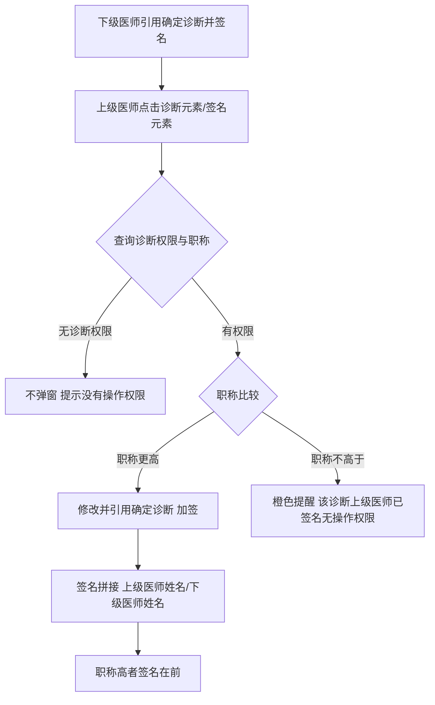
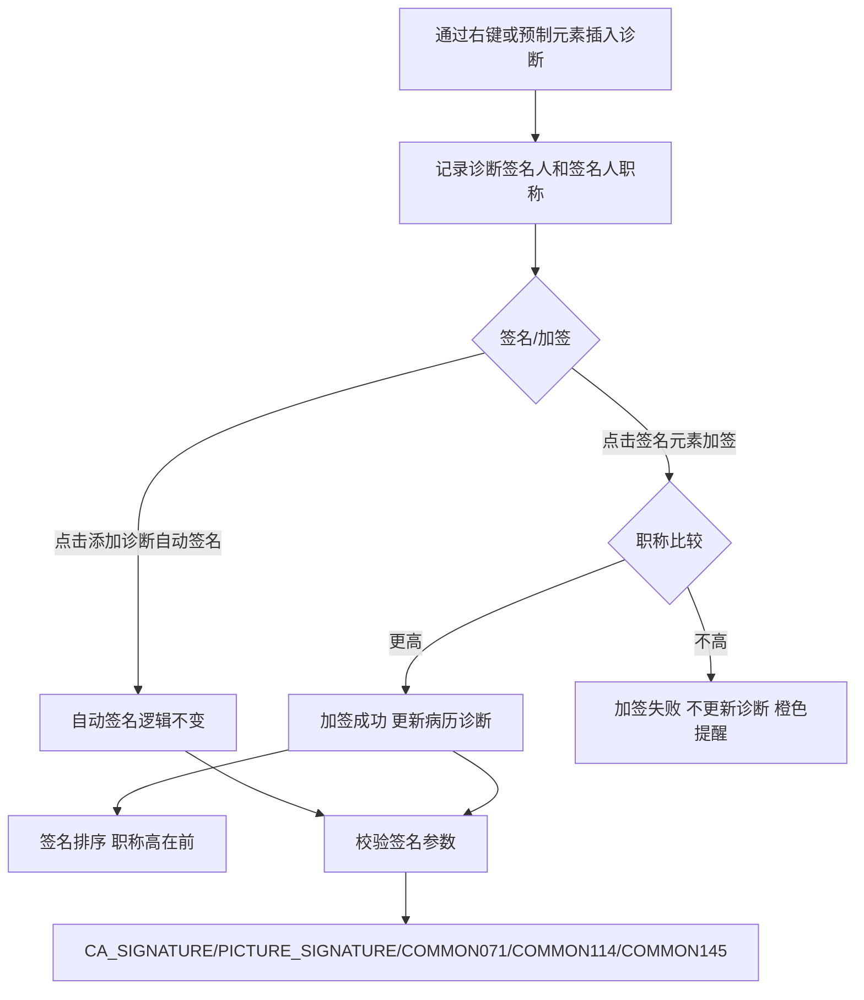

# BLGL-03-ZDYY-004 诊断权限与签名 _ Analyst - Spec

> **需求编号**：BLGL-03-ZDYY-004
> **父需求**：BLGL-03-ZDYY
> **关联PM Spec**：BLGL-03-ZDYY-004_诊断权限与签名_PM-spec.md
> **Spec版本**：V1.0
> **编写时间**：2026-08-15
> **编写人**：需求分析师

---

## 一、功能编号体系

### 1.1 功能层级结构

```
BLGL-03-ZDYY-004-001: 录入诊断权限
  ├─ BLGL-03-ZDYY-004-001-01: diagnosisOnlyEdit 参数
  └─ BLGL-03-ZDYY-004-001-02: 诊断组件来源区分（医生/护士）

BLGL-03-ZDYY-004-002: 诊断类型权限
  └─ BLGL-03-ZDYY-004-002-01: 医生诊断权限配置新增"初步诊断"

BLGL-03-ZDYY-004-003: 上级加签
  ├─ BLGL-03-ZDYY-004-003-01: 确定/补充诊断上级加签
  ├─ BLGL-03-ZDYY-004-003-02: 职称比较逻辑
  └─ BLGL-03-ZDYY-004-003-03: 无权限橙色提醒

BLGL-03-ZDYY-004-004: 诊断签名
  ├─ BLGL-03-ZDYY-004-004-01: 点击签名元素签名/加签
  ├─ BLGL-03-ZDYY-004-004-02: 记录签名人和职称
  └─ BLGL-03-ZDYY-004-004-03: 签名校验参数

BLGL-03-ZDYY-004-005: 预制诊断权限与签名优化
  ├─ BLGL-03-ZDYY-004-005-01: 预制诊断元素编辑模式点击添加
  └─ BLGL-03-ZDYY-004-005-02: 签名与打印状态联动
```

### 1.2 功能编号表

| REQ-ID | 功能名称 | 类型 | 优先级 | 说明 |
|--------|---------|------|--------|------|
| BLGL-03-ZDYY-004-001 | 录入诊断权限 | 功能 | P0 | 诊断录入权限控制 |
| BLGL-03-ZDYY-004-001-01 | diagnosisOnlyEdit 参数 | 子功能 | P0 | 病历来源传 true |
| BLGL-03-ZDYY-004-001-02 | 诊断组件来源区分 | 子功能 | P0 | 医生可编辑、护士不可编辑 |
| BLGL-03-ZDYY-004-002 | 诊断类型权限 | 功能 | P1 | 医生权限配置新增诊断类型 |
| BLGL-03-ZDYY-004-002-01 | 新增"初步诊断"权限 | 子功能 | P1 | 诊断提醒/同步只判断有权限的诊断 |
| BLGL-03-ZDYY-004-003 | 上级加签 | 功能 | P0 | 确定/补充诊断上级加签 |
| BLGL-03-ZDYY-004-003-01 | 确定/补充诊断上级加签 | 子功能 | P0 | 上级重新引用或点击签名元素加签 |
| BLGL-03-ZDYY-004-003-02 | 职称比较逻辑 | 子功能 | P0 | 职称高者可加签，低/同级不能 |
| BLGL-03-ZDYY-004-003-03 | 无权限橙色提醒 | 子功能 | P0 | 加签失败橙色提醒不更新诊断 |
| BLGL-03-ZDYY-004-004 | 诊断签名 | 功能 | P0 | 点击签名元素签名/加签 |
| BLGL-03-ZDYY-004-004-01 | 点击签名元素签名/加签 | 子功能 | P0 | 直接点击签名元素签名 |
| BLGL-03-ZDYY-004-004-02 | 记录签名人和职称 | 子功能 | P0 | 手动插入诊断记录签名人和职称 |
| BLGL-03-ZDYY-004-004-03 | 签名校验参数 | 子功能 | P1 | CA_SIGNATURE 等参数 |
| BLGL-03-ZDYY-004-005 | 预制诊断权限与签名优化 | 功能 | P1 | 预制元素点击添加、签名优化 |
| BLGL-03-ZDYY-004-005-01 | 预制诊断元素编辑模式点击添加 | 子功能 | P1 | 编辑模式点击添加诊断并签名 |
| BLGL-03-ZDYY-004-005-02 | 签名与打印状态联动 | 子功能 | P1 | 签名成功打印状态可打印 |

---

## 二、核心业务流程

### 2.1 上级加签主流程




### 2.2 诊断签名流程




---

## 三、功能规格说明

### BLGL-03-ZDYY-004-001: 录入诊断权限

#### 3.1.1 功能概述

临床诊断增加对录入诊断权限控制字段 diagnosisOnlyEdit，病历来源传固定参数给前端进行来源判断；诊断组件打开时入参区分来源，医生可以编辑诊断，护士不能编辑诊断（包含护理病历、病历协同页面）。

#### 3.1.2 用户角色

| 角色 | 使用场景 | 权限要求 | 操作频率 |
|------|---------|---------|---------|
| 住院医生 | 病历引用诊断 | 可编辑诊断 | 高频 |
| 护士 | 护理文书引用诊断 | 不可编辑诊断 | 中频 |

#### 3.1.3 业务流程（Given/When/Then）

**Scenario 1: 诊断来源权限（主流程）**

```gherkin
Given:
  - 医生/护士在病历中双击引用医生站诊断

When:
  - 诊断组件打开

Then:
  - 医生来源：可以编辑诊断
  - 护士来源（含护理病历、病历协同页面）：不能编辑诊断
```


**Scenario 2: 录入权限参数**

```gherkin
Given:
  - 病历调用诊断组件

When:
  - 传参 diagnosisOnlyEdit

Then:
  - 病历来源传值为 true
```


**Scenario 3: 数据异常——护士尝试新增诊断**

```gherkin
Given:
  - 护士打开知情同意书书写护理文书

When:
  - 双击引用诊断并尝试添加/修改/删除

Then:
  - 护士不能编辑诊断
```


#### 3.1.5 验收标准

| AC编号 | 验收标准 | 对应REQ-ID | 验证方法 | 验证场景 |
|--------|---------|-----------|---------|---------|
| AC-001 | 病历来源诊断组件传 diagnosisOnlyEdit=true | BLGL-03-ZDYY-004-001 | 集成测试 | Scenario 2 |
| AC-002 | 护士引用医生站诊断不可新增/修改/删除 | BLGL-03-ZDYY-004-001 | 功能测试 | Scenario 1/3 |

---

### BLGL-03-ZDYY-004-002: 诊断类型权限

#### 3.2.1 功能概述

病历业务配置→病历诊断配置→医生权限新增诊断类型"初步诊断"。开启诊断提醒/同步功能后，根据当前医生拥有的诊断类型权限，只判断有权限的诊断是否有内容变化，有变化就弹窗提醒，并且只同步有权限的诊断到入院记录。

#### 3.2.2 用户角色

| 角色 | 使用场景 | 权限要求 | 操作频率 |
|------|---------|---------|---------|
| 病案管理员 | 配置医生诊断权限 | 配置权限 | 低频 |

#### 3.2.3 业务流程（Given/When/Then）

**Scenario 1: 配置初步诊断权限（主流程）**

```gherkin
Given:
  - 配置人员打开病历诊断配置→医生权限

When:
  - 新增诊断类型"初步诊断"

Then:
  - 医生权限配置中可勾选"初步诊断"
```


**Scenario 2: 按权限同步诊断**

```gherkin
Given:
  - 开启诊断提醒/同步功能
  - 医生有部分诊断类型权限

When:
  - 诊断变化提醒/同步

Then:
  - 只判断有权限的诊断是否有内容变化
  - 只同步有权限的诊断到入院记录
```


#### 3.2.5 验收标准

| AC编号 | 验收标准 | 对应REQ-ID | 验证方法 | 验证场景 |
|--------|---------|-----------|---------|---------|
| AC-003 | 医生权限配置新增"初步诊断"，按权限判断/同步诊断 | BLGL-03-ZDYY-004-002 | 功能测试 | Scenario 1/2 |

---

### BLGL-03-ZDYY-004-003: 上级加签

#### 3.3.1 功能概述

下级医师引用确定诊断之后，允许上级医师再次修改并引用确定诊断，签名拼接为"上级医师姓名/下级医师姓名"。医师上下级关系通过员工专业技术职务判断（主任医师＞副主任医师＞主治医师＞医师）。比职称高就可以修改诊断片段或直接点击签名数据元加签；比职称低/同级不能加签，点击诊断片段时橙色提醒"该诊断上级医师已签名，无操作权限！"。

#### 3.3.2 用户角色

| 角色 | 使用场景 | 权限要求 | 操作频率 |
|------|---------|---------|---------|
| 上级医师 | 对下级已引用的确定/补充诊断加签 | 职称更高 | 中频 |
| 下级医师 | 引用确定/补充诊断 | 有诊断权限 | 高频 |

#### 3.3.3 业务流程（Given/When/Then）

**Scenario 1: 上级加签（主流程）**

```gherkin
Given:
  - 下级医师已引用确定诊断并签名
  - 上级医师职称高于下级医师

When:
  - 上级医师点击确定诊断元素重新引用诊断或点击签名元素加签

Then:
  - 上级医师可修改并引用确定诊断
  - 签名拼接"上级医师姓名/下级医师姓名"
  - 加签后职称高者签名在前
```


**Scenario 2: 业务异常——无加签权限**

```gherkin
Given:
  - 当前用户职称低于或等于该诊断片段最新签名人职称

When:
  - 点击诊断片段或签名元素加签

Then:
  - 不能加签
  - 橙色提醒"该诊断上级医师已签名，无操作权限！"
  - 加签失败不更新诊断
```


**Scenario 3: 业务异常——无诊断权限**

```gherkin
Given:
  - 当前登录账号没有确定诊断权限

When:
  - 点击确定诊断元素

Then:
  - 不弹窗
  - 提示"没有操作权限"
```


**Scenario 4: 边界——下级可修改**

```gherkin
Given:
  - 下级医师已引用诊断
  - 上级医师未签名

When:
  - 下级医师修改确定诊断

Then:
  - 下级医师可以一直修改确定诊断
```


**Scenario 5: 边界——上级签名后下级不可编辑**

```gherkin
Given:
  - 上级医师已修改并引用诊断

When:
  - 下级医师继续编辑确定诊断

Then:
  - 下级医师不可继续编辑
  - 只有上级医师本人及更高一级医师可编辑
```


#### 3.3.5 验收标准

| AC编号 | 验收标准 | 对应REQ-ID | 验证方法 | 验证场景 |
|--------|---------|-----------|---------|---------|
| AC-004 | 上级加签成功签名拼接"上级/下级"，职称高者在前 | BLGL-03-ZDYY-004-003 | 功能测试 | Scenario 1 |
| AC-005 | 职称不高于签名人时加签失败，橙色提醒且不更新诊断 | BLGL-03-ZDYY-004-003 | 功能测试 | Scenario 2 |
| AC-006 | 无诊断权限点击不弹窗提示"没有操作权限" | BLGL-03-ZDYY-004-003 | 功能测试 | Scenario 3 |
| AC-007 | 上级签名后下级不可继续编辑 | BLGL-03-ZDYY-004-003 | 功能测试 | Scenario 5 |

---

### BLGL-03-ZDYY-004-004: 诊断签名

#### 3.4.1 功能概述

确定诊断、补充诊断签名及加签修改成直接点击签名元素签名。通过右键或病历上预制元素插入的诊断的医生签名元素概念 ID 与正常数据元不同，处理如下：点击添加诊断自动签名的逻辑不变；手动插入入院记录的这些诊断需要记录诊断的签名人和签名人职称；上级弹窗修改诊断或直接点击签名元素可加签；加签后签名排序职称高在前；诊断签名校验参数与正常签名一致（CA_SIGNATURE、PICTURE_SIGNATURE、COMMON071、COMMON114、COMMON145）。

#### 3.4.2 用户角色

| 角色 | 使用场景 | 权限要求 | 操作频率 |
|------|---------|---------|---------|
| 住院医生 | 引用诊断后签名 | 病历书写权限 | 高频 |
| 上级医师 | 点击签名元素加签 | 职称更高 | 中频 |

#### 3.4.3 业务流程（Given/When/Then）

**Scenario 1: 点击签名元素签名（主流程）**

```gherkin
Given:
  - 病历中已插入确定/补充诊断
  - 医生签名元素已放置

When:
  - 医生点击签名元素

Then:
  - 签名成功，只插入签名图片
  - 签名删除后重新签名/加签不影响病历流程
```


**Scenario 2: 记录签名人和职称**

```gherkin
Given:
  - 手动插入入院记录诊断

When:
  - 插入诊断片段

Then:
  - 记录诊断的签名人和签名人职称
```


**Scenario 3: 签名校验参数**

```gherkin
Given:
  - 医生点击签名元素签名

When:
  - 签名校验

Then:
  - 校验参数与正常签名一致（CA_SIGNATURE、PICTURE_SIGNATURE、COMMON071、COMMON114、COMMON145）
```


#### 3.4.5 验收标准

| AC编号 | 验收标准 | 对应REQ-ID | 验证方法 | 验证场景 |
|--------|---------|-----------|---------|---------|
| AC-008 | 点击签名元素可签名/加签，重新签名不影响病历流程 | BLGL-03-ZDYY-004-004 | 功能测试 | Scenario 1 |
| AC-009 | 手动插入诊断记录签名人和职称 | BLGL-03-ZDYY-004-004 | 功能测试 | Scenario 2 |
| AC-010 | 诊断签名校验参数与正常签名一致 | BLGL-03-ZDYY-004-004 | 集成测试 | Scenario 3 |

---

### BLGL-03-ZDYY-004-005: 预制诊断权限与签名优化

#### 3.5.1 功能概述

入院记录预制诊断元素在编辑模式下就可以点击添加诊断，弹出诊断窗口，插入诊断并签名；本人插入的诊断只有本人能够删除，删除后恢复预制的样式。入院记录签名优化：在初步诊断已签名保存后，点击确定/补充诊断签名元素签名成功时打印状态改成可打印，否则不可打印。

#### 3.5.2 用户角色

| 角色 | 使用场景 | 权限要求 | 操作频率 |
|------|---------|---------|---------|
| 住院医生 | 入院记录预制诊断元素点击添加 | 病历书写权限 | 高频 |

#### 3.5.3 业务流程（Given/When/Then）

**Scenario 1: 预制诊断元素点击添加（主流程）**

```gherkin
Given:
  - 入院记录模板已预制诊断元素
  - 病历已提交

When:
  - 医生在编辑模式点击预制诊断元素

Then:
  - 弹出诊断窗口
  - 插入诊断并签名
```


**Scenario 2: 本人删除**

```gherkin
Given:
  - 医生已插入诊断并签名

When:
  - 其他医生尝试删除

Then:
  - 本人插入的诊断只有本人能够删除
  - 删除后恢复预制的样式
```


**Scenario 3: 签名与打印状态联动**

```gherkin
Given:
  - 入院记录已提交
  - 初步诊断已签名保存

When:
  - 医生点击确定/补充诊断签名元素

Then:
  - 签名成功→打印状态可打印
  - 签名不成功→打印状态不可打印
```


#### 3.5.5 验收标准

| AC编号 | 验收标准 | 对应REQ-ID | 验证方法 | 验证场景 |
|--------|---------|-----------|---------|---------|
| AC-011 | 编辑模式点击预制诊断元素可添加诊断并签名，本人诊断本人删 | BLGL-03-ZDYY-004-005 | 功能测试 | Scenario 1/2 |
| AC-012 | 签名成功打印状态可打印，不成功不可打印 | BLGL-03-ZDYY-004-005 | 功能测试 | Scenario 3 |

---

## 四、排除范围

本需求不包含以下功能项：

1. **诊断数据接入与查询**（诊断组件查询/ICD-11）—— BLGL-03-ZDYY-001
2. **诊断变更同步与提醒**（CL025 同步方式/强制同步）—— BLGL-03-ZDYY-002
3. **诊断引用弹窗交互**（勾选/关闭/触发方式）—— BLGL-03-ZDYY-003
4. **诊断样式显示配置**（排序/标题/序号/分隔符）—— BLGL-03-ZDYY-005
5. **诊断插入与编辑**（插入位置/序号重算）—— BLGL-03-ZDYY-007
6. **患者诊断录入/开立**（医生站诊断控件内部）—— 归医生站模块

---

## 五、业务规则清单

| 规则ID | 规则名称 | 规则描述 | 优先级 |
|--------|---------|---------|--------|
| BR-001 | 录入权限参数 | 临床诊断录入权限控制字段 diagnosisOnlyEdit，病历来源传 true | P0 |
| BR-002 | 来源权限 | 诊断组件入参区分来源，医生可编辑、护士不能编辑（含护理病历、病历协同） | P0 |
| BR-003 | 职称等级 | 医师上下级关系通过员工专业技术职务判断：主任医师＞副主任医师＞主治医师＞医师 | P0 |
| BR-004 | 加签规则 | 职称更高可修改诊断片段或点击签名元素加签，低/同级不能 | P0 |
| BR-005 | 加签提醒 | 加签失败橙色提醒"该诊断上级医师已签名，无操作权限！"，不更新诊断 | P0 |
| BR-006 | 签名排序 | 加签后签名排序职称高者放在前面 | P0 |
| BR-007 | 签名校验 | 诊断签名校验参数与正常签名一致（CA_SIGNATURE、PICTURE_SIGNATURE、COMMON071、COMMON114、COMMON145） | P1 |
| BR-008 | 本人删除 | 本人插入的诊断只有本人能够删除，删除后恢复预制样式 | P1 |
| BR-009 | 打印状态 | 确定/补充诊断签名成功打印状态可打印，不成功不可打印 | P1 |

---

## 六、关联文档

| 文档类型 | 文档路径 | 说明 |
|---------|---------|------|
| 功能点Spec（模块级） | BLGL-03-ZDYY 诊断引用功能点Spec.md（V1.1，上级目录） | Phase 1 功能点索引 |
| PM-Spec（业务视角） | 本目录 BLGL-03-ZDYY-004_诊断权限与签名_PM-spec.md（V0.1） | PM 产出的 Spec 文档 |
| Spec（研发视角） | 本目录 BLGL-03-ZDYY-004_诊断权限与签名-Spec.md（V1.0） | 业务背景与目标 Spec |
| data-model.md | 待产出 | 架构师产出的数据建模文档 |
| design.md | 待产出 | 架构师产出的技术方案文档 |
| api-contract.md | 待产出 | 开发经理产出的 API 契约文档 |

---

## 七、待确认问题清单

| 编号 | 问题描述 | 缺失信息 | 影响范围 | 建议补充方 |
|------|---------|---------|---------|-----------|
| Q-001 | 签名/加签接口完整入参/出参 | API 契约 | -Spec 第5章 | 开发经理 |
| Q-002 | 诊断权限配置接口字段（doctorPermissionList）完整定义 | API 契约 | 3.2.4 | 开发经理 |
| Q-003 | 签名元素概念 ID | 概念ID | 3.4.4 | 产品经理 |
| Q-004 | 撤销提交后签名消失的根因 | 需求分析原文缺失 | 3.2.3 | 开发经理 |
| Q-005 | 性能指标（权限查询响应时间） | 资料区无量化指标 | -Spec 第8章 | 产品经理 |

---

## 填写检查清单

| 序号 | 检查项 | 是否完成 |
|:----:|--------|:--------:|
| 1 | 功能编号带父子层级 | ✅ |
| 2 | 每个 REQ-ID 有功能概述和用户角色 | ✅ |
| 3 | 主流程至少 1 个 Given/When/Then 场景 | ✅ |
| 4 | 异常流程至少 3 个 Given/When/Then 场景 | ✅ |
| 5 | 边界流程至少 2 个 Given/When/Then 场景 | ✅ |
| 6 | 每个 Given/When/Then 内容具体，不模糊 | ✅ |
| 7 | 数据字段定义完整（字段名、类型、必填、说明、概念ID） | ✅ |
| 8 | 验收标准 AC 编号独立，可验证 | ✅ |
| 9 | 验收标准无"功能正常"等模糊表述 | ✅ |
| 10 | 排除范围明确列出 | ✅ |
| 11 | 业务规则清单列出所有规则，每条标注来源 | ✅ |
| 12 | 流程图使用 Mermaid 格式（≥2 个） | ✅ |
| 13 | 关联文档索引包含 Phase 1 功能点Spec | ✅ |
| 14 | 待确认问题清单汇总了全文所有 ⏳ 项 | ✅ |
| 15 | 全文无占位符 `< >` 残留 | ✅ |
| 16 | 全文陈述可溯源至资料区（S1~S10 溯源核查） | ✅ |
| 17 | 人工审核确认完成 | ⏳ 待确认 |

---

**文档状态**：⬜ 待审核
**维护责任**：需求分析师规范组
**下次更新**：根据评审反馈优化

---

## 版本历史

| 版本 | 日期 | 变更说明 | 编写人 |
|------|------|---------|--------|
| V1.0 | 2026-08-15 | 初始版本 | 需求分析师 |
