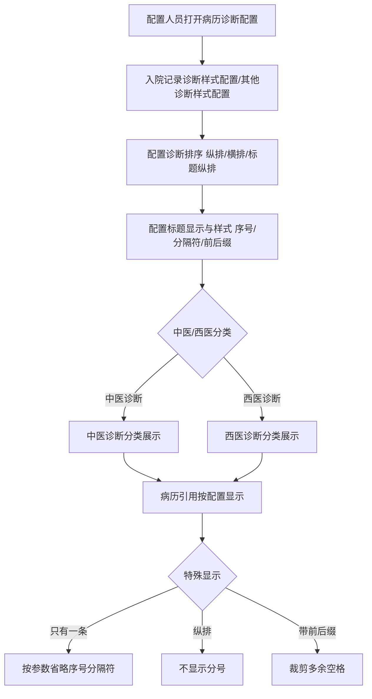
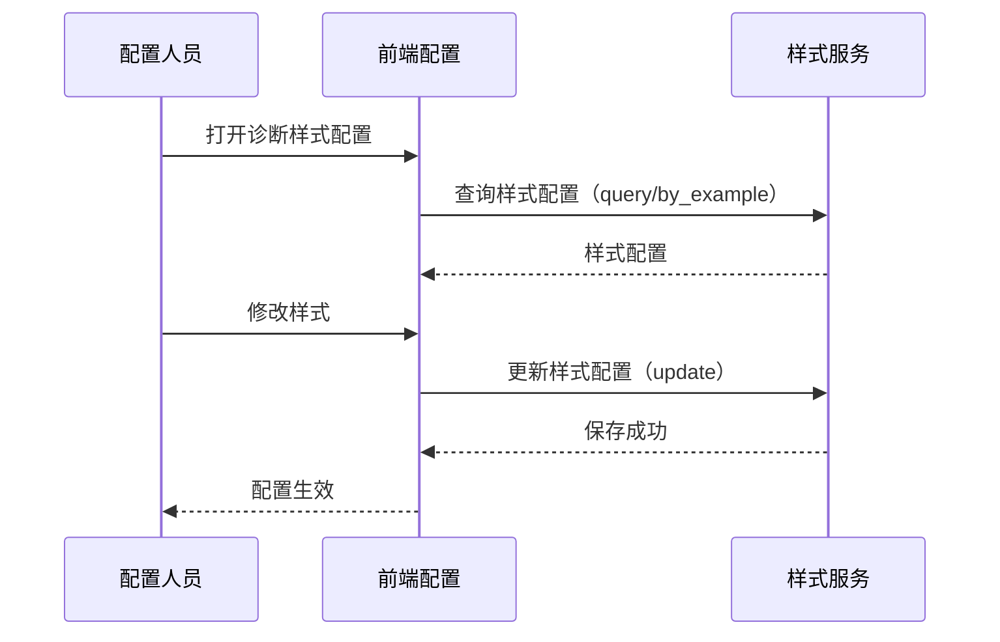

# BLGL-03-ZDYY-005 诊断样式与显示配置 - Spec

> **功能编号**：BLGL-03-ZDYY-005
> **文档类型**：Spec（研发视角）
> **文档版本**：V1.0
> **编写时间**：2026-08-15
> **编写人**：RACC

---

## 文档索引

#### 章节索引

**Spec（研发视角）**

| 章节号 | 章节名称 | 内容说明 |
|--------|---------|---------|
| 1、 | 文档概述 | 文档目的、文档范围、术语定义、阅读指南、参考文档 |
| 2、 | 功能背景与定位 | 功能背景、功能定位、目标用户、核心价值 |
| 3、 | 业务流程设计 | 主流程/异常流程/边界流程（Given/When/Then） |
| 4、 | 数据模型设计 | 核心数据结构、状态定义、系统参数定义 |
| 5、 | 接口契约设计 | API列表、接口详细设计、错误码定义 |
| 6、 | 技术方案设计 | 页面路径、技术栈、关键技术点、部署方案 |
| 7、 | 测试用例预设计 | 功能/边界/异常/性能测试用例 |
| 8、 | 非功能性要求 | 性能、安全、可用性、兼容性 |
| 9、 | 依赖与风险 | 外部依赖、风险项 |
| 10、 | 附录 | 流程图、时序图、参考文档 |

**PM-Spec（业务视角）**

| 章节号 | 章节名称 | 内容说明 |
|--------|---------|---------|
| 一 | 目标 | 功能定位与核心价值 |
| 二 | 约束 | 业务/技术/非功能性约束 |
| 三 | 验收标准 | 验收条件与验证方法 |
| 四 | 排除范围 | 本次不做项与明确边界 |
| 五 | 关键决策记录 | 方案决策与选型理由 |
| 六 | 优先级 | 优先级定义 |
| 七 | 关联文档 | 关联文档索引 |
| 附录 | 填写检查清单 | 质量检查 |

**Analyst-Spec（产品视角）**

| 章节号 | 章节名称 | 内容说明 |
|--------|---------|---------|
| 一 | 功能编号体系 | 功能编号与层级结构 |
| 二 | 核心业务流程 | 核心业务流程与时序 |
| 三 | 功能规格说明 | 详细功能规格与验收标准 |
| 四 | 排除范围 | 排除范围 |
| 五 | 业务规则清单 | 业务规则清单 |
| 六 | 关联文档 | 关联文档索引 |
| 七 | 待确认问题清单 | 待确认问题汇总 |
| - | 填写检查清单 | 质量检查 |

#### 版本历史

| 版本 | 日期 | 变更说明 | 编写人 |
|------|------|---------|--------|
| V1.0 | 2026-08-15 | 初始版本 | RACC |

#### 关联文档索引

| 序号 | 文档名称 | 文档类型 | 版本 | 位置 |
|------|---------|---------|------|------|
| 1 | BLGL-03-ZDYY-005_诊断样式与显示配置_PM-spec.md | PM-Spec（业务视角） | V0.1 | 本目录 |
| 2 | BLGL-03-ZDYY-005_诊断样式与显示配置_Analyst-spec.md | Analyst-Spec（产品视角） | V1.0 | 本目录 |
| 3 | BLGL-03-ZDYY-005_诊断样式与显示配置-Spec.md | Spec（研发视角）（本文档） | V1.0 | 本目录 |
| 4 | BLGL-03-ZDYY 诊断引用功能点Spec.md | 功能点Spec（模块级） | V1.1 | 上级目录 |
---

## 1、文档概述

### 1.1、文档目的

本文档旨在明确"诊断样式与显示配置"功能（BLGL-03-ZDYY-005）的业务背景与设计方案，为需求分析、研发实现、测试验收及评审提供统一的业务上下文、设计口径与决策依据。

**具体目的包括**：

1. 梳理诊断样式与显示配置功能的业务由来与历史需求演进脉络，说明"为什么要做"；
2. 明确功能的定位边界、目标用户与核心价值，回答"做成什么"；
3. 描述功能的业务流程、数据模型、接口契约与技术方案，回答"怎么做"；
4. 预设计测试用例并明确非功能性要求、依赖与风险，为研发与验收提供依据；
5. 作为 Analyst-Spec 的业务前提与设计输入，保证各层文档业务口径一致。

### 1.2、文档范围

#### 1.2.1 纳入范围

本文档覆盖诊断样式与显示配置的完整业务背景与设计，包括：

- 入院记录/其他诊断样式配置：诊断排序、标题显示、样式配置
- 其他诊断样式配置扩展：新增入院/出院诊断、初步诊断、门诊诊断
- 中医/西医分类展示：中医症候样式、中西医排序（CL036）
- 诊断名称显示配置：中西医诊断只有一条时是否省略序号及分隔符
- 诊断显示格式：纵排不显示分号、前后缀空格裁剪、序号显示

#### 1.2.2 排除范围

本文档不涉及以下内容（详见其他功能点或模块）：

- 诊断数据接入与查询（诊断组件查询/ICD-11）—— BLGL-03-ZDYY-001
- 诊断变更同步与提醒（CL025 同步方式）—— BLGL-03-ZDYY-002
- 诊断引用弹窗交互（勾选/关闭/触发方式）—— BLGL-03-ZDYY-003
- 诊断权限与签名（上级加签/职称比较）—— BLGL-03-ZDYY-004
- 诊断类型引用（跨类别引用/去重/状态过滤）—— BLGL-03-ZDYY-006
- 诊断插入与编辑（插入位置/序号重算）—— BLGL-03-ZDYY-007
- 诊断日期取值设置（引入时间/下达时间）—— BLGL-03-ZDYY-008

### 1.3、术语定义

| 术语 | 定义 |
|------|------|
| 入院记录诊断样式配置 | 病历诊断配置下入院记录的诊断样式配置（诊断排序/标题显示/样式配置） |
| 其他诊断样式配置 | 病历诊断配置下其他文书（除入院记录外）的诊断样式配置 |
| 诊断排序 | 诊断在病历中的排列方式：纵排、横排、标题纵排 |
| CL036 | 病历中中医诊断和西医诊断的排序参数 |
| 伴发病症 | 主诊断下的下级诊断 |

### 1.4、阅读指南

- **章节关系**：第1~2章为业务全貌，第3~10章为设计实现层。与 Analyst-Spec、PM-Spec 互相引用保持一致。
- **读者对象**：产品经理/需求分析师读第1~2章；研发读第3~6、9~10章；测试读第3、7~8章；评审人员核对各层一致性。

### 1.5、参考文档

| 序号 | 文档名称 | 版本/日期 |
|------|---------|----------|
| 1 | 【历史需求】住院病历的历史需求.xlsx | - |
| 2 | BLGL-03-ZDYY-005_诊断样式与显示配置_PM-spec.md | V0.1 |
| 3 | BLGL-03-ZDYY-005_诊断样式与显示配置_Analyst-spec.md | V1.0 |
| 4 | BLGL-03-ZDYY 诊断引用功能点Spec.md | V1.1 |

---

## 2、功能背景与定位

### 2.1 功能背景

诊断样式与显示配置是诊断引用模块的呈现层，需满足：

- **现状痛点**：病历引用患者诊断后纵排显示后面都会有分号；有前后缀的诊断引用后都多了个空格；中西医同名诊断不能导入病程
- **管理要求**：中医诊断症候显示样式需新增（示例：腰痛（肾虚寒湿））；出院小结模板上入、出院诊断横排加序号、分号隔断
- **历史需求演进**：中医症候样式配置（需求）→ 中西医诊断排序（需求）→ 名称显示配置（需求）→ 其他诊断样式配置扩展入院/出院/门诊诊断（需求）

### 2.2 功能定位

"诊断样式与显示配置"是 WiNEX 病历管理-诊断引用的呈现层，定位为：

- **样式配置**：入院记录/其他诊断样式配置，控制诊断排序/标题/序号/分隔符
- **分类展示**：中医/西医分类展示与排序
- **格式合规**：前后缀空格裁剪、纵排分号处理等显示格式

### 2.3 目标用户

| 用户角色 | 主要使用场景 |
|---------|-------------|
| 病案管理员 | 配置病历诊断样式（入院记录/其他诊断样式） |
| 住院医生 | 病历中查看引用诊断的显示效果 |

### 2.4 核心价值

| 价值维度 | 价值描述 |
|---------|---------|
| 样式一致 | 诊断样式按配置统一显示，中医/西医分类 |
| 质控合规 | 前后缀空格裁剪、格式紧密连接符合病历质控规范 |
| 院方定制 | 出院小结等文书入/出院诊断样式可按院方要求配置 |

---

## 3、业务流程设计（Given/When/Then）

### 3.1 主流程

**Scenario 1: 诊断样式配置生效**

```gherkin
Given:
 - 配置人员已打开病历业务配置→病历诊断配置→入院记录诊断样式配置/其他诊断样式配置

When:
 - 配置诊断排序（纵排/横排/标题纵排）
 - 配置标题显示、样式配置（序号/分隔符/前后缀）

Then:
 - 病历中引用诊断按配置样式显示
 - 中医/西医诊断按分类展示
```


### 3.2 异常流程

**Scenario 2: 业务异常——诊断样式未配置**

```gherkin
Given:
 - 其他文书引用入院/出院诊断
 - 其他诊断样式配置未新增入院/出院诊断类型

When:
 - 病历引用入院/出院诊断

Then:
 - 无对应样式配置，显示异常或按默认样式
 - 需在其他诊断样式配置新增入院/出院诊断类型
```

**Scenario 3: 数据异常——前后缀多余空格**

```gherkin
Given:
 - 诊断带前后缀（如"急性"+"阑尾炎"+"伴化脓性"）
 - 拼接逻辑自动插入多余空格

When:
 - 病历引用诊断

Then:
 - 显示"急性阑尾炎 伴化脓性"而非"急性阑尾炎伴化脓性"
 - 需去除诊断名称与前后缀之间多余空格
```


**Scenario 4: 系统异常——排列方式配置失效**

```gherkin
Given:
 - 知识文档排列方式设置为横向排序

When:
 - 病历展示诊断

Then:
 - 实际变为竖向排序（问题）
 - 需修复排列方式配置
```


### 3.3 边界流程

**Scenario 5: 边界——中西医诊断只有一条**

```gherkin
Given:
 - 参数"中西医诊断只有一条时，是否省略序号以及分隔符"=是

When:
 - 病历引用仅一条中医/西医诊断

Then:
 - 省略配置的序号及【诊断内容】前面的点、顿号、英文右括号、中文右括号
 - 参数=否（默认）时完全按配置显示
```


**Scenario 6: 边界——纵排显示分号**

```gherkin
Given:
 - 诊断设置为纵排或者标题纵排

When:
 - 病历引用诊断（模板预制元素/右键插入）

Then:
 - 诊断不需要符号分隔（不显示分号）
```


---

## 4、数据模型设计

### 4.1 核心数据结构

#### 4.1.1 核心保存请求

| 字段名 | 类型 | 必填 | 备注 |
|--------|------|------|------|
| 诊断排序 | String | 否 | 纵排/横排/标题纵排 |
| 标题显示 | String | 否 | 输入框，支持样式（加粗/斜体/下划线） |
| 诊断类型 | String | 否 | 入院诊断/出院诊断/初步诊断/门诊诊断等 |
| 伴发病症样式 | String | 否 | 【空格+序号+")"】等 |

> ⏳ 待确认：样式配置接口完整字段以代码扫描（inp_emr_diagnostic_style_config/update）和 API 契约为准。

#### 4.1.2 核心表/实体

| 表/实体 | 关键字段 | 说明 |
|---------|---------|------|
| INP_EMR_DIAGNOSIS | inpEmrDiagnosisRecordId、inpEmrDiagnosisTypeId、inpEmrSetId、encounterId、diagnosisTypeCode、diagnosisPriSecCode、diagnosisCode | 病历引用诊断记录表 |
| INPATIENT_RHB_DIAGNOSIS | inpatientRhbDiagnosisId、inpRhbRecordId、encounterId、patientEncounterDiagnosisId、diagnosisTypeCode、diagnosisDesc、diagnosisPrefixName、diagnosisSuffixName | 住院病历患者就诊主诊断表（含前后缀，来源：代码） |

### 4.2 状态定义

| ⏳ 待确认 | 状态定义 | 状态定义未在资料区中找到 |

### 4.3 系统参数定义

| 参数编码 | 参数名称 | 说明 |
|---------|---------|------|
| CL036 | 病历中中医诊断和西医诊断的排序 | 1=中医诊断在前、西医诊断在后；2=西医诊断在前、中医诊断在后 |
| - | 中西医诊断只有一条时，是否省略序号以及分隔符 | 值{是，否}，默认否 |

---

## 5、接口契约设计

### 5.1 API列表

| 序号 | API名称（代码函数） | 路径 | 方法 | 说明 |
|:----:|---------|------|:----:|------|
| 1 | 查询诊断样式配置 | /api/v1/app_record_inpatient/inp_emr_diagnostic_style_config/query/by_example | GET | 查询诊断样式配置 |
| 2 | 更新诊断样式配置 | /api/v1/app_record_mdm/inp_emr_diagnostic_style_config/update | POST | 保存诊断样式配置 |
| 3 | 查询诊断取值配置 | /api/v1/app_record_inpatient/inpatient_record_emr/query_emr_diagnosis_default_value/by_example | GET | 查询诊断取值配置 |

### 5.2 接口详细设计

#### 5.2.1 更新诊断样式配置（inp_emr_diagnostic_style_config/update）

**请求参数**:
```json
{
 "diagTitleNameStyle": null,
 "sameLineFlag": "98175",
 "diagnosticTypeCode": "991323",
 "enabledFlag": 98360,
 "inpatDiagContentStyleId": "1859026778064325812"
}
```

**返回值（成功）**:
```json
{
 "success": true,
 "data": null
}
```

> ⏳ 待确认：样式配置接口字段以需求开发者设计和 API 契约为准。

**返回值（失败）**:
```json
{
 "success": false,
 "message": "更新诊断样式配置失败",
 "data": null
}
```

### 5.3 错误码定义

| 错误码 | 错误信息 | 处理方式 |
|--------|---------|---------|
| ⏳ 待确认 | 样式配置保存失败 | 提示配置人员重新保存 |

---

## 6、技术方案设计

### 6.1 页面路径

- **页面路径**: 病历业务配置→病历诊断配置→入院记录诊断样式配置/其他诊断样式配置
- **后端接口**: InpatientEmrDiagnosisController（查询诊断样式配置）、诊断样式配置更新接口
- **编辑器**: 诊断数据元自定义属性配置（CL036），由编辑器（孙敏）支持

### 6.2 技术栈

| 类别 | 技术 | 版本 |
|------|------|------|
| 前端框架 | Vue | 2.6.14 |
| 前端UI | element-ui | 2.13.0 |
| 后端框架 | Spring Boot（Java 17）+ JPA/Hibernate | - |
| RPC | winning-akso-rpc-rest | - |

### 6.3 关键技术点

- 编辑器诊断数据元增加自定义属性配置（CL036），诊断引入病历时判断自定义属性控制中西医排序
- 诊断样式配置接口保存字段：diagTitleNameStyle、sameLineFlag、diagnosticTypeCode、enabledFlag、inpatDiagContentStyleId
- 前端拼接诊断前缀/名称/后缀时裁剪空格，后端返回 trim 处理

### 6.4 部署方案

⏳ 待确认：部署方案未在资料区中找到。

---

## 7、测试用例预设计

### 7.1 功能测试

| 用例编号 | 测试场景 | Given | When | Then |
|---------|---------|-------|------|------|
| TC-001 | 诊断样式配置生效 | 配置诊断排序=横排 | 病历引用诊断 | 按横排样式显示 |

### 7.2 边界测试

| 用例编号 | 测试场景 | Given | When | Then |
|---------|---------|-------|------|------|
| TC-002 | 中西医诊断只有一条 | 参数=是 | 引用一条中医诊断 | 省略序号及分隔符 |

### 7.3 异常测试

| 用例编号 | 测试场景 | Given | When | Then |
|---------|---------|-------|------|------|
| TC-003 | 前后缀多余空格 | 诊断带前后缀 | 病历引用 | 无多余空格，紧密连接 |

### 7.4 性能测试

| 用例编号 | 测试场景 | 指标 |
|---------|---------|------|
| TC-004 | 样式配置查询响应 | ⏳ 待确认：性能指标未在资料区中找到 |

---

## 8、非功能性要求

### 8.1 性能要求

| 指标 | 要求 |
|------|------|
| 样式配置查询响应时间 | ⏳ 待确认 |

### 8.2 安全要求

| 要求 | 说明 |
|------|------|
| 配置权限 | 诊断样式配置需配置权限（病案管理员） |

**医疗行业特殊要求**

| 要求 | 说明 |
|------|------|
| 质控规范 | 诊断格式紧密连接符合病历质控规范 |

### 8.3 可用性要求

| 指标 | 要求值 |
|------|--------|
| 可用性 | ⏳ 待确认 |

### 8.4 兼容性要求

| 类型 | 要求 |
|------|------|
| 诊断类型 | 其他诊断样式配置新增入院/出院/初步/门诊诊断 |
| 排列方式 | 横向排序配置需生效，不能变为竖向 |

---

## 9、依赖与风险

### 9.1 外部依赖

| 依赖项 | 说明 |
|--------|------|
| 编辑器 | 诊断数据元自定义属性配置（CL036） |

### 9.2 风险项

| 风险项 | 等级 | 说明 | 应对方案 |
|--------|------|------|---------|
| 样式配置复杂 | 中 | 样式配置项多（排序/标题/序号/分隔符/前后缀）易配置错误 | 提供配置说明与校验 |
| 前后缀空格 | 中 | 前后缀空格影响诊断显示合规 | 前端裁剪+后端 trim 双修复 |

---

## 10、附录

### 10.1 流程图



### 10.2 时序图



### 10.3 参考文档

- 【历史需求】住院病历的历史需求.xlsx（需求）
- BLGL-03-ZDYY 诊断引用功能点Spec.md（V1.1，第5章 BLGL-03-ZDYY-005 行）
- 关联Spec: BLGL-03-ZDYY-005_诊断样式与显示配置_PM-spec.md、BLGL-03-ZDYY-005_诊断样式与显示配置_Analyst-spec.md

---

## 填写检查清单

| 序号 | 检查项 | 是否完成 |
|:----:|--------|:--------:|
| 1 | 章节索引与正文章节一致 | ✅ |
| 2 | 版本历史记录完整 | ✅ |
| 3 | 关联文档索引已登记全部Spec | ✅ |
| 4 | 文档目的明确回答"为什么做/做成什么/怎么做" | ✅ |
| 5 | 纳入范围/排除范围清晰 | ✅ |
| 6 | 术语定义覆盖关键概念，从资料区可溯源 | ✅ |
| 7 | 参考文档已登记 | ✅ |
| 8 | 功能背景基于法规/规范/需求来源组织 | ✅ |
| 9 | 功能定位体现业务价值（3~5个定位点） | ✅ |
| 10 | 目标用户角色覆盖完整，在需求原文中有出处 | ✅ |
| 11 | 核心价值可陈述，与 Phase 1 口径一致 | ✅ |
| 12 | 业务流程：主流程≥1、异常≥3、边界≥2，Given/When/Then 具体 | ✅ |
| 13 | 数据模型：字段/表/状态/参数可溯源 | ✅ |
| 14 | 接口契约：API列表+详细设计+错误码齐全或标记待确认 | ✅ |
| 15 | 技术方案：页面路径/技术栈/关键点/部署方案或标记待确认 | ✅ |
| 16 | 测试用例：功能/边界/异常/性能覆盖 | ✅ |
| 17 | 非功能性要求：性能/安全/可用性/兼容性指标可量化或标记待确认 | ✅ |
| 18 | 依赖与风险：外部依赖登记完整 | ✅ |
| 19 | 附录：流程图/时序图与正文流程一致 | ✅ |
| 20 | 全文无占位符 `< >` 残留 | ✅ |
| 21 | 全文陈述可溯源至资料区 | ✅ |
| 22 | 人工审核确认完成 | ⏳ 待确认 |

---

**文档状态**：⬜ 待审核
**维护责任**：RACC
**下次更新**：根据评审反馈优化
