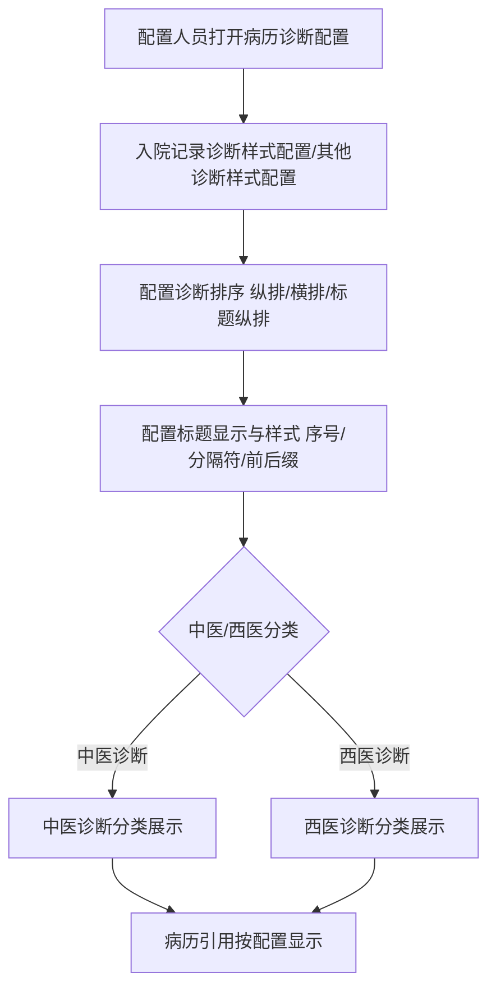
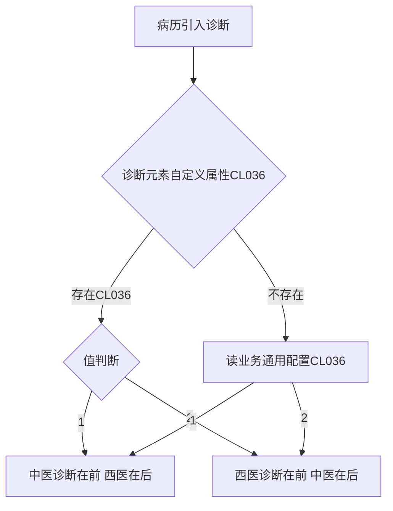

# BLGL-03-ZDYY-005 诊断样式与显示配置 _ Analyst - Spec

> **需求编号**：BLGL-03-ZDYY-005
> **父需求**：BLGL-03-ZDYY
> **关联PM Spec**：BLGL-03-ZDYY-005_诊断样式与显示配置_PM-spec.md
> **Spec版本**：V1.0
> **编写时间**：2026-08-15
> **编写人**：需求分析师

---

## 一、功能编号体系

### 1.1 功能层级结构

```
BLGL-03-ZDYY-005-001: 入院记录诊断样式配置
  ├─ BLGL-03-ZDYY-005-001-01: 诊断排序配置（纵排/横排/标题纵排）
  ├─ BLGL-03-ZDYY-005-001-02: 标题显示配置
  └─ BLGL-03-ZDYY-005-001-03: 样式配置（序号/分隔符/前后缀）

BLGL-03-ZDYY-005-002: 其他诊断样式配置
  ├─ BLGL-03-ZDYY-005-002-01: 新增入院/出院诊断类型
  ├─ BLGL-03-ZDYY-005-002-02: 新增初步诊断类型
  ├─ BLGL-03-ZDYY-005-002-03: 新增门诊诊断类型
  └─ BLGL-03-ZDYY-005-002-04: 样式配置

BLGL-03-ZDYY-005-003: 中医西医分类展示
  ├─ BLGL-03-ZDYY-005-003-01: 中医症候样式
  └─ BLGL-03-ZDYY-005-003-02: 中西医排序（CL036）

BLGL-03-ZDYY-005-004: 诊断名称显示配置
  └─ BLGL-03-ZDYY-005-004-01: 省略序号及分隔符参数

BLGL-03-ZDYY-005-005: 诊断显示格式
  ├─ BLGL-03-ZDYY-005-005-01: 纵排不显示分号
  ├─ BLGL-03-ZDYY-005-005-02: 前后缀空格裁剪
  └─ BLGL-03-ZDYY-005-005-03: 序号显示
```

### 1.2 功能编号表

| REQ-ID | 功能名称 | 类型 | 优先级 | 说明 |
|--------|---------|------|--------|------|
| BLGL-03-ZDYY-005-001 | 入院记录诊断样式配置 | 功能 | P0 | 入院记录诊断样式配置 |
| BLGL-03-ZDYY-005-001-01 | 诊断排序配置 | 子功能 | P0 | 纵排/横排/标题纵排 |
| BLGL-03-ZDYY-005-001-02 | 标题显示配置 | 子功能 | P0 | 标题输入/样式，中医西医标题 |
| BLGL-03-ZDYY-005-001-03 | 样式配置 | 子功能 | P0 | 序号/分隔符/前后缀 |
| BLGL-03-ZDYY-005-002 | 其他诊断样式配置 | 功能 | P0 | 其他文书诊断样式 |
| BLGL-03-ZDYY-005-002-01 | 新增入院/出院诊断类型 | 子功能 | P0 | 其他文书引用入院/出院诊断样式 |
| BLGL-03-ZDYY-005-002-02 | 新增初步诊断类型 | 子功能 | P1 | 其他诊断样式配置加初步诊断 |
| BLGL-03-ZDYY-005-002-03 | 新增门诊诊断类型 | 子功能 | P1 | 门诊诊断数据元（390000213） |
| BLGL-03-ZDYY-005-003 | 中医西医分类展示 | 功能 | P1 | 中医/西医诊断分类展示与排序 |
| BLGL-03-ZDYY-005-003-01 | 中医症候样式 | 子功能 | P1 | 中医诊断候症样式 |
| BLGL-03-ZDYY-005-003-02 | 中西医排序（CL036） | 子功能 | P1 | 中医诊断在前/西医诊断在前 |
| BLGL-03-ZDYY-005-004 | 诊断名称显示配置 | 功能 | P1 | 名称显示配置 |
| BLGL-03-ZDYY-005-004-01 | 省略序号及分隔符参数 | 子功能 | P1 | 中西医诊断只有一条时省略 |
| BLGL-03-ZDYY-005-005 | 诊断显示格式 | 功能 | P1 | 显示格式修复 |
| BLGL-03-ZDYY-005-005-01 | 纵排不显示分号 | 子功能 | P1 | 纵排/标题纵排不需要符号分隔 |
| BLGL-03-ZDYY-005-005-02 | 前后缀空格裁剪 | 子功能 | P1 | 去除前后缀多余空格 |
| BLGL-03-ZDYY-005-005-03 | 序号显示 | 子功能 | P1 | 入/出院诊断横排加序号分号隔断 |

---

## 二、核心业务流程

### 2.1 诊断样式配置主流程



### 2.2 中西医排序流程




---

## 三、功能规格说明

### BLGL-03-ZDYY-005-001: 入院记录诊断样式配置

#### 3.1.1 功能概述

病历诊断配置→入院记录诊断样式配置→诊断样式配置：诊断排序（纵排/横排/标题纵排）控制主从诊断、伴发病症、中医病名在页面上横排还是竖排；标题显示支持输入框（空格识别、加粗/斜体/下划线）；样式配置弹窗主诊断/从诊断/伴发病症/病名/症名默认显示并不可删除，可添加/删除/拖动调整顺序。中医/西医诊断的标题只有在选了中医诊断时才插入病历，只选西医诊断时不插入。

#### 3.1.2 用户角色

| 角色 | 使用场景 | 权限要求 | 操作频率 |
|------|---------|---------|---------|
| 病案管理员 | 配置入院记录诊断样式 | 配置权限 | 低频 |

#### 3.1.3 业务流程（Given/When/Then）

**Scenario 1: 配置诊断排序（主流程）**

```gherkin
Given:
  - 配置人员打开病历诊断配置→入院记录诊断样式配置→诊断样式配置

When:
  - 配置诊断排序为纵排/横排/标题纵排

Then:
  - 控制主从诊断、伴发病症、中医病名在页面横排还是竖排
  - 控制纵排时标题和诊断要不要换行
```


**Scenario 2: 配置标题显示**

```gherkin
Given:
  - 配置人员打开标题显示输入框

When:
  - 输入标题并设置样式（加粗/斜体/下划线）

Then:
  - 空格能够识别
  - 控制中医诊断/西医诊断的标题显示样式
```


**Scenario 3: 边界——标题插入条件**

```gherkin
Given:
  - 配置了中医/西医诊断标题

When:
  - 病历引用诊断

Then:
  - 中医诊断/西医诊断的标题只有在选了中医诊断时才插入病历
  - 只选西医诊断时不插入
```


#### 3.1.5 验收标准

| AC编号 | 验收标准 | 对应REQ-ID | 验证方法 | 验证场景 |
|--------|---------|-----------|---------|---------|
| AC-001 | 诊断排序配置生效，病历按配置排列 | BLGL-03-ZDYY-005-001 | 功能测试 | Scenario 1 |
| AC-002 | 中医诊断标题只在选中医诊断时插入 | BLGL-03-ZDYY-005-001 | 功能测试 | Scenario 3 |

---

### BLGL-03-ZDYY-005-002: 其他诊断样式配置

#### 3.2.1 功能概述

病历业务配置→病历诊断配置→其他诊断样式配置：左侧诊断类型新增"入院诊断、出院诊断"，配置内容跟其他诊断一样；入院记录以外的其他文书上引用的入院诊断和出院诊断样式按配置显示。新增初步诊断、门诊诊断（门诊诊断数据元 390000213）。

#### 3.2.2 用户角色

| 角色 | 使用场景 | 权限要求 | 操作频率 |
|------|---------|---------|---------|
| 病案管理员 | 配置其他文书诊断样式 | 配置权限 | 低频 |

#### 3.2.3 业务流程（Given/When/Then）

**Scenario 1: 新增入院/出院诊断类型（主流程）**

```gherkin
Given:
  - 配置人员打开其他诊断样式配置

When:
  - 左侧诊断类型新增"入院诊断、出院诊断"

Then:
  - 配置内容跟其他诊断一样
  - 入院记录以外的其他文书引用的入院/出院诊断按配置显示
```


**Scenario 2: 新增门诊诊断类型**

```gherkin
Given:
  - 其他诊断配置增加【门诊配置】

When:
  - 病历中的门诊诊断数据元（390000213）点击定位诊断控件门诊诊断

Then:
  - 引用到除了入院记录之外的病历时样式读取门诊配置
```


**Scenario 3: 边界——出院小结模板样式**

```gherkin
Given:
  - 出院小结模板上的入、出院诊断

When:
  - 按配置横排加序号

Then:
  - 诊断间分号隔断
```


#### 3.2.5 验收标准

| AC编号 | 验收标准 | 对应REQ-ID | 验证方法 | 验证场景 |
|--------|---------|-----------|---------|---------|
| AC-003 | 其他诊断样式配置新增入院/出院/初步/门诊诊断类型并生效 | BLGL-03-ZDYY-005-002 | 功能测试 | Scenario 1/2 |
| AC-004 | 出院小结入/出院诊断横排加序号、分号隔断 | BLGL-03-ZDYY-005-002 | 功能测试 | Scenario 3 |

---

### BLGL-03-ZDYY-005-003: 中医西医分类展示

#### 3.3.1 功能概述

入院记录诊断格式支持中医诊断，从诊断获取中医诊断的接口，诊断类型下新增中医和西医的分类展示。中医诊断候症显示样式新增样式（示例：腰痛（肾虚寒湿））。中医科和其他科室病历中医/西医诊断排列顺序不同：编辑器诊断数据元自定义属性 CL036（值 1=中医在前西医在后，2=西医在前中医在后），未配置读业务通用配置。

#### 3.3.2 用户角色

| 角色 | 使用场景 | 权限要求 | 操作频率 |
|------|---------|---------|---------|
| 病案管理员 | 配置中医/西医分类排序 | 配置权限 | 低频 |

#### 3.3.3 业务流程（Given/When/Then）

**Scenario 1: 中西医排序（主流程）**

```gherkin
Given:
  - 诊断元素自定义属性配置 CL036

When:
  - 诊断引入病历

Then:
  - 存在 CL036 时按值判断：1=中医在前西医在后，2=西医在前中医在后
  - 未配置时读业务通用配置 CL036
```


**Scenario 2: 中医症候样式**

```gherkin
Given:
  - 中医诊断候症显示样式配置

When:
  - 病历展示中医诊断

Then:
  - 按样式显示（示例：腰痛（肾虚寒湿））
```


#### 3.3.5 验收标准

| AC编号 | 验收标准 | 对应REQ-ID | 验证方法 | 验证场景 |
|--------|---------|-----------|---------|---------|
| AC-005 | CL036 自定义属性优先，未配置读通用配置，中医/西医顺序按配置 | BLGL-03-ZDYY-005-003 | 功能测试 | Scenario 1 |

---

### BLGL-03-ZDYY-005-004: 诊断名称显示配置

#### 3.4.1 功能概述

参数"中西医诊断只有一条时，是否省略序号以及分隔符"，值{是，否}默认否。配置为否时中医诊断、西医诊断样式完全按配置显示；配置为是时中医诊断只有一条中医疾病且没有中医症候、西医诊断只有一条一级诊断且没有二三级诊断时，每个类型诊断的显示样式省略配置的序号及【诊断内容】前面的点、顿号、英文右括号、中文右括号。

#### 3.4.2 用户角色

| 角色 | 使用场景 | 权限要求 | 操作频率 |
|------|---------|---------|---------|
| 病案管理员 | 配置名称显示 | 配置权限 | 低频 |

#### 3.4.3 业务流程（Given/When/Then）

**Scenario 1: 省略序号参数（主流程）**

```gherkin
Given:
  - 参数"中西医诊断只有一条时，是否省略序号以及分隔符"=是

When:
  - 病历引用仅一条中医/西医诊断

Then:
  - 省略配置的序号及【诊断内容】前面的点、顿号、英文右括号、中文右括号
```


**Scenario 2: 边界——参数为否**

```gherkin
Given:
  - 参数=否（默认）

When:
  - 病历引用诊断

Then:
  - 中医诊断、西医诊断样式完全按配置显示
```


#### 3.4.5 验收标准

| AC编号 | 验收标准 | 对应REQ-ID | 验证方法 | 验证场景 |
|--------|---------|-----------|---------|---------|
| AC-006 | 参数=是时省略序号及分隔符，=否完全按配置显示 | BLGL-03-ZDYY-005-004 | 功能测试 | Scenario 1/2 |

---

### BLGL-03-ZDYY-005-005: 诊断显示格式

#### 3.5.1 功能概述

诊断设置为纵排或标题纵排时，不管是模板预制元素默认/手动加载还是入院记录右键插入，诊断不需要符号分隔。去除诊断名称与前后缀之间自动加的多余空格，使显示效果紧密连接符合病历质控规范。

#### 3.5.2 用户角色

| 角色 | 使用场景 | 权限要求 | 操作频率 |
|------|---------|---------|---------|
| 住院医生 | 病历中查看诊断显示 | 病历书写权限 | 高频 |

#### 3.5.3 业务流程（Given/When/Then）

**Scenario 1: 纵排不显示分号（主流程）**

```gherkin
Given:
  - 诊断设置为纵排或者标题纵排

When:
  - 病历引用诊断（模板预制元素/右键插入）

Then:
  - 诊断不需要符号分隔
```


**Scenario 2: 前后缀空格裁剪**

```gherkin
Given:
  - 诊断带前后缀（如"急性阑尾炎"+"伴化脓性"）

When:
  - 病历引用诊断

Then:
  - 显示"急性阑尾炎伴化脓性"（无多余空格）
  - 前端拼接裁剪 + 后端返回 trim
```


**Scenario 3: 边界——序号显示**

```gherkin
Given:
  - 出院小结模板上入、出院诊断

When:
  - 横排加序号

Then:
  - 诊断间分号隔断
```


#### 3.5.5 验收标准

| AC编号 | 验收标准 | 对应REQ-ID | 验证方法 | 验证场景 |
|--------|---------|-----------|---------|---------|
| AC-007 | 纵排/标题纵排诊断不显示分号 | BLGL-03-ZDYY-005-005 | 功能测试 | Scenario 1 |
| AC-008 | 引用带前后缀诊断无多余空格 | BLGL-03-ZDYY-005-005 | 功能测试 | Scenario 2 |

---

## 四、排除范围

本需求不包含以下功能项：

1. **诊断数据接入与查询**（诊断组件查询/ICD-11）—— BLGL-03-ZDYY-001
2. **诊断变更同步与提醒**（CL025 同步方式/强制同步）—— BLGL-03-ZDYY-002
3. **诊断引用弹窗交互**（勾选/关闭/触发方式）—— BLGL-03-ZDYY-003
4. **诊断权限与签名**（上级加签/职称比较）—— BLGL-03-ZDYY-004
5. **诊断类型引用**（跨类别引用/去重/状态过滤）—— BLGL-03-ZDYY-006
6. **诊断插入与编辑**（插入位置/序号重算）—— BLGL-03-ZDYY-007
7. **诊断日期取值设置**（引入时间/下达时间）—— BLGL-03-ZDYY-008

---

## 五、业务规则清单

| 规则ID | 规则名称 | 规则描述 | 优先级 |
|--------|---------|---------|--------|
| BR-001 | 诊断排序 | 诊断排序：纵排/横排/标题纵排，控制主从诊断、伴发病症、中医病名横竖排 | P0 |
| BR-002 | 标题插入条件 | 中医/西医诊断的标题只有在选了中医诊断时才插入病历，只选西医诊断时不插入 | P0 |
| BR-003 | 其他样式类型 | 其他诊断样式配置新增入院/出院/初步/门诊诊断 | P0 |
| BR-004 | 中西医排序 | CL036 自定义属性优先，未配置读通用配置；1=中医在前西医在后，2=西医在前中医在后 | P1 |
| BR-005 | 省略序号 | 中西医诊断只有一条时是否省略序号及分隔符，默认否 | P1 |
| BR-006 | 纵排无分隔 | 诊断设置为纵排或标题纵排时不需要符号分隔 | P1 |
| BR-007 | 前后缀空格 | 去除诊断名称与前后缀之间多余空格，前端裁剪+后端 trim | P1 |

---

## 六、关联文档

| 文档类型 | 文档路径 | 说明 |
|---------|---------|------|
| 功能点Spec（模块级） | BLGL-03-ZDYY 诊断引用功能点Spec.md（V1.1，上级目录） | Phase 1 功能点索引 |
| PM-Spec（业务视角） | 本目录 BLGL-03-ZDYY-005_诊断样式与显示配置_PM-spec.md（V0.1） | PM 产出的 Spec 文档 |
| Spec（研发视角） | 本目录 BLGL-03-ZDYY-005_诊断样式与显示配置-Spec.md（V1.0） | 业务背景与目标 Spec |
| data-model.md | 待产出 | 架构师产出的数据建模文档 |
| design.md | 待产出 | 架构师产出的技术方案文档 |
| api-contract.md | 待产出 | 开发经理产出的 API 契约文档 |

---

## 七、待确认问题清单

| 编号 | 问题描述 | 缺失信息 | 影响范围 | 建议补充方 |
|------|---------|---------|---------|-----------|
| Q-001 | 诊断样式配置接口（update）完整字段定义 | API 契约 | -Spec 第5章 | 开发经理 |
| Q-002 | 样式配置项（诊断排序/标题/序号/分隔符）的概念 ID | 概念ID | 3.1.4 | 产品经理 |
| Q-003 | 中医症候样式的效果图 | 原型/效果图 | 3.3.3 Scenario 2 | 需求分析师 |
| Q-004 | 排序配置失效的根因 | 需求分析原文缺失 | 3.3.3 | 开发经理 |
| Q-005 | 性能指标（样式配置查询响应时间） | 资料区无量化指标 | -Spec 第8章 | 产品经理 |

---

## 填写检查清单

| 序号 | 检查项 | 是否完成 |
|:----:|--------|:--------:|
| 1 | 功能编号带父子层级 | ✅ |
| 2 | 每个 REQ-ID 有功能概述和用户角色 | ✅ |
| 3 | 主流程至少 1 个 Given/When/Then 场景 | ✅ |
| 4 | 异常流程至少 3 个 Given/When/Then 场景 | ✅ |
| 5 | 边界流程至少 2 个 Given/When/Then 场景 | ✅ |
| 6 | 每个 Given/When/Then 内容具体，不模糊 | ✅ |
| 7 | 数据字段定义完整（字段名、类型、必填、说明、概念ID） | ✅ |
| 8 | 验收标准 AC 编号独立，可验证 | ✅ |
| 9 | 验收标准无"功能正常"等模糊表述 | ✅ |
| 10 | 排除范围明确列出 | ✅ |
| 11 | 业务规则清单列出所有规则，每条标注来源 | ✅ |
| 12 | 流程图使用 Mermaid 格式（≥2 个） | ✅ |
| 13 | 关联文档索引包含 Phase 1 功能点Spec | ✅ |
| 14 | 待确认问题清单汇总了全文所有 ⏳ 项 | ✅ |
| 15 | 全文无占位符 `< >` 残留 | ✅ |
| 16 | 全文陈述可溯源至资料区（S1~S10 溯源核查） | ✅ |
| 17 | 人工审核确认完成 | ⏳ 待确认 |

---

**文档状态**：⬜ 待审核
**维护责任**：需求分析师规范组
**下次更新**：根据评审反馈优化

---

## 版本历史

| 版本 | 日期 | 变更说明 | 编写人 |
|------|------|---------|--------|
| V1.0 | 2026-08-15 | 初始版本 | 需求分析师 |
